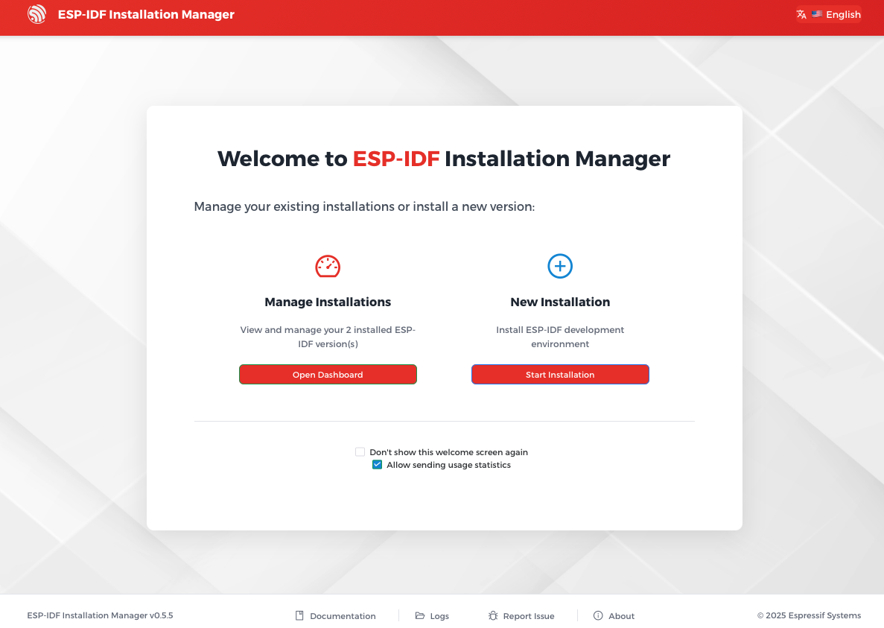
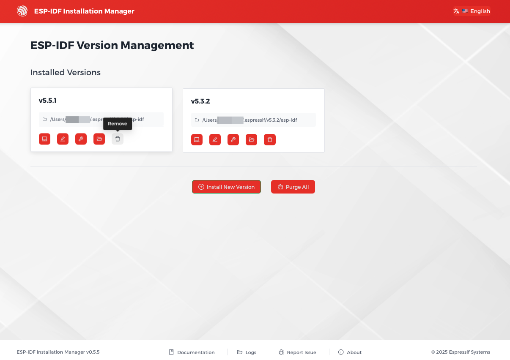

***********
Get Started
***********

:link_to_translation:`zh_CN:[中文]`

.. Please keep README.md in sync with these instructions.

This document is intended to help you set up the software development environment for the hardware based on the {IDF_TARGET_NAME} chip by Espressif. After that, a simple example will show you how to use ESP-IDF (Espressif IoT Development Framework) for menu configuration, then for building and flashing firmware onto an {IDF_TARGET_NAME} board.

.. include-build-file:: inc/version-note.inc

Introduction
============

{IDF_TARGET_NAME} is a system on a chip that integrates the following features:

.. only:: esp32

    * Wi-Fi (2.4 GHz band)
    * Bluetooth
    * Dual high performance Xtensa® 32-bit LX6 CPU cores
    * Ultra Low Power co-processor
    * Multiple peripherals

.. only:: esp32s2

    * Wi-Fi (2.4 GHz band)
    * High performance single core Xtensa® 32-bit LX7 CPU
    * Ultra Low Power co-processor running either RISC-V or FSM core
    * Multiple peripherals
    * Built-in security hardware
    * USB OTG interface

.. only:: esp32s3

    * Wi-Fi (2.4 GHz band)
    * Bluetooth Low Energy
    * Dual high performance Xtensa® 32-bit LX7 CPU cores
    * Ultra Low Power co-processor running either RISC-V or FSM core
    * Multiple peripherals
    * Built-in security hardware
    * USB OTG interface
    * USB Serial/JTAG Controller

.. only:: esp32c3

    * Wi-Fi (2.4 GHz band)
    * Bluetooth Low Energy
    * High performance 32-bit RISC-V single-core processor
    * Multiple peripherals
    * Built-in security hardware

.. only:: esp32c2

    * Wi-Fi (2.4 GHz band)
    * Bluetooth Low Energy
    * High performance 32-bit RISC-V single-core processor
    * Multiple peripherals
    * Intended for simple, high-volume IoT applications

.. only:: esp32c5

    * Wi-Fi 6 (2.4 and 5 GHz dual-band)
    * Bluetooth Low Energy
    * 802.15.4 Thread/Zigbee
    * High performance 32-bit RISC-V single-core processor
    * Multiple peripherals
    * Built-in security hardware

.. only:: esp32c6

    * Wi-Fi 6 (2.4 GHz band)
    * Bluetooth Low Energy
    * 802.15.4 Thread/Zigbee
    * High performance 32-bit RISC-V single-core processor
    * Multiple peripherals
    * Built-in security hardware

.. only:: esp32c61

    * Wi-Fi 6 (2.4 GHz band)
    * Bluetooth Low Energy
    * High performance 32-bit RISC-V single-core processor
    * Multiple peripherals
    * Built-in security hardware

.. only:: esp32h2

    * Bluetooth Low Energy
    * 802.15.4 Thread/Zigbee
    * High performance 32-bit RISC-V single-core processor
    * Multiple peripherals
    * Built-in security hardware

.. only:: esp32p4

    * High performance MCU with RISC-V dual-core processors
    * Powerful image and voice processing capability
    * Single-precision FPU and AI extensions
    * Rich set of peripherals including MIPI, USB, SDIO, and Ethernet
    * Built-in security hardware

.. only:: esp32p4

    Powered by 40 nm technology, {IDF_TARGET_NAME} offers excellent power efficiency, security, and reliability, making it suitable for a wide range of application scenarios and power consumption requirements.

.. only:: not esp32p4

    Powered by 40 nm technology, {IDF_TARGET_NAME} offers excellent power efficiency, RF performance, security, and reliability, making it suitable for a wide range of application scenarios and power consumption requirements.

Espressif provides basic hardware and software resources to help application developers realize their ideas using the {IDF_TARGET_NAME} series hardware. The software development framework by Espressif is intended for development of Internet-of-Things (IoT) applications with Wi-Fi, Bluetooth, power management and several other system features.

What You Need
=============

Hardware
~~~~~~~~

* An **{IDF_TARGET_NAME}** board.
* **USB cable** - USB A / micro USB B.
* **Computer** running Windows, Linux, or macOS.

.. note:: Currently, some of the development boards are using USB Type C connectors. Be sure you have the correct cable to connect your board!

If you have one of {IDF_TARGET_NAME} official development boards listed below, you can click on the link to learn more about the hardware.

.. only:: esp32

    .. toctree::
        :maxdepth: 1

        ESP32-DevKitC <https://docs.espressif.com/projects/esp-dev-kits/en/latest/esp32/esp32-devkitc/index.html>
        ESP32-DevKitM-1 <https://docs.espressif.com/projects/esp-dev-kits/en/latest/esp32/esp32-devkitm-1/index.html>
        ESP32-Ethernet-Kit <https://docs.espressif.com/projects/esp-dev-kits/en/latest/esp32/esp32-ethernet-kit/index.html>
        ESP32-PICO-KIT-1 <https://docs.espressif.com/projects/esp-dev-kits/en/latest/esp32/esp32-pico-kit-1/index.html>
        ESP32-PICO-DevKitM-2 <https://docs.espressif.com/projects/esp-dev-kits/en/latest/esp32/esp32-pico-devkitm-2/index.html>
        ESP32-LCDKit <https://docs.espressif.com/projects/esp-dev-kits/en/latest/esp32/esp32-lcdkit/index.html>

.. only:: esp32s2

    .. toctree::
        :maxdepth: 1

        ESP32-S2-DevKitM-1 <https://docs.espressif.com/projects/esp-dev-kits/en/latest/esp32s2/esp32-s2-devkitm-1/index.html>
        ESP32-S2-DevKitC-1 <https://docs.espressif.com/projects/esp-dev-kits/en/latest/esp32s2/esp32-s2-devkitc-1/index.html>

.. only:: esp32c3

    .. toctree::
        :maxdepth: 1

        ESP32-C3-DevKitM-1 <https://docs.espressif.com/projects/espressif-esp-dev-kits/en/latest/esp32c3/esp32-c3-devkitm-1/index.html>
        ESP32-C3-DevKitC-02 <https://docs.espressif.com/projects/espressif-esp-dev-kits/en/latest/esp32c3/esp32-c3-devkitc-02/index.html>
        ESP32-C3-LCDkit <https://docs.espressif.com/projects/esp-dev-kits/en/latest/esp32c3/esp32-c3-lcdkit/index.html>

.. only:: esp32s3

    .. toctree::
        :maxdepth: 1

        ESP32-S3-DevKitC-1 <https://docs.espressif.com/projects/esp-dev-kits/en/latest/esp32s3/esp32-s3-devkitc-1/index.html>
        ESP32-S3-DevKitM-1 <https://docs.espressif.com/projects/esp-dev-kits/en/latest/esp32s3/esp32-s3-devkitm-1/index.html>
        ESP32-S3-USB-OTG <https://docs.espressif.com/projects/esp-dev-kits/en/latest/esp32s3/esp32-s3-usb-otg/index.html>
        ESP32-S3-LCD-EV-Board <https://docs.espressif.com/projects/esp-dev-kits/en/latest/esp32s3/esp32-s3-lcd-ev-board/index.html>
        EchoEar <https://docs.espressif.com/projects/esp-dev-kits/en/latest/esp32s3/echoear/index.html>
        ESP-DualKey <https://docs.espressif.com/projects/esp-dev-kits/en/latest/esp32s3/esp-dualkey/index.html>

.. only:: esp32c2

    .. toctree::
        :maxdepth: 1

        ESP8684-DevKitM-1 <https://docs.espressif.com/projects/espressif-esp-dev-kits/en/latest/esp8684/esp8684-devkitm-1/index.html>
        ESP8684-DevKitC-02 <https://docs.espressif.com/projects/esp-dev-kits/en/latest/esp32c2/esp8684-devkitc-02/index.html>

.. only:: esp32c5

    .. toctree::
        :maxdepth: 1

        ESP32-C5-DevKitC-1 <https://docs.espressif.com/projects/esp-dev-kits/en/latest/esp32c5/esp32-c5-devkitc-1/index.html>

.. only:: esp32c6

    .. toctree::
        :maxdepth: 1

        ESP32-C6-DevKitC-1 <https://docs.espressif.com/projects/espressif-esp-dev-kits/en/latest/esp32c6/esp32-c6-devkitc-1/index.html>
        ESP32-C6-DevKitM-1 <https://docs.espressif.com/projects/espressif-esp-dev-kits/en/latest/esp32c6/esp32-c6-devkitm-1/index.html>

.. only:: esp32c61

    .. toctree::
        :maxdepth: 1

        ESP32-C61-DevKitC-1 <https://docs.espressif.com/projects/espressif-esp-dev-kits/en/latest/esp32c61/esp32-c61-devkitc-1/index.html>

.. only:: esp32p4

    .. toctree::
        :maxdepth: 1

        ESP32-P4-Function-EV-Board <https://docs.espressif.com/projects/esp-dev-kits/en/latest/esp32p4/esp32-p4-function-ev-board/index.html>
        ESP32-P4-EYE <https://docs.espressif.com/projects/esp-dev-kits/en/latest/esp32p4/esp32-p4-eye/index.html>

.. _get-started-get-prerequisites:

Software
~~~~~~~~

To start using ESP-IDF on **{IDF_TARGET_NAME}**, you need the following software:

    * **Toolchain** to compile code for {IDF_TARGET_NAME}
    * **Build tools** - CMake and Ninja to build a full **Application** for {IDF_TARGET_NAME}
    * **ESP-IDF** that essentially contains API (software libraries and source code) for {IDF_TARGET_NAME} and scripts to operate the **Toolchain**

.. figure:: ../../_static/what-you-need.png
    :align: center
    :alt: Development of applications for {IDF_TARGET_NAME}
    :figclass: align-center

.. _get-started-step-by-step:
.. _get-started-how-to-get-esp-idf:
.. _get-started-set-up-tools:

Installation
============

To install ESP-IDF, build tools, and the toolchain, use the ESP-IDF Installation Manager (EIM) available for multiple operating systems.

The EIM provides two installation options:

- **Graphical User Interface (GUI)**: Offers a user-friendly interface, ideal for most users.
- **Command Line Interface (CLI)**: Suitable for CI/CD pipelines and automated installations.

.. toctree::
    :maxdepth: 1

    windows-setup
    linux-setup
    macos-setup

.. _get-started-build:

Build Your First Project
========================

Once you have the ESP-IDF installed, you can build your first project either using an IDE or from the command line.

Build in IDE
~~~~~~~~~~~~~

The ESP-IDF versions installed through EIM can be used in the following IDEs, providing a graphical development experience:

- `Espressif-IDE <https://docs.espressif.com/projects/espressif-ide/en/latest/>`_ based on Eclipse CDT

    It includes IDF Eclipse plugins, essential Eclipse CDT plugins, and other third-party plugins from the Eclipse platform to support building ESP-IDF applications.
- Visual Studio Code integrated with the `ESP-IDF Extension for VS Code <https://docs.espressif.com/projects/vscode-esp-idf-extension/en/latest/index.html>`_

    It allows you to develop, build, flash, and monitor ESP-IDF applications directly within the Visual Studio Code.

For instructions on how to set up and use these IDEs with ESP-IDF, please refer to their respective documentation linked above.

Build from Command Line
~~~~~~~~~~~~~~~~~~~~~~~~

To start a new project, build it, flash to {IDF_TARGET_NAME}, and monitor the device output from the command line, follow instructions for your operating system:

.. toctree::
    :maxdepth: 1

    windows-start-project
    linux-macos-start-project

.. note::

    If you have not yet installed ESP-IDF, please go to :ref:`get-started-step-by-step` and follow the instructions there to install all required software before proceeding.

Uninstall ESP-IDF
=================

To uninstall ESP-IDF and related tools installed via EIM, you can use either the graphical user interface (GUI) or the command line interface (CLI).

Uninstall Using EIM GUI
~~~~~~~~~~~~~~~~~~~~~~~

Launch the ESP-IDF Installation Manager. Under ``Manage Installations``, click ``Open Dashboard``.

    Open Dashboard in EIM GUI

To remove a specific ESP-IDF version, click the ``Remove`` button under the version you want to remove.

To remove all ESP-IDF versions, click ``Purge All`` button at the bottom of the page.

    Uninstall ESP-IDF in EIM GUI

Uninstall Using EIM CLI
~~~~~~~~~~~~~~~~~~~~~~~

To remove a specific ESP-IDF version, for example v5.4.2, run the following command in your terminal:

.. code-block:: bash

    eim uninstall v5.4.2

To remove all ESP-IDF versions, run the following command in your terminal:

.. code-block:: bash

    eim purge

Related Documents
=================

* `ESP-IDF Installation Manager (EIM) documentation <https://docs.espressif.com/projects/idf-im-ui/en/latest/>`_
* `Espressif-IDE (ESP-IDF Eclipse Plugin) GitHub repository <https://github.com/espressif/idf-eclipse-plugin/tree/master>`_
* `ESP-IDF Extension for VS Code GitHub repository <https://github.com/espressif/vscode-esp-idf-extension/tree/master>`_

.. _Stable version: https://docs.espressif.com/projects/esp-idf/en/stable/
