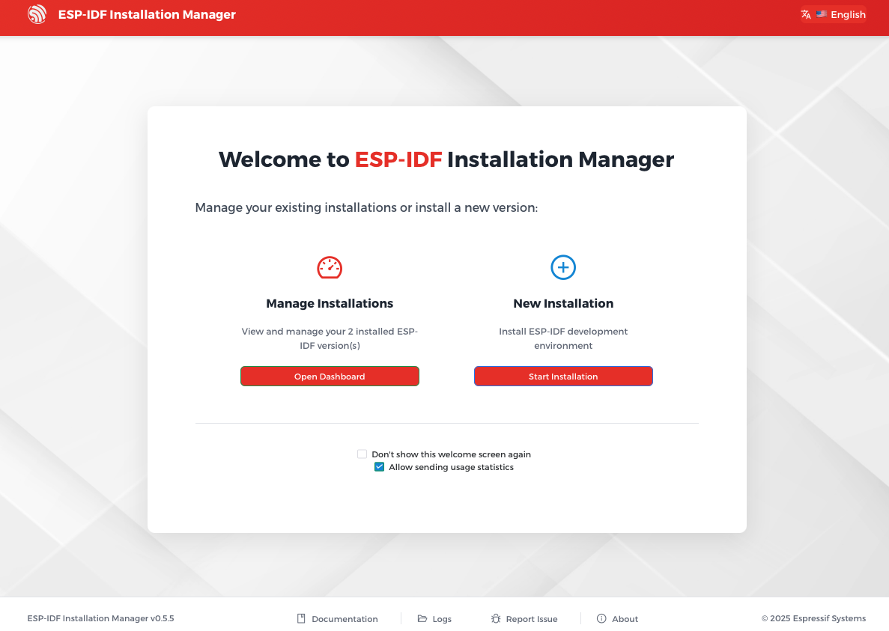
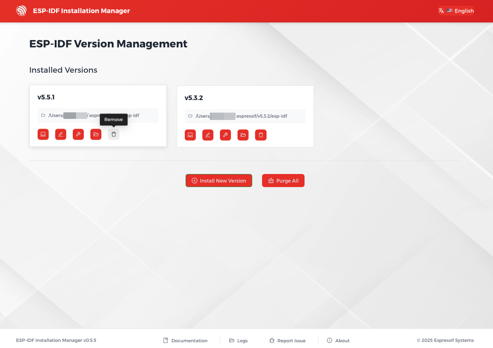

Uninstall ESP-IDF Using EIM GUI
================================

:link_to_translation:`zh_CN:[中文]`

Launch the ESP-IDF Installation Manager. Under ``Manage Installations``, click ``Open Dashboard``.

    Open Dashboard in EIM GUI

To remove a specific ESP-IDF version, click the ``Remove`` button under the version you want to remove.

To remove all ESP-IDF versions, click the ``Purge All`` button at the bottom of the page.

    Uninstall ESP-IDF in EIM GUI

Uninstall ESP-IDF Using EIM CLI
================================

To remove a specific ESP-IDF version, for example v5.4.2, run the following command in your terminal:

.. code-block:: bash

    eim remove v5.4.2

To remove all ESP-IDF versions, run the following command in your terminal:

.. code-block:: bash

    eim purge
