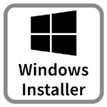

***********************************************
Standard Setup of Toolchain for Windows
***********************************************

:link_to_translation:`zh_CN:[中文]`

Introduction
============

ESP-IDF requires some prerequisite tools to be installed so you can build firmware for supported chips. The prerequisite tools include Python, Git, cross-compilers, CMake and Ninja build tools.

For this Getting Started we are going to use the Command Prompt, but after ESP-IDF is installed you can use `Eclipse Plugin <https://github.com/espressif/idf-eclipse-plugin/blob/master/README.md>`_ or another graphical IDE with CMake support instead.

.. note::
    Limitations:
    - The installation path of ESP-IDF and ESP-IDF Tools must not be longer than 90 characters. Too long installation paths might result in a failed build.
    - The installation path of Python or ESP-IDF must not contain white spaces or parentheses.
    - The installation path of Python or ESP-IDF should not contain special characters (non-ASCII) unless the operating system is configured with "Unicode UTF-8" support.

    System Administrator can enable the support via ``Control Panel`` > Change ``date``, ``time``, or ``number`` formats > ``Administrative tab`` > Change ``system locale`` > check the option ``Beta: Use Unicode UTF-8 for worldwide language support`` > ``Ok`` > reboot the computer.

.. _get-started-windows-tools-installer:

ESP-IDF Tools Installer
=======================

The easiest way to install ESP-IDF's prerequisites is to download one of ESP-IDF Tools Installers.

+-------------------+--------------------------------+
| |download-logo|   | `Windows Installer Download`_  |
+-------------------+--------------------------------+

.. _Windows Installer Download: https://dl.espressif.com/dl/esp-idf/?idf=4.4

What Is the Usecase for Online and Offline Installer
~~~~~~~~~~~~~~~~~~~~~~~~~~~~~~~~~~~~~~~~~~~~~~~~~~~~

Online Installer is very small and allows the installation of all available releases of ESP-IDF. The installer downloads only necessary dependencies including `Git For Windows`_  during the installation process. The installer stores downloaded files in the cache directory ``%userprofile%\.espressif``

Offline Installer does not require any network connection. The installer contains all required dependencies including `Git For Windows`_ .

Components of the Installation
~~~~~~~~~~~~~~~~~~~~~~~~~~~~~~

The installer deploys the following components:

- Embedded Python
- Cross-compilers
- OpenOCD
- CMake_ and Ninja_ build tools
- ESP-IDF

The installer also allows reusing the existing directory with ESP-IDF. The recommended directory is ``%userprofile%\Desktop\esp-idf`` where ``%userprofile%`` is your home directory.

Launching ESP-IDF Environment
~~~~~~~~~~~~~~~~~~~~~~~~~~~~~

At the end of the installation process you can check out option ``Run ESP-IDF PowerShell Environment`` or ``Run ESP-IDF Command Prompt (cmd.exe)``. The installer launches ESP-IDF environment in selected prompt.

``Run ESP-IDF PowerShell Environment``:

.. figure:: ../../_static/esp-idf-installer-screenshot-powershell.png
    :align: center
    :alt: Completing the ESP-IDF Tools Setup Wizard with Run ESP-IDF PowerShell Environment
    :figclass: align-center

    Completing the ESP-IDF Tools Setup Wizard with Run ESP-IDF PowerShell Environment

.. figure:: ../../_static/esp-idf-installer-powershell.png
    :align: center
    :alt: ESP-IDF PowerShell
    :figclass: align-center

    ESP-IDF PowerShell

``Run ESP-IDF Command Prompt (cmd.exe)``:

.. figure:: ../../_static/esp-idf-installer-screenshot.png
    :align: center
    :alt: Completing the ESP-IDF Tools Setup Wizard with Run ESP-IDF Command Prompt (cmd.exe)
    :figclass: align-center

    Completing the ESP-IDF Tools Setup Wizard with Run ESP-IDF Command Prompt (cmd.exe)

.. figure:: ../../_static/esp-idf-installer-command-prompt.png
    :align: center
    :alt: ESP-IDF Command Prompt
    :figclass: align-center

    ESP-IDF Command Prompt

Using the Command Prompt
========================

For the remaining Getting Started steps, we are going to use the Windows Command Prompt.

ESP-IDF Tools Installer also creates a shortcut in the Start menu to launch the ESP-IDF Command Prompt. This shortcut launches the Command Prompt (cmd.exe) and runs ``export.bat`` script to set up the environment variables (``PATH``, ``IDF_PATH`` and others). Inside this command prompt, all the installed tools are available.

Note that this shortcut is specific to the ESP-IDF directory selected in the ESP-IDF Tools Installer. If you have multiple ESP-IDF directories on the computer (for example, to work with different versions of ESP-IDF), you have two options to use them:

1. Create a copy of the shortcut created by the ESP-IDF Tools Installer, and change the working directory of the new shortcut to the ESP-IDF directory you wish to use.

2. Alternatively, run ``cmd.exe``, then change to the ESP-IDF directory you wish to use, and run ``export.bat``. Note that unlike the previous option, this way requires Python and Git to be present in ``PATH``. If you get errors related to Python or Git not being found, use the first option.

First Steps on ESP-IDF
======================

.. _get-started-windows-first-steps:

.. include:: windows-start-project.rst
.. include:: start-project.rst

Related Documents
=================

For advanced users who want to customize the install process:

* :doc:`windows-setup-update`
* :doc:`establish-serial-connection`
* `Eclipse Plugin <https://github.com/espressif/idf-eclipse-plugin/blob/master/README.md>`_
* `VSCode Extension <https://github.com/espressif/vscode-esp-idf-extension/blob/master/docs/tutorial/install.md>`_
* :doc:`../api-guides/tools/idf-monitor`

.. toctree::
    :hidden:
    :maxdepth: 1

    windows-setup-update
    establish-serial-connection
    flashing-troubleshooting

.. _CMake: https://cmake.org/download/
.. _Ninja: https://ninja-build.org/
.. _Python: https://www.python.org/downloads/windows/
.. _Git for Windows: https://gitforwindows.org/
.. _Github Desktop: https://desktop.github.com/
