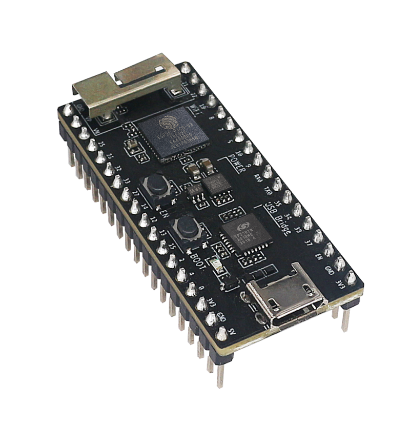
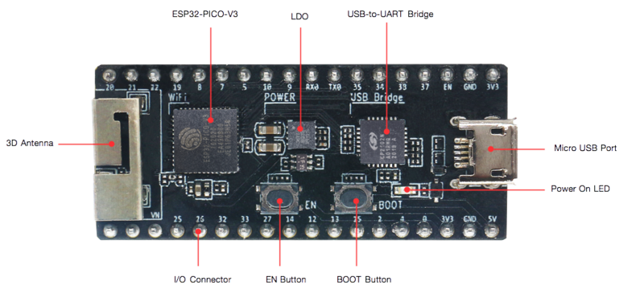
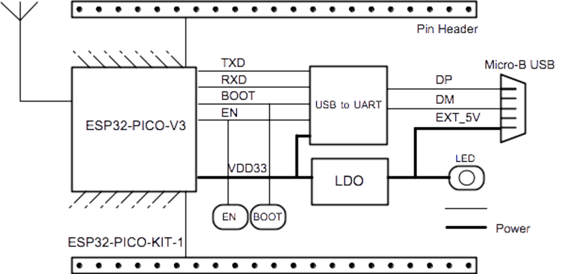
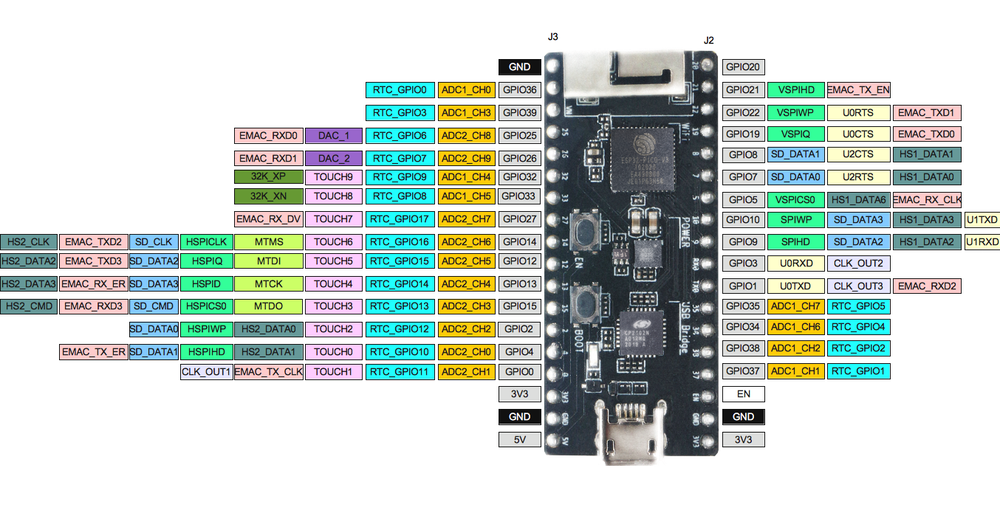

ESP32-PICO-KIT-1
****************

:link_to_translation:`zh_CN:[中文]`

Overview
========

ESP32-PICO-KIT-1 is an ESP32-based development board produced by `Espressif <https://espressif.com>`_.

The core of this board is `ESP32-PICO-V3 <https://www.espressif.com/en/products/socs>`_ - a System-in-Package (SiP) module with complete Wi-Fi and Bluetooth® functionalities. Compared to other ESP32 modules, ESP32-PICO-V3 integrates the following peripheral components in one single package, which otherwise would need to be installed separately:

- 40 MHz crystal oscillator
- 4 MB flash
- Filter capacitors
- RF matching network

This setup reduces the costs of additional external components as well as the cost of assembly and testing and also increases the overall usability of the product.

The development board features a USB-to-UART Bridge circuit which allows developers to connect the board to a computer's USB port for flashing and debugging.

All the IO signals and system power on ESP32-PICO-V3 are led out to two rows of 18 x 0.1" header pads on both sides of the development board for easy access. For compatibility with Dupont wires, all header pads are populated with two rows of male pin headers.

.. note::

    ESP32-PICO-KIT-1 comes with male headers by default.

ESP32-PICO-KIT-1 provides the users with hardware for development of applications based on the ESP32, making it easier for users to explore ESP32 functionalities.

    ESP32-PICO-KIT-1 Overview (click to enlarge)

This guide covers:

- `Getting Started`_: Provides an overview of the ESP32-PICO-KIT-1 and software setup instructions to get started.
- `Contents and Packaging`_: Provides information about packaging and contents for retail and wholesale orders.
- `Hardware Reference`_: Provides more detailed information about the ESP32-PICO-KIT-1's hardware.
- `Hardware Revision Details`_: Covers revision history, known issues, and links to user guides for previous versions of the ESP32-PICO-KIT-1.
- `Related Documents`_: Gives links to related documentation.

Getting Started
===============

This section describes how to get started with the ESP32-PICO-KIT-1. It begins with a few introductory sections about the ESP32-PICO-KIT-1, then Section `Start Application Development`_ provides instructions on how to flash firmware onto the ESP32-PICO-KIT-1.

.. _get-started-pico-kit-1-board-front:

Description of Components
-------------------------

The following figure and the table below describe the key components, interfaces, and controls of the ESP32-PICO-KIT-1 board.

    ESP32-PICO-KIT-1 board layout - front (click to enlarge)

Below is the description of the items identified in the figure starting from the top left corner and going clockwise.

.. list-table::
   :widths: 10 25
   :header-rows: 1

   * - Key Component
     - Description
   * - ESP32-PICO-V3
     - Standard ESP32-PICO-V3 module soldered to the ESP32-PICO-KIT-1 board. The complete ESP32 system on a chip (ESP32 SoC) has been integrated into the SiP module, requiring only an external antenna with LC matching network, decoupling capacitors, and a pull-up resistor for EN signals to function properly.
   * - LDO
     - 5V-to-3.3V Low dropout voltage regulator (LDO).
   * - USB-to-UART bridge
     - CP2102N, single-chip USB-to-UART bridge that offers up to 3 Mbps transfers rates.
   * - Micro USB Port
     - USB interface. Power supply for the board as well as the communication interface between a computer and the board.
   * - 5V Power On LED
     - This red LED turns on when power is supplied to the board. For details, see the schematic in `Related Documents`_.
   * - I/O Connector
     - All the pins on ESP32-PICO-V3 are broken out to pin headers. You can program ESP32 to enable multiple functions, such as PWM, ADC, DAC, I2C, I2S, SPI, etc. For details, please see Section `Pin Descriptions`_.
   * - BOOT Button
     - Download button. Holding down **Boot** and then pressing **EN** initiates Firmware Download mode for downloading firmware through the serial port.
   * - EN Button
     - Reset button.

Start Application Development
-----------------------------

Before powering up your ESP32-PICO-KIT-1, please make sure that the board is in good condition with no obvious signs of damage.

Required Hardware
"""""""""""""""""

- 1 x ESP32-PICO-KIT-1
- 1 x USB 2.0 A to Micro B cable
- 1 x Computer running Windows, Linux, or macOS

.. _user-guide-pico-kit-1-software-setup:

Software Setup
""""""""""""""

Please proceed to :doc:`../../get-started/index`, where Section :ref:`get-started-step-by-step` will quickly help you set up the development environment.

Contents and Packaging
======================

Retail Orders
-------------

If you order one or several samples of the board, each ESP32-PICO-KIT-1 development board comes in an individual package.

For retail orders, please go to https://www.espressif.com/en/contact-us/get-samples.

Wholesale Orders
----------------

If you order in bulk, the boards come in large cardboard boxes.

For wholesale orders, please go to https://www.espressif.com/en/contact-us/sales-questions.

Hardware Reference
==================

Block Diagram
-------------

The block diagram below shows the main components of ESP32-PICO-KIT-1 and their interconnections.

    ESP32-PICO-KIT-1 Block Diagram (click to enlarge)

Power Supply Options
--------------------

There are three mutually exclusive ways to provide power to the board:

* Micro USB port, default power supply
* 5V/GND header pins
* 3V3/GND header pins

.. warning::

    The power supply must be provided using **one and only one of the options above**, otherwise the board and/or the power supply source can be damaged.

Pin Descriptions
----------------

The two tables below provide the **Name** and **Function** of I/O header pins on both sides of the board, see :ref:`get-started-pico-kit-1-board-front`. The pin numbering and header names are the same as in the schematic given in `Related Documents`_.

Header J2
"""""""""

.. list-table::
   :widths: 5 5 5 35
   :header-rows: 1

   * - No.
     - Name
     - Type
     - Function
   * - 1
     - IO20
     - I/O
     - GPIO20
   * - 2
     - IO21
     - I/O
     - GPIO21, VSPIHD, EMAC_TX_EN
   * - 3
     - IO22
     - I/O
     - GPIO22, VSPIWP, U0RTS, EMAC_TXD1
   * - 4
     - IO19
     - I/O
     - GPIO19, VSPIQ, U0CTS, EMAC_TXD0
   * - 5
     - IO8
     - I/O
     - GPIO8, SD_DATA1, HS1_DATA1, U2CTS
   * - 6
     - IO7
     - I/O
     - GPIO7, SD_DATA0, HS1_DATA0, U2RTS
   * - 7
     - IO5
     - I/O
     - GPIO5, VSPICS0, HS1_DATA6, EMAC_RX_CLK
   * - 8
     - IO10
     - I/O
     - GPIO10, SD_DATA3, SPIWP, HS1_DATA3, U1TXD
   * - 9
     - IO9
     - I/O
     - GPIO9, SD_DATA2, SPIHD, HS1_DATA2, U1RXD
   * - 10
     - RXD0
     - I/O
     - GPIO3, U0RXD :ref:`(See 1) <get-started-pico-kit-1-pin-notes>`, CLK_OUT2
   * - 11
     - TXD0
     - I/O
     - GPIO1, U0TXD :ref:`(See 1) <get-started-pico-kit-1-pin-notes>`, CLK_OUT3, EMAC_RXD2
   * - 12
     - IO35
     - I
     - ADC1_CH7, RTC_GPIO5
   * - 13
     - IO34
     - I
     - ADC1_CH6, RTC_GPIO4
   * - 14
     - IO38
     - I
     - GPIO38, ADC1_CH2, RTC_GPIO2
   * - 15
     - IO37
     - I
     - GPIO37, ADC1_CH1, RTC_GPIO1
   * - 16
     - EN
     - I
     - CHIP_PU
   * - 17
     - GND
     - P
     - Ground
   * - 18
     - VDD33 (3V3)
     - P
     - 3.3 V power supply

Header J3
"""""""""

.. list-table::
   :widths: 5 5 5 35
   :header-rows: 1

   * - No.
     - Name
     - Type
     - Function
   * - 1
     - GND
     - P
     - Ground
   * - 2
     - SENSOR_VP (FSVP)
     - I
     - GPIO36, ADC1_CH0, RTC_GPIO0
   * - 3
     - SENSOR_VN (FSVN)
     - I
     - GPIO39, ADC1_CH3, RTC_GPIO3
   * - 4
     - IO25
     - I/O
     - GPIO25, DAC_1, ADC2_CH8, RTC_GPIO6, EMAC_RXD0
   * - 5
     - IO26
     - I/O
     - GPIO26, DAC_2, ADC2_CH9, RTC_GPIO7, EMAC_RXD1
   * - 6
     - IO32
     - I/O
     - 32K_XP :ref:`(See 2a) <get-started-pico-kit-1-pin-notes>`, ADC1_CH4, TOUCH9, RTC_GPIO9
   * - 7
     - IO33
     - I/O
     - 32K_XN :ref:`(See 2b) <get-started-pico-kit-1-pin-notes>`, ADC1_CH5, TOUCH8, RTC_GPIO8
   * - 8
     - IO27
     - I/O
     - GPIO27, ADC2_CH7, TOUCH7, RTC_GPIO17, EMAC_RX_DV
   * - 9
     - IO14
     - I/O
     - ADC2_CH6, TOUCH6, RTC_GPIO16, MTMS, HSPICLK, HS2_CLK, SD_CLK, EMAC_TXD2
   * - 10
     - IO12
     - I/O
     - ADC2_CH5, TOUCH5, RTC_GPIO15, MTDI :ref:`(See 3) <get-started-pico-kit-1-pin-notes>`, HSPIQ, HS2_DATA2, SD_DATA2, EMAC_TXD3
   * - 11
     - IO13
     - I/O
     - ADC2_CH4, TOUCH4, RTC_GPIO14, MTCK, HSPID, HS2_DATA3, SD_DATA3, EMAC_RX_ER
   * - 12
     - IO15
     - I/O
     - ADC2_CH3, TOUCH3, RTC_GPIO13, MTDO, HSPICS0, HS2_CMD, SD_CMD, EMAC_RXD3
   * - 13
     - IO2
     - I/O
     - ADC2_CH2, TOUCH2, RTC_GPIO12, HSPIWP, HS2_DATA0, SD_DATA0
   * - 14
     - IO4
     - I/O
     - ADC2_CH0, TOUCH0, RTC_GPIO10, HSPIHD, HS2_DATA1, SD_DATA1, EMAC_TX_ER
   * - 15
     - IO0
     - I/O
     - ADC2_CH1, TOUCH1, RTC_GPIO11, CLK_OUT1, EMAC_TX_CLK
   * - 16
     - VDD33 (3V3)
     - P
     - 3.3V power supply
   * - 17
     - GND
     - P
     - Ground
   * - 18
     - EXT_5V (5V)
     - P
     - 5V power supply

.. _get-started-pico-kit-1-pin-notes:

.. note::

    1. This pin is connected to the pin of the USB bridge chip on the board.
    2. 32.768 kHz crystal oscillator:
       a) input
       b) output
    3. The operating voltage of ESP32-PICO-KIT-1's embedded SPI flash is 3.3 V. Therefore, the strapping pin MTDI should be pulled down during the module power-on reset. If connected, please make sure that this pin is not held up on reset.

Pin Layout
""""""""""

    ESP32-PICO-KIT-1 Pin Layout(click to enlarge)

Hardware Revision Details
=========================

No previous versions available.

Related Documents
=================

* `ESP32-PICO-V3 Datasheet <https://espressif.com/sites/default/files/documentation/esp32-pico-v3_datasheet_en.pdf>`_ (PDF)
* `ESP Product Selector <https://products.espressif.com/#/product-selector?names=>`_
* `ESP32-PICO-KIT-1 Schematic <https://dl.espressif.com/dl/schematics/SCH_ESP32-PICO-KIT-1_V1_0_20200811A.pdf>`_ (PDF)
* `ESP32-PICO-KIT-1 PCB Layout <https://dl.espressif.com/dl/schematics/PCB_ESP32-PICO-KIT-1_V1.0_20200811.pdf>`_ (PDF)

For other design documentation for the board, please contact us at sales@espressif.com.
