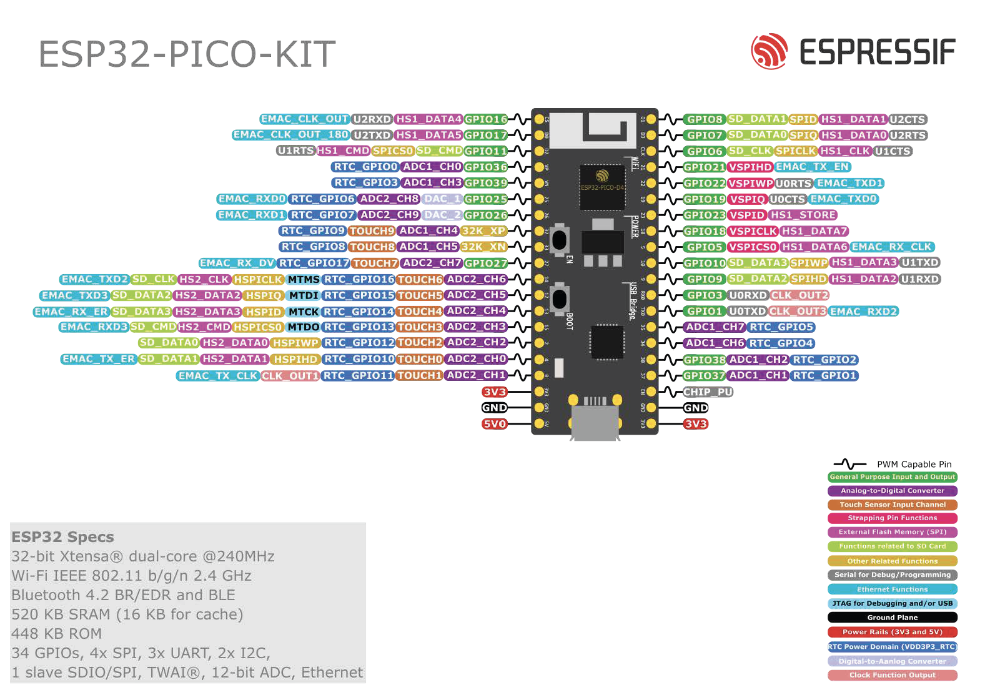

ESP32-PICO-KIT V4/V4.1 Getting Started Guide
============================================

:link_to_translation:`zh_CN:[中文]`

This guide shows how to get started with the ESP32-PICO-KIT V4/V4.1 mini development board. For the description of other ESP32-PICO-KIT versions, please check :doc:`../../hw-reference/index`.

This particular description covers ESP32-PICO-KIT V4 and V4.1. The difference is the upgraded USB-UART bridge from CP2102 in V4 with up to 1 Mbps transfer rates to CP2102N in V4.1 with up to 3 Mbps transfer rates.

What You Need
-------------

* :ref:`ESP32-PICO-KIT mini development board <get-started-pico-kit-v4-board-front>`
* USB 2.0 A to Micro B cable
* Computer running Windows, Linux, or macOS

You can skip the introduction sections and go directly to Section `Start Application Development`_.

Overview
--------

ESP32-PICO-KIT is an ESP32-based mini development board produced by `Espressif <https://espressif.com>`_.

The core of this board is ESP32-PICO-D4 - a System-in-Package (SiP) module with complete Wi-Fi and Bluetooth® functionalities. Compared to other ESP32 modules, ESP32-PICO-D4 integrates the following peripheral components in one single package, which otherwise would need to be installed separately:

- 40 MHz crystal oscillator
- 4 MB flash
- Filter capacitors
- RF matching links

This setup reduces the costs of additional external components as well as the cost of assembly and testing and also increases the overall usability of the product.

The development board features a USB-UART Bridge circuit which allows developers to connect the board to a computer's USB port for flashing and debugging.

All the IO signals and system power on ESP32-PICO-D4 are led out to two rows of 20 x 0.1" header pads on both sides of the development board for easy access. For compatibility with Dupont wires, 2 x 17 header pads are populated with two rows of male pin headers. The remaining 2 x 3 header pads beside the antenna are not populated. These pads may be populated later by the user if required.

.. note::

    1. There are two versions of ESP32-PICO-KIT boards, respectively with male headers and female headers. In this guide, the male header version is taken as an example.
    2. The 2 x 3 pads not populated with pin headers are connected to the flash memory embedded in the ESP32-PICO-D4 SiP module. For more details, see module's datasheet in `Related Documents`_.

Functionality Overview
----------------------

The block diagram below shows the main components of ESP32-PICO-KIT and their interconnections.

.. figure:: ../../../_static/esp32-pico-kit-v4-functional-block-diagram.png
    :align: center
    :alt: ESP32-PICO-KIT functional block diagram
    :figclass: align-center

    ESP32-PICO-KIT block diagram

Functional Description
----------------------

The following figure and the table below describe the key components, interfaces, and controls of the ESP32-PICO-KIT board.

.. _get-started-pico-kit-v4-board-front:

.. figure:: ../../../_static/esp32-pico-kit-v4.1-f-layout.jpeg
    :align: center
    :alt: ESP32-PICO-KIT board layout (with female headers)
    :figclass: align-center

    ESP32-PICO-KIT board layout (with female headers)

Below is the description of the items identified in the figure starting from the top left corner and going clockwise.

.. list-table::
    :widths: 25 75
    :header-rows: 1

    * - Key Component
      - Description
    * - ESP32-PICO-D4
      - Standard ESP32-PICO-D4 module soldered to the ESP32-PICO-KIT board. The complete ESP32 system on a chip (ESP32 SoC) has been integrated into the SiP module, requiring only an external antenna with LC matching network, decoupling capacitors, and a pull-up resistor for EN signals to function properly.
    * - LDO
      - 5V-to-3.3V Low dropout voltage regulator (LDO).
    * - USB-UART bridge
      - Single-chip USB-UART bridge: CP2102 in V4 provides up to 1 Mbps transfer rates and CP2102N in V4.1 offers up to 3 Mbps transfers rates.
    * - Micro USB Port
      - USB interface. Power supply for the board as well as the communication interface between a computer and the board.
    * - 5V Power On LED
      - This red LED turns on when power is supplied to the board. For details, see the schematics in `Related Documents`_.
    * - I/O
      - All the pins on ESP32-PICO-D4 are broken out to pin headers. You can program ESP32 to enable multiple functions, such as PWM, ADC, DAC, I2C, I2S, SPI, etc. For details, please see Section `Pin Descriptions`_.
    * - BOOT Button
      - Download button. Holding down **Boot** and then pressing **EN** initiates Firmware Download mode for downloading firmware through the serial port.
    * - EN Button
      - Reset button.

Power Supply Options
--------------------

There are three mutually exclusive ways to provide power to the board:

* Micro USB port, default power supply
* 5V / GND header pins
* 3V3 / GND header pins

.. warning::

    The power supply must be provided using **one and only one of the options above**, otherwise the board and/or the power supply source can be damaged.

Pin Descriptions
----------------

The two tables below provide the **Name** and **Function** of I/O header pins on both sides of the board, see :ref:`get-started-pico-kit-v4-board-front`. The pin numbering and header names are the same as in the schematic given in `Related Documents`_.

Header J2
"""""""""

======  =================  ======  ======================================================
No.     Name               Type    Function
======  =================  ======  ======================================================
1       FLASH_SD1 (FSD1)   I/O     | GPIO8, SD_DATA1, SPID, HS1_DATA1 :ref:`(See 1) <get-started-pico-kit-v4-pin-notes>` , U2CTS
2       FLASH_SD3 (FSD3)   I/O     | GPIO7, SD_DATA0, SPIQ, HS1_DATA0 :ref:`(See 1) <get-started-pico-kit-v4-pin-notes>` , U2RTS
3       FLASH_CLK (FCLK)   I/O     | GPIO6, SD_CLK, SPICLK, HS1_CLK :ref:`(See 1) <get-started-pico-kit-v4-pin-notes>` , U1CTS
4       IO21               I/O     | GPIO21, VSPIHD, EMAC_TX_EN
5       IO22               I/O     | GPIO22, VSPIWP, U0RTS, EMAC_TXD1
6       IO19               I/O     | GPIO19, VSPIQ, U0CTS, EMAC_TXD0
7       IO23               I/O     | GPIO23, VSPID, HS1_STROBE
8       IO18               I/O     | GPIO18, VSPICLK, HS1_DATA7
9       IO5                I/O     | GPIO5, VSPICS0, HS1_DATA6, EMAC_RX_CLK
10      IO10               I/O     | GPIO10, SD_DATA3, SPIWP, HS1_DATA3, U1TXD
11      IO9                I/O     | GPIO9, SD_DATA2, SPIHD, HS1_DATA2, U1RXD
12      RXD0               I/O     | GPIO3, U0RXD :ref:`(See 3) <get-started-pico-kit-v4-pin-notes>` , CLK_OUT2
13      TXD0               I/O     | GPIO1, U0TXD :ref:`(See 3) <get-started-pico-kit-v4-pin-notes>` , CLK_OUT3, EMAC_RXD2
14      IO35               I       | ADC1_CH7, RTC_GPIO5
15      IO34               I       | ADC1_CH6, RTC_GPIO4
16      IO38               I       | GPIO38, ADC1_CH2, RTC_GPIO2
17      IO37               I       | GPIO37, ADC1_CH1, RTC_GPIO1
18      EN                 I       | CHIP_PU
19      GND                P       | Ground
20      VDD33 (3V3)        P       | 3.3V power supply
======  =================  ======  ======================================================

Header J3
"""""""""

======  =================  ======  ======================================================
No.     Name               Type    Function
======  =================  ======  ======================================================
1       FLASH_CS (FCS)     I/O     | GPIO16, HS1_DATA4 :ref:`(See 1) <get-started-pico-kit-v4-pin-notes>` , U2RXD, EMAC_CLK_OUT
2       FLASH_SD0 (FSD0)   I/O     | GPIO17, HS1_DATA5 :ref:`(See 1) <get-started-pico-kit-v4-pin-notes>` , U2TXD, EMAC_CLK_OUT_180
3       FLASH_SD2 (FSD2)   I/O     | GPIO11, SD_CMD, SPICS0, HS1_CMD :ref:`(See 1) <get-started-pico-kit-v4-pin-notes>` , U1RTS
4       SENSOR_VP (FSVP)   I       | GPIO36, ADC1_CH0, RTC_GPIO0
5       SENSOR_VN (FSVN)   I       | GPIO39, ADC1_CH3, RTC_GPIO3
6       IO25               I/O     | GPIO25, DAC_1, ADC2_CH8, RTC_GPIO6, EMAC_RXD0
7       IO26               I/O     | GPIO26, DAC_2, ADC2_CH9, RTC_GPIO7, EMAC_RXD1
8       IO32               I/O     | 32K_XP :ref:`(See 2a) <get-started-pico-kit-v4-pin-notes>` , ADC1_CH4, TOUCH9, RTC_GPIO9
9       IO33               I/O     | 32K_XN :ref:`(See 2b) <get-started-pico-kit-v4-pin-notes>` , ADC1_CH5, TOUCH8, RTC_GPIO8
10      IO27               I/O     | GPIO27, ADC2_CH7, TOUCH7, RTC_GPIO17
                                   | EMAC_RX_DV
11      IO14               I/O     | ADC2_CH6, TOUCH6, RTC_GPIO16, MTMS, HSPICLK,
                                   | HS2_CLK, SD_CLK, EMAC_TXD2
12      IO12               I/O     | ADC2_CH5, TOUCH5, RTC_GPIO15, MTDI :ref:`(See 4) <get-started-pico-kit-v4-pin-notes>` , HSPIQ,
                                   | HS2_DATA2, SD_DATA2, EMAC_TXD3
13      IO13               I/O     | ADC2_CH4, TOUCH4, RTC_GPIO14, MTCK, HSPID,
                                   | HS2_DATA3, SD_DATA3, EMAC_RX_ER
14      IO15               I/O     | ADC2_CH3, TOUCH3, RTC_GPIO13, MTDO, HSPICS0
                                   | HS2_CMD, SD_CMD, EMAC_RXD3
15      IO2                I/O     | ADC2_CH2, TOUCH2, RTC_GPIO12, HSPIWP,
                                   | HS2_DATA0, SD_DATA0
16      IO4                I/O     | ADC2_CH0, TOUCH0, RTC_GPIO10, HSPIHD,
                                   | HS2_DATA1, SD_DATA1, EMAC_TX_ER
17      IO0                I/O     | ADC2_CH1, TOUCH1, RTC_GPIO11, CLK_OUT1
                                   | EMAC_TX_CLK
18      VDD33 (3V3)        P       | 3.3V power supply
19      GND                P       | Ground
20      EXT_5V (5V)        P       | 5V power supply
======  =================  ======  ======================================================

.. _get-started-pico-kit-v4-pin-notes:

.. note::

    1. This pin is connected to the flash pin of ESP32-PICO-D4.
    2. 32.768 kHz crystal oscillator: a) input, b) output.
    3. This pin is connected to the pin of the USB bridge chip on the board.
    4. The operating voltage of ESP32-PICO-KIT's embedded SPI flash is 3.3 V. Therefore, the strapping pin MTDI should hold bit zero during the module power-on reset. If connected, please make sure that this pin is not held up on reset.

Pin Layout
^^^^^^^^^^

    ESP32-PICO-KIT Pin Layout (click to enlarge)

Start Application Development
-----------------------------

Before powering up your ESP32-PICO-KIT, please make sure that the board is in good condition with no obvious signs of damage.

After that, proceed to :doc:`../../get-started/index`, where Section :ref:`get-started-step-by-step` will quickly help you set up the development environment and then flash an example project onto your board.

Board Dimensions
----------------

The dimensions are 52 x 20.3 x 10 mm (2.1" x 0.8" x 0.4").

.. figure:: ../../../_static/esp32-pico-kit-v4.1-dimensions-back.jpg
    :align: center
    :alt: ESP32-PICO-KIT dimensions - back (with male headers)
    :figclass: align-center

    ESP32-PICO-KIT dimensions - back (with male headers)

.. figure:: ../../../_static/esp32-pico-kit-v4-dimensions-side.jpg
    :align: center
    :alt: ESP32-PICO-KIT V4 dimensions - side (with male headers)
    :figclass: align-center

    ESP32-PICO-KIT dimensions - side (with male headers)

For the board physical construction details, please refer to its Reference Design listed below.

Related Documents
-----------------

* `ESP32-PICO-KIT V4 schematic <https://dl.espressif.com/dl/schematics/esp32-pico-kit-v4_schematic.pdf>`_ (PDF)
* `ESP32-PICO-KIT V4.1 schematic <https://dl.espressif.com/dl/schematics/esp32-pico-kit-v4.1_schematic.pdf>`_ (PDF)
* `ESP32-PICO-KIT Reference Design <https://www.espressif.com/sites/default/files/documentation/esp32-pico-kit_v4.1_20180314_en.zip>`_ containing OrCAD schematic, PCB layout, gerbers and BOM
* `ESP32-PICO-D4 Datasheet <https://espressif.com/sites/default/files/documentation/esp32-pico-d4_datasheet_en.pdf>`_ (PDF)
* :doc:`../../hw-reference/index`

.. toctree::
    :hidden:

    get-started-pico-kit-v3
