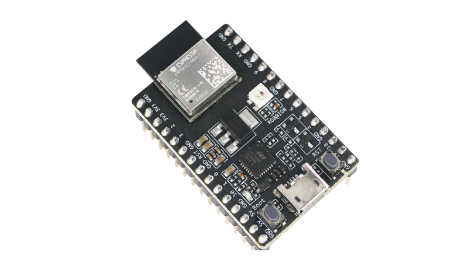
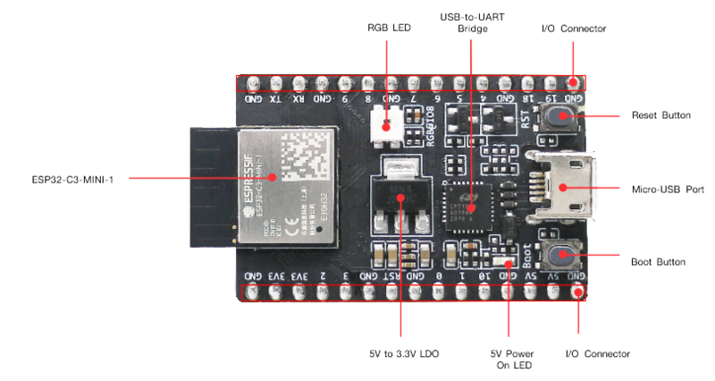
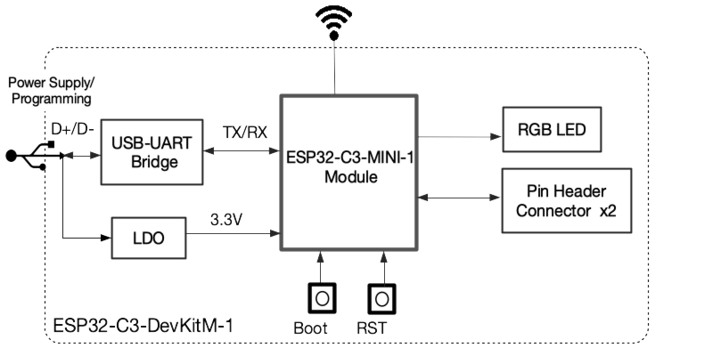
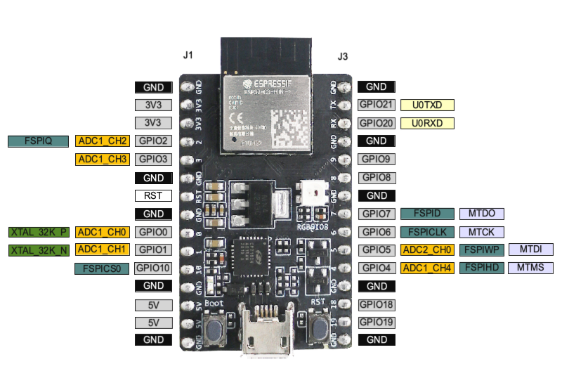

==================
ESP32-C3-DevKitM-1
==================

:link_to_translation:`zh_CN:[中文]`

This user guide will help you get started with ESP32-C3-DevKitM-1 and will also provide more in-depth information.

ESP32-C3-DevKitM-1 is an entry-level development board based on `ESP32-C3-MINI-1 <https://www.espressif.com/en/products/modules>`_, a module named for its small size. This board integrates complete Wi-Fi and Bluetooth LE functions.

Most of the I/O pins on the ESP32-C3-MINI-1 module are broken out to the pin headers on both sides of this board for easy interfacing. Developers can either connect peripherals with jumper wires or mount ESP32-C3-DevKitM-1 on a breadboard. 

    ESP32-C3-DevKitM-1
    
The document consists of the following major sections:

- `Getting Started`_: Overview of ESP32-C3-DevKitM-1 and hardware/software setup instructions to get started.
- `Hardware Reference`_: More detailed information about the ESP32-C3-DevKitM-1's hardware.
- `Hardware Revision Details`_: Revision history, known issues, and links to user guides for previous versions (if any) of ESP32-C3-DevKitM-1.
- `Related Documents`_: Links to related documentation.

Getting Started
===============

This section provides a brief introduction of ESP32-C3-DevKitM-1, instructions on how to do the initial hardware setup and how to flash firmware onto it.

Description of Components
-------------------------

.. _user-guide-c3-devkitm-1-v1-board-front:

    ESP32-C3-DevKitM-1 - front

.. list-table::
   :widths: 30 70
   :header-rows: 1

   * - Key Component
     - Description
   * - ESP32-C3-MINI-1
     - ESP32-C3-MINI-1 is a general-purpose Wi-Fi and Bluetooth LE combo module that comes with a PCB antenna. At the core of this module is `ESP32-C3FN4 <https://www.espressif.com/en/products/socs/esp32-c3>`_, a chip that has an embedded flash of 4 MB. Since flash is packaged in the ESP32-C3FN4 chip, rather than integrated into the module, ESP32-C3-MINI-1 has a smaller package size.
   * - 5 V to 3.3 V LDO
     - Power regulator that converts a 5 V supply into a 3.3 V output.
   * - 5 V Power On LED
     - Turns on when the USB power is connected to the board.
   * - I/O Connector
     - All available GPIO pins (except for the SPI bus for flash) are broken out to the pin headers on the board. For details, please see :ref:`user-guide-c3-devkitm-1-v1-header-blocks`.
   * - Boot Button
     - Download button. Holding down **Boot** and then pressing **Reset** initiates Firmware Download mode for downloading firmware through the serial port.
   * - Micro-USB Port
     - USB interface. Power supply for the board as well as the communication interface between a computer and the ESP32-C3FN4 chip.
   * - Reset Button
     - Press this button to restart the system.
   * - USB to UART Bridge
     - Single USB-UART bridge chip provides transfer rates up to 3 Mbps.
   * - RGB LED
     - Addressable RGB LED (WS2812), driven by GPIO8.

Start Application Development
-----------------------------

Before powering up your ESP32-C3-DevKitM-1, please make sure that it is in good condition with no obvious signs of damage.

Required Hardware
^^^^^^^^^^^^^^^^^

- ESP32-C3-DevKitM-1  
- USB 2.0 cable (Standard-A to Micro-B)
- Computer running Windows, Linux, or macOS

Software Setup
^^^^^^^^^^^^^^

Please proceed to :doc:`../../get-started/index`, where Section :ref:`get-started-step-by-step` will quickly help you set up the development environment and then flash an application example onto your ESP32-C3-DevKitM-1.

Contents and Packaging
----------------------

Retail Orders
^^^^^^^^^^^^^

If you order one or several samples, each ESP32-C3-DevKitM-1 comes in an individual package in either antistatic bag or any packaging depending on your retailer.

For retail orders, please go to https://www.espressif.com/en/company/contact/buy-a-sample.

Wholesale Orders
^^^^^^^^^^^^^^^^

If you order in bulk, the boards come in large cardboard boxes.

For wholesale orders, please check `Espressif Product Ordering Information <https://www.espressif.com/sites/default/files/documentation/espressif_products_ordering_information_en.pdf>`_ (PDF).

Hardware Reference
==================

Block Diagram
-------------

The block diagram below shows the components of ESP32-C3-DevKitM-1 and their interconnections.

    ESP32-C3-DevKitM-1 (click to enlarge)

Power Supply Options
^^^^^^^^^^^^^^^^^^^^

There are three mutually exclusive ways to provide power to the board:

- Micro USB port, default power supply
- 5V and GND header pins
- 3V3 and GND header pins

It is recommended to use the first option: micro USB port.

.. _user-guide-c3-devkitm-1-v1-header-blocks:

Header Block
------------

The two tables below provide the **Name** and **Function** of I/O header pins on both sides of the board, as shown in :ref:`user-guide-c3-devkitm-1-v1-board-front`. The numbering and names are the same as in the `ESP32-C3-DevKitM-1 Schematic <https://dl.espressif.com/dl/schematics/SCH_ESP32-C3-DEVKITM-1_V1_20200915A.pdf>`_ (PDF).

J1
^^^
===  ====  =====  ===================================
No.  Name  Type   Function
===  ====  =====  ===================================
1    GND   G      Ground
2    3V3   P      3.3 V power supply
3    3V3   P      3.3 V power supply
4    IO2   I/O/T  GPIO2, ADC1_CH2, FSPIQ
5    IO3   I/O/T  GPIO3, ADC1_CH3
6    GND   G      Ground
7    RST   I      CHIP_PU
8    GND   G      Ground
9    IO0   I/O/T  GPIO0, ADC1_CH0, XTAL_32K_P
10   IO1   I/O/T  GPIO1, ADC1_CH1, XTAL_32K_N
11   IO10  I/O/T  GPIO10, FSPICS0
12   GND   G      Ground
13   5V    P      5 V power supply
14   5V    P      5 V power supply
15   GND   G      Ground
===  ====  =====  ===================================

J3
^^^
===  ====  =====  ====================================
No.  Name  Type   Function
===  ====  =====  ====================================
1    GND   G      Ground
2    TX    I/O/T  GPIO21, U0TXD
3    RX    I/O/T  GPIO20, U0RXD
4    GND   G      Ground
5    IO9   I/O/T  GPIO9
6    IO8   I/O/T  GPIO8
7    GND   G      Ground
8    IO7   I/O/T  GPIO7, FSPID, MTDO
9    IO6   I/O/T  GPIO6, FSPICLK, MTCK
10   IO5   I/O/T  GPIO5, ADC2_CH0, FSPIWP, MTDI
11   IO4   I/O/T  GPIO4, ADC1_CH4, FSPIHD, MTMS
12   GND   G      Ground
13   IO18  I/O/T  GPIO18
14   IO19  I/O/T  GPIO19
15   GND   G      Ground
===  ====  =====  ====================================

    P: Power supply;
    I: Input;
    O: Output;
    T: High impedance.

Pin Layout
^^^^^^^^^^^

    ESP32-C3-DevKitM-1 Pin Layout

Hardware Revision Details
=========================

No previous versions available.

Related Documents
=================
* `ESP32-C3 Datasheet <https://www.espressif.com/sites/default/files/documentation/esp32-c3_datasheet_en.pdf>`_ (PDF)
* `ESP32-C3-MINI-1 Datasheet <https://www.espressif.com/sites/default/files/documentation/esp32-c3-mini-1_datasheet_en.pdf>`_ (PDF)
* `ESP32-C3-DevKitM-1 Schematic <https://dl.espressif.com/dl/schematics/SCH_ESP32-C3-DEVKITM-1_V1_20200915A.pdf>`_ (PDF)
* `ESP32-C3-DevKitM-1 PCB Layout <https://dl.espressif.com/dl/schematics/PCB_ESP32-C3-DEVKITM-1_V1_20200915AA.pdf>`_ (PDF)
* `ESP32-C3-DevKitM-1 Dimensions <https://dl.espressif.com/dl/schematics/DIMENSION_ESP32-C3-DEVKITM-1_V1_20200915AA.pdf>`_ (PDF)
* `ESP32-C3-DevKitM-1 Dimensions source file <https://dl.espressif.com/dl/schematics/DIMENSION_ESP32-C3-DEVKITM-1_V1_20200915AA.dxf>`_ (DXF) - You can view it with `Autodesk Viewer <https://viewer.autodesk.com/>`_ online

For further design documentation for the board, please contact us at `sales@espressif.com <sales@espressif.com>`_.
