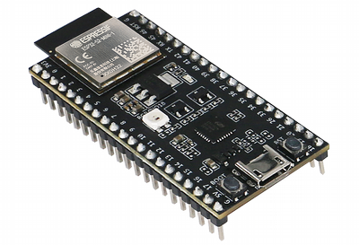
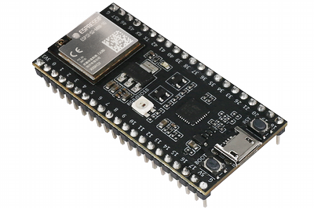
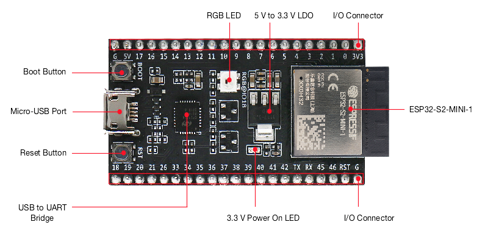
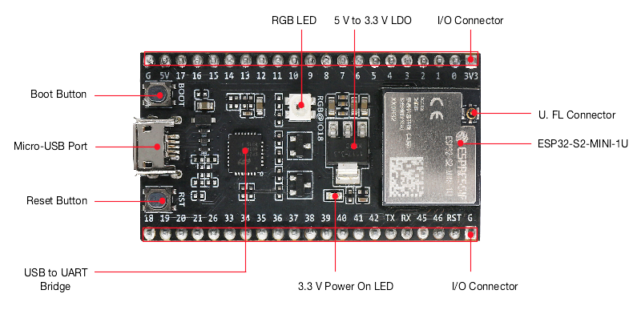
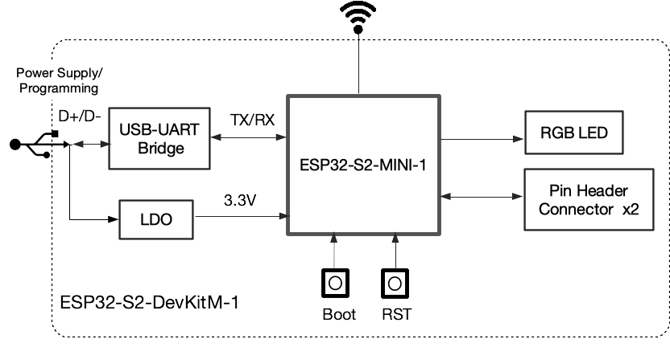
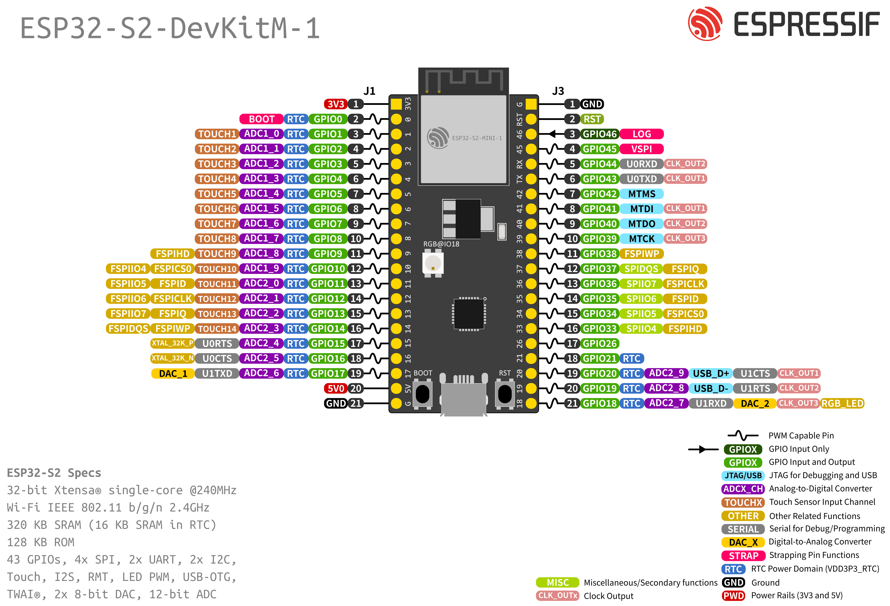

==================
ESP32-S2-DevKitM-1
==================

:link_to_translation:`zh_CN:[中文]`

This user guide provides information on Espressif's small-sized development board ESP32-S2-DevKitM-1.

ESP32-S2-DevKitM-1 is entry-level development board. Most of the I/O pins on the module are broken out to the pin headers on both sides for easy interfacing. Developers can either connect peripherals with jumper wires or mount ESP32-S2-DevKitM-1 on a breadboard.

+----------------------+-----------------------+
| |ESP32-S2-DevKitM-1| | |ESP32-S2-DevKitM-1U| |
+----------------------+-----------------------+
|  ESP32-S2-DevKitM-1  |  ESP32-S2-DevKitM-1U  |
+----------------------+-----------------------+

The document consists of the following major sections:

- `Getting started`_: Provides an overview of the ESP32-S2-DevKitM-1 and hardware/software setup instructions to get started.
- `Hardware reference`_: Provides more detailed information about the ESP32-S2-DevKitM-1's hardware.
- `Hardware Revision Details`_: Revision history, known issues, and links to user guides for previous versions (if any) of ESP32-S2-DevKitM-1.
- `Related Documents`_: Gives links to related documentation.

Getting Started
===============

This section describes how to get started with ESP32-S2-DevKitM-1. It begins with a few introductory sections about the ESP32-S2-DevKitM-1, then Section `Start Application Development`_ provides instructions on how to get the ESP32-S2-DevKitM-1 ready and flash firmware into it.

Contents and Packaging
----------------------

.. _user-guide-s2-devkitm-1-v1-ordering-info:

Ordering Information
^^^^^^^^^^^^^^^^^^^^

The development board has a variety of variants to choose from, as shown in the table below.

.. list-table::
   :header-rows: 1
   :widths: 41 24 9 8 18

   * - Ordering Code
     - On-board Module [#]_
     - Flash
     - PSRAM
     - Antenna
   * - ESP32-S2-DevKitM-1-N4R2
     - ESP32-S2-MINI-2

       (Recommended)
     - 4 MB
     - 2 MB
     - PCB on-board antenna
   * - ESP32-S2-DevKitM-1U-N4R2
     - ESP32-S2-MINI-2U

       (Recommended)
     - 4 MB
     - 2 MB
     - External antenna connector
   * - ESP32-S2-DevKitM-1
     - ESP32-S2-MINI-1
     - 4 MB
     - ---
     - PCB on-board antenna
   * - ESP32-S2-DevKitM-1U
     - ESP32-S2-MINI-1U
     - 4 MB
     - ---
     - External antenna connector
   * - ESP32-S2-DevKitM-1R
     - ESP32-S2-MINI-1
     - 4 MB
     - 2 MB
     - PCB on-board antenna
   * - ESP32-S2-DevKitM-1RU
     - ESP32-S2-MINI-1U
     - 4 MB
     - 2 MB
     - External antenna connector

.. [#] The ESP32-S2-MINI-2 and ESP32-S2-MINI-2U modules use chip revision v1.0, and the rest use chip revision v0.0. For more information about chip revisions, please refer to `ESP32-S2 Series SoC Errata`_.

Retail Orders
^^^^^^^^^^^^^

If you order a few samples, each ESP32-S2-DevKitM-1 comes in an individual package in either antistatic bag or any packaging depending on your retailer.

For retail orders, please go to https://www.espressif.com/en/contact-us/get-samples.

Wholesale Orders
^^^^^^^^^^^^^^^^

If you order in bulk, the boards come in large cardboard boxes.

For wholesale orders, please go to https://www.espressif.com/en/contact-us/sales-questions.

Description of Components
-------------------------

.. _user-guide-devkitm-1-v1-board-front:

    ESP32-S2-DevKitM-1 - front

    ESP32-S2-DevKitM-1U - front

The key components of the board are described in a clockwise direction.

.. list-table::
   :widths: 30 70
   :header-rows: 1

   * - Key Component
     - Description
   * - On-board module (ESP32-S2-MINI-1 or ESP32-S2-MINI-1U in figures above)
     - ESP32-S2-MINI series modules with an on-board PCB antenna or a connector for an external antenna. This series of modules, known for its small size, have a flash and/or a PSRAM integrated in the chip package. For more information, please refer to :ref:`user-guide-s2-devkitm-1-v1-ordering-info`.
   * - Pin Headers
     - All available GPIO pins (except for the SPI bus for flash) are broken out to the pin headers on the board. Users can program ESP32-S2FH4 chip to enable multiple functions such as SPI, I2S, UART, I2C, touch sensors, PWM etc. For details, please see :ref:`user-guide-devkitm-1-v1-header-blocks`.
   * - 3.3 V Power On LED
     - Turns on when the USB power is connected to the board.
   * - USB to UART Bridge
     - Single USB-UART bridge chip provides transfer rates up to 3 Mbps.
   * - Reset Button
     - Reset button.
   * - Micro-USB Port
     - USB interface. Power supply for the board as well as the communication interface between a computer and the ESP32-S2FH4 chip.
   * - Boot Button
     - Download button. Holding down **Boot** and then pressing **Reset** initiates Firmware Download mode for downloading firmware through the serial port.
   * - RGB LED
     - Addressable RGB LED, driven by GPIO18.
   * - 5 V to 3.3 V LDO
     - Power regulator that converts a 5 V supply into a 3.3 V output.
   * - External Antenna Connector
     - On **ESP32-S2-MINI-2U** and **ESP32-S2-MINI-1U** module only. For connector dimensions, please refer to Section External Antenna Connector Dimensions in module datasheet.

Start Application Development
-----------------------------

Before powering up your ESP32-S2-DevKitM-1, please make sure that it is in good condition with no obvious signs of damage.

Required Hardware
^^^^^^^^^^^^^^^^^

- ESP32-S2-DevKitM-1
- USB 2.0 cable (Standard-A to Micro-B)
- Computer running Windows, Linux, or macOS

.. note::

  Be sure to use an appropriate USB cable. Some cables are for charging only and do not provide the needed data lines nor work for programming the boards.

Software Setup
^^^^^^^^^^^^^^

Please proceed to :doc:`../../get-started/index`, where Section :ref:`get-started-step-by-step` will quickly help you set up the development environment and then flash an application example into your ESP32-S2-DevKitM-1.

.. note::

    ESP32-S2 series of chips only is only supported in ESP-IDF master or version v4.2 and higher.

Hardware Reference
==================

Block Diagram
-------------

A block diagram below shows the components of ESP32-S2-DevKitM-1 and their interconnections.

    ESP32-S2-DevKitM-1 (click to enlarge)

Power Supply Options
^^^^^^^^^^^^^^^^^^^^

There are three mutually exclusive ways to provide power to the board:

- Micro-USB Port, default power supply
- 5V and GND pin headers
- 3V3 and GND pin headers

It is recommended to use the first option: micro USB Port.

.. _user-guide-devkitm-1-v1-header-blocks:

Header Block
------------

The two tables below provide the **Name** and **Function** of the pin headers on both sides of the board (J1 and J3). The pin header names are shown in :ref:`user-guide-devkitm-1-v1-board-front`. The numbering is the same as in the `ESP32-S2-DevKitM-1 Schematics <https://dl.espressif.com/dl/schematics/ESP32-S2-DevKitM-1_V1_Schematics.pdf>`_ (PDF).

J1
^^^

===  ====  ==========  =============================================================
No.  Name  Type [#]_    Function
===  ====  ==========  =============================================================
1    3V3    P           3.3 V power supply
2    0      I/O/T       RTC_GPIO0, GPIO0
3    1      I/O/T       RTC_GPIO1, GPIO1, TOUCH1, ADC1_CH0
4    2      I/O/T       RTC_GPIO2, GPIO2, TOUCH2, ADC1_CH1
5    3      I/O/T       RTC_GPIO3, GPIO3, TOUCH3, ADC1_CH2
6    4      I/O/T       RTC_GPIO4, GPIO4, TOUCH4, ADC1_CH3
7    5      I/O/T       RTC_GPIO5, GPIO5, TOUCH5, ADC1_CH4
8    6      I/O/T       RTC_GPIO6, GPIO6, TOUCH6, ADC1_CH5
9    7      I/O/T       RTC_GPIO7, GPIO7, TOUCH7, ADC1_CH6
10   8      I/O/T       RTC_GPIO8, GPIO8, TOUCH8, ADC1_CH7
11   9      I/O/T       RTC_GPIO9, GPIO9, TOUCH9, ADC1_CH8, FSPIHD
12   10     I/O/T       RTC_GPIO10, GPIO10, TOUCH10, ADC1_CH9, FSPICS0, FSPIIO4
13   11     I/O/T       RTC_GPIO11, GPIO11, TOUCH11, ADC2_CH0, FSPID, FSPIIO5
14   12     I/O/T       RTC_GPIO12, GPIO12, TOUCH12, ADC2_CH1, FSPICLK, FSPIIO6
15   13     I/O/T       RTC_GPIO13, GPIO13, TOUCH13, ADC2_CH2, FSPIQ, FSPIIO7
16   14     I/O/T       RTC_GPIO14, GPIO14, TOUCH14, ADC2_CH3, FSPIWP, FSPIDQS
17   15     I/O/T       RTC_GPIO15, GPIO15, U0RTS, ADC2_CH4, XTAL_32K_P
18   16     I/O/T       RTC_GPIO16, GPIO16, U0CTS, ADC2_CH5, XTAL_32K_N
19   17     I/O/T       RTC_GPIO17,  GPIO17, U1TXD, ADC2_CH6, DAC_1
20   5V     P           5 V power supply
21   G      G           Ground
===  ====  ==========  =============================================================

J3
^^^

===  ====  =====  ========================================================
No.  Name  Type   Function
===  ====  =====  ========================================================
1    G     G      Ground
2    RST   I      CHIP_PU
3    46    I      GPIO46
4    45    I/O/T  GPIO45
5    RX    I/O/T  U0RXD, GPIO44, CLK_OUT2
6    TX    I/O/T  U0TXD, GPIO43, CLK_OUT1
7    42    I/O/T  MTMS, GPIO42
8    41    I/O/T  MTDI, GPIO41, CLK_OUT1
9    40    I/O/T  MTDO, GPIO40, CLK_OUT2
10   39    I/O/T  MTCK, GPIO39, CLK_OUT3
11   38    I/O/T  GPIO38, FSPIWP
12   37    I/O/T  SPIDQS, GPIO37, FSPIQ
13   36    I/O/T  SPIIO7, GPIO36, FSPICLK
14   35    I/O/T  SPIIO6, GPIO35, FSPID
15   34    I/O/T  SPIIO5, GPIO34, FSPICS0
16   33    I/O/T  SPIIO4, GPIO33, FSPIHD
17   26    I/O/T  SPICS1, GPIO26
18   21    I/O/T  RTC_GPIO21, GPIO21
19   20    I/O/T  RTC_GPIO20, GPIO20, U1CTS, ADC2_CH9, CLK_OUT1, USB_D+
20   19    I/O/T  RTC_GPIO19, GPIO19, U1RTS, ADC2_CH8, CLK_OUT2, USB_D-
21   18    I/O/T  RTC_GPIO18, GPIO18, U1RXD, ADC2_CH7, DAC_2, CLK_OUT3, RGB LED
===  ====  =====  ========================================================

.. [#] P: Power supply; I: Input; O: Output; T: High impedance.

Pin Layout
^^^^^^^^^^^

    ESP32-S2-DevKitM-1 Pin Layout (click to enlarge)

Hardware Revision Details
=========================

This is the first revision of this board released.

Related Documents
=================

* `ESP32-S2 Series Chip Revision v1.0 Datasheet`_ (PDF)
* `ESP32-S2 Series Chip Revision v0.0 Datasheet <https://www.espressif.com/sites/default/files/documentation/esp32-s2_datasheet_en.pdf>`_ (PDF)
* `ESP32-S2 Series SoC Errata`_ (PDF)
* `ESP32-S2-MINI-2 & ESP32-S2-MINI-2U Module Datasheet <https://www.espressif.com/sites/default/files/documentation/esp32-s2-mini-2_esp32-s2-mini-2u_datasheet_en.pdf>`_ (PDF)
* `ESP32-S2-MINI-1 & ESP32-S2-MINI-1U Module Datasheet <https://www.espressif.com/sites/default/files/documentation/esp32-s2-mini-1_esp32-s2-mini-1u_datasheet_en.pdf>`_ (PDF)
* `ESP32-S2-DevKitM-1 Schematics <https://dl.espressif.com/dl/schematics/ESP32-S2-DevKitM-1_V1_Schematics.pdf>`_ (PDF)
* `ESP32-S2-DevKitM-1 PCB Layout <https://dl.espressif.com/dl/schematics/ESP32-S2-DevKitM-1_V1_PCB_Layout.pdf>`_ (PDF)
* `ESP32-S2-DevKitM-1 Dimensions <https://dl.espressif.com/dl/schematics/ESP32-S2-DevKitM-1_V1_Dimensions.pdf>`_ (PDF)
* `ESP Product Selector <https://products.espressif.com/#/product-selector?names=>`_

For other design documentation for the board, please contact us at `sales@espressif.com <sales@espressif.com>`_.

.. _NRND: https://www.espressif.com/en/products/longevity-commitment?id=nrnd
.. _ESP32-S2 Series Chip Revision v1.0 Datasheet: https://www.espressif.com/sites/default/files/documentation/esp32-s2-v1.0_datasheet_en.pdf
.. _ESP32-S2 Series SoC Errata: https://espressif.com/sites/default/files/documentation/esp32-s2_errata_en.pdf
