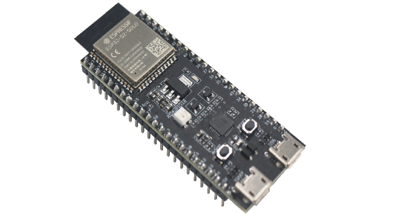
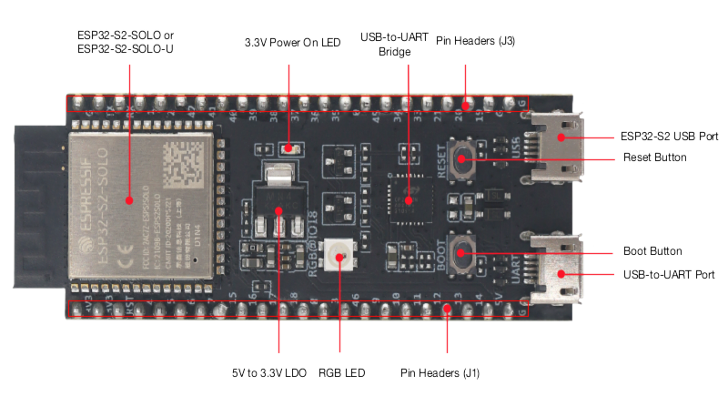
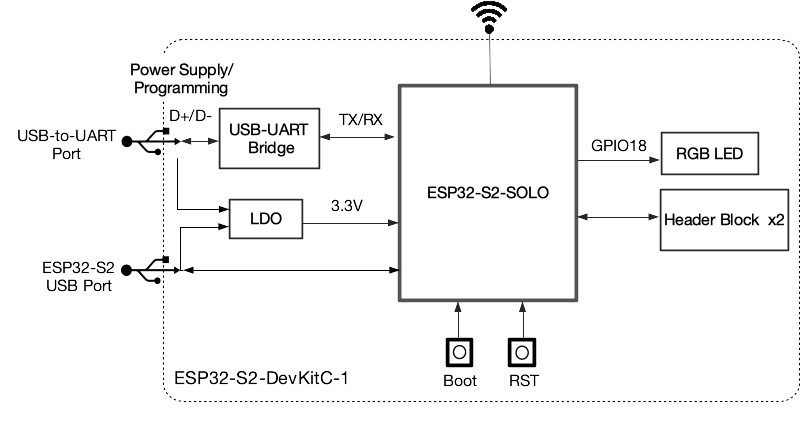
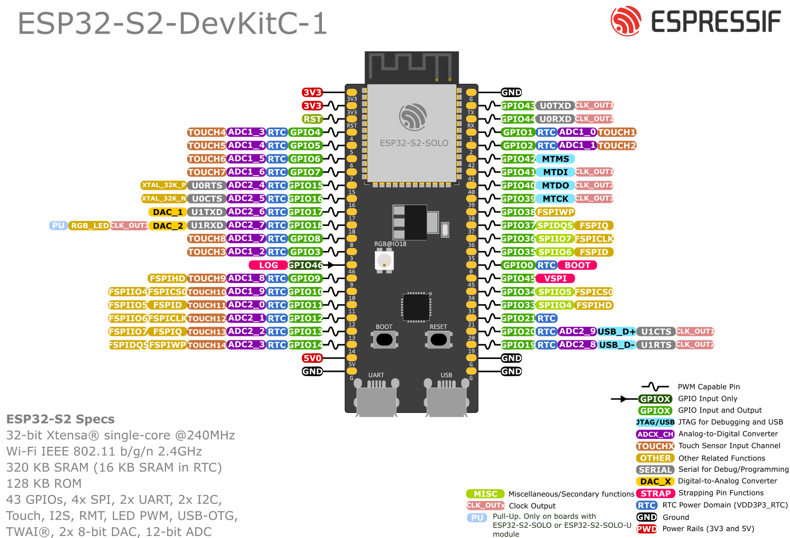

==================
ESP32-S2-DevKitC-1
==================

:link_to_translation:`zh_CN:[中文]`

This user guide will help you get started with ESP32-S2-DevKitC-1 and will also provide more in-depth information.

ESP32-S2-DevKitC-1 is an entry-level development board. This board integrates complete Wi-Fi functions. Most of the I/O pins are broken out to the pin headers on both sides for easy interfacing. Developers can either connect peripherals with jumper wires or mount ESP32-S2-DevKitC-1 on a breadboard.

    ESP32-S2-DevKitC-1 with the ESP32-S2-SOLO Module

The document consists of the following major sections:

- `Getting Started`_: Overview of ESP32-S2-DevKitC-1 and hardware/software setup instructions to get started.
- `Hardware Reference`_: More detailed information about the ESP32-S2-DevKitC-1's hardware.
- `Hardware Revision Details`_: Revision history, known issues, and links to user guides for previous versions (if any) of ESP32-S2-DevKitC-1.
- `Related Documents`_: Links to related documentation.

Getting Started
===============

This section provides a brief introduction of ESP32-S2-DevKitC-1, instructions on how to do the initial hardware setup and how to flash firmware onto it.

Description of Components
-------------------------

.. _user-guide-s2-devkitc-1-v1-board-front:

    ESP32-S2-DevKitC-1 - front

The key components of the board are described in a clockwise direction.

.. list-table::
   :widths: 30 70
   :header-rows: 1

   * - Key Component
     - Description
   * - On-board module (ESP32-S2-SOLO or ESP32-S2-SOLO-U in the above figure)
     - ESP32-S2-SOLO series modules with an on-board PCB antenna or a connector for an external antenna. This series of modules have multiple options for flash and PSRAM size. For more information, please refer to :ref:`user-guide-s2-devkitc-1-v1-ordering-info`.
   * - 3.3 V Power On LED
     - Turns on when the USB power is connected to the board.
   * - USB-to-UART Bridge
     - Single USB-to-UART bridge chip provides transfer rates up to 3 Mbps.
   * - Pin Headers
     - All available GPIO pins (except for the SPI bus for flash) are broken out to the pin headers on the board. For details, please see :ref:`user-guide-s2-devkitc-1-v1-header-blocks`.
   * - ESP32-S2 USB Port
     - ESP32-S2 full-speed USB OTG interface, compliant with the USB 1.1 specifications. The interface is used for power supply to the board, for flashing applications to the chip, and for communication with the chip using USB 1.1 protocols.
   * - Reset Button
     - Press this button to restart the system.
   * - Boot Button
     - Download button. Holding down **Boot** and then pressing **Reset** initiates Firmware Download mode for downloading firmware through the serial port.
   * - USB-to-UART Port
     - A Micro-USB port used for power supply to the board, for flashing applications to the chip, as well as the communication with the chip via the on-board USB-to-UART bridge.
   * - RGB LED
     - Addressable RGB LED, driven by GPIO18.
   * - 5 V to 3.3 V LDO
     - Power regulator that converts a 5 V supply into a 3.3 V output.

Start Application Development
-----------------------------

Before powering up your ESP32-S2-DevKitC-1, please make sure that it is in good condition with no obvious signs of damage.

Required Hardware
^^^^^^^^^^^^^^^^^

- ESP32-S2-DevKitC-1
- USB 2.0 cable (Standard-A to Micro-B)
- Computer running Windows, Linux, or macOS

.. note::

  Be sure to use an appropriate USB cable. Some cables are for charging only and do not provide the needed data lines nor work for programming the boards.

Hardware Setup
^^^^^^^^^^^^^^

Connect the board with the computer using **USB-to-UART Port** or **ESP32-S2 USB Port**. In subsequent steps, **USB-to-UART Port** will be used by default.

Software Setup
^^^^^^^^^^^^^^

Please proceed to `ESP-IDF Get Started <https://docs.espressif.com/projects/esp-idf/en/latest/esp32s2/get-started/index.html>`_, where Section `Installation Step by Step <https://docs.espressif.com/projects/esp-idf/en/latest/esp32s2/get-started/index.html#get-started-step-by-step>`_ will quickly help you set up the development environment and then flash an application example into your ESP32-S2-DevKitC-1.

Contents and Packaging
----------------------

.. _user-guide-s2-devkitc-1-v1-ordering-info:

Ordering Information
^^^^^^^^^^^^^^^^^^^^

The development board has a variety of variants to choose from, as shown in the table below.

.. list-table::
   :header-rows: 1
   :widths: 41 24 9 8 18

   * - Ordering Code
     - On-board Module [#]_
     - Flash
     - PSRAM
     - Antenna
   * - ESP32-S2-DevKitC-1-N8R2
     - ESP32-S2-SOLO-2

       (Recommended)
     - 8 MB
     - 2 MB
     - PCB on-board antenna
   * - ESP32-S2-DevKitC-1U-N8R2
     - ESP32-S2-SOLO-2U

       (Recommended)
     - 8 MB
     - 2 MB
     - External antenna connector
   * - ESP32-S2-DevKitC-1
     - ESP32-S2-SOLO
     - 4 MB
     - ---
     - PCB on-board antenna
   * - ESP32-S2-DevKitC-1U
     - ESP32-S2-SOLO-U
     - 4 MB
     - ---
     - External antenna connector
   * - ESP32-S2-DevKitC-1R
     - ESP32-S2-SOLO
     - 4 MB
     - 2 MB
     - PCB on-board antenna
   * - ESP32-S2-DevKitC-1RU
     - ESP32-S2-SOLO-U
     - 4 MB
     - 2 MB
     - External antenna connector

.. [#] The ESP32-S2-SOLO-2 and ESP32-S2-SOLO-2U modules use chip revision v1.0, and the rest use chip revision v0.0. For more information about chip revisions, please refer to `ESP32-S2 Series SoC Errata`_.

Retail Orders
^^^^^^^^^^^^^

If you order a few samples, each ESP32-S2-DevKitC-1 comes in an individual package in either antistatic bag or any packaging depending on your retailer.

For retail orders, please go to https://www.espressif.com/en/contact-us/get-samples.

Wholesale Orders
^^^^^^^^^^^^^^^^

If you order in bulk, the boards come in large cardboard boxes.

For wholesale orders, please go to https://www.espressif.com/en/contact-us/sales-questions.

Hardware Reference
==================

Block Diagram
-------------

The block diagram below shows the components of ESP32-S2-DevKitC-1 and their interconnections.

    ESP32-S2-DevKitC-1 (click to enlarge)

Power Supply Options
^^^^^^^^^^^^^^^^^^^^

There are three mutually exclusive ways to provide power to the board:

- USB-to-UART Port and ESP32-S2 USB Port (either one or both), default power supply (recommended)
- 5V and G (GND) pins
- 3V3 and G (GND) pins

.. _user-guide-s2-devkitc-1-v1-header-blocks:

Header Block
------------

The two tables below provide the **Name** and **Function** of the pin headers on both sides of the board (J1 and J3). The pin header names are shown in :ref:`user-guide-s2-devkitc-1-v1-board-front`. The numbering is the same as in the `ESP32-S2-DevKitC-1 Schematic`_ (PDF).

J1
^^^

===  =========  ==========  ==========================================================================
No.  Name       Type [#]_    Function
===  =========  ==========  ==========================================================================
1    3V3         P           3.3 V power supply
2    3V3         P           3.3 V power supply
3    RST         I           CHIP_PU
4    4           I/O/T       RTC_GPIO4, GPIO4, TOUCH4, ADC1_CH3
5    5           I/O/T       RTC_GPIO5, GPIO5, TOUCH5, ADC1_CH4
6    6           I/O/T       RTC_GPIO6, GPIO6, TOUCH6, ADC1_CH5
7    7           I/O/T       RTC_GPIO7, GPIO7, TOUCH7, ADC1_CH6
8    15          I/O/T       RTC_GPIO15, GPIO15, U0RTS, ADC2_CH4, XTAL_32K_P
9    16          I/O/T       RTC_GPIO16, GPIO16, U0CTS, ADC2_CH5, XTAL_32K_N
10   17          I/O/T       RTC_GPIO17, GPIO17, U1TXD, ADC2_CH6, DAC_1
11   18 [#]_     I/O/T       RTC_GPIO18, GPIO18, U1RXD, ADC2_CH7, DAC_2, CLK_OUT3, RGB LED
12   8           I/O/T       RTC_GPIO8, GPIO8, TOUCH8, ADC1_CH7
13   3           I/O/T       RTC_GPIO3, GPIO3, TOUCH3, ADC1_CH2
14   46          I           GPIO46
15   9           I/O/T       RTC_GPIO9, GPIO9, TOUCH9, ADC1_CH8, FSPIHD
16   10          I/O/T       RTC_GPIO10, GPIO10, TOUCH10, ADC1_CH9, FSPICS0, FSPIIO4
17   11          I/O/T       RTC_GPIO11, GPIO11, TOUCH11, ADC2_CH0, FSPID, FSPIIO5
18   12          I/O/T       RTC_GPIO12, GPIO12, TOUCH12, ADC2_CH1, FSPICLK, FSPIIO6
19   13          I/O/T       RTC_GPIO13, GPIO13, TOUCH13, ADC2_CH2, FSPIQ, FSPIIO7
20   14          I/O/T       RTC_GPIO14, GPIO14, TOUCH14, ADC2_CH3, FSPIWP, FSPIDQS
21   5V          P           5 V power supply
22   G           G           Ground
===  =========  ==========  ==========================================================================

J3
^^^

===  ====  =====   ============================================================
No.  Name  Type    Function
===  ====  =====   ============================================================
1    G     G       Ground
2    TX    I/O/T   U0TXD, GPIO43, CLK_OUT1
3    RX    I/O/T   U0RXD, GPIO44, CLK_OUT2
4    1     I/O/T   RTC_GPIO1, GPIO1, TOUCH1, ADC1_CH0
5    2     I/O/T   RTC_GPIO2, GPIO2, TOUCH2, ADC1_CH1
6    42    I/O/T   MTMS, GPIO42
7    41    I/O/T   MTDI, GPIO41, CLK_OUT1
8    40    I/O/T   MTDO, GPIO40, CLK_OUT2
9    39    I/O/T   MTCK, GPIO39, CLK_OUT3
10   38    I/O/T   GPIO38, FSPIWP
11   37    I/O/T   SPIDQS, GPIO37, FSPIQ
12   36    I/O/T   SPIIO7, GPIO36, FSPICLK
13   35    I/O/T   SPIIO6, GPIO35, FSPID
14   0     I/O/T   RTC_GPIO0, GPIO0
15   45    I/O/T   GPIO45
16   34    I/O/T   SPIIO5, GPIO34, FSPICS0
17   33    I/O/T   SPIIO4, GPIO33, FSPIHD
18   21    I/O/T   RTC_GPIO21, GPIO21
19   20    I/O/T   RTC_GPIO20, GPIO20, U1CTS, ADC2_CH9, CLK_OUT1, USB_D+
20   19    I/O/T   RTC_GPIO19, GPIO19, U1RTS, ADC2_CH8, CLK_OUT2, USB_D-
21   G     G       Ground
22   G     G       Ground
===  ====  =====   ============================================================

.. [#] P: Power supply; I: Input; O: Output; T: High impedance.
.. [#] GPIO18 is not pulled up on boards with an ESP32-S2-SOLO-2 or ESP32-S2-SOLO-2U module.

Pin Layout
^^^^^^^^^^

    ESP32-S2-DevKitC-1 Pin Layout (click to enlarge)

Hardware Revision Details
=========================

This is the first revision of this board released.

Related Documents
=================

* `ESP32-S2 Series Chip Revision v1.0 Datasheet`_ (PDF)
* `ESP32-S2 Series Chip Revision v0.0 Datasheet <https://www.espressif.com/sites/default/files/documentation/esp32-s2_datasheet_en.pdf>`_ (PDF)
* `ESP32-S2 Series SoC Errata`_ (PDF)
* `ESP32-S2-SOLO-2 & ESP32-S2-SOLO-2U Module Datasheet <https://www.espressif.com/sites/default/files/documentation/esp32-s2-solo-2_esp32-s2-solo-2u_datasheet_en.pdf>`_ (PDF)
* `ESP32-S2-SOLO & ESP32-S2-SOLO-U Module Datasheet <https://www.espressif.com/sites/default/files/documentation/esp32-s2-solo_esp32-s2-solo-u_datasheet_en.pdf>`_ (PDF)
* `ESP32-S2-DevKitC-1 Schematic`_ (PDF)
* `ESP32-S2-DevKitC-1 PCB Layout <https://dl.espressif.com/dl/schematics/PCB_ESP32-S2-DevKitC-1_V1_20210508.pdf>`_ (PDF)
* `ESP32-S2-DevKitC-1 Dimensions <https://dl.espressif.com/dl/schematics/DXF_ESP32-S2-DevKitC-1_V1_20210511.pdf>`_ (PDF)
* `ESP32-S2-DevKitC-1 Dimensions source file <https://dl.espressif.com/dl/schematics/DXF_ESP32-S2-DevKitC-1_V1_20210511.dxf>`_ (DXF) - You can view it with `Autodesk Viewer <https://viewer.autodesk.com/>`_ online

For further design documentation for the board, please contact us at `sales@espressif.com <sales@espressif.com>`_.

.. _NRND: https://www.espressif.com/en/products/longevity-commitment?id=nrnd
.. _ESP32-S2 Series Chip Revision v1.0 Datasheet: https://www.espressif.com/sites/default/files/documentation/esp32-s2-v1.0_datasheet_en.pdf
.. _ESP32-S2 Series SoC Errata: https://espressif.com/sites/default/files/documentation/esp32-s2_errata_en.pdf
.. _ESP32-S2-DevKitC-1 Schematic: https://dl.espressif.com/dl/schematics/esp-idf/SCH_ESP32-S2-DEVKITC-1_V1_20220817.pdf
