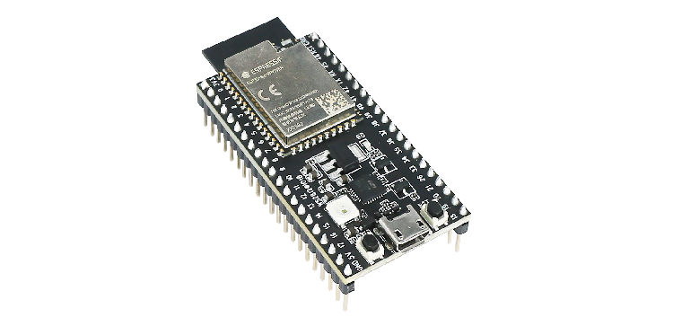
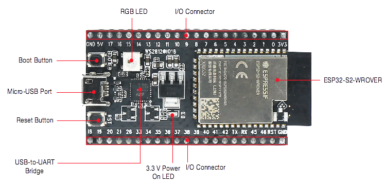
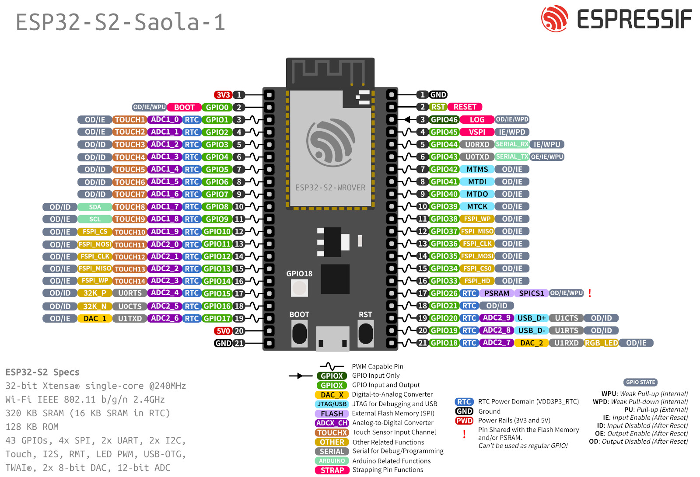

================
ESP32-S2-Saola-1
================

:link_to_translation:`zh_CN:[中文]`

This user guide provides information on ESP32-S2-Saola-1, a small-sized `ESP32-S2 Datasheet`_ based development board produced by Espressif.

    ESP32-S2-Saola-1

The document consists of the following major sections:

- `Getting started`_: Provides an overview of the ESP32-S2-Saola-1 and hardware/software setup instructions to get started.
- `Hardware reference`_: Provides more detailed information about the ESP32-S2-Saola-1's hardware.
- `Hardware Revision Details`_: Revision history, known issues, and links to user guides for previous versions (if any) of ESP32-S2-Saola-1.
- `Related Documents`_: Gives links to related documentation.

Getting Started
===============

This section describes how to get started with ESP32-S2-Saola-1. It begins with a few introductory sections about the ESP32-S2-Saola-1, then Section `Start Application Development`_ provides instructions on how to get the ESP32-S2-Saola-1 ready and flash firmware into it.

Overview
--------

ESP32-S2-Saola-1 is a small-sized ESP32-S2 based development board produced by Espressif. Most of the I/O pins are broken out to the pin headers on both sides for easy interfacing. Developers can either connect peripherals with jumper wires or mount ESP32-S2-Saola-1 on a breadboard.

To cover a wide range of users' needs, ESP32-S2-Saola-1 supports:

- `ESP32-S2-WROVER <https://www.espressif.com/sites/default/files/documentation/esp32-s2-wrover_esp32-s2-wrover-i_datasheet_en.pdf>`_
- `ESP32-S2-WROVER-I <https://www.espressif.com/sites/default/files/documentation/esp32-s2-wrover_esp32-s2-wrover-i_datasheet_en.pdf>`_
- `ESP32-S2-WROOM <https://www.espressif.com/sites/default/files/documentation/esp32-s2-wroom_esp32-s2-wroom-i_datasheet_en.pdf>`_
- `ESP32-S2-WROOM-I <https://www.espressif.com/sites/default/files/documentation/esp32-s2-wroom_esp32-s2-wroom-i_datasheet_en.pdf>`_

In this guide, we take ESP32-S2-Saola-1 equipped with ESP32-S2-WROVER as an example.

Contents and Packaging
----------------------

Retail Orders
^^^^^^^^^^^^^

If you order a few samples, each ESP32-S2-Saola-1 comes in an individual package in either antistatic bag or any packaging depending on your retailer.

For retail orders, please go to https://www.espressif.com/en/contact-us/get-samples.

Wholesale Orders
^^^^^^^^^^^^^^^^

If you order in bulk, the boards come in large cardboard boxes.

For wholesale orders, please go to https://www.espressif.com/en/contact-us/sales-questions.

Description of Components
-------------------------

.. _user-guide-saola-1-v1.2-board-front:

    ESP32-S2-Saola-1 - front

The key components of the board are described in a clockwise direction.

.. list-table::
   :widths: 30 70
   :header-rows: 1

   * - Key Component
     - Description
   * - ESP32-S2-WROVER
     - ESP32-S2-WROVER is a powerful, generic Wi-Fi MCU module that integrates ESP32-S2. It has a PCB antenna, a 4 MB external SPI flash and an additional 2 MB PSRAM.
   * - Pin Headers
     - All available GPIO pins (except for the SPI bus for flash and PSRAM) are broken out to the pin headers on the board. Users can program ESP32-S2 chip to enable multiple functions such as SPI, I2S, UART, I2C, touch sensors, PWM etc.
   * - 3.3 V Power On LED
     - Turns on when the USB power is connected to the board.
   * - USB-to-UART Bridge
     - Single USB-UART bridge chip provides transfer rates up to 3 Mbps.
   * - Reset Button
     - Reset button.
   * - Micro-USB Port
     - USB interface. Power supply for the board as well as the communication interface between a computer and the ESP32-S2 chip.
   * - Boot Button
     - Download button. Holding down **Boot** and then pressing **Reset** initiates Firmware Download mode for downloading firmware through the serial port.
   * - RGB LED
     - Addressable RGB LED (WS2812), driven by GPIO18.

Start Application Development
-----------------------------

Before powering up your ESP32-S2-Saola-1, please make sure that it is in good condition with no obvious signs of damage.

Required Hardware
^^^^^^^^^^^^^^^^^

- ESP32-S2-Saola-1
- USB 2.0 cable (Standard-A to Micro-B)
- Computer running Windows, Linux, or macOS

.. note::

  Be sure to use an appropriate USB cable. Some cables are for charging only and do not provide the needed data lines nor work for programming the boards.

Software Setup
^^^^^^^^^^^^^^

Please proceed to :doc:`../../get-started/index`, where Section :ref:`get-started-step-by-step` will quickly help you set up the development environment and then flash an application example into your ESP32-S2-Saola-1.

.. note::

    ESP32-S2 series of chips only supports ESP-IDF master or version v4.2 and higher.

Hardware Reference
==================

Block Diagram
-------------

A block diagram below shows the components of ESP32-S2-Saola-1 and their interconnections.

.. figure:: ../../../_static/esp32-s2-saola-1-v1.2-block-diags.png
    :align: center
    :scale: 70%
    :alt: ESP32-S2-Saola-1 (click to enlarge)
    :figclass: align-center

    ESP32-S2-Saola-1 (click to enlarge)

Power Supply Options
^^^^^^^^^^^^^^^^^^^^

There are three mutually exclusive ways to provide power to the board:

- Micro-USB port, default power supply
- 5V and GND pin headers
- 3V3 and GND pin headers

It is recommended to use the first option: Micro-USB Port.

Header Block
------------

The two tables below provide the **Name** and **Function** of the pin headers on both sides of the board (J2 and J3). The pin header names are shown in :ref:`user-guide-saola-1-v1.2-board-front`. The numbering is the same as in the `ESP32-S2-Saola-1 Schematics`_ (PDF).

J2
^^^

===  ====  ==========  ======================================
No.  Name  Type [#]_    Function
===  ====  ==========  ======================================
1    3V3    P           3.3 V power supply
2    IO0    I/O         GPIO0, Boot
3    IO1    I/O         GPIO1, ADC1_CH0, TOUCH_CH1
4    IO2    I/O         GPIO2, ADC1_CH1, TOUCH_CH2
5    IO3    I/O         GPIO3, ADC1_CH2, TOUCH_CH3
6    IO4    I/O         GPIO4, ADC1_CH3, TOUCH_CH4
7    IO5    I/O         GPIO5, ADC1_CH4, TOUCH_CH5
8    IO6    I/O         GPIO6, ADC1_CH5, TOUCH_CH6
9    IO7    I/O         GPIO7, ADC1_CH6, TOUCH_CH7
10   IO8    I/O         GPIO8, ADC1_CH7, TOUCH_CH8
11   IO9    I/O         GPIO9, ADC1_CH8, TOUCH_CH9
12   IO10   I/O         GPIO10, ADC1_CH9, TOUCH_CH10
13   IO11   I/O         GPIO11, ADC2_CH0, TOUCH_CH11
14   IO12   I/O         GPIO12, ADC2_CH1, TOUCH_CH12
15   IO13   I/O         GPIO13, ADC2_CH2, TOUCH_CH13
16   IO14   I/O         GPIO14, ADC2_CH3, TOUCH_CH14
17   IO15   I/O         GPIO15, ADC2_CH4, XTAL_32K_P
18   IO16   I/O         GPIO16, ADC2_CH5, XTAL_32K_N
19   IO17   I/O         GPIO17, ADC2_CH6, DAC_1
20   5V0    P           5 V power supply
21   GND    G           Ground
===  ====  ==========  ======================================

J3
^^^

===  ====  =====  ====================================
No.  Name  Type   Function
===  ====  =====  ====================================
1    GND   G      Ground
2    RST   I      CHIP_PU, Reset
3    IO46  I      GPIO46
4    IO45  I/O    GPIO45
5    IO44  I/O    GPIO44, U0RXD
6    IO43  I/O    GPIO43, U0TXD
7    IO42  I/O    GPIO42, MTMS
8    IO41  I/O    GPIO41, MTDI
9    IO40  I/O    GPIO40, MTDO
10   IO39  I/O    GPIO39, MTCK
11   IO38  I/O    GPIO38
12   IO37  I/O    GPIO37
13   IO36  I/O    GPIO36
14   IO35  I/O    GPIO35
16   IO34  I/O    GPIO34
17   IO33  I/O    GPIO33
17   IO26  I/O    GPIO26
18   IO21  I/O    GPIO21
19   IO20  I/O    GPIO20, ADC2_CH9, USB_D+
20   IO19  I/O    GPIO19, ADC2_CH8, USB_D-
21   IO18  I/O    GPIO18, ADC2_CH7, DAC_2, RGB LED
===  ====  =====  ====================================

.. [#] P: Power supply; I: Input; O: Output; T: High impedance.

Pin Layout
^^^^^^^^^^^

    ESP32-S2 Saola-1 Pin Layout (click to enlarge)

Hardware Revision Details
=========================

This is the first revision of this board released.

Related Documents
=================

* `ESP32-S2-Saola-1 Schematics`_ (PDF)
* `ESP32-S2-Saola-1 Dimensions`_ (PDF)
* `ESP32-S2 Datasheet`_ (PDF)
* `ESP32-S2-WROVER and ESP32-S2-WROVER-I Datasheet`_ (PDF)
* `ESP32-S2-WROOM and ESP32-S2-WROOM-I Datasheet`_ (PDF)
* `ESP Product Selector`_

For other design documentation for the board, please contact us at `sales@espressif.com <sales@espressif.com>`_.

.. _ESP32-S2-Saola-1 Schematics: https://dl.espressif.com/dl/schematics/ESP32-S2-SAOLA-1_V1.1_schematics.pdf
.. _ESP32-S2-Saola-1 Dimensions: https://dl.espressif.com/dl/schematics/ESP32-S2-Saola-1_V1.2_Dimensions.pdf
.. _ESP32-S2 Datasheet: https://www.espressif.com/sites/default/files/documentation/esp32-s2_datasheet_en.pdf
.. _ESP32-S2-WROVER and ESP32-S2-WROVER-I Datasheet: https://www.espressif.com/sites/default/files/documentation/esp32-s2-wrover_esp32-s2-wrover-i_datasheet_en.pdf
.. _ESP32-S2-WROOM and ESP32-S2-WROOM-I Datasheet: https://www.espressif.com/sites/default/files/documentation/esp32-s2-wroom_esp32-s2-wroom-i_datasheet_en.pdf
.. _ESP Product Selector: https://products.espressif.com/#/product-selector?names=
