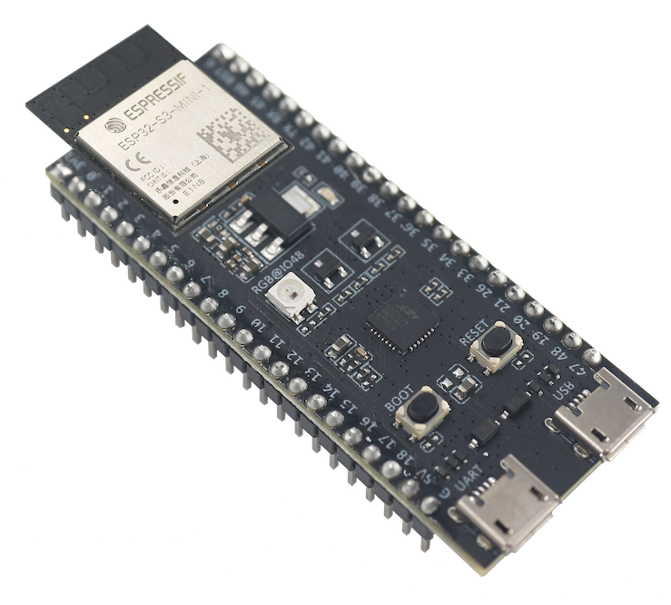
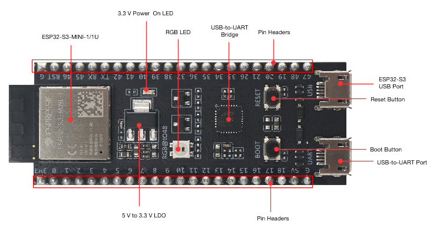
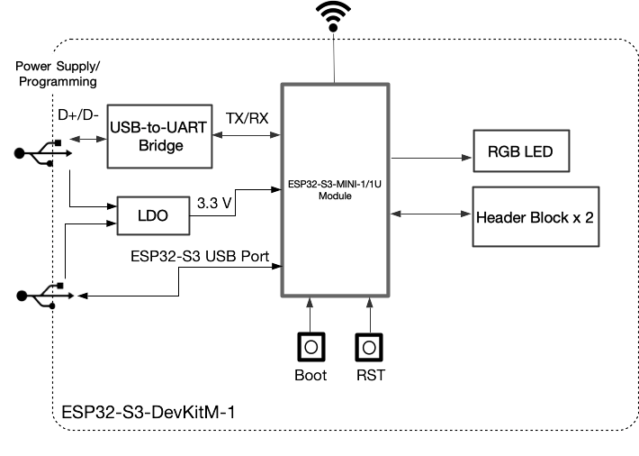
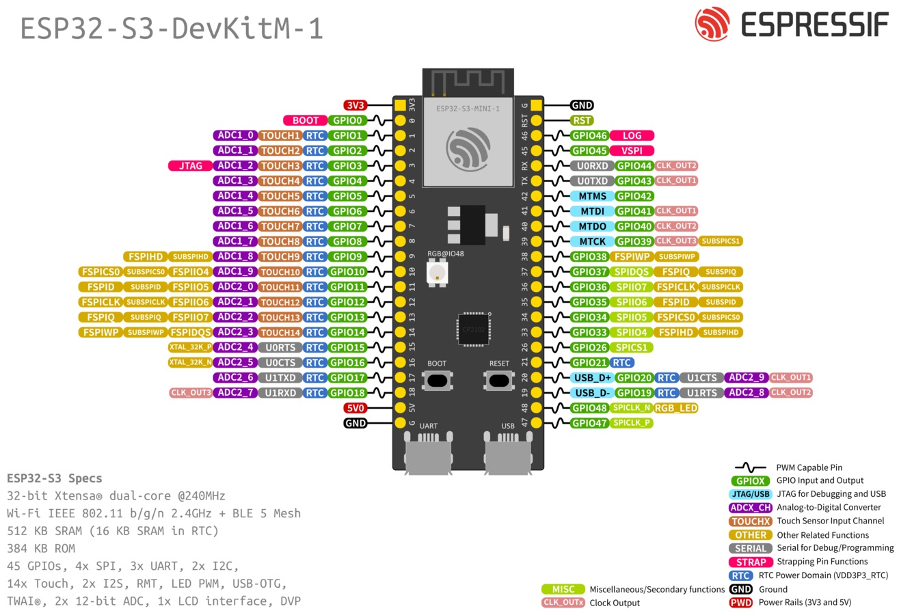

==================
ESP32-S3-DevKitM-1
==================

:link_to_translation:`zh_CN:[中文]`

This user guide will help you get started with ESP32-S3-DevKitM-1 and will also provide more in-depth information.

The ESP32-S3-DevKitM-1 is an entry-level development board equipped with either ESP32-S3-MINI-1 or ESP32-S3-MINI-1U, a module named for its small size. This board integrates complete Wi-Fi and Bluetooth® Low Energy functions.

Most of the I/O pins on the module are broken out to the pin headers on both sides of this board for easy interfacing. Developers can either connect peripherals with jumper wires or mount ESP32-S3-DevKitM-1 on a breadboard.

    ESP32-S3-DevKitM-1 with ESP32-S3-MINI-1 Module

The document consists of the following major sections:

- `Getting Started`_: Overview of the board and hardware/software setup instructions to get started.
- `Hardware Reference`_: More detailed information about the board's hardware.
- `Related Documents`_: Links to related documentation.

Getting Started
===============

This section provides a brief introduction of ESP32-S3-DevKitM-1, instructions on how to do the initial hardware setup and how to flash firmware onto it.

Description of Components
-------------------------

.. _user-guide-s3-devkitm-1-v1-board-front:

    ESP32-S3-DevKitM-1 - front

The key components of the board are described in a counter-clockwise direction, starting from the ESP32-S3-MINI-1/1U module.

.. list-table::
   :widths: 30 70
   :header-rows: 1

   * - Key Component
     - Description
   * - ESP32-S3-MINI-1/1U
     - ESP32-S3-MINI-1 and ESP32-S3-MINI-1U are two general-purpose Wi-Fi and Bluetooth Low Energy combo modules that have a rich set of peripherals. ESP32-S3-MINI-1 comes with a PCB antenna. ESP32-S3-MINI-1U comes with an external antenna connector. At the core of the modules is ESP32-S3FN8, a chip equipped with an 8 MB flash. Since flash is packaged in the chip, rather than integrated into the module, ESP32-S3-MINI-1/1U has a smaller package size.
   * - 5 V to 3.3 V LDO
     - Power regulator that converts a 5 V supply into a 3.3 V output.
   * - Pin Headers
     - All available GPIO pins (except for the SPI bus for flash) are broken out to the pin headers on the board for easy interfacing and programming. For details, please see :ref:`user-guide-s3-devkitm-1-v1-header-blocks`.
   * - USB-to-UART Port
     - A Micro-USB port used for power supply to the board, for flashing applications to the chip, as well as for communication with the chip via the on-board USB-to-UART bridge.
   * - Boot Button
     - Download button. Holding down **Boot** and then pressing **Reset** initiates Firmware Download mode for downloading firmware through the serial port.
   * - Reset Button
     - Press this button to restart ESP32-S3.
   * - ESP32-S3 USB Port
     - ESP32-S3 full-speed USB OTG interface, compliant with the USB 1.1 specification. The interface is used for power supply to the board, for flashing applications to the chip, for communication with the chip using USB 1.1 protocols, as well as for JTAG debugging.
   * - USB-to-UART Bridge
     - Single USB-to-UART bridge chip provides transfer rates up to 3 Mbps.
   * - RGB LED
     - Addressable RGB LED, driven by GPIO48.
   * - 3.3 V Power On LED
     - Turns on when the USB power is connected to the board.

Start Application Development
-----------------------------

Before powering up your board, please make sure that it is in good condition with no obvious signs of damage.

Required Hardware
^^^^^^^^^^^^^^^^^

- ESP32-S3-DevKitM-1
- USB 2.0 cable (Standard-A to Micro-B)
- Computer running Windows, Linux, or macOS

.. note::

  Be sure to use an appropriate USB cable. Some cables are for charging only and do not provide the needed data lines nor work for programming the boards.

Hardware Setup
^^^^^^^^^^^^^^

Connect the board with the computer using **USB-to-UART Port** or **ESP32-S3 USB Port**. In subsequent steps, **USB-to-UART Port** will be used by default.

Software Setup
^^^^^^^^^^^^^^

Please proceed to :doc:`../../get-started/index`, where Section :ref:`get-started-step-by-step` will quickly help you set up the development environment and then flash an application example onto your board.

Contents and Packaging
----------------------

Retail Orders
^^^^^^^^^^^^^

If you order a few samples, each board comes in an individual package in either antistatic bag or any packaging depending on your retailer.

For retail orders, please go to https://www.espressif.com/en/contact-us/get-samples.

Wholesale Orders
^^^^^^^^^^^^^^^^

If you order in bulk, the boards come in large cardboard boxes.

For wholesale orders, please go to https://www.espressif.com/en/contact-us/sales-questions.

Hardware Reference
==================

Block Diagram
-------------

The block diagram below shows the components of ESP32-S3-DevKitM-1 and their interconnections.

    ESP32-S3-DevKitM-1 (click to enlarge)

Power Supply Options
^^^^^^^^^^^^^^^^^^^^

There are three mutually exclusive ways to provide power to the board:

- USB-to-UART Port and ESP32-S3 USB Port (either one or both), default power supply (recommended)
- 5V and G (GND) pins
- 3V3 and G (GND) pins

.. _user-guide-s3-devkitm-1-v1-header-blocks:

Header Block
------------

The two tables below provide the **Name** and **Function** of the pins on both sides of the board (J1 and J3). The pin names are shown in :ref:`user-guide-s3-devkitm-1-v1-board-front`. The numbering is the same as in the `Board Schematic <https://dl.espressif.com/dl/schematics/SCH_ESP32-S3-DEVKITM-1_V1_20210310A.pdf>`_ (PDF).

J1
^^^

===  ====  ==========  ===================================
No.  Name  Type [#]_    Function
===  ====  ==========  ===================================
1    3V3   P           3.3 V power supply
2    0     I/O/T       RTC_GPIO0, GPIO0
3    1     I/O/T       RTC_GPIO1, GPIO1, TOUCH1, ADC1_CH0
4    2     I/O/T       RTC_GPIO2, GPIO2, TOUCH2, ADC1_CH1
5    3     I/O/T       RTC_GPIO3, GPIO3, TOUCH3, ADC1_CH2
6    4     I/O/T       RTC_GPIO4, GPIO4, TOUCH4, ADC1_CH3
7    5     I/O/T       RTC_GPIO5, GPIO5, TOUCH5, ADC1_CH4
8    6     I/O/T       RTC_GPIO6, GPIO6, TOUCH6, ADC1_CH5
9    7     I/O/T       RTC_GPIO7, GPIO7, TOUCH7, ADC1_CH6
10   8     I/O/T       RTC_GPIO8, GPIO8, TOUCH8, ADC1_CH7, SUBSPICS1
11   9     I/O/T       RTC_GPIO9, GPIO9, TOUCH9, ADC1_CH8, FSPIHD, SUBSPIHD
12   10    I/O/T       RTC_GPIO10, GPIO10, TOUCH10, ADC1_CH9, FSPICS0, FSPIIO4, SUBSPICS0
13   11    I/O/T       RTC_GPIO11, GPIO11, TOUCH11, ADC2_CH0, FSPID, FSPIIO5, SUBSPID
14   12    I/O/T       RTC_GPIO12, GPIO12, TOUCH12, ADC2_CH1, FSPICLK, FSPIIO6, SUBSPICLK
15   13    I/O/T       RTC_GPIO13, GPIO13, TOUCH13, ADC2_CH2, FSPIQ, FSPIIO7, SUBSPIQ
16   14    I/O/T       RTC_GPIO14, GPIO14, TOUCH14, ADC2_CH3, FSPIWP, FSPIDQS, SUBSPIWP
17   15    I/O/T       RTC_GPIO15, GPIO15, U0RTS, ADC2_CH4, XTAL_32K_P
18   16    I/O/T       RTC_GPIO16, GPIO16, U0CTS, ADC2_CH5, XTAL_32K_N
19   17    I/O/T       RTC_GPIO17, GPIO17, U1TXD, ADC2_CH6
20   18    I/O/T       RTC_GPIO18, GPIO18, U1RXD, ADC2_CH7, CLK_OUT3
21   5V    P           5 V power supply
22   G     G           Ground
===  ====  ==========  ===================================

J3
^^^

===  ====  =====  ====================================
No.  Name  Type   Function
===  ====  =====  ====================================
1    G     G      Ground
2    RST   I      EN
3    46    I/O/T  GPIO46
4    45    I/O/T  GPIO45
5    RX    I/O/T  U0RXD, GPIO44, CLK_OUT2
6    TX    I/O/T  U0TXD, GPIO43, CLK_OUT1
7    42    I/O/T  MTMS, GPIO42
8    41    I/O/T  MTDI, GPIO41, CLK_OUT1
9    40    I/O/T  MTDO, GPIO40, CLK_OUT2
10   39    I/O/T  MTCK, GPIO39, CLK_OUT3, SUBSPICS1
11   38    I/O/T  GPIO38, FSPIWP, SUBSPIWP
12   37    I/O/T  SPIDQS, GPIO37, FSPIQ, SUBSPIQ
13   36    I/O/T  SPIIO7, GPIO36, FSPICLK, SUBSPICLK
14   35    I/O/T  SPIIO6, GPIO35, FSPID, SUBSPID
15   34    I/O/T  SPIIO5, GPIO34, FSPICS0, SUBSPICS0
16   33    I/O/T  SPIIO4, GPIO33, FSPIHD, SUBSPIHD
17   26    I/O/T  SPICS1, GPIO26
18   21    I/O/T  RTC_GPIO21, GPIO21
19   20    I/O/T  RTC_GPIO20, GPIO20, U1CTS, ADC2_CH9, CLK_OUT1, USB_D+
20   19    I/O/T  RTC_GPIO19, GPIO19, U1RTS, ADC2_CH8, CLK_OUT2, USB_D-
21   48    I/O/T  SPICLK_N, GPIO48, SUBSPICLK_N_DIFF, RGB LED
22   47    I/O/T  SPICLK_P, GPIO47, SUBSPICLK_P_DIFF
===  ====  =====  ====================================

.. [#] P: Power supply; I: Input; O: Output; T: High impedance.

For description of function names, please refer to `ESP32-S3 Datasheet <https://www.espressif.com/sites/default/files/documentation/esp32-s3_datasheet_en.pdf>`_ (PDF).

Pin Layout
^^^^^^^^^^

    ESP32-S3-DevKitM-1 Pin Layout (click to enlarge)

Hardware Revision Details
=========================

This is the first revision of this board released.

Related Documents
=================

- `ESP32-S3 Datasheet <https://www.espressif.com/sites/default/files/documentation/esp32-s3_datasheet_en.pdf>`_ (PDF)
- `ESP32-S3-MINI-1 & ESP32-S3-MINI-1U Datasheet <https://www.espressif.com/sites/default/files/documentation/esp32-s3-mini-1_mini-1u_datasheet_en.pdf>`_ (PDF)
- `ESP32-S3-DevKitM-1 Schematic <https://dl.espressif.com/dl/schematics/SCH_ESP32-S3-DEVKITM-1_V1_20210310A.pdf>`_ (PDF)
- `ESP32-S3-DevKitM-1 PCB layout <https://dl.espressif.com/dl/schematics/PCB_ESP32-S3-DevKitM-1_V1_20210310AC.pdf>`_ (PDF)
- `ESP32-S3-DevKitM-1 Dimensions <https://dl.espressif.com/dl/schematics/DXF_ESP32-S3-DevKitM-1_V1_20210310AC.pdf>`_ (PDF)
- `ESP32-S3-DevKitM-1 Dimensions source file <https://dl.espressif.com/dl/schematics/DXF_ESP32-S3-DevKitM-1_V1_20210310AC.dxf>`_ (DXF) - You can view it with `Autodesk Viewer <https://viewer.autodesk.com/>`_ online

For further design documentation for the board, please contact us at `sales@espressif.com <sales@espressif.com>`_.
