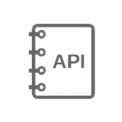
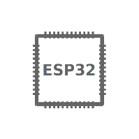

ESP-IDF Programming Guide
=========================
:link_to_translation:`zh_CN:[中文]`

This is the documentation for Espressif IoT Development Framework (`esp-idf <https://github.com/espressif/esp-idf>`_). ESP-IDF is the official development framework for the `ESP32 and ESP32-S Series SoCs <https://www.espressif.com/en/products/hardware/socs>`_.

.. only:: html

    This document describes using ESP-IDF with the {IDF_TARGET_NAME} SoC. To switch to a different SoC target, click "Switch Version" in the bottom left.

.. only:: latex

    This document describes using ESP-IDF with the {IDF_TARGET_NAME} SoC.

==================  ==================  ==================
|Get Started|_      |API Reference|_    |H/W Reference|_
------------------  ------------------  ------------------
`Get Started`_      `API Reference`_    `H/W Reference`_
------------------  ------------------  ------------------
|API Guides|_       |Contribute|_       |Resources|_
------------------  ------------------  ------------------
`API Guides`_       `Contribute`_       `Resources`_
==================  ==================  ==================

.. _Get Started: get-started/index.html

.. _API Reference: api-reference/index.html

.. _H/W Reference: hw-reference/index.html

.. _API Guides: api-guides/index.html

.. _Libraries and Frameworks: libraries-and-frameworks/index.html

.. _Contribute: contribute/index.html

.. _Resources: resources.html

.. toctree::
   :hidden:

   Get Started <get-started/index>
   API Reference <api-reference/index>
   H/W Reference <hw-reference/index>
   API Guides <api-guides/index>
   Libraries and Frameworks <libraries-and-frameworks/index>
   Contribute <contribute/index>
   Versions <versions>
   Resources <resources>
   Copyrights <COPYRIGHT>
   About <about>
   语言/Languages <languages>

* :ref:`genindex`

