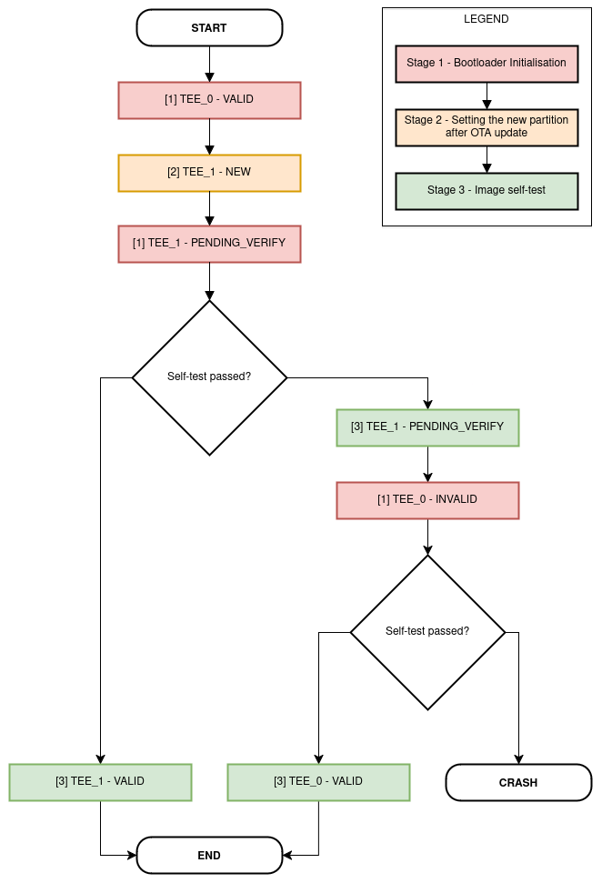

TEE Over-the-Air Updates (OTA)
==============================

Overview
--------

The OTA update mechanism allows a device to update itself based on data received while the normal firmware is running (for example, over Wi-Fi or Bluetooth). While OTA updates for application images are extensively documented :doc:`here <../../api-reference/system/ota>`, this section specifically details how OTA updates for the TEE image are securely managed.

TEE OTA requires configuring the partition table of the device with at least two TEE OTA app slot partitions (i.e., ``tee_0`` and ``tee_1``) and a TEE OTA Data Partition (type ``data`` and subtype ``tee_ota``).

    .. figure:: ../../../_static/esp_tee/{IDF_TARGET_PATH_NAME}/esp_tee_ota_flash_partitions.png
        :align: center
        :scale: 75%
        :alt: ESP TEE OTA Flash Partition
        :figclass: align-center

        Sample flash partition layout with TEE and application OTA support

.. _tee-ota-data-partition:

TEE OTA Data Partition
^^^^^^^^^^^^^^^^^^^^^^

An OTA data partition (type ``data``, subtype ``tee_ota``) for the TEE image must be included in the partition table of any project which uses the OTA functions. Note that the TEE app has its own OTA data partition, separate from that of the REE app.

For factory boot settings, the TEE OTA data partition should contain no data (all bytes erased to 0xFF). In this case, the second stage bootloader will boot the first available TEE OTA slot (usually ``tee_0``). After the first OTA update, the TEE OTA data partition is updated to specify which OTA app slot partition should be booted next.

The TEE OTA data partition is two flash sectors (0x2000 bytes) in size, to prevent problems if there is a power failure while it is being written. Sectors are independently erased and written with matching data, and if they disagree a counter field is used to determine which sector was written more recently.

    .. figure:: ../../../_static/esp_tee/tee_ota_data_entry.png
        :align: center
        :scale: 80%
        :alt: ESP TEE OTA Data Entry
        :figclass: align-center

        ESP-TEE: OTA Data partition entry

OTA Process: Boot-up Flow and Image Rollback
--------------------------------------------

#. The new TEE application is successfully downloaded over the appropriate interface (Wi-Fi, Bluetooth, Ethernet, etc.). The REE app will download the TEE OTA update. Since it does not have permission to write to the TEE flash region directly, it will issue the appropriate service calls to write the new firmware to the flash.
#. The new firmware is written to the passive TEE partition and set as the bootable partition with the state ``NEW``. This means that the application is new and should be monitored during its first boot. The system is then rebooted.
#. The bootloader will verify the magic and the CRC of the first sector in the ``tee_otadata`` partition. If invalid, the second sector will be used.
#. If the application state is ``PENDING_VERIFY``, it will be overwritten to ``INVALID``. The bootloader will not select any image marked as ``INVALID`` for booting.
#. If the application state is ``NEW``, it will be overwritten to ``PENDING_VERIFY``. This means that the application requires a confirmation to be considered as operable. If this does not happen and a reboot occurs, the state will be overwritten to ``INVALID`` and this application will no longer be able to boot, i.e., there will be a rollback to the previous working application.
#. The new TEE application starts executing, but it needs a self-test to confirm its operability. As we reach the point of entry of the non-secure app, we consider the rollback self-test to be successful. The application is then marked as valid (state ``VALID``) and selected across further reboots if there are no updates to the device.
#. If the self-test fails - the device did not reach the non-secure app entry point as there was some issue with the TEE image. This is considered as a critical exception and the device will reboot.

  .. note::

    - Any partition flashed serially will be automatically marked as valid during its first boot.

    - If the first ``tee_otadata`` sector is valid but does not match with a valid second ``tee_otadata`` sector (or vice versa), it is the responsibility of the bootloader to make the ``tee_otadata`` sectors the same before handing control to TEE.

    - If :ref:`Secure Boot <secure_boot-guide>` is enabled, the bootloader will verify the TEE and the non-secure app.

    TEE OTA process flow

Application Example
-------------------

The :example:`tee_secure_ota <security/tee/tee_secure_ota>` example demonstrates how to perform an Over-the-Air updates with HTTP/S for the TEE.

API Reference
-------------

.. note::

    To use the TEE OTA APIs in your project, ensure that the :component:`tee_ota_ops <esp_tee/subproject/components/tee_ota_ops>` component is listed as a local dependency in the component manager manifest file `idf_component.yml <https://docs.espressif.com/projects/idf-component-manager/en/latest/reference/manifest_file.html>`_. Refer to the :example:`tee_secure_ota <security/tee/tee_secure_ota>` example for guidance.

.. include-build-file:: inc/esp_tee_ota_ops.inc
