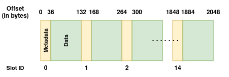
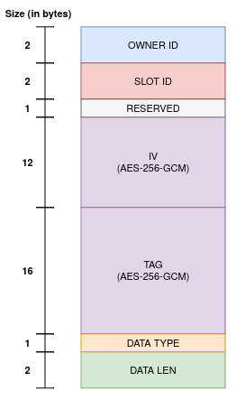

Secure Storage
==============

Overview
--------

The TEE Secure Storage service offers a persistent storage for securely holding sensitive data, such as cryptographic keys, cloud credentials or any other general-purpose information. It utilizes a dedicated flash partition of type ``data`` and subtype ``tee_sec_stg``. The confidentiality and integrity of the data is ensured by the TEE.

For enhanced security, data stored in the secure storage is encrypted using a device-specific encryption key with ``AES-256-GCM`` algorithm. Additionally, the secure storage provides interfaces for performing the following cryptographic services from the TEE using securely stored key material:

    #. Message signing and public key retrieval with the ``ecdsa_secp256r1`` algorithm
    #. Authenticated encryption and decryption using the ``aes256_gcm`` algorithm

Internals
---------

The secure storage partition is 4 KB in size, of which only the first half is used for storing data. The partition is divided into slots which hold data objects. Each data object within the TEE secure storage is encapsulated in a structured format, comprising the metadata and actual data.

    ESP-TEE: Secure Storage partition

Metadata is represented by the :cpp:type:`sec_stg_metadata_t` structure, which contains details related to the data stored in a specific slot of the storage. These details include information such as the owner, slot ID, data length, encryption parameters, etc.

.. list-table::
    :header-rows: 1
    :widths: 35 65
    :align: center

    * - **Element**
      - **Description**
    * - Owner ID
      - Application ID defining the data ownership
    * - Slot ID
      - Slot ID for corresponding owner ID
    * - Encryption: Initialization Vector (IV)
      - IV for the encryption algorithm
    * - Encryption: Tag
      - Tag for the encryption algorithm
    * - Data Type
      - Type of data stored in this slot
    * - Data Length
      - Actual data length

    ESP-TEE: Secure Storage Metadata

.. warning::

    Future ESP-TEE framework releases may modify the internal data structure of the TEE secure storage, which could introduce breaking changes in existing applications.

Each data object in the secure storage is encrypted as specified in the **AES-GCM based AEAD** encryption policy with a platform instance unique key of length **256 bits**, stored in the eFuse.

The TEE Secure Storage feature supports two modes (:ref:`CONFIG_SECURE_TEE_SEC_STG_MODE`) for determining which eFuse block stores the encryption key:

  - **Development** Mode: The encryption key is embedded (constant for all instances) in the ESP-TEE firmware.
  - **Release** Mode: The encryption key is stored in eFuse BLK4 - BLK9, depending on the :ref:`CONFIG_SECURE_TEE_SEC_STG_KEY_EFUSE_BLK` Kconfig option.

All the assets pertaining to the TEE secure storage are protected by the APM peripheral and thus, are inaccessible to the REE application. Any attempt to directly access them would result in a system fault.

.. note::

  - Currently, the TEE secure storage supports the storage of two types of cryptographic keys:

    #. ``ecdsa_secp256r1`` curve key-pairs, including the private and public key components
    #. ``aes256_gcm`` keys, including the key and initialization vector (IV)

  The internal structures for these key types are as follows:

  .. code-block:: c

    #define ECDSA_SECP256R1_KEY_LEN  32
    #define AES256_GCM_KEY_LEN       32
    #define AES256_GCM_IV_LEN        12

    typedef struct {
        /* Private key */
        uint8_t priv_key[ECDSA_SECP256R1_KEY_LEN];
        /* Public key - X and Y components */
        uint8_t pub_key[2 * ECDSA_SECP256R1_KEY_LEN];
    } sec_stg_ecdsa_secp256r1_t;

    typedef struct {
        /* Key */
        uint8_t key[AES256_GCM_KEY_LEN];
        /* Initialization Vector */
        uint8_t iv[AES256_GCM_IV_LEN];
    } sec_stg_aes256_gcm_t;

  - Future updates may include support for additional key types and general-purpose data storage.

Application Example
-------------------

The :example:`tee_secure_storage <security/tee/tee_secure_storage>` example demonstrates how to generate ECDSA key pairs and AES-256-GCM keys in the TEE secure storage and use them for signing messages and encrypting/decrypting data.

API Reference
-------------

.. note::

    To use the TEE Secure Storage APIs in your project, ensure that the :component:`tee_sec_storage <esp_tee/subproject/components/tee_sec_storage>` component is listed as a local dependency in the component manager manifest file `idf_component.yml <https://docs.espressif.com/projects/idf-component-manager/en/latest/reference/manifest_file.html>`_. Refer to the :example:`tee_secure_storage <security/tee/tee_secure_storage>` example for guidance.

.. include-build-file:: inc/esp_tee_sec_storage.inc
