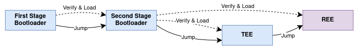

ESP-TEE: User Guide
===================

The ESP-TEE (Espressif Trusted Execution Environment) is a security framework built on top of dedicated hardware that ensures only authorized parties or applications can access protected information or services.
When enabled, ESP-TEE runs in parallel with a FreeRTOS-based ESP-IDF application. In this case, the execution environment is split into the following:

- **TEE**: the protected or trusted execution environment, managed by ESP-TEE.

- **REE**: the unprotected or rich execution environment, where the ESP-IDF user application runs.

An example use case for ESP-TEE is securely storing a cryptographic key in the TEE for authentication in a challenge-response protocol with external entities and enabling secure communication to protect data.

ESP-TEE offers several key secure services, including:

- :doc:`Secure Storage <tee-sec-storage>`

  ESP-TEE provides secure storage to ensure that sensitive data is stored in an encrypted external flash partition, completely inaccessible to the REE. It also supports secure key management and operations for signing and encryption.

- :doc:`Attestation <tee-attestation>`

  Attestation is a mechanism enabling a device to make claims about its identity and security status, through a cryptographically secured token. ESP-TEE generates this token in a predefined JSON format, signed using the ECDSA scheme.

- :doc:`Over-the-Air Updates (OTA) <tee-ota>`

  ESP-TEE supports a secure TEE OTA update mechanism, allowing the device to update the TEE firmware using data received during normal operation, such as over Wi-Fi or Bluetooth. The mechanism also includes support for update rollback.

For more information, see the :ref:`Secure Services <tee-secure-services>` section.

Scope of Protection
-------------------

The :doc:`Secure Boot <../secure-boot-v2>` feature ensures that only authenticated software can execute on the device. When enabled, a signed TEE image is generated during the build process alongside the signed REE image. The signing scheme and key are the same for both applications.

Secure Boot establishes a robust chain of trust by verifying all mutable software entities involved in the :doc:`Application Startup Flow <../../api-guides/startup>` i.e. the second stage bootloader, TEE, and REE applications. Signature verification is performed both during boot-up and OTA updates. While Secure Boot ensures boot-time security, ESP-TEE provides runtime security by safeguarding the security assets within the TEE.

In addition, the attestation service verifies the signature and firmware hash for all active software upon request, ensuring ongoing protection against unauthorized modifications.

The :doc:`Flash Encryption <../flash-encryption>` feature encrypts the contents of the {IDF_TARGET_NAME}'s off-chip flash memory, preventing physical readout from recovering its contents. The flash encryption key is securely stored in hardware and remains inaccessible to both TEE and REE.

    ESP-TEE: Boot-up Flow with Secure Boot for {IDF_TARGET_NAME}

.. important::

    It is highly recommended to enable both Secure Boot and Flash Encryption with ESP-TEE on all production devices.

Architecture: Simplified Overview
---------------------------------

ESP-TEE offers a secure execution environment centered around a Root-of-Trust (RoT), which is a set of implicitly trusted functions on which the system or device relies on for security.

The **Immutable RoT** consists of the following components:

- First stage bootloader (BootROM)
- Isolation hardware
- Cryptographic hardware (AES, SHA)
- eFuse

The **Updatable RoT** comprises the second stage bootloader and the TEE firmware, which is responsible for secure configuration, initialization, interrupt handling, exception management, and providing secure services for cryptographic operations as well as features like secure storage and attestation.

For more details about the individual components and the architecture, refer to the :ref:`Detailed Architecture <tee-detailed-architecture>` section.

.. _tee-memory-allocation:

Memory Allocation
-----------------

ESP-TEE divides the memory into separate regions for the TEE and REE, allocating part of the internal SRAM and external flash memory to the TEE. This separation safeguards sensitive data and operations within the TEE, preventing unauthorized access from the REE.

.. _tee-internal-memory:

Internal Memory (SRAM)
^^^^^^^^^^^^^^^^^^^^^^

Internal memory is allocated to the the TEE based on the Kconfig options that are available under the :ref:`Memory Configuration <esp-tee-trusted-execution-environment--enable-the-esp-tee-framework-memory-configuration>` section in the :ref:`esp-tee-trusted-execution-environment-` menu. All remaining memory is allocated to the REE.

.. warning::

  Modify the above values at your own risk as it may cause build or runtime failures.

Both the TEE and REE have independent heap allocators, each operating within the memory allocated to its respective application.

.. _tee-external-memory:

External Memory (Flash)
^^^^^^^^^^^^^^^^^^^^^^^

Designated partitions in the external flash are reserved for the TEE to support functions such as code XIP (eXecute-In-Place), secure storage, and OTA data. The partition table must include at least one TEE app slot (type ``app`` and subtype ``tee_0``) with a minimum size of 192 KB.

Example partition table is given below: ::

  # ESP-IDF Partition Table
  # Name,         Type, SubType,     Offset,   Size, Flags
  tee_0,          app,  tee_0,       0x10000,  192K,
  secure_storage, data, nvs,         0x40000,  64K,
  factory,        app,  factory,     0x50000,  1M,
  nvs,            data, nvs,         0x150000, 24K,
  phy_init,       data, phy,         0x156000, 4K,

.. important::

  The partition following the last TEE-related partition must be aligned to the configured MMU page size. This alignment is required to prevent secure boot verification failures when validating the user application (REE) image.

.. note::

  For more details on the default policy and scope of flash memory protection with ESP-TEE, refer to the :ref:`Flash Protection - Virtual and Physical Access <tee-flash-prot-scope>` section from the advanced guide.

.. _tee-secure-services:

Secure Services
---------------

All features that the TEE exposes to the REE are implemented as secure services. The REE can invoke such secure services through the interface APIs :cpp:func:`esp_tee_service_call` and :cpp:func:`esp_tee_service_call_with_noniram_intr_disabled`. Secure services can be preempted by TEE or REE interrupts.

.. note::

  Since multitasking is not currently supported in the TEE, secure service calls are serialized, and subsequent calls remain pending until the current service completes.

For {IDF_TARGET_NAME}, a list of secure services can be found at this :component_file:`table<esp_tee/scripts/{IDF_TARGET_PATH_NAME}/sec_srv_tbl_default.yml>`. Following are the types of secure services.

- **Core secure services**: Built-in services within the TEE firmware that provide routine functionalities to the REE, such as interrupt configuration and eFuse access.

- **Optional secure Services**: Configurable services that extend the capabilities of the TEE and can be enabled or disabled as needed, such as attestation.

- **Custom secure services**: User-defined secure services as required by the user application. For more details, refer to the :ref:`Adding Custom Secure Services <custom-secure-services>` section and the :example:`tee_basic <security/tee/tee_basic>` example.

Usage
-----

#. **Enable ESP-TEE**: In the :ref:`Project Configuration <project-configuration-guide>` menu, go to :ref:`esp-tee-trusted-execution-environment-` and set the option :ref:`CONFIG_SECURE_ENABLE_TEE`.

#. **Configure the TEE logging**:

   - Set :ref:`CONFIG_SECURE_TEE_DEBUG_MODE` to enable logging for TEE.

   - Set :ref:`CONFIG_SECURE_TEE_LOG_LEVEL` to select the logging verbosity level.

#. **Configure the TEE memory regions**:

   - Set :ref:`CONFIG_SECURE_TEE_IRAM_SIZE` to configure the TEE IRAM size

   - Set :ref:`CONFIG_SECURE_TEE_DRAM_SIZE` to configure the TEE DRAM size

   - Set :ref:`CONFIG_SECURE_TEE_STACK_SIZE` and :ref:`CONFIG_SECURE_TEE_INTR_STACK_SIZE` to configure the TEE task and interrupt stack from the reserved DRAM

#. **Configure the partition table**:

   - Select one of the simple predefined partition tables under :ref:`CONFIG_PARTITION_TABLE_TYPE` - *Single factory app, no OTA, TEE* or *Two OTA definitions, TEE*

   - Alternatively, select the *Custom partition table CSV* option and define your own layout as per the guidelines provided in the :ref:`tee-external-memory` section.

Application Examples
--------------------

Examples are available in the :example:`security/tee` directory, showcasing the various ESP-TEE secure services. For more detailed information, please refer to the ``README.md`` file within each specific example.

API Reference
-------------

.. include-build-file:: inc/esp_tee.inc
