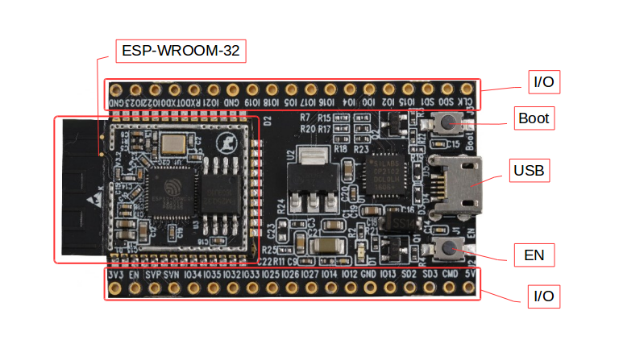

ESP32-DevKitC Getting Started Guide
===================================

This user guide shows how to get started with ESP32-DevKitC development board.

What You Need
-------------

* 1 × :ref:`ESP32-DevKitC board <get-started-esp32-devkitc-board-front>`
* 1 × USB A / micro USB B cable 
* 1 × PC loaded with Windows, Linux or Mac OS

Overview
--------

ESP32-DevKitC is a small-sized ESP32-based development board produced by `Espressif <https://espressif.com>`_. Most of the I/O pins are broken out to the pin headers on both sides for easy interfacing. Developers can connect these pins to peripherals as needed. Standard headers also make development easy and convenient when using a breadboard.

Functional Description
----------------------

The following list and figure below describe key components, interfaces and controls of ESP32-DevKitC board.

ESP-WROOM-32
    Standard `ESP-WROOM-32 <https://www.espressif.com/sites/default/files/documentation/esp-wroom-32_datasheet_en.pdf>`_ module soldered to the ESP32-DevKitC board.
EN
    Reset button: pressing this button resets the system.
Boot
    Download button: holding down the **Boot** button and pressing the **EN** button initiates the firmware download mode. Then user can download firmware through the serial port.
USB
    USB interface. It functions as the power supply for the board and the communication interface between PC and ESP-WROOM-32.
I/O
    Most of the pins on the ESP-WROOM-32 are broken out to the pin headers on the board. Users can program ESP32 to enable multiple functions such as PWM,ADC, DAC, I2C, I2S, SPI, etc.

.. _get-started-esp32-devkitc-board-front:

    ESP32-DevKitC board layout

Power Supply Options
--------------------

There following options are available to provide power supply to the ESP32-PICO-KIT V4:

1. Micro USB port, this is default power supply connection
2. 5V / GND header pins
3. 3V3 / GND header pins

.. warning::

    Above options are mutually exclusive, i.e. the power supply may be provided using only one of the above options. Attempt to power the board using more than one connection at a time may damage the board and/or the power supply source.

Start Application Development
------------------------------

Before powering up the ESP32-DevKitC, please make sure that the board has been received in good condition with no obvious signs of damage.

To start development of applications, proceed to section :doc:`index`, that will walk you through the following steps:

* :ref:`get-started-setup-toolchain` in your PC to develop applications for ESP32 in C language
* :ref:`get-started-connect` the module to the PC and verify if it is accessible
* :ref:`get-started-build-flash` an example application to the ESP32
* :ref:`get-started-build-monitor` instantly what the application is doing

Related Documents
-----------------

* `ESP32-DevKitC schematic <https://dl.espressif.com/dl/schematics/ESP32-Core-Board-V2_sch.pdf>`_ (PDF)
* `ESP32 Datasheet <https://www.espressif.com/sites/default/files/documentation/esp32_datasheet_en.pdf>`_ (PDF)
* `ESP-WROOM-32 Datasheet <https://espressif.com/sites/default/files/documentation/esp-wroom-32_datasheet_en.pdf>`_ (PDF)
