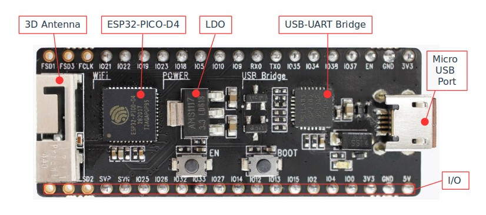
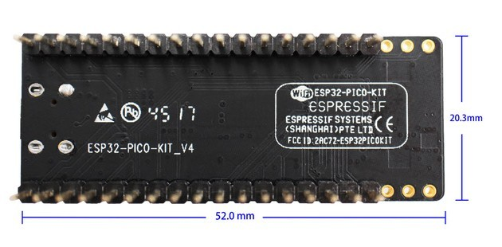

ESP32-PICO-KIT V4 Getting Started Guide
=======================================

This user guide shows how to get started with the ESP32-PICO-KIT V4 mini development board. For description of other versions of the ESP32-PICO-KIT check :doc:`../hw-reference/index`.

What You Need
-------------

* 1 × :ref:`ESP32-PICO-KIT V4 mini development board <get-started-pico-kit-v4-board-front>`
* 1 × USB A / Micro USB B cable
* 1 × PC loaded with Windows, Linux or Mac OS

If you like to start using this board right now, go directly to section `Start Application Development`_.

Overview
--------

ESP32-PICO-KIT V4 is a mini development board produced by `Espressif <https://espressif.com>`_. At the core of this board is the ESP32-PICO-D4, a System-in-Package (SIP) module with complete Wi-Fi and Bluetooth functionalities. Comparing to other ESP32 chips, the ESP32-PICO-D4 integrates several peripheral components in one single package, that otherwise would need to be installed separately. This includes a 40 MHz crystal oscillator, 4 MB flash, filter capacitors and RF matching links in. This greatly reduces quantity and costs of additional components, subsequent assembly and testing cost, as well as overall product complexity.

The development board integrates a USB-UART Bridge circuit, allowing the developers to connect the board to a PC's USB port for downloads and debugging. 

For easy interfacing, all the IO signals and system power on ESP32-PICO-D4 are led out through two rows of 20 x 0.1" pitch header pads on both sides of the development board. To make the ESP32-PICO-KIT V4 fit into mini breadboards, the header pads are populated with two rows of 17 pin headers. Remaining 2 x 3 pads grouped on each side of the board besides the antenna are not populated. The remaining 2 x 3 pin headers may be soldered later by the user. 

.. note::

    The 2 x 3 pads not populated with pin headers are internally connected to the flash memory embedded in the ESP32-PICO-D4 SIP module. For more details see module's datasheet in `Related Documents`_.

The board dimensions are 52 x 20.3 x 10 mm (2.1" x 0.8" x 0.4"), see section `Board Dimensions`_. An overview functional block diagram is shown below.

.. figure:: ../_static/esp32-pico-kit-v4-functional-block-diagram.png
    :align: center
    :alt: ESP32-PICO-KIT V4 functional block diagram
    :figclass: align-center

    ESP32-PICO-KIT V4 functional block diagram

Functional Description
----------------------

The following list and figure below describe key components, interfaces and controls of ESP32-PICO-KIT V4 board.

ESP32-PICO-D4
    Standard ESP32-PICO-D4 module soldered to the ESP32-PICO-KIT V4 board. The complete system of the ESP32 chip has been integrated into the SIP module, requiring only external antenna with LC matching network, decoupling capacitors and pull-up resistors for EN signals to function properly.
LDO
    5V-to-3.3V Low dropout voltage regulator (LDO).
USB-UART Bridge
    A single chip USB-UART bridge provides up to 1 Mbps transfers rates.
Micro USB Port
    USB interface. It functions as the power supply for the board and the communication interface between PC and ESP32-PICO-KIT V4.
5V Power On LED
    This light emitting diode lits when the USB or an external 5V power supply is applied to the board. For details see schematic in `Related Documents`_.
I/O
    All the pins on ESP32-PICO-D4 are broken out to the pin headers on the board. Users can program ESP32 to enable multiple functions such as PWM, ADC, DAC, I2C, I2S, SPI, etc. For details please see section `Pin Descriptions`_.
BOOT Button
    Holding down the Boot button and pressing the EN button initiates the firmware download mode. Then user can download firmware through the serial port.
EN Button
    Reset button; pressing this button resets the system.

.. _get-started-pico-kit-v4-board-front:

    ESP32-PICO-KIT V4 board layout

Power Supply Options
--------------------

There following options are available to provide power supply to the ESP32-PICO-KIT V4:

1. Micro USB port, this is default power supply connection
2. 5V / GND header pins
3. 3V3 / GND header pins

.. warning::

    Above options are mutually exclusive, i.e. the power supply may be provided using only one of the above options. Attempt to power the board using more than one connection at a time may damage the board and/or the power supply source.

Start Application Development
-----------------------------

Before powering up the ESP32-PICO-KIT V4, please make sure that the board has been received in good condition with no obvious signs of damage.

To start development of applications, proceed to section :doc:`index`, that will walk you through the following steps:

* :ref:`get-started-setup-toolchain` in your PC to develop applications for ESP32 in C language
* :ref:`get-started-connect` the module to the PC and verify if it is accessible
* :ref:`get-started-build-flash` an example application to the ESP32
* :ref:`get-started-build-monitor` instantly what the application is doing

Pin Descriptions
----------------

The two tables below provide the **Name** and **Function** of I/O headers on both sides of the board, see :ref:`get-started-pico-kit-v4-board-front`. The pin numbering and header names are the same as on a schematic in `Related Documents`_.

Header J2
"""""""""

======  =================  ======  ======================================================
No.     Name               Type    Function
======  =================  ======  ======================================================
1       FLASH_SD1 (FSD1)   I/O     | GPIO8, SD_DATA1, SPID, HS1_DATA1 :ref:`(1) <get-started-pico-kit-v4-pin-notes>` , U2CTS
2       FLASH_SD3 (FSD3)   I/O     | GPIO7, SD_DATA0, SPIQ, HS1_DATA0 :ref:`(1) <get-started-pico-kit-v4-pin-notes>` , U2RTS
3       FLASH_CLK (FCLK)   I/O     | GPIO6, SD_CLK, SPICLK, HS1_CLK :ref:`(1) <get-started-pico-kit-v4-pin-notes>` , U1CTS 
4       IO21               I/O     | GPIO21, VSPIHD, EMAC_TX_EN
5       IO22               I/O     | GPIO22, VSPIWP, U0RTS, EMAC_TXD1
6       IO19               I/O     | GPIO19, VSPIQ, U0CTS, EMAC_TXD0
7       IO23               I/O     | GPIO23, VSPID, HS1_STROBE
8       IO18               I/O     | GPIO18, VSPICLK, HS1_DATA7
9       IO5                I/O     | GPIO5, VSPICS0, HS1_DATA6, EMAC_RX_CLK
10      IO10               I/O     | GPIO10, SD_DATA3, SPIWP, HS1_DATA3, U1TXD
11      IO9                I/O     | GPIO9, SD_DATA2, SPIHD, HS1_DATA2, U1RXD
12      RXD0               I/O     | GPIO3, U0RXD :ref:`(4) <get-started-pico-kit-v4-pin-notes>` , CLK_OUT2
13      TXD0               I/O     | GPIO1, U0TXD :ref:`(4) <get-started-pico-kit-v4-pin-notes>` , CLK_OUT3, EMAC_RXD2
14      IO35               I       | ADC1_CH7, RTC_GPIO5
15      IO34               I       | ADC1_CH6, RTC_GPIO4
16      IO38               I       | GPIO38, ADC1_CH2, ADC_PRE_AMP :ref:`(2b) <get-started-pico-kit-v4-pin-notes>` , RTC_GPIO2
17      IO37               I       | GPIO37, ADC_PRE_AMP :ref:`(2a) <get-started-pico-kit-v4-pin-notes>` , ADC1_CH1, RTC_GPIO1
18      EN                 I       | CHIP_PU
19      GND                P       | Ground
20      VDD33 (3V3)        P       | 3.3V power supply
======  =================  ======  ======================================================

Header J3
"""""""""

======  =================  ======  ======================================================
No.     Name               Type    Function
======  =================  ======  ======================================================
1       FLASH_CS (FCS)     I/O     | GPIO16, HS1_DATA4 :ref:`(1) <get-started-pico-kit-v4-pin-notes>` , U2RXD, EMAC_CLK_OUT
2       FLASH_SD0 (FSD0)   I/O     | GPIO17, HS1_DATA5 :ref:`(1) <get-started-pico-kit-v4-pin-notes>` , U2TXD, EMAC_CLK_OUT_180
3       FLASH_SD2 (FSD2)   I/O     | GPIO11, SD_CMD, SPICS0, HS1_CMD :ref:`(1) <get-started-pico-kit-v4-pin-notes>` , U1RTS
4       SENSOR_VP (FSVP)   I       | GPIO36, ADC1_CH0, ADC_PRE_AMP :ref:`(2a) <get-started-pico-kit-v4-pin-notes>` , RTC_GPIO0
5       SENSOR_VN (FSVN)   I       | GPIO39, ADC1_CH3, ADC_PRE_AMP :ref:`(2b) <get-started-pico-kit-v4-pin-notes>` , RTC_GPIO3
6       IO25               I/O     | GPIO25, DAC_1, ADC2_CH8, RTC_GPIO6, EMAC_RXD0
7       IO26               I/O     | GPIO26, DAC_2, ADC2_CH9, RTC_GPIO7, EMAC_RXD1
8       IO32               I/O     | 32K_XP :ref:`(3a) <get-started-pico-kit-v4-pin-notes>` , ADC1_CH4, TOUCH9, RTC_GPIO9
9       IO33               I/O     | 32K_XN :ref:`(3b) <get-started-pico-kit-v4-pin-notes>` , ADC1_CH5, TOUCH8, RTC_GPIO8
10      IO27               I/O     | GPIO27, ADC2_CH7, TOUCH7, RTC_GPIO17
                                   | EMAC_RX_DV
11      IO14               I/O     | ADC2_CH6, TOUCH6, RTC_GPIO16, MTMS, HSPICLK,
                                   | HS2_CLK, SD_CLK, EMAC_TXD2
12      IO12               I/O     | ADC2_CH5, TOUCH5, RTC_GPIO15, MTDI :ref:`(5) <get-started-pico-kit-v4-pin-notes>` , HSPIQ,
                                   | HS2_DATA2, SD_DATA2, EMAC_TXD3
13      IO13               I/O     | ADC2_CH4, TOUCH4, RTC_GPIO14, MTCK, HSPID,
                                   | HS2_DATA3, SD_DATA3, EMAC_RX_ER
14      IO15               I/O     | ADC2_CH3, TOUCH3, RTC_GPIO13, MTDO, HSPICS0
                                   | HS2_CMD, SD_CMD, EMAC_RXD3
15      IO2                I/O     | ADC2_CH2, TOUCH2, RTC_GPIO12, HSPIWP,
                                   | HS2_DATA0, SD_DATA0
16      IO4                I/O     | ADC2_CH0, TOUCH0, RTC_GPIO10, HSPIHD,
                                   | HS2_DATA1, SD_DATA1, EMAC_TX_ER
17      IO0                I/O     | ADC2_CH1, TOUCH1, RTC_GPIO11, CLK_OUT1
                                   | EMAC_TX_CLK
18      VDD33 (3V3)        P       | 3.3V power supply
19      GND                P       | Ground
20      EXT_5V (5V)        P       | 5V power supply
======  =================  ======  ======================================================

.. _get-started-pico-kit-v4-pin-notes:

**Notes to** `Pin Descriptions`_ 

    1. This pin is connected to the flash pin of ESP32-PICO-D4.
    2. When used as ADC_PRE_AMP, connect 270 pF capacitors between: (a) SENSOR_VP and IO37, (b) SENSOR_VN and IO38.
    3. 32.768 kHz crystal oscillator: (a) input, (b) output.
    4. This pin is connected to the pin of the USB bridge chip on the board.
    5. The operating voltage of ESP32-PICO-KIT’s embedded SPI flash is 3.3V. Therefore, the strapping pin MTDI should hold bit ”0” during the module power-on reset.

Board Dimensions
----------------

    ESP32-PICO-KIT V4 dimensions - back

.. figure:: ../_static/esp32-pico-kit-v4-dimensions-side.jpg
    :align: center
    :alt: ESP32-PICO-KIT V4 dimensions - side
    :figclass: align-center

    ESP32-PICO-KIT V4 dimensions - side

Related Documents
-----------------

* `ESP32-PICO-KIT V4 schematic <https://dl.espressif.com/dl/schematics/esp32-pico-kit-v4_schematic.pdf>`_ (PDF)
* `ESP32-PICO-D4 Datasheet <http://espressif.com/sites/default/files/documentation/esp32-pico-d4_datasheet_en.pdf>`_ (PDF)
* :doc:`../hw-reference/index`

.. toctree::
    :hidden:

    get-started-pico-kit-v3
