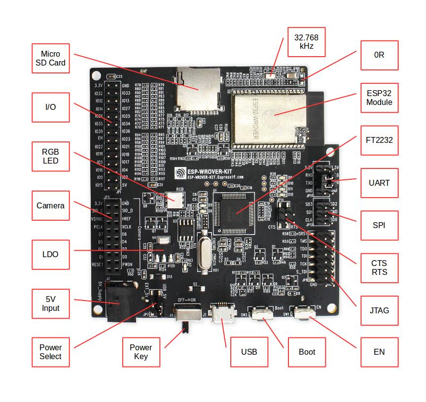

ESP-WROVER-KIT V3 Getting Started Guide
=======================================

This user guide shows how to get started with ESP-WROVER-KIT V3 development board including description of its functionality and configuration options. For description of other versions of the ESP-WROVER-KIT check :doc:`../hw-reference/index`.

If you like to start using this board right now, go directly to section :ref:`get-started-esp-wrover-kit-start-development`.

What You Need
-------------

* 1 × :ref:`ESP-WROVER-KIT V3 board <get-started-esp-wrover-kit-board-front>`
* 1 x Micro USB 2.0 Cable, Type A to Micro B
* 1 × PC loaded with Windows, Linux or Mac OS

Overview
^^^^^^^^

The ESP-WROVER-KIT is a development board produced by `Espressif <https://espressif.com>`_ built around ESP32. This board is compatible with ESP32 modules, including the ESP-WROOM-32 and ESP32-WROVER. The ESP-WROVER-KIT features support for an LCD and MicroSD card. The I/O pins have been broken out from the ESP32 module for easy extension. The board carries an advanced multi-protocol USB bridge (the FTDI FT2232HL), enabling developers to use JTAG directly to debug the ESP32 through the USB interface. The development board makes secondary development easy and cost-effective.

.. note::

    ESP-WROVER-KIT V3 integrates the ESP32-WROVER module by default. 

Functionality Overview
^^^^^^^^^^^^^^^^^^^^^^

Block diagram below presents main components of ESP-WROVER-KIT and interconnections between components.

.. figure:: ../_static/esp32-wrover-kit-block-diagram.png
    :align: center
    :alt: ESP-WROVER-KIT block diagram
    :figclass: align-center

    ESP-WROVER-KIT block diagram

Functional Description
^^^^^^^^^^^^^^^^^^^^^^

The following list and figures below describe key components, interfaces and controls of ESP-WROVER-KIT board.

32.768 kHz
    An external precision 32.768 kHz crystal oscillator provides the chip with a clock of low-power consumption during the Deep-sleep mode.
0R
    A zero Ohm resistor intended as a placeholder for a current shunt. May be desoldered or replaced with a current shunt to facilitate measurement of current required by ESP32 module depending on power mode.
ESP32 Module
    ESP-WROVER-KIT is compatible with both ESP-WROOM-32 and ESP32-WROVER. The ESP32-WROVER module features all the functions of ESP-WROOM-32 and integrates an external 32-MBit PSRAM for flexible extended storage and data processing capabilities.

    .. note::

        GPIO16 and GPIO17 are used as the CS and clock signal for PSRAM. To ensure reliable performance, the two GPIOs are not broken out.

FT2232
    The FT2232 chip is a multi-protocol USB-to-serial bridge. Users can control and program the FT2232 chip through the USB interface to establish communication with ESP32. The FT2232 chip also features USB-to-JTAG interface. USB-to-JTAG is available on channel A of FT2232, USB-to-serial on channel B. The embedded FT2232 chip is one of the distinguishing features of the ESPWROVER-KIT. It enhances users’ convenience in terms of application development and debugging. In addition, users do not need to buy a JTAG debugger separately, which reduces the development cost, see `ESP-WROVER-KIT V3 schematic`_.
UART
    Serial port: the serial TX/RX signals on FT2232HL and ESP32 are broken out to the two sides of JP11. By default, the two signals are connected with jumpers. To use the ESP32 module serial interface only, the jumpers may be removed and the module can be connected to another external serial device.
SPI
    SPI interface: the SPI interface connects to an external flash (PSRAM). To interface another SPI device, an extra CS signal is needed. The electrical level on the flash of this module is 1.8V. If an ESP-WROOM-32 is being used, please note that the electrical level on the flash of this module is 3.3V.
CTS/RTS
    Serial port flow control signals: the pins are not connected to the circuitry by default. To enable them, respective pins of JP14 must be shorted with jumpers.
JTAG
    JTAG interface: the JTAG signals on FT2232HL and ESP32 are broken out to the two sides of JP8. By default, the two signals are disconnected. To enable JTAG, shorting jumpers are required on the signals.
EN
    Reset button: pressing this button resets the system.
Boot
    Download button: holding down the **Boot** button and pressing the **EN** button initiates the firmware download mode. Then user can download firmware through the serial port.
USB
    USB interface. It functions as the power supply for the board and the communication interface between PC and ESP32 module.
Power Select
    Power supply selection interface: the ESP-WROVER-KIT can be powered through the USB interface or the 5V Input interface. The user can select the power supply with a jumper. More details can be found in section :ref:`get-started-esp-wrover-kit-setup-options`, jumper header JP7.
Power Key
    Power on/off button: toggling to the right powers the board on; toggling to the left powers the board off.
5V Input
    The 5V power supply interface is used as a backup power supply in case of full-load operation.
LDO
    NCP1117(1A). 5V-to-3.3V LDO. (There is an alternative pin-compatible LDO — LM317DCY, with an output current of up to 1.5A). NCP1117 can provide a maximum current of 1A. The LDO solutions are available with both fixed output voltage and variable output voltage. For details please refer to `ESP-WROVER-KIT V3 schematic`_.
Camera
    Camera interface: a standard OV7670 camera module is supported.
RGB
    Red, green and blue (RGB) light emitting diodes (LEDs), which may be controlled by pulse width modulation (PWM).
I/O
    All the pins on the ESP32 module are led out to the pin headers on the ESP-WROVER-KIT. Users can program ESP32 to enable multiple functions such as PWM, ADC, DAC, I2C, I2S, SPI, etc.
Micro SD Card
    Micro SD card slot for data storage.
LCD
    ESP-WROVER-KIT supports mounting and interfacing a 3.2” SPI (standard 4-wire Serial Peripheral Interface) LCD, as shown on figure :ref:`get-started-esp-wrover-kit-board-back`.

.. _get-started-esp-wrover-kit-board-front:

    ESP-WROVER-KIT board layout - front

.. _get-started-esp-wrover-kit-board-back:

    ESP-WROVER-KIT board layout - back

.. _get-started-esp-wrover-kit-setup-options:

Setup Options
^^^^^^^^^^^^^

There are five jumper headers available to set up the board functionality. Typical options to select from are listed in table below.

+--------+------------------+--------------------------------------------------+
| Header | Jumper Setting   | Description of Functionality                     |
+--------+------------------+--------------------------------------------------+
|  JP7   | |jp7-ext_5v|     | Power ESP-WROVER-KIT board from an external      |
|        |                  | | power supply                                   |
+--------+------------------+--------------------------------------------------+
|  JP7   | |jp7-usb_5v|     | Power ESP-WROVER-KIT board from an USB port      |
+--------+------------------+--------------------------------------------------+
|  JP8   | |jp8|            | Enable JTAG functionality                        |
+--------+------------------+--------------------------------------------------+
|  JP11  | |jp11-rx-tx|     | Enable UART communication                        |
+--------+------------------+--------------------------------------------------+
|  JP14  | |jp14|           | Enable RTS/CTS flow control for serial           |
|        |                  | communication                                    |
+--------+------------------+--------------------------------------------------+

Allocation of ESP32 Pins
^^^^^^^^^^^^^^^^^^^^^^^^

Several pins / terminals of ESP32 module are allocated to the on board hardware. Some of them, like GPIO0 or GPIO2, have multiple functions. If certain hardware is not installed, e.g. nothing is plugged in to the Camera / JP4 header, then selected GPIOs may be used for other purposes.

Main I/O Connector / JP1
""""""""""""""""""""""""

The JP1 connector is shown in two columns in the middle under "I/O" headers. The two columns "Shared With" outside, describe where else on the board certain GPIO is used. 

+----------------------+------+------+----------------------+
|          Shared With | I/O  | I/O  | Shared With          |
+======================+======+======+======================+
|                      | 3.3V | GND  |                      |
+----------------------+------+------+----------------------+
|              NC/XTAL | IO32 | IO33 | NC/XTAL              |
+----------------------+------+------+----------------------+
|        JTAG, MicroSD | IO12 | IO13 | JTAG, MicroSD        |
+----------------------+------+------+----------------------+
|        JTAG, MicroSD | IO14 | IO27 | Camera               |
+----------------------+------+------+----------------------+
|               Camera | IO26 | IO25 | Camera, LCD          |
+----------------------+------+------+----------------------+
|               Camera | IO35 | IO34 | Camera               |
+----------------------+------+------+----------------------+
|               Camera | IO39 | IO36 | Camera               |
+----------------------+------+------+----------------------+
|                 JTAG | EN   | IO23 | Camera, LCD          |
+----------------------+------+------+----------------------+
|          Camera, LCD | IO22 | IO21 | Camera, LCD, MicroSD |
+----------------------+------+------+----------------------+
|          Camera, LCD | IO19 | IO18 | Camera, LCD          |
+----------------------+------+------+----------------------+
|          Camera, LCD | IO5  | IO17 | PSRAM                |
+----------------------+------+------+----------------------+
|                PSRAM | IO16 | IO4  | LED, Camera, MicroSD |
+----------------------+------+------+----------------------+
|            LED, Boot | IO0  | IO2  | LED, Camera, MicroSD |
+----------------------+------+------+----------------------+
|        JTAG, MicroSD | IO15 | 5V   |                      |
+----------------------+------+------+----------------------+

Legend:

* NC/XTAL - :ref:`32.768 kHz Oscillator <get-started-esp-wrover-kit-xtal>`
* JTAG - :ref:`JTAG / JP8 <get-started-esp-wrover-jtag-header>`
* Boot - Boot button / SW2
* Camera - :ref:`Camera / JP4 <get-started-esp-wrover-camera-header>`
* LED - :ref:`RGB LED <get-started-esp-wrover-rgb-led-connections>`
* MicroSD - :ref:`MicroSD Card / J4 <get-started-esp-wrover-microsd-card-slot>`
* LCD - :ref:`LCD / U5 <get-started-esp-wrover-lcd-connector>`
* PSRAM - ESP32-WROVER's PSRAM, if ESP32-WROVER is installed

.. _get-started-esp-wrover-kit-xtal:

32.768 kHz Oscillator
"""""""""""""""""""""

+---+-----------+
|   | ESP32 Pin |
+===+===========+
| 1 | GPIO32    |
+---+-----------+
| 2 | GPIO33    |
+---+-----------+

.. note::

    As GPIO32 and GPIO33 are connected to the oscillator, to maintain signal integrity, they are not connected to JP1 I/O expansion connector. This allocation may be changed from oscillator to JP1 by desoldering 0R resistors from positions R11 / R23 and installing them in positions R12 / R24.

.. _get-started-esp-wrover-spi-flash-header:

SPI Flash / JP13
""""""""""""""""

+---+--------------+
|   | ESP32 Pin    |
+===+==============+
| 1 | CLK / GPIO6  |
+---+--------------+
| 2 | SD0 / GPIO7  |
+---+--------------+
| 3 | SD1 / GPIO8  |
+---+--------------+
| 4 | SD2 / GPIO9  |
+---+--------------+
| 5 | SD3 / GPIO10 |
+---+--------------+
| 6 | CMD / GPIO11 |
+---+--------------+

.. _get-started-esp-wrover-jtag-header:

JTAG / JP8
""""""""""

+---+---------------+-------------+
|   | ESP32 Pin     | JTAG Signal |
+===+===============+=============+
| 1 | EN            | TRST_N      |
+---+---------------+-------------+
| 2 | MTDO / GPIO15 | TDO         |
+---+---------------+-------------+
| 3 | MTDI / GPIO12 | TDI         |
+---+---------------+-------------+
| 4 | MTCK / GPIO13 | TCK         |
+---+---------------+-------------+
| 5 | MTMS / GPIO14 | TMS         |
+---+---------------+-------------+

.. _get-started-esp-wrover-camera-header:

Camera / JP4
""""""""""""

+----+--------------+----------------------+
|    | ESP32 Pin    | Camera Signal        |
+====+==============+======================+
|  1 | GPIO27       | SCCB Clock           |
+----+--------------+----------------------+
|  2 | GPIO26       | SCCB Data            |
+----+--------------+----------------------+
|  3 | GPIO21       | System Clock         |
+----+--------------+----------------------+
|  4 | GPIO25       | Vertical Sync        |
+----+--------------+----------------------+
|  5 | GPIO23       | Horizontal Reference |
+----+--------------+----------------------+
|  6 | GPIO22       | Pixel Clock          |
+----+--------------+----------------------+
|  7 | GPIO4        | Pixel Data Bit 0     |
+----+--------------+----------------------+
|  8 | GPIO5        | Pixel Data Bit 1     |
+----+--------------+----------------------+
|  9 | GPIO18       | Pixel Data Bit 2     |
+----+--------------+----------------------+
| 10 | GPIO19       | Pixel Data Bit 3     |
+----+--------------+----------------------+
| 11 | GPIO36       | Pixel Data Bit 4     |
+----+--------------+----------------------+
| 11 | GPIO39       | Pixel Data Bit 5     |
+----+--------------+----------------------+
| 11 | GPIO34       | Pixel Data Bit 6     |
+----+--------------+----------------------+
| 11 | GPIO35       | Pixel Data Bit 7     |
+----+--------------+----------------------+
| 11 | GPIO2        | Camera Reset         |
+----+--------------+----------------------+

.. _get-started-esp-wrover-rgb-led-connections:

RGB LED
"""""""

+---+-----------+---------+
|   | ESP32 Pin | RGB LED |
+===+===========+=========+
| 1 | GPIO0     | Red     |
+---+-----------+---------+
| 2 | GPIO2     | Blue    |
+---+-----------+---------+
| 3 | GPIO4     | Green   |
+---+-----------+---------+

.. _get-started-esp-wrover-microsd-card-slot:

MicroSD Card / J4
"""""""""""""""""

+---+---------------+----------------+
|   | ESP32 Pin     | MicroSD Signal |
+===+===============+================+
| 1 | MTDI / GPIO12 | DATA2          |
+---+---------------+----------------+
| 2 | MTCK / GPIO13 | CD / DATA3     |
+---+---------------+----------------+
| 3 | MTDO / GPIO15 | CMD            |
+---+---------------+----------------+
| 4 | MTMS / GPIO14 | CLK            |
+---+---------------+----------------+
| 5 | GPIO2         | DATA0          |
+---+---------------+----------------+
| 6 | GPIO4         | DATA1          |
+---+---------------+----------------+
| 7 | GPIO21        | CD             |
+---+---------------+----------------+

.. _get-started-esp-wrover-lcd-connector:

LCD / U5
""""""""

+---+-----------+------------+
|   | ESP32 Pin | LCD Signal |
+===+===========+============+
| 1 | GPIO18    | RESET      |
+---+-----------+------------+
| 2 | GPIO19    | SCL        |
+---+-----------+------------+
| 3 | GPIO21    | D/C        |
+---+-----------+------------+
| 4 | GPIO22    | CS         |
+---+-----------+------------+
| 5 | GPIO23    | SDA        |
+---+-----------+------------+
| 6 | GPIO25    | SDO        |
+---+-----------+------------+
| 7 | GPIO5     | Backlight  |
+---+-----------+------------+

.. _get-started-esp-wrover-kit-start-development:

Start Application Development
-----------------------------

Before powering up the ESP-WROVER-KIT, please make sure that the board has been received in good condition with no obvious signs of damage.

Initial Setup
^^^^^^^^^^^^^

Select the source of power supply for the board by setting jumper JP7. The options are either USB port or an external power supply. For this application selection of USB port is sufficient. Enable UART communication by installing jumpers on JP11. Both selections are shown in table below.

+----------------------+----------------------+
| Power up             | Enable UART          |
| from USB port        | communication        |
+----------------------+----------------------+
| |jp7-usb_5v|         | |jp11-rx-tx|         |
+----------------------+----------------------+

Do not install any other jumpers.

Now to Development
^^^^^^^^^^^^^^^^^^

To start development of applications for ESP-WROVER-KIT, proceed to section :doc:`index`, that will walk you through the following steps:

* :ref:`get-started-setup-toolchain` in your PC to develop applications for ESP32 in C language
* :ref:`get-started-connect` the module to the PC and verify if it is accessible
* :ref:`get-started-build-flash` an example application to the ESP32
* :ref:`get-started-build-monitor` instantly what the application is doing

Related Documents
-----------------

* `ESP-WROVER-KIT V3 schematic`_ (PDF)
* `ESP32 Datasheet <https://www.espressif.com/sites/default/files/documentation/esp32_datasheet_en.pdf>`_ (PDF)
* `ESP32-WROVER Datasheet <https://espressif.com/sites/default/files/documentation/esp32-wrover_datasheet_en.pdf>`_ (PDF)
* `ESP-WROOM-32 Datasheet <https://espressif.com/sites/default/files/documentation/esp-wroom-32_datasheet_en.pdf>`_ (PDF)
* :doc:`../api-guides/jtag-debugging/index`
* :doc:`../hw-reference/index`

.. |jp1-sd_io2| image:: ../_static/wrover-jp1-sd_io2.png
.. |jp1-both| image:: ../_static/wrover-jp1-both.png
.. |jp7-ext_5v| image:: ../_static/wrover-jp7-ext_5v.png
.. |jp7-usb_5v| image:: ../_static/wrover-jp7-usb_5v.png
.. |jp8| image:: ../_static/wrover-jp8.png
.. |jp11-rx-tx| image:: ../_static/wrover-jp11-tx-rx.png
.. |jp14| image:: ../_static/wrover-jp14.png

.. _ESP-WROVER-KIT V3 schematic: https://dl.espressif.com/dl/schematics/ESP-WROVER-KIT_SCH-3.pdf

.. toctree::
    :hidden:

    get-started-wrover-kit-v2.rst
