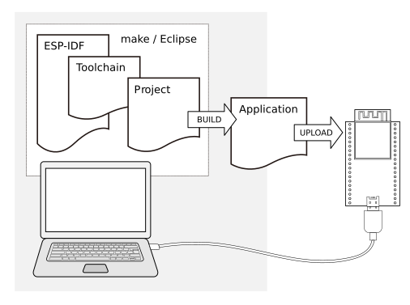
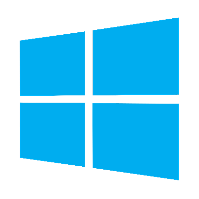
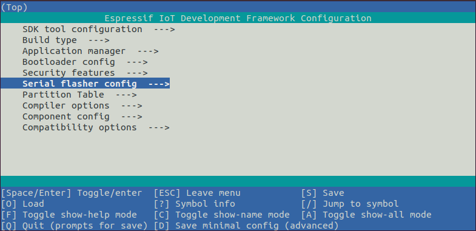

***********
Get Started
***********

To develop applications for ESP32 you need:

* **PC** loaded with either Windows, Linux or Mac operating system
* **Toolchain** to build the **Application** for ESP32
* **ESP-IDF** that essentially contains API for ESP32 and scripts to operate the **Toolchain**
* A text editor to write programs (**Projects**) in C, e.g. `Eclipse <http://www.eclipse.org/>`_
* **ESP32** board itself

    Development of applications for ESP32

Preparation of development environment consists of three steps:

1. Setup of **Toolchain**
2. Getting of **ESP-IDF** from GitHub
3. Installation and configuration of **Eclipse**

You may skip the last step, if you prefer to use different editor.

Having environment set up, you are ready to start the most interesting part - the application development. This process may be summarized in four steps:

1. Configuration of a **Project** and writing the code
2. Compilation of the **Project** and linking it to build an **Application**
3. Flashing (uploading) of the **Application** to **ESP32**
4. Monitoring / debugging of the **Application**

See instructions below that will walk you through these steps.

Guides
======

If you have one of ESP32 development boards listed below, click on provided links to get you up and running.

.. toctree::
    :maxdepth: 1

    ESP32 DevKitC <get-started-devkitc>
    ESP-WROVER-KIT <get-started-wrover-kit>

If you have different board, move to sections below.

.. _get-started-setup-toochain:

Setup Toolchain
===============

Depending on your experience and preferences, you may follow standard installation process or customize your environment. Instructions immediately below are for standard installation. To set up the system your own way go to section :ref:`get-started-customized-setup`.

.. _get-started-standard-setup:

Standard Setup of Toolchain
---------------------------

The quickest way to start development with ESP32 is by installing prebuild toolchain. Pick up your O/S below and follow provided instructions.

.. toctree::
    :hidden:

    Windows <windows-setup>
    Linux <linux-setup> 
    MacOS <macos-setup> 

+-------------------+-------------------+-------------------+
| |windows-logo|    | |linux-logo|      | |macos-logo|      |
+-------------------+-------------------+-------------------+
| `Windows`_        | `Linux`_          | `Mac OS`_         |
+-------------------+-------------------+-------------------+

.. _Windows: ../get-started/windows-setup.html
.. _Linux: ../get-started/linux-setup.html
.. _Mac OS: ../get-started/macos-setup.html

.. note::

    We are using ``~/esp`` directory to install prebuild toolchain, ESP-IDF and sample applications. You can use different directory, but need to adjust respective commands.

Once you are done with setting up the toolchain then go to section :ref:`get-started-get-esp-idf`.

.. highlight:: bash

.. _get-started-customized-setup:

Customized Setup of Toolchain
-----------------------------

Instead of downloading binary toolchain from Espressif website (:ref:`get-started-standard-setup` above) you may build the toolchain yourself.

If you can't think of a reason why you need to build it yourself, then probably it's better to stick with the binary version. However, here are some of the reasons why you might want to compile it from source:

- if you want to customize toolchain build configuration

- if you want to use a different GCC version (such as 4.8.5)

- if you want to hack gcc or newlib or libstdc++

- if you are curious and/or have time to spare

- if you don't trust binaries downloaded from the Internet

In any case, here are the instructions to compile the toolchain yourself.

.. toctree::
    :maxdepth: 1

    windows-setup-scratch
    linux-setup-scratch
    macos-setup-scratch

.. _get-started-get-esp-idf:

Get ESP-IDF
===========

Once you have the toolchain (that contains programs to compile and build the application) installed, you also need ESP32 specific API / libraries. They are provided by Espressif in `ESP-IDF repository <https://github.com/espressif/esp-idf>`_. To get it, open terminal, navigate to the directory you want to put ESP-IDF, and clone it using ``git clone`` command::

    cd ~/esp
    git clone --recursive https://github.com/espressif/esp-idf.git

ESP-IDF will be downloaded into ``~/esp/esp-idf``.

.. note::

    Do not miss the ``--recursive`` option. If you have already cloned ESP-IDF without this option, run another command to get all the submodules::

        cd ~/esp/esp-idf
        git submodule update --init

.. note::

    While cloning submodules on **Windows** platform, the ``git clone`` command may print some output starting ``': not a valid identifier...``. This is a `known issue <https://github.com/espressif/esp-idf/issues/11>`_ but the git clone still succeeds without any problems.

.. _get-started-setup-path:

Setup Path to ESP-IDF
=====================

The toolchain programs access ESP-IDF using ``IDF_PATH`` environment variable. This variable should be set up on your PC, otherwise projects will not build. Setting may be done manually, each time PC is restarted. Another option is to set up it permanently by defining ``IDF_PATH`` in user profile. To do so, follow instructions specific to :ref:`Windows <add-idf_path-to-profile-windows>` , :ref:`Linux and MacOS <add-idf_path-to-profile-linux-macos>` in section :doc:`add-idf_path-to-profile`.

.. _get-started-start-project:

Start a Project
===============

Now you are ready to prepare your application for ESP32. To start off quickly, we will use :example:`get-started/hello_world` project from :idf:`examples` directory in IDF.

Copy :example:`get-started/hello_world` to ``~/esp`` directory::

    cd ~/esp
    cp -r $IDF_PATH/examples/get-started/hello_world .

You can also find a range of example projects under the :idf:`examples` directory in ESP-IDF. These example project directories can be copied in the same way as presented above, to begin your own projects.

.. important::

    The esp-idf build system does not support spaces in paths to esp-idf or to projects.

.. _get-started-connect:

Connect
=======

You are almost there. To be able to proceed further, connect ESP32 board to PC, check under what serial port the board is visible and verify if serial communication works. If you are not sure how to do it, check instructions in section :doc:`establish-serial-connection`. Note the port number, as it will be required in the next step.

.. _get-started-configure:

Configure
=========

Being in terminal window, go to directory of ``hello_world`` application by typing ``cd ~/esp/hello_world``. Then start project configuration utility ``menuconfig``::

    cd ~/esp/hello_world
    make menuconfig

If previous steps have been done correctly, the following menu will be displayed: 

    Project configuration - Home window

In the menu, navigate to ``Serial flasher config`` > ``Default serial port`` to configure the serial port, where project will be loaded to. Confirm selection by pressing enter, save configuration by selecting ``< Save >`` and then exit application by selecting ``< Exit >``.

Here are couple of tips on navigation and use of ``menuconfig``:

* Use up & down arrow keys to navigate the menu.
* Use Enter key to go into a submenu, Escape key to go out or to exit.
* Type ``?`` to see a help screen. Enter key exits the help screen.
* Use Space key, or ``Y`` and ``N`` keys to enable (Yes) and disable (No) configuration items with checkboxes "``[*]``"
* Pressing ``?`` while highlighting a configuration item displays help about that item.
* Type ``/`` to search the configuration items.

.. note::

    If you are **Arch Linux** user, navigate to ``SDK tool configuration`` and change the name of ``Python 2 interpreter`` from ``python`` to ``python2``.

.. _get-started-build-flash:

Build and Flash
===============

Now you can build and flash the application. Run::

    make flash

This will compile the application and all the ESP-IDF components, generate bootloader, partition table, and application binaries, and flash these binaries to your ESP32 board.

.. highlight:: none

::

    esptool.py v2.0-beta2
    Flashing binaries to serial port /dev/ttyUSB0 (app at offset 0x10000)...
    esptool.py v2.0-beta2
    Connecting........___
    Uploading stub...
    Running stub...
    Stub running...
    Changing baud rate to 921600
    Changed.
    Attaching SPI flash...
    Configuring flash size...
    Auto-detected Flash size: 4MB
    Flash params set to 0x0220
    Compressed 11616 bytes to 6695...
    Wrote 11616 bytes (6695 compressed) at 0x00001000 in 0.1 seconds (effective 920.5 kbit/s)...
    Hash of data verified.
    Compressed 408096 bytes to 171625...
    Wrote 408096 bytes (171625 compressed) at 0x00010000 in 3.9 seconds (effective 847.3 kbit/s)...
    Hash of data verified.
    Compressed 3072 bytes to 82...
    Wrote 3072 bytes (82 compressed) at 0x00008000 in 0.0 seconds (effective 8297.4 kbit/s)...
    Hash of data verified.

    Leaving...
    Hard resetting...

If there are no issues, at the end of build process, you should see messages describing progress of loading process. Finally, the end module will be reset and "hello_world" application will start.

If you'd like to use the Eclipse IDE instead of running ``make``, check out the :doc:`Eclipse guide <eclipse-setup>`.

.. _get-started-build-monitor:

Monitor
=======

To see if "hello_world" application is indeed running, type ``make monitor``. This command is launching :doc:`IDF Monitor <idf-monitor>` application::

    $ make monitor
    MONITOR
    --- idf_monitor on /dev/ttyUSB0 115200 ---
    --- Quit: Ctrl+] | Menu: Ctrl+T | Help: Ctrl+T followed by Ctrl+H ---
    ets Jun  8 2016 00:22:57

    rst:0x1 (POWERON_RESET),boot:0x13 (SPI_FAST_FLASH_BOOT)
    ets Jun  8 2016 00:22:57
    ...

Several lines below, after start up and diagnostic log, you should see "Hello world!" printed out by the application. ::

    ...
    Hello world!
    Restarting in 10 seconds...
    I (211) cpu_start: Starting scheduler on APP CPU.
    Restarting in 9 seconds...
    Restarting in 8 seconds...
    Restarting in 7 seconds...

To exit monitor use shortcut ``Ctrl+]``. To execute ``make flash`` and ``make monitor`` in one shoot type ``make flash monitor``. Check section :doc:`IDF Monitor <idf-monitor>` for handy shortcuts and more details on using this application.

Related Documents
=================

.. toctree::
    :maxdepth: 1

    add-idf_path-to-profile
    establish-serial-connection
    make-project
    eclipse-setup
    idf-monitor

