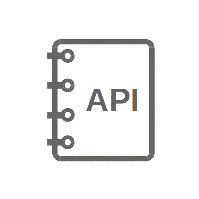
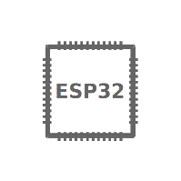

ESP-IDF Programming Guide
=========================

This is the documentation for Espressif IoT Development Framework (`esp-idf <https://github.com/espressif/esp-idf>`_). ESP-IDF is the official development framework for the `ESP32 <https://espressif.com/en/products/hardware/esp32/overview>`_ chip.

+------------------+------------------+------------------+
| |Get Started|_   | |API Reference|_ | |H/W Reference|_ |
+------------------+------------------+------------------+
| `Get Started`_   | `API Reference`_ | `H/W Reference`_ |
+------------------+------------------+------------------+
| |API Guides|_    | |Contribute|_    | |Resources|_     |
+------------------+------------------+------------------+
| `API Guides`_    | `Contribute`_    | `Resources`_     |
+------------------+------------------+------------------+

.. _Get Started: get-started/index.html

.. _API Reference: api-reference/index.html

.. _H/W Reference: hw-reference/index.html

.. _Api Guides: api-guides/index.html

.. _Contribute: contribute/index.html

.. _Resources: resources.html

.. toctree::
   :hidden:

   Get Started <get-started/index>
   快速入门 <get-started/index-cn> 
   API Reference <api-reference/index>
   H/W Reference <hw-reference/index>
   API Guides <api-guides/index>
   Contribute <contribute/index>
   Resources <resources>
   Copyrights <COPYRIGHT>
   About <about>

* :ref:`genindex`
