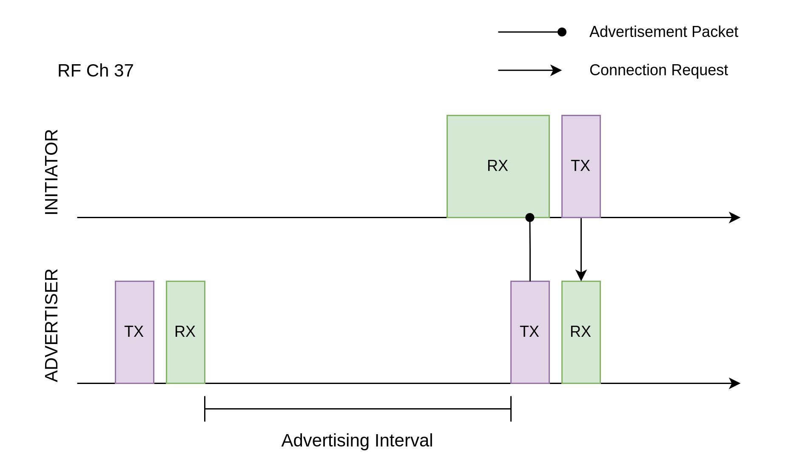
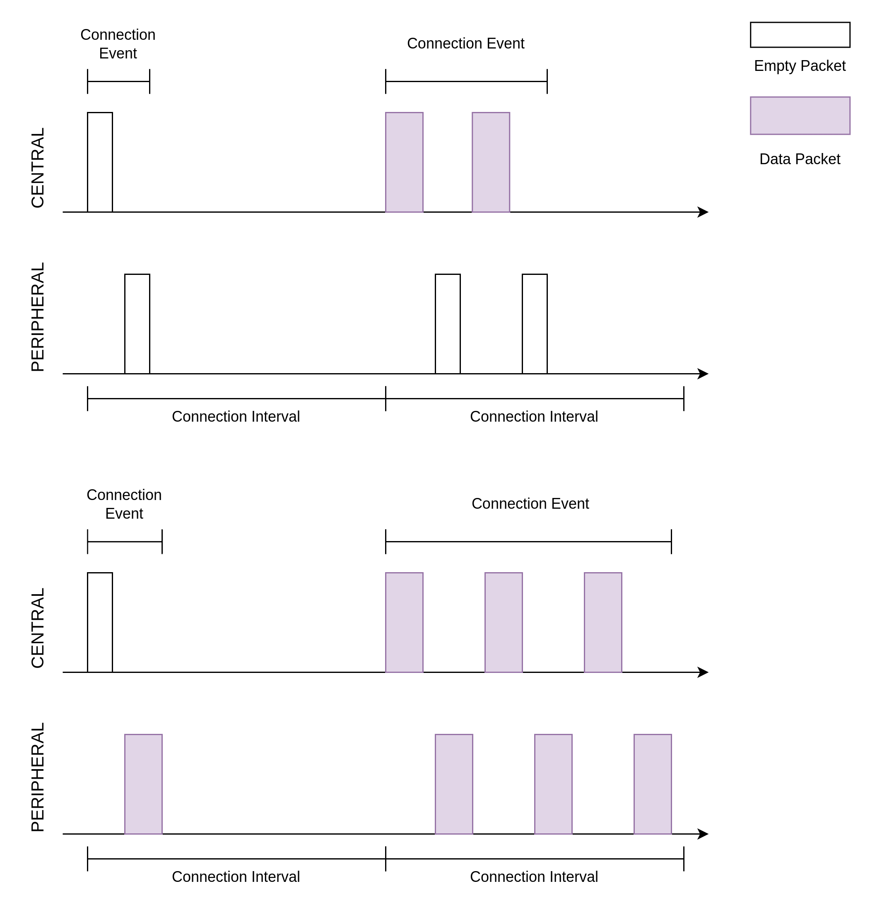
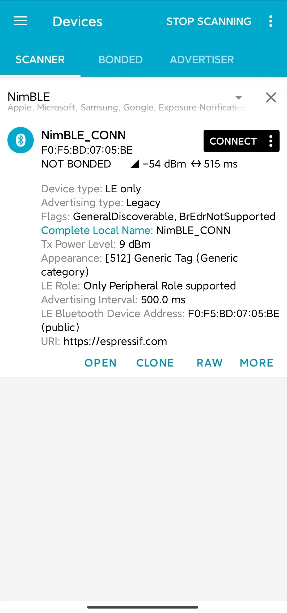

连接
===================

:link_to_translation:`en:[English]`

本文档为低功耗蓝牙 (Bluetooth Low Energy, Bluetooth LE) 入门教程其三，旨在对 Bluetooth LE 的连接过程进行简要介绍。随后，本教程会结合 NimBLE_Connection 例程，基于 NimBLE 主机层协议栈，对外围设备的代码实现进行介绍。

学习目标
----------------------------

- 学习连接的基本概念
- 学习连接相关的参数
- 学习 :example:`NimBLE_Connection <bluetooth/ble_get_started/nimble/NimBLE_Connection>` 例程的代码结构

连接的基本概念
-----------------------------

连接的发起
^^^^^^^^^^^^^^^^^^^^^^^^^^^^^^^^^^^^^^^^^^

*在 Bluetooth LE 5.0 引入扩展广播特性以后， Legacy ADV 和 Extended ADV 对应的连接建立过程略有差异，下以 Legacy ADV 对应的连接建立过程为例。*

当扫描者在某一个广播信道接收到一个广播数据包时，若该广播者是可连接的，那么扫描者可以在同一广播信道发送连接请求 (Connection Request)。对于广播者来说，它可以设置 *接受列表 (Filter Accept List)* 以过滤不受信任的设备，或接受任一扫描者的连接请求。随后，广播者转变为外围设备，扫描者转变为中央设备，两者之间可以在数据信道进行双向通信。

如 :ref:`扫描请求与扫描响应 <scan_request_and_scan_response>` 所述，广播者在每一个信道的广播结束以后，都会短暂进入 RX 模式，以接收可能的扫描请求。实际上，这个 RX 过程中还可以接受连接请求。所以对于扫描者来说，发送连接请求的时间窗口和发送扫描请求的时间窗口是类似的。

    连接的发起

连接间隔与连接事件
^^^^^^^^^^^^^^^^^^^^^^^^^^^^^^^^^^^^^^^^^^

在连接中，中央设备与外围设备会周期性地进行数据交换，这个数据交换的周期被称为连接间隔 (Connection Interval)。连接间隔作为连接参数之一，在连接请求中被首次确定，后续也可以进行修改。连接间隔的取值步长 (Step Size) 为 1.25 ms ，取值范围为 7.5 ms (6 steps) - 4.0 s (3200 steps) 。

一次数据交换的过程被称为连接事件 (Connection Event)。一次连接事件中，存在一次或多次数据包交换（数据量比较大时需要分包发送）；一次数据包交换的过程是，中央设备先给外围设备发送一个数据包，随后外围设备给中央设备发送一个数据包。即便连接中任意一方在连接间隔开始时无需发送数据，也必须发送空数据包以维持连接。

连接间隔与连接事件在连接中的时序关系可以参考下图。

    连接间隔与连接事件

值得一提的是，若一次连接事件中需要发送的数据很多，导致连接事件时长超过了连接间隔，那么必须将一次连接事件拆分成多次连接事件；这意味着，假如连接间隔的剩余时间不足以完成下一次数据包交换，那么下一次数据包交换必须等到下一次连接间隔开始时才能进行。

当需求的数据交换频率比较低时，可以设定较长的连接间隔；在连接间隔中，设备可以在除连接事件以外的时间休眠，以降低能耗。

连接参数
-----------------------------------

前文提到，连接间隔是一种连接参数，其初始值由中央设备在连接请求中给出，也支持在后续的连接中进行修改。除此以外，连接中还存在许多其他的连接参数，下面我们挑选其中的一些重要参数进行讲解。

超时参数
^^^^^^^^^^^^^^^^^^^^^^^^^^^^^^^^^^^^^^^^^^

连接超时参数 (Supervision Timeout) 规定了两次成功连接事件之间的最长时间。若在一次成功的连接事件之后，经过了连接超时时间却仍没有完成另一次成功的连接事件，则可以认为连接已断开。这个参数对于连接状态的维护是非常重要的，例如连接中的其中一方突然意外断电，或离开了通信范围，那么连接中的另一方可以通过判断连接是否超时，决定是否需要断开连接以节省通信资源。

外围设备延迟
^^^^^^^^^^^^^^^^^^^^^^^^^^^^^^^^^^^^^^^^^^

外围设备延迟 (Peripheral Latency) 规定了外围设备在无需发送数据的前提下，最多可忽略的连接事件数量。

为了理解这个连接参数的作用，让我们以蓝牙鼠标为例。用户在使用键盘的过程中，鼠标并没有需要发送的有效数据，此时最好降低数据包发送的频率以节省电量；在使用鼠标的过程中，我们希望鼠标能够尽可能快地发送数据，以降低使用延迟。也就是说，蓝牙鼠标的数据发送是间歇性高频率的。此时，如果仅靠连接间隔参数进行连接调节，则那么较低的连接间隔会导致高能耗，较高的连接间隔会导致高延迟。

在这种场景下，外围设备延迟机制将是一个完美的解决方案。为了降低蓝牙鼠标的延迟，我们可以将连接间隔设为一个较小的值，例如 10 ms ，那么在密集使用时数据交换频率可达 100 Hz ；随后，我们将外围设备延迟设定为 100 ，那么蓝牙鼠标在不使用的状态下，实际的数据交换频率可降低至 1 Hz 。通过这种设计，我们在不调整连接参数的前提下，实现了可变的数据交换频率，在最大程度上提升了用户体验。

最大传输单元
^^^^^^^^^^^^^^^^^^^^^^^^^^^^^^^^^^^^^^^^^^

最大传输单元 (Maximum Transmission Unit, MTU) 指的是单个 ATT 数据包的最大字节数。在介绍 MTU 参数之前，有必要先对数据通道数据包 (Data Channel Packet) 的结构进行说明。

数据通道数据包和 :ref:`广播数据包 <adv_packet_structure>` 的最外层结构一致，区别在于 PDU 的结构。数据 PDU 可以分为三部分，如下

.. list-table::
    :align: center
    :widths: 10 30 20 40
    :header-rows: 1

    *   -   序号
        -   名称
        -   字节数
        -   备注
    *   -   1
        -   头 (Header)
        -   2
        -
    *   -   2
        -   有效负载 (Payload)
        -   0-27 / 0-251
        -   在 Bluetooth LE 4.2 以前，有效负载最大值为 27 字节； Bluetooth LE 4.2 引入了数据长度扩展 (Data Length Extension, DLE) 特性，有效负载的最大值可达 251 字节
    *   -   3
        -   消息完整性检查 (Message Integrity Check, MIC)
        -   4
        -   可选

数据 PDU 的有效负载可以分为两部分，如下

.. list-table::
    :align: center
    :widths: 10 70 20
    :header-rows: 1

    *   -   序号
        -   名称
        -   字节数
    *   -   1
        -   L2CAP 头 (L2CAP Header)
        -   4
    *   -   2
        -   ATT 数据 (ATT Header + ATT Data)
        -   0-23 / 0-247

MTU 的默认值为 23 字节，恰为 Bluetooth LE 4.2 之前单个数据 PDU 的最大可承载 ATT 数据字节数。

MTU 可以设定为更大的值，例如 140 字节。在 Bluetooth LE 4.2 以前，由于有效负载中最多只有 23 字节可以承载 ATT 数据，所以必须将完整的一包 ATT 数据包拆分成若干份，分散到多个数据 PDU 中。在 Bluetooth LE 4.2 以后，单个数据 PDU 最多可以承载 247 字节 ATT 数据，所以 MTU 为 140 字节时仍然可以使用单个数据 PDU 承载。

例程实践
-------------------------------------------

在掌握了连接的相关知识以后，接下来让我们结合 :example:`NimBLE_Connection <bluetooth/ble_get_started/nimble/NimBLE_Connection>` 例程代码，学习如何使用 NimBLE 协议栈构建一个简单的外围设备，对学到的知识进行实践。

前提条件
^^^^^^^^^^^^^^^

1. 一块 {IDF_TARGET_NAME} 开发板
2. ESP-IDF 开发环境
3. 在手机上安装 **nRF Connect for Mobile** 应用程序

若你尚未完成 ESP-IDF 开发环境的配置，请参考 :doc:`IDF 快速入门 <../../../get-started/index>`。

动手试试
^^^^^^^^^^^^^^^^^^

构建与烧录
#################

本教程对应的参考例程为 :example:`NimBLE_Connection <bluetooth/ble_get_started/nimble/NimBLE_Connection>`。

你可以通过以下命令进入例程目录

.. code-block:: shell

    $ cd <ESP-IDF Path>/examples/bluetooth/ble_get_started/nimble/NimBLE_Connection

注意，请将 `<ESP-IDF Path>` 替换为你本地的 ESP-IDF 文件夹路径。随后，你可以通过 VSCode 或其他你常用的 IDE 打开 NimBLE_Connection 工程。以 VSCode 为例，你可以在使用命令行进入例程目录后，通过以下命令打开工程

.. code-block:: shell

    $ code .

随后，在命令行中进入 ESP-IDF 环境，完成芯片设定

.. code-block:: shell

    $ idf.py set-target <chip-name>

你应该能看到以下命令行

.. code-block:: shell

    ...
    -- Configuring done
    -- Generating done
    -- Build files have been written to ...

等提示结束，这说明芯片设定完成。接下来，连接开发板至电脑，随后运行以下命令，构建固件并烧录至开发板，同时监听 {IDF_TARGET_NAME} 开发板的串口输出

.. code-block:: shell

    $ idf.py flash monitor

你应该能看到以下命令行以

.. code-block:: shell

    ...
    main_task: Returned from app_main()

等提示结束。

连接，然后断开
##############################

打开手机上的 **nRF Connect for Mobile** 程序，在 **SCANNER** 标签页中下拉刷新，找到 NimBLE_CONN 设备，如下图所示

    找到 NimBLE_CONN 设备

若设备列表较长，建议以 NimBLE 为关键字进行设备名过滤，快速找到 NimBLE_CONN 设备。

与 :ref:`NimBLE_Beacon <nimble_beacon_details>` 相比，可以观察到大部分广播数据是一致的，但多了一项 `Advertising Interval` 数据，其值为 500 ms ；在 **CONNECT** 按钮下方，确实也可以观察到广播间隔为 510 ms 左右。

点击 **CONNECT** 按钮连接到设备，在手机上应能够看到 GAP 服务，如下

.. figure:: ../../../../_static/ble/ble-connection-connected.jpg
    :align: center
    :scale: 30%

    连接到 NimBLE_CONN 设备

此时应该还能观察到开发板上的 LED 亮起。点击 **DISCONNECT**，断开与设备的连接，此时应能观察到开发板上的 LED 熄灭。

若你的开发板上没有电源指示灯以外的 LED ，你应该能在日志输出中观察到对应的状态指示。

查看日志输出
#################################

将视线转移到日志输出窗口。在连接到设备时，应能观察到如下日志

.. code-block::

    I (36367) NimBLE_Connection: connection established; status=0
    I (36367) NimBLE_Connection: connection handle: 0
    I (36367) NimBLE_Connection: device id address: type=0, value=CE:4E:F7:F9:55:60
    I (36377) NimBLE_Connection: peer id address: type=1, value=7F:BE:AD:66:6F:45
    I (36377) NimBLE_Connection: conn_itvl=36, conn_latency=0, supervision_timeout=500, encrypted=0, authenticated=0, bonded=0

    I (36397) NimBLE: GAP procedure initiated:
    I (36397) NimBLE: connection parameter update; conn_handle=0 itvl_min=36 itvl_max=36 latency=3 supervision_timeout=500 min_ce_len=0 max_ce_len=0
    I (36407) NimBLE:

    I (37007) NimBLE_Connection: connection updated; status=0
    I (37007) NimBLE_Connection: connection handle: 0
    I (37007) NimBLE_Connection: device id address: type=0, value=CE:4E:F7:F9:55:60
    I (37007) NimBLE_Connection: peer id address: type=1, value=7F:BE:AD:66:6F:45
    I (37017) NimBLE_Connection: conn_itvl=36, conn_latency=3, supervision_timeout=500, encrypted=0, authenticated=0, bonded=0

上述日志的第一部分是连接建立时，设备输出的连接信息，包括连接句柄、设备和手机的蓝牙地址以及连接参数信息。其中 `conn_itvl` 指的是连接间隔， `conn_latency` 指的是外围设备延迟， `supervision_timeout` 是连接超时参数，其他参数暂时忽略。

第二部分是设备发起了连接参数的更新，可以观察到设备请求将外围设备延迟参数更新至 3 。

第三部分是连接更新时，设备输出的连接信息。可以观察到，外围设备延迟参数成功更新至 3 ，其他连接参数不变。

当断开与设备的连接时，应能观察到如下日志

.. code-block::

    I (63647) NimBLE_Connection: disconnected from peer; reason=531
    I (63647) NimBLE: GAP procedure initiated: advertise;
    I (63647) NimBLE: disc_mode=2
    I (63647) NimBLE:  adv_channel_map=0 own_addr_type=0 adv_filter_policy=0 adv_itvl_min=800 adv_itvl_max=801
    I (63657) NimBLE:

    I (63657) NimBLE_Connection: advertising started!

可以观察到，设备在连接断开时输出了连接断开原因，随后再次发起广播。

代码详解
-----------------------------------------------------

工程结构综述
^^^^^^^^^^^^^^^^^^^^^^^^^^^^^^^^^^^^^^^^^^^^^^^^^^

.. _nimble_connection_project_structure:

:example:`NimBLE_Connection <bluetooth/ble_get_started/nimble/NimBLE_Connection>` 的根目录结构与 :ref:`NimBLE_Beacon <nimble_beacon_project_structure>` 完全一致，不过在完成了固件的构建以后，你可能会观察到根目录下多了一个 `managed_components` 目录，里面含有固件构建时自动引入的依赖；本例中为 `led_strip` 组件，用于控制开发板的 LED。该依赖项在 `main/idf_component.yml` 文件中被引入。

另外，在 `main` 文件夹中引入了 LED 控制相关的源代码。

程序行为综述
^^^^^^^^^^^^^^^^^^^^^^^^^^^^^^^^^^^^^^^^^^^^^^^^^^

.. _nimble_connection_program_behavior:

本例程的程序行为与 :ref:`NimBLE_Beacon <nimble_beacon_program_behavior>` 的程序行为基本一致，区别在于本例程进入广播状态以后，可以接受来自扫描者的扫描请求并进入连接状态。此外，本例程通过一个回调函数 `gap_event_handler` 接收连接事件，并做出相应的行为，如在连接建立时点亮 LED ，在连接断开时熄灭 LED 等。

入口函数
^^^^^^^^^^^^^^^^^^^^^^^^^^^^^^^^^^^^^^^^^^^^^^^^^^

.. _nimble_connection_entry_point:

本例程的入口函数与 :ref:`NimBLE_Beacon <nimble_beacon_entry_point>` 基本一致，区别在于，在初始化 NVS Flash 前，通过调用 `led_init` 函数，对 LED 进行初始化。

开始广播
^^^^^^^^^^^^^^^^^^^^^^^^^^^^^^^^^^^^^^^^^^^^^^^^^^

广播的发起过程与 :ref:`NimBLE_Beacon <nimble_beacon_start_advertising>` 基本一致，但存在一些细节上的区别。

首先，我们在扫描响应中添加了广播间隔参数。我们希望设置广播间隔为 500 ms ，而广播间隔的单位为 0.625 ms ，所以这里应将广播间隔设置为 `0x320`，不过 NimBLE 提供了一个单位转换的宏 `BLE_GAP_ADV_ITVL_MS`，我们可以借助这个宏避免手动运算，如下

.. code-block:: C

    static void start_advertising(void) {
        ...

        /* Set advertising interval */
        rsp_fields.adv_itvl = BLE_GAP_ADV_ITVL_MS(500);
        rsp_fields.adv_itvl_is_present = 1;

        ...
    }

其次，我们希望设备是可连接的，所以需要将广播模式从不可连接修改为可连接；另外，在扫描响应中设定的广播间隔参数仅仅起到告知扫其他设备的作用，不影响实际的广播间隔，该参数必须设定到广播参数结构中才能真正生效，这里我们将广播间隔的最小值与最大值分别设为 500 ms 和 510 ms ；最后，我们希望用回调函数 `gap_event_handler` 处理 GAP 事件，所以将该回调函数传入对应于开始广播的 API `ble_gap_adv_start` 中。相关代码如下

.. code-block:: C

    static void start_advertising(void) {
        ...

        /* Set non-connetable and general discoverable mode to be a beacon */
        adv_params.conn_mode = BLE_GAP_CONN_MODE_UND;
        adv_params.disc_mode = BLE_GAP_DISC_MODE_GEN;

        /* Set advertising interval */
        adv_params.itvl_min = BLE_GAP_ADV_ITVL_MS(500);
        adv_params.itvl_max = BLE_GAP_ADV_ITVL_MS(510);

        /* Start advertising */
        rc = ble_gap_adv_start(own_addr_type, NULL, BLE_HS_FOREVER, &adv_params,
                            gap_event_handler, NULL);
        if (rc != 0) {
            ESP_LOGE(TAG, "failed to start advertising, error code: %d", rc);
            return;
        }
        ESP_LOGI(TAG, "advertising started!");

        ...
    }

若 `ble_gap_adv_start` 的返回值为 0 ，说明设备成功发起广播。此后， NimBLE 协议栈将会在任意 GAP 事件触发时调用 `gap_event_handler` 回调函数，并传入对应的 GAP 事件。

GAP 事件处理
^^^^^^^^^^^^^^^^^^^^^^^^^^^^^^^^^^^^^^^^^^^^^^^^^^

本例程中，我们对三种不同的 GAP 事件进行处理，分别是

- 连接事件 `BLE_GAP_EVENT_CONNECT`
- 连接断开事件 `BLE_GAP_EVENT_DISCONNECT`
- 连接更新事件 `BLE_GAP_EVENT_CONN_UPDATE`

连接事件在一个连接成功建立或连接建立失败时被触发。当连接建立失败时，我们重新开始发起广播；当连接建立成功时，我们将连接的信息输出到日志，点亮 LED ，并发起一次连接参数更新，旨在将外围设备延迟参数更新至 3 ，代码如下

.. code-block:: C

    static int gap_event_handler(struct ble_gap_event *event, void *arg) {
        /* Local variables */
        int rc = 0;
        struct ble_gap_conn_desc desc;

        /* Handle different GAP event */
        switch (event->type) {

        /* Connect event */
        case BLE_GAP_EVENT_CONNECT:
            /* A new connection was established or a connection attempt failed. */
            ESP_LOGI(TAG, "connection %s; status=%d",
                    event->connect.status == 0 ? "established" : "failed",
                    event->connect.status);

            /* Connection succeeded */
            if (event->connect.status == 0) {
                /* Check connection handle */
                rc = ble_gap_conn_find(event->connect.conn_handle, &desc);
                if (rc != 0) {
                    ESP_LOGE(TAG,
                            "failed to find connection by handle, error code: %d",
                            rc);
                    return rc;
                }

                /* Print connection descriptor and turn on the LED */
                print_conn_desc(&desc);
                led_on();

                /* Try to update connection parameters */
                struct ble_gap_upd_params params = {.itvl_min = desc.conn_itvl,
                                                    .itvl_max = desc.conn_itvl,
                                                    .latency = 3,
                                                    .supervision_timeout =
                                                        desc.supervision_timeout};
                rc = ble_gap_update_params(event->connect.conn_handle, &params);
                if (rc != 0) {
                    ESP_LOGE(
                        TAG,
                        "failed to update connection parameters, error code: %d",
                        rc);
                    return rc;
                }
            }
            /* Connection failed, restart advertising */
            else {
                start_advertising();
            }
            return rc;

        ...
        }

        return rc;
    }

连接断开事件在连接任意一方断开连接时被触发，此时我们将连接断开的原因输出至日志，熄灭 LED 并重新开始广播，代码如下

.. code-block:: C

    static int gap_event_handler(struct ble_gap_event *event, void *arg) {
        ...

        /* Disconnect event */
        case BLE_GAP_EVENT_DISCONNECT:
            /* A connection was terminated, print connection descriptor */
            ESP_LOGI(TAG, "disconnected from peer; reason=%d",
                    event->disconnect.reason);

            /* Turn off the LED */
            led_off();

            /* Restart advertising */
            start_advertising();
            return rc;

        ...
    }

连接更新事件在连接参数更新时被触发，此时我们将更新后的连接信息输出至日志，代码如下

.. code-block:: C

    static int gap_event_handler(struct ble_gap_event *event, void *arg) {
        ...

        /* Connection parameters update event */
        case BLE_GAP_EVENT_CONN_UPDATE:
            /* The central has updated the connection parameters. */
            ESP_LOGI(TAG, "connection updated; status=%d",
                    event->conn_update.status);

            /* Print connection descriptor */
            rc = ble_gap_conn_find(event->conn_update.conn_handle, &desc);
            if (rc != 0) {
                ESP_LOGE(TAG, "failed to find connection by handle, error code: %d",
                        rc);
                return rc;
            }
            print_conn_desc(&desc);
            return rc;

        ...
    }

总结
----------------

通过本教程，你了解了连接的基本概念，并通过 :example:`NimBLE_Connection <bluetooth/ble_get_started/nimble/NimBLE_Connection>` 例程掌握了使用 NimBLE 主机层协议栈构建 Bluetooth LE 外围设备的方法。

你可以尝试对例程中的参数进行修改，并在日志输出中观察修改结果。例如，你可以修改外围设备延迟或连接超时参数，观察连接参数的修改是否能够触发连接更新事件。
