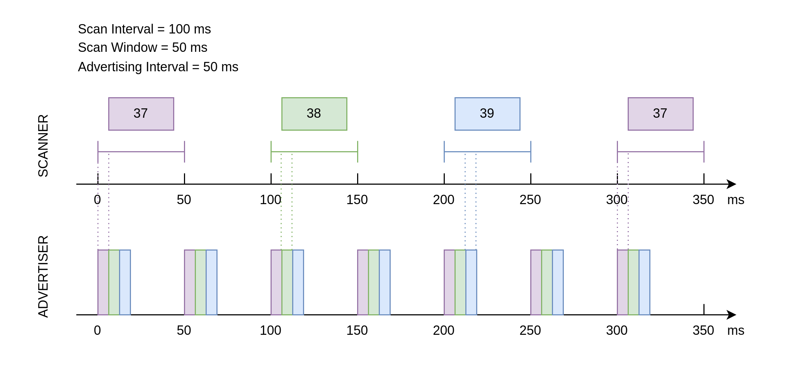
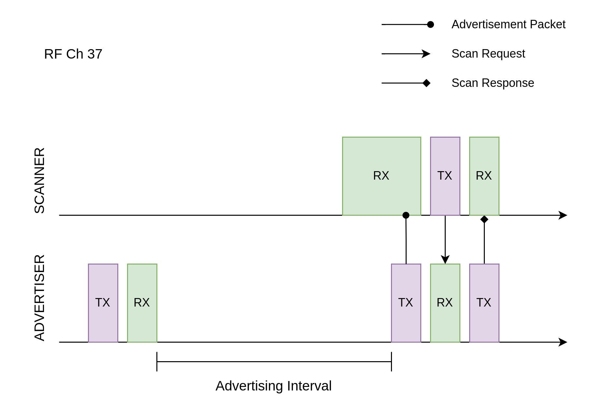
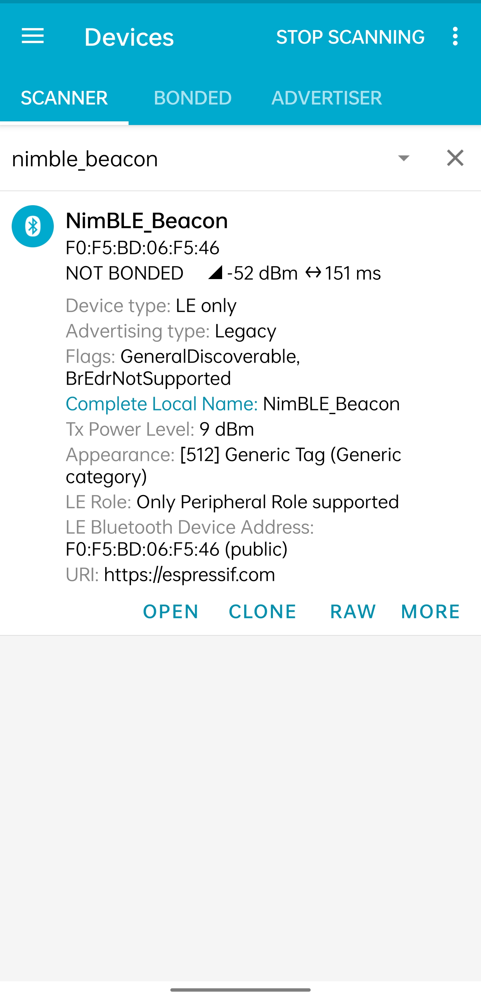

设备发现
==========================

:link_to_translation:`en:[English]`

本文档为低功耗蓝牙 (Bluetooth LE) 入门教程其二，旨在对低功耗蓝牙设备发现过程进行简要介绍，包括广播与扫描相关的基本概念。随后，本教程会结合 :example:`NimBLE_Beacon <bluetooth/ble_get_started/nimble/NimBLE_Beacon>` 例程，基于 NimBLE 主机层协议栈，对低功耗蓝牙广播的代码实现进行介绍。

学习目标
------------------

- 学习广播的基本概念
- 学习扫描的基本概念
- 学习 :example:`NimBLE_Beacon <bluetooth/ble_get_started/nimble/NimBLE_Beacon>` 例程的代码结构

广播 (Advertising) 与扫描 (Scanning) 是低功耗蓝牙设备在进入连接前在设备发现 (Device Discovery) 阶段的工作状态。下面，我们先了解与广播有关的基本概念。

广播的基本概念
----------------------------------

广播是设备通过蓝牙天线，向外发送广播数据包的过程。由于广播者在广播时并不知道环境中是否存在接收方，也不知道接收方会在什么时候启动天线，所以需要周期性地发送广播数据包，直到有设备响应。在上述过程中，对于广播者来说存在以下几个问题，让我们一起来思考一下

1. 向哪里发送广播数据包？ (Where?)
2. 发送广播数据包的周期取多久？ (When?)
3. 广播数据包里包含哪些信息？ (What?)

向哪里发送广播数据包？
^^^^^^^^^^^^^^^^^^^^^^^^^^^^^^^^^^

蓝牙的无线电频段
################################

第一个问题指向的是，广播数据包应发送到哪一无线电频段。这个回答由蓝牙核心规范给出，答案是 2.4 GHz ISM 频段。2.4 GHz ISM 频段是一个全球可用的免费无线电频段，不被任何国家以军事用途等理由管控，也无需向任何组织支付许可费用，因此该频段的可用性极高，且没有任何使用成本。不过，这也意味着 2.4 GHz ISM 频段非常拥挤，可能会与其他无线通信协议发生数据冲突，如 2.4 GHz WiFi。

蓝牙信道
#######################################

与经典蓝牙相同，蓝牙技术联盟为了解决数据冲突的问题，在低功耗蓝牙上也应用了自适应跳频技术 (Adaptive Frequency Hopping, AFH) ，该技术可以判断 RF 信道的拥挤程度，通过跳频避开拥挤的 RF 信道，以提高通信质量。不过低功耗蓝牙与经典蓝牙的不同之处在于，所使用的 2.4 GHz ISM 频段被划分为 40 个 2 MHz 带宽的射频 (Radio Frequency, RF) 信道，中心频率范围为 2402 MHz - 2480 MHz ，而经典蓝牙则是将这一频段划分为 79 个 1MHz 带宽的 RF 信道。

在蓝牙核心规范 4.2 (Bluetooth Core Specification 4.2) 中， RF 信道分为两种类型，如下

.. list-table::
    :align: center
    :widths: 30 20 20 30
    :header-rows: 1

    *   -   类型
        -   数量
        -   编号
        -   作用
    *   -   广播信道 (Advertising Channel)
        -   3
        -   37-39
        -   用于发送广播数据包和扫描响应数据包
    *   -   数据信道 (Data Channel)
        -   37
        -   0-36
        -   用于发送数据通道数据包

广播者在广播时，会在 37-39 这三个广播信道中进行广播数据包的发送。在三个广播信道的广播数据包均发送完毕后，可以认为一次广播结束，广播者会在下一次广播时刻到来时重复上述过程。

扩展广播特性
################################

蓝牙核心规范 4.2 中，广播数据包允许搭载最多 31 字节广播数据，这无疑限制了广播的功能。为了提高广播的可用性，蓝牙 5.0 标准引入了 扩展广播 (Extended Advertising) 特性，这一特性将广播数据包分为

.. list-table::
    :align: center
    :widths: 40 20 20 20
    :header-rows: 1

    *   -   类型
        -   简称
        -   单包最大广播数据字节数
        -   最大广播数据字节数
    *   -   主广播数据包 (Primary Advertising Packet)
        -   Legacy ADV
        -   31
        -   31
    *   -   扩展广播数据包 (Extended Advertising Packet)
        -   Extended ADV
        -   254
        -   1650

扩展广播数据包由 `ADV_EXT_IND` 和 `AUX_ADV_IND` 组成，分别在主广播信道 (Primary Advertising Channel) 和次广播信道 (Secondary Advertising Channel) 上传输。其中，主广播信道对应于信道 37-39 ，次广播信道对应于信道 0-36 。由于接收方总是在主广播信道中接收广播数据，因此发送方在发送扩展广播数据包时，应在主广播信道中发送 `ADV_EXT_IND` ，在次广播信道中发送 `AUX_ADV_IND` ，并在 `ADV_EXT_IND` 中指示 `AUX_ADV_IND` 所在的次广播信道；通过这种机制，接收方能够在接收到主广播信道的 `ADV_EXT_IND` 以后，根据指示到指定的次广播信道去接收 `AUX_ADV_IND` ，从而得到完整的扩展广播数据包。

.. list-table::
    :align: center
    :widths: 30 40 30
    :header-rows: 1

    *   -   类型
        -   信道
        -   作用
    *   -   主广播信道 (Primary Advertising Channel)
        -   37-39
        -   用于传输扩展广播数据包的 `ADV_EXT_IND`
    *   -   次广播信道 (Secondary Advertising Channel)
        -   0-36
        -   用于传输扩展广播数据包的 `AUX_ADV_IND`

发送广播数据包的周期取多久？
^^^^^^^^^^^^^^^^^^^^^^^^^^^^^^^^^^^

广播间隔
##################

对于第二个问题，即发送广播数据包的周期怎么取，蓝牙标准中也给出了一个明确的参数定义，即广播间隔 （Advertising Interval）。广播间隔可取的范围为 20 ms 到 10.24 s ，取值步长为 0.625 ms。

广播间隔的取值决定了广播者的可发现性 （Discoverability） 以及设备功耗。当广播间隔取得太长时，广播数据包被接收方接收到的概率就会变得很低，此时广播者的可发现性就会变差。同时，广播间隔也不宜取得太短，因此频繁发送广播数据需要消耗更多的电量。所以，广播者需要在可发现性和能耗之间进行取舍，根据应用场景的需求选择最合适的广播间隔。

值得一提的是，如果在同一空间中存在两个广播间隔相同的广播者，那么有概率出现重复性的撞包 （Packet Collision） 现象，即两个广播者总是在同一时刻向同一信道发送广播数据。由于广播是一个只发不收的过程，广播者无法得知是否发生了广播撞包。为了降低上述问题的发生概率，广播者应在每一次广播事件后添加 0-10 ms 的随机时延。

广播数据包里包含哪些信息？
^^^^^^^^^^^^^^^^^^^^^^^^^^^^^^^^^^^^^^^^

广播数据包结构
##########################

对于第三个问题，即广播数据包内含有什么信息，在蓝牙核心规范 4.2 中给出了广播数据包的格式定义，如下图所示

.. _adv_packet_structure:

.. figure:: ../../../../_static/ble/ble-4.2-adv-packet-structure.png
    :align: center
    :scale: 35%
    :alt: 广播数据包结构

    蓝牙核心规范 4.2 广播数据包结构

看起来非常复杂，让我们来逐层分解。广播数据包的最外层包含四个部分，分别是

.. list-table::
    :align: center
    :widths: 10 40 10 40
    :header-rows: 1

    *   -   序号
        -   名称
        -   字节数
        -   功能
    *   -   1
        -   预置码 (Preamble)
        -   1
        -   特殊的比特序列，用于设备时钟同步
    *   -   2
        -   访问地址 (Access Address)
        -   4
        -   标记广播数据包的地址
    *   -   3
        -   协议数据单元 (Protocol Data Unit, PDU)
        -   2-39
        -   有效数据的存放区域
    *   -   4
        -   循环冗余校验和 (Cyclic Redundancy Check, CRC)
        -   3
        -   用于循环冗余校验

广播数据包是蓝牙数据包的一种类型，由 PDU 类型决定。下面我们将对 PDU 展开详细的介绍

PDU
##########################

PDU 段为有效数据存放的区域，其结构如下

.. list-table::
    :align: center
    :widths: 10 50 40
    :header-rows: 1

    *   -   序号
        -   名称
        -   字节数
    *   -   1
        -   头 (Header)
        -   2
    *   -   2
        -   有效负载 (Payload)
        -   0-37

PDU 头
##########################

PDU 头中含有较多信息，可以分为以下六个部分

.. list-table::
    :align: center
    :widths: 10 40 10 40
    :header-rows: 1

    *   -   序号
        -   名称
        -   比特位数
        -   备注
    *   -   1
        -   PDU 类型 (PDU Type)
        -   4
        -
    *   -   2
        -   保留位 (Reserved for Future Use, **RFU**)
        -   1
        -
    *   -   3
        -   通道选择位 (Channel Selection Bit, **ChSel**)
        -   1
        -   标记广播者是否支持 *LE Channel Selection Algorithm #2* 通道选择算法
    *   -   4
        -   发送地址类型 (Tx Address, **TxAdd**)
        -   1
        -   0/1 分别表示公共地址/随机地址
    *   -   5
        -   接收地址类型 (Rx Address, **RxAdd**)
        -   1
        -   0/1 分别表示公共地址/随机地址
    *   -   6
        -   有效负载长度 (Payload Length)
        -   8
        -

PDU 类型位反映了设备的广播行为。在蓝牙标准中，共有以下三对广播行为

- *可连接 (Connectable)* 与 *不可连接 (Non-connectable)*
    - 是否接受其他设备的连接请求
- *可扫描 (Scannable)* 与 *不可扫描 (Non-scannable)*
    - 是否接受其他设备的扫描请求
- *不定向 (Undirected)* 与 *定向 (Directed)*
    - 是否发送广播数据至指定设备

上述广播行为可以组合成以下四种常见的广播类型，对应四种不同的 PDU 类型

.. list-table::
    :align: center
    :widths: 10 10 10 30 40
    :header-rows: 1

    *   -   可连接？
        -   可扫描？
        -   不定向？
        -   PDU 类型
        -   作用
    *   -   是
        -   是
        -   是
        -   `ADV_IND`
        -   最常见的广播类型
    *   -   是
        -   否
        -   否
        -   `ADV_DIRECT_IND`
        -   常用于已知设备重连
    *   -   否
        -   否
        -   是
        -   `ADV_NONCONN_IND`
        -   作为信标设备，仅向外发送广播数据
    *   -   否
        -   是
        -   是
        -   `ADV_SCAN_IND`
        -   作为信标设备，一般用于广播数据包长度不足的情况，此时可以通过扫描响应向外发送额外的数据

PDU 有效负载
##########################

PDU 有效负载也分为两部分

.. list-table::
    :align: center
    :widths: 10 50 10 30
    :header-rows: 1

    *   -   序号
        -   名称
        -   字节数
        -   备注
    *   -   1
        -   广播地址 (Advertisement Address, **AdvA**)
        -   6
        -   广播设备的 48 位蓝牙地址
    *   -   2
        -   广播数据 (Advertisement Data, **AdvData**)
        -   0-31
        -   由若干广播数据结构 (Advertisement Data Structure) 组成

先看广播地址，即蓝牙地址，可以分为

.. list-table::
    :align: center
    :widths: 40 60
    :header-rows: 1

    *   -   类型
        -   说明
    *   -   公共地址 (Public Address)
        -   全球范围内独一无二的固定设备地址，厂商必须为此到 IEEE 组织注册并缴纳一定费用
    *   -   随机地址 (Random Address)
        -   随机生成的地址

随机地址又根据用途分为两类

.. list-table::
    :align: center
    :widths: 40 60
    :header-rows: 1

    *   -   类型
        -   说明
    *   -   随机静态地址 (Random Static Address)
        -   可以随固件固化于设备，也可以在设备启动时随机生成，但在设备运行过程中不得变更；常作为公共地址的平替
    *   -   随机私有地址 (Random Private Address)
        -   可在设备运行过程中周期性变更，避免被其他设备追踪

若使用随机私有地址的设备要与其他受信任的设备通信，则应使用身份解析秘钥 (Identity Resolving Key, IRK) 生成随机地址，此时其他持有相同 IRK 的设备可以解析并得到设备的真实地址。此时，随机私有地址又可以分为两类

.. list-table::
    :align: center
    :widths: 40 60
    :header-rows: 1

    *   -   类型
        -   说明
    *   -   可解析随机私有地址 (Resolvable Random Private Address)
        -   可通过 IRK 解析得到设备真实地址
    *   -   不可解析随机私有地址 (Non-resolvable Random Private Address)
        -   完全随机的地址，仅用于防止设备被追踪，非常少用

然后看广播数据。一个广播数据结构的格式定义如下

.. list-table::
    :align: center
    :widths: 10 40 20 30
    :header-rows: 1

    *   -   序号
        -   名称
        -   字节数
        -   备注
    *   -   1
        -   数据长度 (AD Length)
        -   1
        -
    *   -   2
        -   数据类型 (AD Type)
        -   n
        -   大部分数据类型占用 1 字节
    *   -   3
        -   数据 (AD Data)
        -   (AD Length - n)
        -

广播流程
^^^^^^^^^

使用公共地址进行广播
########################

使用公共地址进行广播时，需要将 ``esp_ble_adv_params_t`` 成员 ``own_addr_type`` 设置为 ``BLE_ADDR_TYPE_PUBLIC``。广播流程图如下 （*点击图片放大*）：

.. seqdiag::
    :caption: 广播流程图——使用公共地址
    :align: center
    :scale: 200%

    seqdiag adv-public-addr {
        activation = none;
        edge_length = 160;
        span_height = 20;
        default_shape = roundedbox;
        default_fontsize = 12;

        "Input\n[Advertiser]";
        "API\n[Advertiser]";
        "LLM\n[Advertiser]";
        "LLM\n[Scanner]";
        "API\n[Scanner]";
        "Output\n[Scanner]";

        "Input\n[Advertiser]" -> "API\n[Advertiser]" [label="calls\n esp_ble_gap_set_device_name"];
        "Input\n[Advertiser]" -> "API\n[Advertiser]" [label="calls\n esp_ble_gap_config_adv_data"];
        "API\n[Advertiser]" -> "LLM\n[Advertiser]" [label="sends config adv data HCI command to LL layer"];
        "API\n[Advertiser]" <- "LLM\n[Advertiser]" [label="returns set adv data event"];
        "Input\n[Advertiser]" <- "API\n[Advertiser]" [label="returns\n esp_gap_ble_adv_data_set_complete_evt"];
        "Input\n[Advertiser]" -> "API\n[Advertiser]" [label="calls\n esp_ble_gap_start_advertising to start advertising; sets the own_addr_type parameter to ble_addr_type_public"];
        "API\n[Advertiser]" -> "LLM\n[Advertiser]" [label="sends start adv HCI command to LL layer"];
        "API\n[Advertiser]" <- "LLM\n[Advertiser]" [label="returns start adv event"];
        "LLM\n[Advertiser]" -> "LLM\n[Scanner]" [label="advertising event"];
        "LLM\n[Advertiser]" -> "LLM\n[Scanner]" [label="advertising event"];
        "Input\n[Advertiser]" <- "API\n[Advertiser]" [label="returns\n esp_gap_ble_adv_start_complete_evt"];
        "LLM\n[Scanner]" -> "API\n[Scanner]";
        "API\n[Scanner]" -> "Output\n[Scanner]" [label="esp_gap_ble_scan_result_evt"];
    }

使用可解析随机私有地址进行广播
##################################

使用可解析随机私有地址进行广播时，底层协议栈在可解析随机私有地址超时时更新广播地址，默认超时设置为 15 分钟。可解析随机私有地址的超时时间可以通过 menuconfig 中的 ``BT_BLE_RPA_TIMEOUT`` 选项进行配置。需要将 ``esp_ble_adv_params_t`` 成员 ``own_addr_type`` 设置为 ``BLE_ADDR_TYPE_RPA_PUBLIC`` 或 ``BLE_ADDR_TYPE_RPA_RANDOM``。广播流程图如下 （*点击图片放大*）：

.. seqdiag::
    :caption: 广播流程图——使用可解析随机私有地址
    :align: center
    :scale: 200%

    seqdiag adv-resolvable-addr {
        activation = none;
        edge_length = 160;
        span_height = 20;
        default_shape = roundedbox;
        default_fontsize = 12;

        "Input\n[Advertiser]";
        "API\n[Advertiser]";
        "LLM\n[Advertiser]";
        "LLM\n[Scanner]";
        "API\n[Scanner]";
        "Output\n[Scanner]";

        "Input\n[Advertiser]" -> "API\n[Advertiser]" [label="calls\n esp_ble_gap_set_device_name"];
        "Input\n[Advertiser]" -> "API\n[Advertiser]" [label="calls\n esp_ble_gap_config_local_privacy"];
        "Input\n[Advertiser]" -> "API\n[Advertiser]" [label="calls\n esp_ble_gap_config_adv_data"];
        "API\n[Advertiser]" -> "LLM\n[Advertiser]" [label="sends config adv data HCI command to LL layer"];
        "API\n[Advertiser]" <- "LLM\n[Advertiser]" [label="returns set adv data event"];
        "Input\n[Advertiser]" <- "API\n[Advertiser]" [label="returns\n esp_gap_ble_adv_data_set_complete_evt"];
        "Input\n[Advertiser]" -> "API\n[Advertiser]" [label="calls\n esp_ble_gap_start_advertising to start advertising; sets the own_addr_type parameter to ble_addr_type_rpa_public or ble_addr_type_rpa_random"];
        "API\n[Advertiser]" -> "LLM\n[Advertiser]" [label="sends start adv HCI command to LL layer"];
        "API\n[Advertiser]" <- "LLM\n[Advertiser]" [label="returns start adv event"];
        "LLM\n[Advertiser]" -> "LLM\n[Scanner]" [label="advertising event"];
        "LLM\n[Advertiser]" -> "LLM\n[Scanner]" [label="advertising event"];
        "Input\n[Advertiser]" <- "API\n[Advertiser]" [label="returns\n esp_gap_ble_adv_start_complete_evt"];
        "LLM\n[Scanner]" -> "API\n[Scanner]";
        "API\n[Scanner]" -> "Output\n[Scanner]" [label="esp_gap_ble_scan_result_evt"];
    }

.. note::

   当使用可解析随机私有地址进行广播时，需要等待 ``esp_ble_gap_config_local_privacy`` 事件返回后，才能开始广播，并且需要将广播参数里的 ``own_addr_type`` 类型设置为 ``BLE_ADDR_TYPE_RPA_PUBLIC`` 或 ``BLE_ADDR_TYPE_RPA_RANDOM``。

   要使用 ``BLE_ADDR_TYPE_RPA_RANDOM`` 地址类型，必须首先通过 API ``esp_ble_gap_set_rand_addr`` 设置一个随机静态地址。如果使用 ``BLE_ADDR_TYPE_RPA_PUBLIC``，则无需设置地址。

   ``BLE_ADDR_TYPE_RPA_PUBLIC`` 的操作如下：控制器基于解析列表中的本地身份解析密钥 (IRK) 生成可解析随机私有地址 (RPA)。如果解析列表缺乏匹配条目，则使用公共地址。

   对于 ``BLE_ADDR_TYPE_RPA_RANDOM``，如果解析列表中没有匹配的条目，则使用随机静态地址。

使用随机静态地址进行广播
#########################

与使用可解析随机私有地址进行广播一样，使用随机静态地址进行广播也需要将 ``esp_ble_adv_params_t`` 成员 ``own_addr_type`` 设置为 ``BLE_ADDR_TYPE_RANDOM``。广播流程图如下 （*点击图片放大*）：

.. seqdiag::
    :caption: 广播流程图——使用随机静态地址
    :align: center
    :scale: 200%

    seqdiag adv-random-addr {
        activation = none;
        edge_length = 160;
        span_height = 20;
        default_shape = roundedbox;
        default_fontsize = 12;

        "Input\n[Advertiser]";
        "API\n[Advertiser]";
        "LLM\n[Advertiser]";
        "LLM\n[Scanner]";
        "API\n[Scanner]";
        "Output\n[Scanner]";

        "Input\n[Advertiser]" -> "API\n[Advertiser]" [label="calls\n esp_ble_gap_set_device_name"];
        "Input\n[Advertiser]" -> "API\n[Advertiser]" [label="calls\n esp_ble_gap_set_rand_addr"];
        "API\n[Advertiser]" -> "LLM\n[Advertiser]" [label="sends set rand address HCI command to LL layer"];
        "API\n[Advertiser]" <- "LLM\n[Advertiser]" [label="returns set rand address event"];
        "Input\n[Advertiser]" <- "API\n[Advertiser]" [label="returns\n esp_gap_ble_set_static_rand_addr_evt"];
        "API\n[Advertiser]" -> "LLM\n[Advertiser]" [label="sends config adv data HCI command to LL layer"];
        "Input\n[Advertiser]" -> "API\n[Advertiser]" [label="calls\n esp_ble_gap_config_adv_data"];
        "API\n[Advertiser]" <- "LLM\n[Advertiser]" [label="return set adv data event"];
        "Input\n[Advertiser]" <- "API\n[Advertiser]" [label="calls\n esp_gap_ble_adv_data_set_complete_evt"];
        "Input\n[Advertiser]" -> "API\n[Advertiser]" [label="calls\n esp_ble_gap_start_advertising to start advertising; sets the own_addr_type parameter to ble_addr_type_random"];
        "API\n[Advertiser]" -> "LLM\n[Advertiser]" [label="sends start adv HCI command to LL layer"];
        "LLM\n[Advertiser]" -> "LLM\n[Scanner]" [label="advertising event"];
        "LLM\n[Advertiser]" -> "LLM\n[Scanner]" [label="advertising event"];
        "API\n[Advertiser]" <- "LLM\n[Advertiser]" [label="returns start adv event"];
        "Input\n[Advertiser]" <- "API\n[Advertiser]" [label="returns\n esp_gap_ble_adv_start_complete_evt"];
        "LLM\n[Scanner]" -> "API\n[Scanner]";
        "API\n[Scanner]" -> "Output\n[Scanner]" [label="esp_gap_ble_scan_result_evt"];
    }

扫描的基本概念
^^^^^^^^^^^^^^^^^^^^^^^^^^

在广播章节，我们通过回答与广播过程相关的三个问题，了解了广播的相关基本概念。事实上，扫描过程中也存在类似的三个问题，让我们一起思考一下

1. 到什么地方去扫描？ (Where?)
2. 多久扫描一次？一次扫描多久？ (When?)
3. 扫描的过程中需要做什么？ (What?)

第一个问题已经在广播的介绍中说明了。对于蓝牙 4.2 设备来说，广播者只会在广播信道，即编号为 37-39 的三个信道发送广播数据；对于蓝牙 5.0 设备来说，如果广播者启用了扩展广播特性，则会在主广播信道发送 `ADV_EXT_IND` ，在次广播信道发送 `AUX_ADV_IND` ，并在 `ADV_EXT_IND` 指示 `AUX_ADV_IND` 所在的次广播信道。所以相应地，对于蓝牙 4.2 设备来说，扫描者只需在广播信道接收广播数据包即可。对于蓝牙 5.0 设备来说，扫描者应在主广播信道接收主广播数据包和扩展广播数据包的 `ADV_EXT_IND` ； 若扫描者接收到了 `ADV_EXT_IND` ，且 `ADV_EXT_IND` 指示了一个次广播信道，那么还需要到对应的次广播信道去接收 `AUX_ADV_IND` ，以获取完整的扩展广播数据包。

扫描窗口与扫描间隔
################################

第二个问题分别指向扫描窗口 (Scan Window) 和 扫描间隔 (Scan Interval) 概念。

- **扫描窗口**：扫描者在同一个 RF 信道持续接收蓝牙数据包的持续时间，例如扫描窗口参数设定为 50 ms 时，扫描者在每个 RF 信道都会不间断地扫描 50 ms。

- **扫描间隔**：相邻两个扫描窗口开始时刻之间的时间间隔，所以扫描间隔必然大于等于扫描窗口。

下图在时间轴上展示了扫描者的广播数据包接收过程，其中扫描者的扫描间隔为 100 ms ，扫描窗口为 50 ms ；广播者的广播间隔为 50 ms ，广播数据包的发送时长仅起到示意作用。可以看到，第一个扫描窗口对应 37 信道，此时扫描者恰好接收到了广播者第一次在 37 信道发送的广播数据包，以此类推。

    广播与扫描时序示意图

.. _scan_request_and_scan_response:

扫描请求与扫描响应
########################################

从目前的介绍来看，似乎广播过程中广播者只发不收，扫描过程中扫描者只收不发。事实上，扫描行为分为以下两种

- 被动扫描 (Passive Scanning)
    - 扫描者只接收广播数据包
- 主动扫描 (Active Scanning)
    - 扫描者在接收广播数据包以后，还向可扫描广播者发送扫描请求 (Scan Request)

可扫描广播者在接收到扫描请求之后，会广播扫描响应 (Scan Response) 数据包，以向感兴趣的扫描者发送更多的广播信息。扫描响应数据包的结构与广播数据包完全一致，区别在于 PDU 头中的 PDU 类型不同。

在广播者处于可扫描广播模式、扫描者处于主动扫描模式的场景下，广播者和扫描者的数据发送时序变得更加复杂。对于扫描者来说，在扫描窗口结束后会短暂进入 TX 模式，向外发送扫描请求，随后马上进入 RX 模式以接收可能的扫描响应；对于广播者来说，每一次广播结束后都会短暂进入 RX 模式以接收可能的扫描请求，并在接收到扫描请求后进入 TX 模式，发送扫描响应。

    扫描请求的接收与扫描响应的发送

例程实践
-------------------------------------------

在掌握了广播与扫描的相关知识以后，接下来让我们结合 :example:`NimBLE_Beacon <bluetooth/ble_get_started/nimble/NimBLE_Beacon>` 例程代码，学习如何使用 NimBLE 协议栈构建一个简单的 Beacon 设备，对学到的知识进行实践。

前提条件
^^^^^^^^^^^^^^^

1. 一块 {IDF_TARGET_NAME} 开发板
2. ESP-IDF 开发环境
3. 在手机上安装 **nRF Connect for Mobile** 应用程序

若你尚未完成 ESP-IDF 开发环境的配置，请参考 :doc:`IDF 快速入门 <../../../get-started/index>`。

动手试试
^^^^^^^^^^^^^^^^^^

构建与烧录
#################

本教程对应的参考例程为 :example:`NimBLE_Beacon <bluetooth/ble_get_started/nimble/NimBLE_Beacon>`。

你可以通过以下命令进入例程目录

.. code-block:: shell

    $ cd <ESP-IDF Path>/examples/bluetooth/ble_get_started/nimble/NimBLE_Beacon

注意，请将 `<ESP-IDF Path>` 替换为你本地的 ESP-IDF 文件夹路径。随后，你可以通过 VSCode 或其他你常用的 IDE 打开 NimBLE_Beacon 工程。以 VSCode 为例，你可以在使用命令行进入例程目录后，通过以下命令打开工程

.. code-block:: shell

    $ code .

随后，在命令行中进入 ESP-IDF 环境，完成芯片设定

.. code-block:: shell

    $ idf.py set-target <chip-name>

你应该能看到以下命令行

.. code-block:: shell

    ...
    -- Configuring done
    -- Generating done
    -- Build files have been written to ...

等提示结束，这说明芯片设定完成。接下来，连接开发板至电脑，随后运行以下命令，构建固件并烧录至开发板，同时监听 {IDF_TARGET_NAME} 开发板的串口输出

.. code-block:: shell

    $ idf.py flash monitor

你应该能看到以下命令行

.. code-block:: shell

    ...
    main_task: Returned from app_main()

等提示结束。

查看 Beacon 设备信息
#######################################

.. _nimble_beacon_details:

打开手机上的 **nRF Connect for Mobile** 程序，在 SCANNER 标签页中下拉刷新，找到 NimBLE_Beacon 设备，如下图所示

    找到 NimBLE Beacon 设备

若设备列表较长，建议以 NimBLE 为关键字进行设备名过滤，快速找到 NimBLE_Beacon 设备。

观察到 NimBLE Beacon 设备下带有丰富的设备信息，甚至还带有乐鑫的网址（这就是信标广告功能的体现）。点击右下角的 **RAW** 按钮，可以看到广播数据包的原始信息，如下

.. figure:: ../../../../_static/ble/ble-adv-packet-raw-data.jpg
    :align: center
    :scale: 30%
    :alt: ADV Packet Raw Data

    广播数据包原始信息

**Details** 表格即广播数据包和扫描响应数据包中的所有广播数据结构，可以整理如下

.. list-table::
    :align: center
    :widths: 30 10 10 30 20
    :header-rows: 1

    *   -   名称
        -   长度
        -   类型
        -   原始数据
        -   解析值
    *   -   标志位
        -   2 Bytes
        -   `0x01`
        -   `0x06`
        -   General Discoverable, BR/EDR Not Supported
    *   -   完整设备名称
        -   14 Bytes
        -   `0x09`
        -   `0x4E696D424C455F426561636F6E`
        -   NimBLE_Beacon
    *   -   发送功率等级
        -   2 Bytes
        -   `0x0A`
        -   `0x09`
        -   9 dBm
    *   -   设备外观
        -   3 Bytes
        -   `0x19`
        -   `0x0002`
        -   通用标签
    *   -   LE 角色
        -   2 Bytes
        -   `0x1C`
        -   `0x00`
        -   仅支持外设设备
    *   -   设备地址
        -   8 Bytes
        -   `0x1B`
        -   `0x46F506BDF5F000`
        -   `F0:F5:BD:06:F5:46`
    *   -   URI
        -   17 Bytes
        -   `0x24`
        -   `0x172F2F6573707265737369662E636F6D`
        -   `https://espressif.com`

值得一提的是，前五项广播数据结构长度之和为 28 字节，此时广播数据包仅空余 3 字节，无法继续装载后续的两项广播数据结构。所以后两项广播数据结构必须装填至扫描响应数据包。

你可能还注意到，对应于设备外观的 Raw Data 为 `0x0002`，而代码中对 Generic Tag 的定义是 `0x0200`；还有，设备地址的 Raw Data 除了最后一个字节 `0x00` 以外，似乎与实际地址完全颠倒。这是因为，低功耗蓝牙的空中数据包遵循小端 (Little Endian) 传输的顺序，所以低字节的数据反而会在靠前的位置。

另外，注意到 **nRF Connect for Mobile** 程序并没有为我们提供 **CONNECT** 按钮以连接至此设备。这符合我们的预期，因为 Beacon 设备本来就应该是不可连接的。下面，让我们深入代码细节，看看这样的一个 Beacon 设备是怎样实现的。

代码详解
----------------------------------------------

工程结构综述
^^^^^^^^^^^^^^^^^^^^^^^^^^^^^^^^^^^^^^^^^^^^^^^^^^

.. _nimble_beacon_project_structure:

:example:`NimBLE_Beacon <bluetooth/ble_get_started/nimble/NimBLE_Beacon>` 的根目录大致分为以下几部分

- `README*.md`
    - 工程的说明文档
- `sdkconfig.defaults*`
    - 不同芯片对应开发板的默认配置
- `CMakeLists.txt`
    - 用于引入 ESP-IDF 构建环境
- `main`
    - 工程主文件夹，含本工程的源码、头文件以及构建配置

程序行为综述
^^^^^^^^^^^^^^^^^^^^^^^^^^^^^^^^^^^^^^^^^^^^^^^^^^

.. _nimble_beacon_program_behavior:

在深入代码细节前，我们先对程序的行为有一个宏观的认识。

第一步，我们会对程序中使用到的各个模块进行初始化，主要包括 NVS Flash、NimBLE 主机层协议栈以及 GAP 服务的初始化。

第二步，在 NimBLE 主机层协议栈与蓝牙控制器完成同步时，我们先确认蓝牙地址可用，然后发起不定向、不可连接、可扫描的广播。

之后持续处于广播状态，直到设备重启。

入口函数
^^^^^^^^^^^^^^^^^^^^^^^^^^^^^^^^^^^^^^^^^^^^^^^^^^

.. _nimble_beacon_entry_point:

与其他工程一样，应用程序的入口函数为 `main/main.c` 文件中的 `app_main` 函数，我们一般在这个函数中进行各模块的初始化。本例中，我们主要做以下几件事情

1. 初始化 NVS Flash 与 NimBLE 主机层协议栈
2. 初始化 GAP 服务
3. 启动 NimBLE 主机层的 FreeRTOS 线程

{IDF_TARGET_NAME} 的蓝牙协议栈使用 NVS Flash 存储相关配置，所以在初始化蓝牙协议栈之前，必须调用 `nvs_flash_init` API 以初始化 NVS Flash ，某些情况下需要调用 `nvs_flash_erase` API 对 NVS Flash 进行擦除后再初始化。

.. code-block:: C

    void app_main(void) {
        ...

        /* NVS flash initialization */
        ret = nvs_flash_init();
        if (ret == ESP_ERR_NVS_NO_FREE_PAGES ||
            ret == ESP_ERR_NVS_NEW_VERSION_FOUND) {
            ESP_ERROR_CHECK(nvs_flash_erase());
            ret = nvs_flash_init();
        }
        if (ret != ESP_OK) {
            ESP_LOGE(TAG, "failed to initialize nvs flash, error code: %d ", ret);
            return;
        }

        ...
    }

随后，可以调用 `nimble_port_init` API 以初始化 NimBLE 主机层协议栈。

.. code-block:: C

    void app_main(void) {
        ...

        /* NimBLE host stack initialization */
        ret = nimble_port_init();
        if (ret != ESP_OK) {
            ESP_LOGE(TAG, "failed to initialize nimble stack, error code: %d ",
                    ret);
            return;
        }

        ...
    }

然后，我们调用 `gap.c` 文件中定义的 `gap_init` 函数，初始化 GAP 服务，并设定设备名称与外观。

.. code-block:: C

    void app_main(void) {
        ...

        /* GAP service initialization */
        rc = gap_init();
        if (rc != 0) {
            ESP_LOGE(TAG, "failed to initialize GAP service, error code: %d", rc);
            return;
        }

        ...
    }

接下来，设定 NimBLE 主机层协议栈的配置，这里主要涉及到一些回调函数的设定，包括协议栈重置时刻的回调、完成同步时刻的回调等，然后保存配置。

.. code-block:: C

    static void nimble_host_config_init(void) {
        /* Set host callbacks */
        ble_hs_cfg.reset_cb = on_stack_reset;
        ble_hs_cfg.sync_cb = on_stack_sync;
        ble_hs_cfg.store_status_cb = ble_store_util_status_rr;

        /* Store host configuration */
        ble_store_config_init();
    }

    void app_main(void) {
        ...

        /* NimBLE host configuration initialization */
        nimble_host_config_init();

        ...
    }

最后，启动 NimBLE 主机层的 FreeRTOS 线程。

.. code-block:: C

    static void nimble_host_task(void *param) {
        /* Task entry log */
        ESP_LOGI(TAG, "nimble host task has been started!");

        /* This function won't return until nimble_port_stop() is executed */
        nimble_port_run();

        /* Clean up at exit */
        vTaskDelete(NULL);
    }

    void app_main(void) {
        ...

        /* Start NimBLE host task thread and return */
        xTaskCreate(nimble_host_task, "NimBLE Host", 4*1024, NULL, 5, NULL);

        ...
    }

开始广播
^^^^^^^^^^^^^^^^^^^^^^^^^^^^^^^^^^^^^^^^^^^^^^^^^^

.. _nimble_beacon_start_advertising:

使用 NimBLE 主机层协议栈进行应用开发时的编程模型为事件驱动编程 (Event-driven Programming)。

例如，在 NimBLE 主机层协议栈与蓝牙控制器完成同步以后，将会触发同步完成事件，调用 `ble_hs_cfg.sync_cb` 函数。在回调函数设定时，我们令该函数指针指向 `on_stack_sync` 函数，所以这是同步完成时实际被调用的函数。

在 `on_stack_sync` 函数中，我们调用 `adv_init` 函数，进行广播操作的初始化。在 `adv_init` 中，我们先调用 `ble_hs_util_ensure_addr` API ，确认设备存在可用的蓝牙地址；随后，调用 `ble_hs_id_infer_auto` API ，获取最优的蓝牙地址类型。

.. code-block:: C

    static void on_stack_sync(void) {
        /* On stack sync, do advertising initialization */
        adv_init();
    }

    void adv_init(void) {
        ...

        /* Make sure we have proper BT identity address set */
        rc = ble_hs_util_ensure_addr(0);
        if (rc != 0) {
            ESP_LOGE(TAG, "device does not have any available bt address!");
            return;
        }

        /* Figure out BT address to use while advertising */
        rc = ble_hs_id_infer_auto(0, &own_addr_type);
        if (rc != 0) {
            ESP_LOGE(TAG, "failed to infer address type, error code: %d", rc);
            return;
        }

        ...
    }

接下来，将蓝牙地址数据从 NimBLE 协议栈的内存空间拷贝到本地的 `addr_val` 数组中，等待后续调用。

.. code-block:: C

    void adv_init(void) {
        ...

        /* Copy device address to addr_val */
        rc = ble_hs_id_copy_addr(own_addr_type, addr_val, NULL);
        if (rc != 0) {
            ESP_LOGE(TAG, "failed to copy device address, error code: %d", rc);
            return;
        }
        format_addr(addr_str, addr_val);
        ESP_LOGI(TAG, "device address: %s", addr_str);

        ...
    }

最后，调用 `start_advertising` 函数发起广播。在 `start_advertising` 函数中，我们先将广播标志位、完整设备名、发射功率、设备外观和 LE 角色等广播数据结构填充到广播数据包中，如下

.. code-block:: C

    static void start_advertising(void) {
        /* Local variables */
        int rc = 0;
        const char *name;
        struct ble_hs_adv_fields adv_fields = {0};

        ...

        /* Set advertising flags */
        adv_fields.flags = BLE_HS_ADV_F_DISC_GEN | BLE_HS_ADV_F_BREDR_UNSUP;

        /* Set device name */
        name = ble_svc_gap_device_name();
        adv_fields.name = (uint8_t *)name;
        adv_fields.name_len = strlen(name);
        adv_fields.name_is_complete = 1;

        /* Set device tx power */
        adv_fields.tx_pwr_lvl = BLE_HS_ADV_TX_PWR_LVL_AUTO;
        adv_fields.tx_pwr_lvl_is_present = 1;

        /* Set device appearance */
        adv_fields.appearance = BLE_GAP_APPEARANCE_GENERIC_TAG;
        adv_fields.appearance_is_present = 1;

        /* Set device LE role */
        adv_fields.le_role = BLE_GAP_LE_ROLE_PERIPHERAL;
        adv_fields.le_role_is_present = 1;

        /* Set advertiement fields */
        rc = ble_gap_adv_set_fields(&adv_fields);
        if (rc != 0) {
            ESP_LOGE(TAG, "failed to set advertising data, error code: %d", rc);
            return;
        }

        ...
    }

`ble_hs_adv_fields` 结构体预定义了一些常用的广播数据类型。我们可以在完成数据设置后，通过令对应的 `is_present` 字段为 1 ，或将对应的长度字段 `len` 设定为非零值，以启用对应的广播数据结构。例如在上述代码中，我们通过 `adv_fields.tx_pwr_lvl = BLE_HS_ADV_TX_PWR_LVL_AUTO;` 来配置设备发送功率，然后通过 `adv_fields.tx_pwr_lvl_is_present = 1;` 以启用该广播数据结构；若仅配置设备发送功率而不对相应的 `is_present` 字段置位，则该广播数据结构无效。同理，我们通过 `adv_fields.name = (uint8_t *)name;` 配置设备名，然后通过 `adv_fields.name_len = strlen(name);` 配置设备名的长度，从而将设备名这一广播数据结构添加到广播数据包中；若仅配置设备名而不配置设备名的长度，则该广播数据结构无效。

最后，调用 `ble_gap_adv_set_fields` API ，完成广播数据包的广播数据结构设定。

同理，我们可以将设备地址与 URI 填充到扫描响应数据包中，如下

.. code-block:: C

    static void start_advertising(void) {
        ...

        struct ble_hs_adv_fields rsp_fields = {0};

        ...

        /* Set device address */
        rsp_fields.device_addr = addr_val;
        rsp_fields.device_addr_type = own_addr_type;
        rsp_fields.device_addr_is_present = 1;

        /* Set URI */
        rsp_fields.uri = esp_uri;
        rsp_fields.uri_len = sizeof(esp_uri);

        /* Set scan response fields */
        rc = ble_gap_adv_rsp_set_fields(&rsp_fields);
        if (rc != 0) {
            ESP_LOGE(TAG, "failed to set scan response data, error code: %d", rc);
            return;
        }

        ...
    }

最后，设置广播参数，并通过调用 `ble_gap_adv_start` API 发起广播。

.. code-block:: C

    static void start_advertising(void) {
        ...

        struct ble_gap_adv_params adv_params = {0};

        ...

        /* Set non-connetable and general discoverable mode to be a beacon */
        adv_params.conn_mode = BLE_GAP_CONN_MODE_NON;
        adv_params.disc_mode = BLE_GAP_DISC_MODE_GEN;

        /* Start advertising */
        rc = ble_gap_adv_start(own_addr_type, NULL, BLE_HS_FOREVER, &adv_params,
                            NULL, NULL);
        if (rc != 0) {
            ESP_LOGE(TAG, "failed to start advertising, error code: %d", rc);
            return;
        }
        ESP_LOGI(TAG, "advertising started!");
    }

总结
---------

通过本教程，你了解了广播和扫描的基本概念，并通过 :example:`NimBLE_Beacon <bluetooth/ble_get_started/nimble/NimBLE_Beacon>` 例程掌握了使用 NimBLE 主机层协议栈构建低功耗蓝牙 Beacon 设备的方法。

你可以尝试对例程中的数据进行修改，并在 nRF Connect for Mobile 调试工具中查看修改结果。例如，你可以尝试修改 `adv_fields` 或 `rsp_fields` 结构体，以修改被填充的广播数据结构，或者交换广播数据包和扫描响应数据包中的广播数据结构。但需要注意的一点是，广播数据包和扫描响应数据包的广播数据上限为 31 字节，若设定的广播数据结构大小超过该限值，调用 `ble_gap_adv_start` API 将会失败。
