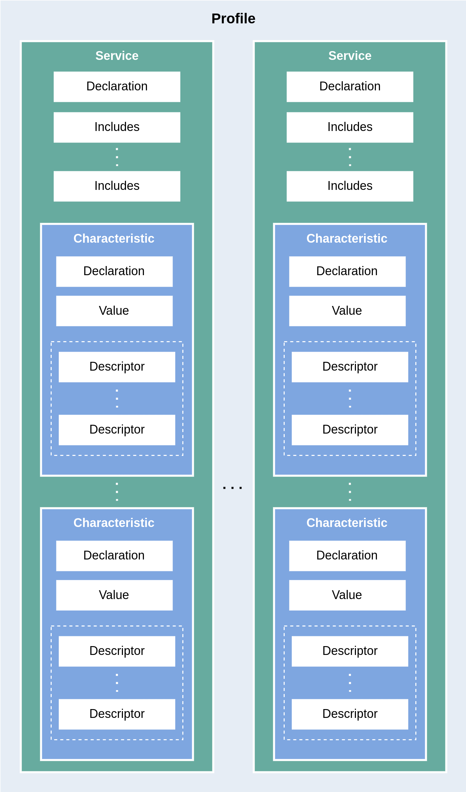
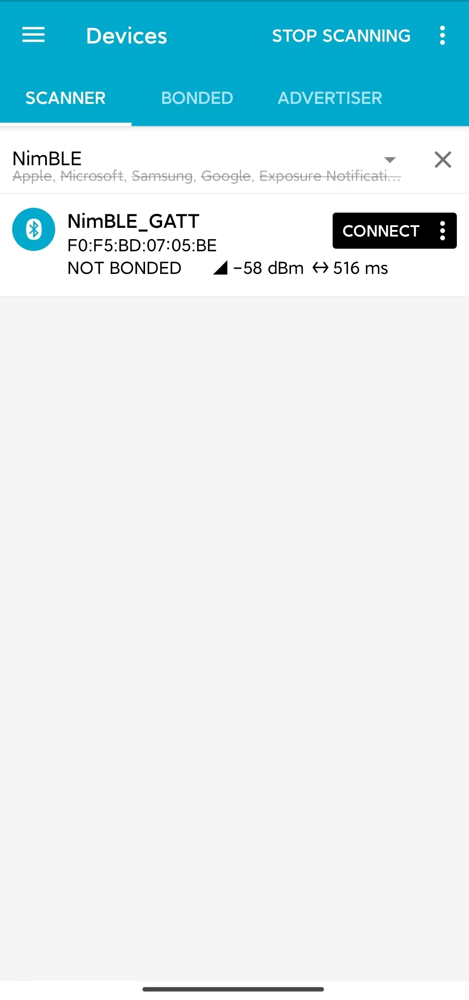
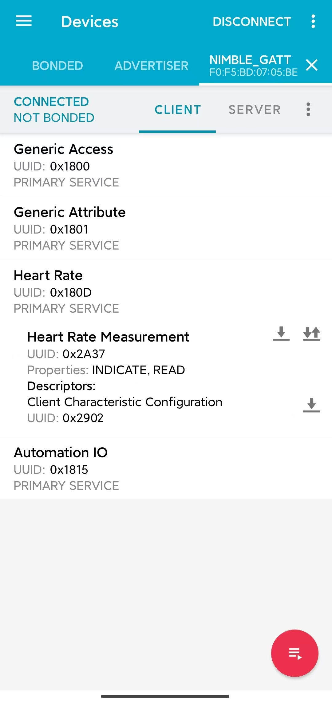

介绍
===================

:link_to_translation:`en:[English]`

本文档为低功耗蓝牙 (Bluetooth LE) 入门系列教程其一，旨在对低功耗蓝牙的基本概念进行简要介绍，并引导读者烧录一个完整的低功耗蓝牙例程至 {IDF_TARGET_NAME} 开发板；随后，指导读者在手机上使用 nRF Connect for Mobile 应用程序，控制开发板上 LED 的开关并读取开发板上随机生成的心率数据。本教程希望帮助读者了解如何使用 ESP-IDF 开发框架对 {IDF_TARGET_NAME} 开发板进行低功耗蓝牙应用烧录，并通过体验例程功能，对低功耗蓝牙的功能建立感性认知。

学习目标
---------------

- 认识低功耗蓝牙的分层架构
- 了解低功耗蓝牙各层基本功能
- 了解 GAP 以及 GATT/ATT 层的功能
- 掌握在 {IDF_TARGET_NAME} 开发板上烧录低功耗蓝牙例程的方法，并在手机上与之交互

引言
-----------------

大多数人在生活中都接触过蓝牙，可能屏幕前的你现在正佩戴着蓝牙耳机，收听来自手机或电脑的音频。不过，音频传输是经典蓝牙 (Bluetooth Classic) 的典型应用场景，而低功耗蓝牙是一种与经典蓝牙不兼容的蓝牙通信协议，在蓝牙 4.0 中被引入。顾名思义，低功耗蓝牙是一种功耗非常低的蓝牙协议，通信速率也比经典蓝牙更低一些，其典型应用场景是物联网 (Internet of Things, IoT) 中的数据通信，例如智能开关或智能传感器，这也是本教程中引用的低功耗蓝牙例程所实现的功能。不过，在体验例程功能以前，让我们来了解一下低功耗蓝牙的基本概念，以帮助你更好地入门。

低功耗蓝牙的分层架构
-------------------------

低功耗蓝牙协议定义了三层软件结构，自上而下分别是

- 应用层 (Application Layer)
- 主机层 (Host Layer)
- 控制器层 (Controller Layer)

应用层即以低功耗蓝牙为底层通信技术所构建的应用，依赖于主机层向上提供的 API 接口。

主机层负责实现 L2CAP、GATT/ATT、SMP、GAP 等底层蓝牙协议，向上对应用层提供 API 接口，向下通过主机控制器接口 (Host Controller Interface, HCI) 与控制器层通信。

控制器层包括物理层 (Physical Layer, PHY) 和链路层 (Link Layer, LL) 两层，向下直接与控制器硬件进行交互，向上通过 HCI 与主机层进行通信。

值得一提的是，蓝牙核心规范 (Core Specification) 允许主机层和控制器层在物理上分离，此时 HCI 体现为物理接口，包括 SDIO、USB 以及 UART 等；当然，主机层和控制器层可以共存于同一芯片，以实现更高的集成度，此时 HCI 体现为逻辑接口，常被称为虚拟主机控制器接口 (Virtual Host Controller Interface, VHCI)。一般认为，主机层和控制器层组成了低功耗蓝牙协议栈 (Bluetooth LE Stack)。

下图展示了低功耗蓝牙的分层结构。

.. figure:: ../../../../_static/ble/ble-architecture.png
    :align: center
    :scale: 50%
    :alt: 低功耗蓝牙分层结构

    低功耗蓝牙分层结构

作为应用开发者，在开发过程中我们主要与主机层提供的 API 接口打交道，这要求我们对主机层中的蓝牙协议有一定的了解。接下来，我们会从连接和数据交换两个角度，对 GAP 和 GATT/ATT 层的基本概念进行介绍。

GAP 层 - 定义设备的连接
^^^^^^^^^^^^^^^^^^^^^^^

GAP 层的全称为通用访问规范 (Generic Access Profile, GAP)，定义了低功耗蓝牙设备之间的连接行为以及设备在连接中所扮演的角色。

GAP 状态与角色
###################

GAP 中共定义了三种设备的连接状态以及五种不同的设备角色，如下

- 空闲 (Idle)
    - 此时设备无角色，处于就绪状态 (Standby)
- 设备发现 (Device Discovery)
    - 广播者 (Advertiser)
    - 扫描者 (Scanner)
    - 连接发起者 (Initiator)
- 连接 (Connection)
    - 外围设备 (Peripheral)
    - 中央设备 (Central)

广播者向外广播的数据中包含设备地址等信息，用于向外界设备表明广播者的存在，并告知其他设备是否可以连接。扫描者则持续接收环境中的广播数据包。若某一个扫描者发现了一个可连接的广播者，并希望与之建立连接，可以将角色切换为连接发起者。当连接发起者再次收到该广播者的广播数据，会立即发起连接请求 (Connection Request)；在广播者未开启白名单 (Filter Accept List, 又称 White List) 或连接发起者在广播者的白名单之中时，连接将被成功建立。

进入连接以后，原广播者转变为外围设备（旧称从设备 Slave ），原扫描者或连接初始化者转变为中央设备（旧称主设备 Master ）。

GAP 角色之间的转换关系如下图所示

.. figure:: ../../../../_static/ble/ble-gap-state-diagram.png
    :align: center
    :scale: 50%
    :alt: GAP 角色转换关系

    GAP 角色转换关系

低功耗蓝牙网络拓扑
########################

低功耗蓝牙设备可以同时与多个低功耗蓝牙设备建立连接，扮演多个外围设备或中央设备角色，或同时作为外围设备和中央设备。以低功耗蓝牙网关为例，这种设备可以作为中央设备，与智能开关等外围设备连接，同时作为外围设备，与形如手机等中央设备连接，实现数据中转。

在一个低功耗蓝牙网络中，若所有设备都在至少一个连接中，且仅扮演一种类型的角色，则称这种网络为连接拓扑 (Connected Topology)；若存在至少一个设备同时扮演外围设备和中央设备，则称这种网络为多角色拓扑 (Multi-role Topology)。

低功耗蓝牙同时也支持无连接的网络拓扑，即广播拓扑 (Broadcast Topology)。在这种网络中，存在两种角色，其中发送数据的被称为广播者 (Broadcaster)，接收数据的被称为观察者 (Observer)。广播者只广播数据，不接受连接；观察者仅接受广播数据，不发起连接。例如，某个智能传感器的数据可能在一个网络中被多个设备共用，此时维护多个连接的成本相对较高，直接向网络中的所有设备广播传感器数据更加合适。

了解更多
####################

如果你想了解更多设备发现与连接的相关信息，请参考 :doc:`设备发现 <./ble-device-discovery>` 与 :doc:`连接 <./ble-connection>` 。

GATT/ATT 层 - 数据表示与交换
^^^^^^^^^^^^^^^^^^^^^^^^^^^^^^^^^^

.. _gatt_att_introduction:

GATT/ATT 层定义了进入连接状态后，设备之间的数据交换方式，包括数据的表示与交换过程。

ATT 层
#############

ATT 的全称是属性协议 (Attribute Protocol, ATT)，定义了一种称为 **属性 (Attribute)** 的基本数据结构，以及基于服务器/客户端架构的数据访问方式。

简单来说，数据以属性的形式存储在服务器上，等待客户端的访问。以智能开关为例，开关量作为数据，以属性的形式存储在智能开关内的蓝牙芯片（服务器）中，此时用户可以通过手机（客户端）访问智能开关蓝牙芯片（服务器）上存放的开关量属性，获取当前的开关状态（读访问），或控制开关的闭合与断开（写访问）。

属性这一数据结构一般由以下三部分构成

- 句柄 (Handle)
- 类型 (Type)
- 值 (Value)
- 访问权限 (Permissions)

在协议栈实现中，属性一般被放在称为 **属性表 (Attribute Table)** 的结构体数组中管理。一个属性在这张表中的索引，就是属性的句柄，常为一无符号整型。

属性的类型由 UUID 表示，可以分为 16 位、32 位与 128 位 UUID 三类。 16 位 UUID 由蓝牙技术联盟 (Bluetooth Special Interest Group, Bluetooth SIG) 统一定义，可以在其公开发布的 `Assigned Numbers <https://www.bluetooth.com/specifications/assigned-numbers/>`__ 文件中查询；其他两种长度的 UUID 用于表示厂商自定义的属性类型，其中 128 位 UUID 较为常用。

GATT 层
#################

GATT 的全称是通用属性规范 (Generic Attribute Profile)，在 ATT 的基础上，定义了以下三个概念

- 特征数据 (Characteristic)
- 服务 (Service)
- 规范 (Profile)

这三个概念之间的层次关系如下图所示

    GATT 中的层次关系

.. _characteristic_structure:

特征数据和服务都是以属性为基本数据结构的复合数据结构。一个特征数据往往由两个以上的属性描述，包括

- 特征数据声明属性 (Characteristic Declaration Attribute)
- 特征数据值属性 (Characteristic Value Attribute)

除此以外，特征数据中还可能包含若干可选的描述符属性 (Characteristic Descriptor Attribute)。

一个服务本身也由一个属性进行描述，称为服务声明属性 (Service Declaration Attribute)。一个服务中可以存在一个或多个特征数据，它们之间体现为从属关系。另外，一个服务可以通过 `Include` 机制引用另一个服务，复用其特性定义，避免如设备名称、制造商信息等相同特性的重复定义。

规范是一个预定义的服务集合，实现了某规范中所定义的所有服务的设备即满足该规范。例如 Heart Rate Profile 规范由 Heart Rate Service 和 Device Information Service 两个服务组成，那么可以称实现了 Heart Rate Service 和 Device Information Service 服务的设备符合 Heart Rate Profile 规范。

广义上，我们可以称所有存储并管理特征数据的设备为 GATT 服务器，称所有访问 GATT 服务器以访问特征数据的设备为 GATT 客户端。

了解更多
#########################

如果你想了解更多数据表示与交换的信息，请参考 :doc:`数据交换 <./ble-data-exchange>` 。

例程实践
----------------------

在了解了低功耗蓝牙的基础概念以后，让我们往 {IDF_TARGET_NAME} 开发板中烧录一个简单的低功耗蓝牙例程，体验 LED 开关与心率数据读取功能，建立对低功耗蓝牙技术的感性认识。

前提条件
^^^^^^^^^^^^^^^

1. 一块 {IDF_TARGET_NAME} 开发板
2. ESP-IDF 开发环境
3. 在手机上安装 **nRF Connect for Mobile** 应用程序

若你尚未完成 ESP-IDF 开发环境的配置，请参考 :doc:`IDF 快速入门 <../../../get-started/index>`。

动手试试
^^^^^^^^^^^^^^^^^^

.. _nimble_gatt_server_practice:

构建与烧录
#################

本教程对应的参考例程为 :example:`NimBLE_GATT_Server <bluetooth/ble_get_started/nimble/NimBLE_GATT_Server>`。

你可以通过以下命令进入例程目录

.. code-block:: shell

    $ cd <ESP-IDF Path>/examples/bluetooth/ble_get_started/nimble/NimBLE_GATT_Server

注意，请将 `<ESP-IDF Path>` 替换为你本地的 ESP-IDF 文件夹路径。随后，你可以通过 VSCode 或其他你常用的 IDE 打开 NimBLE_GATT_Server 工程。以 VSCode 为例，你可以在使用命令行进入例程目录后，通过以下命令打开工程

.. code-block:: shell

    $ code .

随后，在命令行中进入 ESP-IDF 环境，完成芯片设定

.. code-block:: shell

    $ idf.py set-target <chip-name>

你应该能看到以下命令行

.. code-block:: shell

    ...
    -- Configuring done
    -- Generating done
    -- Build files have been written to ...

等提示结束，这说明芯片设定完成。接下来，连接开发板至电脑，随后运行以下命令，构建固件并烧录至开发板，同时监听 {IDF_TARGET_NAME} 开发板的串口输出

.. code-block:: shell

    $ idf.py flash monitor

你应该能看到以下命令行

.. code-block:: shell

    ...
    main_task: Returned from app_main()
    NimBLE_GATT_Server: Heart rate updated to 70

等提示结束。并且，心率数据以 1 Hz 左右的频率在 60-80 范围内更新。

连接到开发板
#######################

现在开发板已准备就绪。接下来，打开手机上的 **nRF Connect for Mobile** 程序，在 **SCANNER** 标签页中下拉刷新，找到 NimBLE_GATT 设备，如下图所示

    扫描设备

若设备列表较长，建议以 NimBLE 为关键字进行设备名过滤，快速找到 NimBLE_GATT 设备。

点击 **NimBLE_GATT** 设备条目，可以展开看到广播数据的详细信息。

.. figure:: ../../../../_static/ble/ble-get-started-connect-details.jpg
    :align: center
    :scale: 20%
    :alt: 广播数据详情

    广播数据详情

点击右侧的 **CONNECT** 按钮，在手机连接的同时，可以在开发板的串口输出中观察到许多与连接相关的日志信息。随后，手机上会显示 NimBLE_GATT 标签页，左上角应有 **CONNECTED** 状态，说明手机已成功通过低功耗蓝牙协议连接至开发板。在 CLIENT 子页中，你应该能够看到四个 GATT 服务，如图所示

.. figure:: ../../../../_static/ble/ble-get-started-gatt-services-list.jpg
    :align: center
    :scale: 20%
    :alt: GATT 服务列表

    GATT 服务列表

前两个服务是 GAP 服务和 GATT 服务，这两个服务是低功耗蓝牙应用中的基础服务。后两个服务是 Bluetooth SIG 定义的 Heart Rate Service 服务和 Automation IO Service 服务，分别提供心率数据读取和 LED 控制功能。

在服务名的下方，对应有各个服务的 UUID 以及服务主次标识。如 Heart Rate Service 服务的 UUID 为 `0x180D`，是一个主服务 (Primary Service)。需要注意的是，服务的名称是通过 UUID 解析得到的。以 nRF Connect for Mobile 为例，在实现 GATT 客户端时，开发者会将 Bluetooth SIG 定义的服务，以及例程自定义的服务预先写入数据库中，然后根据 GATT 服务的 UUID 进行服务信息解析。所以，假如某一服务的 UUID 不在数据库中，那么该服务的服务信息就无法被解析，服务名称将会显示为未知服务 (Unknown Service)。

把灯点亮！
##################

下面体验一下本例程的功能。首先，点击 **Automation IO Service** 服务，可以看到该服务下有一个 LED 特征数据。

.. figure:: ../../../../_static/ble/ble-get-started-automation-io-service-details.jpg
    :align: center
    :scale: 20%
    :alt: Automation IO Service

    Automation IO Service

如图，该 LED 特征数据的 UUID 为 128 位的厂商自定义 UUID 。 点击右侧的**UPLOAD**按钮，可以对该特征数据进行写访问，如下图所示。

.. figure:: ../../../../_static/ble/ble-get-started-led-write.jpg
    :align: center
    :scale: 20%
    :alt: 对 LED 特征数据进行写访问

    对 LED 特征数据进行写访问

选择 **ON** 选项，然后发送，你应该能看到开发板上的 LED 被点亮了。选择 **OFF** 选项，然后发送，你应该能观察到开发板上的 LED 又熄灭了。

若你的开发板上没有电源指示灯以外的 LED ，你应该能在日志输出中观察到对应的状态指示。

接收心率数据
#######################

接下来，点击 **Heart Rate Service** 服务，可以看到该服务下有一个 Heart Rate Measurement 特征数据。

    Heart Rate Service

Heart Rate Measurement 特征数据的 UUID 是 `0x2A37`，这是一个 Bluetooth SIG 定义的特征数据。点击右侧的下载按钮，对心率特征数据进行读访问，应该能够看到特征数据栏中的 `Value` 条目后出现了最新的心率测量数据，如图

.. figure:: ../../../../_static/ble/ble-get-started-heart-rate-read.jpg
    :align: center
    :scale: 20%
    :alt: 对心率特征数据进行读访问

    对心率特征数据进行读访问

在应用中，心率数据最好能够在测量值更新时，马上同步到 GATT 客户端。为此，我们可以点击最右侧的订阅按钮，要求心率特征数据进行指示操作，此时应该能够看到心率测量数据不断更新，如图

.. figure:: ../../../../_static/ble/ble-get-started-heart-rate-indicate.jpg
    :align: center
    :scale: 20%
    :alt: 订阅心率特征数据

    订阅心率特征数据

你可能注意到了，心率特征数据下有一个名为 *Client Characteristic Configuration* 的描述符 (Characteristic Descriptor)，常简称为 CCCD ，其 UUID 为 `0x2902`。在点击订阅按钮时，这个描述符的值发生了变化，提示特征数据的指示已启用 (Indications enabled)。的确，这个描述符就是用来指示特征数据的指示或通知状态的；当我们取消订阅时，这个描述符的值将变为，特征数据的指示和通知已禁用 (Notifications and indications disabled)。

总结
---------

通过本教程，你了解了低功耗蓝牙的分层架构、低功耗蓝牙协议栈中主机层和控制器层的基本功能以及 GAP 层与 GATT/ATT 层的作用。随后，通过 :example:`NimBLE_GATT_Server <bluetooth/ble_get_started/nimble/NimBLE_GATT_Server>` 例程，你掌握了如何使用 ESP-IDF 开发框架进行低功耗蓝牙应用的构建与烧录，能够在手机上使用 **nRF Connect for Mobile** 调试程序，远程控制开发板上 LED 的点亮与熄灭，以及接收随机生成的心率数据。你已经迈出了走向低功耗蓝牙开发者的第一步，恭喜！
