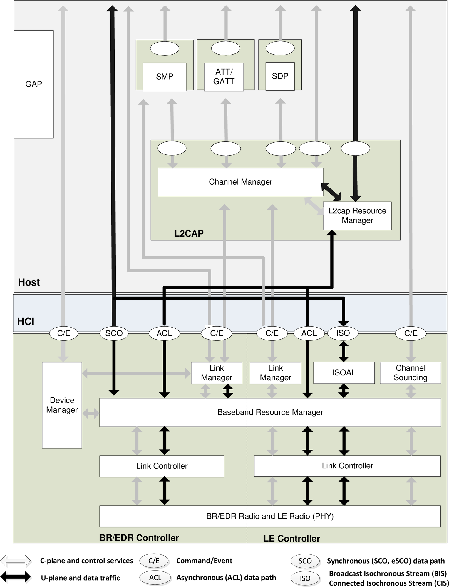

概述
======

:link_to_translation:`en:[English]`

蓝牙\ :sup:`®` 无线技术是一种短距离通信标准，具备高可靠性、低功耗和低成本等特点。主要分为两种类型：

- **经典蓝牙:** 优化用于连续的高吞吐量数据流，适用于音频传输等应用。
- **低功耗蓝牙 (Bluetooth LE):** 针对低功耗间歇性数据传输设计，适合用于传感器和可穿戴设备等。

.. only:: esp32

    {IDF_TARGET_NAME} 支持双模蓝牙，即同时支持经典蓝牙和低功耗蓝牙。

芯片蓝牙能力总览
------------------

下表总结了 ESP-IDF 中支持蓝牙的 ESP 芯片及其蓝牙类型支持情况（Y = 支持，N = 不支持）。

.. list-table::
    :header-rows: 1

    * - 芯片
      - 经典蓝牙 (BR/EDR)
      - 低功耗蓝牙 (LE)
    * - ESP32
      - Y
      - Y
    * - ESP32-S3
      - N
      - Y
    * - ESP32-C2
      - N
      - Y
    * - ESP32-C3
      - N
      - Y
    * - ESP32-C5
      - N
      - Y
    * - ESP32-C6
      - N
      - Y
    * - ESP32-C61
      - N
      - Y
    * - ESP32-H2
      - N
      - Y

蓝牙协议栈
-----------

蓝牙协议栈是一种分层通信架构，定义了蓝牙设备如何发现彼此、建立连接、交换数据，并确保通信安全可靠。如图 :ref:`bluetooth-core-system-architecture` 所示，协议栈主要分为控制器（Controller）和主机（Host）两大部分，两者通过 HCI 接口进行通信。

.. _bluetooth-core-system-architecture:

    蓝牙核心系统架构（来源：蓝牙核心规范）

**控制器**

控制器负责硬件层面的操作和底层链路控制，包含：

- **PHY (物理层):** 处理 2.4 GHz ISM 频段的蓝牙信号收发。

- **基带 (Baseband):** 管理底层时序和控制功能，包括跳频、数据包格式化和纠错。

- **链路控制器 (Link Controller):** 处理设备连接/断开的链路状态机、流控和重传机制。

- **链路管理器 (Link Manager):** 管理链路设置、身份验证、加密和功率控制。

- **设备管理器 (Device Manager):** 管理设备状态，处理寻呼/查询流程，存储安全密钥。

**主机**

主机实现应用交互所需的高层协议，包含：

- **L2CAP (逻辑链路控制与适配协议):** 处理数据分段、重组和复用。

- **SMP (安全管理协议):** 管理身份验证、加密和安全配对。

- **GAP (通用访问规范):** 管理设备发现、连接建立，并定义蓝牙设备的角色和模式。

- **ATT/GATT (属性协议/通用属性规范):** 通过服务和特征实现基于属性的数据交换，主要用于低功耗蓝牙。

- **SDP (服务发现协议):** 允许设备广播和发现可用服务，主要用于经典蓝牙。

.. only:: esp32

   蓝牙主机和控制器可以集成在同一设备上，也可以在不同设备上实现。{IDF_TARGET_NAME} 可以支持上述两种方式，下图 :ref:`bt-host-controller-structure` 展示了典型的应用结构：

   .. _bt-host-controller-structure:

   .. figure:: ../../../_static/bt-host-controller-structure.png
       :align: center
       :width: 70%
       :alt: {IDF_TARGET_NAME} 蓝牙主机与控制器的关系结构图

       {IDF_TARGET_NAME} 蓝牙主机与控制器的关系结构图

   - **场景 1（ESP-IDF 默认设置）**

     使用 Bluedroid 作为蓝牙主机，通过 VHCI（软件实现的虚拟 HCI）实现主机与控制器之间的通信。Bluedroid 和控制器运行在同一设备上（即 {IDF_TARGET_NAME} 芯片），无需外部主机设备。

   - **场景 2（仅控制器模式）**

     {IDF_TARGET_NAME} 仅作为蓝牙控制器。外部主机设备（如运行 BlueZ 的 Linux PC 或运行 Bluedroid 的 Android 设备）负责蓝牙操作。

   - **场景 3（测试/认证）**

     类似于场景 2，但用于蓝牙认证机构（BQB）控制器测试或认证。{IDF_TARGET_NAME} 芯片通过 UART 连接到测试工具。

蓝牙运行环境
--------------

ESP-IDF 蓝牙协议栈运行在 FreeRTOS 环境中，蓝牙任务根据功能和优先级进行分配。由于实时性要求，控制器任务具有最高优先级（部分跨核通信 IPC 任务除外）。

.. only:: esp32

   {IDF_TARGET_NAME} 的运行环境为双核 FreeRTOS，控制器任务的优先级最高，仅次于用于双核 CPU 之间通信的 IPC 任务。默认的蓝牙主机 Bluedroid 包含三个任务：BTC、BTU 和 HCI。

Bluedroid
----------

ESP-Bluedroid 是基于 Android 蓝牙协议栈 Bluedroid 的修改版， 支持经典蓝牙和低功耗蓝牙。由两层组成：

- **蓝牙上层 (BTU):** 实现核心协议（L2CAP、GATT、SMP 等）。
- **蓝牙传输控制器层 (BTC):** 提供应用层 API， 并管理配置文件。

**使用场景:** 推荐用于同时需要经典蓝牙和蓝牙低能耗的应用。

操作系统适配
^^^^^^^^^^^^^^^

Bluedroid 通过适配系统相关功能与 FreeRTOS 集成：

- **Timer (Alarm):** FreeRTOS 的 Timer 封装成 Alarm，⽤于启动定时器，触发某些特定任务。

- **Task (Thread):** FreeRTOS 的 Task 取代 POSIX Thread，并使用 FreeRTOS 的 Queue 来触发任务的运行（唤醒）。

- **Future Await/Ready (Semaphore):** ``xSemaphoreTake`` 封装成 ``future_await``，``xSemphoreGive`` 封装成 ``future_ready``。 ``future_await`` 和 ``future_ready`` 不能在同一任务中调用。

- **Allocator (malloc/free):** 标准库中的 ``malloc/free`` 被封装为 ``Allocator``，用于分配 (malloc) 或释放 (free) 内存。

Bluedroid 目录结构
^^^^^^^^^^^^^^^^^^^^

ESP-IDF 目录 *component/bt/host/bluedroid* 包含如下子文件夹：

.. code-block:: text

    ├── api
    ├── bta
    ├── btc
    ├── common/include/common
    ├── config
    ├── device
    ├── external/sbc
    ├── hci
    ├── main
    ├── stack
    └── Kconfig.in

子文件夹的具体说明见下表:

.. list-table:: ESP-IDF *component/bt/host/bluedroid* 目录描述
    :header-rows: 1
    :widths: 20 80

    * - **子文件夹**
      - **说明**
    * - *api*
      - API 目录，所有的 API（除 Controller 相关）都在此目录下。
    * - *bta*
      - 蓝牙适配层，适配一些主机底层协议的接口。
    * - *btc*
      - 蓝牙控制层，控制主机上层协议（包括规范）以及杂项的处理。
    * - *common*
      - 协议栈的通用头文件。
    * - *config*
      - 为协议栈配置一些参数。
    * - *device*
      - 与控制器设备控制相关的，如控制器基本设置的 HCI CMD 流程等。
    * - *external*
      - 与蓝⽛⾃身⽆关，但⼜要使⽤的代码，如 SBC codec 软件程序等。
    * - *hci*
      - HCI 层协议。
    * - *main*
      - 主程序⽬录（主要为启动、关闭流程）。
    * - *stack*
      - 主机底层协议栈（GAP/ ATT/ GATT/ SDP/ SMP 等）。
    * - *Kconfig.in*
      - Menuconfig 文件。
