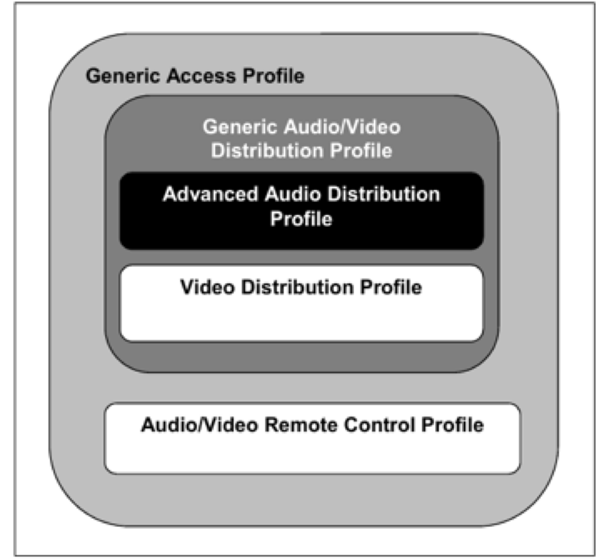

规范和协议
===========

:link_to_translation:`en:[English]`

在蓝牙系统中：

- **协议 (Protocol)**： 定义了完成特定功能所需的底层通信机制，例如数据传输、链路控制、安全服务和服务信息交换等
- **规范 (Profile)**： 定义了蓝牙系统提供的功能和特性（例如音频传输、遥控、串口通信等），它们依赖于底层协议实现

下表总结了 ESP-Bluedroid 支持的经典蓝牙规范：

.. list-table::
    :header-rows: 1

    * - 规范 (Profile)
      - 支持角色
      - 说明
    * - GAP
      - —
      - 设备发现、连接和安全管理
    * - A2DP
      - Source, Sink
      - 高质量音频传输
    * - AVRCP
      - Controller, Target
      - 音频/视频远程控制
    * - HFP
      - AG, HF
      - 免提语音通话
    * - SPP
      - Server, Client
      - 串口数据传输

以上规范基于以下协议实现：L2CAP、SDP、RFCOMM、AVDTP、AVCTP。协议模型如下图所示：

.. code-block:: text

    ┌───────────────────────────────────────────────────────┐
    │                     Applications                      │
    ├───────────────────────────────────────────────────────┤
    │                       Profiles                        │
    │ ┌───────┬───────┬───────┬───────┬───────┐             │
    │ │  GAP  │ A2DP  │ AVRCP │  HFP  │  SPP  │             │
    │ └───────┴───┬───┴───┬───┴───┬───┴───┬───┘             │
    ├─────────────┼───────┼───────┼───────┼─────────────────┤
    │             │       │       │       │    Transport    │
    │        ┌────┴───┬───┴───┬───┴───────┴────┬───────┐    │
    │        │ AVDTP  │ AVCTP │    RFCOMM      │  SDP  │    │
    │        └────┬───┴───┬───┴────────┬───────┴───┬───┘    │
    ├─────────────┴───────┴────────────┴───────────┴────────┤
    │                        L2CAP                          │
    ├───────────────────────────────────────────────────────┤
    │                         HCI                           │
    └───────────────────────────────────────────────────────┘

.. centered:: 经典蓝牙协议栈

各层功能如下：

- **L2CAP、SDP**：核心协议，是经典蓝牙主机协议栈的必备组成部分
- **RFCOMM**：串口模拟协议，为 SPP 和 HFP 提供传输支持
- **AVDTP、AVCTP**：音频/视频传输和控制协议，为 A2DP 和 AVRCP 提供传输支持
- **Profiles**：定义具体应用场景的功能实现

协议
---------------

L2CAP
^^^^^

蓝牙逻辑链路控制和适配协议 (Logical Link Control and Adaptation Protocol, L2CAP) 是经典蓝牙主机协议栈的核心协议，主要功能包括：

- 上层协议复用
- 数据分段和重组
- 服务质量 (QoS) 信息传递

L2CAP 允许多个应用程序共享同一条 ACL-U 逻辑链路，通过面向信道的接口与其他设备通信。

L2CAP 信道支持以下操作模式：

- 基本 L2CAP 模式
- 流量控制模式
- 重传模式
- 加强重传模式
- 流模式

其中，ACL-U 逻辑链路支持基本 L2CAP 模式、加强重传模式和流模式。

SDP
^^^^^

服务发现协议 (Service Discovery Protocol, SDP) 允许应用程序发现其他对等蓝牙设备提供的服务，并获取服务特征信息。SDP 包含 SDP 服务器和 SDP 客户端之间的通信：

- **服务器**：维护描述服务特征的服务记录表
- **客户端**：通过发出 SDP 请求，检索服务器维护的服务信息

RFCOMM
^^^^^^

串口仿真协议 (RFCOMM) 在 L2CAP 之上提供类似串口的通信接口，用于应用程序进行串口数据传输和模拟，是 SPP 和 HFP 的基础协议。RFCOMM 模拟了 RS-232 串口的控制信号和数据流，支持多个并发连接。

AVDTP
^^^^^

音频/视频分发传输协议 (Audio/Video Distribution Transport Protocol, AVDTP) 用于在 L2CAP 层上传输音视频流，是 A2DP 的基本传输协议。AVDTP 包括两个实体：

- **信令实体**：协商流参数
- **传输实体**：传输媒体流

AVCTP
^^^^^

音频/视频控制传输协议 (Audio/Video Control Transport Protocol, AVCTP) 用于传输 AV/C 命令和响应，为 AVRCP 提供传输服务。支持两种信道：

- **控制信道**：传输控制命令
- **浏览信道**：传输浏览命令

规范
--------------

GAP
^^^^^

通用访问规范 (Generic Access Profile, GAP) 定义了蓝牙设备发现、连接建立和安全管理的基本过程。GAP 是所有其他规范的基础。

更多信息请参阅 :doc:`GAP API </api-reference/bluetooth/esp_gap_bt>`。

A2DP
^^^^

高级音频分发规范 (Advanced Audio Distribution Profile, A2DP) 定义了基于 ACL 信道实现高质量音频传输的应用层规范和流程。

**角色定义：**

- **Source (SRC)**：音频源端，如手机、电脑
- **Sink (SNK)**：音频接收端，如蓝牙音箱、耳机

**音频编解码器：**

目前支持 SBC (Sub-Band Coding)，这是 A2DP 规范强制要求的编解码格式。

A2DP 基于 GAP 和 通用音频/视频分发规范 (Generic Audio/Video Distribution Profile, GAVDP)，负责建立音频/视频流。图 :ref:`profile-dependencies` 展示了相关规范的依赖关系。

更多信息请参阅 :doc:`A2DP API </api-reference/bluetooth/esp_a2dp>`。

AVRCP
^^^^^

音频/视频远程控制规范 (Audio/Video Remote Control Profile, AVRCP) 定义了音频/视频设备远程控制的标准接口。

**角色定义：**

- **Controller (CT)**：发起控制命令的设备
- **Target (TG)**：接收并响应控制命令的设备

**支持的控制命令：**

通过 PASS THROUGH 命令支持：播放、暂停、停止、上一曲、下一曲、音量调节等。

**功能分类：**

- 播放机/录像机
- 监控器/放大器（默认配置）
- 调音器
- 菜单

A2DP 与 AVRCP 通常一起使用：

- A2DP 负责高质量音频流传输
- AVRCP 负责音视频设备远程控制
- 下层通过 AVDTP（用于音频流）和 AVCTP（用于控制命令）在 L2CAP 信道上传输数据和命令

图 :ref:`profile-dependencies` 展示了 A2DP 和 AVRCP 的依赖关系：

.. _profile-dependencies:

    规范依赖关系

更多信息请参阅 :doc:`AVRCP API </api-reference/bluetooth/esp_avrc>`。

HFP
^^^

免提规范 (Hands-Free Profile, HFP) 定义了蓝牙免提设备与手机之间的应用层通信规范。

**角色定义：**

- **Audio Gateway (AG)**：音频网关，通常是手机
- **Hands-Free Unit (HF)**：免提设备，如车载蓝牙、蓝牙耳机

**音频编解码器：**

- **CVSD**：窄带语音编解码器
- **mSBC**：宽带语音编解码器

**主要功能：**

- 接听/挂断/拒接电话
- 音量控制
- 语音拨号
- 来电显示

更多信息请参阅 :doc:`HFP API </api-reference/bluetooth/esp_hf_defs>`。

SPP
^^^

串口规范 (Serial Port Profile, SPP) 定义了基于 RFCOMM 协议的串口通信应用，用于通过蓝牙模拟 RS-232 串口数据传输。

**角色定义：**

- **Server**：等待连接的设备
- **Client**：发起连接的设备

**应用场景：**

- 设备配置和调试
- 传感器数据传输
- 点对点数据交换

更多信息请参阅 :doc:`SPP API </api-reference/bluetooth/esp_spp>`。
