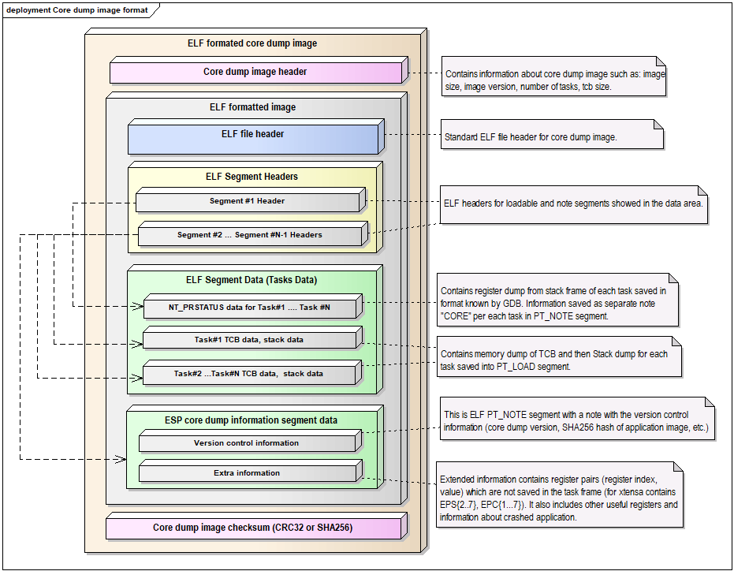
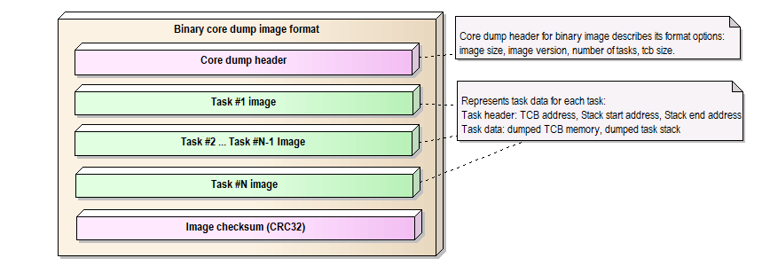
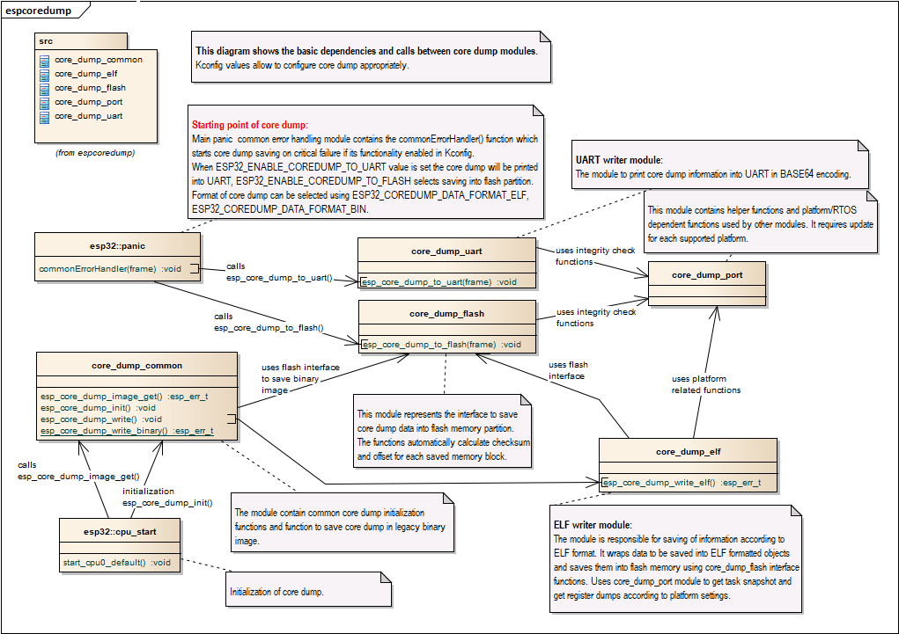

核心转储镜像文件详解
--------------------------

:link_to_translation:`en:[English]`

核心转储文件的格式可以配置为使用 ELF 格式或传统的二进制格式。建议在所有新设计中使用 ELF 格式，该格式在发生崩溃时会提供更多关于软件状态的信息，例如 CPU 寄存器和内存内容。

内存状态包含程序内存空间中映射的所有任务的快照；CPU 状态包含核心转储生成时的寄存器值。核心转储文件使用 ELF 结构的子集注册这些信息。

可加载的 ELF 段用于存储进程的内存状态，ELF 注释 (``ELF.PT_NOTE``) 用于存储进程的元数据（如 pid、寄存器、信号等）。CPU 状态则存储在一个具有特殊名称 (``CORE``) 和类型 (``NT_PRSTATUS type``) 的注释中。

下图展示了核心转储的结构：

    核心转储 ELF 镜像文件格式

    核心转储二进制镜像文件格式

.. note::

    上图仅展示当前版本镜像的文件格式，在未来的发布版本中可能会发生变化。

核心转储实现
--------------------------

下图展示了核心转储实现的基本情况：

    核心转储实现

.. note::

    上图隐藏了部分细节，仅展示当前版本的核心转储实现，在未来的发布版本中可能会发生变化。
