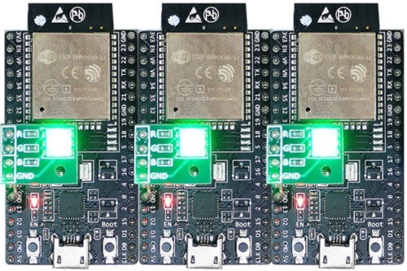
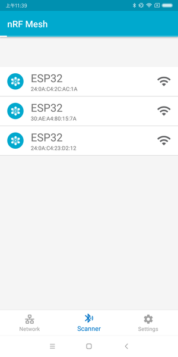
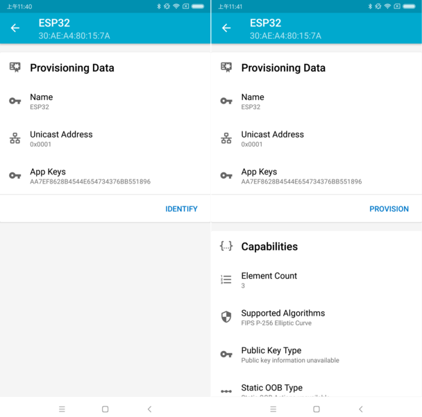
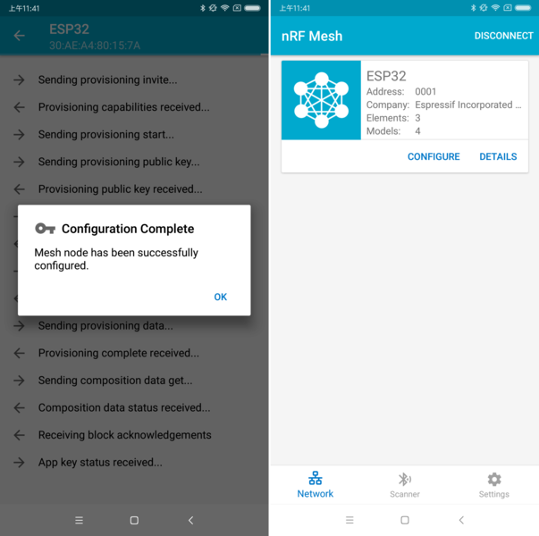
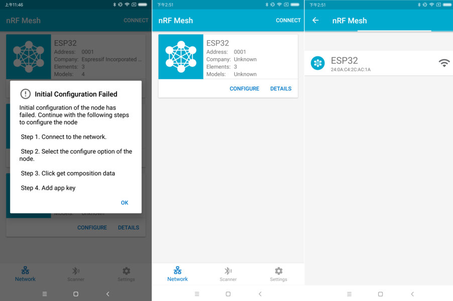
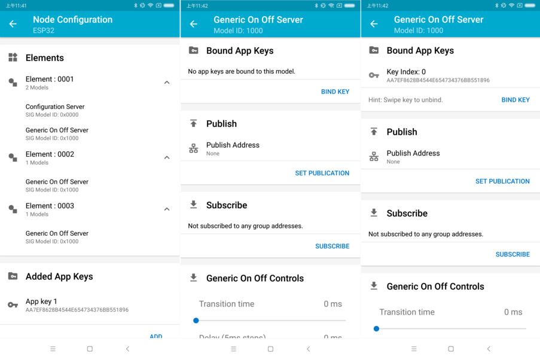
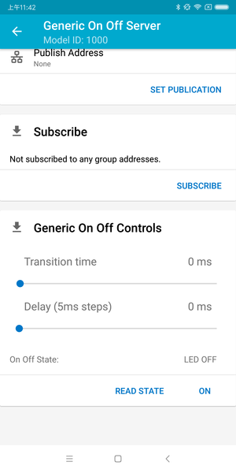
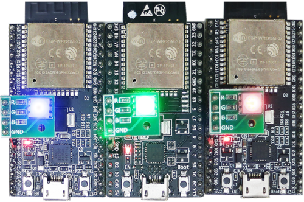

************
ESP-BLE-MESH
************

:link_to_translation:`en:[English]`

蓝牙 mesh 网络实现了无线设备的“多对多”通讯，其可用于建立包含大量设备的网络。

设备能将数据中继至不在初始设备无线电覆盖范围内的其他设备。这样，mesh 网络就能够覆盖非常大的物理区域，并且囊括大量设备。Mesh 网络非常适用于楼宇自动化、传感器网络和其他物联网解决方案，这些情景下数以十计、百计、千计的设备需要与其他设备进行安全可靠的通信。

蓝牙 mesh 并非无线通信技术，而是一种网络技术。该技术基于一种无线通讯协议栈，即低功耗蓝牙。

ESP-BLE-MESH 基于 Zephyr 蓝牙 Mesh 协议栈的顶端，其实现支持设备配网和节点控制，同时也实现了代理、中继、低功耗和朋友等节点功能。

有关 ESP-BLE-MESH 架构实现的信息，请参见 :doc:`ble-mesh-architecture`；有关各自 API 的信息，请参见 :doc:`ESP-BLE-MESH API Reference <../../api-reference/bluetooth/esp-ble-mesh>`。

ESP-BLE-MESH 的实现和认证基于最新的 `Mesh Profile v1.0.1 <https://www.bluetooth.org/docman/handlers/downloaddoc.ashx?doc_id=457092>`_ 。有关 ESP-BLE-MESH 认证的细节，请参考 `此处 <https://launchstudio.bluetooth.com/ListingDetails/94304>`_ 。

.. only:: SOC_WIFI_MESH_SUPPORT

    .. note::

      如果你在寻找 ESP32 基于 Wi-Fi 的 mesh 方案，请查阅乐鑫的另一款产品 ESP-WIFI-MESH。更多相关信息及文档，请参见 :doc:`ESP-WIFI-MESH <../../api-reference/network/esp-wifi-mesh>`。

.. _getting-started-with-ble-mesh:

ESP-BLE-MESH 快速入门
=====================

该章节旨在帮助你基于乐鑫的 ESP32 开发板搭建 ESP-BLE-MESH 网络。

我们将会展示如何搭建并运行一个包含 3 个节点的小型 ESP-BLE-MESH 网络，其中包含设备配网、节点配置，以及向特定节点上的 Generic OnOff Server Model 发送开关灯命令。

如果你是第一次接触 ESP-IDF，请参见 esp-idf :doc:`../../get-started/index` 来设置开发环境，编译、烧写和运行示例应用程序。

硬件及软件准备
--------------

硬件：

* 3 块 ESP32 开发板，请参见 :ref:`options <get-started-ble-mesh-check-hardware>`。
* 连接开发板的 USB 线。
* ESP-IDF 开发环境。
* 运行 Android 或 iOS 的手机或平板。

软件：

* 下载至 ESP32 开发板的示例应用 :example:`bluetooth/esp_ble_mesh/onoff_models`。
* 手机 App: **nRF Mesh** Android 或 iOS 版本。除 nRF Mesh 的 App，以下 App 也支持 ESP-BLE-MESH：

    - `EspBleMesh <https://github.com/EspressifApp/EspBLEMeshForAndroid/releases/tag/v1.0.0>`_ Android App
    - Silicon Labs Android 或 iOS App

安装
----

以下详细步骤可指导你完成安装过程。

.. _get-started-ble-mesh-check-hardware:

步骤 1. 检查硬件
"""""""""""""""""

`ESP32-DevKitC`_ 和 `ESP-WROVER-KIT`_ 开发板均支持 ESP-BLE-MESH。你可以通过 menuconfig: :code:`idf.py menuconfig` > ``Example Configuration`` > ``Board selection for ESP-BLE-MESH`` 选择特定的开发板。

.. note::

  如果你打算使用 `ESP32-DevKitC`_ 开发板，请将 RGB 灯焊接至 GPIO 管脚 25、26 和 27。

步骤 2. 配置软件
""""""""""""""""

进入 :example:`bluetooth/esp_ble_mesh/onoff_models` 示例文件夹，运行 :code:`idf.py menuconfig` 选择所使用的开发板，然后运行 :code:`idf.py build` 编译示例。

步骤 3. 下载应用
"""""""""""""""""

 :example:`bluetooth/esp_ble_mesh/onoff_models` 示例编译成功后，用户可以运行 :code:`idf.py flash` 将编译生成的二进制文件下载至 3 块开发板中。

当开发板上电后，RGB 灯会变为 **绿色**。

    ESP-BLE-MESH 设备上电

步骤 4. 设备配网
"""""""""""""""""

在该章节中，我们将使用 **nRF Mesh Android** App 演示如何配网设备。用户也可以从 App Store 下载其 iOS 版本。

4.1 扫描 (scanner)
^^^^^^^^^^^^^^^^^^

扫描 (Scanner) 是 nRF Mesh App 搜索蓝牙通信范围内未配网设备的功能。打开 App，点击底部的扫描按钮 **Scanner**。App 就会开始扫描设备，很快，我们便可在屏幕上看到 3 个未配网设备。

    nRF Mesh - 扫描

4.2 识别
^^^^^^^^^^^^

用户可以选择任何一个未配网设备，此时 App 会尝试和该设备建立连接。连接成功（有时可能需要尝试多次），且发现相应的 ESP-BLE-MESH GATT 服务后，用户可以在屏幕中看到识别按钮 **IDENTIFY**。IDENTIFY 操作告诉用户哪个设备将被配网。

.. note::
    IDENTIFY 需要设备侧的支持，然后才能用来识别当前正在配网的设备。当前如果点击识别按钮 **IDENTIFY**，除了串口输出的 log，在当前的 example 中设备侧不会有其他现象。

点击识别按钮 **IDENTIFY** 后，用户可以看到配网按钮 **PROVISION**。

    nRF Mesh - 识别 - 配网

4.3 配网
^^^^^^^^^

点击配网按钮 **PROVISION**，App 会开始配网设备。当设备配网成功后，开发板上的 RGB 灯会熄灭，此时 App 会执行以下几个步骤：

1. 和该节点（设备配网后成为节点）断开连接
2. 尝试和该节点重新建立连接
3. 连接成功并且发现了相应的 ESP-BLE-MESH GATT 服务
4. 获取节点的 Composition Data 并且给该节点添加 AppKey

当以上所有的步骤完成后，节点初始配置完成. 此时点击 **OK**，用户可以看见节点的单播地址分配成功，并且其 Composition Data 也被成功解析.

    nRF Mesh - 配置完成

有时在上述步骤 2 中，App 可能与节点连接失败。这种情况下，用户点击 **OK** 后可以看到，节点只有单播地址被成功分配，Composition data 并没有被成功获取。此时用户需要点击右上角的连接按钮 **CONNECT**，屏幕上会显示原先配网的节点，用户需要选择该节点并与其建立连接。

    nRF Mesh - 初始配置失败

连接成功后，App 会显示获取 Composition Data 以及添加 AppKey 的按钮。

.. figure:: ../../../_static/ble-mesh-reconnect-initial-config.png
    :align: center
    :height: 370

    nRF Mesh - 重连 - 初始配置

如果该设备是 App 配网的第二个或第三个节点，此时点击连接按钮 **CONNECT** 后，用户可以在屏幕中看到 2 个或 3 个节点。这种情况下，用户可以选择其中的任何一个节点建立连接，连接成功后可以返回至主界面选择需要配置的节点。

这里给出了一个 3 个节点的示例。

* 左侧图片表示第三个设备成功配网，但是 App 没有和其成功建立连接。当 App 尝试去重新连接第三个节点时，界面上会出现 3 个节点。
* 右侧图片表示和节点成功建立连接后，App 显示这 3 个节点的信息。用户可以看到 App 已经获取了第一个和第二个节点的 Composition Data，但是对于第三个节点，只有单播地址被成功分配而节点的 Composition Data 未知。

.. figure:: ../../../_static/ble-mesh-reconnect-three.png
    :align: center
    :height: 370

    nRF Mesh - 重连 - 3 个节点

4.4 配置
^^^^^^^^^

当成功配网和初始配置完成后，用户可以配置节点的其余信息，例如将 AppKey 绑定至每个元素 (element) 的每个模型 (model) 中、设置模型的发布信息等。

下图展示了如何将 AppKey 绑定至 Primary Element 中的 Generic OnOff Server Model 上。

    nRF Mesh - Model Bind AppKey

.. note::

    用户不需要将 AppKey 绑定至 Configuration Server Model，因为该模型使用 DevKey 在 Upper Transport Layer 中对消息进行加密。

Step 5. 运行网络
"""""""""""""""""

当 3 个元素中的 Generic OnOff Server Models 均成功绑定 AppKey 后，用户可以使用 App 开关 RBG 灯。

在 :example:`bluetooth/esp_ble_mesh/onoff_models` 示例中，第一个 Generic OnOff Server Model 用来控制 **红色**，第二个用来控制 **绿色**，同时第三个用来控制 **蓝色**.

    nRF Mesh - 通用开关控制

下图展示了打开了不同色灯的开发板。

    3 个上电的 ESP-BLE-MESH 节点

.. note::
  对于 **nRF Mesh** iOS App [version 1.0.4]，当节点包含超过一个元素时，App 表现不正确。如果用户尝试打开或者关闭第 2 个或第 3 个 Generic OnOff Server Model，App 会将相应的消息发送至第 1 个 Generic OnOff Server Model。

.. _esp-ble-mesh-examples:

ESP-BLE-MESH 示例
===================

* :example_file:`开关节点 <bluetooth/esp_ble_mesh/onoff_models/onoff_server/tutorial/BLE_Mesh_Node_OnOff_Server_Example_Walkthrough.md>` - 展示了将 ESP-BLE-MESH 作为拥有 Configuration Server model 和 Generic OnOff Server model 的节点设备的用法。然后，ESP-BLE-MESH Provisioner 可以配网设备，控制表示开/关状态的 RGB 灯，示例请见 :example:`example code <bluetooth/esp_ble_mesh/onoff_models/onoff_server>`。

* :example_file:`客户端模型 <bluetooth/esp_ble_mesh/onoff_models/onoff_client/tutorial/BLE_Mesh_Node_OnOff_Client_Example_Walkthrough.md>` - 展示了 Generic OnOff Client model 如何在节点内工作。节点拥有 Configuration Server model、Generic OnOff Server model 和 Generic OnOff Client model，示例请见：:example:`example code <bluetooth/esp_ble_mesh/onoff_models/onoff_client>`。

* :example_file:`配网器 <bluetooth/esp_ble_mesh/provisioner/tutorial/BLE_Mesh_Provisioner_Example_Walkthrough.md>` - 展示了设备如何充当 ESP-BLE-MESH Provisioner 以配网设备。Provisioner 拥有 Configuration Server model、Configuration Client model 和 Generic OnOff Client model，示例请见 :example:`example code <bluetooth/esp_ble_mesh/provisioner>`。

* 快速配网 - :example_file:`Client <bluetooth/esp_ble_mesh/fast_provisioning/fast_prov_client/tutorial/BLE_Mesh_Fast_Prov_Client_Example_Walkthrough.md>` 和 :example_file:`Server <bluetooth/esp_ble_mesh/fast_provisioning/fast_prov_server/tutorial/BLE_Mesh_Fast_Prov_Server_Example_Walkthrough.md>` - 该示例用于演示快速配网。配网 100 个设备费时不超过 60 秒，示例请见：:example:`example client code <bluetooth/esp_ble_mesh/fast_provisioning/fast_prov_client>` 和 :example:`example server code <bluetooth/esp_ble_mesh/fast_provisioning/fast_prov_server>`。

* :example_file:`Wi-Fi 和 BLE-Mesh 共存 <bluetooth/esp_ble_mesh/wifi_coexist/tutorial/BLE_Mesh_WiFi_Coexist_Example_Walkthrough.md>` - 该示例用于演示 Wi-Fi 和 ESP-BLE-MESH 共存的功能。简而言之，用户可在运行 ESP-BLE-MESH 时使用 Wi-Fi，示例请见 :example:`example code <bluetooth/esp_ble_mesh/wifi_coexist>`。

* 远程配网（v1.1 新增）- :example_file:`Client, Server and device <bluetooth/esp_ble_mesh/remote_provisioning/tutorial/BLE_Mesh_Remote_Provisioning_Example_Walkthrough.md>` - 该示例用于演示 mesh 协议 v1.1 中新增的远程配网功能, 示例请见： :example:`example client code <bluetooth/esp_ble_mesh/remote_provisioning/rpr_client>`, :example:`example server code <bluetooth/esp_ble_mesh/remote_provisioning/rpr_server>` and :example:`example device code <bluetooth/esp_ble_mesh/remote_provisioning/unprov_dev>`.

* 定向转发（v1.1 新增）- :example_file:`Client and Server <bluetooth/esp_ble_mesh/directed_forwarding/tutorial/BLE_Mesh_Directed_Forwarding_Example_Walkthrough.md>` - 该示例用于演示 mesh 协议 v1.1 中新增的定向转发功能。只有路径上的节点才会对定向消息进行转发，而其他节点不参与转发, 示例请见 :example:`example client code <bluetooth/esp_ble_mesh/remote_provisioning/rpr_client>` and :example:`example server code <bluetooth/esp_ble_mesh/remote_provisioning/rpr_server>`.

.. _esp-ble-mesh-demo-videos:

ESP-BLE-MESH 演示视频
======================

* `Espressif Fast Provisioning using ESP-BLE-MESH App <https://dl.espressif.com/BLE/public/ESP32_BLE_Mesh_Fast_Provision.mp4>`_
* `Espressif ESP-BLE-MESH and Wi-Fi Coexistence <https://dl.espressif.com/BLE/public/ESP_BLE_MESH_WIFI_Coexistence.mp4>`_

ESP-BLE-MESH 常见问题手册
=========================

* :ref:`ble-mesh-faq-provisioner-development`
* :ref:`ble-mesh-faq-node-development`
* :ref:`ble-mesh-faq-ble-mesh-and-wi-fi-coexistence`
* :ref:`ble-mesh-faq-fast-provisioning`
* :ref:`ble-mesh-faq-log-help`
* :ref:`ble-mesh-faq-example-help`
* :ref:`ble-mesh-faq-others`

相关文档
========

.. toctree::
    :maxdepth: 1

    ble-mesh-feature-list
    ble-mesh-architecture
    ble-mesh-faq
    ble-mesh-terminology

蓝牙 SIG 文档
-------------

- `BLE Mesh Core Specification <https://www.bluetooth.org/docman/handlers/downloaddoc.ashx?doc_id=429633>`_
- `BLE Mesh Protocol v1.1 Specification <https://www.bluetooth.com/specifications/specs/mesh-protocol/>`_
- `BLE Mesh Model Specification <https://www.bluetooth.org/docman/handlers/downloaddoc.ashx?doc_id=429634>`_
- `BLE Mesh Model v1.1 Specification <https://www.bluetooth.com/specifications/specs/mesh-model-1-1/>`_
- `An Intro to Bluetooth Mesh Part 1 <https://www.bluetooth.com/blog/an-intro-to-bluetooth-mesh-part1>`_ / `Part 2 <https://www.bluetooth.com/blog/an-intro-to-bluetooth-mesh-part2>`__
- `The Fundamental Concepts of Bluetooth Mesh Networking, Part 1 <https://www.bluetooth.com/blog/the-fundamental-concepts-of-bluetooth-mesh-networking-part-1>`_ / `Part 2 <https://www.bluetooth.com/blog/the-fundamental-concepts-of-bluetooth-mesh-networking-part-2>`__
- `Bluetooth Mesh Networking: Friendship <https://www.bluetooth.com/blog/bluetooth-mesh-networking-series-friendship>`_
- `Management of Devices in a Bluetooth Mesh Network <https://www.bluetooth.com/blog/management-of-devices-bluetooth-mesh-network>`_
- `Bluetooth Mesh Security Overview <https://www.bluetooth.com/blog/bluetooth-mesh-security-overview>`_
- `Provisioning a Bluetooth Mesh Network Part 1 <https://www.bluetooth.com/blog/provisioning-a-bluetooth-mesh-network-part-1>`_ / `Part 2 <https://www.bluetooth.com/blog/provisioning-a-bluetooth-mesh-network-part-2>`__

.. _ESP32-DevKitC: https://www.espressif.com/en/products/devkits/esp32-devkitc/overview
.. _ESP-WROVER-KIT: https://www.espressif.com/en/products/hardware/esp-wrover-kit/overview
