ESP-WIFI-MESH
==================

:link_to_translation:`en:[English]`

本指南提供有关 ESP-WIFI-MESH 协议的介绍。更多有关 API 使用的信息，请见 :doc:`ESP-WIFI-MESH API 参考 <../api-reference/network/esp-wifi-mesh>`。

.. -------------------------------概述 -----------------------------------

概述
--------

ESP-WIFI-MESH 是一套建立在 Wi-Fi 协议之上的网络协议。ESP-WIFI-MESH 允许分布在大范围区域内（室内和室外）的大量设备（下文称节点）在同一个 WLAN（无线局域网）中相互连接。ESP-WIFI-MESH 具有自组网和自修复的特性，也就是说 mesh 网络可以自主地构建和维护。

本 ESP-WIFI-MESH 指南分为以下几个部分：

1. :ref:`mesh-introduction`

2. :ref:`mesh-concepts`

3. :ref:`mesh-building-a-network`

4. :ref:`mesh-managing-a-network`

5. :ref:`mesh-data-transmission`

6. :ref:`mesh-channel-switching`

7. :ref:`mesh-network-performance`

8. :ref:`mesh-further-notes`

.. -----------------------------简介---------------------------------

.. _mesh-introduction:

简介
------------

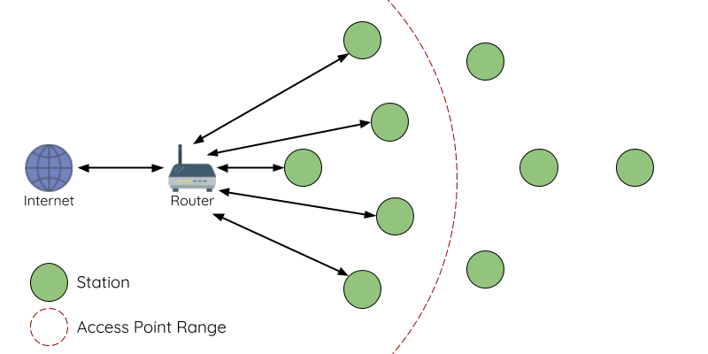

    传统 Wi-Fi 网络架构

传统基础设施 Wi-Fi 网络是一个“单点对多点”的网络。这种网络架构的中心节点为接入点 (AP)，其他节点 (station) 均与 AP 直接相连。其中，AP 负责各个 station 之间的仲裁和转发，一些 AP 还会通过路由器与外部 IP 网络交换数据。在传统 Wi-Fi 网络架构中，1）由于所有 station 均需与 AP 直接相连，不能距离 AP 太远，因此覆盖区域相对有限；2）受到 AP 容量的限制，因此网络中允许的 station 数量相对有限，很容易超载。

.. figure:: ../../_static/mesh-esp-wifi-mesh-network-architecture.png
    :align: center
    :alt: ESP-WIFI-MESH 网络架构示意图
    :figclass: align-center

    ESP-WIFI-MESH 网络架构示意图

ESP-WIFI-MESH 与传统 Wi-Fi 网络的不同之处在于：网络中的节点不需要连接到中心节点，而是可以与相邻节点连接。各节点均负责相连节点的数据中继。由于无需受限于距离中心节点的位置，所有节点仍可互连，因此 ESP-WIFI-MESH 网络的覆盖区域更广。类似地，由于不再受限于中心节点的容量限制，ESP-WIFI-MESH 允许更多节点接入，也不易于超载。

.. --------------------------ESP-WIFI-MESH 概念-------------------------------

.. _mesh-concepts:

ESP-WIFI-MESH 概念
-------------------------

术语
^^^^^^^^^^^

.. list-table::
    :widths: 25 75
    :header-rows: 1

    * - 术语
      - 描述
    * - 节点
      - 任何 **属于** 或 **可以成为** ESP-WIFI-MESH 网络一部分的设备
    * - 根节点
      - 网络顶部的节点
    * - 子节点
      - 如节点 X 连接至节点 Y，且 X 相较 Y 与根节点的距离更远（跨越的连接数量更多），则称 X 为 Y 的子节点。
    * - 父节点
      - 与子节点对应的概念
    * - 后裔节点
      - 任何可以从根节点追溯到的节点
    * - 兄弟节点
      - 连接至同一个父节点的所有节点
    * - 连接
      - AP 和 station 之间的传统 Wi-Fi 关联。ESP-WIFI-MESH 中的节点使用 station 接口与另一个节点的 SoftAP 接口产生关联，进而形成连接。连接包括 Wi-Fi 网络中的身份验证和关联过程。
    * - 上行连接
      - 从节点到其父节点的连接
    * - 下行连接
      - 从父节点到其一个子节点的连接
    * - 无线 hop
      - 源节点和目标节点间无线连接路径中的一部分。**单跳** 指遍历单个连接的数据包，**多跳** 指遍历多个连接的数据包。
    * - 子网
      - 子网指 ESP-WIFI-MESH 网络的一部分，包括一个节点及其所有后代节点。因此，根节点的子网包括 ESP-WIFI-MESH 网络中的所有节点。
    * - MAC 地址
      - 在 ESP-WIFI-MESH 网络中用于区别每个节点或路由器的唯一地址
    * - DS
      - 分布式系统（外部 IP 网络）

树型拓扑
^^^^^^^^^^^^^

ESP-WIFI-MESH 建立在传统  Wi-Fi 协议之上，可被视为一种将多个独立 Wi-Fi 网络组合为一个单一 WLAN 网络的组网协议。在 Wi-Fi 网络中，station 在任何时候都仅限于与 AP 建立单个连接（上行连接），而 AP 则可以同时连接到多个 station（下行连接）。然而，ESP-WIFI-MESH 网络则允许节点同时充当 station 和 AP。因此，ESP-WIFI-MESH 中的节点可以使用 **其 SoftAP 接口建立多个下行连接**，同时使用 **其 station 接口建立一个上行连接**。这将自然产生一个由多层父子结构组成的树型网络拓扑结构。

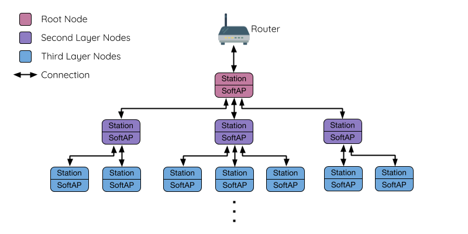

    ESP-WIFI-MESH 树型拓扑

ESP-WIFI-MESH 是一个多跳网络，也就是说网络中的节点可以通过单跳或多跳向网络中的其他节点传送数据包。因此，ESP-WIFI-MESH 中的节点不仅传输自己的数据包，而且同时充当其他节点的中继。假设 ESP-WIFI-MESH 网络中的任意两个节点存在物理层上连接（通过单跳或多跳），则这两个节点可以进行通信。

.. note::

    ESP-WIFI-MESH 网络中的大小（节点总数）取决于网络中允许的最大层级，以及每个节点可以具有的最大下行连接数。因此，这两个变量可用于配置 ESP-WIFI-MESH 网络的大小。

节点类型
^^^^^^^^^^

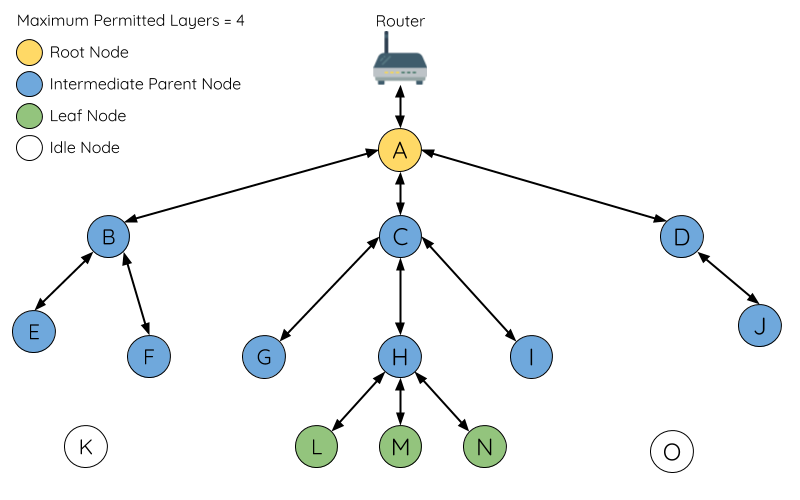

    ESP-WIFI-MESH 节点类型

**根节点**： 指网络顶部的节点，是 ESP-WIFI-MESH 网络和外部 IP 网络之间的唯一接口。根节点直接连接至传统的 Wi-Fi 路由器，并在 ESP-WIFI-MESH 网络的节点和外部 IP 网络之间中继数据包。 **ESP-WIFI-MESH 网络中只能有一个根节点**，且根节点的上行连接只能是路由器。如上图所示，节点 A 即为该 ESP-WIFI-MESH 网络的根节点。

**叶子节点**： 指不允许拥有任何子节点（即无下行连接）的节点。因此，叶子节点只能传输或接收自己的数据包，但不能转发其他节点的数据包。如果节点处于 ESP-WIFI-MESH 网络的最大允许层级，则该节点将成为叶子节点。叶子节点不回再产生下行连接，这可以防止节点继续生成下行连接，从而确保网络层级不会超出限制。由于建立下行连接必须使用 SoftAP 接口，因此一些没有 SoftAP 接口的节点（仅有 station 接口）也将被分配为叶子节点。如上图所示，位于网络最外层的 L/M/N 节点即为叶子节点。

**中间父节点**：既不是属于根节点也不属于叶子节点的节点即为中间父节点。中间父节点必须有且仅有一个上行连接（即一个父节点），但可以具有 0 个或多个下行连接（即 0 个或多个子节点）。因此，中间父节点可以发送和接收自己的数据包，也可以转发其上行和下行连接的数据包。如上图所示，节点 B 到 J 即为中间父节点。 **注意，E/F/G/I/J 等没有下行连接的中间父节点并不等同于叶子节点**，原因在于这些节点仍允许形成下行连接。

**空闲节点**：尚未加入网络的节点即为空闲节点。空闲节点将尝试与中间父节点形成上行连接，或者在有条件的情况下（参见 `自动根节点选择`_ ）成为一个根节点。如上图所示，K 和 O 节点即为空闲节点。

信标帧和 RSSI 阈值
^^^^^^^^^^^^^^^^^^^^^^^^^^^^^^^^^

ESP-WIFI-MESH 中能够形成下行连接的每个节点（即具有 SoftAP 接口）都会定期传输 Wi-Fi 信标帧。节点可以通过信标帧让其他节点检测自己的存在和状态。空闲节点将侦听信标帧以生成一个潜在父节点列表，并与其中一个潜在父节点形成上行连接。ESP-WIFI-MESH 使用“供应商信息元素”来存储元数据，例如：

- 节点类型（根节点、中间父节点、叶子节点、空闲节点）
- 节点当前所处的层级
- 网络中允许的最大层级
- 当前子节点数量
- 可接受的最大下行连接数量

潜在上行连接的信号强度可由潜在父节点信标帧的 RSSI 表示。为了防止节点形成弱上行连接，ESP-WIFI-MESH 采用了针对信标帧的 RSSI 阈值控制机制。如果节点检测到某节点的信标帧 RSSI 过低（即低于预设阈值），则会在尝试形成上行连接时忽略该节点。

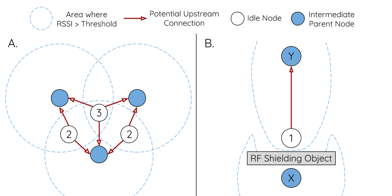

    RSSI 阈值的影响

**上图（A 侧）** 展示了 RSSI 阈值将如何影响空闲节点的候选父节点数量。

**上图（B 侧）** 展示了 RF 屏蔽物将如何降低潜在父节点的 RSSI。由于存在 RF 屏蔽物，节点 X 的 RSSI 高于阈值的区域显著减小。这会导致空闲节点忽略节点 X，即使从地理位置上看 X 就在空闲节点附近。相反，该空闲节点将从更远的地方找到一个 RSSI 更强的节点 Y 形成上行连接。

.. note::

    事实上，ESP-WIFI-MESH 网络中的节点在 MAC 层仍可以接收所有的信标帧，但 RSSI 阈值控制功能可以过滤掉所有 RSSI 低于预设阈值的信标帧。

首选父节点
^^^^^^^^^^^^^^^^^^^^^

当一个空闲节点有多个候选父节点（潜在父节点）时，空闲节点将与其中的 **首选父节点** 形成上行连接。首选父节点基于以下条件确定：

- 候选父节点所处的层级
- 候选父节点当前具有的下行连接（子节点）数量

在网络中所处层级较浅的候选父节点（包括根节点）将优先成为首选父节点。这有助于在形成上行连接时控制 ESP-WIFI-MESH 网络中的总层级使之最小。例如，在位于第二层和第三层的候选父节点间选择时，位于第二层的候选父节点将始终优先成为首选父节点。

如果同一层上存在多个候选父节点，则子节点最少的候选父节点将优先成为首选父节点。这有助于平衡同一层节点的下行连接数量。

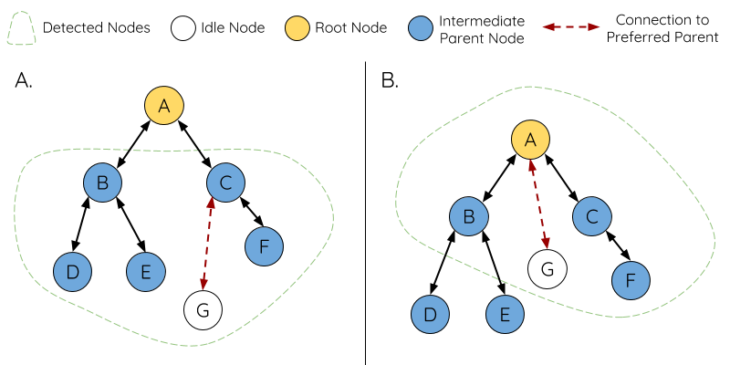

    首选父节点选择

**上图（A 侧）** 展示了空闲节点 G 如何在 B/C/D/E/F 五个候选父节点中选择首选父节点：首先，B/C 节点优于 D/E/F 节点，因为这两个节点所处的层级更浅。其次，C 节点优于 B 节点，因为 C 节点的下行连接数量（子节点数量）更少。

**上图（B 侧）** 展示了空闲节点 G 如何在根节点 A 和其他候选父节点中选择首选父节点，此时根节点 A 处于空闲节点 G 范围之内（即空闲节点 G 接收到的根节点 A 信标帧 RSSI 强度高于预设阈值）：由于根节点 A 处于网络中最浅的层，因此将成为首选父节点。

.. note::

    用户还可以自行定义首选父节点的选择规则，也可以直接指定某个节点为首选父节点（见 :example:`Mesh 手动配网示例 <mesh/manual_networking>`)。

路由表
^^^^^^^^^^^^^^

ESP-WIFI-MESH 网络中的每个节点均会维护自己的路由表，并按路由表将数据包（请见 `ESP-WIFI-MESH 数据包`_）沿正确的路线发送至正确的目标节点。某个特定节点的路由表将包含 **该节点的子网中所有节点的 MAC 地址**，也包括该节点自己的 MAC 地址。每个路由表会划分为多个子路由表，与每个子节点的子网对应。

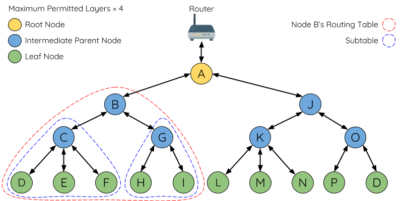

    ESP-WIFI-MESH 路由表示例

以上图为例，节点 B 的路由表中将包含节点 B 到节点 I 的 MAC 地址（即相当于节点 B 的子网）。节点 B 的路由表可划分为节点 C 和 G 的子路由表，分别包含节点 C 到节点 F 的 MAC 地址、节点 G 到节点 I 的 MAC 地址。

**ESP-WIFI-MESH 利用路由表来使用以下规则进行转发，确定 ESP-WIFI-MESH 数据包应根据向上行转发还是向下行转发。**

**1.** 如果数据包的目标 MAC 地址处于当前节点的路由表中且不是当前节点本身，则选择包含目标 MAC 地址的子路由表，并将数据包向下转发给子路由表对应的子节点。

**2.** 如果数据包的目标 MAC 地址不在当前节点的路由表内，则将数据包向上转发给当前节点的父节点，并重复执行该操作直至数据包达到目标地址。此步骤可重复至根节点（根节点包含整个网络的全部节点）。

.. note::

    用户可以通过调用 :cpp:func:`esp_mesh_get_routing_table` 获取一个节点的路由表，调用 :cpp:func:`esp_mesh_get_routing_table_size` 获取一个路由表的大小，也可通过调用 :cpp:func:`esp_mesh_get_subnet_nodes_list` 获取某个子节点的子路由表，调用 :cpp:func:`esp_mesh_get_subnet_nodes_num` 获取子路由表的大小。

.. ------------------------建立网络---------------------------

.. _mesh-building-a-network:

建立网络
------------------

一般过程
^^^^^^^^^^^^^^^

.. warning::

    ESP-WIFI-MESH 正式开始构建网络前，必须确保网络中所有节点具有相同的配置（见 :cpp:type:`mesh_cfg_t`）。每个节点必须配置 **相同 MESH 网络 ID、路由器配置和 SoftAP 配置**。

ESP-WIFI-MESH 网络将首先选择根节点，然后逐层形成下行连接，直到所有节点均加入网络。网络的布局可能取决于诸如根节点选择、父节点选择和异步上电复位等因素。但简单来说，一个 ESP-WIFI-MESH 网络的构建过程可以概括为以下步骤：

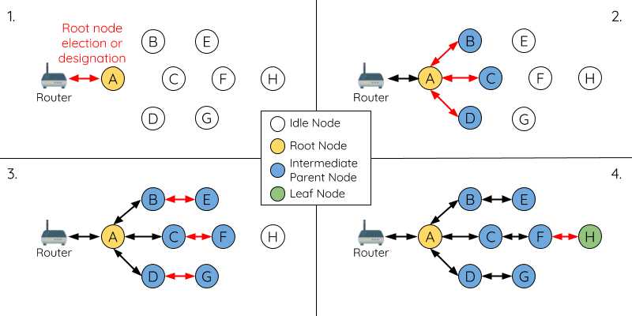

    ESP-WIFI-MESH 网络构建过程

1. 根节点选择
""""""""""""""""""""""
根节点直接进行指定（见 `用户指定根节点`_）或通过选举由信号强度最强的节点担任（见 `自动根节点选择`_）。一旦选定，根节点将与路由器连接，并开始允许下行连接形成。如上图所示，节点 A 被选为根节点，因此节点 A 上行连接到路由器。

2. 第二层形成
"""""""""""""""""""""""""
一旦根节点连接到路由器，根节点范围内的空闲节点将开始与根节点连接，从而形成第二层网络。一旦连接，第二层节点成为中间父节点（假设最大允许层级大于 2 层），并进而形成下一层。如上图所示，节点 B 到节点 D 都在根节点的连接范围内。因此，节点 B 到节点 D 将与根节点形成上行连接，并成为中间父节点。

3. 其余层形成
""""""""""""""""""""""""""""""""
剩余的空闲节点将与所处范围内的中间父节点连接，并形成新的层。一旦连接，根据网络的最大允许层级，空闲节点成为中间父节点或叶子节点。此后重复该步骤，直到网络中的所有空闲节点均加入网络或达到网络最大允许层级。如上图所示，节点 E/F/G 分别与节点 B/C/D 连接，并成为中间父节点。

4. 限制树深度
""""""""""""""""""""""
为了防止网络超过最大允许层级，最大允许层级上的节点将在完成连接后成为叶子节点。这样一来，其他空闲节点将无法与这些最大允许层上的叶子节点形成连接，因此不会超过最大允许层级。然而，如果空闲节点无法找到其他潜在父节点，则将无限期地保持空闲状态。如上图所示，网络的最大允许层级为四。因此，节点 H 在完成连接后将成为叶子节点，以防止任何下行连接的形成。

自动根节点选择
^^^^^^^^^^^^^^^^^^^^^^^^^^^^^

在自动模式下，根节点的选择取决于相对于路由器的信号强度。每个空闲节点将通过 Wi-Fi 信标帧发送自己的 MAC 地址和路由器 RSSI 值。 **MAC 地址可以表示网络中的唯一节点**，而 **路由器 RSSI 值** 代表相对于路由器的信号强度。

此后，每个节点将同时扫描来自其他空闲节点的信标帧。如果节点检测到具有更强的路由器 RSSI 的信标帧，则节点将开始传输该信标帧的内容（相当于为这个节点投票）。经过最小迭代次数（可预先设置，默认为 10 次）将选举出路由器 RSSI 值最强的信标帧。

在达到预设迭代次数后，每个节点将单独检查其 **得票百分比** （``得票数/总票数``）以确定它是否应该成为根节点。 **如果节点的得票百分比大于预设的阈值（默认为 90%），则该节点将成为根节点**。

下图展示了在 ESP-WIFI-MESH 网络中，根节点的自动选择过程。

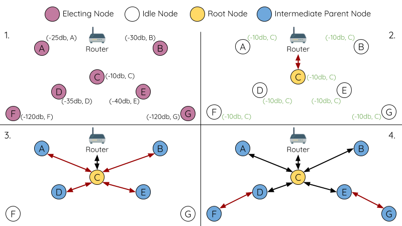

    根节点选举示例

**1.** 上电复位时，每个节点开始传输自己的信标帧（包括 MAC 地址和路由器 RSSI 值）。

**2.** 在多次传输和扫描迭代中，路由器 RSSI 最强的信标帧将在整个网络中传播。节点 C 具有最强的路由器 RSSI 值 (-10 dB)，因此它的信标帧将在整个网络中传播。所有参与选举的节点均给节点 C 投票，因此节点 C 的得票百分比为 100%。因此，节点 C 成为根节点，并与路由器连接。

**3.** 一旦节点 C 与路由器连接，节点 C 将成为节点 A/B/D/E 的首选父节点（即最浅的节点），并与这些节点连接。节点 A/B/D/E 将形成网络的第二层。

**4.** 节点 F 和节点 G 分别连接节点 D 和节点 E，并完成网络构建过程。

.. note::

    用户可以通过 :cpp:func:`esp_mesh_set_attempts` 配置选举的最小迭代次数。用户应根据网络内的节点数量配置迭代次数（即 mesh 网络越大，所需的迭代次数越高）。

.. warning::

    **得票百分比阈值** 也可以使用 :cpp:func:`esp_mesh_set_vote_percentage` 进行配置。得票百分比阈值过低 **可能导致同一 mesh 网络中两个或多个节点成为根节点**，进而分化为多个 mesh 网络。如果发生这种情况，ESP-WIFI-MESH 具有内部机制，可自主解决 **根节点冲突**。这些具有多个根节点的网络将围绕一个根节点形成一个网络。然而，两个或多个路由器 SSID 相同但路由器 BSSID 不同的根节点冲突尚无法解决。

用户指定根节点
^^^^^^^^^^^^^^^^^^^^^^^^^

根节点也可以由用户指定，即直接让指定的根节点与路由器连接，并放弃选举过程。当根节点指定后，网络内的所有其他节点也必须放弃选举过程，以防止根节点冲突的发生。下图展示了在 ESP-WIFI-MESH 网络中，根节点的手动选择过程。

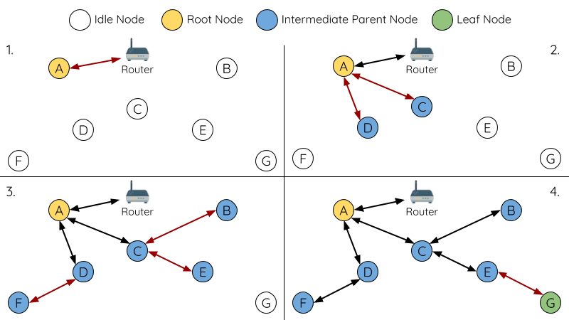

    根节点指定示例（根节点 = A，最大层级 = 4)

**1.** 节点 A 是由用户指定的根节点，因此直接与路由器连接。此时，所有其他节点放弃选举过程。

**2.** 节点 C 和节点 D 将节点 A 选为自己的首选父节点，并与其形成连接。这两个节点将形成网络的第二层。

**3.** 类似地，节点 B 和节点 E 将与节点 C 连接，节点 F 将与节点 D 连接。这三个节点将形成网络的第三层。

**4.** 节点 G 将与节点 E 连接，形成网络的第四层。然而，由于该网络的最大允许层级已配置为 4，因此节点 G 将成为叶子节点，以防止形成任何新层。

.. note::

    一旦指定根节点，该根节点应调用 :cpp:func:`esp_mesh_set_parent` 使其直接与路由器连接。类似地，所有其他节点都应该调用 :cpp:func:`esp_mesh_fix_root` 放弃选举过程。

选择父节点
^^^^^^^^^^^^^^^^^^^^^

默认情况下，ESP-WIFI-MESH 具有可以自组网的特点，也就是每个节点都可以自主选择与其形成上行连接的潜在父节点。自主选择出的父节点被称为首选父节点。用于选择首选父节点的标准旨在减少 ESP-WIFI-MESH 网络的层级，并平衡各个潜在父节点的下行连接数（参见 `首选父节点`_）。

不过，ESP-WIFI-MESH 也允许用户禁用自组网功能，即允许用户自己定义父节点选择标准，或直接指定某个节点为父节点（见： :example:`Mesh 手动组网示例 <mesh/manual_networking>`）。

异步上电复位
^^^^^^^^^^^^^^^^^^^^^^^^^^^

ESP-WIFI-MESH 网络构建可能会受到节点上电顺序的影响。如果网络中的某些节点为异步上电（即相隔几分钟上电），**网络的最终结构可能与所有节点同步上电时的理想情况不同**。延迟上电的节点将遵循以下规则：

**规则 1**：如果网络中已存在根节点，则延迟节点不会尝试选举成为新的根节点，即使自身的路由器 RSSI 更强。相反，延迟节点与任何其他空闲节点无异，将通过与首选父节点连接来加入网络。如果该延迟节点为用户指定的根节点，则网络中的所有其他节点将保持空闲状态，直到延迟节点完成上电。

**规则 2**：如果延迟节点形成上行连接，并成为中间父节点，则后续也可能成为其他节点（即其他更浅的节点）的新首选父节点。此时，其他节点切换上行连接至该延迟节点（见 `父节点切换`_）。

**规则 3**：如果空闲节点的指定父节点上电延迟了，则该空闲节点在没有找到指定父节点前不会尝试形成任何上行连接。空闲节点将无限期地保持空闲，直到其指定的父节点上电完成。

下方示例展示了异步上电对网络构建的影响。

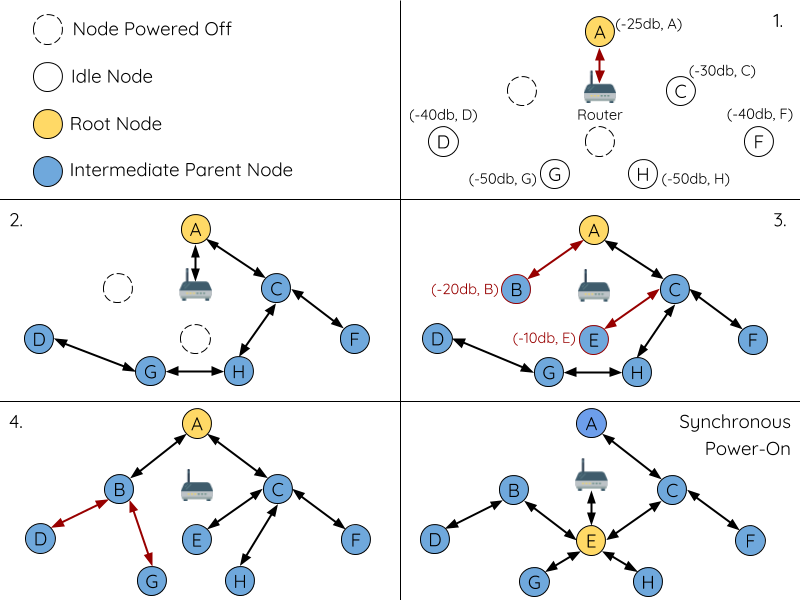

    网络构建（异步电源）示例

**1.** 节点 A/C/D/F/G/H 同步上电，并通过广播其 MAC 地址和路由器 RSSI 开始选举根节点。节点 A 的 RSSI 最强，因此当选为根节点。

**2.** 一旦节点 A 成为根节点，其余的节点就开始与其首选父节点逐层形成上行连接，并最终形成一个具有五层的网络。

**3.** 节点 B/E 由于存在上电延迟，因此即使路由器 RSSI 比节点 A 更强（-20 dB 和 -10 dB）也不会尝试成为根节点。相反，这两个上电延迟节点均将与对应的首选父节点 A 和 C 形成上行连接。加入网络后，节点 B/E 均将成为中间父节点。

**4.** 节点 B 由于所处层级变化（现为第二层）而成为新的首选父节点，因此节点 D/G 将切换其上行连接从而选择新的首选父节点。由于切换的发生，最终的网络层级从原来的五层减少至三层。

**同步上电**：如果所有节点均同步上电，节点 E (-10 dB) 由于路由器 RSSI 最强而成为根节点。此时形成的网络结构将与异步上电的情况截然不同。**但是，如果用户手动切换根节点，则仍可以达到同步上电的网络结构** （请见 :cpp:func:`esp_mesh_waive_root`）。

.. note::

    从某种程度上，ESP-WIFI-MESH 可以自动修复部分因异步上电引起的父节点选择的偏差（请见 `父节点切换`_）

环路避免、检测和处理
^^^^^^^^^^^^^^^^^^^^^^^^^^^^^^^^^^^^^^^^^^^^

环路是指特定节点与其后代节点（特定节点子网中的节点）形成上行连接的情况。因此产生的循环连接路径将打破 mesh 网络的树型拓扑结构。ESP-WIFI-MESH 的节点在选择父节点时将主动排除路由表（见 `路由表`_）中的节点，从而避免与其子网中的节点建立上行连接并形成环路。

在存在环路的情况下，ESP-WIFI-MESH 可利用路径验证机制和能量传递机制来检测环路的产生。因与子节点建立上行连接而导致环路形成的父节点将通知子节点环路的存在，并主动断开连接。

.. --------------------------管理网络 ------------------------------

.. _mesh-managing-a-network:

管理网络
------------------

**作为一个自修复网络，ESP-WIFI-MESH 可以检测并修正网络路由中的故障**。当具有一个或多个子节点的父节点断开或父节点与其子节点之间的连接不稳定时，会发生故障。ESP-WIFI-MESH 中的子节点将自主选择一个新的父节点，并与其形成上行连接，以维持网络互连。ESP-WIFI-MESH 可以处理根节点故障和中间父节点故障。

根节点故障
^^^^^^^^^^^^^^^^^

如果根节点断开，则与其连接的节点（第二层节点）将及时检测到该根节点故障。第二层节点将主动尝试与根节点重连。但是在多次尝试失败后，第二层节点将启动新一轮的根节点选举。 **第二层中 RSSI 最强的节点将当选为新的根节点**，而剩余的第二层节点将与新的根节点（如果不在范围内的话，也可与相邻父节点连接）形成上行连接。

如果根节点和下面多层的节点（例如根节点、第二层节点和第三层节点）同时断开，则位于最浅层的仍在正常工作的节点将发起根节点选举。下方示例展示了网络从根节点断开故障中进行自修复。

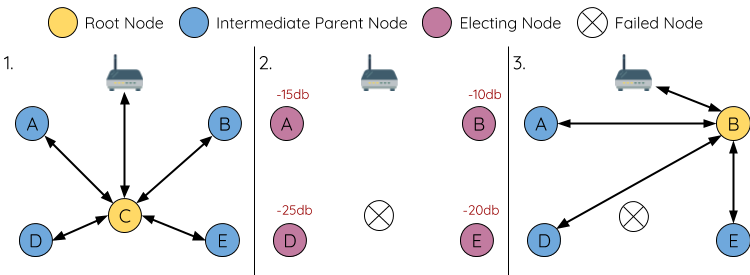

    根节点故障的自修复示意

**1.** 节点 C 是网络的根节点。节点 A/B/D/E 是连接到节点 C 的第二层节点。

**2.** 节点 C 断开。在多次重连尝试失败后，第二层节点开始通过广播其路由器 RSSI 开始新一轮的选举。此时，节点 B 的路由器 RSSI 最强。

**3.** 节点 B 被选为根节点，并开始接受下行连接。剩余的第二层节点 A/D/E 形成与节点 B 的上行连接，因此网络已经恢复，并且可以继续正常运行。

.. note::

    如果是手动指定的根节点断开，则无法进行自动修复。**任何节点不会在存在指定根节点的情况下开始选举过程**。

中间父节点故障
^^^^^^^^^^^^^^^^^^^^^^^^^^^^^^^^

如果中间父节点断开，则与之断开的子节点将主动尝试与该父节点重连。在多次重连尝试失败后，每个子节点开始扫描潜在父节点（请见 `信标帧和 RSSI 阈值`_）。

如果存在其他可用的潜在父节点，每个子节点将分别给自己选择一个新的首选父节点（请见 `首选父节点`_），并与它形成上行连接。如果特定子节点没有其他潜在的父节点，则将无限期地保持空闲状态。

下方示例展示了网络从中间父节点断开故障中进行自修复。

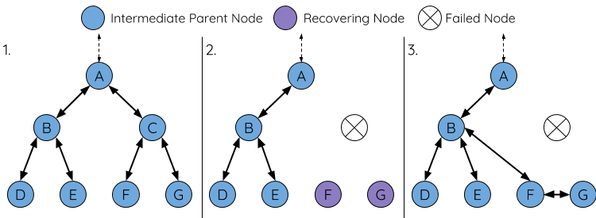

    中间父节点故障的自修复

**1.** 网络中存在节点 A 至 G。

**2.** 节点 C 断开。节点 F/G 检测到节点 C 的断开故障，并尝试与节点 C 重新连接。在多次重连尝试失败后，节点 F/G 将开始选择新的首选父节点。

**3.** 节点 G 因其范围内不存在任何父节点而暂时保持空闲。节点 F 的范围中有 B 和 E 两个节点，但节点 B 因为所处层级更浅而当选新的父节点。节点 F 将与节点 B 连接后，并成为一个中间父节点，节点 G 将于节点 F 相连。这样一来，网络已经恢复了，但结构发生了变化（网络层级增加了 1 层）。

.. note::

    如果子节点的父节点已被指定，则子节点不会尝试与其他潜在父节点连接。此时，该子节点将无限期地保持空闲状态。

根节点切换
^^^^^^^^^^^^^^^^^^^

除非根节点断开，否则 ESP-WIFI-MESH 不会自动切换根节点。即使根节点的路由器 RSSI 降低至必须断开的情况，根节点也将保持不变。根节点切换是指明确启动新选举过程的行为，即具有更强路由器 RSSI 的节点选为新的根节点。这可以用于应对根节点性能降低的情况。

要触发根节点切换，当前根节点必须明确调用 :cpp:func:`esp_mesh_waive_root` 以触发新的选举。当下根节点将指示网络中的所有节点开始发送并扫描信标帧（见 `自动根节点选择`_），**但与此同时一直保持联网（即不会变为空闲节点）**。如果另一个节点收到的票数超过当前根节点，则将启动根节点切换过程，**否则根节点将保持不变**。

新选出的根节点向当前的根节点发送 **切换请求**，而原先的根节点将返回一个应答通知，表示已经准备好切换。一旦接收到应答，新选出的根节点将与其父节点断开连接，并迅速与路由器形成上行连接，进而成为网络的新根节点。原先的根节点将断开与路由器的连接，**并与此同时保持其所有下行连接** 并进入空闲状态。之前的根节点将开始扫描潜在的父节点并选择首选父节点。

下图说明了根节点切换的示例。

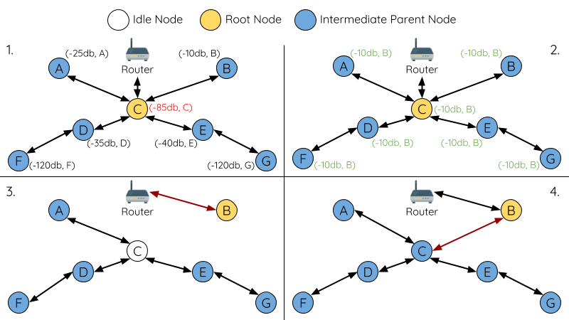

切换根节点示例

**1.** 节点 C 是当前的根节点，但路由器 RSSI 值 (-85 dB) 降低至较低水平。此时，新的选举过程被触发了。所有节点开始传输和扫描信标帧（**此时仍保持连接**）。

**2.** 经过多轮传输和扫描后，节点 B 被选为新的根节点。节点 B 向节点 C 发送了一个 **切换请求**，节点 C 回复一个应答。

**3.** 节点 B 与其父节点断开连接，并与路由器连接，成为网络中的新根节点。节点 C 与路由器断开连接，进入空闲状态，并开始扫描并选择新的首选父节点。 **节点 C 在整个过程中仍保持其所有的下行连接**。

**4.** 节点 C 选择节点 B 作为其的首选父节点，与之形成上行连接，并成为一个第二层节点。由于节点 C 仍保持相同的子网，因此根节点切换后的网络结构没有变化。然后，由于切换的发生，节点 C 子网中每个节点的所处层级均增加了一层。如果根节点切换过程中产生了新的根节点，则 `父节点切换`_ 可以随后调整网络结构。

.. note::

    根节点切换必须要求选举，因此只有在使用自组网 ESP-WIFI-MESH 网络时才支持。换句话说，如果使用指定的根节点，则不能进行根节点切换。

父节点切换
^^^^^^^^^^^^^^^^^^^^^

父节点切换是指一个子节点将其上行连接切换到更浅一层的另一个父节点。**父节点切换是自动的**，这意味着如果较浅层出现了可用的潜在父节点（因“异步上电复位”产生），子节点将自动更改其上行连接。

所有潜在的父节点将定期发送信标帧（参见 `信标帧和 RSSI 阈值`_），从而允许子节点扫描较浅层的父节点的可用性。由于父节点切换，自组网 ESP-WIFI-MESH 网络可以动态调整其网络结构，以确保每个连接均具有良好的 RSSI 值，并且网络中的层级最小。

.. ---------------------------数据传输 ------------------------------

.. _mesh-data-transmission:

数据传输
-----------------

ESP-WIFI-MESH 数据包
^^^^^^^^^^^^^^^^^^^^^^^^^^^^^

ESP-WIFI-MESH 网络使用 ESP-WIFI-MESH 数据包传输数据。ESP-WIFI-MESH 数据包 **完全包含在 Wi-Fi 数据帧** 中。ESP-WIFI-MESH 网络中的多跳数据传输将涉及通过不同 Wi-Fi 数据帧在每个无线跳上传输的单个 ESP-WIFI-MESH 数据包。

下图显示了 ESP-WIFI-MESH 数据包的结构及其与 Wi-Fi 数据帧的关系。

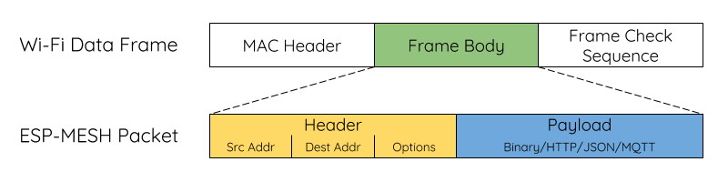

    ESP-WIFI-MESH 数据包

ESP-WIFI-MESH 数据包的 **报头** 包含源节点和目标节点的 MAC 地址。**选项 (option)** 字段包含有关特殊类型 ESP-WIFI-MESH 数据包的信息，例如组传输或来自外部 IP 网络的数据包（请参阅 :c:macro:`MESH_OPT_SEND_GROUP` 和 :c:macro:`MESH_OPT_RECV_DS_ADDR`）。

ESP-WIFI-MESH 数据包的 **有效载荷** 包含实际的应用数据。该数据可以为原始二进制数据，也可以是使用 HTTP、MQTT 和 JSON 等应用层协议的编码数据（请见：:cpp:type:`mesh_proto_t`）。

.. note::

    当向外部 IP 网络发送 ESP-WIFI-MESH 数据包时，报头的目标地址字段将包含目标服务器的 IP 地址和端口号，而不是节点的 MAC 地址（请见：:cpp:type:`mesh_addr_t`）。此外，根节点将处理外发 TCP/IP 数据包的形成。

组控制和组播
^^^^^^^^^^^^^^^^^^^^^^^^^^^^

组播功能允许将单个 ESP-WIFI-MESH 数据包同时发送给网络中的多个节点。ESP-WIFI-MESH 中的组播可以通过“指定一个目标节点列表”或“预配置一个节点组”来实现。这两种组播方式均需调用 :cpp:func:`esp_mesh_send` 实现。

如果通过“指定目标节点列表”实现组播，用户必须首先将 ESP-WIFI-MESH 数据包的目标地址设置为 **组播组地址** （比如 ``01:00:5E:xx:xx:xx``）。这表明 ESP-WIFI-MESH 数据包是一个拥有一组地址的组播数据包，且该地址应该从报头选项中获得。然后，用户必须将目标节点的 MAC 地址列为选项（请见： :cpp:type:`mesh_opt_t` 和 :c:macro:`MESH_OPT_SEND_GROUP`）。这种组播方法不需要进行提前设置，但由于每个目标节点的 MAC 地址均需列为报头的选项字段，因此会产生大量开销数据。

分组组播允许 ESP-WIFI-MESH 数据包被发送到一个预先配置的节点组。每个分组都有一个具有唯一性的 ID 标识。用户可通过 :cpp:func:`esp_mesh_set_group_id` 将节点加入一个组。分组组播需要将 ESP-WIFI-MESH 数据包的目标地址设置为目标组的 ID，还必须设置 :c:macro:`MESH_DATA_GROUP` 标志位。分组组播产生的开销更小，但必须提前将节点加入分组中。

.. note::

    在组播期间，网络中的所有节点在 MAC 层都会收到 ESP-WIFI-MESH 数据包。然而，不包括在 MAC 地址列表或目标组中的节点将简单地过滤掉这些数据包。

广播
^^^^^^^^^^^^

广播功能允许将单个 ESP-WIFI-MESH 数据包同时发送给网络中的所有节点。每个节点可以将一个广播包转发至其所有上行和下行连接，使得数据包尽可能快地在整个网络中传播。但是，ESP-WIFI-MESH 利用以下方法来避免在广播期间浪费带宽。

**1.** 当中间父节点收到来自其父节点的广播包时，它会将该数据包转发给自己的各个子节点，同时为自己保存一份数据包的副本。

**2.** 当中间父节点是广播的源节点时，它会将该数据包向上发送至其父节点，并向下发送给自己的各个子节点。

**3.** 当中间父节点接收到一个来自其子节点的广播包时，它会将该数据包转发给其父节点和其余子节点，同时为自己保存一份数据包的副本。

**4.** 当叶子节点是广播的源节点时，它会直接将该数据包发送至其父节点。

**5.** 当根节点是广播的源节点时，它会将该数据包发送至自己的所有子节点。

**6.** 当根节点收到来自其子节点的广播包时，它会将该数据包转发给其余子节点，同时为自己保存一份数据包的副本。

**7.** 当节点接收到一个源地址与自身 MAC 地址匹配的广播包时，它会将该广播包丢弃。

**8.** 当中间父节点收到一个来自其父节点的广播包时（该数据包最初来自该父节点的一个子节点），它会将该广播包丢弃。

上行流量控制
^^^^^^^^^^^^^^^^^^^^^

ESP-WIFI-MESH 依赖父节点来控制其直接子节点的上行数据流。为了防止父节点的消息缓冲因上行传输过载而溢出，父节点将为每个子节点分配一个称为 **接收窗口** 的上行传输配额。 **每个子节点均必须申请接收窗口才允许进行上行传输**。接收窗口的大小可以动态调整。完成从子节点到父节点的上行传输包括以下步骤：

**1.** 在每次传输之前，子节点向其父节点发送窗口请求。窗口请求中包括一个序号，与子节点的待传输数据包相对应。

**2.** 父节点接收窗口请求，并将序号与子节点发送的前一个数据包的序号进行比较，用于计算返回给子节点的接收窗口大小。

**3.** 子节点根据父节点指定的窗口大小发送数据包。如果子节点的接收窗口耗尽，它必须通过发送请求获得另一个接收窗口，然后才允许继续发送。

.. note::

    ESP-WIFI-MESH 不支持任何下行流量控制。

.. warning::

    由于 `父节点切换`_，数据包可能会在上行传输期间丢失。

由于根节点是通向外部 IP 网络的唯一接口，因此下行节点必须了解根节点与外部 IP 网络的连接状态。否则，节点可能会尝试向一个已经与 IP 网络断开连接的根节点发送数据，从而造成不必要的传输和数据包丢失。ESP-WIFI-MESH 可以基于监测根节点和外部 IP 网络的连接状态，提供一种稳定外发数据吞吐量的机制。根节点可以通过调用 :cpp:func:`esp_mesh_post_toDS_state` 将自身与外部 IP 网络的连接状态广播给所有其他节点。

双向数据流
^^^^^^^^^^^^^^^^^^^^^^^^^^

下图展示了 ESP-WIFI-MESH 双向数据流涉及的各种网络层。

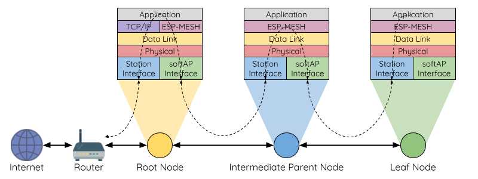

    ESP-WIFI-MESH 双向数据流

由于使用 `路由表`_，**ESP-WIFI-MESH 能够在 mesh 层中完全处理数据包的转发**。TCP/IP 层仅与 mesh 网络的根节点有关，可帮助根节点与外部 IP 网络的数据包传送。

.. ---------------------------信道切换 -------------------------------

.. _mesh-channel-switching:

信道切换
-----------------

背景
^^^^^^^^^^

在传统的 Wi-Fi 网络中，**信道** 代表预设的频率范围。在基础设施基本服务集 (BSS) 中，工作 AP 及与之相连的 station 必须处于传输信标的工作信道（1 到 14）中。物理上相邻的 BSS 使用相同的工作信道会导致干扰产生和性能下降。

为了允许 BSS 适应不断变化的物理层条件并保持性能，Wi-Fi 网络中增加了 **网络信道切换** 的机制。网络信道切换是将 BSS 移至新的工作信道，并同时最大限度地减少期间对 BSS 的影响。然而，我们应该认识到，网络信道切换可能不会成功，无法将原信道中的所有 station 均移动至新的信道。

在基础设施 Wi-Fi 网络中，网络信道切换由 AP 触发，目的是将该 AP 及与之相连的所有 station 同步切换到新的信道。网络信道切换是通过在 AP 的周期性发送信标帧内嵌入一个 **信道切换公告 (CSA)** 元素来实现的。在网络信号切换前，该 CSA 元素用于向所有连接的 station 广播有关即将发生的网络信道切换，并且将包含在多个信标帧中。

一个 CSA 元素包含有关 **新信道号** 和 **信道切换计数** 的信息。其中，**信道切换计数** 指示在网络信道切换之前剩余的信标帧间隔 (TBTT) 数量。因此，**信道切换计数** 依每个信标帧递减，并且允许与之连接的 station 与 AP 同步进行信道切换。

ESP-WIFI-MESH 网络信道切换
^^^^^^^^^^^^^^^^^^^^^^^^^^^^^^^^^^

ESP-WIFI-MESH 网络信道切换还利用包含 CSA 元素的信标帧。然而，ESP-WIFI-MESH 作为一个多跳网络，其信标帧可能无法到达网络中的所有节点（这点与单跳网络不同），因此信道切换过程更加复杂。因此，ESP-WIFI-MESH 网络依赖于通过节点转发 CSA 元素，从而实现在整个网络中的传播。

当具有一个或多个子节点的中间父节点接收到包含 CSA 元素的信标帧时，该节点会将该元素包含在其下一个发送的信标帧（即具有相同的 **新信道号** 和 **信道切换计数**）中，从而实现该 CSA 元素的转发。鉴于 ESP-WIFI-MESH 网络中的所有节点都接收到相同的 CSA 元素，这些节点可以使用 **信道切换计数** 来同步其信道切换，但也会经历因 CSA 元素转发造成的延迟。

ESP-WIFI-MESH 网络信道切换可以由路由器或根节点触发。

根节点触发
"""""""""""""""""""
**由根节点触发的信道切换只能在 ESP-WIFI-MESH 网络未连接到路由器** 时才会发生。通过调用 :cpp:func:`esp_mesh_switch_channel`，根节点将设置一个初始 **信道切换计数** 值，并开始在其信标帧中包含 CSA 元素。接着，每个 CSA 元素将抵达第二层节点，并通过第二层节点自己的信标帧继续进行向下转发。

路由器触发
""""""""""""""""
当 ESP-WIFI-MESH 网络连接到路由器时，整个网络必须与路由器采用同一个信道。因此，**根节点在连接到路由器时无法触发信道切换**。

当根节点从路由器接收到包含 CSA 元素的信标帧时，**根节点将 CSA 元素中的信道切换计数值设置为自定义值，然后再通过信标帧继续向下转发**。此后，该 **信道切换计数** 将依转发次数相对于自定义值依次递减。该自定义值可以基于诸如网络层级、当前节点数等因素。

ESP-WIFI-MESH 网络及其路由器可能具有不同且变化的信标间隔，因此需要将 **信道切换计数** 值设置为自定义值。也就是说，路由器提供的 **信道切换计数** 值与 ESP-WIFI-MESH 网络无关。通过使用自定义值，ESP-WIFI-MESH 网络中的节点能够相对于 ESP-WIFI-MESH 网络的信标间隔同步切换信道。也正因如此，ESP-WIFI-MESH 网络也会出现信道与路由器及其连接 station 的信道切换不同步的情况。

网络信道切换的影响
^^^^^^^^^^^^^^^^^^^^^^^^^^^^^^^^^^^

- 由于 ESP-WIFI-MESH 网络信道切换与路由器的信道切换不同步，ESP-WIFI-MESH 网络和路由器之间会出现 **临时信道差异**。
    - ESP-WIFI-MESH 网络的信道切换时间取决于 ESP-WIFI-MESH 网络的信标间隔和根节点的自定义 **信道切换计数**。
    - 在 ESP-WIFI-MESH 网络切换期间，信道差异将阻止根节点和路由器之间的任何数据交换。
    - 在 ESP-WIFI-MESH 网络中，根节点和中间父节点将请求与其连接的子节点停止传输，直至信道切换发生（通过将 CSA 元素的 **信道切换模式** 字段置为 1）。
    - 频繁的路由器触发网络信道切换可能会降低 ESP-WIFI-MESH 网络的性能。请注意，这可能是由 ESP-WIFI-MESH 网络本身造成的（例如由于 ESP-WIFI-MESH 网络的无线介质争用等原因）。此时，用户应该禁用路由器触发的自主信道切换，并直接指定一个信道。

- 当存在 **临时信道差异** 时，根节点从技术上来说仍保持连接至路由器。
    - 如果根节点经过一定数量信标间隔仍无法接到信标帧或探测来自路由器的响应，则会断开连接。
    - 断开连接时，根节点将自动重新扫描所有信道以确定是否存在路由器。

- 如果根节点无法接收任何路由器的 CSA 信标帧（例如短暂的路由器切换时间），则路由器将在没有 ESP-WIFI-MESH 网络的情况下切换信道。
    - 在路由器切换信道后，根节点将不再能够接收路由器的信标帧和探测响应，并导致在一定数量的信标间隔后断开连接。
    - 在断开连接后，根节点将重新所有信道，寻找路由器。
    - 根节点将在整个过程中维护与之相连的下行连接。

.. note::

    虽然 ESP-WIFI-MESH 网络信道切换的目的是将网络内的所有节点移动到新的工作信道，但也应该认识到，信道切换可能无法成功移动所有节点（比如由于节点故障等原因）。

信道和路由器切换配置
^^^^^^^^^^^^^^^^^^^^^^^^^^^^^^^^^^^^^^^^^^

ESP-WIFI-MESH 允许通过配置启用或禁用自主信道切换。同样，也可以通过配置启用或禁用自主路由器切换（即当根节点自主连接到另一个路由器时）。自主信道切换和自主路由器切换取决于以下配置参数和运行时间条件。

**允许信道切换**：本参数决定是否允许 ESP-WIFI-MESH 网络进行自主信道切换，具体可通过 :cpp:type:`mesh_cfg_t` 结构体中的 ``allow_channel_switch`` 字段进行配置。

**预设信道**：ESP-WIFI-MESH 网络可以将 :cpp:type:`mesh_cfg_t`  结构体中的 ``channel`` 字段设置为相应的信道号，而具备一个预设信道。如果未设置此字段，则 ``allow_channel_switch`` 的设置将被覆盖，即始终允许信道切换。

**允许路由器切换**：本参数决定是否允许 ESP-WIFI-MESH 网络进行自主路由器切换，具体可通过  :cpp:type:`mesh_router_t` 结构体中的 ``allow_router_switch`` 字段进行配置。

**预设路由器 BSSID**：ESP-WIFI-MESH 网络可以将 :cpp:type:`mesh_router_t` 结构体的 ``bssid`` 字段设置为
目标路由器的 BSSID，而预设一个路由器。如果未设置此字段，则 ``allow_router_switch`` 的设置将被覆盖，即始终允许路由器切换。

**存在根节点**：根节点的存在也会影响是否允许信道或路由器切换。

下表说明了在不同参数/条件组合下是否允许信道切换和路由器切换。请注意，`X` 代表参数“不关心”。

.. list-table::
    :widths: 15 15 15 15 15 15
    :header-rows: 1

    * - 预设信道
      - 允许信道切换
      - 预置路由器 BSSID
      - 允许路由器切换
      - 存在根节点
      - 允许切换？
    * - N
      - X
      - N
      - X
      - X
      - 信道与路由器
    * - N
      - X
      - Y
      - N
      - X
      - 仅信道
    * - N
      - X
      - Y
      - Y
      - X
      - 信道与路由器
    * - Y
      - Y
      - N
      - X
      - X
      - 信道与路由器
    * - Y
      - N
      - N
      - X
      - N
      - 仅路由器
    * - Y
      - N
      - N
      - X
      - Y
      - 信道与路由器
    * - Y
      - Y
      - Y
      - N
      - X
      - 仅信道
    * - Y
      - N
      - Y
      - N
      - N
      - 无
    * - Y
      - N
      - Y
      - N
      - Y
      - 仅信道
    * - Y
      - Y
      - Y
      - Y
      - X
      - 信道与路由器
    * - Y
      - N
      - Y
      - Y
      - N
      - 仅路由器
    * - Y
      - N
      - Y
      - Y
      - Y
      - 信道与路由器

.. ------------------------------性能 ---------------------------------

.. _mesh-network-performance:

性能
-----------

ESP-WIFI-MESH 网络的性能可以基于以下多个指标进行评估：

**组网时长**：从头开始构建 ESP-WIFI-MESH 网络所需的总时长。

**修复时间**：从网络检测到节点断开到执行适当操作（例如生成新的根节点或形成新的连接等）以修复网络所需的时间。

**每跳延迟**：数据每经过一次无线 hop 而经历的延迟，即从父节点向子节点（或从子节点向父节点）发送一个数据包所需的时间。

**网络节点容量**：ESP-WIFI-MESH 网络可以同时支持的节点总数。该指标取决于节点可以接受到的最大下行连接数和网络中允许的最大层级。

ESP-WIFI-MESH 网络的常见性能指标如下表所示：

* 组网时长：< 60 秒
* 修复时间
    - 根节点断开：< 10 秒
    - 子节点断开：< 5 秒
* 每条延迟：10 到 30 毫秒

.. note::

    上述性能指标的测试条件见下。

    - 测试设备数量：**100**
    - 最大允许下行连接数量：**6**
    - 最大允许层级：**6**

.. note::

    吞吐量取决于数据包错误率和 hop 数量。

.. note::

    根节点访问外部 IP 网络的吞吐量直接受到 ESP-WIFI-MESH 网络中节点数量和路由器带宽的影响。

.. note::

    用户应注意，ESP-WIFI-MESH 网络的性能与网络配置和工作环境密切相关。

.. -----------------------------更多注意事项 --------------------------------

.. _mesh-further-notes:

更多注意事项
-------------

- 数据传输使用 Wi-Fi WPA2-PSK 加密

- Mesh 网络 IE 使用 AES 加密

本文图片中使用的路由器与互联网图标来自 `www.flaticon.com <https://smashicons.com>`_ 的 `Smashicons <https://smashicons.com>`_。
