调试示例
========

:link_to_translation:`en:[English]`

本节将介绍如何在 :ref:`Eclipse <jtag-debugging-examples-eclipse>` 和 :ref:`命令行 <jtag-debugging-examples-command-line>` 中使用 GDB 进行调试的示例。

.. highlight:: none

.. _jtag-debugging-examples-eclipse:

使用 Eclipse 的调试示例
-----------------------

请检查目标板是否已经准备好，并加载了 :example:`get-started/blink` 示例代码，然后按照 :ref:`jtag-debugging-using-debugger-eclipse` 中介绍的步骤配置和启动调试器，最后选择让应用程序在 ``app_main()`` 建立的断点处停止。

.. figure:: ../../../_static/debug-perspective.jpg
    :align: center
    :alt: Debug Perspective in Eclipse
    :figclass: align-center

    Eclipse 中的 Debug 视图

本小节的示例
^^^^^^^^^^^^

1. :ref:`jtag-debugging-examples-eclipse-01`
2. :ref:`jtag-debugging-examples-eclipse-02`
3. :ref:`jtag-debugging-examples-eclipse-03`
4. :ref:`jtag-debugging-examples-eclipse-04`
5. :ref:`jtag-debugging-examples-eclipse-05`
6. :ref:`jtag-debugging-examples-eclipse-06`
7. :ref:`jtag-debugging-examples-eclipse-07`

.. _jtag-debugging-examples-eclipse-01:

浏览代码，查看堆栈和线程
^^^^^^^^^^^^^^^^^^^^^^^^

当目标暂停时，调试器会在 “Debug” 窗口中显示线程的列表，程序暂停的代码行在下面的另一个窗口中被高亮显示，如下图所示。此时板子上的 LED 停止了闪烁。

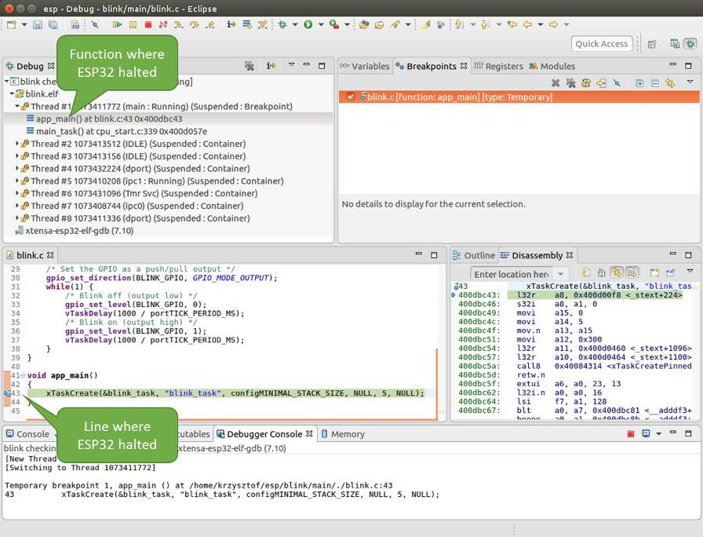

    调试时目标停止

暂停的程序所在线程也会被展开，显示函数调用的堆栈，它表示直到目标暂停所在代码行（下图高亮处）为止的相关函数的调用关系。1 号线程下函数调用堆栈的第一行包含了最后一个调用的函数 ``app_main()``，根据下一行显示，它又是在函数 ``main_task()`` 中被调用的。堆栈的每一行还包含调用函数的文件名和行号。通过单击每个堆栈的条目，在下面的窗口中，你将看到此文件的内容。

通过展开线程，你可以浏览整个应用程序。展开 5 号线程，它包含了更长的函数调用堆栈，你可以看到函数调用旁边的数字，比如 ``0x4000000c``，它们代表未以源码形式提供的二进制代码所在的内存地址。

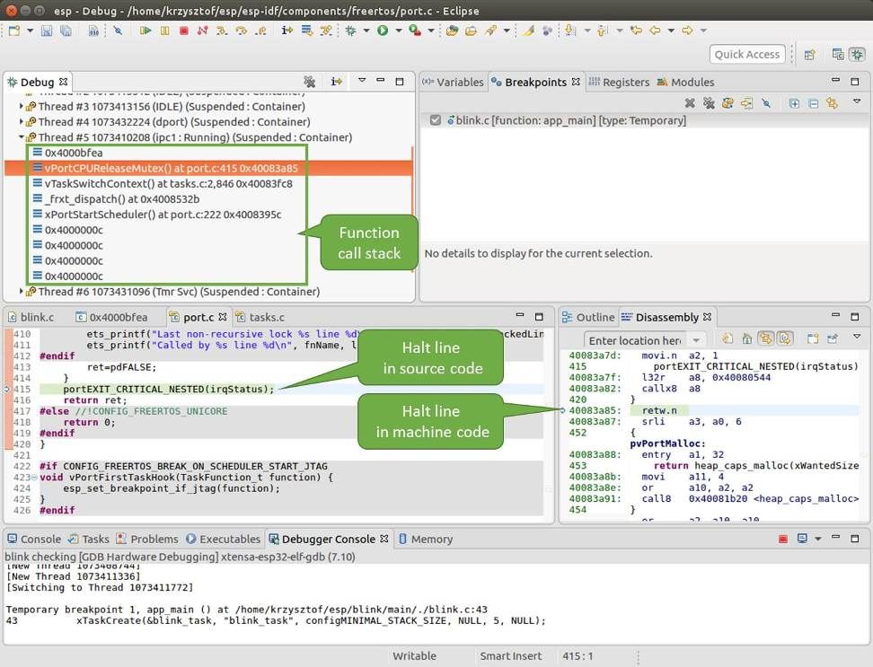

    浏览函数调用堆栈

无论项目是以源代码还是仅以二进制形式提供，在右边一个窗口中，都可以看到反汇编后的机器代码。

回到 1 号线程中的 ``app_main()`` 函数所在的 ``blink.c`` 源码文件，下面的示例将会以该文件为例介绍调试的常用功能。调试器可以轻松浏览整个应用程序的代码，这给单步调试代码和设置断点带来了很大的便利，下面将一一展开讨论。

.. _jtag-debugging-examples-eclipse-02:

设置和清除断点
^^^^^^^^^^^^^^

在调试时，我们希望能够在关键的代码行停止应用程序，然后检查特定的变量、内存、寄存器和外设的状态。为此我们需要使用断点，以便在特定某行代码处快速访问和停止应用程序。

我们在控制 LED 状态发生变化的两处代码行分别设置一个断点。基于以上代码列表，这两处分别为第 33 和 36 代码行。按住键盘上的 “Control” 键，双击 blink.c 文件中的行号 33，并在弹出的对话框中点击 “OK” 按钮进行确定。如果你不想看到此对话框，双击行号即可。执行同样操作，在第 36 行设置另外一个断点。

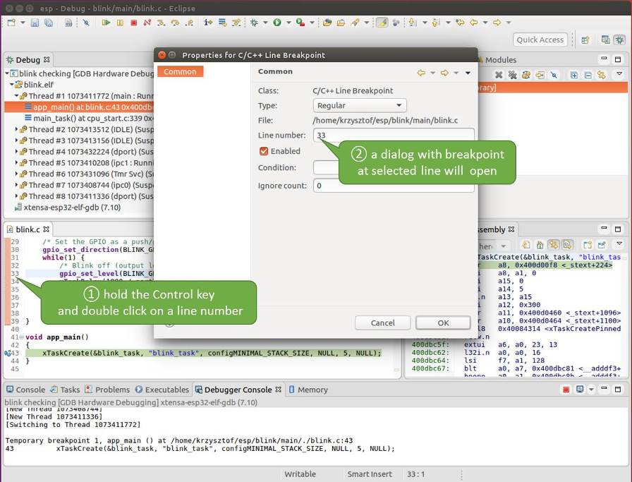

    设置断点

断点的数量和位置信息会显示在右上角的“断点”窗口中。单击 “Show Breakpoints Supported by Selected Target” 图标可以刷新此列表。除了刚才设置的两个断点外，列表中可能还包含在调试器启动时设置在 ``app_main()`` 函数处的临时断点。由于最多只允许设置两个断点（详细信息请参阅 :ref:`jtag-debugging-tip-breakpoints`），你需要将其删除，否则调试会失败。

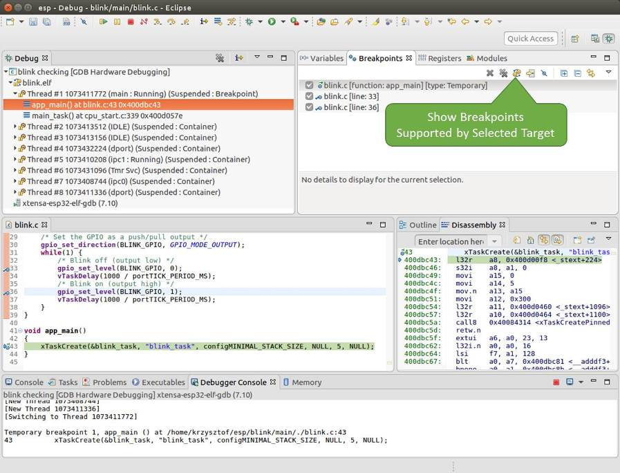

    设置了三个断点 / 最多允许两个断点

单击 “Resume”（如果 “Resume” 按钮是灰色的，请先单击 8 号线程的 ``blink_task()`` 函数）后处理器将开始继续运行，并在断点处停止。再一次单击 “Resume” 按钮，使程序再次运行，然后停在第二个断点处，依次类推。

每次单击 “Resume” 按钮恢复程序运行后，都会看到 LED 切换状态。

更多关于断点的信息，请参阅 :ref:`jtag-debugging-tip-breakpoints` 和 :ref:`jtag-debugging-tip-where-breakpoints`。

.. _jtag-debugging-examples-eclipse-03:

手动暂停目标
^^^^^^^^^^^^

在调试时，你可以恢复程序运行并输入代码等待某个事件发生或者保持无限循环而不设置任何断点。后者，如果想要返回调试模式，可以通过单击 “Suspend” 按钮来手动中断程序的运行。

在此之前，请删除所有的断点，然后单击 “Resume” 按钮。接着单击 “Suspend” 按钮，应用程序会停止在某个随机的位置，此时 LED 也将停止闪烁。调试器将展开线程并高亮显示停止的代码行。

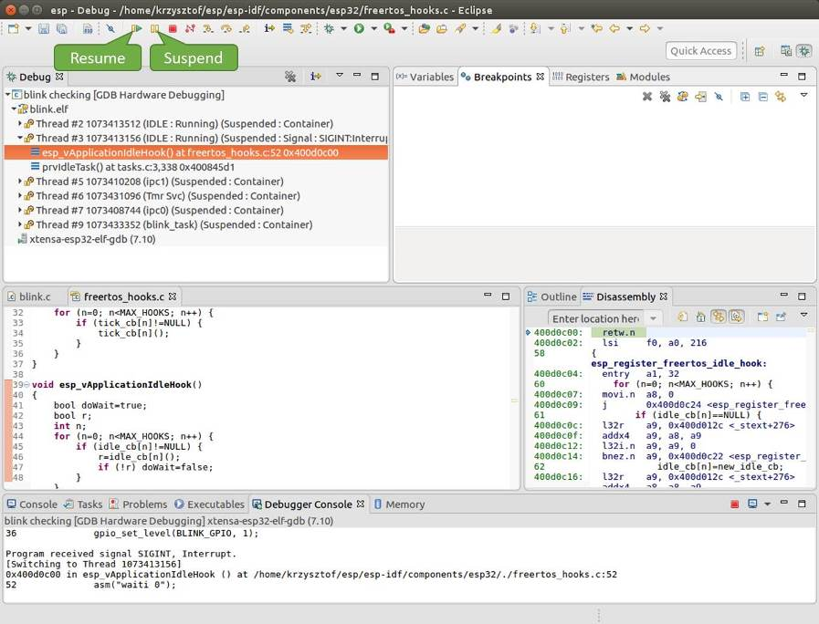

    手动暂停目标

在上图所示的情况中，应用程序已经在 ``freertos_hooks.c`` 文件的第 52 行暂停运行，现在你可以通过单击 “Resume” 按钮再次将其恢复运行或者进行下面要介绍的调试工作。

.. _jtag-debugging-examples-eclipse-04:

单步执行代码
^^^^^^^^^^^^

我们还可以使用 “Step Into (F5)” 和 “Step Over (F6)” 命令单步执行代码， 这两者之间的区别是执行 “Step Into (F5)” 命令会进入调用的子程序，而执行 “Step Over (F6)” 命令则会直接将子程序看成单个源码行，单步就能将其运行结束。

在继续演示此功能之前，请参照上文所述确保目前只在 ``blink.c`` 文件的第 36 行设置了一个断点。

按下 F8 键让程序继续运行然后在断点处停止运行，多次按下 “Step Over (F6)” 按钮，观察调试器是如何单步执行一行代码的。

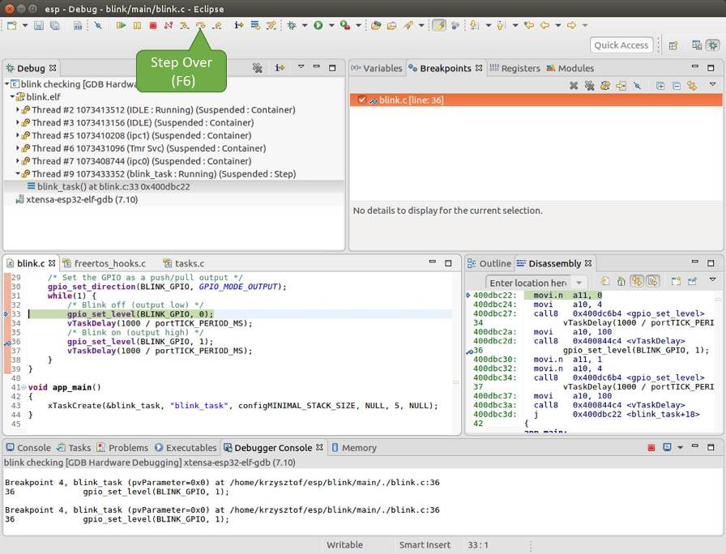

    使用 “Step Over (F6)” 单步执行代码

如果你改用 "Step Into (F5)"，那么调试器将会进入调用的子程序内部。

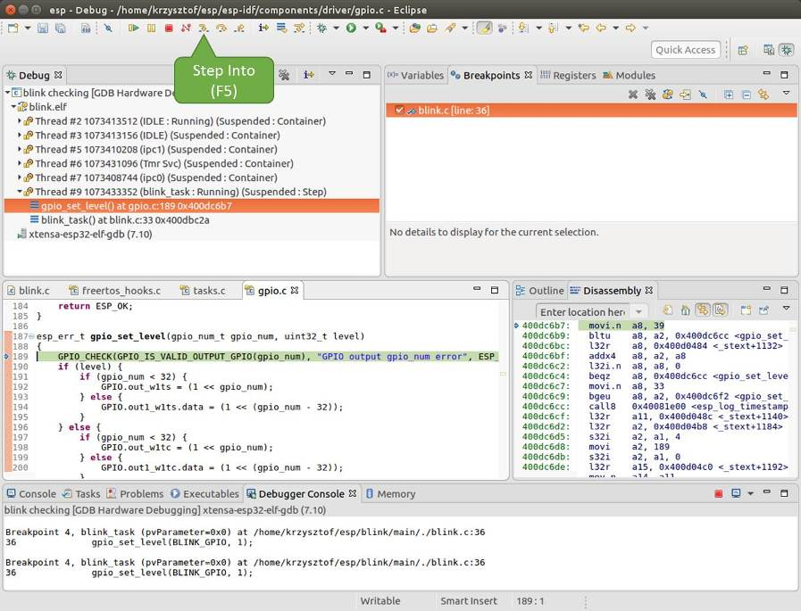

    使用 “Step Into (F5)” 单步执行代码

在上述例子中，调试器进入 ``gpio_set_level(BLINK_GPIO, 0)`` 代码内部，同时代码窗口快速切换到 ``gpio.c`` 驱动文件。

请参阅 :ref:`jtag-debugging-tip-why-next-works-as-step` 文档以了解 ``next`` 命令的潜在局限。

.. _jtag-debugging-examples-eclipse-05:

查看并设置内存
^^^^^^^^^^^^^^

要显示或者设置内存的内容，请使用“调试”视图中位于底部的 “Memory” 选项卡。

在 “Memory” 选项卡下，我们将在内存地址 ``0x3FF44004`` 处读取和写入内容。该地址也是 ``GPIO_OUT_REG`` 寄存器的地址，可以用来控制（设置或者清除）某个 GPIO 的电平。

关于该寄存器的更多详细信息，请参阅 *{IDF_TARGET_NAME} 技术参考手册* > *IO MUX 和 GPIO Matrix (GPIO, IO_MUX)* [`PDF <{IDF_TARGET_TRM_EN_URL}#iomuxgpio>`__] 章节。

同样在 ``blink.c`` 项目文件中，在两个 ``gpio_set_level`` 语句的后面各设置一个断点，单击 “Memory” 选项卡，然后单击 “Add Memory Monitor” 按钮，在弹出的对话框中输入 ``0x3FF44004``。

按下 F8 按键恢复程序运行，并观察 “Monitor” 选项卡。

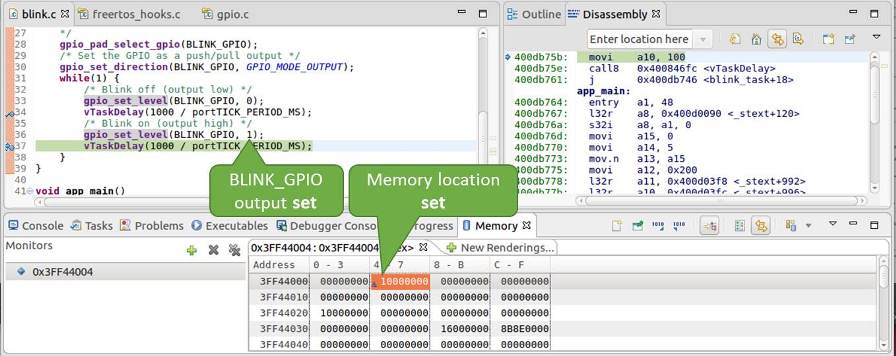

    观察内存地址 0x3FF44004 处的某个比特被置高

每按一下 F8，你就会看到在内存 ``0x3FF44004`` 地址处的一个比特位被翻转（并且 LED 会改变状态）。

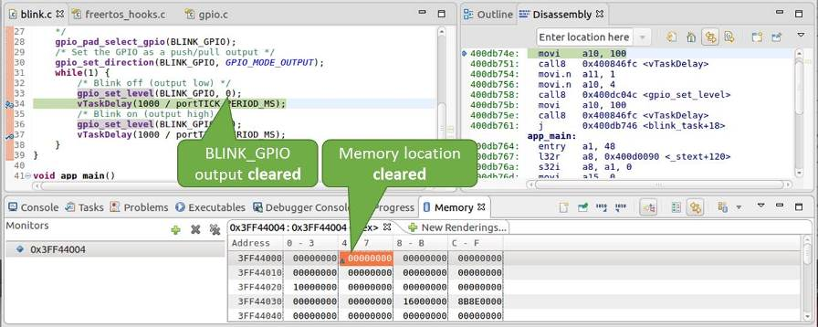

    观察内存地址 0x3FF44004 处的某个比特被置低

要修改内存的数值，请在 “Monitor” 选项卡中找到待修改的内存地址，如前面观察的结果一样，输入特定比特翻转后的值。当按下回车键后，将立即看到 LED 的状态发生了改变。

.. _jtag-debugging-examples-eclipse-06:

观察和设置程序变量
^^^^^^^^^^^^^^^^^^

常见的调试任务是在程序运行期间检查程序中某个变量的值，为了演示这个功能，更新 ``blink.c`` 文件，在 ``blink_task`` 函数的上面添加一个全局变量的声明 ``int i``，然后在 ``while(1)`` 里添加 ``i++``，这样每次 LED 改变状态的时候，变量 ``i`` 都会增加 1。

退出调试器，这样就不会与新代码混淆，然后重新构建并烧写代码到 {IDF_TARGET_NAME} 中，接着重启调试器。注意，这里不需要我们重启 OpenOCD。

一旦程序停止运行，在代码 ``i++`` 处添加一个断点。

下一步，在 “Breakpoints” 所在的窗口中，选择 “Expressions” 选项卡。如果该选项卡不存在，请在顶部菜单栏的 Window > Show View > Expressions 中添加这一选项卡。然后在该选项卡中单击 “Add new expression”，并输入 ``i``。

按下 F8 继续运行程序，每次程序停止时，都会看到变量 ``i`` 的值在递增。

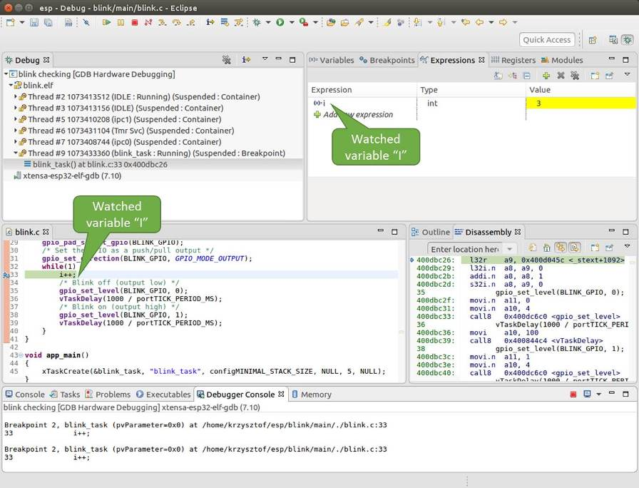

    观察程序变量 “i”

如想更改 ``i`` 的值，可以在 “Value” 一栏中输入新的数值。按下 “Resume (F8)” 后，程序将从新输入的数字开始递增 ``i``。

.. _jtag-debugging-examples-eclipse-07:

设置条件断点
^^^^^^^^^^^^

接下来的内容更为有趣，你可能想在一定条件满足的情况下设置断点，然后让程序停止运行。右击断点打开上下文菜单，选择 “Breakpoint Properties”，将 “Type:” 改选为 “Hardware” 然后在 “Condition:” 一栏中输入条件表达式，例如 ``i == 2``。

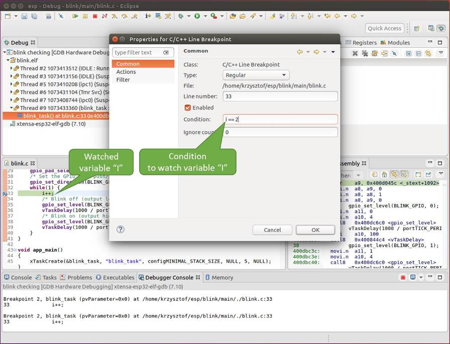

    设置条件断点

如果当前 ``i`` 的值小于 ``2`` （如果有需要也可以更改这个阈值）并且程序被恢复运行，那么 LED 就会循环闪烁，直到 ``i == 2`` 条件成立，最后程序停止在该处。

.. _jtag-debugging-examples-command-line:

使用命令行的调试示例
--------------------

请检查你的目标板是否已经准备好，并加载了 :example:`get-started/blink` 示例代码，然后按照 :ref:`jtag-debugging-using-debugger-command-line` 中介绍的步骤配置和启动调试器，最后选择让应用程序在 ``app_main()`` 建立的断点处停止运行 ::

    Temporary breakpoint 1, app_main () at /home/user-name/esp/blink/main/./blink.c:43
    43      xTaskCreate(&blink_task, "blink_task", configMINIMAL_STACK_SIZE, NULL, 5, NULL);
    (gdb)

本小节的示例
^^^^^^^^^^^^

1. :ref:`jtag-debugging-examples-command-line-01`
2. :ref:`jtag-debugging-examples-command-line-02`
3. :ref:`jtag-debugging-examples-command-line-03`
4. :ref:`jtag-debugging-examples-command-line-04`
5. :ref:`jtag-debugging-examples-command-line-05`
6. :ref:`jtag-debugging-examples-command-line-06`
7. :ref:`jtag-debugging-examples-command-line-07`
8. :ref:`jtag-debugging-examples-command-line-08`

.. _jtag-debugging-examples-command-line-01:

浏览代码，查看堆栈和线程
^^^^^^^^^^^^^^^^^^^^^^^^

当看到 ``(gdb)`` 提示符的时候，应用程序已停止运行，LED 也停止闪烁。

要找到代码暂停的位置，输入 ``l`` 或者 ``list`` 命令，调试器会打印出暂停点（``blink.c`` 代码文件的第 43 行）附近的几行代码 ::

    (gdb) l
    38      }
    39  }
    40
    41  void app_main()
    42  {
    43      xTaskCreate(&blink_task, "blink_task", configMINIMAL_STACK_SIZE, NULL, 5, NULL);
    44  }
    (gdb)

也可以通过输入 ``l 30, 40`` 等命令来查看特定行号范围内的代码。

使用 ``bt`` 或者 ``backtrace`` 来查看哪些函数最终导致了此代码被调用::

    (gdb) bt
    #0  app_main () at /home/user-name/esp/blink/main/./blink.c:43
    #1  0x400d057e in main_task (args=0x0) at /home/user-name/esp/esp-idf/components/{IDF_TARGET_PATH_NAME}/./cpu_start.c:339
    (gdb)

输出的第 0 行表示应用程序暂停之前调用的最后一个函数，即我们之前列出的 ``app_main ()``。``app_main ()`` 又被位于 ``cpu_start.c`` 文件第 339 行的 ``main_task`` 函数调用。

想查看 ``cpu_start.c`` 文件中 ``main_task`` 函数的上下文，需要输入 ``frame  N``，其中 N = 1，因为根据前面的输出，``main_task`` 位于 #1 下::

    (gdb) frame 1
    #1  0x400d057e in main_task (args=0x0) at /home/user-name/esp/esp-idf/components/{IDF_TARGET_PATH_NAME}/./cpu_start.c:339
    339     app_main();
    (gdb)

输入 ``l`` 将显示一段名为 ``app_main()`` 的代码（在第 339 行）::

    (gdb) l
    334         ;
    335     }
    336 #endif
    337     //Enable allocation in region where the startup stacks were located.
    338     heap_caps_enable_nonos_stack_heaps();
    339     app_main();
    340     vTaskDelete(NULL);
    341 }
    342
    (gdb)

通过打印前面的一些行，你会看到我们一直在寻找的 ``main_task`` 函数::

    (gdb) l 326, 341
    326 static void main_task(void* args)
    327 {
    328     // Now that the application is about to start, disable boot watchdogs
    329     REG_CLR_BIT(TIMG_WDTCONFIG0_REG(0), TIMG_WDT_FLASHBOOT_MOD_EN_S);
    330     REG_CLR_BIT(RTC_CNTL_WDTCONFIG0_REG, RTC_CNTL_WDT_FLASHBOOT_MOD_EN);
    331 #if !CONFIG_FREERTOS_UNICORE
    332     // Wait for FreeRTOS initialization to finish on APP CPU, before replacing its startup stack
    333     while (port_xSchedulerRunning[1] == 0) {
    334         ;
    335     }
    336 #endif
    337     //Enable allocation in region where the startup stacks were located.
    338     heap_caps_enable_nonos_stack_heaps();
    339     app_main();
    340     vTaskDelete(NULL);
    341 }
    (gdb)

如果要查看其他代码，可以输入 ``i threads`` 命令，则会输出目标板上运行的线程列表::

    (gdb) i threads
      Id   Target Id         Frame
      8    Thread 1073411336 (dport) 0x400d0848 in dport_access_init_core (arg=<optimized out>)
        at /home/user-name/esp/esp-idf/components/{IDF_TARGET_PATH_NAME}/./dport_access.c:170
      7    Thread 1073408744 (ipc0) xQueueGenericReceive (xQueue=0x3ffae694, pvBuffer=0x0, xTicksToWait=1644638200,
        xJustPeeking=0) at /home/user-name/esp/esp-idf/components/freertos/./queue.c:1452
      6    Thread 1073431096 (Tmr Svc) prvTimerTask (pvParameters=0x0)
        at /home/user-name/esp/esp-idf/components/freertos/./timers.c:445
      5    Thread 1073410208 (ipc1 : Running) 0x4000bfea in ?? ()
      4    Thread 1073432224 (dport) dport_access_init_core (arg=0x0)
        at /home/user-name/esp/esp-idf/components/{IDF_TARGET_PATH_NAME}/./dport_access.c:150
      3    Thread 1073413156 (IDLE) prvIdleTask (pvParameters=0x0)
        at /home/user-name/esp/esp-idf/components/freertos/./tasks.c:3282
      2    Thread 1073413512 (IDLE) prvIdleTask (pvParameters=0x0)
        at /home/user-name/esp/esp-idf/components/freertos/./tasks.c:3282
    * 1    Thread 1073411772 (main : Running) app_main () at /home/user-name/esp/blink/main/./blink.c:43
    (gdb)

线程列表显示了每个线程最后一个被调用的函数以及所在的 C 源文件名（如果存在的话）。

你可以通过输入 ``thread N`` 进入特定的线程，其中 ``N`` 是线程 ID。我们进入 5 号线程来看一下它是如何工作的::

    (gdb) thread 5
    [Switching to thread 5 (Thread 1073410208)]
    #0  0x4000bfea in ?? ()
    (gdb)

然后查看回溯::

    (gdb) bt
    #0  0x4000bfea in ?? ()
    #1  0x40083a85 in vPortCPUReleaseMutex (mux=<optimized out>) at /home/user-name/esp/esp-idf/components/freertos/./port.c:415
    #2  0x40083fc8 in vTaskSwitchContext () at /home/user-name/esp/esp-idf/components/freertos/./tasks.c:2846
    #3  0x4008532b in _frxt_dispatch ()
    #4  0x4008395c in xPortStartScheduler () at /home/user-name/esp/esp-idf/components/freertos/./port.c:222
    #5  0x4000000c in ?? ()
    #6  0x4000000c in ?? ()
    #7  0x4000000c in ?? ()
    #8  0x4000000c in ?? ()
    (gdb)

如上所示，回溯可能会包含多个条目，方便查看直至目标停止运行的函数调用顺序。如果找不到某个函数的源码文件，将会使用问号 ``??`` 替代，这表示该函数是以二进制格式提供的。像 ``0x4000bfea`` 这样的值是被调用函数所在的内存地址。

使用诸如 ``bt``， ``i threads``， ``thread N`` 和 ``list`` 命令可以浏览整个应用程序的代码。这给单步调试代码和设置断点带来很大的便利，下面将一一展开来讨论。

.. _jtag-debugging-examples-command-line-02:

设置和清除断点
^^^^^^^^^^^^^^

在调试时，我们希望能够在关键的代码行停止应用程序，然后检查特定的变量、内存、寄存器和外设的状态。为此我们需要使用断点，以便在特定某行代码处快速访问和停止应用程序。

我们在控制 LED 状态发生变化的两处代码行分别设置一个断点。基于以上代码列表，这两处分别为第 33 和 36 代码行。使用命令 ``break M`` 设置断点，其中 M 是具体的代码行::

    (gdb) break 33
    Breakpoint 2 at 0x400db6f6: file /home/user-name/esp/blink/main/./blink.c, line 33.
    (gdb) break 36
    Breakpoint 3 at 0x400db704: file /home/user-name/esp/blink/main/./blink.c, line 36.

输入命令 ``c``，处理器将运行并在断点处停止。再次输入 ``c`` 将使其再次运行，并在第二个断点处停止，依此类推::

    (gdb) c
    Continuing.
    Target halted. PRO_CPU: PC=0x400DB6F6 (active)    APP_CPU: PC=0x400D10D8

    Breakpoint 2, blink_task (pvParameter=0x0) at /home/user-name/esp/blink/main/./blink.c:33
    33          gpio_set_level(BLINK_GPIO, 0);
    (gdb) c
    Continuing.
    Target halted. PRO_CPU: PC=0x400DB6F8 (active)    APP_CPU: PC=0x400D10D8
    Target halted. PRO_CPU: PC=0x400DB704 (active)    APP_CPU: PC=0x400D10D8

    Breakpoint 3, blink_task (pvParameter=0x0) at /home/user-name/esp/blink/main/./blink.c:36
    36          gpio_set_level(BLINK_GPIO, 1);
    (gdb)

只有在输入命令 ``c`` 恢复程序运行后才能看到 LED 改变状态。

查看已设置断点的数量和位置，请使用命令 ``info break``::

    (gdb) info break
    Num     Type           Disp Enb Address    What
    2       breakpoint     keep y   0x400db6f6 in blink_task at /home/user-name/esp/blink/main/./blink.c:33
        breakpoint already hit 1 time
    3       breakpoint     keep y   0x400db704 in blink_task at /home/user-name/esp/blink/main/./blink.c:36
        breakpoint already hit 1 time
    (gdb)

请注意，断点序号（在 ``Num`` 栏列出）从 2 开始，这是因为在调试器启动时执行 ``thb app_main`` 命令已经在 ``app_main()`` 函数处建立了第一个断点。由于它是一个临时断点，已经被自动删除，所以没有被列出。

要删除一个断点，请输入 ``delete N`` 命令（或者简写成 ``d N``），其中 ``N`` 代表断点序号::

    (gdb) delete 1
    No breakpoint number 1.
    (gdb) delete 2
    (gdb)

更多关于断点的信息，请参阅 :ref:`jtag-debugging-tip-breakpoints` 和 :ref:`jtag-debugging-tip-where-breakpoints`。

.. _jtag-debugging-examples-command-line-03:

暂停和恢复应用程序的运行
^^^^^^^^^^^^^^^^^^^^^^^^

在调试时，可以恢复程序运行并输入代码等待某个事件发生或者保持无限循环而不设置任何断点。对于后者，想要返回调试模式，可以通过输入 Ctrl+C 手动中断程序的运行。

在此之前，请删除所有的断点，然后输入 ``c`` 恢复程序运行。接着输入 Ctrl+C，应用程序会停止在某个随机的位置，此时 LED 也将停止闪烁。调试器会打印如下信息::

    (gdb) c
    Continuing.
    ^CTarget halted. PRO_CPU: PC=0x400D0C00             APP_CPU: PC=0x400D0C00 (active)
    [New Thread 1073433352]

    Program received signal SIGINT, Interrupt.
    [Switching to Thread 1073413512]
    0x400d0c00 in esp_vApplicationIdleHook () at /home/user-name/esp/esp-idf/components/{IDF_TARGET_PATH_NAME}/./freertos_hooks.c:52
    52          asm("waiti 0");
    (gdb)

在上图所示的情况下，应用程序已经在 ``freertos_hooks.c`` 文件的第 52 行暂停运行，现在你可以通过输入 ``c`` 再次将其恢复运行或者进行如下所述的一些调试工作。

.. _jtag-debugging-examples-command-line-04:

单步执行代码
^^^^^^^^^^^^

我们还可以使用 ``step`` 和 ``next`` 命令（可以简写成 ``s`` 和 ``n``）单步执行代码， 这两者之间的区别是执行 “step” 命令会进入调用的子程序内部，而执行 “next” 命令则会直接将子程序看成单个源码行，单步就能将其运行结束。

在继续演示此功能之前，请使用前面介绍的 ``break`` 和 ``delete`` 命令，确保目前只在 ``blink.c`` 文件的第 36 行设置了一个断点::

    (gdb) info break
    Num     Type           Disp Enb Address    What
    3       breakpoint     keep y   0x400db704 in blink_task at /home/user-name/esp/blink/main/./blink.c:36
        breakpoint already hit 1 time
    (gdb)

输入 ``c`` 恢复程序运行然后等它在断点处停止运行::

    (gdb) c
    Continuing.
    Target halted. PRO_CPU: PC=0x400DB754 (active)    APP_CPU: PC=0x400D1128

    Breakpoint 3, blink_task (pvParameter=0x0) at /home/user-name/esp/blink/main/./blink.c:36
    36          gpio_set_level(BLINK_GPIO, 1);
    (gdb)

然后输入 ``n`` 多次，观察调试器是如何单步执行一行代码的::

    (gdb) n
    Target halted. PRO_CPU: PC=0x400DB756 (active)    APP_CPU: PC=0x400D1128
    Target halted. PRO_CPU: PC=0x400DB758 (active)    APP_CPU: PC=0x400D1128
    Target halted. PRO_CPU: PC=0x400DC04C (active)    APP_CPU: PC=0x400D1128
    Target halted. PRO_CPU: PC=0x400DB75B (active)    APP_CPU: PC=0x400D1128
    37          vTaskDelay(1000 / portTICK_PERIOD_MS);
    (gdb) n
    Target halted. PRO_CPU: PC=0x400DB75E (active)    APP_CPU: PC=0x400D1128
    Target halted. PRO_CPU: PC=0x400846FC (active)    APP_CPU: PC=0x400D1128
    Target halted. PRO_CPU: PC=0x400DB761 (active)    APP_CPU: PC=0x400D1128
    Target halted. PRO_CPU: PC=0x400DB746 (active)    APP_CPU: PC=0x400D1128
    33          gpio_set_level(BLINK_GPIO, 0);
    (gdb)

如果你输入 ``s``，那么调试器将进入子程序::

    (gdb) s
    Target halted. PRO_CPU: PC=0x400DB748 (active)    APP_CPU: PC=0x400D1128
    Target halted. PRO_CPU: PC=0x400DB74B (active)    APP_CPU: PC=0x400D1128
    Target halted. PRO_CPU: PC=0x400DC04C (active)    APP_CPU: PC=0x400D1128
    Target halted. PRO_CPU: PC=0x400DC04F (active)    APP_CPU: PC=0x400D1128
    gpio_set_level (gpio_num=GPIO_NUM_4, level=0) at /home/user-name/esp/esp-idf/components/esp_driver_gpio/src/gpio.c:183
    183     GPIO_CHECK(GPIO_IS_VALID_OUTPUT_GPIO(gpio_num), "GPIO output gpio_num error", ESP_ERR_INVALID_ARG);
    (gdb)

上述例子中，调试器进入 ``gpio_set_level(BLINK_GPIO, 0)`` 代码内部，同时代码窗口快速切换到 ``gpio.c`` 驱动文件。

请参阅 :ref:`jtag-debugging-tip-why-next-works-as-step` 文档以了解 ``next`` 命令的潜在局限。

.. _jtag-debugging-examples-command-line-05:

查看并设置内存
^^^^^^^^^^^^^^

使用命令 ``x`` 可以显示内存的内容，配合其余参数还可以调整所显示内存位置的格式和数量。运行 ``help x`` 可以查看更多相关细节。与 ``x`` 命令配合使用的命令是 ``set``，它允许你将值写入内存。

为了演示 ``x`` 和 ``set`` 的使用，我们将在内存地址 ``0x3FF44004`` 处读取和写入内容。该地址也是 ``GPIO_OUT_REG`` 寄存器的地址，可以用来控制（设置或者清除）某个 GPIO 的电平。

关于该寄存器的更多详细信息，请参阅 *{IDF_TARGET_NAME} 技术参考手册* > *IO MUX 和 GPIO Matrix (GPIO, IO_MUX)* [`PDF <{IDF_TARGET_TRM_EN_URL}#iomuxgpio>`__] 章节。

同样在 ``blink.c`` 项目文件中，在两个 ``gpio_set_level`` 语句的后面各设置一个断点。输入两次 ``c`` 命令后停止在断点处，然后输入 ``x /1wx 0x3FF44004`` 来显示 ``GPIO_OUT_REG`` 寄存器的值::

    (gdb) c
    Continuing.
    Target halted. PRO_CPU: PC=0x400DB75E (active)    APP_CPU: PC=0x400D1128
    Target halted. PRO_CPU: PC=0x400DB74E (active)    APP_CPU: PC=0x400D1128

    Breakpoint 2, blink_task (pvParameter=0x0) at /home/user-name/esp/blink/main/./blink.c:34
    34          vTaskDelay(1000 / portTICK_PERIOD_MS);
    (gdb) x /1wx 0x3FF44004
    0x3ff44004: 0x00000000
    (gdb) c
    Continuing.
    Target halted. PRO_CPU: PC=0x400DB751 (active)    APP_CPU: PC=0x400D1128
    Target halted. PRO_CPU: PC=0x400DB75B (active)    APP_CPU: PC=0x400D1128

    Breakpoint 3, blink_task (pvParameter=0x0) at /home/user-name/esp/blink/main/./blink.c:37
    37          vTaskDelay(1000 / portTICK_PERIOD_MS);
    (gdb) x /1wx 0x3FF44004
    0x3ff44004: 0x00000010
    (gdb)

如果闪烁的 LED 连接到了 GPIO4，那么每次 LED 改变状态时你会看到第 4 比特被翻转::

    0x3ff44004: 0x00000000
    ...
    0x3ff44004: 0x00000010

现在，当 LED 熄灭时，与之对应地会显示 ``0x3ff44004: 0x00000000``，尝试使用 ``set`` 命令向相同的内存地址写入 ``0x00000010`` 来将该比特置高::

    (gdb) x /1wx 0x3FF44004
    0x3ff44004: 0x00000000
    (gdb) set {unsigned int}0x3FF44004=0x000010

在输入 ``set {unsigned int}0x3FF44004=0x000010`` 命令后，你会立即看到 LED 亮起。

.. _jtag-debugging-examples-command-line-06:

观察和设置程序变量
^^^^^^^^^^^^^^^^^^

常见的调试任务是在程序运行期间检查程序中某个变量的值，为了能够演示这个功能，更新 ``blink.c`` 文件，在 ``blink_task`` 函数的上面添加一个全局变量的声明 ``int i``，然后在 ``while(1)`` 里添加 ``i++``，这样每次 LED 改变状态的时候，变量 ``i`` 都会增加 1。

退出调试器，这样就不会与新代码混淆，然后重新构建并烧写代码到 {IDF_TARGET_NAME} 中，接着重启调试器。注意，这里不需要我们重启 OpenOCD。

一旦程序停止运行，输入命令 ``watch i``::

    (gdb) watch i
    Hardware watchpoint 2: i
    (gdb)

这会在所有变量 ``i`` 发生改变的代码处插入所谓的“观察点”。现在输入 ``continue`` 命令来恢复应用程序的运行并观察它停止::

    (gdb) c
    Continuing.
    Target halted. PRO_CPU: PC=0x400DB751 (active)    APP_CPU: PC=0x400D0811
    [New Thread 1073432196]

    Program received signal SIGTRAP, Trace/breakpoint trap.
    [Switching to Thread 1073432196]
    0x400db751 in blink_task (pvParameter=0x0) at /home/user-name/esp/blink/main/./blink.c:33
    33          i++;
    (gdb)

多次恢复程序运行后，变量 ``i`` 的值会增加，现在你可以输入 ``print i`` （简写 ``p i``）来查看当前 ``i`` 的值::

    (gdb) p i
    $1 = 3
    (gdb)

要修改 ``i`` 的值，请使用 ``set`` 命令，如下所示（可以将其打印输出来查看是否确已修改）::

    (gdb) set var i = 0
    (gdb) p i
    $3 = 0
    (gdb)

最多可以使用两个观察点，详细信息请参阅 :ref:`jtag-debugging-tip-breakpoints`。

.. _jtag-debugging-examples-command-line-07:

设置条件断点
^^^^^^^^^^^^

接下来的内容更为有趣，你可能想在一定条件满足的情况下设置断点。请先删除已有的断点，然后尝试如下命令::

    (gdb) break blink.c:34 if (i == 2)
    Breakpoint 3 at 0x400db753: file /home/user-name/esp/blink/main/./blink.c, line 34.
    (gdb)

以上命令在 ``blink.c`` 文件的 ``34`` 处设置了一个条件断点，当 ``i == 2`` 条件满足时，程序会停止运行。

如果当前 ``i`` 的值小于 ``2`` 并且程序被恢复运行，那么 LED 就会循环闪烁，直到 ``i == 2`` 条件成立，最后程序停止在该处::

    (gdb) set var i = 0
    (gdb) c
    Continuing.
    Target halted. PRO_CPU: PC=0x400DB755 (active)    APP_CPU: PC=0x400D112C
    Target halted. PRO_CPU: PC=0x400DB753 (active)    APP_CPU: PC=0x400D112C
    Target halted. PRO_CPU: PC=0x400DB755 (active)    APP_CPU: PC=0x400D112C
    Target halted. PRO_CPU: PC=0x400DB753 (active)    APP_CPU: PC=0x400D112C

    Breakpoint 3, blink_task (pvParameter=0x0) at /home/user-name/esp/blink/main/./blink.c:34
    34          gpio_set_level(BLINK_GPIO, 0);
    (gdb)

.. _jtag-debugging-examples-command-line-08:

调试 FreeRTOS 对象
^^^^^^^^^^^^^^^^^^

该部分内容或许可以帮助你调试 FreeRTOS 任务交互。

需要调试 FreeRTOS 任务交互的用户可使用 GDB 命令 ``freertos``。该命令并非 GDB 原生命令，而是来自于 Python 扩展模块 `freertos-gdb <https://pypi.org/project/freertos-gdb>`_，其包含一系列子命令::

    (gdb) freertos
    "freertos" 后面必须紧随子命令的名称
    freertos 子命令如下：

    freertos queue --  打印当前队列信息
    freertos semaphore --  打印当前信号量信息
    freertos task --  打印当前任务及其状态
    freertos timer --  打印当前定时器信息

点击 https://pypi.org/project/freertos-gdb 链接了解此扩展模块的详细信息。

.. note::

    ESP-IDF 在安装 Pyhton 包时会自动安装 freertos-gdb Python 模块，详情请参考 :ref:`get-started-set-up-tools`。

    如果使用 ``idf.py gdb`` 命令运行 GDB，FreeRTOS 扩展会自动加载。也可以使用 GDB 内部命令 ``python import freertos_gdb`` 使能该模块。

    请保证使用 Python 3.6 及以上版本，该版本具有 Python 共享库。

获得命令的帮助信息
^^^^^^^^^^^^^^^^^^

目前所介绍的都是些非常基础的命令，目的在于让你快速上手 JTAG 调试。如果想获得特定命令的语法和功能相关的信息，请在 ``(gdb)`` 提示符下输入 ``help`` 和命令名::

    (gdb) help next
    Step program, proceeding through subroutine calls.
    Usage: next [N]
    Unlike "step", if the current source line calls a subroutine,
    this command does not enter the subroutine, but instead steps over
    the call, in effect treating it as a single source line.
    (gdb)

只需输入 ``help`` 命令，即可获得高级命令列表，帮助你了解更多详细信息。此外，还可以参考一些 GDB 命令速查表，比如 https://darkdust.net/files/GDB%20Cheat%20Sheet.pdf。虽然不是所有命令都适用于嵌入式环境，但还是会有所裨益。

结束调试会话
^^^^^^^^^^^^

输入命令 ``q`` 可以退出调试器::

    (gdb) q
    A debugging session is active.

        Inferior 1 [Remote target] will be detached.

    Quit anyway? (y or n) y
    Detaching from program: /home/user-name/esp/blink/build/blink.elf, Remote target
    Ending remote debugging.
    user-name@computer-name:~/esp/blink$
