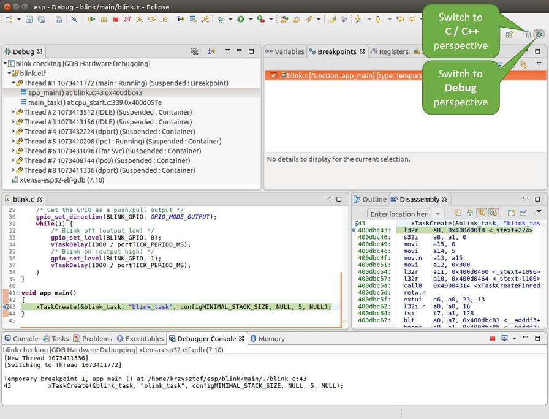

使用调试器
----------

:link_to_translation:`en:[English]`

本节介绍以下几种配置和运行调试器的方法：

* :ref:`jtag-debugging-using-debugger-eclipse`
* :ref:`jtag-debugging-using-debugger-command-line`
* :ref:`jtag-debugging-with-idf-py`

关于如何使用 VS Code 进行调试，请参阅文档 `使用 VS Code 调试 <https://github.com/espressif/vscode-esp-idf-extension/blob/master/docs/DEBUGGING.md>`__。

.. _jtag-debugging-using-debugger-eclipse:

使用 Eclipse 调试
^^^^^^^^^^^^^^^^^^^^^^^

.. note::

    建议首先通过 :ref:`idf.py <jtag-debugging-with-idf-py>` 或 :ref:`命令行 <jtag-debugging-using-debugger-command-line>` 检查调试器是否正常工作，然后再转到使用 :ref:`Eclipse <jtag-debugging-using-debugger-eclipse>` 平台。

作为一款集成开发环境 (IDE)，Eclipse 提供了一套强大的工具，用于开发和调试软件应用程序。对于 ESP-IDF 应用程序，`IDF Eclipse 插件 <https://github.com/espressif/idf-eclipse-plugin>`_ 提供了两种调试方式:

1. `ESP-IDF GDB OpenOCD 调试 <https://github.com/espressif/idf-eclipse-plugin/blob/master/docs/OpenOCD%20Debugging.md#esp-idf-gdb-openocd-debugging>`_
2. GDB 硬件调试

默认情况下，Eclipse 通过 GDB 硬件调试插件支持 OpenOCD 调试。该调试方式需要从命令行启动 OpenOCD 服务器，并在 Eclipse 中配置 GDB 客户端，整个过程耗时且容易出错。

为了使调试过程更加容易，`IDF Eclipse 插件 <https://github.com/espressif/idf-eclipse-plugin>`_ 提供了定制的 ESP-IDF GDB OpenOCD 调试功能，支持在 Eclipse 内部配置好 OpenOCD 服务器和 GDB 客户端。该插件已经设置好所有必需的配置参数，点击一个按钮即可开始调试。

因此，建议通过 `IDF Eclipse 插件 <https://github.com/espressif/idf-eclipse-plugin>`_ 进行 `ESP-IDF GDB OpenOCD 调试 <https://github.com/espressif/idf-eclipse-plugin/blob/master/docs/OpenOCD%20Debugging.md#esp-idf-gdb-openocd-debugging>`__。

**GDB 硬件调试**

.. note::
    只有在无法使用 `ESP-IDF GDB OpenOCD 调试 <https://github.com/espressif/idf-eclipse-plugin/blob/master/docs/OpenOCD%20Debugging.md#esp-idf-gdb-openocd-debugging>`_ 的情况下，才建议使用 GDB 硬件调试。

首先，打开 Eclipse，选择 ``Help`` > ``Install New Software`` 来安装 ``GDB Hardware Debugging`` 插件。

安装完成后，按照以下步骤配置调试会话。请注意，一些配置参数是通用的，有些则针对特定项目。我们会通过配置 "blink" 示例项目的调试环境来进行展示，请先按照 `Eclipse Plugin <https://github.com/espressif/idf-eclipse-plugin/blob/master/README_CN.md>`_ 介绍的方法将该示例项目添加到 Eclipse 的工作空间。示例项目 :example:`get-started/blink` 的源代码可以在 ESP-IDF 仓库的 :idf:`examples` 目录下找到。

1. 在 Eclipse 中，进入 ``Run`` > ``Debug Configuration``，会出现一个新的窗口。在窗口的左侧窗格中，双击 ``GDB Hardware Debugging`` （或者选择 ``GDB Hardware Debugging`` 然后按下 ``New`` 按钮）来新建一个配置。

2. 在右边显示的表单中，``Name:`` 一栏中输入配置的名称，例如： “Blink checking”。

3. 在下面的 ``Main`` 选项卡中， 点击 ``Project:`` 边上的 ``Browse`` 按钮，然后选择当前的 ``blink`` 项目。

4. 在下一行的 ``C/C++ Application:`` 中，点击 ``Browse`` 按钮，选择 ``blink.elf`` 文件。如果 ``blink.elf`` 文件不存在，那么很有可能该项目还没有编译，请参考 `Eclipse Plugin <https://github.com/espressif/idf-eclipse-plugin/blob/master/README_CN.md>`_ 指南中的介绍。

5. 最后，在 ``Build (if required) before launching`` 下面点击 ``Disable auto build``。

    上述步骤 1 - 5 的示例输入如下图所示。

    .. figure:: ../../../_static/hw-debugging-main-tab.jpg
        :align: center
        :alt: Configuration of GDB Hardware Debugging - Main tab
        :figclass: align-center

        GDB 硬件调试的配置 - Main 选项卡

6. 点击 ``Debugger`` 选项卡，在 ``GDB Command`` 栏中输入 ``{IDF_TARGET_TOOLCHAIN_PREFIX}-gdb`` 来调用调试器。

7. 更改 ``Remote host`` 的默认配置，在 ``Port number`` 下面输入 ``3333``。

    上述步骤 6 - 7 的示例输入如下图所示。

    .. figure:: ../../../_static/hw-debugging-debugger-tab.jpg
        :align: center
        :alt: Configuration of GDB Hardware Debugging - Debugger tab
        :figclass: align-center

        GDB 硬件调试的配置 - Debugger 选项卡

8. 最后一个需要更改默认配置的选项卡是 ``Startup`` 选项卡。在 ``Initialization Commands`` 下，取消选中 ``Reset and Delay (seconds)`` 和 ``Halt``，然后在下面一栏中输入以下命令：

    ::

        mon reset halt
        maintenance flush register-cache
        set remote hardware-watchpoint-limit 2

    .. note::
        如果想在启动新的调试会话之前自动更新闪存中的镜像，请在 ``Initialization Commands`` 文本框的开头添加以下命令行::

            mon reset halt
            mon program_esp ${workspace_loc:blink/build/blink.bin} 0x10000 verify

    有关 ``program_esp`` 命令的说明请参考 :ref:`jtag-upload-app-debug` 章节。

9. 在 ``Load Image and Symbols`` 下，取消选中 ``Load image`` 选项。

10. 在同一个选项卡中继续往下浏览，建立一个初始断点用来在调试器复位后暂停 CPU。插件会根据 ``Set break point at:`` 一栏中输入的函数名，在该函数的开头设置断点。选中这一选项，并在相应的字段中输入 ``app_main``。

11. 选中 ``Resume`` 选项，这会使得程序在每次调用步骤 8 中的 ``mon reset halt`` 后恢复，然后在 ``app_main`` 的断点处停止。

    上述步骤 8 - 11 的示例输入如下图所示。

    .. figure:: ../../../_static/hw-debugging-startup-tab.jpg
        :align: center
        :alt: Configuration of GDB Hardware Debugging - Startup tab
        :figclass: align-center

        GDB 硬件调试的配置 - Startup 选项卡

    上面的启动序列看起来有些复杂，如果你对其中的初始化命令不太熟悉，请查阅 :ref:`jtag-debugging-tip-debugger-startup-commands` 章节获取更多说明。

12. 如果前面已经完成 :ref:`jtag-debugging-configuring-target` 中介绍的步骤，目标正在运行并准备好与调试器进行对话，那么点击 ``Debug`` 按钮直接进行调试。如果尚未完成前面步骤，请点击 ``Apply`` 按钮保存配置，返回 :ref:`jtag-debugging-configuring-target` 章节进行配置，最后再回到这里开始调试。

一旦所有 1-12 的配置步骤都已经完成，Eclipse 就会打开 ``Debug`` 视图，如下图所示。

    Eclipse 中的调试视图

如果不太了解 GDB 的常用方法，请查阅 :ref:`jtag-debugging-examples-eclipse` 文章中的调试示例章节 :ref:`jtag-debugging-examples`。

.. _jtag-debugging-using-debugger-command-line:

使用命令行调试
^^^^^^^^^^^^^^^^

1. 为了能够启动调试会话，需要先启动并运行目标，如果还没有完成，请按照 :ref:`jtag-debugging-configuring-target` 中的介绍进行操作。

.. highlight:: bash

2. 打开一个新的终端会话并前往待调试的项目目录，比如：

    ::

        cd ~/esp/blink

.. highlight:: none

3. 当启动调试器时，通常需要提供几个配置参数和命令，为了避免每次都在命令行中逐行输入这些命令，你可以新建一个配置文件，并将其命名为 ``gdbinit``:

    ::

        target remote :3333
        set remote hardware-watchpoint-limit 2
        mon reset halt
        maintenance flush register-cache
        thb app_main
        c

    将此文件保存在当前目录中。

    有关 ``gdbinit`` 文件内部的更多详细信息，请参阅 :ref:`jtag-debugging-tip-debugger-startup-commands` 章节。

.. highlight:: bash

4. 准备好启动 GDB，请在终端中输入以下内容：

    ::

        {IDF_TARGET_TOOLCHAIN_PREFIX}-gdb -x gdbinit build/blink.elf

.. highlight:: none

5.  如果前面的步骤已经正确完成，你会看到如下所示的输出日志，在日志的最后会出现 ``(gdb)`` 提示符：

    ::

        user-name@computer-name:~/esp/blink$ {IDF_TARGET_TOOLCHAIN_PREFIX}-gdb -x gdbinit build/blink.elf
        GNU gdb (crosstool-NG crosstool-ng-1.22.0-61-gab8375a) 7.10
        Copyright (C) 2015 Free Software Foundation, Inc.
        License GPLv3+: GNU GPL version 3 or later <http://gnu.org/licenses/gpl.html>
        This is free software: you are free to change and redistribute it.
        There is NO WARRANTY, to the extent permitted by law.  Type "show copying"
        and "show warranty" for details.
        This GDB was configured as "--host=x86_64-build_pc-linux-gnu --target={IDF_TARGET_TOOLCHAIN_PREFIX}".
        Type "show configuration" for configuration details.
        For bug reporting instructions, please see:
        <http://www.gnu.org/software/gdb/bugs/>.
        Find the GDB manual and other documentation resources online at:
        <http://www.gnu.org/software/gdb/documentation/>.
        For help, type "help".
        Type "apropos word" to search for commands related to "word"...
        Reading symbols from build/blink.elf...done.
        0x400d10d8 in esp_vApplicationIdleHook () at /home/user-name/esp/esp-idf/components/{IDF_TARGET_PATH_NAME}/./freertos_hooks.c:52
        52          asm("waiti 0");
        JTAG tap: {IDF_TARGET_PATH_NAME}.cpu0 tap/device found: 0x120034e5 (mfg: 0x272 (Tensilica), part: 0x2003, ver: 0x1)
        JTAG tap: {IDF_TARGET_PATH_NAME}.slave tap/device found: 0x120034e5 (mfg: 0x272 (Tensilica), part: 0x2003, ver: 0x1)
        {IDF_TARGET_PATH_NAME}: Debug controller was reset (pwrstat=0x5F, after clear 0x0F).
        {IDF_TARGET_PATH_NAME}: Core was reset (pwrstat=0x5F, after clear 0x0F).
        {IDF_TARGET_PATH_NAME} halted. PRO_CPU: PC=0x5000004B (active)    APP_CPU: PC=0x00000000
        {IDF_TARGET_PATH_NAME}: target state: halted
        {IDF_TARGET_PATH_NAME}: Core was reset (pwrstat=0x1F, after clear 0x0F).
        Target halted. PRO_CPU: PC=0x40000400 (active)    APP_CPU: PC=0x40000400
        {IDF_TARGET_PATH_NAME}: target state: halted
        Hardware assisted breakpoint 1 at 0x400db717: file /home/user-name/esp/blink/main/./blink.c, line 43.
        0x0:    0x00000000
        Target halted. PRO_CPU: PC=0x400DB717 (active)    APP_CPU: PC=0x400D10D8
        [New Thread 1073428656]
        [New Thread 1073413708]
        [New Thread 1073431316]
        [New Thread 1073410672]
        [New Thread 1073408876]
        [New Thread 1073432196]
        [New Thread 1073411552]
        [Switching to Thread 1073411996]

        Temporary breakpoint 1, app_main () at /home/user-name/esp/blink/main/./blink.c:43
        43      xTaskCreate(&blink_task, "blink_task", 512, NULL, 5, NULL);
        (gdb)

注意上面日志的倒数第三行显示了调试器已经在 ``app_main()`` 函数的断点处停止，该断点在 ``gdbinit`` 文件中设定。由于处理器已经暂停运行，LED 不会再闪烁。如果你的 LED 也停止了闪烁，则可以开始调试。

如果不太了解 GDB 的常用方法，请查阅 :ref:`jtag-debugging-examples-command-line` 文章中的调试示例章节 :ref:`jtag-debugging-examples`。

.. _jtag-debugging-with-idf-py:

使用 idf.py 进行调试
^^^^^^^^^^^^^^^^^^^^

你还可以使用 ``idf.py`` 更方便地执行上述提到的调试命令，可以使用以下命令：

1.  ``idf.py openocd``

    在终端中运行 OpenOCD，其配置信息来源于环境变量或者命令行。默认会使用 ``OPENOCD_SCRIPTS`` 环境变量中指定的脚本路径，它是由 ESP-IDF 项目仓库中的导出脚本（``export.sh`` or ``export.bat``）添加到系统环境变量中的。
    当然，你可以在命令行中通过  ``--openocd-scripts`` 参数来覆盖这个变量的值。

    .. include:: {IDF_TARGET_PATH_NAME}.inc
        :start-after: idf-py-openocd-default-cfg
        :end-before: ---

    至于当前开发板的 JTAG 配置，请使用环境变量 ``OPENOCD_COMMANDS`` 或命令行参数 ``--openocd-commands``。如果这两者都没有被定义，那么 OpenOCD 会使用 |idf-py-def-cfg| 参数来启动。

2.  ``idf.py gdb``

    根据当前项目的 elf 文件自动生成 GDB 启动脚本，然后会按照 :ref:`jtag-debugging-using-debugger-command-line` 中所描述的步骤启动 GDB。

3.  ``idf.py gdbtui``

    和步骤 2 相同，但是会在启动 GDB 的时候传递 ``tui`` 参数，这样可以方便在调试过程中查看源代码。

4.  ``idf.py gdbgui``

    启动 `gdbgui <https://www.gdbgui.com>`_，在浏览器中打开调试器的前端界面。请在运行安装脚本时添加 "--enable-gdbgui" 参数，即运行 ``install.sh --enable-gdbgui``，从而确保支持 ``gdbgui`` 选项。

    上述这些命令也可以合并到一起使用，``idf.py`` 会自动将后台进程（比如 openocd）最先运行，交互式进程（比如 GDB，monitor）最后运行。

    常用的组合命令如下所示::

        idf.py openocd gdbgui monitor

    上述命令会将 OpenOCD 运行至后台，然后启动 `gdbgui <https://www.gdbgui.com>`_ 打开一个浏览器窗口，显示调试器的前端界面，最后在活动终端打开串口监视器。
