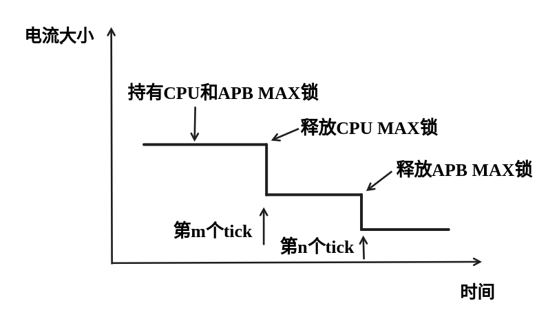
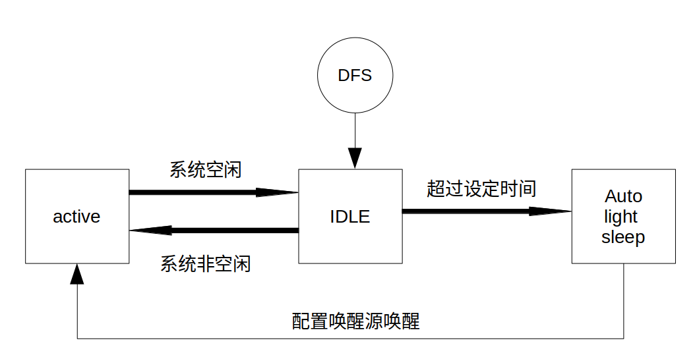
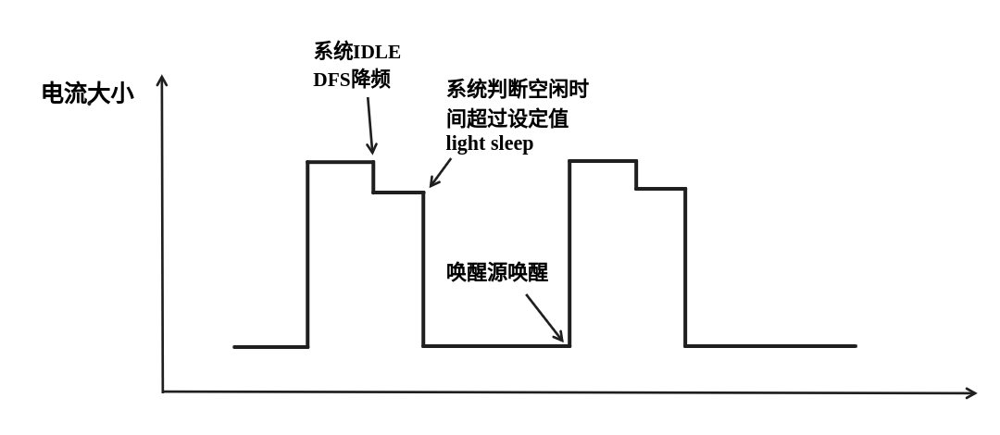
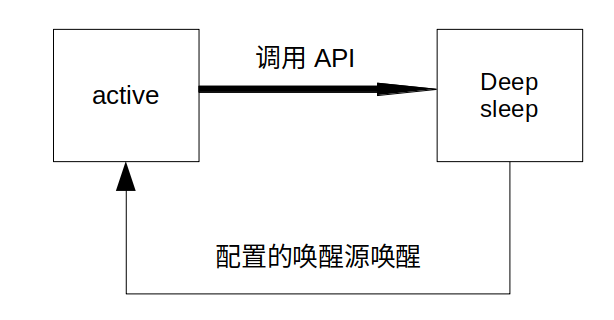
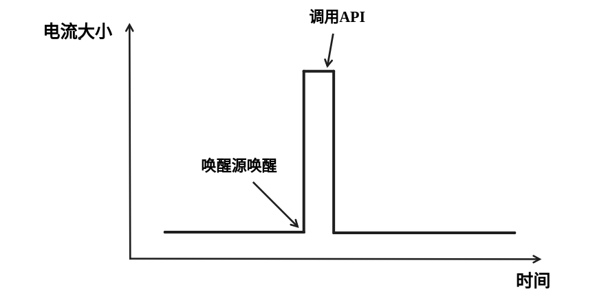

低功耗模式使用指南
==================

:link_to_translation:`en:[English]`

对于物联网应用场景，终端的待机性能表现十分重要，本文档旨在介绍 {IDF_TARGET_NAME} 低功耗的基本原理，同时介绍 {IDF_TARGET_NAME} 支持的低功耗模式，需注意本文档主要针对 station mode。文档还会具体给出每种模式的配置步骤、推荐配置和功耗表现，以帮助用户根据实际需求快速配置适合的低功耗模式。

系统低功耗模式介绍
----------------------------------

低功耗模式不仅涉及到系统相关问题，还涉及到芯片具体的工作场景，如处在 Wi-Fi 工作场景就会与处在蓝牙工作场景时产生不同。为此本节将首先介绍纯系统角度，即不涉及具体场景的低功耗模式，主要有 DFS、Light-sleep、Deep-sleep。纯系统下的低功耗模式主要思想就是在休眠时关闭或门控一些功能模块来降低功耗。

DFS
++++++++++++++++++++++++++++++++++

DFS (Dynamic frequency scaling) 即动态频率切换，是 ESP-IDF 中集成的电源管理机制的基础功能。DFS 可以根据应用程序持有电源锁的情况，调整外围总线 (APB) 频率和 CPU 频率。持有高性能锁就使用高频，空闲状态不持有电源锁时则使用低频来降低功耗，以此来尽可能减少运行应用程序的功耗。

DFS 的调频机制即根据持有电源锁的最大频率需求来调整频率，同时，freertos tick rates 的数值也会对 DFS 调频产生影响。系统任务调度的灵敏度越大，则意味着系统能更及时的根据需求调整频率。有关调频机制的详细信息，请参见 :doc:`电源管理 <../api-reference/system/power_management>`。

下图为 DFS 调频机制运行的理想电流情况。

    理想 DFS 机制调频电流图

DFS 适用于 CPU 必须处于工作状态但是对低功耗有需求的场景，因此 DFS 经常与其他低功耗模式共同开启，下文会详细介绍。

Light-sleep
++++++++++++++++++++++++++++++++++

Light-sleep 模式是 {IDF_TARGET_NAME} 预设的一种低功耗模式，其核心思想就是在休眠时关闭或门控一些功能模块来降低功耗。从纯系统方面来说，Light-sleep 模式有两种进入方式，一种是通过 API 调用进入休眠，一种是自动进入的 auto 模式。两种模式都需要配置唤醒源进行唤醒，同时在进入休眠后会门控或关闭一些模块。这里主要介绍 Auto Light-sleep 模式。

Auto Light-sleep 模式是 ESP-IDF 电源管理机制和 Light-sleep 模式的结合。开启电源管理机制是其前置条件，auto 体现在系统进入空闲状态 (IDLE) 超过设定时间后，自动进入 Light-sleep。空闲状态下，应用程序释放所有电源锁，此时，DFS 将降频以减小功耗。

Auto Light-sleep 依赖于电源管理机制，系统经过提前判断，发现空闲时间超过设定时间时，则直接进入休眠。该过程为自动进行。休眠时会自动关闭 RF、8 MHz 振荡器、40 MHz 高速晶振、PLL、门控数字内核时钟，暂停 CPU 工作。

Auto Light-sleep 模式需配置唤醒源。该模式拥有多种唤醒源，支持相互组合，此时任何一个唤醒源都可以触发唤醒。唤醒后，会从进入休眠的位置继续执行程序。若不配置唤醒源，进入 Light-sleep 休眠后，芯片将一直处在睡眠状态，直到外部复位。具体唤醒源有 RTC 定时器、触摸传感器、外部唤醒 (ext0)、外部唤醒 (ext1)、ULP 协处理器、SDIO、GPIO、UART、Wi-Fi、BT 唤醒等。

Auto Light-sleep 模式工作流程相对复杂，但是进入休眠状态是自动进行，同时需注意在进入前配置好唤醒源，防止芯片一直处在休眠状态。

    Auto Light-sleep 模式工作流程图

根据 Auto Light-sleep 的工作流程可得其理想电流图，关键节点均在图上标出。

    Auto Light-sleep 模式模式理想电流图

.. note::
    为更加清晰地展现出 Auto Light-sleep 的主要变化，图中省略了 DFS 降频过程。

Auto Light-sleep 模式适用于不需要实时响应外界需求的场景。

Deep-sleep
++++++++++++++++++++++++++++++++++

Deep-sleep 模式是为了追求更好的功耗表现所设计，休眠时仅保留 RTC 控制器、RTC 外设（可配置）、ULP 协处理器、RTC 高速内存、RTC 低速内存，其余模块全部关闭。与 Light-sleep 类似，Deep-sleep 同样通过 API 进入，且需要配置唤醒源进行唤醒。

Deep-sleep 通过调用 API 进入，休眠时会关闭除 RTC 控制器、RTC 外设、ULP 协处理器、RTC 高速内存、RTC 低速内存外的所有模块。

Deep-sleep 模式需配置唤醒源，其拥有多种唤醒源，这些唤醒源也可以组合在一起，此时任何一个唤醒源都可以触发唤醒。若不配置唤醒源进入 Deep-sleep 模式，芯片将一直处在睡眠状态，直到外部复位。具体唤醒源有 RTC 定时器、触摸传感器、外部唤醒 (ext0)、外部唤醒 (ext1)、ULP 协处理器、GPIO 唤醒等。

Deep-sleep 模式工作流程如下图所示：

    Deep-sleep 模式工作流程图

Deep-sleep 模式主要应用场景决定了系统很长时间才会苏醒一次，完成工作后又会继续进入 Deep-sleep，所以其理想电流图如下。

    Deep-sleep 模式理想电流图

Deep-sleep 可以用于低功耗的传感器应用，或是大部分时间都不需要进行数据传输的情况，也就是通常所说的待机模式。设备可以每隔一段时间从 Deep-sleep 状态醒来测量数据并上传，之后重新进入 Deep-sleep；也可以将多个数据存储于 RTC memory，然后一次性发送出去。

如何配置纯系统下低功耗模式
+++++++++++++++++++++++++++++++++++++

介绍完纯系统下的低功耗模式后，本节将介绍公共配置选项、每种模式独有的配置选项，以及相应低功耗模式 API 的使用说明，同时给出相应模式推荐的配置。

公共配置选项
+++++++++++++

.. only:: esp32 or esp32s3

  - 单双核工作模式
    对于多核心芯片，可以选择单核工作模式。

  - RTOS Tick rate (Hz)
    该参数表示系统周期任务调度的频率。例如，当 RTOS Tick rate 配置为 1000 时，系统每毫秒都会进行一次任务调度；空闲时，系统也能够更敏锐的感知到空闲状态。

DFS 配置
+++++++++++++++++++++++

DFS 有如下可配置选项：

- max_freq_mhz
    该参数表示最大 CPU 频率 (MHz)，即 CPU 最高性能工作时候的频率，一般设置为芯片参数的最大值。

- min_freq_mhz
    该参数表示最小 CPU 频率 (MHz)，即系统处在空闲状态时 CPU 的工作频率。该字段可设置为晶振 (XTAL) 频率值，或者 XTAL 频率值除以整数。

- light_sleep_enable
    使能该选项，系统将在空闲状态下自动进入 Light-sleep 状态，即 Auto Light-sleep 使能，上文已经具体介绍。

具体配置方法如下：

- 1. 使能 CONFIG_PM_ENABLE
- 2. 配置 max_freq_mhz 和 min_freq_mhz，方式如下:

  ::

    esp_pm_config_t pm_config = {
            .max_freq_mhz = CONFIG_EXAMPLE_MAX_CPU_FREQ_MHZ,
            .min_freq_mhz = CONFIG_EXAMPLE_MIN_CPU_FREQ_MHZ,
            .light_sleep_enable = false
    };
    ESP_ERROR_CHECK(esp_pm_configure(&pm_config));

推荐配置：

.. list-table::
  :header-rows: 1
  :widths: 20 20

  * - 配置名称
    - 设置情况

  * - CONFIG_PM_ENABLE
    - ON

  * - RTOS Tick rate (Hz)
    - 1000

  * - max_freq_mhz
    - 160

  * - min_freq_mhz
    - 40

  * - light_sleep_enable
    - false

.. note::
    上表中不涉及的配置均是默认。

Light-sleep 配置
+++++++++++++++++++

本节介绍 Auto Light-sleep 的推荐配置和配置步骤。

Auto Light-sleep 有如下可配置选项：

- Minimum step to enter sleep mode
    该参数表示系统自动进入休眠的阈值。该参数单位为 RTOS Tick，故其表示的时间与 RTOS Tick rate 相关，例该参数值为 3，RTOS Tick rate 配置为 1000 Hz 时，即当系统空闲时间大于等于 3 ms 时进入 休眠。

- Put light sleep related codes in internal RAM
    如果使能该选项，一些 light-sleep 功能将被移至 IRAM，减少代码运行时间，降低系统功耗，IRAM 使用量将增加 1.8 kB。

- Put RTOS IDLE related codes in internal RAM
    如果使能该选项，一些 RTOS IDLE 功能将被移至 IRAM，减少代码运行时间，降低系统功耗，IRAM 使用量将增加 260 B。

- RTC slow clock source
    该参数表表示 RTC 慢速时钟源。系统休眠时计时器模块的时钟被门控，此时使用 RTC Timer 进行计时，唤醒后使用 RTC Timer 的计数值对系统时间进行补偿。

.. list-table::
  :header-rows: 1
  :widths: 20 20 20

  * - 时钟源
    - 精度
    - 频偏

  * - Internal 150 kHz OSC
    - 约 6.7 us/cycle
    - 大

  * - External 32 kHz XTAL
    - 约 30.5 us/cycle
    - 小

- Disable all GPIO when chip at sleep
    如果使能该选项，系统将在休眠过程中禁用所有 GPIO 管脚，消除 GPIO 漏电，降低功耗，但是休眠过程中 GPIO 无法进行信号输入和输出。

.. only:: esp32c3 or esp32s3

    - Power down MAC and baseband
        如果使能该选项，系统将在休眠时关闭 Wi-Fi 和蓝牙的 MAC 和 baseband 来降低功耗，休眠电流约降低 100 uA， 但是为保存上下文信息，将额外消耗 5.3 K DRAM。

    - Power down CPU
        如果使能该选项，系统将在休眠时将关闭 CPU 来降低功耗，对于 ESP32-C3，休眠电流减小 100 uA 左右，对于 ESP32-S3，休眠电流减小 650 uA 左右。但是为保存上下文信息，对于 ESP32-C3，将消耗 1.6 KB 的 DRAM 空间，对于 ESP32-S3，将消耗 8.58 KB 的 DRAM 空间。

    - Power down I/D-cache tag memory
        如果使能该选项，系统将在休眠时关闭 I/D cache tag memory 来降低功耗， 但是为保存 tag memory 信息，将额外消耗最大约 9 KB DRAM，同时因为 tag memory 信息特殊性，如需打开该选项，建议多进行测试。

    - Power down flash in Light-sleep
        如果使能该选项，系统将在 Light-sleep 休眠时关闭 flash，降低系统功耗，该选项的前提是系统没有使用 PSRAM。

唤醒源：

- RTC Timer Wakeup
- GPIO Wakeup
- UART Wakeup
- Touchpad Wakeup
- External Wakeup (ext0)
- External Wakeup (ext1)
- ULP Coprocessor Wakeup

.. note::
    以上仅列出可配置唤醒源，详细介绍请参考 :doc:`睡眠模式 <../api-reference/system/sleep_modes>`。

配置方法：

- 1. 配置唤醒源
- 2. 使能 CONFIG_PM_ENABLE
- 3. 使能 CONFIG_FREERTOS_USE_TICKLESS_IDLE
- 4. 配置 DFS 参数
- 5. light_sleep_enable = true，具体如下:

  ::

    esp_pm_config_t pm_config = {
      .max_freq_mhz = CONFIG_EXAMPLE_MAX_CPU_FREQ_MHZ,
      .min_freq_mhz = CONFIG_EXAMPLE_MIN_CPU_FREQ_MHZ,
      #if CONFIG_FREERTOS_USE_TICKLESS_IDLE
      .light_sleep_enable = true
      #endif
    };
    ESP_ERROR_CHECK(esp_pm_configure(&pm_config));

- 6. 配置介绍的其余相关参数

推荐配置：

.. only:: esp32c3 or esp32s3

  .. list-table::
   :header-rows: 1
   :widths: 30 15

   * - 配置名称
     - 设置情况

   * - CONFIG_PM_ENABLE
     - ON

   * - CONFIG_FREERTOS_USE_TICKLESS_IDLE
     - ON

   * - max_freq_mhz
     - 160

   * - min_freq_mhz
     - 40

   * - RTOS Tick rate (Hz)
     - 1000

   * - light_sleep_enable
     - true

   * - Minimum step to enter sleep mode
     - 3

   * - Put light sleep codes in IRAM
     - OFF

   * - Put RTOS IDLE codes in IRAM
     - OFF

   * - RTC slow clock source
     - Internal 150 kHz OSC

   * - Disable all GPIO when chip at sleep
     - ON

   * - Power down MAC and baseband
     - ON

   * - Power down I/D-cache tag memory
     - ON

   * - Power down CPU
     - ON

   * - Power down flash in light sleep
     - OFF

  .. note::
      上表中不涉及的配置均是默认

.. only:: esp32 or esp32s2

  .. list-table::
    :header-rows: 1
    :widths: 30 15

    * - 配置名称
      - 设置情况

    * - CONFIG_PM_ENABLE
      - ON

    * - CONFIG_FREERTOS_USE_TICKLESS_IDLE
      - ON

    * - max_freq_mhz
      - 160

    * - min_freq_mhz
      - 40

    * - RTOS Tick rate (Hz)
      - 1000

    * - light_sleep_enable
      - true

    * - Minimum step to enter sleep mode
      - 3

    * - Put light sleep codes in IRAM
      - OFF

    * - Put RTOS IDLE codes in IRAM
      - OFF

    * - RTC slow clock source
      - Internal 150 kHz OSC

    * - Disable all GPIO when chip at sleep
      - ON

  .. note::
      上表中不涉及的配置均是默认

.. only:: esp32c2

  .. list-table::
   :header-rows: 1
   :widths: 30 15

   * - 配置名称
     - 设置情况

   * - CONFIG_PM_ENABLE
     - ON

   * - CONFIG_FREERTOS_USE_TICKLESS_IDLE
     - ON

   * - max_freq_mhz
     - 120

   * - min_freq_mhz
     - 40

   * - RTOS Tick rate (Hz)
     - 1000

   * - light_sleep_enable
     - true

   * - Minimum step to enter sleep mode
     - 3

   * - Put light sleep codes in IRAM
     - OFF

   * - Put RTOS IDLE codes in IRAM
     - OFF

   * - RTC slow clock source
     - Internal 150 kHz OSC

   * - Disable all GPIO when chip at sleep
     - ON

   * - Power down MAC and baseband
     - ON

   * - Power down I/D-cache tag memory
     - ON

   * - Power down CPU
     - ON

   * - Power down flash in light sleep
     - OFF

  .. note::
      上表中不涉及的配置均是默认

Deep-sleep 配置
++++++++++++++++++

对 Deep-sleep 模式来说，除了唤醒源相关配置，其余配置意义已经不大。

Deep-sleep 有如下可配置选项：

- RTC Timer wakeup
- EXT0/1 wakeup
- Touchpad wakeup
- ULP wakeup

.. note::
    以上仅列出可配置唤醒源，详细介绍请参考 :doc:`睡眠模式 <../api-reference/system/sleep_modes>`。

配置步骤：

- 配置唤醒源
- 调用 API，具体如下::

   /* Enter deep sleep */
   esp_deep_sleep_start();

用户可以通过下列配置选项，让一些特定模块在休眠时保持开启状态：

- Power up External 40 MHz XTAL
    在一些特殊应用中，部分模块对休眠时的时钟精度及稳定度有很高要求（例如 BT）。这种情况下，可以考虑在休眠过程中打开 External 40 MHz XTAL。
    打开和关闭代码如下::

      ESP_ERROR_CHECK(esp_sleep_pd_config(ESP_PD_DOMAIN_XTAL, ESP_PD_OPTION_ON));
      ESP_ERROR_CHECK(esp_sleep_pd_config(ESP_PD_DOMAIN_XTAL, ESP_PD_OPTION_OFF));

- Power up Internal 8 MHz OSC
    在一些特殊应用中，部分模块（例如 LEDC）将 Internal 8 MHz OSC 作为时钟源，并且希望在 Light-sleep 休眠过程中也可以正常使用。这种情况下，可以考虑在休眠过程中打开 Internal 8 MHz OSC。
    打开和关闭代码如下::

      ESP_ERROR_CHECK(esp_sleep_pd_config(ESP_PD_DOMAIN_RTC8M, ESP_PD_OPTION_ON));
      ESP_ERROR_CHECK(esp_sleep_pd_config(ESP_PD_DOMAIN_RTC8M, ESP_PD_OPTION_OFF));

.. only:: SOC_WIFI_SUPPORTED

  Wi-Fi 场景下低功耗模式介绍
  ----------------------------------

  上文介绍了纯系统方向下的低功耗模式，但在实际应用中还需结合具体应用场景。本节将结合纯系统下的功耗模式来介绍在 Wi-Fi 场景下的低功耗模式。因为 Wi-Fi 场景的复杂性，本节会会首先介绍 Wi-Fi 省电的基本原理，然后再介绍具体的低功耗模式，同时本节主要针对 station 模式。

  Wi-Fi 场景如何选择低功耗模式
  ++++++++++++++++++++++++++++++++++

  为方便用户选择合适的低功耗模式，在介绍具体内容前先给出 Wi-Fi 场景下低功耗模式总结表，以方便用户根据需求快速选择想要了解的内容。

  .. include:: sleep-current/{IDF_TARGET_PATH_NAME}_summary.inc

  .. note::

      上表中所有电流均为平均电流，所测数据均在屏蔽箱中测试得出。表中术语在下文均有介绍，用户可根据需求进行查看。

  Wi-Fi 省电的基本原理
  +++++++++++++++++++++

  首先，在 station 的工作过程中，为在接收发送过程中避免冲突，需要长时间监听信道，能耗较大的 RF 模块会一直处于工作中，浪费电量。为此，Wi-Fi 协议引入省电模式。

  省电模式的基本原理是通过减少不必要的监听时间来降低耗能。AP 会缓存进入省电模式的 station 的包，同时周期发送包含 TIM 信息的 Beacon 帧，TIM 会指示 AP 缓存的单播包。TIM 中，DTIM 较为特殊，其会缓存广播包，并以 n 个（由 AP 决定）TIM 为周期发送。对 station 来说，TIM 非必听，而 DTIM 为必听。因此，station 可以选择只在每一个 DTIM 帧前醒来打开 Wi-Fi 相关模块（RF 模块），而不必时刻处于监听状态，这样就能有效降低功耗。

  .. figure:: ../../_static/Low-power-DTIM4.png
      :align: center

      DTIM4 省电模式示意图

  其次，station 从打开到再次关闭 Wi-Fi 相关模块的时间也会影响功耗。除必要的数据传输处理时间外，主要有四项配置会影响时间长短：

    - 时钟准确性导致的 time offset，主要原因是时钟或多或少都会与理想的时间存在偏移，同时偏移的正负不定。
    - 处理 Beacon 漏听后的时间，如漏听后持续监听时间、允许最多丢失 Beacon 数目等，这段时间存不存在以及存在多久都不定，但是可以配置范围。
    - 为了确保能够接受突发数据包而添加的 active 时间，可由配置决定。
    - ILDE 时间是具体某些功耗模式进入条件要求。因此在满足通信需求的情况下，降低工作时间可以改善功耗表现。

  .. figure:: ../../_static/Low-power-time.png
      :align: center

      芯片工作时间组成图

  此外，在 station 没有处于 Wi-Fi 接收或发送状态时，影响功耗的因素变成了芯片的其他模块。不同的功耗模式会配置不同的时钟源，或者动态调整一些模块的工作频率如 CPU，同时还会关闭不同数量的功能模块，这将有效降低芯片的功耗。其实也就是纯系统相关的模式，用户可根据需求自己选择合适的配置。

  如果以时间为横轴，电流大小为纵轴建立坐标轴，那么处在低功耗模式下芯片的理想工作电流图可以简化成下图：

  .. figure:: ../../_static/Low-power-WiFi-base-current.png
      :align: center

      理想情况下 Wi-Fi 场景低功耗模式电流图

  其中 station 要进行 Wi-Fi 通信时，Wi-Fi 相关模块 (PHY) 开启，电流会显著上升，在工作完成前，电流会一直维持在一个较高的水平。工作完成后，芯片会关闭 Wi-Fi 相关模块，这时电流又会降低到一个较低水平。

  可以看出影响功耗表现的主要有三点：interval、period 和 base current。

    - Interval 是 station Wi-Fi 相关模块工作的间隔，既可以由低功耗模式自定义，也可根据 Wi-Fi 协议省电机制（3.1 第一点介绍），由 DTIM 周期决定。可以看出在同等情下，interval 越大，功耗表现会更好，但是响应会更慢，影响通信的及时性。

    - Period 可以看作每次 station Wi-Fi 工作的时间，这段时间的长度也会影响功耗的表现。period 不是一个固定的时长（3.1 第二点介绍），在保证 Wi-Fi 通信正常的情况下，period 持续时间越短，功耗表现越好。但是减少 period 时间，必然会影响通信的可靠性。

    - Base current 是 Wi-Fi 相关模块不工作时芯片的电流，影响其大小的因素很多，不同的功耗模式下休眠策略不同。所以，在满足功能的情况下，优化配置降低该电流大小可以提高功耗表现，但同时关闭其余模块会影响相关功能和芯片的唤醒时间。

  知道了影响功耗的三点因素之后，要想降低功耗应从这三点入手，接下来介绍两种低功耗模式，Modem sleep、Auto Light-sleep。两种模式主要区别就是对三点因素的优化不同。

  Modem-sleep Mode
  ++++++++++++++++++

  Modem-sleep 模式主要工作原理基于 DTIM 机制，周期性的醒来处理 Wi-Fi 相关工作，又在周期间隔之间进入休眠，关闭 PHY（RF 模块）来降低功耗。同时通过 DTIM 机制，station 可以与 AP 保持 Wi-Fi 连接，数据传输。

  Modem-sleep 模式会在 Wi-Fi task 结束后自动进入休眠无需调用 API，休眠时仅会关闭 Wi-Fi 相关模块 (PHY)，其余模块均处在正常上电状态。

  Modem-sleep 模式默认会根据 DTIM 周期或 listen interval（下文介绍）醒来，相当于系统自动设置了一个 Wi-Fi 唤醒源，因此用户无需再配置唤醒源，同时系统主动发包时也可以唤醒。

  Modem-sleep 是一个开关型的模式，调用 API 开启后一直自动运行，其工作流程十分简单，具体如下图。

  .. figure:: ../../_static/Low-power-modem-process.png
      :align: center

      Modem sleep 工作流程图

  根据上文的基本电流图，结合 Modem-sleep 的工作原理，以 Min Modem（下文介绍）为例可得理想情况下电流变化图。

  .. figure:: ../../_static/Low-power-modem-current.png
      :align: center

      Min Modem-sleep 理想电流图

  Modem-sleep 一般用于 CPU 持续处于工作状态并需要保持 Wi-Fi 连接的应用场景，例如，使用 {IDF_TARGET_NAME} 本地语音唤醒功能，CPU 需要持续采集和处理音频数据。

  DFS + Modem sleep
  ++++++++++++++++++

  Modem sleep 模式休眠状态中 CPU 仍处在工作状态，而 DFS 机制主要作用于 CPU 和 APB 工作频率来降低功耗，因此 DFS + Modem sleep 可以进一步优化功耗表现，又因为 Wi-Fi task 会申请 ESP_PM_CPU_FREQ_MAX 电源锁来保证 Wi-Fi 任务快速运行，所以 DFS + Modem sleep 产生调频只会发生在 base current 阶段，即 Wi-Fi task 结束后。

  在 Wi-Fi 场景下，为了介绍的简化，让用户抓住主要的变化，DFS 可以进行一定的状态简化。具体来说，虽然 DFS 主要根据 CPU 和 APB 两把锁的最高需求来调频，但是 Wi-Fi 场景都需要 CPU 的频率最大化来工作，同时 Wi-Fi task 结束后，也可以理想化的认为，没有其余的工作要完成，这样就可以简单认为经过一段时间会释放两把锁进入空闲状态（IDLE 状态），也同时忽略这段时间锁的变化导致的电流变化，简化状态。

  在 Wi-Fi 场景下，DFS 最终简化为如下流程：

  .. figure:: ../../_static/Low-power-DFS-process.png
      :align: center

      Wi-Fi 场景 DFS 简化流程图

  在 Wi-Fi 工作的 active 状态与系统空闲的 IDLE 状态转换，Wi-Fi task 结束后，系统经过一段时间释放了所有锁进入 IDLE 状态，此时 DFS 机制降低频率到设定最低值，忽略了转换状态期间的调频动作，方便理解。

  简化过后的 DFS + Modem sleep 模式理想状态下的电流大小如下图所示：

  .. figure:: ../../_static/Low-power-DFS-modem-current.png
      :align: center

      DFS + Modem sleep 模式理想电流图

  Auto Light-sleep + Wi-Fi 场景
  +++++++++++++++++++++++++++++++

  Auto Light-sleep 模式在 Wi-Fi 场景下是 ESP-IDF 电源管理机制、DTIM 机制和 light-sleep 的结合。开启电源管理是其前置条件，auto 体现在系统进入 IDLE 状态超过设定值后自动进入 light-sleep。同时 auto light sleep 模式同样遵循 DTIM 机制，会自动苏醒，可以与 AP 保持 Wi-Fi 连接。

  Auto Light-sleep 模式在 Wi-Fi 场景下休眠机制与纯系统下一样，仍然依赖于电源管理机制，进入休眠的条件为系统处于 IDLE 状态的时间超过设定时间，并且系统会提前判断空闲时间是否满足条件，若满足直接休眠。该过程为自动进行。休眠时会自动关闭 RF、8 MHz 振荡器、40 MHz 高速晶振、PLL，门控数字内核时钟，暂停 CPU 工作。

  Auto Light-sleep 模式在 Wi-Fi 场景下遵循 DTIM 机制，自动在 DTIM 帧到来前苏醒，相当于系统自动设置了一个 Wi-Fi 唤醒源，因此用户无需再配置唤醒源。同时系统主动发包时也可以唤醒。

  Auto Light-sleep 模式在 Wi-Fi 场景下工作流程较为复杂，但全程都是自动进行，具体如下图所示。

  .. figure:: ../../_static/Low-power-wifi-auto-light-process.png
      :align: center

      Auto Light-sleep 工作流程图

  Auto Light-sleep 模式在 Wi-Fi 场景下经常与 modem sleep 同时开启，这里给出 modem + auto light-sleep 模式的理想电流图，关键节点均在图上标出。

  .. figure:: ../../_static/Low-power-wifi-auto-light-current.png
      :align: center

      modem + auto light-sleep 模式理想电流图

  Auto Light-sleep 模式在 Wi-Fi 场景下可用于需要保持 Wi-Fi 连接，可以实时响应 AP 发来数据的场景。并且在未接收到命令时，CPU 可以处于空闲状态。比如 Wi-Fi 开关的应用，大部分时间 CPU 都是空闲的，直到收到控制命令，CPU 才需要进行 GPIO 的操作。

  Deep-sleep + Wi-Fi 场景
  +++++++++++++++++++++++++++++++++

  Deep-sleep 模式在 Wi-Fi 场景下与纯系统下基本相同，详情可以参考 `Deep-sleep`_ 这里不再介绍。

  如何配置 Wi-Fi 场景下低功耗模式
  +++++++++++++++++++++++++++++++++++++

  介绍完 Wi-Fi 场景下低功耗模式后，本节将介绍公共配置选项、每种模式独有的配置选项，以及相应低功耗模式 API 的使用说明，同时给出相应模式推荐的配置（包含纯系统下的低功耗推荐配置）以及该配置的具体表现。

  公共配置选项：

  - 功耗类：

    - Max Wi-Fi TX power (dBm)
        该参数表示最大 TX 功率，降低该参数会减小发包功耗，但会影响 Wi-Fi 性能，默认设置最大 20。

  - IRAM 类：

    - Wi-Fi IRAM speed optimization
        如果使能该选项，一些 Wi-Fi 功能将被移至 IRAM，减少代码运行时间，降低系统功耗，IRAM 使用量将增加，默认开启。

    - Wi-Fi RX IRAM speed optimization
        如果使能该选项，一些 Wi-Fi RX 功能将被移至 IRAM，减少代码运行时间，降低系统功耗，IRAM 使用量将增加，默认开启。

    - Wi-Fi Sleep IRAM speed optimization
        如果使能该选项，一些 Wi-Fi sleep 功能将被移至 IRAM，减少代码运行时间，降低系统功耗，IRAM 使用量将增加，默认关闭。

  - Wi-Fi 协议类：

    - Minimum active time
        该参数表示 Station 接收完一次数据后需要等待时间。当终端与 AP 进行通信时，AP 发送到终端的数据经常是突发形式的，为确保后续的突发数据能够正常接收到，需要等待一段时间。默认 50。

    - Maximum keep alive time
        该参数表示周期性的发送 sleep null data 来通告 AP 维持连接的时间。在 DTIM 机制下，若 AP 长时间没有某个 station 的包，可能会断开连接，因此需要 station 需要周期发送 sleep null data 维持连接。默认 10。

    - Send gratuitous ARP periodically
        如果使能该选项，Station 将周期性的发送 gratuitous ARP 请求更新 AP ARP 缓存表。如无该需求，可以关闭。

    - Wi-Fi sleep optimize when beacon lost
        如果使能该选项，Station 在检测到已经错过或者丢失 beacon 时，会立即关闭 RF 进入低功耗状态。

  Modem sleep 配置方法如下:

  - 可配置选项

    - Min Modem
        该参数表示 station 按照 DTIM 周期工作，在每个 DTIM 前醒来接收 Beacon，这样不会漏掉广播信息，但是 DTIM 周期由 AP 决定，如果 DTIM 周期较短，省电效果会降低。

    - Max Modem
        该参数表示 station 会自定义一个 listen interval，并以 listen interval 为周期醒来接受 Beacon。这样在 listen interval 较大时会省电，但是容易漏听 DTIM，错过广播数据。

  - 配置方法：

    - 调用 API，选择模式参数::

        typedef enum {
            WIFI_PS_NONE,
            WIFI_PS_MIN_MODEM,
            WIFI_PS_MAX_MODEM,
        } wifi_ps_type_t;
        esp_err_t esp_wifi_set_ps(wifi_ps_type_t type);

      若选择 WIFI_PS_MAX_MODEM，还需配置 listen interval，示例如下::

          #define LISTEN_INTERVAL 3
          wifi_config_t wifi_config = {
              .sta = {
              .ssid = "SSID",
              .password = "Password",
              .listen_interval = LISTEN_INTERVAL,
            },
          };
          ESP_ERROR_CHECK(esp_wifi_set_mode(WIFI_MODE_STA));
          ESP_ERROR_CHECK(esp_wifi_set_config(ESP_IF_WIFI_STA, &wifi_config));
          ESP_ERROR_CHECK(esp_wifi_start());

  配置推荐：

  这里给出的配置推荐是 Min Modem sleep + DFS 开启的配置

  .. list-table::
    :header-rows: 1
    :widths: 20 15

    * - 配置名称
      - 设置情况

    * - WIFI_PS_MIN_MODEM
      - ON

    * - CONFIG_PM_ENABLE
      - ON

    * - RTOS Tick rate (Hz)
      - 1000

    * - max_freq_mhz
      - 160

    * - min_freq_mhz
      - 40

    * - light_sleep_enable
      - false

  配置表现：

  .. include:: sleep-current/{IDF_TARGET_PATH_NAME}_modem_sleep.inc

  Auto Light-sleep + Wi-Fi 场景配置：

  Auto Light-sleep 在 Wi-Fi 场景下的配置比纯系统下少了唤醒源的配置要求，其余几乎与纯系统下配置一致，因此可配置选项、配置步骤、推荐配置的详细介绍可以参考上文 `Light-sleep`_。同时 Wi-Fi 相关配置保持默认。

  配置表现：

  该配置表现为 Auto Light-sleep 纯系统推荐配置 + 默认的 Wi-Fi 相关配置在 Wi-Fi 场景的表现。

  .. include:: sleep-current/{IDF_TARGET_PATH_NAME}_light_sleep.inc

  Deep-sleep + Wi-Fi 场景配置：

  Deep-sleep 模式在 Wi-Fi 场景下的配置与纯系统下配置基本一致，因此可配置选项、配置步骤、推荐配置的详细介绍可以参考上文 `Deep-sleep`_。同时 Wi-Fi 相关配置保持默认。

  配置表现：

  该配置表现为 Deep-sleep 纯系统推荐配置 + 默认的 Wi-Fi 相关配置在 Wi-Fi 场景的表现。

  .. only:: esp32

    平均电流约 5.0 μA

  .. only:: esp32s2

    平均电流约 5.0 μA

  .. only:: esp32s3

    平均电流约 6.9 μA

  .. only:: esp32c3

    平均电流约 4.8 μA

  .. only:: esp32c2

    平均电流约 4.9 μA

.. only:: esp32c6

  目标唤醒时间 (TWT)
  ----------------------------------

  目标唤醒时间 (Target Wake Time, TWT) 是 Wi-Fi 6 中引入的一项特性，旨在降低设备功耗和提高网络效率。

  在以往的 Wi-Fi 节能机制中，设备可能需要在每个 DTIM 周期醒来与 AP 交换数据，而在 TWT 机制中支持 AP 和设备协商得到特定的唤醒时间，设备会在这些时间点醒来与 AP 进行数据交换，而其余时间则处于休眠状态。TWT 协商的唤醒和休眠时间取决于设备具体的应用需求。例如，有些传感器设备需要定时上传数据，在该场景下设备可以与 AP 建立 TWT 协商，相隔多个小时交换一次数据。实际应用中可根据具体需求定制唤醒时间，在不影响设备正常工作的情况下降低功耗。

  AP 可以与多个设备建立 TWT 协商。利用 Wi-Fi 6 的多用户特性，AP 可以对上行和下行数据传输做出合理协调，从而减少信道竞争，提高传输效率。

  TWT 类型
  ++++++++++

  根据协商类型和工作模式，可以把 TWT 分为：

  - **Individual TWT (iTWT)**

    iTWT 模式下，AP 与终端设备建立的是一对一的 TWT 协商。

  - **Broadcast TWT (bTWT)**

    在 bTWT 模式下，AP 通过 Beacon 帧广播 TWT 信息，以组的形式来管理多个终端设备的 TWT 过程。终端设备可以根据 Beacon 中的 TWT 信息选择执行加组操作。

  .. note::
      在建立 TWT 协商前，需要确认 AP 是否支持并开启了 TWT 功能。{IDF_TARGET_NAME} 当前只支持 iTWT 模式。

  TWT 工作流程
  ++++++++++++
  TWT 工作流程一般分为 TWT 协商建立、TWT 协商暂停/恢复、TWT 协商终止。TWT 协商建立后，Station 就可以按照协商的参数进入休眠状态，直到约定好的下一个 TWT 时间点到来时苏醒。
  对已经建立的 TWT，用户可以根据需求协商暂停/恢复 TWT 或者终止 TWT。

  - TWT 协商建立

    - Individual TWT 协商建立

      在 iTWT 协商建立过程中，通常由 Station 充当请求发起方发送 TWT 请求，而后 AP 作为接收方对该请求做出回应。AP 也可以主动向 Station 发起 TWT 协商建立过程。
      在成功建立起 iTWT 协商后，Station 可以进入休眠状态，直到约定好的下一个 TWT 时间点到来时苏醒，该时间点通过和 AP 间的协商得到。Station 醒来后和 AP 进行数据交换，这段时间被称为 TWT 服务时间 (Service Period, SP)。
      TWT SP 的持续时间被称为 TWT Wake Duration，其最小值为 256 微秒。当一次 TWT SP 结束后，Station 进入休眠状态直到下次 TWT SP 醒来进行数据传输。本次 TWT SP 的起始到下次 TWT SP 的起始的时间间隔被称为 TWT Wake Interval。下图为基本的 iTWT 示例：

      .. figure:: ../../_static/itwt_setup.png
          :align: center

          Individual TWT 协商建立过程示例

      Station 在 iTWT 协商建立时可以发送不同类型的请求，AP 会根据请求类型及参数做出对应的回复。用户需要根据 AP 回复中的类型和具体参数决定后续的操作逻辑。Station 所发送的请求类型有 ``Request``、``Suggest`` 和 ``Demand``。
      AP 的回复类型可分为 ``Accept``、``Alternate`` 和 ``Dictate``。下表描述了发送不同请求时 AP 可能的回复以及不同情况下对应的含义：

      .. list-table::
        :header-rows: 1
        :widths: 20 10 40

        * - 请求类型
          - AP 回复
          - 含义
        * - Request, Suggest or Demand
          - No response
          - 在该情况下 AP 不会与 Station 建立 iTWT 协商。
        * - Suggest or Request
          - Accept
          - AP 同意建立 iTWT 协商，其使用的参数以回复中 TWT 参数为准。回复中的 TWT 参数有可能与请求中不一致。
        * - Demand
          - Accept
          - AP 同意建立 iTWT 协商，且回复中的 TWT 参数与请求中的一致。
        * - Demand or Suggest
          - Alternate
          - AP 使用该回复类型代表给 Station提供一组备选 TWT 参数，此时不会建立 iTWT 协商。后续 Station 可以发送新的请求，但 AP 仍有可能使用该组参数。
        * - Demand or Suggest
          - Dictate
          - AP 使用该回复类型代表给 Station 提供一组备选 TWT 参数，此时不会建立 iTWT 协商，同时也表明 AP 不接受除该组参数以外的其他参数。后续 Station 可以发送新的请求，但只有参数与所提供的备选参数一致才会收到 Accept 回复。
        * - Request, Suggest or Demand
          - Reject
          - 在该情况下 AP 不会与 station 建立 iTWT 协商。后续 Station 可以更改 TWT 参数发送新的请求。

      在 TWT SP 中依照数据交互时的操作可以将 TWT 进一步地细分为多种类型，下表描述了这些类型间的差异：

      .. list-table::
        :header-rows: 1
        :widths: 10 20

        * - Types
          - 含义
        * - Trigger-enabled
          - AP 会在 SP 中使用 Trigger 帧来协调 Station 的数据传输。
        * - Non trigger-enabled
          - 在 SP 中不需要使用 Trigger 帧。
        * - Announced
          - Station 会发送 QoS Null 帧告知 AP 其唤醒状态。
        * - Unannounced
          - 不需要发送 QoS Null 帧。

    - Broadcast TWT 协商建立

      与 iTWT 不同的是，在 bTWT 模式下 AP 将 TWT 信息放在 Beacon 帧中进行广播宣告。Station 接收到 Beacon 后，可以向 AP 发送请求申请选择加入某个 TWT。
      当建立起 bTWT 协商后， Station 和 AP 会在协商好的 TWT SP 中进行数据传输。

      与 iTWT 类似，可以把 bTWT 进一步分成 Trigger-enabled 和 Non trigger-enabled 类型，以及 Announced 和 Unannounced 类型，具体的行为差异可以参考 iTWT 中的描述。

  - TWT 协商暂停/恢复

    建立起 TWT 协商后， Station 可以通过向 AP 发送 TWT Information 帧暂停或者恢复指定的 TWT 协商。由 flow_id 来标识需要暂停或者恢复的 TWT 协商，具体可以参考 TWT 参数配置。

    .. figure:: ../../_static/itwt_suspend.png
        :align: center

        Individual TWT 协商暂停/恢复过程示例

  - TWT 协商终止

    建立起 TWT 协商后， Station 可以通过向 AP 发送 TWT Teardown 帧终止指定的 TWT 协商。由 flow_id 来标识需要终止的 TWT 协商，具体可以参考 TWT 参数配置。

    .. figure:: ../../_static/itwt_teardown.png
        :align: center

        Individual TWT 协商终止过程示例

  TWT 参数配置
  ++++++++++++

  在使用过程中，需要配置 TWT 和低功耗模式的相关参数，其中低功耗模式相关参数决定了设备在休眠状态下的行为模式。本小节将主要阐述如何配置 TWT，有关低功耗模式下的参数配置，请参考 `如何配置 Wi-Fi 场景下低功耗模式`_。

  - Individual TWT 参数配置

    在建立 Station 和 AP 间的 iTWT 时，使用 :component_file:`esp_wifi/include/esp_wifi_he_types.h` 中定义的结构体 :cpp:type:`wifi_twt_setup_config_t` 来配置 TWT 的相关参数，其定义如下：

    .. code-block:: C

      typedef struct
      {
        wifi_twt_setup_cmds_t setup_cmd;
        uint16_t trigger :1;
        uint16_t flow_type :1;
        uint16_t flow_id :3;
        uint16_t wake_invl_expn :5;
        uint16_t wake_duration_unit :1;
        uint16_t reserved :5;
        uint8_t min_wake_dura;
        uint16_t wake_invl_mant;
        uint16_t twt_id;
        uint16_t timeout_time_ms;
      } wifi_twt_setup_config_t;

    :cpp:type:`wifi_twt_setup_config_t` 中各个字段的含义如下：

    .. list-table::
      :header-rows: 1
      :widths: 15 45
      :align: center

      * - 字段
        - 描述
      * - setup_cmd
        - 指示了 TWT 建立时请求和回复使用的命令类型，具体类型请参阅 :cpp:type:`wifi_twt_setup_cmds_t` 。
      * - trigger
        - 值为 1 时配置 TWT 类型为 Trigger-enabled，值为 0 时配置为 Non trigger-enabled。
      * - flow_type
        - 值为 1 时配置 TWT 类型为 Unannounced，值为 0 时配置为 Announced。
      * - flow_id
        - 当建立起一个 iTWT 协商后，AP 会为其分配 flow_id。Station 在协商建立请求中可以指定 flow_id，但在 AP 的回复中该字段可能会被改变。
      * - wake_invl_expn
        - TWT Wake Interval 指数部分。
      * - wake_duration_unit
        - TWT Wake Duration 计数单元。为 0 代表 256 微秒，为 1 代表以 TU (1024 微秒) 为单位。
      * - reserved
        - 保留字段。
      * - min_wake_dura
        - 该字段代表 Station 期望处于唤醒状态的时间，以 ``wake_duration_unit`` 作为基本单位。
      * - wake_invl_mant
        - TWT Wake Interval 尾数部分。
      * - twt_id
        - TWT 配置标识。在发起多个 TWT 请求时，该字段用于在 handler 中区分不同的 TWT 参数配置。
      * - timeout_time_ms
        - TWT 请求超时时间，单位为毫秒。

    需要指出的是，Station 在协商中所期望的 TWT Wake Interval 为 wake_invl_mant * 2\ :sup:`wake_invl_expn`\，单位是微秒。
    而所期望的 TWT Wake Duration 为 min_wake_dura * wake_duration_unit。

    .. note::
        注意， TWT Wake Interval 和 TWT Wake Duration 的差值需要大于 10 毫秒。

    配置示例如下：

    .. code-block:: C

      wifi_twt_setup_config_t setup_config = {
        .setup_cmd = TWT_REQUEST,
        .flow_id = 0,
        .twt_id = 0,
        .flow_type = 0,
        .min_wake_dura = 255,
        .wake_duration_unit = 0,
        .wake_invl_expn = 10,
        .wake_invl_mant = 512,
        .trigger = 1,
        .timeout_time_ms = 5000,
      };

    以上配置指定建立 TWT 请求时使用的类型为 Trigger-enabled，Announced，期望的 TWT Wake Interval 为 524288 微秒， TWT Wake Duration 为 65280 微秒。配置好 :cpp:type:`wifi_twt_setup_config_t` 后，调用 API :cpp:func:`esp_wifi_sta_itwt_setup` 向 AP 发起 iTWT 建立请求。

    .. note::
        {IDF_TARGET_NAME} 支持用户调用 API :cpp:func:`esp_wifi_sta_itwt_set_target_wake_time_offset` 配置相对于目标唤醒时间的偏移时间。

  TWT 事件
  ++++++++++

  - WIFI_EVENT_ITWT_SETUP

    发送请求后，用户可以在 :cpp:enumerator:`WIFI_EVENT_ITWT_SETUP` 事件的对应处理程序中获取请求结果并自定义处理逻辑。事件结果保存在 :cpp:type:`wifi_event_sta_itwt_setup_t` 结构体中，其成员变量 status 指示了此次事件的状态。
    当 status 为 :c:macro:`ITWT_SETUP_SUCCESS` 时代表请求成功收到了对应回复，为其他值代表请求失败。在得到请求成功的状态后，用户可以从该结构体中的 config 成员变量中得到 AP 回复中的具体参数，并根据具体参数决定后续的处理逻辑。
    例如，Station 发送了类型为 Demand 的 TWT 请求，收到 AP 的回复类型为 Dictate，用户此时可以考察回复中的 TWT 参数是否可行，若可行便可以发送一个新的 TWT 请求与 AP 继续建立 TWT 协商，并且该请求中的 TWT 参数需要与 AP 回复中一致。

    在 Station 未主动发送请求时也有可能触发 :cpp:enumerator:`WIFI_EVENT_ITWT_SETUP` 事件，这种情况下对应的是 AP 主动向 Station 发起 iTWT 协商建立过程，此时 AP 向 Station 发送的帧中会带有 TWT 参数。同样地，用户可以在 :cpp:enumerator:`WIFI_EVENT_ITWT_SETUP` 事件的对应处理程序中获取结果并自定义处理逻辑。
    用户需要检查 config 成员变量中 AP 发送的 TWT 参数类型，一般有两种情况：
    1. AP 发送的 TWT 参数为 Accept 类型，此时 Station 会与 AP 建立起使用该 TWT 参数的 iTWT 协商。若用户不希望建立此 iTWT 协商，可以向 AP 发送 Teardown 帧。
    2. AP 发送的 TWT 参数为 Alternate 或 Dictate 类型，此时 Station 不会与 AP 建立起 iTWT 协商，但可以在接下来使用该参数向 AP 发起 iTWT 协商建立请求。

  - WIFI_EVENT_ITWT_SUSPEND

    在调用 API :cpp:func:`esp_wifi_sta_itwt_suspend` 请求暂停已经建立的 iTWT 协商时， 用户可以在 :cpp:enumerator:`WIFI_EVENT_ITWT_SUSPEND` 事件的对应处理程序中获取请求结果并自定义处理逻辑。事件结果保存在 :cpp:type:`wifi_event_sta_itwt_suspend_t` 结构体中，其成员变量 status 指示了此次事件的状态。
    当 status 为 :c:macro:`ESP_OK` 时代表成功暂停了指定的 iTWT 协商，为其他值代表请求暂停失败。

    .. note::
        注意，调用 API :cpp:func:`esp_wifi_sta_itwt_suspend` 请求暂停 iTWT 时，用户需要指定对应 iTWT 的 flow_id 以及暂停时间。需要注意的是，当暂停时间大于 0 时，对应 iTWT 会在暂停指定时间后恢复，而当暂停时间为 0 时，对应的 iTWT 会暂停，直到被用户调用 API 手动恢复为止。

  - WIFI_EVENT_ITWT_TEARDOWN

    在调用 API :cpp:func:`esp_wifi_sta_itwt_teardown` 请求终止 iTWT 时，用户可以在 :cpp:enumerator:`WIFI_EVENT_ITWT_TEARDOWN` 事件的对应处理程序中获取请求结果并自定义处理逻辑。事件结果保存在 :cpp:type:`wifi_event_sta_itwt_teardown_t` 结构体中，其成员变量 status 指示了此次事件的状态。
    当 status 为 :cpp:enumerator:`ITWT_TEARDOWN_SUCCESS` 时代表成功终止了指定的 iTWT 协商，为其他值代表终止 iTWT 失败。调用 API 时用户需要指定需要终止的 iTWT 的 flow_id。

  - WIFI_EVENT_TWT_WAKEUP

    当 Station 在休眠中醒来时，Wi-Fi 驱动程序将会上报 :cpp:enumerator:`WIFI_EVENT_TWT_WAKEUP` 事件，用户可以在该事件的对应处理程序中自定义处理逻辑。事件结果保存在 :cpp:type:`wifi_event_sta_twt_wakeup_t` 结构体中，成员变量 twt_type 指示了此次事件 TWT 的类型，成员变量 flow_id 指示了此次醒来的具体的 TWT。

  - WIFI_EVENT_ITWT_PROBE

    调用 API :cpp:func:`esp_wifi_sta_itwt_send_probe_req` 在 iTWT 期间发送 probe request 时，用户可以在 :cpp:enumerator:`WIFI_EVENT_ITWT_PROBE` 事件的对应处理程序中获取请求结果并自定义处理逻辑。事件结果保存在 :cpp:type:`wifi_event_sta_itwt_probe_t` 结构体中，其成员变量 status 指示了此次事件的状态。
    当 status 为 :cpp:enumerator:`ITWT_PROBE_SUCCESS` 时代表成功发送 probe request 并且接收到 AP 回复的 probe response，为其他值代表发送或者接收 probe 失败。

  有关 iTWT 使用的更多信息，可以参考示例 :example:`wifi/itwt` 。

  TWT 功耗分析
  +++++++++++++

  为了展现 TWT 在节省设备功耗方面的优势，我们使用功率分析仪追踪了 {IDF_TARGET_NAME} 在不同模式下的电流情况。如下图所示，{IDF_TARGET_NAME} 首先处于 DTIM 模式，接着与 AP 建立起 iTWT 协商，TWT Wake Interval 为 10 s，在 TWT SP 结束后，{IDF_TARGET_NAME} 会进入 Light-sleep 状态直到下个 SP 到来时唤醒。
  其中 :cpp:type:`wifi_twt_setup_config_t` 配置示例如下：

  .. code-block:: C

    wifi_twt_setup_config_t setup_config = {
      .setup_cmd = TWT_REQUEST,
      .flow_id = 0,
      .twt_id = 0,
      .flow_type = 0,
      .min_wake_dura = 255,
      .wake_duration_unit = 0,
      .wake_invl_expn = 10,
      .wake_invl_mant = 10000,
      .trigger = 1,
      .timeout_time_ms = 5000,
    };

  .. figure:: ../../_static/itwt_10s_current.png
      :align: center

      DTIM 与 iTWT 模式下的电流图

  进一步，将 TWT 协商中的 TWT Wake Interval 参数更改为 30 s，下图展现了参数变化对于电流的影响。
  其中 :cpp:type:`wifi_twt_setup_config_t` 配置示例如下：

  .. code-block:: C

    wifi_twt_setup_config_t setup_config = {
      .setup_cmd = TWT_REQUEST,
      .flow_id = 0,
      .twt_id = 0,
      .flow_type = 0,
      .min_wake_dura = 255,
      .wake_duration_unit = 0,
      .wake_invl_expn = 10,
      .wake_invl_mant = 30000,
      .trigger = 1,
      .timeout_time_ms = 5000,
    };

  .. figure:: ../../_static/itwt_30s_current.png
      :align: center

      更改参数后的 DTIM 与 iTWT 模式下的电流图
