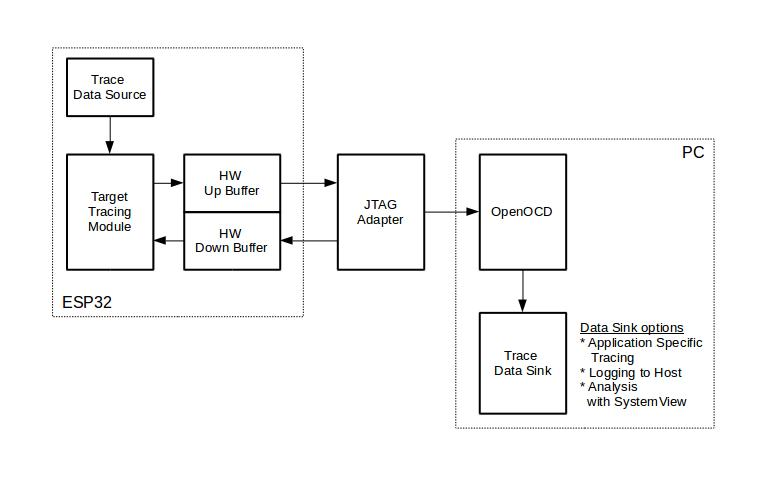

应用层跟踪传输 (apptrace)
=========================

:link_to_translation:`en:[English]`

**应用层跟踪** 库（``app_trace`` 组件）是 :doc:`esp_trace <index>` 跟踪系统默认使用的传输方式。可在程序运行开销很小的前提下，通过 JTAG 或 UART 接口在主机和 {IDF_TARGET_NAME} 之间传输任意数据。也可同时使用 JTAG 和 UART 接口。UART 接口主要用于连接 SEGGER SystemView 工具（参见 :doc:`sysview`）。基于 USB Serial JTAG 外设的跟踪由一个独立的传输提供，而非 apptrace。

本页介绍该传输方式本身，包括如何对其进行配置、如何通过其发送和接收任意应用程序数据，以及主机端用于收集数据的 OpenOCD 命令。基于该传输方式构建的更高级功能将在其他文档中介绍：

- 使用 SEGGER SystemView 进行系统行为分析：参见 :doc:`sysview`。
- 使用 Gcov 获取源代码覆盖率：参见 :doc:`gcov`。
- 接入你自己的跟踪记录器：参见 :doc:`custom-trace-library`。

概述
----

开发人员可以使用这一功能库将应用程序的运行状态发送给主机，在运行时接收来自主机的命令或者其他类型的信息。该库独立使用时的主要使用场景有：

1. 收集来自特定应用程序的数据。具体请参阅 :ref:`app_trace-application-specific-tracing`。
2. 记录到主机的轻量级日志。具体请参阅 :ref:`app_trace-logging-to-host`。

使用 JTAG 接口的跟踪组件工作示意图如下所示：

    使用 JTAG 接口的跟踪组件

运行模式
--------

该库支持两种运行模式：

**后验模式：** 后验模式为默认模式，该模式不需要和主机进行交互。在这种模式下，跟踪模块不会检查主机是否已经从 *HW UP BUFFER* 缓冲区读走所有数据，而是直接使用新数据覆盖旧数据。如果用户仅对最新的跟踪数据感兴趣，例如想要分析程序在崩溃之前的行为，则推荐使用该模式。主机可以稍后根据用户的请求来读取数据，例如在使用 JTAG 接口的情况下，通过特殊的 OpenOCD 命令进行读取。

**流模式：** 当主机连接到 {IDF_TARGET_NAME} 时，跟踪模块会进入此模式。在这种模式下，跟踪模块在新数据写入 *HW UP BUFFER* 之前会检查其中是否有足够的空间，并在必要的时候等待主机读取数据并释放足够的内存。最大等待时间是由用户传递给相应 API 函数的超时时间参数决定的。因此当应用程序尝试使用有限的最大等待时间值来将数据写入跟踪缓冲区时，这些数据可能会被丢弃。尤其需要注意的是，如果在对时效要求严格的代码中（如中断处理函数、操作系统调度等）指定了无限的超时时间，将会导致系统故障。

配置选项与依赖项
----------------

使用此功能需要在主机端和目标端进行以下配置：

1. **主机端：** 应用程序跟踪通过 JTAG 来完成，因此需要在主机上安装并运行 OpenOCD。详细信息请参阅 :doc:`JTAG 调试 </api-guides/jtag-debugging/index>`。

2. **目标端：** 在 menuconfig 中开启应用程序跟踪功能。**重要提示：** 须首先通过 ``Component config`` > ``ESP Trace Configuration`` > ``Trace transport`` 并选择 ``ESP-IDF apptrace`` 启用应用程序跟踪。之后，可以在 ``Component config`` > ``ESP Trace Configuration`` > ``Application Level Tracing`` 中进行详细配置，例如配置跟踪数据的传输目标。对于 UART 接口，需定义端口号、波特率、TX 和 RX 管脚及其他相关参数。当选择任何跟踪库（例如 SEGGER SystemView）时，这些配置也将同步用于该库。

.. note::

   为了实现更高的数据速率并降低丢包率，建议优化 JTAG 的时钟频率，使其达到能够稳定运行的最大值。详细信息请参阅 :ref:`jtag-debugging-tip-optimize-jtag-speed`。

以下为前述未提及的另外几个 menuconfig 选项：

1. *Threshold for flushing last trace data to host on panic* (:ref:`CONFIG_APPTRACE_POSTMORTEM_FLUSH_THRESH`)。使用 JTAG 接口时，此选项是必选项。在该模式下，跟踪数据以 16 KB 数据块的形式暴露给主机。在后验模式中，一个块被填充后会被暴露给主机，同时之前的块不再可用。也就是说，跟踪数据以 16 KB 的粒度进行覆盖。发生 Panic 时，当前输入块的最新数据将会被暴露给主机，主机可以读取数据以进行后续分析。如果系统发生 Panic 时，仍有少量数据还没来得及暴露给主机，那么之前收集的 16 KB 数据将丢失，主机只能获取少部分的最新跟踪数据，从而可能无法诊断问题。此 menuconfig 选项有助于避免此类情况，它可以控制发生 Panic 时刷新数据的阈值。例如，可以设置需要不少于 512 字节的最新跟踪数据，如果在发生 Panic 时待处理的数据少于 512 字节，则数据不会被刷新，也不会覆盖之前的 16 KB 数据。该选项仅在后验模式和使用 JTAG 工作时可发挥作用。

2. *Timeout for flushing last trace data to host on panic* (:ref:`CONFIG_APPTRACE_ONPANIC_HOST_FLUSH_TMO`)。该选项仅在流模式下才可发挥作用，它可用于控制跟踪模块在发生 Panic 时等待主机读取最新数据的最长时间。

3. *Internal Sync Lock* (:ref:`CONFIG_APPTRACE_LOCK_ENABLE`)。启用此选项可使用锁保护跟踪缓冲区的写入操作，防止多个任务并发生成跟踪数据时发生数据损坏。

4. *UART RX/TX ring buffer size* (:ref:`CONFIG_APPTRACE_UART_TX_BUFF_SIZE`)。缓冲区的大小取决于通过 UART 传输的数据量。

5. *UART TX message size* (:ref:`CONFIG_APPTRACE_UART_TX_MSG_SIZE`)。要传输的单条消息的最大尺寸。

如何使用此库
--------------

该库提供了用于在主机和 {IDF_TARGET_NAME} 之间传输任意数据的 API。在 menuconfig 中启用该库后，应用程序跟踪模块会在系统启动期间使用 menuconfig 配置自动初始化。随后可以调用相应的 API 来发送、接收或者刷新数据。

用户可选择通过实现弱回调函数 :cpp:func:`esp_apptrace_get_user_params()` 来覆盖默认配置。该函数仅在未选择任何跟踪库时生效，此时，仅应用层跟踪库（``app_trace`` 组件）独立运行。否则，系统将调用 :cpp:func:`esp_trace_get_user_params()` 来覆盖默认配置。

快速入门
---------

1. 独立使用应用层跟踪 API

   在 menuconfig 中禁用跟踪库并启用应用层跟踪传输：

   - ``Component config`` > ``ESP Trace Configuration`` > ``Trace library``：选择 ``None``
   - ``Component config`` > ``ESP Trace Configuration`` > ``Trace transport``：选择 ``ESP-IDF apptrace``

   也可在 ``sdkconfig.defaults`` 中设置以下选项以强制启用独立模式：

   .. code-block:: none

      CONFIG_ESP_TRACE_ENABLE=y
      CONFIG_ESP_TRACE_LIB_NONE=y
      CONFIG_ESP_TRACE_TRANSPORT_APPTRACE=y

   通过上述任一方式启用独立应用层跟踪传输后，即可在 ``Component config`` > ``ESP Trace Configuration`` > ``Application Level Tracing`` 中配置目标传输。

2. 通过 ``esp_apptrace_get_user_params()`` 进行运行时配置

   - 如果在 Kconfig 中选择 ``All (runtime selection)`` （即 ``APPTRACE_DEST_ALL``），可通过回调函数在运行时切换 JTAG 和 UART 并调整其参数。
   - 如果在 Kconfig 中选定单一目标（JTAG 或 UART），回调函数可在运行时覆盖该目标的参数，但无法切换目标类型。

.. note::

    应用程序跟踪也可作为 esp_trace 库的传输适配器。在这种情况下，应用层跟踪库不会被直接使用，而是通过已选择的 esp_trace 库及其 API 间接使用。参见 :doc:`index`。

.. note::

    以下代码示例适用于应用层跟踪库独立运行（未绑定任何跟踪库）的场景。

.. _app_trace-application-specific-tracing:

特定应用程序的跟踪
^^^^^^^^^^^^^^^^^^^^^^^^^^^^

通常，需要决定在每个方向上待传输数据的类型以及如何解析（处理）这些数据。要想在目标和主机之间传输数据，则需执行以下几个步骤：

1. **配置：** 应用程序跟踪会在系统启动期间使用 menuconfig 配置自动初始化。如需在运行时覆盖默认配置（例如使用自定义的 UART 引脚），可实现 :cpp:func:`esp_apptrace_get_user_params()` 回调函数：

    .. code-block:: c

        #include "esp_app_trace.h"

        esp_apptrace_config_t *esp_apptrace_get_user_params(void)
        {
            esp_apptrace_config_t config = APPTRACE_CONFIG_DEFAULT();

            // 根据需要自定义配置
            // 例如，使用不同的 UART 引脚：
            config.dest_cfg.uart.tx_pin_num = GPIO_NUM_17;
            config.dest_cfg.uart.rx_pin_num = GPIO_NUM_16;

            return config;
        }

    .. note::

        此回调函数为可选项。仅当需要覆盖 menuconfig 设置时才需实现。对于大多数使用场景，通过 menuconfig 配置即可满足需求。

2. 在目标设备端，用户需实现将跟踪数据写入主机的算法。下方代码片段展示了实现示例。

   .. code-block:: c

       #include "esp_app_trace.h"
       ...
       char buf[] = "Hello World!";
       esp_err_t res = esp_apptrace_write(buf, strlen(buf), ESP_APPTRACE_TMO_INFINITE);
       if (res != ESP_OK) {
           ESP_LOGE(TAG, "Failed to write data to host!");
           return res;
       }

   函数 :cpp:func:`esp_apptrace_write()` 通过 memcpy 将用户数据复制到内部缓冲区。在某些情况下，使用 :cpp:func:`esp_apptrace_buffer_get()` 和 :cpp:func:`esp_apptrace_buffer_put()` 函数可能是更优的选择。这两个函数允许开发者自行分配缓冲区并填充数据。以下代码片段展示了具体实现方法。

   .. code-block:: c

      #include "esp_app_trace.h"
      ...
      int number = 10;
      char *ptr = (char *)esp_apptrace_buffer_get(32, 100/*超时，单位：微秒*/);
      if (ptr == NULL) {
          ESP_LOGE(TAG, "Failed to get buffer!");
          return ESP_FAIL;
      }
      sprintf(ptr, "Here is the number %d", number);
      esp_err_t res = esp_apptrace_buffer_put(ptr, 100/*超时，单位：微秒*/);
      if (res != ESP_OK) {
          /* 如果发生错误，主机端跟踪工具（如 OpenOCD）会报告用户缓冲区未完整传输 */
          ESP_LOGE(TAG, "Failed to put buffer!");
          return res;
      }

   如需要从主机接收数据，下面的代码片段展示了如何实现此功能。

   .. code-block:: c

      #include "esp_app_trace.h"
      ...
      char buf[32];
      char down_buf[32];
      size_t sz = sizeof(buf);

      /* 配置下行缓冲区 */
      esp_err_t res = esp_apptrace_down_buffer_config(down_buf, sizeof(down_buf));
      if (res != ESP_OK) {
          ESP_LOGE(TAG, "Failed to config down buffer!");
          return res;
      }
      /* 检查是否有传入数据；若有则读取 */
      res = esp_apptrace_read(buf, &sz, 0/*不等待*/);
      if (res != ESP_OK) {
          ESP_LOGE(TAG, "Failed to read data from host!");
          return res;
      }
      if (sz > 0) {
          /* 已收到数据，进行处理 */
          ...
      }

   函数 :cpp:func:`esp_apptrace_read()` 通过 memcpy 将主机数据复制到用户缓冲区。在某些情况下，使用 :cpp:func:`esp_apptrace_down_buffer_get()` 和 :cpp:func:`esp_apptrace_down_buffer_put()` 函数可能是更优的选择。这两个函数允许开发者直接占用读取缓冲区的数据块并进行原地处理。以下代码片段展示了具体实现方法。

   .. code-block:: c

      #include "esp_app_trace.h"
      ...
      char down_buf[32];
      uint32_t *number;
      size_t sz = 32;

      /* 配置下行缓冲区 */
      esp_err_t res = esp_apptrace_down_buffer_config(down_buf, sizeof(down_buf));
      if (res != ESP_OK) {
          ESP_LOGE(TAG, "Failed to config down buffer!");
          return res;
      }
      char *ptr = (char *)esp_apptrace_down_buffer_get(&sz, 100/*超时，单位：微秒*/);
      if (ptr == NULL) {
          ESP_LOGE(TAG, "Failed to get buffer!");
          return ESP_FAIL;
      }
      if (sz > 4) {
          number = (uint32_t *)ptr;
          printf("Here is the number %d", *number);
      } else {
          printf("No data");
      }
      res = esp_apptrace_down_buffer_put(ptr, 100/*超时，单位：微秒*/);
      if (res != ESP_OK) {
          /* 如果发生错误，主机端跟踪工具（如 OpenOCD）会报告用户缓冲区未完整传输 */
          ESP_LOGE(TAG, "Failed to put buffer!");
          return res;
      }

3. 下一步是编译应用程序的镜像，并将其下载到目标板上。这一步可以参考文档 :ref:`构建并烧写 <get-started-build>`。

4. 运行 OpenOCD（参见 :doc:`JTAG 调试 </api-guides/jtag-debugging/index>`）。

5. 连接到 OpenOCD 的 telnet 服务器。用户可在终端执行命令 ``telnet <oocd_host> 4444``。如果用户是在运行 OpenOCD 的同一台机器上打开 telnet 会话，可以使用 ``localhost`` 替换上面命令中的 ``<oocd_host>``。

6. 使用特殊的 OpenOCD 命令开始收集跟踪数据。此命令将传输跟踪数据并将其重定向到指定的文件或套接字。相关命令的说明，请参阅 `OpenOCD 应用程序跟踪命令`_。

7. 最后，处理接收到的数据。由于数据格式由用户自己定义，本文档中省略数据处理的具体流程。数据处理的范例可以参考位于 ``$IDF_PATH/tools/esp_app_trace`` 下的 Python 脚本 ``sysviewtrace_proc.py`` （用于功能测试）和 ``logtrace_proc.py`` （请参阅 :ref:`app_trace-logging-to-host` 章节中的详细信息）。

OpenOCD 应用程序跟踪命令
""""""""""""""""""""""""""""""

*HW UP BUFFER* 在用户数据块之间共享，并且会代替 API 调用者（在任务或者中断上下文中）填充分配到的内存。在多线程环境中，正在填充缓冲区的任务/中断可能会被另一个高优先级的任务/中断抢占，因此主机可能会读取到还未准备好的用户数据。对此，跟踪模块在所有用户数据块之前添加一个数据头，其中包含有分配的用户缓冲区的大小（2 字节）和实际写入的数据长度（2 字节），也就是说数据头总共长 4 字节。负责读取跟踪数据的 OpenOCD 命令在读取到不完整的用户数据块时会报错，但是无论如何，它都会将整个用户数据块（包括还未填充的区域）的内容放到输出文件中。

下文介绍了如何使用 OpenOCD 应用程序跟踪命令。

.. note::

    目前，OpenOCD 还不支持将任意用户数据发送到目标的命令。

命令用法：

``esp apptrace [start <options>] | [stop] | [status] | [dump <cores_num> <outfile>]``

子命令：

``start``
    开始跟踪（连续流模式）。
``stop``
    停止跟踪。
``status``
    获取跟踪状态。
``dump``
    转储所有后验模式的数据。

Start 子命令的语法：

  ``start <outfile> [poll_period [trace_size [stop_tmo [wait4halt [skip_size]]]]``

``outfile``
    用于保存来自两个 CPU 的数据文件的路径，该参数需要具有以下格式： ``file://path/to/file``。
``poll_period``
    轮询跟踪数据的周期（单位：毫秒），如果大于 0 则以非阻塞模式运行。默认为 1 毫秒。
``trace_size``
    最多要收集的数据量（单位：字节），接收到指定数量的数据后将会停止跟踪。默认为 -1（禁用跟踪大小停止触发器）。
``stop_tmo``
    空闲超时（单位：秒），如果指定的时间段内都没有数据就会停止跟踪。默认为 -1（禁用跟踪超时停止触发器）。还可以将其设置为比目标跟踪命令之间的最长暂停值更长的值（可选）。
``wait4halt``
    如果设置为 0 则立即开始跟踪，否则命令会先等待目标停止（复位、打断点等），然后对其进行自动恢复并开始跟踪。默认值为 0。
``skip_size``
    开始时要跳过的字节数，默认为 0。

.. note::

    如果 ``poll_period`` 为 0，则在跟踪停止之前，OpenOCD 的 telnet 命令将不可用。必须通过复位电路板或者在 OpenOCD 的窗口中（非 telnet 会话窗口）使用快捷键 Ctrl+C。另一种选择是设置 ``trace_size`` 并等待，当收集到指定数据量时，跟踪会自动停止。

命令使用示例：

.. highlight:: none

1.  将 2048 个字节的跟踪数据收集到 ``trace.log`` 文件中，该文件将保存在 ``openocd-esp32`` 目录中。

    ::

        esp apptrace start file://trace.log 1 2048 5 0 0

    跟踪数据会被检索并以非阻塞的模式保存到文件中，如果收集满 2048 字节的数据或者在 5 秒内都没有新的数据，那么该过程就会停止。

    .. note::

        在将数据提供给 OpenOCD 之前，会对其进行缓冲。如果看到 “Data timeout!” 的消息，则表示目标可能在超时之前没有向 OpenOCD 发送足够的数据以清空缓冲区。要解决这个问题，可以增加超时时间或者使用函数 ``esp_apptrace_flush()`` 以特定间隔刷新数据。

2.  在非阻塞模式下无限地检索跟踪数据。

    ::

        esp apptrace start file://trace.log 1 -1 -1 0 0

    对收集数据的大小没有限制，也不设置超时时间。要停止此过程，可以在 OpenOCD 的 telnet 会话窗口中发送 ``esp apptrace stop`` 命令，或者在 OpenOCD 窗口中使用快捷键 Ctrl+C。

3.  检索跟踪数据并无限期保存。

    ::

        esp apptrace start file://trace.log 0 -1 -1 0 0

    在跟踪停止之前，OpenOCD 的 telnet 会话窗口将不可用。要停止跟踪，请在 OpenOCD 的窗口中使用快捷键 Ctrl+C。

4.  等待目标停止，然后恢复目标的操作并开始检索数据。当收集满 2048 字节的数据后就停止：

    ::

        esp apptrace start file://trace.log 0 2048 -1 1 0

    想要复位后立即开始跟踪，请使用 OpenOCD 的 ``reset halt`` 命令。

.. _app_trace-logging-to-host:

记录日志到主机
^^^^^^^^^^^^^^

记录日志到主机是 ESP-IDF 中一个非常实用的功能：通过应用层跟踪库将日志保存到主机端。某种程度上，这也算是一种半主机 (semihosting) 机制，相较于调用 ``ESP_LOGx`` 将待打印的字符串发送到 UART 的日志记录方式，此功能将大部分工作转移到了主机端，从而减少了本地工作量。

ESP-IDF 的日志库会默认使用类 vprintf 的函数将格式化的字符串输出到专用的 UART，一般来说涉及以下几个步骤：

1. 解析格式字符串以获取每个参数的类型。
2. 根据其类型，将每个参数都转换为字符串。
3. 格式字符串与转换后的参数一起发送到 UART。

虽然可以对类 vprintf 函数进行一定程度的优化，但由于在任何情况下都必须执行上述步骤，并且每个步骤都会消耗一定的时间（尤其是步骤 3），所以经常会发生以下这种情况：向程序中添加额外的打印信息以诊断问题，却改变了应用程序的行为，使得问题无法复现。在最严重的情况下，程序无法正常工作，最终导致报错甚至挂起。

想要解决此类问题，可以使用更高的波特率或者其他更快的接口，并将字符串格式化的工作转移到主机端。

通过应用层跟踪库的 ``esp_apptrace_vprintf`` 函数，可以将日志信息发送到主机，该函数不执行格式字符串和参数的完全解析，而仅仅计算传递参数的数量，并将它们与格式字符串地址一起发送给主机。主机端会通过一个特殊的 Python 脚本来处理并打印接收到的日志数据。

局限
""""

目前通过 JTAG 实现记录日志还存在以下几点局限：

1. 不支持使用 ``ESP_EARLY_LOGx`` 宏进行跟踪。
2. 不支持大小超过 4 字节的 printf 参数（例如 ``double`` 和 ``uint64_t``）。
3. 仅支持 .rodata 段中的格式字符串和参数。
4. 最多支持 256 个 printf 参数。

如何使用
""""""""

为了使用跟踪模块来记录日志，需要执行以下步骤：

1. 在 menuconfig 中开启应用程序跟踪功能。须首先通过 ``Component config`` > ``ESP Trace Configuration`` > ``Trace transport`` 并选择 ``ESP-IDF apptrace`` 启用应用程序跟踪。之后，可以在 ``Component config`` > ``ESP Trace Configuration`` > ``Application Level Tracing`` 中进行详细配置。
2. 在目标端，需要安装特殊的类 vprintf 函数 :cpp:func:`esp_apptrace_vprintf`，该函数负责将日志数据发送给主机，使用方法为 ``esp_log_set_vprintf(esp_apptrace_vprintf);``。如需将日志数据再次重定向给 UART，请使用 ``esp_log_set_vprintf(vprintf);``。
3. 按照 :ref:`app_trace-application-specific-tracing` 章节中的第 4-6 步进行操作（OpenOCD 设置和跟踪数据收集）。
4. 打印接收到的日志记录，请在终端运行以下命令：``$IDF_PATH/tools/esp_app_trace/logtrace_proc.py /path/to/trace/file /path/to/program/elf/file``。

Log Trace Processor 命令选项
~~~~~~~~~~~~~~~~~~~~~~~~~~~~

命令用法：

``logtrace_proc.py [-h] [--no-errors] <trace_file> <elf_file>``

位置参数（必要）：

``trace_file``
    日志跟踪文件的路径。
``elf_file``
    程序 ELF 文件的路径。

可选参数：

``-h``, ``--help``
    显示此帮助信息并退出。
``--no-errors``, ``-n``
    不打印错误信息。

应用示例
--------

- :example:`system/app_trace_basic` 演示如何使用应用层跟踪库通过 JTAG 将日志消息记录到主机，作为 UART 日志的更快替代方案。
- :example:`system/app_trace_to_plot` 演示如何通过 JTAG 向主机发送并绘制虚拟传感器数据。

API 参考
--------

传输 API 请参阅 :doc:`/api-reference/system/app_trace`。高层 ``esp_trace`` API 请参阅 :doc:`/api-reference/system/esp_trace`。
