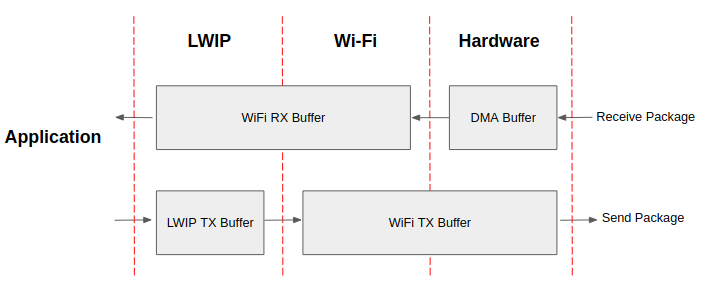

Wi-Fi 驱动程序
==================

:link_to_translation:`en:[English]`

{IDF_TARGET_MAX_CONN_STA_NUM:default="15", esp32c2="4", esp32c3="10", esp32c6="10"}

{IDF_TARGET_SUB_MAX_NUM_FROM_KEYS:default="2", esp32c3="7", esp32c6="7"}

{IDF_TARGET_NAME} Wi-Fi 功能列表
------------------------------------

{IDF_TARGET_NAME} 支持以下 Wi-Fi 功能：

.. only:: esp32 or esp32s2 or esp32c3 or esp32s3

    - 支持 4 个虚拟接口，即 STA、AP、Sniffer 和 reserved。
    - 支持仅 station 模式、仅 AP 模式、station/AP 共存模式
    - 支持使用 IEEE 802.11b、IEEE 802.11g、IEEE 802.11n 和 API 配置协议模式
    - 支持 WPA/WPA2/WPA3/WPA2-企业版/WPA3-企业版/WAPI/WPS 和 DPP
    - 支持 AMSDU、AMPDU、HT40、QoS 以及其它主要功能
    - 支持 Modem-sleep
    - 支持乐鑫专属协议，可实现 **1 km** 数据通信量
    - 空中数据传输最高可达 20 MBit/s TCP 吞吐量和 30 MBit/s UDP 吞吐量
    - 支持 Sniffer
    - 支持快速扫描和全信道扫描
    - 支持多个天线
    - 支持获取信道状态信息

.. only:: esp32c6

    - 支持 4 个虚拟接口，即 STA、AP、Sniffer 和 reserved。
    - 支持仅 station 模式、仅 AP 模式、station/AP 共存模式
    - 支持使用 IEEE 802.11b、IEEE 802.11g、IEEE 802.11n、IEEE 802.11ax 和 API 配置协议模式
    - 支持 WPA/WPA2/WPA3/WPA2-企业版/WPA3-企业版/WAPI/WPS 和 DPP
    - 支持 AMSDU、AMPDU、HT40、QoS 以及其它主要功能
    - 支持 Modem-sleep
    - 支持乐鑫专属协议，可实现 **1 km** 数据通信量
    - 空中数据传输最高可达 20 MBit/s TCP 吞吐量和 30 MBit/s UDP 吞吐量
    - 支持 Sniffer
    - 支持快速扫描和全信道扫描
    - 支持多个天线
    - 支持获取信道状态信息
    - 支持 TWT
    - 支持下行 MU-MIMO
    - 支持 OFDMA
    - 支持 BSS Color

.. only:: esp32c2

    - 支持 3 个虚拟接口，即 STA、AP 和 Sniffer。
    - 支持仅 station 模式、仅 AP 模式、station/AP 共存模式
    - 支持使用 IEEE 802.11b、IEEE 802.11g、IEEE 802.11n 和 API 配置协议模式
    - 支持 WPA/WPA2/WPA3/WPA2-企业版/WPA3-企业版/WPS 和 DPP
    - 支持 AMPDU、QoS 以及其它主要功能
    - 支持 Modem-sleep
    - 空中数据传输最高可达 20 MBit/s TCP 吞吐量和 30 MBit/s UDP 吞吐量
    - 支持 Sniffer
    - 支持快速扫描和全信道扫描
    - 支持多个天线

如何编写 Wi-Fi 应用程序
----------------------------------

准备工作
+++++++++++

一般来说，要编写自己的 Wi-Fi 应用程序，最高效的方式是先选择一个相似的应用程序示例，然后将其中可用的部分移植到自己的项目中。如果你希望编写一个强健的 Wi-Fi 应用程序，强烈建议在开始之前先阅读本文。**非强制要求，请依个人情况而定。**

本文将补充说明 Wi-Fi API 和 Wi-Fi 示例的相关信息，重点描述使用 Wi-Fi API 的原则、当前 Wi-Fi API 实现的限制以及使用 Wi-Fi 时的常见错误。同时，本文还介绍了 Wi-Fi 驱动程序的一些设计细节。建议选择一个示例 :example:`example <wifi>` 进行参考。

设置 Wi-Fi 编译时选项
++++++++++++++++++++++++++++++++++++

请参阅 `Wi-Fi menuconfig`_。

Wi-Fi 初始化
+++++++++++++++

请参阅 `{IDF_TARGET_NAME} Wi-Fi station 一般情况`_、`{IDF_TARGET_NAME} Wi-Fi AP 一般情况`_。

启动/连接 Wi-Fi
++++++++++++++++++++

请参阅 `{IDF_TARGET_NAME} Wi-Fi station 一般情况`_、`{IDF_TARGET_NAME} Wi-Fi AP 一般情况`_。

事件处理
++++++++++++++

通常，在理想环境下编写代码难度并不大，如 `WIFI_EVENT_STA_START`_、`WIFI_EVENT_STA_CONNECTED`_ 中所述。难度在于如何在现实的困难环境下编写代码，如 `WIFI_EVENT_STA_DISCONNECTED`_ 中所述。能否在后者情况下完美地解决各类事件冲突，是编写一个强健的 Wi-Fi 应用程序的根本。请参阅 `{IDF_TARGET_NAME} Wi-Fi 事件描述`_, `{IDF_TARGET_NAME} Wi-Fi station 一般情况`_, `{IDF_TARGET_NAME} Wi-Fi AP 一般情况`_。另可参阅 ESP-IDF 中的 :doc:`事件处理概述 <../api-reference/system/esp_event>`。

编写错误恢复程序
++++++++++++++++++++++++++++++++++++++++++++++++++++

除了能在比较差的环境下工作，错误恢复能力也对一个强健的 Wi-Fi 应用程序至关重要。请参阅 `{IDF_TARGET_NAME} Wi-Fi API 错误代码`_。

{IDF_TARGET_NAME} Wi-Fi API 错误代码
--------------------------------------

所有 {IDF_TARGET_NAME} Wi-Fi API 都有定义好的返回值，即错误代码。这些错误代码可分类为：

 - 无错误，例如：返回值 :c:macro:`ESP_OK` 代表 API 成功返回
 - 可恢复错误，例如：:c:macro:`ESP_ERR_NO_MEM`
 - 不可恢复的非关键性错误
 - 不可恢复的关键性错误

一个错误是否为关键性取决于其 API 和应用场景，并且由 API 用户定义。

**要使用 Wi-Fi API 编写一个强健的应用程序，根本原则便是要时刻检查错误代码并编写相应的错误处理代码。** 一般来说，错误处理代码可用于解决：

 - 可恢复错误，你可以编写一个可恢复错误处理代码解决该类错误。例如，当 :cpp:func:`esp_wifi_start()` 返回 :c:macro:`ESP_ERR_NO_MEM` 时，调用可恢复错误处理代码 vTaskDelay 可以获取几微秒的重试时间。
 - 不可恢复非关键性错误，打印错误代码可以帮助你更好地处理该类错误。
 - 不可恢复关键性错误，可使用 "assert" 语句处理该类错误。例如，如果 :cpp:func:`esp_wifi_set_mode()` 返回 ``ESP_ERR_WIFI_NOT_INIT`` :cpp:func:`esp_wifi_init()` 未成功初始化 Wi-Fi 驱动程序。你可以在应用程序开发阶段非常快速地检测到此类错误。

在 :component_file:`esp_common/include/esp_err.h` 中， ``ESP_ERROR_CHECK`` 负责检查返回值。这是一个较为常见的错误处理代码，可在应用程序开发阶段作为默认的错误处理代码。但是，我们强烈建议 API 的使用者编写自己的错误处理代码。

初始化 {IDF_TARGET_NAME} Wi-Fi API 参数
----------------------------------------------------

初始化 API 的结构参数时，应遵循以下两种方式之一：

- 设置该参数的所有字段
- 先使用 get API 获取当前配置，然后只设置特定于应用程序的字段

初始化或获取整个结构这一步至关重要，因为大多数情况下，返回值 0 意味着程序使用了默认值。未来，我们将会在该结构中加入更多字段，并将这些字段初始化为 0，确保即使 ESP-IDF 版本升级后，你的应用程序依然能够正常运行。

.. _wifi-programming-model:

{IDF_TARGET_NAME} Wi-Fi 编程模型
-----------------------------------------

{IDF_TARGET_NAME} Wi-Fi 编程模型如下图所示：

.. blockdiag::
    :caption: Wi-Fi 编程模型
    :align: center

    blockdiag wifi-programming-model {

        # global attributes
        node_height = 60;
        node_width = 100;
        span_width = 100;
        span_height = 60;
        default_shape = roundedbox;
        default_group_color = none;

        # node labels
        TCP_STACK [label="TCP\n stack", fontsize=12];
        EVNT_TASK [label="Event\n task", fontsize=12];
        APPL_TASK [label="Application\n task", width = 120, fontsize=12];
        WIFI_DRV  [label="Wi-Fi\n Driver", width = 120, fontsize=12];
        KNOT [shape=none];

        # node connections + labels
        TCP_STACK -> EVNT_TASK [label=event];
        EVNT_TASK -> APPL_TASK [label="callback\n or event"];

        # arrange nodes vertically
        group {
           label = "default handler";
           orientation = portrait;
           EVNT_TASK <- WIFI_DRV [label=event];
        }

        # intermediate node
        group {
            label = "user handler";
            orientation = portrait;
            APPL_TASK -- KNOT;
        }
        WIFI_DRV <- KNOT [label="API\n call"];
    }

Wi-Fi 驱动程序可以看作是一个无法感知上层代码（如 TCP/IP 堆栈、应用程序任务、事件任务等）的黑匣子。通常，应用程序任务（代码）负责调用 :doc:`Wi-Fi 驱动程序 APIs <../api-reference/network/esp_wifi>` 来初始化 Wi-Fi，并在必要时处理 Wi-Fi 事件。然后，Wi-Fi 驱动程序接收并处理 API 数据，并在应用程序中插入事件。

Wi-Fi 事件处理是在 :doc:`esp_event 库 <../api-reference/system/esp_event>` 的基础上进行的。Wi-Fi 驱动程序将事件发送至 :ref:`默认事件循环 <esp-event-default-loops>`，应用程序便可以使用 :cpp:func:`esp_event_handler_register()` 中的回调函数处理这些事件。除此之外，:doc:`esp_netif 组件 <../api-reference/network/esp_netif>` 也负责处理 Wi-Fi 事件，并产生一系列默认行为。例如，当 Wi-Fi station 连接至一个 AP 时，esp_netif 将自动开启 DHCP 客户端服务（系统默认）。

{IDF_TARGET_NAME} Wi-Fi 事件描述
-----------------------------------------

WIFI_EVENT_WIFI_READY
++++++++++++++++++++++++++++++++++++

Wi-Fi 驱动程序永远不会生成此事件，因此，应用程序的事件回调函数可忽略此事件。在未来的版本中，此事件可能会被移除。

WIFI_EVENT_SCAN_DONE
++++++++++++++++++++++++++++++++++++

扫描完成事件，由 :cpp:func:`esp_wifi_scan_start()` 函数触发，将在以下情况下产生：

  - 扫描已完成，例如：Wi-Fi 已成功找到目标 AP 或已扫描所有信道。
  - 当前扫描因函数 :cpp:func:`esp_wifi_scan_stop()` 而终止。
  - 在当前扫描完成之前调用了函数 :cpp:func:`esp_wifi_scan_start()`。此时，新的扫描将覆盖当前扫描过程，并生成一个扫描完成事件。

以下情况下将不会产生扫描完成事件：

  - 当前扫描被阻止。
  - 当前扫描是由函数 :cpp:func:`esp_wifi_connect()` 触发的。

接收到此事件后，事件任务暂不做任何响应。首先，应用程序的事件回调函数需调用 :cpp:func:`esp_wifi_scan_get_ap_num()` 和 :cpp:func:`esp_wifi_scan_get_ap_records()` 获取已扫描的 AP 列表，然后触发 Wi-Fi 驱动程序释放在扫描过程中占用的内存空间（**切记该步骤**）。
更多详细信息，请参阅 `{IDF_TARGET_NAME} Wi-Fi 扫描`_。

WIFI_EVENT_STA_START
++++++++++++++++++++++++++++++++++++

如果调用函数 :cpp:func:`esp_wifi_start()` 后接收到返回值 :c:macro:`ESP_OK`，且当前 Wi-Fi 处于 station 或 station/AP 共存模式，则将产生此事件。接收到此事件后，事件任务将初始化 LwIP 网络接口 (netif)。通常，应用程序的事件回调函数需调用 :cpp:func:`esp_wifi_connect()` 来连接已配置的 AP。

WIFI_EVENT_STA_STOP
++++++++++++++++++++++++++++++++++++

如果调用函数 :cpp:func:`esp_wifi_stop()` 后接收到返回值 :c:macro:`ESP_OK`，且当前 Wi-Fi 处于 station 或 station/AP 共存模式，则将产生此事件。接收到此事件后，事件任务将进行释放 station IP 地址、终止 DHCP 客户端服务、移除 TCP/UDP 相关连接并清除 LwIP station netif 等动作。此时，应用程序的事件回调函数通常不需做任何响应。

WIFI_EVENT_STA_CONNECTED
++++++++++++++++++++++++++++++++++++

如果调用函数 :cpp:func:`esp_wifi_connect()` 后接收到返回值 :c:macro:`ESP_OK`，且 station 已成功连接目标 AP，则将产生此连接事件。接收到此事件后，事件任务将启动 DHCP 客户端服务并开始获取 IP 地址。此时，Wi-Fi 驱动程序已准备就绪，可发送和接收数据。如果你的应用程序不依赖于 LwIP（即 IP 地址），则此刻便可以开始应用程序开发工作。但是，如果你的应用程序需基于 LwIP 进行，则还需等待 *got ip* 事件发生后才可开始。

WIFI_EVENT_STA_DISCONNECTED
++++++++++++++++++++++++++++++++++++

此事件将在以下情况下产生：

  - 调用了函数 :cpp:func:`esp_wifi_disconnect()` 或 :cpp:func:`esp_wifi_stop()`，且 Wi-Fi station 已成功连接至 AP。
  - 调用了函数 :cpp:func:`esp_wifi_connect()`，但 Wi-Fi 驱动程序因为某些原因未能成功连接至 AP，例如：未扫描到目标 AP、验证超时等。或存在多个 SSID 相同的 AP，station 无法连接所有已找到的 AP，也将产生该事件。
  - Wi-Fi 连接因为某些原因而中断，例如：station 连续多次丢失 N beacon、AP 踢掉 station、AP 认证模式改变等。

接收到此事件后，事件任务的默认动作为：

  - 关闭 station 的 LwIP netif。
  - 通知 LwIP 任务清除导致所有套接字状态错误的 UDP/TCP 连接。针对基于套接字编写的应用程序，其回调函数可以在接收到此事件时（如有必要）关闭并重新创建所有套接字。

应用程序处理此事件最常用的方法为：调用函数 :cpp:func:`esp_wifi_connect()` 重新连接 Wi-Fi。但是，如果此事件是由函数 :cpp:func:`esp_wifi_disconnect()` 引发的，则应用程序不应调用 :cpp:func:`esp_wifi_connect()` 来重新连接。应用程序须明确区分此事件的引发原因，因为某些情况下应使用其它更好的方式进行重新连接。请参阅 `Wi-Fi 重新连接`_ 和 `连接 Wi-Fi 时扫描`_。

需要注意的另一点是：接收到此事件后，LwIP 的默认动作是终止所有 TCP 套接字连接。大多数情况下，该动作不会造成影响。但对某些特殊应用程序可能除外。例如：

- 应用程序创建一个了 TCP 连接，以维护每 60 秒发送一次的应用程序级、保持活动状态的数据。
- 由于某些原因，Wi-Fi 连接被切断并引发了 `WIFI_EVENT_STA_DISCONNECTED` 事件。根据当前实现，此时所有 TCP 连接都将被移除，且保持活动的套接字将处于错误的状态中。但是，由于应用程序设计者认为网络层 **不应** 考虑这个 Wi-Fi 层的错误，因此应用程序不会关闭套接字。
- 5 秒后，因为在应用程序的事件回调函数中调用了 :cpp:func:`esp_wifi_connect()`，Wi-Fi 连接恢复。**同时，station 连接至同一个 AP 并获得与之前相同的 IPV4 地址。**
- 60 秒后，当应用程序发送具有保持活动状态的套接字的数据时，套接字将返回错误，应用程序将关闭套接字并在必要时重新创建。

在上述场景中，理想状态下应用程序套接字和网络层将不会受到影响，因为在此过程中 Wi-Fi 连接只是短暂地断开然后快速恢复。应用程序可通过 LwIP menuconfig 启动“IP 改变时保持 TCP 连接”的功能。

IP_EVENT_STA_GOT_IP
++++++++++++++++++++++++++++++++++++

当 DHCP 客户端成功从 DHCP 服务器获取 IPV4 地址或 IPV4 地址发生改变时，将引发此事件。此事件意味着应用程序一切就绪，可以开始任务（如：创建套接字）。

IPV4 地址可能由于以下原因而发生改变：

  - DHCP 客户端无法重新获取/绑定 IPV4 地址，且 station 的 IPV4 重置为 0。
  - DHCP 客户端重新绑定了其它地址。
  - 静态配置的 IPV4 地址已发生改变。

函数 ``ip_event_got_ip_t`` 中的字段 ``ip_change`` 说明了 IPV4 地址是否发生改变。

套接字的状态是基于 IPV4 地址的，这意味着，如果 IPV4 地址发生改变，则所有与此 IPV4 相关的套接字都将变为异常。接收到此事件后，应用程序需关闭所有套接字，并在 IPV4 变为有效地址时重新创建应用程序。

IP_EVENT_GOT_IP6
++++++++++++++++++++++++++++++++++++

当 IPV6 SLAAC 支持自动为 {IDF_TARGET_NAME} 配置一个地址，或 {IDF_TARGET_NAME} 地址发生改变时，将引发此事件。此事件意味着应用程序一切就绪，可以开始任务（如：创建套接字）。

IP_EVENT_STA_LOST_IP
++++++++++++++++++++++++++++++++++++

当 IPV4 地址失效时，将引发此事件。

此事件不会在 Wi-Fi 断连后立刻出现。Wi-Fi 连接断开后，首先将启动一个 IPV4 地址丢失计时器，如果 station 在该计时器超时之前成功获取了 IPV4 地址，则不会发生此事件。否则，此事件将在计时器超时时发生。

一般来说，应用程序可忽略此事件。这只是一个调试事件，主要使应用程序获知 IPV4 地址已丢失。

WIFI_EVENT_AP_START
++++++++++++++++++++++++++++++++++++

与 `WIFI_EVENT_STA_START`_ 事件相似。

WIFI_EVENT_AP_STOP
++++++++++++++++++++++++++++++++++++

与 `WIFI_EVENT_STA_STOP`_ 事件相似。

WIFI_EVENT_AP_STACONNECTED
++++++++++++++++++++++++++++++++++++

每当有一个 station 成功连接 {IDF_TARGET_NAME} AP 时，将引发此事件。接收到此事件后，事件任务将不做任何响应，应用程序的回调函数也可忽略这一事件。但是，你可以在此时进行一些操作，例如：获取已连接 station 的信息等。

WIFI_EVENT_AP_STADISCONNECTED
++++++++++++++++++++++++++++++++++++

此事件将在以下情况下发生：

  - 应用程序通过调用函数 :cpp:func:`esp_wifi_disconnect()` 或 :cpp:func:`esp_wifi_deauth_sta()` 手动断开 station 连接。
  - Wi-Fi 驱动程序出于某些原因断开 station 连接，例如：AP 在过去 5 分钟（可通过函数 :cpp:func:`esp_wifi_set_inactive_time()` 修改该时间）内未接收到任何数据包等。
  - station 断开与 AP 之间的连接。

发生此事件时，事件任务将不做任何响应，但应用程序的事件回调函数需执行一些操作，例如：关闭与此 station 相关的套接字等。

WIFI_EVENT_AP_PROBEREQRECVED
++++++++++++++++++++++++++++++++++++

默认情况下，此事件处于禁用状态，应用程序可以通过调用 API :cpp:func:`esp_wifi_set_event_mask()` 启用。
启用后，每当 AP 接收到 probe request 时都将引发此事件。

WIFI_EVENT_STA_BEACON_TIMEOUT
++++++++++++++++++++++++++++++++++++

如果 station 在 inactive 时间内未收到所连接 AP 的 beacon，将发生 beacon 超时，将引发此事件。inactive 时间通过调用函数 :cpp:func:`esp_wifi_set_inactive_time()` 设置。

WIFI_EVENT_CONNECTIONLESS_MODULE_WAKE_INTERVAL_START
+++++++++++++++++++++++++++++++++++++++++++++++++++++++++

非连接模块在 `Interval` 开始时触发此事件。 请参考 :ref:`非连接模块功耗管理 <connectionless-module-power-save-cn>` 。

{IDF_TARGET_NAME} Wi-Fi station 一般情况
------------------------------------------------

下图为 station 模式下的宏观场景，其中包含不同阶段的具体描述：

.. seqdiag::
    :caption: station 模式下 Wi-Fi 事件场景示例
    :align: center

    seqdiag sample-scenarios-station-mode {
        activation = none;
        node_width = 80;
        node_height = 60;
        edge_length = 140;
        span_height = 5;
        default_shape = roundedbox;
        default_fontsize = 12;

        MAIN_TASK  [label = "Main\ntask"];
        APP_TASK   [label = "App\ntask"];
        EVENT_TASK [label = "Event\ntask"];
        LwIP_TASK  [label = "LwIP\ntask"];
        WIFI_TASK  [label = "Wi-Fi\ntask"];

        === 1. 初始化阶段 ===
        MAIN_TASK  ->  LwIP_TASK   [label="1.1> 创建/初始化 LwIP"];
        MAIN_TASK  ->  EVENT_TASK  [label="1.2> 创建/初始化事件"];
        MAIN_TASK  ->  WIFI_TASK   [label="1.3> 创建/初始化 Wi-Fi"];
        MAIN_TASK  ->  APP_TASK    [label="1.4> 创建应用程序任务"];
        === 2. 配置阶段 ===
        MAIN_TASK  ->  WIFI_TASK   [label="2> 配置 Wi-Fi"];
        === 3. 启动阶段 ===
        MAIN_TASK  ->  WIFI_TASK   [label="3.1> 启动 Wi-Fi"];
        EVENT_TASK <-  WIFI_TASK   [label="3.2> WIFI_EVENT_STA_START"];
        APP_TASK   <-  EVENT_TASK  [label="3.3> WIFI_EVENT_STA_START"];
        === 4. 连接阶段 ===
        APP_TASK   ->  WIFI_TASK   [label="4.1> 连接 Wi-Fi"];
        EVENT_TASK <-  WIFI_TASK   [label="4.2> WIFI_EVENT_STA_CONNECTED"];
        APP_TASK   <- EVENT_TASK   [label="4.3> WIFI_EVENT_STA_CONNECTED"];
        === 5. 获取 IP 阶段 ===
        EVENT_TASK ->  LwIP_TASK   [label="5.1> 启动 DHCP 客户端"];
        EVENT_TASK <-  LwIP_TASK   [label="5.2> IP_EVENT_STA_GOT_IP"];
        APP_TASK   <-  EVENT_TASK  [label="5.3> IP_EVENT_STA_GOT_IP"];
        APP_TASK   ->  APP_TASK    [label="5.4> 套接字相关初始化"];
        === 6. 断开阶段 ===
        EVENT_TASK <-  WIFI_TASK   [label="6.1> WIFI_EVENT_STA_DISCONNECTED"];
        APP_TASK   <-  EVENT_TASK  [label="6.2> WIFI_EVENT_STA_DISCONNECTED"];
        APP_TASK   ->  APP_TASK    [label="6.3> 断开处理"];
        === 7. IP 更改阶段 ===
        EVENT_TASK <-  LwIP_TASK   [label="7.1> IP_EVENT_STA_GOT_IP"];
        APP_TASK   <-  EVENT_TASK  [label="7.2> IP_EVENT_STA_GOT_IP"];
        APP_TASK   ->  APP_TASK    [label="7.3> 套接字错误处理"];
        === 8. 清理阶段 ===
        APP_TASK   ->  WIFI_TASK   [label="8.1> 断开 Wi-Fi 连接"];
        APP_TASK   ->  WIFI_TASK   [label="8.2> 终止 Wi-Fi"];
        APP_TASK   ->  WIFI_TASK   [label="8.3> 清理 Wi-Fi"];
    }

1. Wi-Fi/LwIP 初始化阶段
++++++++++++++++++++++++++++++

 - s1.1：主任务通过调用函数 :cpp:func:`esp_netif_init()` 创建一个 LwIP 核心任务，并初始化 LwIP 相关工作。

 - s1.2：主任务通过调用函数 :cpp:func:`esp_event_loop_create()` 创建一个系统事件任务，并初始化应用程序事件的回调函数。在此情况下，该回调函数唯一的动作就是将事件中继到应用程序任务中。

 - s1.3：主任务通过调用函数 :cpp:func:`esp_netif_create_default_wifi_ap()` 或 :cpp:func:`esp_netif_create_default_wifi_sta()` 创建有 TCP/IP 堆栈的默认网络接口实例绑定 station 或 AP。

 - s1.4：主任务通过调用函数 :cpp:func:`esp_wifi_init()` 创建 Wi-Fi 驱动程序任务，并初始化 Wi-Fi 驱动程序。

 - s1.5：主任务通过调用 OS API 创建应用程序任务。

推荐按照 s1.1 ~ s1.5 的步骤顺序针对基于 Wi-Fi/LwIP 的应用程序进行初始化。但这一顺序 **并非** 强制，你可以在第 s1.1 步创建应用程序任务，然后在该应用程序任务中进行所有其它初始化操作。不过，如果你的应用程序任务依赖套接字，那么在初始化阶段创建应用程序任务可能并不适用。此时，你可以在接收到 IP 后再进行任务创建。

2. Wi-Fi 配置阶段
+++++++++++++++++++++++++++++++

Wi-Fi 驱动程序初始化成功后，可以进入到配置阶段。该场景下，Wi-Fi 驱动程序处于 station 模式。因此，首先你需调用函数 :cpp:func:`esp_wifi_set_mode` (WIFI_MODE_STA) 将 Wi-Fi 模式配置为 station 模式。可通过调用其它 esp_wifi_set_xxx API 进行更多设置，例如：协议模式、国家代码、带宽等。请参阅 `{IDF_TARGET_NAME} Wi-Fi 配置`_。

一般情况下，我们会在建立 Wi-Fi 连接之前配置 Wi-Fi 驱动程序，但这 **并非** 强制要求。也就是说，只要 Wi-Fi 驱动程序已成功初始化，你可以在任意阶段进行配置。但是，如果你的 Wi-Fi 在建立连接后不需要更改配置，则应先在此阶段完成配置。因为调用配置 API（例如 :cpp:func:`esp_wifi_set_protocol()`）将会导致 Wi-Fi 连接断开，为操作带来不便。

如果 menuconfig 已使能 Wi-Fi NVS flash，则不论当前阶段还是后续的 Wi-Fi 配置信息都将被存储至该 flash 中。那么，当主板上电/重新启动时，就不需从头开始配置 Wi-Fi 驱动程序，只需调用函数 esp_wifi_get_xxx API 获取之前存储的配置信息。当然，如果不想使用之前的配置，你也可以重新配置 Wi-Fi 驱动程序。

3. Wi-Fi 启动阶段
++++++++++++++++++++++++++++++++

 - s3.1：调用函数 :cpp:func:`esp_wifi_start()` 启动 Wi-Fi 驱动程序。
 - s3.2：Wi-Fi 驱动程序将事件 `WIFI_EVENT_STA_START`_ 发布到事件任务中，然后，事件任务将执行一些正常操作并调用应用程序的事件回调函数。
 - s3.3：应用程序的事件回调函数将事件 `WIFI_EVENT_STA_START`_ 中继到应用程序任务中。此时，推荐调用函数 :cpp:func:`esp_wifi_connect()` 进行 Wi-Fi 连接。当然，你也可以等待在 `WIFI_EVENT_STA_START`_ 事件发生后的其它阶段再调用此函数。

4. Wi-Fi 连接阶段
+++++++++++++++++++++++++++++++++

 - s4.1：调用函数 :cpp:func:`esp_wifi_connect()` 后，Wi-Fi 驱动程序将启动内部扫描/连接过程。

 - s4.2：如果内部扫描/连接过程成功，将产生 `WIFI_EVENT_STA_CONNECTED`_ 事件。然后，事件任务将启动 DHCP 客户端服务，最终触发 DHCP 程序。

 - s4.3：在此情况下，应用程序的事件回调函数会将 `WIFI_EVENT_STA_CONNECTED`_ 事件中继到应用程序任务中。通常，应用程序不需进行操作，而你可以执行任何动作，例如：打印日志等。

步骤 s4.2 中 Wi-Fi 连接可能会由于某些原因而失败，例如：密码错误、未找到 AP 等。这种情况下，将引发 `WIFI_EVENT_STA_DISCONNECTED`_ 事件并提示连接错误原因。有关如何处理中断 Wi-Fi 连接的事件，请参阅下文阶段 6 的描述。

5. Wi-Fi 获取 IP 阶段
+++++++++++++++++++++++++++++++++

 - s5.1：一旦步骤 4.2 中的 DHCP 客户端初始化完成，Wi-Fi 驱动程序将进入 *获取 IP* 阶段。
 - s5.2：如果 Wi-Fi 成功从 DHCP 服务器接收到 IP 地址，则将引发 `IP_EVENT_STA_GOT_IP`_ 事件，事件任务将执行正常处理。
 - s5.3：应用程序的事件回调函数将事件 `IP_EVENT_STA_GOT_IP`_ 中继到应用程序任务中。对于那些基于 LwIP 构建的应用程序，此事件较为特殊，因为它意味着应用程序已准备就绪，可以开始任务，例如：创建 TCP/UDP 套接字等。此时较为容易犯的一个错误就是在接收到 `IP_EVENT_STA_GOT_IP`_ 事件之前就初始化套接字。**切忌在接收到 IP 之前启动任何套接字相关操作。**

6. Wi-Fi 断开阶段
+++++++++++++++++++++++++++++++++

 - s6.1：当 Wi-Fi 因为某些原因（例如：AP 掉电、RSSI 较弱等）连接中断时，将产生 `WIFI_EVENT_STA_DISCONNECTED`_ 事件。此事件也可能在上文阶段 3 中发生。在这里，事件任务将通知 LwIP 任务清除/移除所有 UDP/TCP 连接。然后，所有应用程序套接字都将处于错误状态。也就是说，`WIFI_EVENT_STA_DISCONNECTED`_ 事件发生时，任何套接字都无法正常工作。
 - s6.2：上述情况下，应用程序的事件回调函数会将 `WIFI_EVENT_STA_DISCONNECTED`_ 事件中继到应用程序任务中。推荐调用函数 :cpp:func:`esp_wifi_connect()` 重新连接 Wi-Fi，关闭所有套接字，并在必要时重新创建套接字。请参阅 `WIFI_EVENT_STA_DISCONNECTED`_。

7. Wi-Fi IP 更改阶段
++++++++++++++++++++++++++++++++++

 - s7.1：如果 IP 地址发生更改，将引发 `IP_EVENT_STA_GOT_IP`_ 事件，其中 "ip_change" 被置为 "true"。
 - s7.2：**此事件对应用程序至关重要。这一事件发生时，适合关闭所有已创建的套接字并进行重新创建。**

8. Wi-Fi 清理阶段
++++++++++++++++++++++++++++

 - s8.1：调用函数 :cpp:func:`esp_wifi_disconnect()` 断开 Wi-Fi 连接。
 - s8.2：调用函数 :cpp:func:`esp_wifi_stop()` 终止 Wi-Fi 驱动程序。
 - s8.3：调用函数 :cpp:func:`esp_wifi_deinit()` 清理 Wi-Fi 驱动程序。

{IDF_TARGET_NAME} Wi-Fi AP 一般情况
---------------------------------------------

下图为 AP 模式下的宏观场景，其中包含不同阶段的具体描述：

 .. seqdiag::
    :caption: AP 模式下 Wi-Fi 事件场景示例
    :align: center

    seqdiag sample-scenarios-soft-ap-mode {
        activation = none;
        node_width = 80;
        node_height = 60;
        edge_length = 140;
        span_height = 5;
        default_shape = roundedbox;
        default_fontsize = 12;

        MAIN_TASK  [label = "Main\ntask"];
        APP_TASK   [label = "App\ntask"];
        EVENT_TASK [label = "Event\ntask"];
        LwIP_TASK  [label = "LwIP\ntask"];
        WIFI_TASK  [label = "Wi-Fi\ntask"];

        === 1. 初始化阶段 ===
        MAIN_TASK  ->  LwIP_TASK   [label="1.1> 创建/初始化 LwIP"];
        MAIN_TASK  ->  EVENT_TASK  [label="1.2> 创建/初始化事件"];
        MAIN_TASK  ->  WIFI_TASK   [label="1.3> 创建/初始化 Wi-Fi"];
        MAIN_TASK  ->  APP_TASK    [label="1.4> 创建应用程序任务"];
        === 2. 配置阶段 ===
        MAIN_TASK  ->  WIFI_TASK   [label="2> 配置 Wi-Fi"];
        === 3. 启动阶段 ===
        MAIN_TASK  ->  WIFI_TASK   [label="3.1> 启动 Wi-Fi"];
        EVENT_TASK <-  WIFI_TASK   [label="3.2> WIFI_EVENT_AP_START"];
        APP_TASK   <-  EVENT_TASK  [label="3.3> WIFI_EVENT_AP_START"];
        === 4. 连接阶段 ===
        EVENT_TASK <-  WIFI_TASK   [label="4.1> WIFI_EVENT_AP_STACONNECTED"];
        APP_TASK   <- EVENT_TASK   [label="4.2> WIFI_EVENT_AP_STACONNECTED"];
        === 5. 断开阶段 ===
        EVENT_TASK <-  WIFI_TASK   [label="5.1> WIFI_EVENT_AP_STADISCONNECTED"];
        APP_TASK   <-  EVENT_TASK  [label="5.2> WIFI_EVENT_AP_STADISCONNECTED"];
        APP_TASK   ->  APP_TASK    [label="5.3> 断开处理"];
        === 6. 清理阶段 ===
        APP_TASK   ->  WIFI_TASK   [label="6.1> 断开 Wi-Fi 连接"];
        APP_TASK   ->  WIFI_TASK   [label="6.2> 终止 Wi-Fi"];
        APP_TASK   ->  WIFI_TASK   [label="6.3> 清理 Wi-Fi"];
    }

{IDF_TARGET_NAME} Wi-Fi 扫描
----------------------------------

目前，仅 station 或 station/AP 共存模式支持 :cpp:func:`esp_wifi_scan_start()` API。

扫描类型
+++++++++++++++++++++++++

.. list-table::
   :header-rows: 1
   :widths: 15 50

   * - 模式
     - 描述
   * - 主动扫描
     - 通过发送 probe request 进行扫描。该模式为默认的扫描模式。
   * - 被动扫描
     - 不发送 probe request。跳至某一特定信道并等待 beacon。应用程序可通过 :cpp:type:`wifi_scan_config_t` 中的 scan_type 字段使能被动扫描。
   * - 前端扫描
     - 在 station 模式下 Wi-Fi 未连接时，可进行前端扫描。Wi-Fi 驱动程序决定进行前端扫描还是后端扫描，应用程序无法配置这两种模式。
   * - 后端扫描
     - 在 station 模式或 station/AP 共存模式下 Wi-Fi 已连接时，可进行后端扫描。Wi-Fi 驱动程序决定进行前端扫描还是后端扫描，应用程序无法配置这两种模式。
   * - 全信道扫描
     - 扫描所有信道。:cpp:type:`wifi_scan_config_t` 中的 channel 字段为 0 时，当前模式为全信道扫描。
   * - 特定信道扫描
     - 仅扫描特定的信道。:cpp:type:`wifi_scan_config_t` 中的 channel 字段为 1-14 时，当前模式为特定信道扫描。

上表中的扫描模式可以任意组合，因此共有 8 种不同扫描方式：

 - 全信道后端主动扫描
 - 全信道后端被动扫描
 - 全信道前端主动扫描
 - 全信道后端被动扫描
 - 特定信道后端主动扫描
 - 特定信道后端被动扫描
 - 特定信道前端主动扫描
 - 特定信道前端被动扫描

扫描配置
+++++++++++++++++

扫描类型与其他扫描属性通过函数 :cpp:func:`esp_wifi_scan_start()` 进行配置。下表详细描述了函数 :cpp:type:`wifi_scan_config_t` 各字段信息。

.. list-table::
   :header-rows: 1
   :widths: 15 50

   * - 字段
     - 描述
   * - ssid
     - 如果该字段的值不为 NULL，则仅可扫描到具有相同 SSID 值的 AP。
   * - bssid
     - 如果该字段的值不为 NULL，则仅可扫描到具有相同 BSSID 值的 AP。
   * - channel
     - 如果该字段值为 0，将进行全信道扫描；反之，将针对特定信道进行扫描。
   * - show_hidden
     - 如果该字段值为 0，本次扫描将忽略具有隐藏 SSID 的 AP；反之，这些 AP 也会在扫描时被视为正常 AP。
   * - scan_type
     - 如果该字段值为为 WIFI_SCAN_TYPE_ACTIVE，则本次扫描为主动扫描；反之，将被视为被动扫描。
   * - scan_time
     - 该字段用于控制每个信道的扫描时间。

       被动扫描时，scan_time.passive 字段负责为每个信道指定扫描时间。

       主动扫描时，每个信道的扫描时间如下列表所示。其中，min 代表 scan_time_active_min，max 代表 scan_time_active_max。

       - min=0, max=0：每个信道的扫描时间为 120 ms。
       - min>0, max=0：每个信道的扫描时间为 120 ms。
       - min=0, max>0：每个信道的扫描时间为 ``max`` ms。
       - min>0, max>0：每个信道扫描的最短时间为 ``min`` ms。 如果在这段时间内未找到 AP，将跳转至下一个信道。如这段时间内找到 AP，则该信道的扫描时间为 ``max`` ms。

       如希望提升 Wi-Fi 扫描性能，则可修改上述两个参数。

调用 API :cpp:func:`esp_wifi_set_config()` 可全局配置一些扫描属性，请参阅 `station 基本配置`_。

在所有信道中扫描全部 AP（前端）
+++++++++++++++++++++++++++++++++++++++++++

场景：

.. seqdiag::
    :caption: 所有 Wi-Fi 信道的前端扫描
    :align: center

    seqdiag foreground-scan-all-channels {
        activation = none;
        node_width = 80;
        node_height = 60;
        edge_length = 160;
        span_height = 5;
        default_shape = roundedbox;
        default_fontsize = 12;

        APP_TASK   [label = "App\ntask"];
        EVENT_TASK [label = "Event\ntask"];
        WIFI_TASK  [label = "Wi-Fi\ntask"];

        APP_TASK   ->  WIFI_TASK  [label="1.1 > 配置国家代码"];
        APP_TASK   ->  WIFI_TASK  [label="1.2 > 扫描配置"];
        WIFI_TASK  ->  WIFI_TASK  [label="2.1 > 扫描信道 1"];
        WIFI_TASK  ->  WIFI_TASK  [label="2.2 > 扫描信道 2"];
        WIFI_TASK  ->  WIFI_TASK  [label="..."];
        WIFI_TASK  ->  WIFI_TASK  [label="2.x > 扫描信道 N"];
        EVENT_TASK <-  WIFI_TASK  [label="3.1 > WIFI_EVENT_SCAN_DONE"];
        APP_TASK   <-  EVENT_TASK [label="3.2 > WIFI_EVENT_SCAN_DONE"];
    }

上述场景中描述了全信道前端扫描过程。仅 station 模式支持前端扫描，该模式下 station 未连接任何 AP。前端扫描还是后端扫描完全由 Wi-Fi 驱动程序决定，应用程序无法配置这一模式。

详细描述：

扫描配置阶段
**************************

 - s1.1：如果默认的国家信息有误，调用函数 :cpp:func:`esp_wifi_set_country()` 进行配置。请参阅 `Wi-Fi 国家/地区代码`_。
 - s1.2：调用函数 :cpp:func:`esp_wifi_scan_start()` 配置扫描信息，可参阅 `扫描配置`_。该场景为全信道扫描，将 SSID/BSSID/channel 设置为 0 即可。

Wi-Fi 驱动程序内部扫描阶段
**************************************

 - s2.1：Wi-Fi 驱动程序切换至信道 1，此时的扫描类型为 WIFI_SCAN_TYPE_ACTIVE，同时发送一个 probe request。反之，Wi-Fi 将等待接收 AP beacon。Wi-Fi 驱动程序将在信道 1 停留一段时间。min/max 扫描时间中定义了 Wi-Fi 在信道 1 中停留的时间长短，默认为 120 ms。
 - s2.2：Wi-Fi 驱动程序跳转至信道 2，并重复进行 s2.1 中的步骤。
 - s2.3：Wi-Fi 驱动程序扫描最后的信道 N，N 的具体数值由步骤 s1.1 中配置的国家代码决定。

扫描完成后事件处理阶段
*********************************

 - s3.1：当所有信道扫描全部完成后，将产生 `WIFI_EVENT_SCAN_DONE`_ 事件。
 - s3.2：应用程序的事件回调函数告知应用程序任务已接收到 `WIFI_EVENT_SCAN_DONE`_ 事件。调用函数 :cpp:func:`esp_wifi_scan_get_ap_num()` 获取在本次扫描中找到的 AP 数量。然后，分配出足够的事物槽，并调用函数 :cpp:func:`esp_wifi_scan_get_ap_records()` 获取 AP 记录。请注意，一旦调用 :cpp:func:`esp_wifi_scan_get_ap_records()`，Wi-Fi 驱动程序中的 AP 记录将被释放。但是，请不要在单个扫描完成事件中重复调用两次 :cpp:func:`esp_wifi_scan_get_ap_records()`。反之，如果扫描完成事件发生后未调用 :cpp:func:`esp_wifi_scan_get_ap_records()`，则 Wi-Fi 驱动程序中的 AP 记录不会被释放。因此，请务必确保调用函数 :cpp:func:`esp_wifi_scan_get_ap_records()`，且仅调用一次。

在所有信道上扫描全部 AP（后端）
++++++++++++++++++++++++++++++++++++++++

场景：

.. seqdiag::
    :caption: 所有 Wi-Fi 信道的后端扫描
    :align: center

    seqdiag background-scan-all-channels {
        activation = none;
        node_width = 80;
        node_height = 60;
        edge_length = 160;
        span_height = 5;
        default_shape = roundedbox;
        default_fontsize = 12;

        APP_TASK   [label = "App\ntask"];
        EVENT_TASK [label = "Event\ntask"];
        WIFI_TASK  [label = "Wi-Fi\ntask"];

        APP_TASK   ->  WIFI_TASK  [label="1.1 > 配置国家代码"];
        APP_TASK   ->  WIFI_TASK  [label="1.2 > 扫描配置"];
        WIFI_TASK  ->  WIFI_TASK  [label="2.1 > 扫描信道 1"];
        WIFI_TASK  ->  WIFI_TASK  [label="2.2 > 返回主信道 H"];
        WIFI_TASK  ->  WIFI_TASK  [label="2.3 > 扫描信道 2"];
        WIFI_TASK  ->  WIFI_TASK  [label="2.4 > 返回主信道 H"];
        WIFI_TASK  ->  WIFI_TASK  [label="..."];
        WIFI_TASK  ->  WIFI_TASK  [label="2.x-1 > 扫描信道 N"];
        WIFI_TASK  ->  WIFI_TASK  [label="2.x > 返回主信道 H"];
        EVENT_TASK <-  WIFI_TASK  [label="3.1 > WIFI_EVENT_SCAN_DONE"];
        APP_TASK   <-  EVENT_TASK [label="3.2 > WIFI_EVENT_SCAN_DONE"];
    }

上述场景为一次全信道后端扫描。与 `在所有信道中扫描全部 AP（前端）`_ 相比，全信道后端扫描的不同之处在于：在跳至下一个信道之前，Wi-Fi 驱动程序会先返回主信道停留 30 ms，以便 Wi-Fi 连接有一定的时间发送/接收数据。

在所有信道中扫描特定 AP
+++++++++++++++++++++++++++++++++++++++

场景：

.. seqdiag::
    :caption: 扫描特定的 Wi-Fi 信道
    :align: center

    seqdiag scan-specific-channels {
        activation = none;
        node_width = 80;
        node_height = 60;
        edge_length = 160;
        span_height = 5;
        default_shape = roundedbox;
        default_fontsize = 12;

        APP_TASK   [label = "App\ntask"];
        EVENT_TASK [label = "Event\ntask"];
        WIFI_TASK  [label = "Wi-Fi\ntask"];

        APP_TASK   ->  WIFI_TASK  [label="1.1 > 配置国家代码"];
        APP_TASK   ->  WIFI_TASK  [label="1.2 > 扫描配置"];
        WIFI_TASK  ->  WIFI_TASK  [label="2.1 > 扫描信道 C1"];
        WIFI_TASK  ->  WIFI_TASK  [label="2.2 > 扫描信道 C2"];
        WIFI_TASK  ->  WIFI_TASK  [label="..."];
        WIFI_TASK  ->  WIFI_TASK  [label="2.x > 扫描信道 CN，或找到 AP"];
        EVENT_TASK <-  WIFI_TASK  [label="3.1 > WIFI_EVENT_SCAN_DONE"];
        APP_TASK   <-  EVENT_TASK [label="3.2 > WIFI_EVENT_SCAN_DONE"];
    }

该扫描过程与 `在所有信道中扫描全部 AP（前端）`_ 相似。区别在于：

 - s1.1：在步骤 1.2 中，目标 AP 将配置为 SSID/BSSID。
 - s2.1 ~ s2.N：每当 Wi-Fi 驱动程序扫描某个 AP 时，它将检查该 AP 是否为目标 AP。如果本次扫描类型为 ``WIFI_FAST_SCAN``，且确认已找到目标 AP，则将产生扫描完成事件，同时结束本次扫描；反之，扫描将继续。请注意，第一个扫描的信道可能不是信道 1，因为 Wi-Fi 驱动程序会优化扫描顺序。

如果有多个匹配目标 AP 信息的 AP，例如：碰巧扫描到两个 SSID 为 "ap" 的 AP。如果本次扫描类型为 ``WIFI_FAST_SCAN``，则仅可找到第一个扫描到的 "ap"；如果本次扫描类型为 ``WIFI_ALL_CHANNEL_SCAN``，则两个 "ap“ 都将被找到，且 station 将根据配置规则连接至其需要连接的 "ap"，请参阅 `station 基本配置`_。

你可以在任意信道中扫描某个特定的 AP，或扫描该信道中的所有 AP。这两种扫描过程也较为相似。

在 Wi-Fi 连接模式下扫描
+++++++++++++++++++++++++

调用函数 :cpp:func:`esp_wifi_connect()` 后，Wi-Fi 驱动程序将首先尝试扫描已配置的 AP。Wi-Fi 连接模式下的扫描过程与 `在所有信道中扫描特定 AP`_ 过程相同，但连接模式下扫描结束后将不会产生扫描完成事件。如果已找到目标 AP，则 Wi-Fi 驱动程序将开始 Wi-Fi 连接；反之，将产生 `WIFI_EVENT_STA_DISCONNECTED`_ 事件。请参阅 `在所有信道中扫描特定 AP`_。

在禁用模式下扫描
++++++++++++++++++++

如果函数 :cpp:func:`esp_wifi_scan_start()` 中的禁用参数为 "true"，则本次扫描为禁用模式下的扫描。在该次扫描完成之前，应用程序任务都将被禁用。禁用模式下的扫描和正常扫描相似，不同之处在于，禁用模式下扫描完成之后将不会出现扫描完成事件。

并行扫描
+++++++++++++

有时，可能会有两个应用程序任务同时调用函数 :cpp:func:`esp_wifi_scan_start()`，或者某个应用程序任务在获取扫描完成事件之前再次调用了函数 :cpp:func:`esp_wifi_scan_start()`。这两种情况都有可能会发生。**但是，Wi-Fi 驱动程序并不足以支持多个并行的扫描。因此，应避免上述并行扫描**。随着 {IDF_TARGET_NAME} 的 Wi-Fi 功能不断提升，未来的版本中可能会增加并行扫描支持。

连接 Wi-Fi 时扫描
+++++++++++++++++++++++++++++++

如果 Wi-Fi 正在连接，则调用函数 :cpp:func:`esp_wifi_scan_start()` 后扫描将立即失败，因为 Wi-Fi 连接优先级高于扫描。如果扫描是因为 Wi-Fi 连接而失败的，此时推荐采取的策略为：等待一段时间后重试。因为一旦 Wi-Fi 连接完成后，扫描将立即成功。

但是，延时重试策略并非万无一失。试想以下场景：

- 如果 station 正在连接一个不存在的 AP，或正在使用错误的密码连接一个 AP，此时将产生事件 `WIFI_EVENT_STA_DISCONNECTED`_。
- 接收到断开连接事件后，应用程序调用函数 :cpp:func:`esp_wifi_connect()` 进行重新连接。
- 而另一个应用程序任务（如，控制任务）调用了函数 :cpp:func:`esp_wifi_scan_start()` 进行扫描。这种情况下，每一次扫描都会立即失败，因为 station 一直处于正在连接状态。
- 扫描失败后，应用程序将等待一段时间后进行重新扫描。

上述场景中的扫描永远不会成功，因为 Wi-Fi 一直处于正在连接过程中。因此，如果你的应用程序也可能发生相似的场景，那么就需要为其配置一个更佳的重新连接策略。例如：

- 应用程序可以定义一个连续重新连接次数的最大值，当重新连接的次数达到这个最大值时，立刻停止重新连接。
- 应用程序可以在首轮连续重新连接 N 次后立即进行重新连接，然后延时一段时间后再进行下一次重新连接。

可以给应用程序定义其特殊的重新连接策略，以防止扫描无法成功。请参阅 `Wi-Fi 重新连接`_。

{IDF_TARGET_NAME} Wi-Fi station 连接场景
------------------------------------------------------------

该场景仅针对在扫描阶段只找到一个目标 AP 的情况，对于多个相同 SSID AP 的情况，请参阅 `找到多个 AP 时的 {IDF_TARGET_NAME} Wi-Fi station 连接`_。

通常，应用程序无需关心这一连接过程。如感兴趣，可参看下述简介。

场景：

.. seqdiag::
    :caption: Wi-Fi station 连接过程
    :align: center

    seqdiag station-connecting-process {
        activation = none;
        node_width = 80;
        node_height = 60;
        edge_length = 160;
        span_height = 5;
        default_shape = roundedbox;
        default_fontsize = 12;

        EVENT_TASK  [label = "Event\ntask"];
        WIFI_TASK   [label = "Wi-Fi\ntask"];
        AP          [label = "AP"];

        === 1. 扫描阶段 ===
        WIFI_TASK  ->  WIFI_TASK [label="1.1 > 扫描"];
        EVENT_TASK <-  WIFI_TASK [label="1.2 > WIFI_EVENT_STA_DISCONNECTED"];
        === 2. 认证阶段 ===
        WIFI_TASK  ->  AP        [label="2.1 > Auth request"];
        EVENT_TASK <-  WIFI_TASK [label="2.2 > WIFI_EVENT_STA_DISCONNECTED"];
        WIFI_TASK  <-  AP        [label="2.3 > Auth response"];
        EVENT_TASK <-  WIFI_TASK [label="2.4 > WIFI_EVENT_STA_DISCONNECTED"];
        === 3. 关联阶段 ===
        WIFI_TASK  ->  AP        [label="3.1 > Assoc request"];
        EVENT_TASK <-  WIFI_TASK [label="3.2 > WIFI_EVENT_STA_DISCONNECTED"];
        WIFI_TASK  <-  AP        [label="3.3 > Assoc response"];
        EVENT_TASK <-  WIFI_TASK [label="3.4 > WIFI_EVENT_STA_DISCONNECTED"];
        === 4. 四次握手阶段 ===
        EVENT_TASK <-  WIFI_TASK [label="4.1 > WIFI_EVENT_STA_DISCONNECTED"];
        WIFI_TASK  <-  AP        [label="4.2 > 1/4 EAPOL"];
        WIFI_TASK  ->  AP        [label="4.3 > 2/4 EAPOL"];
        EVENT_TASK <-  WIFI_TASK [label="4.4 > WIFI_EVENT_STA_DISCONNECTED"];
        WIFI_TASK  <-  AP        [label="4.5 > 3/4 EAPOL"];
        WIFI_TASK  ->  AP        [label="4.6 > 4/4 EAPOL"];
        EVENT_TASK <-  WIFI_TASK [label="4.7 > WIFI_EVENT_STA_CONNECTED"];
    }

扫描阶段
+++++++++++++++++++++

 - s1.1：Wi-Fi 驱动程序开始在“Wi-Fi 连接”模式下扫描。详细信息请参阅 `在 Wi-Fi 连接模式下扫描`_。
 - s1.2：如果未找到目标 AP，将产生 `WIFI_EVENT_STA_DISCONNECTED`_ 事件，且原因代码为 ``WIFI_REASON_NO_AP_FOUND``。请参阅 `Wi-Fi 原因代码`_。

认证阶段
+++++++++++++++++++++

 - s2.1：发送认证请求数据包并使能认证计时器。
 - s1.2：如果在认证计时器超时之前未接收到认证响应数据包，将产生 `WIFI_EVENT_STA_DISCONNECTED`_ 事件，且原因代码为 ``WIFI_REASON_AUTH_EXPIRE``。请参阅 `Wi-Fi 原因代码`_。
 - s2.3：接收到认证响应数据包，且认证计时器终止。
 - s2.4：AP 在响应中拒绝认证且产生 `WIFI_EVENT_STA_DISCONNECTED`_ 事件，原因代码为 ``WIFI_REASON_AUTH_FAIL`` 或为 AP 指定的其它原因。请参阅 `Wi-Fi 原因代码`_。

关联阶段
+++++++++++++++++++++

 - s3.1：发送关联请求并使能关联计时器。
 - s3.2：如果在关联计时器超时之前未接收到关联响应，将产生 `WIFI_EVENT_STA_DISCONNECTED`_ 事件，且原因代码为 ``WIFI_REASON_ASSOC_EXPIRE``。请参阅 `Wi-Fi 原因代码`_。
 - s3.3：接收到关联响应，且关联计时器终止。
 - s3.4：AP 在响应中拒绝关联且产生 `WIFI_EVENT_STA_DISCONNECTED`_ 事件，原因代码将在关联响应中指定。请参阅 `Wi-Fi 原因代码`_。

四次握手阶段
++++++++++++++++++++++++++

 - s4.1：使能握手定时器，定时器终止之前未接收到 1/4 EAPOL，此时将产生 `WIFI_EVENT_STA_DISCONNECTED`_ 事件，且原因代码为 ``WIFI_REASON_HANDSHAKE_TIMEOUT``。请参阅 `Wi-Fi 原因代码`_。
 - s4.2：接收到 1/4 EAPOL。
 - s4.3：station 回复 2/4 EAPOL。
 - s4.4：如果在握手定时器终止之前未接收到 3/4 EAPOL，将产生 `WIFI_EVENT_STA_DISCONNECTED`_ 事件，且原因代码为 ``WIFI_REASON_HANDSHAKE_TIMEOUT``。请参阅 `Wi-Fi 原因代码`_。
 - s4.5：接收到 3/4 EAPOL。
 - s4.6：station 回复 4/4 EAPOL。
 - s4.7：station 产生 `WIFI_EVENT_STA_CONNECTED`_ 事件。

Wi-Fi 原因代码
+++++++++++++++++++++

下表罗列了 {IDF_TARGET_NAME} 中定义的原因代码。其中，第一列为 :component_file:`esp_wifi/include/esp_wifi_types.h` 中定义的宏名称。名称中省去了前缀 ``WIFI_REASON``，也就是说，名称 ``UNSPECIFIED`` 实际应为 ``WIFI_REASON_UNSPECIFIED``，以此类推。第二列为原因代码的相应数值。第三列为该原因映射到 IEEE 802.11-2020 中 9.4.1.7 段的标准值。（更多详细信息，请参阅前文描述。）最后一列为这一原因的描述。

.. list-table::
   :header-rows: 1
   :widths: 5 10 12 40

   * - 原因代码
     - 数值
     - 映射值
     - 描述
   * - UNSPECIFIED
     - 1
     - 1
     - 出现内部错误，例如：内存已满，内部发送失败，或该原因已被远端接收等。
   * - AUTH_EXPIRE
     - 2
     - 2
     - 先前的 authentication 已失效。

       对于 ESP station，出现以下情况时将报告该代码：

       - authentication 超时；
       - 从 AP 接收到该代码。

       对于 ESP AP，出现以下情况时将报告该代码：

       - 在过去五分钟之内，AP 未从 station 接收到任何数据包；
       - 由于调用了函数 :cpp:func:`esp_wifi_stop()` 导致 AP 终止；
       - 由于调用了函数 :cpp:func:`esp_wifi_deauth_sta()` 导致 station 的 authentication 取消。
   * - AUTH_LEAVE
     - 3
     - 3
     - authentication 取消，因为发送 station 正在离开（或已经离开）。

       对于 ESP station，出现以下情况时报告该代码：

       - 从 AP 接收到该代码。
   * - ASSOC_EXPIRE
     - 4
     - 4
     - 因为 AP 不活跃，association 取消。

       对于 ESP station，出现以下情况时报告该代码：

       - 从 AP 接收到该代码。

       对于 ESP AP，出现以下情况时将报告该代码：

       - 在过去五分钟之内， AP 未从 station 接收到任何数据包；
       - 由于调用了函数 :cpp:func:`esp_wifi_stop()` 导致 AP 终止；
       - 由于调用了函数 :cpp:func:`esp_wifi_deauth_sta()` 导致 station 的 authentication 取消。
   * - ASSOC_TOOMANY
     - 5
     - 5
     - association 取消，因为 AP 无法同时处理所有当前已关联的 STA。

       对于 ESP station，出现以下情况时报告该代码：

       - 从 AP 接收到该代码。

       对于 ESP AP，出现以下情况时将报告该代码：

       - 与 AP 相关联的 station 数量已到达 AP 可支持的最大值。
   * - NOT_AUTHED
     - 6
     - 6
     - 从一个未认证 station 接收到 class-2 frame。

       对于 ESP station，出现以下情况时报告该代码：

       - 从 AP 接收到该代码。

       对于 ESP AP，出现以下情况时将报告该代码：

       - AP 从一个未认证 station 接收到数据包。
   * - NOT_ASSOCED
     - 7
     - 7
     - 从一个未关联 station 接收到的 class-3 frame。

       对于 ESP station，出现以下情况时报告该代码：

       - 从 AP 接收到该代码。

       对于 ESP AP，出现以下情况时将报告该代码：

       - AP 从未关联 station 接收到数据包。
   * - ASSOC_LEAVE
     - 8
     - 8
     - association 取消，因为发送 station 正在离开（或已经离开）BSS。

       对于 ESP station，出现以下情况时报告该代码：

       - 从 AP 接收到该代码。
       - 由于调用 :cpp:func:`esp_wifi_disconnect()` 和其它 API，station 断开连接。
   * - ASSOC_NOT_AUTHED
     - 9
     - 9
     - station 的 re(association) 请求未被响应 station 认证。

       对于 ESP station，出现以下情况时报告该代码：

       - 从 AP 接收到该代码。

       对于 ESP AP，出现以下情况时将报告该代码：

       - AP 从一个已关联，但未认证的 station 接收到数据包。
   * - DISASSOC_PWRCAP_BAD
     - 10
     - 10
     - association 取消，因为无法接收功率能力 (Power Capability) 元素中的信息。

       对于 ESP station，出现以下情况时报告该代码：

       - 从 AP 接收到该代码。
   * - DISASSOC_SUPCHAN_BAD
     - 11
     - 11
     - association 取消，因为无法接收支持的信道 (Supported Channels) 元素中的信息。

       对于 ESP station，出现以下情况时报告该代码：

       - 从 AP 接收到该代码。
   * - IE_INVALID
     - 13
     - 13
     - 无效元素，即内容不符合 Wi-Fi 协议中帧格式 (Frame formats) 章节所描述标准的元素。

       对于 ESP station，出现以下情况时报告该代码：

       - 从 AP 接收到该代码。

       对于 ESP AP，出现以下情况时将报告该代码：

       - AP 解析了一个错误的 WPA 或 RSN IE。
   * - MIC_FAILURE
     - 14
     - 14
     - 消息完整性代码 (MIC) 出错。

       对于 ESP station，出现以下情况时报告该代码：

       - 从 AP 接收到该代码。
   * - 4WAY_HANDSHAKE_TIMEOUT
     - 15
     - 15
     - 四次握手超时。由于某些历史原因，在 ESP 中该原因代码实为 ``WIFI_REASON_HANDSHAKE_TIMEOUT``。

       对于 ESP station，出现以下情况时报告该代码：

       - 握手超时。
       - 从 AP 接收到该代码。
   * - GROUP_KEY_UPDATE_TIMEOUT
     - 16
     - 16
     - 组密钥 (Group-Key) 握手超时。

       对于 ESP station，出现以下情况时报告该代码：

       - 从 AP 接收到该代码。
   * - IE_IN_4WAY_DIFFERS
     - 17
     - 17
     - 四次握手中产生的元素与 (re-)association 后的 request/probe 以及 response/beacon frame 中的信息不同。

       对于 ESP station，出现以下情况时报告该代码：

       - 从 AP 接收到该代码。
       -  station 发现四次握手的 IE 与 (re-)association 后的 request/probe 以及 response/beacon frame 中的 IE 不同。
   * - GROUP_CIPHER_INVALID
     - 18
     - 18
     - 无效组密文。

       对于 ESP station，出现以下情况时报告该代码：

       - 从 AP 接收到该代码。
   * - PAIRWISE_CIPHER_INVALID
     - 19
     - 19
     - 无效成对密文。

       对于 ESP station，出现以下情况时报告该代码：

       - 从 AP 接收到该代码。
   * - AKMP_INVALID
     - 20
     - 20
     - 无效 AKMP。

       对于 ESP station，出现以下情况时报告该代码：
       - 从 AP 接收到该代码。
   * - UNSUPP_RSN_IE_VERSION
     - 21
     - 21
     - 不支持的 RSNE 版本。

       对于 ESP station，出现以下情况时报告该代码：

       - 从 AP 接收到该代码。
   * - INVALID_RSN_IE_CAP
     - 22
     - 22
     - 无效的 RSNE 性能。

       对于 ESP station，出现以下情况时报告该代码：

       - 从 AP 接收到该代码。
   * - 802_1X_AUTH_FAILED
     - 23
     - 23
     - IEEE 802.1X. authentication 失败。

       对于 ESP station，出现以下情况时报告该代码：

       - 从 AP 接收到该代码。

       对于 ESP AP，出现以下情况时将报告该代码：

       - IEEE 802.1X. authentication 失败。
   * - CIPHER_SUITE_REJECTED
     - 24
     - 24
     - 因安全策略，安全密钥算法套件 (cipher suite) 被拒。

       对于 ESP station，出现以下情况时报告该代码：

       - 从 AP 接收到该代码。
   * - TDLS_PEER_UNREACHABLE
     - 25
     - 25
     - 通过 TDLS 直连无法到达TDLS 对端 STA，导致 TDLS 直连中断。
   * - TDLS_UNSPECIFIED
     - 26
     - 26
     - 不明原因的 TDLS 直连中断。
   * - SSP_REQUESTED_DISASSOC
     - 27
     - 27
     - association 取消，由于会话被 SSP request 终止。
   * - NO_SSP_ROAMING_AGREEMENT
     - 28
     - 28
     - association 取消，由于缺乏 SSP 漫游认证。
   * - BAD_CIPHER_OR_AKM
     - 29
     - 29
     - 请求的服务被拒绝，由于 SSP 密码套件或者 AKM 的需求。
   * - NOT_AUTHORIZED_THIS_LO CATION
     - 30
     - 30
     - 请求的服务在此位置未得到授权。
   * - SERVICE_CHANGE_PRECLUDES_TS
     - 31
     - 31
     - TS 被删除，原因是：BSS 服务特性或者运行模式改变导致 Qos AP 缺少足够的带宽给 Qos STA 使用（例如：一个HT BSS 从 40 MHz 的信道切换到 20 MHz 的信道）。
   * - UNSPECIFIED_QOS
     - 32
     - 32
     - association 取消，由于不明确的 QoS 相关原因。
   * - NOT_ENOUGH_BANDWIDTH
     - 33
     - 33
     - association 取消，由于QoS AP 缺少足够的带宽给该 QoS STA 使用。
   * - MISSING_ACKS
     - 34
     - 34
     - association 取消，原因是：大量的帧需要被确认，但由于 AP 传输或者糟糕的信道条件而没有被确认。
   * - EXCEEDED_TXOP
     - 35
     - 35
     - association 取消，由于 STA 的传输超过了 TXOPs 的限制。
   * - STA_LEAVING
     - 36
     - 36
     - 请求 STA 离开了 BSS 或者重置了。
   * - END_BA
     - 37
     - 37
     - 请求 STA 不再使用该流或者会话。
   * - UNKNOWN_BA
     - 38
     - 38
     - 请求 STA 使用一种尚未完成的机制接收帧。
   * - TIMEOUT
     - 39
     - 39
     - 对端 STA 的请求超时。
   * - Reserved
     - 40 ~ 45
     - 40 ~ 45
     - 保留
   * - PEER_INITIATED
     - 46
     - 46
     - 在 Disassociation 帧中：已达到授权访问限制。
   * - AP_INITIATED
     - 47
     - 47
     - 在 Disassociation 帧中：外部服务需求。
   * - INVALID_FT_ACTION_FRAME_COUNT
     - 48
     - 48
     - 无效的 FT Action 帧计数。
   * - INVALID_PMKID
     - 49
     - 49
     - 无效的成对主密钥标识符（PMKID）。
   * - INVALID_MDE
     - 50
     - 50
     - 无效的 MDE。
   * - INVALID_FTE
     - 51
     - 51
     - 无效的 FTE。
   * - TRANSMISSION_LINK_ESTABLISHMENT_FAILED
     - 67
     - 67
     - 在备用信道中建立传输链路失败。
   * - ALTERATIVE_CHANNEL_OCCUPIED
     - 68
     - 68
     - 备用信道被占用。
   * - BEACON_TIMEOUT
     - 200
     - 保留
     - 乐鑫特有的 Wi-Fi 原因代码： 当 station 连续失去 N 个 beacon，将中断连接并报告该代码。
   * - NO_AP_FOUND
     - 201
     - 保留
     - 乐鑫特有的 Wi-Fi 原因代码： 当 station 未扫描到目标 AP 时，将报告该代码。
   * - AUTH_FAIL
     - 202
     - 保留
     - 乐鑫特有的 Wi-Fi 原因代码： authentication 失败，但并非由超时而引发。
   * - ASSOC_FAIL
     - 203
     - 保留
     - 乐鑫特有的 Wi-Fi 原因代码： association 失败，但并非由 ASSOC_EXPIRE 或 ASSOC_TOOMANY 引发。
   * - HANDSHAKE_TIMEOUT
     - 204
     - 保留
     - 乐鑫特有的 Wi-Fi 原因代码： 握手失败，与 WIFI_REASON_4WAY_HANDSHAKE_TIMEOUT 中失败原因相同。
   * - CONNECTION_FAIL
     - 205
     - 保留
     - 乐鑫特有的 Wi-Fi 原因代码： AP 连接失败。

与密码错误有关的 Wi-Fi 原因代码
+++++++++++++++++++++++++++++++++

下表罗列了与密码错误相关的 Wi-Fi 原因代码。

.. list-table::
   :header-rows: 1
   :widths: 5 10 40

   * - 原因代码
     - 数值
     - 描述
   * - 4WAY_HANDSHAKE_TIMEOUT
     - 15
     - 四次握手超时。STA 在连接加密的 AP 的时候输入了错误的密码
   * - NO_AP_FOUND
     - 201
     - 密码错误会出现这个原因代码的场景有如下两个：

       - STA 在连接加密的 AP 的时候没有输入密码
       - STA 在连接非加密的 AP 的时候输入了密码
   * - HANDSHAKE_TIMEOUT
     - 204
     - 握手超时。

与低 RSSI 有关的 Wi-Fi 原因代码
+++++++++++++++++++++++++++++++++

下表罗列了与低 RSSI 相关的 Wi-Fi 原因代码。

.. list-table::
   :header-rows: 1
   :widths: 5 10 40

   * - 原因代码
     - 数值
     - 描述
   * - NO_AP_FOUND
     - 201
     - 低 RSSI 导致 station 无法扫描到目标 AP
   * - HANDSHAKE_TIMEOUT
     - 204
     - 握手超时。

找到多个 AP 时的 {IDF_TARGET_NAME} Wi-Fi station 连接
----------------------------------------------------------------------

该场景与 `{IDF_TARGET_NAME} Wi-Fi station 连接场景`_ 相似，不同之处在于该场景中不会产生 `WIFI_EVENT_STA_DISCONNECTED`_ 事件，除非 station 无法连接所有找到的 AP。

Wi-Fi 重新连接
---------------------------

出于多种原因，station 可能会断开连接，例如：连接的 AP 重新启动等。应用程序应负责重新连接。推荐使用的方法为：在接收到 `WIFI_EVENT_STA_DISCONNECTED`_ 事件后调用函数 :cpp:func:`esp_wifi_connect()`。

但有时，应用程序需要更复杂的方式进行重新连接：

- 如果断开连接事件是由调用函数 :cpp:func:`esp_wifi_disconnect()` 引发的，那么应用程序可能不希望进行重新连接。
- 如果 station 随时可能调用函数 :cpp:func:`esp_wifi_scan_start()` 开始扫描，此时就需要一个更佳的重新连接方法，请参阅 `连接 Wi-Fi 时扫描`_。

另一点需要注意的是，如果存在多个具有相同 SSID 的 AP，那么重新连接后可能不会连接到之前的同一个 AP。重新连接时，station 将永远选择最佳的 AP 进行连接。

Wi-Fi beacon 超时
---------------------------

{IDF_TARGET_NAME} 使用 beacon 超时机制检测 AP 是否活跃。如果 station 在 inactive 时间内未收到所连接 AP 的 beacon，将发生 beacon 超时。inactive 时间通过调用函数 :cpp:func:`esp_wifi_set_inactive_time()` 设置。

beacon 超时发生后，station 将向 AP 发送 5 个 probe request，如果仍未从 AP 接收到 probe response 或 beacon，station 将与 AP 断开连接并产生 `WIFI_EVENT_STA_DISCONNECTED`_ 事件。

需要注意的是，扫描过程中会重置 beacon 超时所使用的定时器，即扫描过程会影响 `WIFI_EVENT_STA_BEACON_TIMEOUT`_ 事件的触发。

{IDF_TARGET_NAME} Wi-Fi 配置
-------------------------------------

使能 Wi-Fi NVS 时，所有配置都将存储到 flash 中；反之，请参阅 `Wi-Fi NVS Flash`_。

Wi-Fi 模式
+++++++++++++++++++++++++
调用函数 :cpp:func:`esp_wifi_set_mode()` 设置 Wi-Fi 模式。

.. list-table::
   :header-rows: 1
   :widths: 15 50

   * - 模式
     - 描述
   * - ``WIFI_MODE_NULL``
     - NULL 模式：此模式下，内部数据结构不分配给 station 和 AP，同时，station 和 AP 接口不会为发送/接收 Wi-Fi 数据进行初始化。通常，此模式用于 Sniffer，或者你不想通过调用函数 :cpp:func:`esp_wifi_deinit()` 卸载整个 Wi-Fi 驱动程序来同时停止 station 和 AP。
   * - ``WIFI_MODE_STA``
     - station 模式：此模式下，:cpp:func:`esp_wifi_start()` 将初始化内部 station 数据，同时 station 接口准备发送/接收 Wi-Fi 数据。调用函数 :cpp:func:`esp_wifi_connect()` 后，station 将连接到目标 AP。
   * - ``WIFI_MODE_AP``
     - AP 模式：在此模式下，:cpp:func:`esp_wifi_start()` 将初始化内部 AP 数据，同时 AP 接口准备发送/接收 Wi-Fi 数据。随后，Wi-Fi 驱动程序开始广播 beacon，AP 即可与其它 station 连接。
   * - ``WIFI_MODE_APSTA``
     - station/AP 共存模式：在此模式下，函数 :cpp:func:`esp_wifi_start()` 将同时初始化 station 和 AP。该步骤在 station 模式和 AP 模式下完成。请注意 ESP station 所连外部 AP 的信道优先于 ESP AP 信道。

station 基本配置
+++++++++++++++++++++++++++++++++++++

API :cpp:func:`esp_wifi_set_config()` 可用于配置 station。配置的参数信息会保存到 NVS 中。下表详细介绍了各个字段。

.. list-table::
   :header-rows: 1
   :widths: 15 45

   * - 字段
     - 描述
   * - ssid
     - station 想要连接的目标 AP 的 SSID。
   * - password
     - 目标 AP 的密码。
   * - scan_method
     - ``WIFI_FAST_SCAN`` 模式下，扫描到一个匹配的 AP 时即结束。 ``WIFI_ALL_CHANNEL_SCAN`` 模式下，在所有信道扫描所有匹配的 AP。默认扫描模式是 ``WIFI_FAST_SCAN``。
   * - bssid_set
     - 如果 bssid_set 为 0，station 连接 SSID 与 “ssid” 字段相同的 AP，同时忽略字段 “bssid”。其他情况下，station 连接 SSID 与 “ssid” 字段相同、BSSID 与 “bssid” 字段也相同的 AP。
   * - bssid
     - 只有当 bssid_set 为 1 时有效。见字段 “bssid_set”。
   * - channel
     - 该字段为 0 时，station 扫描信道 1 ~ N 寻找目标 AP；否则，station 首先扫描值与 “channel” 字段相同的信道，再扫描其他信道。比如，当该字段设置为 3 时，扫描顺序为 3，1，2，...，N 。如果你不知道目标 AP 在哪个信道，请将该字段设置为 0。
   * - sort_method
     - 该字段仅用于 ``WIFI_ALL_CHANNEL_SCAN`` 模式。

       如果设置为 ``WIFI_CONNECT_AP_BY_SIGNAL``，所有匹配的 AP 将会按照信号强度排序，信号最好的 AP 会被首先连接。比如，如果 station 想要连接 ssid 为 “apxx” 的 AP，且扫描到两个这样的 AP。第一个 AP 的信号为 -90 dBm，第二个 AP 的信号为 -30 dBm，station 首先连接第二个 AP。除非失败，才会连接第一个。

       如果设置为 ``WIFI_CONNECT_AP_BY_SECURITY``，所有匹配的 AP 将会按照安全性排序。比如，如果 station 想要连接 ssid 为 “apxx” 的 AP，并且扫描到两个这样的 AP。第一个 AP 为开放式，第二个 AP 为 WPA2 加密，station 首先连接第二个 AP。除非失败，才会连接第一个。
   * - threshold
     - 该字段用来筛选找到的 AP，如果 AP 的 RSSI 或安全模式小于配置的阈值，则不会被连接。

       如果 RSSI 设置为 0，则表示默认阈值、默认 RSSI 阈值为 -127 dBm。如果 authmode 阈值设置为 0，则表示默认阈值，默认 authmode 阈值无授权。

.. attention::

    WEP/WPA 安全模式在 IEEE802.11-2016 协议中已弃用，建议不要使用。可使用 authmode 阈值代替，通过将 threshold.authmode 设置为 ``WIFI_AUTH_WPA2_PSK`` 使用 WPA2 模式

AP 基本配置
+++++++++++++++++++++++++++++++++++++

API :cpp:func:`esp_wifi_set_config()` 可用于配置 AP。配置的参数信息会保存到 NVS 中。下表详细介绍了各个字段。

.. only:: esp32 or esp32s2 or esp32s3 or esp32c3 or esp32c6

    .. list-table::
      :header-rows: 1
      :widths: 15 55

      * - 字段
        - 描述
      * - ssid
        - 指 AP 的 SSID。如果 ssid[0] 和 ssid[1] 均为 0xFF，AP 默认 SSID 为 ``ESP_aabbcc``，”aabbcc” 是 AP MAC 的最后三个字节。
      * - password
        - AP 的密码。如果身份验证模式为 ``WIFI_AUTH_OPEN``，此字段将被忽略。
      * - ssid_len
        - SSID 的长度。如果 ssid_len 为 0，则检查 SSID 直至出现终止字符。如果 ssid_len 大于 32，请更改为 32，或者根据 ssid_len 设置 SSID 长度。
      * - channel
        - AP 的信道。如果信道超出范围，Wi-Fi 驱动程序将默认为信道 1。所以，请确保信道在要求的范围内。有关详细信息，请参阅 `Wi-Fi 国家/地区代码`_。
      * - authmode
        - ESP AP 的身份验证模式。目前，ESP AP 不支持 AUTH_WEP。如果 authmode 是一个无效值，AP 默认该值为 ``WIFI_AUTH_OPEN``。
      * - ssid_hidden
        - 如果 ssid_hidden 为 1，AP 不广播 SSID。若为其他值，则广播。
      * - max_connection
        - 允许连接 station 的最大数目，默认值是 10。ESP Wi-Fi 支持 {IDF_TARGET_MAX_CONN_STA_NUM} (``ESP_WIFI_MAX_CONN_NUM``) 个 Wi-Fi 连接。请注意， ESP AP 和 ESP-NOW 共享同一块加密硬件 keys，因此 max_connection 参数将受到 :ref:`CONFIG_ESP_WIFI_ESPNOW_MAX_ENCRYPT_NUM` 的影响。加密硬件 keys 的总数是 17，如果 :ref:`CONFIG_ESP_WIFI_ESPNOW_MAX_ENCRYPT_NUM` 小于等于 {IDF_TARGET_SUB_MAX_NUM_FROM_KEYS}，那么 max_connection 最大可以设置为 {IDF_TARGET_MAX_CONN_STA_NUM}，否则 max_connection 最大可以设置为 (17 - :ref:`CONFIG_ESP_WIFI_ESPNOW_MAX_ENCRYPT_NUM`)。
      * - beacon_interval
        - beacon 间隔。值为 100 ~ 60000 ms，默认值为 100 ms。如果该值不在上述范围，AP 默认取 100 ms。

.. only:: esp32c2

    .. list-table::
      :header-rows: 1
      :widths: 15 55

      * - 字段
        - 描述
      * - ssid
        - 指 AP 的 SSID。如果 ssid[0] 和 ssid[1] 均为 0xFF，AP 默认 SSID 为 ``ESP_aabbcc``，”aabbcc” 是 AP MAC 的最后三个字节。
      * - password
        - AP 的密码。如果身份验证模式为 ``WIFI_AUTH_OPEN``，此字段将被忽略。
      * - ssid_len
        - SSID 的长度。如果 ssid_len 为 0，则检查 SSID 直至出现终止字符。如果 ssid_len 大于 32，请更改为 32，或者根据 ssid_len 设置 SSID 长度。
      * - channel
        - AP 的信道。如果信道超出范围，Wi-Fi 驱动程序将默认为信道 1。所以，请确保信道在要求的范围内。有关详细信息，请参阅 `Wi-Fi 国家/地区代码`_。
      * - authmode
        - ESP AP 的身份验证模式。目前，ESP AP 不支持 AUTH_WEP。如果 authmode 是一个无效值，AP 默认该值为 ``WIFI_AUTH_OPEN``。
      * - ssid_hidden
        - 如果 ssid_hidden 为 1，AP 不广播 SSID。若为其他值，则广播。
      * - max_connection
        - 允许连接 station 的最大数目，默认值是 2。ESP Wi-Fi 支持 {IDF_TARGET_MAX_CONN_STA_NUM} (``ESP_WIFI_MAX_CONN_NUM``) 个 Wi-Fi 连接。请注意， ESP AP 和 ESP-NOW 共享同一块加密硬件 keys，因此 max_connection 参数将受到 :ref:`CONFIG_ESP_WIFI_ESPNOW_MAX_ENCRYPT_NUM` 的影响。加密硬件 keys 的总数是 {IDF_TARGET_MAX_CONN_STA_NUM}， max_connection 最大可以设置为 ({IDF_TARGET_MAX_CONN_STA_NUM} - :ref:`CONFIG_ESP_WIFI_ESPNOW_MAX_ENCRYPT_NUM`)。
      * - beacon_interval
        - beacon 间隔。值为 100 ~ 60000 ms，默认值为 100 ms。如果该值不在上述范围，AP 默认取 100 ms。

Wi-Fi 协议模式
+++++++++++++++++++++++++

目前，IDF 支持以下协议模式：

.. only:: esp32 or esp32s2 or esp32c3 or esp32s3

    .. list-table::
      :header-rows: 1
      :widths: 15 55

      * - 协议模式
        - 描述
      * - 802.11b
        - 调用函数 ``esp_wifi_set_protocol(ifx, WIFI_PROTOCOL_11B)``，将 station/AP 设置为仅 802.11b 模式。
      * - 802.11bg
        - 调用函数 ``esp_wifi_set_protocol(ifx, WIFI_PROTOCOL_11B|WIFI_PROTOCOL_11G)``，将 station/AP 设置为 802.11bg 模式。
      * - 802.11g
        - 调用函数 ``esp_wifi_set_protocol(ifx, WIFI_PROTOCOL_11B|WIFI_PROTOCOL_11G)`` 和 ``esp_wifi_config_11b_rate(ifx, true)``，将 station/AP 设置为 802.11g 模式。
      * - 802.11bgn
        - 调用函数 ``esp_wifi_set_protocol(ifx, WIFI_PROTOCOL_11B|WIFI_PROTOCOL_11G|WIFI_PROTOCOL_11N)``，将 station/AP 设置为 802.11bgn 模式。
      * - 802.11gn
        - 调用函数 ``esp_wifi_set_protocol(ifx, WIFI_PROTOCOL_11B|WIFI_PROTOCOL_11G|WIFI_PROTOCOL_11N)`` 和 ``esp_wifi_config_11b_rate(ifx, true)``，将 station/AP 设置为 802.11gn 模式。
      * - 802.11 BGNLR
        - 调用函数 ``esp_wifi_set_protocol(ifx, WIFI_PROTOCOL_11B|WIFI_PROTOCOL_11G|WIFI_PROTOCOL_11N|WIFI_PROTOCOL_LR)``，将 station/AP 设置为 802.11bgn 和 LR 模式。
      * - 802.11 LR
        - 调用函数 ``esp_wifi_set_protocol(ifx, WIFI_PROTOCOL_LR)``，将 station/AP 设置为 LR 模式。

          **此模式是乐鑫的专利模式，可以达到 1 公里视线范围。请确保 station 和 AP 同时连接至 ESP 设备。**

.. only:: esp32c6

    .. list-table::
      :header-rows: 1
      :widths: 15 55

      * - 协议模式
        - 描述
      * - 802.11b
        - 调用函数 ``esp_wifi_set_protocol(ifx, WIFI_PROTOCOL_11B)``，将 station/AP 设置为仅 802.11b 模式。
      * - 802.11bg
        - 调用函数 ``esp_wifi_set_protocol(ifx, WIFI_PROTOCOL_11B|WIFI_PROTOCOL_11G)``，将 station/AP 设置为 802.11bg 模式。
      * - 802.11g
        - 调用函数 ``esp_wifi_set_protocol(ifx, WIFI_PROTOCOL_11B|WIFI_PROTOCOL_11G)`` 和 ``esp_wifi_config_11b_rate(ifx, true)``，将 station/AP 设置为 802.11g 模式。
      * - 802.11bgn
        - 调用函数 ``esp_wifi_set_protocol(ifx, WIFI_PROTOCOL_11B|WIFI_PROTOCOL_11G|WIFI_PROTOCOL_11N)``，将 station/AP 设置为 802.11bgn 模式。
      * - 802.11gn
        - 调用函数 ``esp_wifi_set_protocol(ifx, WIFI_PROTOCOL_11B|WIFI_PROTOCOL_11G|WIFI_PROTOCOL_11N)`` 和 ``esp_wifi_config_11b_rate(ifx, true)``，将 station/AP 设置为 802.11gn 模式。
      * - 802.11 BGNLR
        - 调用函数 ``esp_wifi_set_protocol(ifx, WIFI_PROTOCOL_11B|WIFI_PROTOCOL_11G|WIFI_PROTOCOL_11N|WIFI_PROTOCOL_LR)``，将 station/AP 设置为 802.11bgn 和 LR 模式。
      * - 802.11bgnax
        - 调用函数 ``esp_wifi_set_protocol(ifx, WIFI_PROTOCOL_11B|WIFI_PROTOCOL_11G|WIFI_PROTOCOL_11N|WIFI_PROTOCOL_11AX)``，将 station/AP 设置为 802.11bgnax 模式。
      * - 802.11 BGNAXLR
        - 调用函数 ``esp_wifi_set_protocol(ifx, WIFI_PROTOCOL_11B|WIFI_PROTOCOL_11G|WIFI_PROTOCOL_11N|WIFI_PROTOCOL_11AX|WIFI_PROTOCOL_LR)``，将 station/AP 设置为 802.11bgnax 和 LR 模式。
      * - 802.11 LR
        - 调用函数 ``esp_wifi_set_protocol(ifx, WIFI_PROTOCOL_LR)``，将 station/AP 设置为 LR 模式。

          **此模式是乐鑫的专利模式，可以达到 1 公里视线范围。请确保 station 和 AP 同时连接至 ESP 设备。**

.. only:: esp32c2

    .. list-table::
      :header-rows: 1
      :widths: 15 55

      * - 协议模式
        - 描述
      * - 802.11b
        - 调用函数 ``esp_wifi_set_protocol(ifx, WIFI_PROTOCOL_11B)``，将 station/AP 设置为仅 802.11b 模式。
      * - 802.11bg
        - 调用函数 ``esp_wifi_set_protocol(ifx, WIFI_PROTOCOL_11B|WIFI_PROTOCOL_11G)``，将 station/AP 设置为 802.11bg 模式。
      * - 802.11g
        - 调用函数 ``esp_wifi_set_protocol(ifx, WIFI_PROTOCOL_11B|WIFI_PROTOCOL_11G)`` 和 ``esp_wifi_config_11b_rate(ifx, true)``，将 station/AP 设置为 802.11g 模式。
      * - 802.11bgn
        - 调用函数 ``esp_wifi_set_protocol(ifx, WIFI_PROTOCOL_11B|WIFI_PROTOCOL_11G|WIFI_PROTOCOL_11N)``，将 station/AP 设置为 802.11bgn 模式。
      * - 802.11gn
        - 调用函数 ``esp_wifi_set_protocol(ifx, WIFI_PROTOCOL_11B|WIFI_PROTOCOL_11G|WIFI_PROTOCOL_11N)`` 和 ``esp_wifi_config_11b_rate(ifx, true)``，将 station/AP 设置为 802.11gn 模式。

.. only:: esp32 or esp32s2 or esp32c3 or esp32s3 or esp32c6

    长距离 (LR)
    +++++++++++++++++++++++++

    长距离 (LR) 模式是乐鑫的一项专利 Wi-Fi 模式，可达到 1 公里视线范围。与传统 802.11b 模式相比，接收灵敏度更高，抗干扰能力更强，传输距离更长。

    LR 兼容性
    *************************

    由于 LR 是乐鑫的独有 Wi-Fi 模式，只有 ESP32 芯片系列设备（ESP32-C2 除外）才能传输和接收 LR 数据。也就是说，如果连接的设备不支持 LR，ESP32 芯片系列设备（ESP32-C2 除外）则不会以 LR 数据速率传输数据。可通过配置适当的 Wi-Fi 模式使你的应用程序实现这一功能。如果协商的模式支持 LR，ESP32 芯片系列设备（ESP32-C2 除外）可能会以 LR 速率传输数据，否则，ESP32 芯片系列设备（ESP32-C2 除外）将以传统 Wi-Fi 数据速率传输所有数据。

    下表是 Wi-Fi 模式协商：

    .. only:: esp32 or esp32s2 or esp32c3 or esp32s3

        +-------+-----+----+---+-------+------+-----+----+
        |AP\STA | BGN | BG | B | BGNLR | BGLR | BLR | LR |
        +=======+=====+====+===+=======+======+=====+====+
        | BGN   | BGN | BG | B | BGN   | BG   | B   | -  |
        +-------+-----+----+---+-------+------+-----+----+
        | BG    | BG  | BG | B | BG    | BG   | B   | -  |
        +-------+-----+----+---+-------+------+-----+----+
        | B     | B   | B  | B | B     | B    | B   | -  |
        +-------+-----+----+---+-------+------+-----+----+
        | BGNLR | -   | -  | - | BGNLR | BGLR | BLR | LR |
        +-------+-----+----+---+-------+------+-----+----+
        | BGLR  | -   | -  | - | BGLR  | BGLR | BLR | LR |
        +-------+-----+----+---+-------+------+-----+----+
        | BLR   | -   | -  | - | BLR   | BLR  | BLR | LR |
        +-------+-----+----+---+-------+------+-----+----+
        | LR    | -   | -  | - | LR    | LR   | LR  | LR |
        +-------+-----+----+---+-------+------+-----+----+

    .. only:: esp32c6

        +---------+-------+-----+----+---+---------+-------+------+-----+----+
        | AP\STA  | BGNAX | BGN | BG | B | BGNAXLR | BGNLR | BGLR | BLR | LR |
        +=========+=======+=====+====+===+=========+=======+======+=====+====+
        | BGNAX   | BGAX  | BGN | BG | B | BGAX    | BGN   | BG   | B   | -  |
        +---------+-------+-----+----+---+---------+-------+------+-----+----+
        | BGN     | BGN   | BGN | BG | B | BGN     | BGN   | BG   | B   | -  |
        +---------+-------+-----+----+---+---------+-------+------+-----+----+
        | BG      | BG    | BG  | BG | B | BG      | BG    | BG   | B   | -  |
        +---------+-------+-----+----+---+---------+-------+------+-----+----+
        | B       | B     | B   | B  | B | B       | B     | B    | B   | -  |
        +---------+-------+-----+----+---+---------+-------+------+-----+----+
        | BGNAXLR | -     | -   | -  | - | BGAXLR  | BGNLR | BGLR | BLR | LR |
        +---------+-------+-----+----+---+---------+-------+------+-----+----+
        | BGNLR   | -     | -   | -  | - | BGNLR   | BGNLR | BGLR | BLR | LR |
        +---------+-------+-----+----+---+---------+-------+------+-----+----+
        | BGLR    | -     | -   | -  | - | BGLR    | BGLR  | BGLR | BLR | LR |
        +---------+-------+-----+----+---+---------+-------+------+-----+----+
        | BLR     | -     | -   | -  | - | BLR     | BLR   | BLR  | BLR | LR |
        +---------+-------+-----+----+---+---------+-------+------+-----+----+
        | LR      | -     | -   | -  | - | LR      | LR    | LR   | LR  | LR |
        +---------+-------+-----+----+---+---------+-------+------+-----+----+

    上表中，行是 AP 的 Wi-Fi 模式，列是 station 的 Wi-Fi 模式。"-" 表示 AP 和 station 的 Wi-Fi 模式不兼容。

    根据上表，得出以下结论：

    - 对于已使能 LR 的 {IDF_TARGET_NAME} AP，由于以 LR 模式发送 beacon，因此与传统的 802.11 模式不兼容。
    - 对于已使能 LR 且并非仅 LR 模式的 {IDF_TARGET_NAME} station，与传统 802.11 模式兼容。
    - 如果 station 和 AP 都是 ESP32 芯片系列设备（ESP32-C2 除外），并且两者都使能 LR 模式，则协商的模式支持 LR。

    如果协商的 Wi-Fi 模式同时支持传统的 802.11 模式和 LR 模式，则 Wi-Fi 驱动程序会在不同的 Wi-Fi 模式下自动选择最佳数据速率，应用程序无需任何操作。

    LR 对传统 Wi-Fi 设备的影响
    ***************************************

    以 LR 速率进行的数据传输不会影响传统 Wi-Fi 设备，因为：

    - LR 模式下的 CCA 和回退过程符合 802.11 协议。
    - 传统的 Wi-Fi 设备可以通过 CCA 检测 LR 信号并进行回退。

    也就是说，LR 模式下传输效果与 802.11b 模式相似。

    LR 传输距离
    *************************

    LR 的接收灵敏度比传统的 802.11b 模式高 4 dB，理论上，传输距离约为 802.11b 的 2 至 2.5 倍。

    LR 吞吐量
    *************************

    因为原始 PHY 数据传输速率为 1/2 Mbps 和 1/4 Mbps，LR 的吞吐量有限。

    何时使用 LR
    *************************

    通常使用 LR 的场景包括：

    - AP 和 station 都是乐鑫设备。
    - 需要长距离 Wi-Fi 连接和数据传输。
    - 数据吞吐量要求非常小，例如远程设备控制等。

Wi-Fi 国家/地区代码
+++++++++++++++++++++++++

调用 :cpp:func:`esp_wifi_set_country()`，设置国家/地区信息。下表详细介绍了各个字段，请在配置这些字段之前参考当地的 2.4 GHz RF 操作规定。

.. list-table::
   :header-rows: 1
   :widths: 15 55

   * - 字段
     - 描述
   * - cc[3]
     - 国家/地区代码字符串，此属性标识 station/AP 位于的国家/地区或非国家/地区实体。如果是一个国家/地区，该字符串的前两个八位字节是 ISO/IEC3166-1 中规定的国家/地区两位字母代码。第三个八位字节应是下述之一：

       - ASCII 码空格字符，代表 station/AP 所处国家/地区的规定允许当前频段所需的所有环境。
       - ASCII 码 ‘O’ 字符，代表 station/AP 所处国家/地区的规定仅允许室外环境。
       - ASCII 码 ‘I’ 字符，代表 station/AP 所处国家/地区的规定仅允许室内环境。
       - ASCII 码 ‘X’ 字符，代表 station/AP 位于非国家/地区实体。非国家实体的前两个八位字节是两个 ASCII 码 ‘XX’ 字符。
       - 当前使用的操作类表编号的二进制形式。见 IEEE Std 802.11-2020 附件 E。

   * - schan
     - 起始信道，station/AP 所处国家/地区规定的最小信道值。
   * - nchan
     - 规定的总信道数，比如，如果 schan=1，nchan=13，那么 station/AP 可以从信道 1 至 13 发送数据。
   * - policy
     - 国家/地区策略，当配置的国家/地区信息与所连 AP 的国家/地区信息冲突时，该字段决定使用哪一信息。更多策略相关信息，可参见下文。

默认国家/地区信息为::

    wifi_country_t config = {
        .cc = "01",
        .schan = 1,
        .nchan = 11,
        .policy = WIFI_COUNTRY_POLICY_AUTO,
    };

如果 Wi-Fi 模式为 station/AP 共存模式，则它们配置的国家/地区信息相同。有时，station 所连 AP 的国家/地区信息与配置的不同。例如，配置的 station 国家/地区信息为::

    wifi_country_t config = {
        .cc = "JP",
        .schan = 1,
        .nchan = 14,
        .policy = WIFI_COUNTRY_POLICY_AUTO,
    };

但所连 AP 的国家/地区信息为::

    wifi_country_t config = {
        .cc = "CN",
        .schan = 1,
        .nchan = 13,
    };

此时，使用所连 AP 的国家/地区信息。

下表描述了在不同 Wi-Fi 模式和不同国家/地区策略下使用的国家/地区信息，并描述了对主动扫描的影响。

.. list-table::
   :header-rows: 1
   :widths: 15 15 35

   * - Wi-Fi 模式
     - 策略
     - 描述
   * - station 模式
     - WIFI_COUNTRY_POLICY_AUTO
     - 如果所连 AP 的 beacon 中有国家/地区的 IE，使用的国家/地区信息为 beacon 中的信息，否则，使用默认信息。

       扫描时：

         主动扫描信道 1 至信道 11，被动扫描信道 12 至 信道 14。

       请记住，如果带有隐藏 SSID 的 AP 和 station 被设置在被动扫描信道上，被动扫描将无法找到该 AP。也就是说，如果应用程序希望在每个信道中找到带有隐藏 SSID 的 AP，国家/地区信息应该配置为 WIFI_COUNTRY_POLICY_MANUAL。

   * - station 模式
     - WIFI_COUNTRY_POLICY_MANUAL
     - 总是使用配置的国家/地区信息。

       扫描时：

         主动扫描信道 schan 至信道 schan+nchan-1。

   * - AP 模式
     - WIFI_COUNTRY_POLICY_AUTO
     - 总是使用配置的国家/地区信息。

   * - AP 模式
     - WIFI_COUNTRY_POLICY_MANUAL
     - 总是使用配置的国家/地区信息。

   * - station/AP 共存模式
     - WIFI_COUNTRY_POLICY_AUTO
     - 该 station 与 station 模式、WIFI_COUNTRY_POLICY_AUTO 策略下使用的国家/地区信息相同。
       如果 station 不连接任何外部 AP，AP 使用配置的国家/地区信息。如果 station 连接一个外部 AP，该 AP 的国家/地区信息与该 station 相同。

   * - station/AP 共存模式
     - WIFI_COUNTRY_POLICY_MANUAL
     - 该 station 与 station 模式、WIFI_COUNTRY_POLICY_MANUAL 策略下使用的国家/地区信息相同。
       该 AP 与 AP 模式、WIFI_COUNTRY_POLICY_MANUAL 策略下使用的国家/地区信息相同。

主信道
*************************

AP 模式下，AP 的信道定义为主信道。station 模式下，station 所连 AP 的信道定义为主信道。station/AP 共存模式下，AP 和 station 的主信道必须相同。如果不同，station 的主信道始终优先。比如，初始时，AP 位于信道 6，但 station 连接信道 9 的 AP。因为 station 的主信道具有优先性，该 AP 需要将信道从 6 切换至 9，确保与 station 主信道相同。切换信道时，AP 模式下的 {IDF_TARGET_NAME} 将使用信道切换公告 (CSA) 通知连接的 station。支持信道切换的 station 将直接通过，无需与 AP 断连再重新连接。

Wi-Fi 供应商 IE 配置
+++++++++++++++++++++++++++++++++++

默认情况下，所有 Wi-Fi 管理帧都由 Wi-Fi 驱动程序处理，应用程序不需要任何操作。但是，某些应用程序可能需要处理 beacon、probe request、probe response 和其他管理帧。例如，如果在管理帧中插入一些只针对供应商的 IE，则只有包含此 IE 的管理帧才能得到处理。{IDF_TARGET_NAME} 中，:cpp:func:`esp_wifi_set_vendor_ie()` 和 :cpp:func:`esp_wifi_set_vendor_ie_cb()` 负责此类任务。

Wi-Fi Easy Connect™ (DPP)
--------------------------

Wi-Fi Easy Connect\ :sup:`TM` （也称为设备配置协议）是一个安全且标准化的配置协议，用于配置 Wi-Fi 设备。更多信息请参考 :doc:`esp_dpp <../api-reference/network/esp_dpp>`。

WPA2-Enterprise
+++++++++++++++++++++++++++++++++

WPA2-Enterprise 是企业无线网络的安全认证机制。在连接到接入点之前，它使用 RADIUS 服务器对网络用户进行身份验证。身份验证过程基于 802.1X 标准，并有不同的扩展身份验证协议 (EAP) 方法，如 TLS、TTLS、PEAP 等。RADIUS 服务器根据用户的凭据（用户名和密码）、数字证书或两者对用户进行身份验证。当处于 station 模式的 {IDF_TARGET_NAME} 尝试连接到企业模式的 AP 时，它会向 AP 发送身份验证请求，AP 会将该请求发送到 RADIUS 服务器以对 station 进行身份验证。根据不同的 EAP 方式，可以通过 ``idf.py menuconfig`` 打开配置，并在配置中设置参数。{IDF_TARGET_NAME} 仅在 station 模式下支持 WPA2_Enterprise。

为了建立安全连接，AP 和 station 协商并就要使用的最佳密码套件达成一致。{IDF_TARGET_NAME} 支持 AKM 的 802.1X/EAP (WPA) 方法和 AES-CCM（高级加密标准-带密码块链消息验证码协议的计数器模式）支持的密码套件。如果设置了 `USE_MBEDTLS_CRYPTO` 标志，{IDF_TARGET_NAME} 也支持 mbedtls 支持的密码套件。

目前，{IDF_TARGET_NAME} 支持以下 EAP 方法：
  - EAP-TLS：这是基于证书的方法，只需要 SSID 和 EAP-IDF。
  - PEAP：这是受保护的 EAP 方法。用户名和密码是必填项。
  - EAP-TTLS：这是基于凭据的方法。只有服务器身份验证是强制性的，而用户身份验证是可选的。用户名和密码是必填项。 它支持不同的 Phase2 方法，例如：
     - PAP：密码认证协议
     - CHAP：询问握手身份验证协议
     - MSCHAP 和 MSCHAP-V2
  - EAP-FAST：这是一种基于受保护的访问凭据 (PAC) 的认证方法，使用身份验证和密码。目前使用此功能时需要禁用 USE_MBEDTLS_CRYPTO 标志。

请查看 :example:`wifi/wifi_enterprise` 获取关于证书创建以及如何在 {IDF_TARGET_NAME} 上运行 wpa2_enterprise 示例的详细信息。

无线网络管理
----------------------------

无线网络管理让客户端设备能够交换有关网络拓扑结构的信息，包括与射频环境相关的信息。这使每个客户端都能感知网络状况，从而促进无线网络性能的整体改进。这是 802.11v 规范的一部分。它还使客户端能够支持网络辅助漫游。
网络辅助漫游让 WLAN 能够向关联的客户端发送消息，从而使客户端与具有更好链路指标的 AP 关联。这对于促进负载平衡以及引导连接不良的客户端都很有用。

目前 802.11v 的实现支持 BSS 过渡管理帧。

无线资源管理
---------------------------

无线电资源测量 (802.11k) 旨在改善网络内流量的分配方式。在无线局域网中，一般情况下，无线设备会连接发射信号最强的接入点 (AP)。根据用户的数量和地理位置，这种分配方式有时会导致某个接入点超负荷而其它接入点利用不足，从而导致整体网络性能下降。在符合 802.11k 规范的网络中，如果信号最强的 AP 已满负荷加载，无线设备则转移到其它未充分利用的 AP。尽管信号可能较弱，但由于更有效地利用了网络资源，总体吞吐量会更大。

目前 802.11k 的实现支持信标测量报告、链路测量报告和邻居请求。

请参考 IDF 示例程序 :idf_file:`examples/wifi/roaming/README.md` 来设置和使用这些 API。示例代码只演示了如何使用这些 API，应用程序应根据需要定义自己的算法和案例。

.. only:: SOC_WIFI_FTM_SUPPORT

    Wi-Fi Location
    -------------------------------

    Wi-Fi Location 将提高 AP 以外设备位置数据的准确性，这有助于创建新的、功能丰富的应用程序和服务，例如地理围栏、网络管理、导航等。用于确定设备相对于接入点的位置的协议之一是精细定时测量 (FTM)，它会计算 Wi-Fi 帧的飞行时间。

    精细定时测量 (FTM)
    +++++++++++++++++++++++++++++

    FTM 用于测量 Wi-Fi 往返时间（Wi-Fi RTT)，即 Wi-Fi 信号从一个设备到另一个设备并返回所需的时间。使用 Wi-Fi RTT，设备之间的距离可以用一个简单的公式 `RTT * c / 2` 来计算，其中 c 是光速。

    对于设备之间交换的帧，FTM 在帧到达或离开时使用时间戳，这个时间戳由 Wi-Fi 接口硬件提供。FTM 发起方（主要是 station 设备）发现 FTM 响应方（可以是 station 或 AP），并协商启动 FTM 程序。该程序以突发形式发送的多个动作帧及其 ACK 来收集时间戳数据。FTM 发起方最后收集数据以计算平均往返时间。

    {IDF_TARGET_NAME} 在以下配置中支持 FTM：

    - {IDF_TARGET_NAME} 在 station 模式下为 FTM 发起方。
    - {IDF_TARGET_NAME} 在 AP 模式下为 FTM 响应方。

    使用 RTT 的距离测量并不准确，RF 干扰、多径传播、天线方向和缺乏校准等因素会增加这些不准确度。为了获得更好的结果，建议在两个 ESP32 芯片系列设备（ESP32-C2 除外）之间执行 FTM，这两个设备可分别设置为 station 和 AP 模式。

    请参考 ESP-IDF 示例 :idf_file:`examples/wifi/ftm/README.md`，了解设置和执行 FTM 的详细步骤。

{IDF_TARGET_NAME} Wi-Fi 节能模式
-----------------------------------------

本小节将简单介绍Wi-Fi节能模式相关的概念和使用方式，更加详细的介绍请参考 :doc:`低功耗模式使用指南 <../api-guides/low-power-mode>`。

station 睡眠
++++++++++++++++++++++

目前， {IDF_TARGET_NAME} Wi-Fi 支持 Modem-sleep 模式，该模式是 IEEE 802.11 协议中的传统节能模式。仅 station 模式支持该模式，station 必须先连接到 AP。如果使能了 Modem-sleep 模式，station 将定期在活动状态和睡眠状态之间切换。在睡眠状态下，RF、PHY 和 BB 处于关闭状态，以减少功耗。Modem-sleep 模式下，station 可以与 AP 保持连接。

Modem-sleep 模式包括最小和最大节能模式。在最小节能模式下，每个 DTIM 间隔，station 都将唤醒以接收 beacon。广播数据在 DTIM 之后传输，因此不会丢失。但是，由于 DTIM 间隔长短由 AP 决定，如果该间隔时间设置较短，则省电效果不大。

在最大节能模式下，每个监听间隔，station 都将唤醒以接收 beacon。可以设置该监听间隔长于 AP 的 DTIM 周期。在 DTIM 期间内，station 可能处于睡眠状态，广播数据会丢失。如果监听间隔较长，则可以节省更多电量，但广播数据更容易丢失。连接 AP 前，可以通过调用 API :cpp:func:`esp_wifi_set_config()` 配置监听间隔。

调用 :cpp:func:`esp_wifi_init()` 后，调用 ``esp_wifi_set_ps(WIFI_PS_MIN_MODEM)`` 可使能 Modem-sleep 最小节能模式。调用 ``esp_wifi_set_ps(WIFI_PS_MAX_MODEM)`` 可使能 Modem-sleep 最大节能模式。station 连接到 AP 时，Modem-sleep 模式将启动。station 与 AP 断开连接时，Modem-sleep 模式将停止。

调用 ``esp_wifi_set_ps(WIFI_PS_NONE)`` 可以完全禁用 Modem-sleep 模式。禁用会增大功耗，但可以最大限度减少实时接收 Wi-Fi 数据的延迟。使能 Modem-sleep 模式时，接收 Wi-Fi 数据的延迟时间可能与 DTIM 周期（最小节能模式）或监听间隔（最大节能模式）相同。

.. only:: SOC_SUPPORT_COEXISTENCE

    注意在共存模式下, 即使调用 ``esp_wifi_set_ps(WIFI_PS_NONE)``, Wi-Fi 也仅会在 Wi-Fi 时间片内保持活动状态, 非 Wi-Fi 时间片内仍然睡眠。请参照 :ref:`共存策略 <coexist_policy-cn>`。

默认的 Modem-sleep 模式是 WIFI_PS_MIN_MODEM。

AP 睡眠
+++++++++++++++++++++++++++++++

目前，{IDF_TARGET_NAME} AP 不支持 Wi-Fi 协议中定义的所有节能功能。具体来说，AP 只缓存所连 station 单播数据，不缓存组播数据。如果 {IDF_TARGET_NAME} AP 所连的 station 已使能节能功能，可能发生组播数据包丢失。

未来，{IDF_TARGET_NAME} AP 将支持所有节能功能。

非连接状态下的休眠
+++++++++++++++++++++++++++++++

非连接状态指的是 :cpp:func:`esp_wifi_start` 至 :cpp:func:`esp_wifi_stop` 期间内，没有建立 Wi-Fi 连接的阶段。

目前, {IDF_TARGET_NAME} Wi-Fi 支持以 station 模式运行时，在非连接状态下休眠。可以通过选项 :ref:`CONFIG_ESP_WIFI_STA_DISCONNECTED_PM_ENABLE` 配置该功能。

如果打开配置选项 :ref:`CONFIG_ESP_WIFI_STA_DISCONNECTED_PM_ENABLE`，则在该阶段内，RF, PHY and BB 将在空闲时被关闭，电流将会等同于 Modem-sleep 模式下的休眠电流。

配置选项 :ref:`CONFIG_ESP_WIFI_STA_DISCONNECTED_PM_ENABLE` 默认情况下将会被打开，共存模式下被 Menuconfig 强制打开。

.. _connectionless-module-power-save-cn:

非连接模块功耗管理
+++++++++++++++++++++++++++++++

非连接模块指的是一些不依赖于 Wi-Fi 连接的 Wi-Fi 模块，例如 ESP-NOW，DPP，FTM。这些模块从 :cpp:func:`esp_wifi_start` 开始工作至 :cpp:func:`esp_wifi_stop` 结束。

目前，ESP-NOW 以 station 模式工作时，既支持在连接状态下休眠，也支持在非连接状态下休眠。

非连接模块发包
*******************************

对于任何非连接模块，在开启了休眠的任何时间点都可以发包，不需要进行任何额外的配置。

此外，:cpp:func:`esp_wifi_80211_tx` 也在休眠时被支持。

非连接模块收包
*******************************

对于非连接模块，在开启休眠时如果需要进行收包，需要配置两个参数，分别为 `Window` 和 `Interval`。

在每个 `Interval` 开始时，RF, PHY and BB 将会被打开并保持 `Window` 的时间。非连接模块可以在此时间内收包。

**Interval**

 - 全局只有一个 `Interval` 参数，所有非连接模块共享它。其数值由 API :cpp:func:`esp_wifi_set_connectionless_interval` 配置，单位为毫秒。

 - `Interval` 的默认值为 `ESP_WIFI_CONNECTIONLESS_INTERVAL_DEFAULT_MODE` 。

 - 在 `Interval` 开始时，将会给出 `WIFI_EVENT_CONNECTIONLESS_MODULE_WAKE_INTERVAL_START`_ 事件，由于 `Window` 将在此时开始，可以在此事件内布置发包动作。

 - 在连接状态下，`Interval` 开始的时间点将会与 TBTT 时间点对齐。

**Window**

 - 每个非连接模块在启动后都有其自身的 `Window` 参数，休眠模块将取所有模块 `Window` 的最大值运作。

 - 其数值由 API :cpp:func:`module_name_set_wake_window` 配置，单位为毫秒。

 - 模块 `Window` 的默认值为最大值。

.. table:: 不同 Window 与 Interval 组合下的 RF, PHY and BB 使用情况

    +----------------------+-----------------------------------------------------+---------------------------------------------------------------------------+
    |                      | Interval                                                                                                                        |
    +                      +-----------------------------------------------------+---------------------------------------------------------------------------+
    |                      | ``ESP_WIFI_CONNECTIONLESS_INTERVAL_DEFAULT_MODE``   | 1 - maximum                                                               |
    +--------+-------------+-----------------------------------------------------+---------------------------------------------------------------------------+
    | Window | 0           | not used                                                                                                                        |
    +        +-------------+-----------------------------------------------------+---------------------------------------------------------------------------+
    |        | 1 - maximum | default mode                                        | used periodically (Window < Interval) / used all time (Window ≥ Interval) |
    +--------+-------------+-----------------------------------------------------+---------------------------------------------------------------------------+

默认模式
*******************************

当 `Interval` 参数被配置为 `ESP_WIFI_CONNECTIONLESS_INTERVAL_DEFAULT_MODE` ，且有非零的 `Window` 参数时，非连接模块功耗管理将会按默认模式运行。

在没有与非 Wi-Fi 协议共存时，RF、PHY 和 BB 将会在默认模式下被一直打开。

在与非 Wi-Fi 协议共存时，RF、PHY 和 BB 资源被共存模块分时划给 Wi-Fi 非连接模块和非 Wi-Fi 协议使用。在默认模式下，Wi-Fi 非连接模块被允许周期性使用 RF、PHY 和 BB，并且具有稳定性能。

推荐在与非 Wi-Fi 协议共存时将非连接模块功耗管理配置为默认模式。

{IDF_TARGET_NAME} Wi-Fi 吞吐量
-----------------------------------

下表是我们在 Espressif 实验室和屏蔽箱中获得的最佳吞吐量结果。

.. only:: esp32

    .. list-table::
       :header-rows: 1
       :widths: 10 10 10 15 20

       * - 类型/吞吐量
         - 实验室空气状况
         - 屏蔽箱
         - 测试工具
         - IDF 版本 (commit ID)
       * - 原始 802.11 数据包接收数据
         - N/A
         - **130 MBit/s**
         - 内部工具
         - N/A
       * - 原始 802.11 数据包发送数据
         - N/A
         - **130 MBit/s**
         - 内部工具
         - N/A
       * - UDP 接收数据
         - 30 MBit/s
         - 85 MBit/s
         - iperf example
         - 15575346
       * - UDP 发送数据
         - 30 MBit/s
         - 75 MBit/s
         - iperf example
         - 15575346
       * - TCP 接收数据
         - 20 MBit/s
         - 65 MBit/s
         - iperf example
         - 15575346
       * - TCP 发送数据
         - 20 MBit/s
         - 75 MBit/s
         - iperf example
         - 15575346

    使用 iperf example 测试吞吐量时，sdkconfig 是 :idf_file:`examples/wifi/iperf/sdkconfig.defaults.esp32`。

.. only:: esp32s2

     .. list-table::
        :header-rows: 1
        :widths: 10 10 10 15 20

        * - 类型/吞吐量
          - 实验室空气状况
          - 屏蔽箱
          - 测试工具
          - IDF 版本 (commit ID)
        * - 原始 802.11 数据包接收数据
          - N/A
          - **130 MBit/s**
          - 内部工具
          - N/A
        * - 原始 802.11 数据包发送数据
          - N/A
          - **130 MBit/s**
          - 内部工具
          - N/A
        * - UDP 接收数据
          - 30 MBit/s
          - 70 MBit/s
          - iperf example
          - 15575346
        * - UDP 发送数据
          - 30 MBit/s
          - 50 MBit/s
          - iperf example
          - 15575346
        * - TCP 接收数据
          - 20 MBit/s
          - 32 MBit/s
          - iperf example
          - 15575346
        * - TCP 发送数据
          - 20 MBit/s
          - 37 MBit/s
          - iperf example
          - 15575346

    使用 iperf example 测试吞吐量时，sdkconfig 是 :idf_file:`examples/wifi/iperf/sdkconfig.defaults.esp32s2`。

.. only:: esp32c3

     .. list-table::
        :header-rows: 1
        :widths: 10 10 10 15 20

        * - 类型/吞吐量
          - 实验室空气状况
          - 屏蔽箱
          - 测试工具
          - IDF 版本 (commit ID)
        * - 原始 802.11 数据包接收数据
          - N/A
          - **130 MBit/s**
          - 内部工具
          - N/A
        * - 原始 802.11 数据包发送数据
          - N/A
          - **130 MBit/s**
          - 内部工具
          - N/A
        * - UDP 接收数据
          - 30 MBit/s
          - 50 MBit/s
          - iperf example
          - 15575346
        * - UDP 发送数据
          - 30 MBit/s
          - 40 MBit/s
          - iperf example
          - 15575346
        * - TCP 接收数据
          - 20 MBit/s
          - 35 MBit/s
          - iperf example
          - 15575346
        * - TCP 发送数据
          - 20 MBit/s
          - 37 MBit/s
          - iperf example
          - 15575346

    使用 iperf example 测试吞吐量时，sdkconfig 是 :idf_file:`examples/wifi/iperf/sdkconfig.defaults.esp32c3`。

.. only:: esp32c6

     .. list-table::
        :header-rows: 1
        :widths: 10 10 10 15 20

        * - 类型/吞吐量
          - 实验室空气状况
          - 屏蔽箱
          - 测试工具
          - IDF 版本 (commit ID)
        * - 原始 802.11 数据包接收数据
          - N/A
          - **130 MBit/s**
          - 内部工具
          - N/A
        * - 原始 802.11 数据包发送数据
          - N/A
          - **130 MBit/s**
          - 内部工具
          - N/A
        * - UDP 接收数据
          - 30 MBit/s
          - 45 MBit/s
          - iperf example
          - 420ebd20
        * - UDP 发送数据
          - 30 MBit/s
          - 40 MBit/s
          - iperf example
          - 420ebd20
        * - TCP 接收数据
          - 20 MBit/s
          - 30 MBit/s
          - iperf example
          - 420ebd20
        * - TCP 发送数据
          - 20 MBit/s
          - 31 MBit/s
          - iperf example
          - 420ebd20

    使用 iperf example 测试吞吐量时，sdkconfig 是 :idf_file:`examples/wifi/iperf/sdkconfig.defaults.esp32c6`。

.. only:: esp32s3

     .. list-table::
        :header-rows: 1
        :widths: 10 10 10 15 20

        * - 类型/吞吐量
          - 实验室空气状况
          - 屏蔽箱
          - 测试工具
          - IDF 版本 (commit ID)
        * - 原始 802.11 数据包接收数据
          - N/A
          - **130 MBit/s**
          - 内部工具
          - N/A
        * - 原始 802.11 数据包发送数据
          - N/A
          - **130 MBit/s**
          - 内部工具
          - N/A
        * - UDP 接收数据
          - 30 MBit/s
          - 88 MBit/s
          - iperf example
          - 15575346
        * - UDP 发送数据
          - 30 MBit/s
          - 98 MBit/s
          - iperf example
          - 15575346
        * - TCP 接收数据
          - 20 MBit/s
          - 73 MBit/s
          - iperf example
          - 15575346
        * - TCP 发送数据
          - 20 MBit/s
          - 83 MBit/s
          - iperf example
          - 15575346

    使用 iperf example 测试吞吐量时，sdkconfig 是 :idf_file:`examples/wifi/iperf/sdkconfig.defaults.esp32s3`。

Wi-Fi 80211 数据包发送
---------------------------

:cpp:func:`esp_wifi_80211_tx()` API 可用于：

 - 发送 beacon、probe request、probe response 和 action 帧。
 - 发送非 QoS 数据帧。

不能用于发送加密或 QoS 帧。

使用 :cpp:func:`esp_wifi_80211_tx()` 的前提条件
+++++++++++++++++++++++++++++++++++++++++++++++++++++++

 - Wi-Fi 模式为 station 模式，AP 模式，或 station/AP 共存模式。
 - API esp_wifi_set_promiscuous(true) 或 :cpp:func:`esp_wifi_start()`，或者二者都返回 :c:macro:`ESP_OK`。这是为确保在调用函数 :cpp:func:`esp_wifi_80211_tx()` 前，Wi-Fi 硬件已经初始化。对于 {IDF_TARGET_NAME}，esp_wifi_set_promiscuous(true) 和 :cpp:func:`esp_wifi_start()` 都可以触发 Wi-Fi 硬件初始化。
 - 提供正确的 :cpp:func:`esp_wifi_80211_tx()` 参数。

传输速率
+++++++++++++++++++++++++++++

 - 默认传输速率为 1 Mbps。
 - 可以通过函数 :cpp:func:`esp_wifi_config_80211_tx_rate()` 设置任意速率。
 - 可以通过函数 :cpp:func:`esp_wifi_set_bandwidth()` 设置任意带宽。

在不同情况下需要避免的副作用
+++++++++++++++++++++++++++++++++++++++++++++++++++++

理论上，如果不考虑 API 对 Wi-Fi 驱动程序或其他 station 或 AP 的副作用，可以通过空中发送一个原始的 802.11 数据包，包括任何目的地址的 MAC、任何源地址的 MAC、任何 BSSID、或任何其他类型的数据包。但是，一个具有强健、有用的应用程序应该避免这种副作用。下表针对如何避免 :cpp:func:`esp_wifi_80211_tx()` 的副作用提供了一些提示或建议。

.. list-table::
   :header-rows: 1
   :widths: 10 55

   * - 场景
     - 描述
   * - 无 Wi-Fi 连接
     - 在这种情况下，因为没有 Wi-Fi 连接，Wi-Fi 驱动程序不会受到副作用影响。如果 ``en_sys_seq==true``，则 Wi-Fi 驱动程序负责序列控制。如果 ``en_sys_seq==false``，应用程序需要确保缓冲区的序列正确。

       理论上，MAC 地址可以是任何地址。但是，这样可能会影响其他使用相同 MAC/BSSID 的 station/AP。

       例如，AP 模式下，应用程序调用函数 :cpp:func:`esp_wifi_80211_tx` 发送带有 BSSID == mac_x 的 beacon，但是 mac_x 并非 AP 接口的 MAC。而且，还有另一个 AP（我们称之为 “other-AP”）的 bssid 是 mac_x。因此，连接到 “other-AP” 的 station 无法分辨 beacon 来自 “other-AP” 还是 :cpp:func:`esp_wifi_80211_tx`，就会出现 “意外行为”。

       为了避免上述副作用，我们建议：

       - 如果在 station 模式下调用函数 :cpp:func:`esp_wifi_80211_tx`，第一个 MAC 应该是组播 MAC 或是目标设备的 MAC，第二个 MAC 应该是 station 接口的 MAC。

       - 如果在 AP 模式下调用函数 :cpp:func:`esp_wifi_80211_tx`，第一个 MAC 应该是组播 MAC 或是目标设备的 MAC，第二个 MAC 应该是 AP 接口的 MAC。

       上述建议仅供避免副作用，在有充分理由的情况下可以忽略。

   * - 有 Wi-Fi 连接
     - 当 Wi-Fi 已连接，且序列由应用程序控制，应用程序可能会影响整个 Wi-Fi 连接的序列控制。 因此，en_sys_seq 要为 true，否则将返回 ``ESP_ERR_INVALID_ARG``。

       “无 Wi-Fi 连接”情况下的 MAC 地址建议也适用于此情况。

       如果 Wi-Fi 模式是 station 模式，MAC 的地址 1 是 station 所连 AP 的 MAC，地址 2 是 station 接口的 MAC，那么就称数据包是从 station 发送到 AP。另一方面，如果 Wi-Fi 模式是 AP 模式，且 MAC 地址 1 是该 AP 所连 station 的 MAC，地址 2 是 AP 接口的 MAC，那么就称数据包是从 AP 发送到 station。为避免与 Wi-Fi 连接冲突，可采用以下检查方法：

       - 如果数据包类型是数据，且是从 station 发送到 AP，IEEE 802.11 Frame control 字段中的 ToDS 位应该为 1，FromDS 位为 0，否则，Wi-Fi 驱动程序不接受该数据包。

       - 如果数据包类型是数据，且是从 AP 发送到 station，IEEE 802.11 Frame control 字段中的 ToDS 位应该为 0，FromDS 位为 1，否则，Wi-Fi 驱动程序不接受该数据包。

       - 如果数据包是从 station 发送到 AP，或从 AP 到 station，Power Management、More Data 和 Re-Transmission 位应该为 0，否则，Wi-Fi 驱动程序不接受该数据包。

       如果任何检查失败，将返回 ``ESP_ERR_INVALID_ARG``。

Wi-Fi Sniffer 模式
---------------------------

Wi-Fi Sniffer 模式可以通过 :cpp:func:`esp_wifi_set_promiscuous()` 使能。如果使能 Sniffer 模式， **可以** 向应用程序转储以下数据包。

 - 802.11 管理帧
 - 802.11 数据帧，包括 MPDU、AMPDU、AMSDU 等
 - 802.11 MIMO 帧，Sniffer 模式仅转储 MIMO 帧的长度。
 - 802.11 控制帧
 - 802.11 CRC 错误帧

**不可以** 向应用程序转储以下数据包。

 - 802.11 其它错误帧

对于 Sniffer 模式 **可以** 转储的帧，应用程序可以另外使用 :cpp:func:`esp_wifi_set_promiscuous_filter()` 和 :cpp:func:`esp_wifi_set_promiscuous_ctrl_filter()` 决定筛选哪些特定类型的数据包。应用程序默认筛选所有 802.11 数据和管理帧。如果你想要筛选 802.11 控制帧，:cpp:func:`esp_wifi_set_promiscuous_filter()` 中的 filter 参数需要包含 “WIFI_PROMIS_FILTER_MASK_CTRL” 类型， 如果你想进一步区分 802.11 控制帧，那么调用 :cpp:func:`esp_wifi_set_promiscuous_ctrl_filter()`。

可以在 WIFI_MODE_NULL、WIFI_MODE_STA、WIFI_MODE_AP、WIFI_MODE_APSTA 等 Wi-Fi 模式下使能 Wi-Fi Sniffer 模式。也就是说，当 station 连接到 AP，或者 AP 有 Wi-Fi 连接时，就可以使能。请注意，Sniffer 模式对 station/AP Wi-Fi 连接的吞吐量有 **很大影响**。通常，除非有特别原因，当 station/AP Wi-Fi 连接出现大量流量，不应使能。

该模式下还应注意回调函数 :cpp:type:`wifi_promiscuous_cb_t` 的使用。该回调将直接在 Wi-Fi 驱动程序任务中进行，所以如果应用程序需处理大量过滤的数据包，建议在回调中向应用程序任务发布一个事件，把真正的工作推迟到应用程序任务中完成。

Wi-Fi 多根天线
--------------------------
具体请参考 :doc:`PHY <../api-guides/phy>`。

.. only:: SOC_WIFI_CSI_SUPPORT

    Wi-Fi 信道状态信息
    ------------------------------------

    信道状态信息 (CSI) 是指 Wi-Fi 连接的信道信息。{IDF_TARGET_NAME} 中，CSI 由子载波的信道频率响应组成，CSI 从发送端接收数据包时开始估计。每个子载波信道频率响由两个字节的有符号字符记录，第一个字节是虚部，第二个字节是实部。根据接收数据包的类型，信道频率响应最多有三个字段。分别是 LLTF、HT-LTF 和 STBC-HT-LTF。对于在不同状态的信道上接收到的不同类型的数据包，CSI 的子载波索引和总字节数如下表所示。

    +------------+-------------+-----------------------------------------+-----------------------------------------------------+--------------------------------------------------------+
    | 信道       | 辅助信道    |                                         | 下                                                  | 上                                                     |
    +------------+-------------+-------------+---------------------------+---------+-------------------------------------------+---------+----------------------------------------------+
    | 数据包信息 | 信号模式    | 非 HT       | HT                        | 非 HT   | HT                                        | 非 HT   | HT                                           |
    |            +-------------+-------------+---------------------------+---------+---------------+---------------------------+---------+------------------+---------------------------+
    |            | 信道带宽    | 20 MHz      | 20 MHz                    | 20 MHz  | 20 MHz        | 40 MHz                    | 20 MHz  | 20 MHz           | 40 MHz                    |
    |            +-------------+-------------+-------------+-------------+---------+--------+------+-------------+-------------+---------+---------+--------+-------------+-------------+
    |            | STBC        | 非 STBC     | 非 STBC     | STBC        | 非 STBC | 非 STBC| STBC | 非 STBC     | STBC        | 非 STBC | 非 STBC | STBC   | 非 STBC     | STBC        |
    +------------+-------------+-------------+-------------+-------------+---------+--------+------+-------------+-------------+---------+---------+--------+-------------+-------------+
    | 子载波索引 | LLTF        | 0~31,-32~-1 | 0~31,-32~-1 | 0~31,-32~-1 |    0~63 |   0~63 | 0~63 |        0~63 |        0~63 |  -64~-1 |  -64~-1 | -64~-1 |      -64~-1 |      -64~-1 |
    |            +-------------+-------------+-------------+-------------+---------+--------+------+-------------+-------------+---------+---------+--------+-------------+-------------+
    |            | HT-LTF      |           — | 0~31,-32~-1 | 0~31,-32~-1 |       — |   0~63 | 0~62 | 0~63,-64~-1 | 0~60,-60~-1 |       — |  -64~-1 | -62~-1 | 0~63,-64~-1 | 0~60,-60~-1 |
    |            +-------------+-------------+-------------+-------------+---------+--------+------+-------------+-------------+---------+---------+--------+-------------+-------------+
    |            | STBC-HT-LTF |           — |           — | 0~31,-32~-1 |       — |      — | 0~62 |           — | 0~60,-60~-1 |       — |       — | -62~-1 |           — | 0~60,-60~-1 |
    +------------+-------------+-------------+-------------+-------------+---------+--------+------+-------------+-------------+---------+---------+--------+-------------+-------------+
    | 总字节数                 |         128 |         256 |         384 |     128 |    256 |  380 |         384 |         612 |     128 |     256 |    376 |         384 |         612 |
    +--------------------------+-------------+-------------+-------------+---------+--------+------+-------------+-------------+---------+---------+--------+-------------+-------------+

    表中的所有信息可以在 wifi_csi_info_t 结构中找到。

        - 辅助信道指 rx_ctrl 字段的 secondary_channel 字段。
        - 数据包的信号模式指 rx_ctrl 字段的 sig_mode 字段。
        - 信道带宽指 rx_ctrl 字段中的 cwb 字段。
        - STBC 指 rx_ctrl 字段的 stbc 字段。
        - 总字节数指 len 字段。
        - 每个长训练字段 (LTF) 类型对应的 CSI 数据存储在从 buf 字段开始的缓冲区中。每个元素以两个字节的形式存储：虚部和实部。每个元素的顺序与表中的子载波相同。LTF 的顺序是 LLTF、HT-LTF 和 STBC-HT-LTF。但是，根据信道和数据包的信息，3 个 LTF 可能都不存在（见上文）。
        - 如果 :cpp:type:`wifi_csi_info_t` 的 first_word_invalid 字段为 true，表示由于 {IDF_TARGET_NAME} 的硬件限制，CSI 数据的前四个字节无效。
        - 更多信息，如 RSSI，射频的噪声底，接收时间和天线 rx_ctrl 领域。

    子载波的虚部和实部的使用请参考下表。

    +----------------+-------------------+------------------------------+------------------------------+
    | PHY 标准       | 子载波范围        | 导频子载波                   | 子载波个数（总数/数据子载波）|
    +================+===================+==============================+==============================+
    | 802.11a/g      | -26 to +26        | -21, -7, +7, +21             | 52 total, 48 usable          |
    +----------------+-------------------+------------------------------+------------------------------+
    | 802.11n, 20 MHz| -28 to +28        | -21, -7, +7, +21             | 56 total, 52 usable          |
    +----------------+-------------------+------------------------------+------------------------------+
    | 802.11n, 40 MHz| -57 to +57        | -53, -25, -11, +11, +25, +53 | 114 total, 108 usable        |
    +----------------+-------------------+------------------------------+------------------------------+

    .. note ::

        - 对于 STBC 数据包，每个空时流都提供了 CSI，不会出现 CSD（循环移位延迟）。由于附加链上的每一次循环移位为 -200 ns，因为子载波 0 中没有信道频率响应，在 HT-LTF 和 STBC-HT-LTF 中只记录第一空时流的 CSD 角度。CSD[10:0] 是 11 位，范围从 -pi 到 pi。

        - 如果调用 API :cpp:func:`esp_wifi_set_csi_config()` 没有使能 LLTF、HT-LTF 或 STBC-HT-LTF，则 CSI 数据的总字节数会比表中的少。例如，如果没有使能 LLTF 和 HT-LTF，而使能 STBC-HT-LTF，当接收到上述条件、HT、40 MHz 或 STBC 的数据包时，CSI 数据的总字节数为 244（(61+60)*2+2=244，结果对齐为四个字节，最后两个字节无效）。

    Wi-Fi 信道状态信息配置
    -------------------------------------------

    要使用 Wi-Fi CSI，需要执行以下步骤。

        - 在菜单配置中选择 Wi-Fi CSI。方法是 ``Menuconfig`` > ``Components config`` > ``Wi-Fi`` > ``Wi-Fi CSI (Channel State Information)``。
        - 调用 API :cpp:func:`esp_wifi_set_csi_rx_cb()` 设置 CSI 接收回调函数。
        - 调用 API :cpp:func:`esp_wifi_set_csi_config()` 配置 CSI。
        - 调用 API :cpp:func:`esp_wifi_set_csi()` 使能 CSI。

    CSI 接收回调函数从 Wi-Fi 任务中运行。因此，不要在回调函数中进行冗长的操作。可以将需要的数据发布到队列中，并从一个较低优先级的任务中处理。由于 station 在断开连接时不会收到任何数据包，只有在连接时才会收到来自 AP 的数据包，因此建议通过调用函数 :cpp:func:`esp_wifi_set_promiscuous()` 使能 Sniffer 模式接收更多 CSI 数据。

Wi-Fi HT20/40
-------------------------

.. only:: esp32 or esp32s2 or esp32c3 or esp32s3 or esp32c6

    {IDF_TARGET_NAME} 支持 Wi-Fi 带宽 HT20 或 HT40，不支持 HT20/40 共存，调用函数 :cpp:func:`esp_wifi_set_bandwidth()` 可改变 station/AP 的默认带宽。{IDF_TARGET_NAME} station 和 AP 的默认带宽为 HT40。

    station 模式下，实际带宽首先在 Wi-Fi 连接时协商。只有当 station 和所连 AP 都支持 HT40 时，带宽才为 HT40，否则为 HT20。如果所连的 AP 的带宽发生变化，则在不断开 Wi-Fi 连接的情况下再次协商实际带宽。

    同样，在 AP 模式下，在 AP 与所连 station 协商实际带宽。如果 AP 和其中一个 station 支持 HT40， 则为 HT40， 否则为 HT20。

    在 station/AP 共存模式下，station 和 AP 都可独立配置为 HT20/40。如果 station 和 AP 都协商为 HT40，由于 {IDF_TARGET_NAME} 中，station 的优先级总高于 AP，HT40 信道是 station 的信道。例如，AP 的配置带宽为 HT40，配置的主信道为 6，配置的辅助信道为 10。如果，station 所连路由器的主信道为 6、辅助信道为 2，AP 的实际信道将自动更改为主 6 和辅 2。

    理论上，HT40 可以获得更大的吞吐量，因为 HT40 的最大原始 PHY 数据速率为 150 Mbps，而 HT20 为 72 Mbps。但是，如果设备在某些特殊环境中使用，例如，{IDF_TARGET_NAME} 周围其他 Wi-Fi 设备过多，HT40 的性能可能会降低。因此，如果应用程序需要支持相同或类似的情况，建议始终将带宽配置为 HT20。

.. only:: esp32c2

    {IDF_TARGET_NAME} 仅支持 Wi-Fi 带宽 HT20，不支持 Wi-Fi 带宽 HT40 或 HT20/40 共存。

Wi-Fi QoS
-------------------------

{IDF_TARGET_NAME} 支持 WFA Wi-Fi QoS 认证所要求的所有必备功能。

Wi-Fi 协议中定义了四个 AC（访问类别），每个 AC 有各自的优先级访问 Wi-Fi 信道。此外，还定义了映射规则以映射其他协议的 QoS 优先级，例如 802.11D 或 TCP/IP 到 Wi-Fi AC。

下表描述 {IDF_TARGET_NAME} 中 IP 优先级如何映射到 Wi-Fi AC，还指明此 AC 是否支持 AMPDU。该表按优先级降序排列，即 AC_VO 拥有最高优先级。

+-----------+---------------------+----------------+
| IP 优先级 | Wi-Fi AC            | 是否支持 AMPDU |
+===========+=====================+================+
| 6, 7      | AC_VO (Voice)       | 否             |
+-----------+---------------------+----------------+
| 4, 5      | AC_VI (Video)       | 是             |
+-----------+---------------------+----------------+
| 3, 0      | AC_BE (Best Effort) | 是             |
+-----------+---------------------+----------------+
| 1, 2      | AC_BK (Background)  | 是             |
+-----------+---------------------+----------------+

应用程序可以通过套接字选项 IP_TOS 配置 IP 优先级使用 QoS 功能。下面是使套接字使用 VI 队列的示例::

    const int ip_precedence_vi = 4;
    const int ip_precedence_offset = 5;
    int priority = (ip_precedence_vi << ip_precedence_offset);
    setsockopt(socket_id, IPPROTO_IP, IP_TOS, &priority, sizeof(priority));

理论上，高优先级的 AC 比低优先级 AC 具有更好的性能，但并非总是如此，下面是一些关于如何使用 Wi-Fi QoS 的建议：

 - 可以把一些真正重要的应用程序流量放到 AC_VO 队列中。避免通过 AC_VO 队列发送大流量。一方面，AC_VO 队列不支持 AMPDU，如果流量很大，性能不会优于其他队列。另一方面，可能会影响同样使用 AC_VO 队列的管理帧。
 - 避免使用 AMPDU 支持的、两个以上的不同优先级，比如 socket A 使用优先级 0，socket B 使用优先级 1，socket C 使用优先级 2。因为可能需要更多的内存，不是好的设计。具体来说，Wi-Fi 驱动程序可能会为每个优先级生成一个 Block Ack 会话，如果设置了 Block Ack 会话，则需要更多内存。

Wi-Fi AMSDU
-------------------------

.. only:: not SOC_SPIRAM_SUPPORTED

    {IDF_TARGET_NAME} 支持接收 AMSDU。

.. only:: SOC_SPIRAM_SUPPORTED

    {IDF_TARGET_NAME} 支持接收和发送 AMSDU。开启 AMSDU 发送比较消耗内存，默认不开启 AMSDU 发送。可通过选项 :ref:`CONFIG_ESP_WIFI_AMSDU_TX_ENABLED` 使能 AMSDU 发送功能， 但是使能 AMSDU 发送依赖于 :ref:`CONFIG_SPIRAM` 。

Wi-Fi 分片
-------------------------

.. only:: esp32 or esp32s2

    支持 Wi-Fi 接收分片，但不支持 Wi-Fi 发送分片。

.. only:: esp32c3 or esp32s3 or esp32c6

    {IDF_TARGET_NAME} 支持 Wi-Fi 接收和发送分片。

WPS 注册
-------------------------

在 Wi-Fi 模式 WIFI_MODE_STA 或 WIFI_MODE_APSTA 下，{IDF_TARGET_NAME} 支持 WPS 注册功能。目前，{IDF_TARGET_NAME} 支持的 WPS enrollee 类型有 PBC 和 PIN。

.. _wifi-buffer-usage:

Wi-Fi 缓冲区使用情况
--------------------------

本节只介绍动态缓冲区配置。

缓冲区配置的重要性
+++++++++++++++++++++++++++++++++++++++

为了获得一个具有强健、高性能的系统，我们需要非常谨慎地考虑内存的使用或配置情况，因为：

 - {IDF_TARGET_NAME} 的可用内存有限。
 - 目前，LwIP 和 Wi-Fi 驱动程序中默认的缓冲区类型是“动态”，**意味着 LwIP 和 Wi-Fi 都与应用程序共享内存**。程序员应该时刻牢记这一点，否则将面临如“堆内存耗尽”等的内存问题。
 - “堆耗尽”情况非常危险，会导致 {IDF_TARGET_NAME} 出现“未定义行为”。因此，应该为应用程序预留足够的堆内存，防止耗尽。
 - Wi-Fi 的吞吐量很大程度上取决于与内存相关的配置，如 TCP 窗口大小、Wi-Fi 接收/发送数据动态缓冲区数量等。
 - {IDF_TARGET_NAME} LwIP/Wi-Fi 可能使用的堆内存峰值取决于许多因素，例如应用程序可能拥有的最大 TCP/UDP 连接等。
 - 在考虑内存配置时，应用程序所需的总内存也是一个重要因素。

由于这些原因，不存在一个适合所有应用程序的配置。相反，我们必须为每个不同的应用程序考虑不同的内存配置。

动态与静态缓冲区
++++++++++++++++++++++++++++++

Wi-Fi 驱动程序中默认的缓存类型是“动态”。大多数情况下，动态缓冲区可以极大地节省内存。但是因为应用程序需要考虑 Wi-Fi 的内存使用情况，会给应用程序编程造成一定的难度。

lwIP 还在 TCP/IP 层分配缓冲区，这种缓冲区分配也是动态的。具体内容，见 `lwIP 文档内存使用和性能部分 <https://docs.espressif.com/projects/esp-idf/zh_CN/latest/esp32/api-guides/lwip.html#minimum-ram-usage>`_。

Wi-Fi 动态缓冲区峰值
++++++++++++++++++++++++++++++

Wi-Fi 驱动程序支持多种类型的缓冲区（参考 `Wi-Fi 缓冲区配置`_ ）。但本节只介绍 Wi-Fi 动态缓冲的使用方法
Wi-Fi 使用的堆内存峰值是 Wi-Fi 驱动程序 **理论上消耗的最大内存**。通常，该内存峰值取决于：

- :math:`b_{rx}` 配置的动态接收数据缓冲区数
- :math:`b_{tx}` 配置的动态发送数据缓冲区数
- :math:`m_{rx}` Wi-Fi 驱动程序可以接收的最大数据包
- :math:`m_{tx}` Wi-Fi 驱动程序可以发送的最大数据包

因此，Wi-Fi 驱动程序消耗的内存峰值（:math:`p`）可以用下面的公式计算：

.. math::

    p = (b_{rx} * m_{rx}) + (b_{tx} * m_{tx})

一般情况下，不需要关心动态发送数据长缓冲区和超长缓冲区，因为它们是管理帧，对系统的影响很小。

.. _How-to-improve-Wi-Fi-performance:

如何提高 Wi-Fi 性能
----------------------------------

{IDF_TARGET_NAME} Wi-Fi 的性能受许多参数的影响，各参数之间存在相互制约。如果配置地合理，不仅可以提高性能，还可以增加应用程序的可用内存，提高稳定性。

在本节中，我们将简单介绍 Wi-Fi/LWIP 协议栈的工作模式，并说明各个参数的作用。我们将推荐几种配置等级，你可以根据使用场景选择合适的等级。

协议栈工作模式
++++++++++++++++++++++++++++++++++

    {IDF_TARGET_NAME} 数据路径

{IDF_TARGET_NAME} 协议栈分为四层，分别为应用层、LWIP 层、Wi-Fi 层和硬件层。

 - 在接收过程中，硬件将接收到的数据包放入 DMA 缓冲区，然后依次传送到 Wi-Fi 的接收数据缓冲区、LWIP 的接收数据缓冲区进行相关协议处理，最后传送到应用层。Wi-Fi 的接收数据缓冲区和 LWIP 的接收数据缓冲区默认共享同一个缓冲区。也就是说，Wi-Fi 默认将数据包转发到 LWIP 作为参考。

 - 在发送过程中，应用程序首先将要发送的消息复制到 LWIP 层的发送数据缓冲区，进行 TCP/IP 封装。然后将消息发送到 Wi-Fi 层的发送数据缓冲区进行 MAC 封装，最后等待发送。

参数
++++++++++++++

适当增加上述缓冲区的大小或数量，可以提高 Wi-Fi 性能，但同时，会减少应用程序的可用内存。下面我们将介绍你需要配置的参数：

**接收数据方向：**

 - :ref:`CONFIG_ESP_WIFI_STATIC_RX_BUFFER_NUM`
    该参数表示硬件层的 DMA 缓冲区数量。提高该参数将增加发送方的一次性接收吞吐量，从而提高 Wi-Fi 协议栈处理突发流量的能力。

 - :ref:`CONFIG_ESP_WIFI_DYNAMIC_RX_BUFFER_NUM`
    该参数表示 Wi-Fi 层中接收数据缓冲区的数量。提高该参数可以增强数据包的接收性能。该参数需要与 LWIP 层的接收数据缓冲区大小相匹配。

 - :ref:`CONFIG_ESP_WIFI_RX_BA_WIN`
    该参数表示接收端 AMPDU BA 窗口的大小，应配置为 :ref:`CONFIG_ESP_WIFI_STATIC_RX_BUFFER_NUM` 和 :ref:`CONFIG_ESP_WIFI_DYNAMIC_RX_BUFFER_NUM` 的二倍数值中较小的数值。

 - :ref:`CONFIG_LWIP_TCP_WND_DEFAULT`
    该参数表示 LWIP 层用于每个 TCP 流的的接收数据缓冲区大小，应配置为 WIFI_DYNAMIC_RX_BUFFER_NUM (KB) 的值，从而实现高稳定性能。同时，在有多个流的情况下，应相应降低该参数值。

**发送数据方向：**

 - :ref:`CONFIG_ESP_WIFI_TX_BUFFER`
    该参数表示发送数据缓冲区的类型，建议配置为动态缓冲区，该配置可以充分利用内存。

 - :ref:`CONFIG_ESP_WIFI_DYNAMIC_TX_BUFFER_NUM`
    该参数表示 Wi-Fi 层发送数据缓冲区数量。提高该参数可以增强数据包发送的性能。该参数值需要与 LWIP 层的发送数据缓冲区大小相匹配。

 - :ref:`CONFIG_LWIP_TCP_SND_BUF_DEFAULT`
    该参数表示 LWIP 层用于每个 TCP 流的的发送数据缓冲区大小，应配置为 WIFI_DYNAMIC_TX_BUFFER_NUM (KB) 的值，从而实现高稳定性能。在有多个流的情况下，应相应降低该参数值。

**通过在 IRAM 中放置代码优化吞吐量：**

.. only:: esp32 or esp32s2

    - :ref:`CONFIG_ESP_WIFI_IRAM_OPT`
        如果使能该选项，一些 Wi-Fi 功能将被移至 IRAM，从而提高吞吐量，IRAM 使用量将增加 15 kB。

    - :ref:`CONFIG_ESP_WIFI_RX_IRAM_OPT`
        如果使能该选项，一些 Wi-Fi 接收数据功能将被移至 IRAM，从而提高吞吐量，IRAM 使用量将增加 16 kB。

 - :ref:`CONFIG_LWIP_IRAM_OPTIMIZATION`
    如果使能该选项，一些 LWIP 功能将被移至 IRAM，从而提高吞吐量，IRAM 使用量将增加 13 kB。

.. only:: esp32c6

    - :ref:`CONFIG_ESP_WIFI_IRAM_OPT`
        如果使能该选项，一些 Wi-Fi 功能将被移至 IRAM，从而提高吞吐量，IRAM 使用量将增加 13 kB。

    - :ref:`CONFIG_ESP_WIFI_RX_IRAM_OPT`
        如果使能该选项，一些 Wi-Fi 接收数据功能将被移至 IRAM，从而提高吞吐量，IRAM 使用量将增加 7 kB。

 - :ref:`CONFIG_LWIP_IRAM_OPTIMIZATION`
    如果使能该选项，一些 LWIP 功能将被移至 IRAM，从而提高吞吐量，IRAM 使用量将增加 14 kB。

.. only:: esp32s2

    **缓存：**

     - :ref:`CONFIG_ESP32S2_INSTRUCTION_CACHE_SIZE`
        配置指令缓存的大小。

     - :ref:`CONFIG_ESP32S2_INSTRUCTION_CACHE_LINE_SIZE`
        配置指令缓存总线的宽度。

.. only:: esp32s3

    **缓存：**

     - :ref:`CONFIG_ESP32S3_INSTRUCTION_CACHE_SIZE`
        配置指令缓存的大小。

     - :ref:`CONFIG_ESP32S3_INSTRUCTION_CACHE_LINE_SIZE`
        配置指令缓存总线的宽度。

     - :ref:`CONFIG_ESP32S3_ICACHE_ASSOCIATED_WAYS`
        配置指令缓存相连方式.

     - :ref:`CONFIG_ESP32S3_DATA_CACHE_SIZE`
        配置数据缓存的大小.

     - :ref:`CONFIG_ESP32S3_DATA_CACHE_LINE_SIZE`
        配置数据缓存行大小.

     - :ref:`CONFIG_ESP32S3_DCACHE_ASSOCIATED_WAYS`
        配置数据缓存相连方式.

.. note::
    上述的缓冲区大小固定为 1.6 KB。

如何配置参数
++++++++++++++++++++++++++++

{IDF_TARGET_NAME} 的内存由协议栈和应用程序共享。

在这里，我们给出了几种配置等级。在大多数情况下，应根据应用程序所占用内存的大小，选择合适的等级进行参数配置。

下表中未提及的参数应设置为默认值。

.. only:: esp32

     .. list-table::
        :header-rows: 1
        :widths: 10 5 5 10 5 5 10 5

        * - 等级
          - Iperf
          - 发送数据优先
          - 高性能
          - 接收数据优先
          - 默认值
          - 节省内存
          - 最小
        * - 可用内存 (KB)
          - 37.1
          - 113.8
          - 123.3
          - 145.5
          - 144.5
          - 170.2
          - 185.2
        * - WIFI_STATIC_RX_BUFFER_NUM
          - 16
          - 6
          - 6
          - 6
          - 6
          - 6
          - 4
        * - WIFI_DYNAMIC_RX_BUFFER_NUM
          - 64
          - 16
          - 24
          - 34
          - 20
          - 12
          - 8
        * - WIFI_DYNAMIC_TX_BUFFER_NUM
          - 64
          - 28
          - 24
          - 18
          - 20
          - 12
          - 8
        * - WIFI_RX_BA_WIN
          - 32
          - 8
          - 12
          - 12
          - 10
          - 6
          - 禁用
        * - TCP_SND_BUF_DEFAULT (KB)
          - 65
          - 28
          - 24
          - 18
          - 20
          - 12
          - 8
        * - TCP_WND_DEFAULT (KB)
          - 65
          - 16
          - 24
          - 34
          - 20
          - 12
          - 8
        * - WIFI_IRAM_OPT
          - 15
          - 15
          - 15
          - 15
          - 15
          - 15
          - 15
        * - WIFI_RX_IRAM_OPT
          - 16
          - 16
          - 16
          - 16
          - 16
          - 16
          - 16
        * - LWIP_IRAM_OPTIMIZATION
          - 13
          - 13
          - 13
          - 13
          - 13
          - 13
          - 13
        * - TCP 发送数据吞吐量 (Mbit/s)
          - 74.6
          - 50.8
          - 46.5
          - 39.9
          - 44.2
          - 33.8
          - 25.6
        * - TCP 接收数据吞吐量 (Mbit/s)
          - 63.6
          - 35.5
          - 42.3
          - 48.5
          - 40.5
          - 30.1
          - 27.8
        * - UDP 发送数据吞吐量 (Mbit/s)
          - 76.2
          - 75.1
          - 74.1
          - 72.4
          - 69.6
          - 64.1
          - 36.5
        * - UDP 接收数据吞吐量 (Mbit/s)
          - 83.1
          - 66.3
          - 75.1
          - 75.6
          - 73.1
          - 65.3
          - 54.7

.. only:: esp32s2

     .. list-table::
        :header-rows: 1
        :widths: 10 10 10 10 10 10

        * - 等级
          - Iperf
          - 高性能
          - 默认
          - 节省内存
          - 最小
        * - 可用内存 (KB)
          - 4.1
          - 24.2
          - 78.4
          - 86.5
          - 116.4
        * - WIFI_STATIC_RX_BUFFER_NUM
          - 8
          - 6
          - 6
          - 4
          - 3
        * - WIFI_DYNAMIC_RX_BUFFER_NUM
          - 24
          - 18
          - 12
          - 8
          - 6
        * - WIFI_DYNAMIC_TX_BUFFER_NUM
          - 24
          - 18
          - 12
          - 8
          - 6
        * - WIFI_RX_BA_WIN
          - 12
          - 9
          - 6
          - 4
          - 3
        * - TCP_SND_BUF_DEFAULT (KB)
          - 24
          - 18
          - 12
          - 8
          - 6
        * - TCP_WND_DEFAULT (KB)
          - 24
          - 18
          - 12
          - 8
          - 6
        * - WIFI_IRAM_OPT
          - 15
          - 15
          - 15
          - 15
          - 0
        * - WIFI_RX_IRAM_OPT
          - 16
          - 16
          - 16
          - 0
          - 0
        * - LWIP_IRAM_OPTIMIZATION
          - 13
          - 13
          - 0
          - 0
          - 0
        * - INSTRUCTION_CACHE
          - 16
          - 16
          - 16
          - 16
          - 8
        * - INSTRUCTION_CACHE_LINE
          - 16
          - 16
          - 16
          - 16
          - 16
        * - TCP 发送数据吞吐量 (Mbit/s)
          - 37.6
          - 33.1
          - 22.5
          - 12.2
          - 5.5
        * - TCP 接收数据吞吐量 (Mbit/s)
          - 31.5
          - 28.1
          - 20.1
          - 13.1
          - 7.2
        * - UDP 发送数据吞吐量 (Mbit/s)
          - 58.1
          - 57.3
          - 28.1
          - 22.6
          - 8.7
        * - UDP 接收数据吞吐量 (Mbit/s)
          - 78.1
          - 66.7
          - 65.3
          - 53.8
          - 28.5

.. only:: esp32c3

     .. list-table::
        :header-rows: 1
        :widths: 10 10 10 15

        * - 等级
          - Iperf
          - 默认
          - 最小
        * - 可用内存 (KB)
          - 59
          - 160
          - 180
        * - WIFI_STATIC_RX_BUFFER_NUM
          - 20
          - 8
          - 3
        * - WIFI_DYNAMIC_RX_BUFFER_NUM
          - 40
          - 16
          - 6
        * - WIFI_DYNAMIC_TX_BUFFER_NUM
          - 40
          - 16
          - 6
        * - WIFI_RX_BA_WIN
          - 32
          - 16
          - 6
        * - TCP_SND_BUF_DEFAULT (KB)
          - 40
          - 16
          - 6
        * - TCP_WND_DEFAULT (KB)
          - 40
          - 16
          - 6
        * - LWIP_IRAM_OPTIMIZATION
          - 13
          - 13
          - 0
        * - TCP 发送数据吞吐量 (Mbit/s)
          - 38.1
          - 27.2
          - 20.4
        * - TCP 接收数据吞吐量 (Mbit/s)
          - 35.3
          - 24.2
          - 17.4
        * - UDP 发送数据吞吐量 (Mbit/s)
          - 40.6
          - 38.9
          - 34.1
        * - UDP 接收数据吞吐量 (Mbit/s)
          - 52.4
          - 44.5
          - 44.2

.. only:: esp32c6

     .. list-table::
        :header-rows: 1
        :widths: 10 10 10 15

        * - 等级
          - Iperf
          - 默认
          - 最小
        * - 可用内存 (KB)
          - 223
          - 276
          - 299
        * - WIFI_STATIC_RX_BUFFER_NUM
          - 20
          - 8
          - 3
        * - WIFI_DYNAMIC_RX_BUFFER_NUM
          - 40
          - 16
          - 6
        * - WIFI_DYNAMIC_TX_BUFFER_NUM
          - 40
          - 16
          - 6
        * - WIFI_RX_BA_WIN
          - 32
          - 16
          - 6
        * - TCP_SND_BUF_DEFAULT (KB)
          - 40
          - 16
          - 6
        * - TCP_WND_DEFAULT (KB)
          - 40
          - 16
          - 6
        * - LWIP_IRAM_OPTIMIZATION
          - 13
          - 13
          - 0
        * - TCP 发送数据吞吐量 (Mbit/s)
          - 30.5
          - 25.9
          - 16.4
        * - TCP 接收数据吞吐量 (Mbit/s)
          - 27.8
          - 21.6
          - 14.3
        * - UDP 发送数据吞吐量 (Mbit/s)
          - 37.8
          - 36.1
          - 34.6
        * - UDP 接收数据吞吐量 (Mbit/s)
          - 41.5
          - 36.8
          - 36.7

.. only:: esp32c2

     .. list-table::
        :header-rows: 1
        :widths: 10 10 10 15

        * - 等级
          - Iperf
          - 默认
          - 最小
        * - 可用内存 (KB)
          - 37
          - 56
          - 84
        * - WIFI_STATIC_RX_BUFFER_NUM
          - 14
          - 7
          - 3
        * - WIFI_DYNAMIC_RX_BUFFER_NUM
          - 18
          - 14
          - 6
        * - WIFI_DYNAMIC_TX_BUFFER_NUM
          - 18
          - 14
          - 6
        * - WIFI_RX_BA_WIN
          - 16
          - 12
          - 6
        * - TCP_SND_BUF_DEFAULT (KB)
          - 18
          - 14
          - 6
        * - TCP_WND_DEFAULT (KB)
          - 18
          - 14
          - 6
        * - LWIP_IRAM_OPTIMIZATION
          - 13
          - 13
          - 0
        * - TCP 发送数据吞吐量 (Mbit/s)
          - 21.6
          - 21.4
          - 14.3
        * - TCP 接收数据吞吐量 (Mbit/s)
          - 19.1
          - 17.9
          - 12.4
        * - UDP 发送数据吞吐量 (Mbit/s)
          - 26.4
          - 26.3
          - 25.0
        * - UDP 接收数据吞吐量 (Mbit/s)
          - 32.3
          - 31.5
          - 27.7

.. only:: esp32s3

     .. list-table::
        :header-rows: 1
        :widths: 25 20 25 25

        * - 等级
          - Iperf
          - 默认
          - 最小
        * - 可用内存 (KB)
          - 133.9
          - 183.9
          - 273.6
        * - WIFI_STATIC_RX_BUFFER_NUM
          - 24
          - 8
          - 3
        * - WIFI_DYNAMIC_RX_BUFFER_NUM
          - 64
          - 32
          - 6
        * - WIFI_DYNAMIC_TX_BUFFER_NUM
          - 64
          - 32
          - 6
        * - WIFI_RX_BA_WIN
          - 32
          - 16
          - 6
        * - TCP_SND_BUF_DEFAULT (KB)
          - 64
          - 32
          - 6
        * - TCP_WND_DEFAULT (KB)
          - 64
          - 32
          - 6
        * - WIFI_IRAM_OPT
          - 15
          - 15
          - 15
        * - WIFI_RX_IRAM_OPT
          - 16
          - 16
          - 16
        * - LWIP_IRAM_OPTIMIZATION
          - 13
          - 13
          - 0
        * - INSTRUCTION_CACHE
          - 32
          - 32
          - 16
        * - INSTRUCTION_CACHE_LINE
          - 32
          - 32
          - 32
        * - INSTRUCTION_CACHE_WAYS
          - 8
          - 8
          - 4
        * - TCP 发送数据吞吐量 (Mbit/s)
          - 83.93
          - 64.28
          - 23.17
        * - TCP 接收数据吞吐量 (Mbit/s)
          - 73.98
          - 60.39
          - 18.11
        * - UDP 发送数据吞吐量 (Mbit/s)
          - 98.69
          - 96.28
          - 48.78
        * - UDP 接收数据吞吐量 (Mbit/s)
          - 88.58
          - 86.57
          - 59.45

.. only:: esp32 or esp32s3

    .. note::
        以上结果使用华硕 RT-N66U 路由器，在屏蔽箱中进行单流测试得出。
        {IDF_TARGET_NAME} 的 CPU 为双核，频率为 240 MHz，flash 为 QIO 模式，频率为 80 MHz。

.. only:: esp32s2

    .. note::
        以上结果使用华硕 RT-N66U 路由器，在屏蔽箱中进行单流测试得出。
        {IDF_TARGET_NAME} 的 CPU 为单核，频率为 240 MHz，flash 为 QIO 模式，频率为 80 MHz。

.. only:: esp32c3

    .. note::
        以上结果使用华硕 RT-N66U 路由器，在屏蔽箱中进行单流测试得出。
        {IDF_TARGET_NAME} 的 CPU 为单核，频率为 160 MHz，flash 为 QIO 模式，频率为 80 MHz。

.. only:: esp32c6

    .. note::
        以上结果使用小米 AX6000 路由器，在屏蔽箱中进行单流测试得出。
        {IDF_TARGET_NAME} 的 CPU 为单核，频率为 160 MHz，flash 为 QIO 模式，频率为 80 MHz。

.. only:: esp32c2

    .. note::
        以上结果使用红米 RM2100 路由器，在屏蔽箱中进行单流测试得出。
        {IDF_TARGET_NAME} 的 CPU 为单核，频率为 120 MHz，flash 为 QIO 模式，频率为 60 MHz。

.. only:: esp32

    **等级：**

     - **Iperf 等级**
        {IDF_TARGET_NAME} 的极端性能等级，用于测试极端性能。

     - **高性能等级**
        {IDF_TARGET_NAME} 的高性能配置等级，适用于应用程序占用内存较少且有高性能要求的场景。在该等级中，可以根据使用场景选择使用接收数据优先等级或发送数据优先等级。

     - **默认等级**
        {IDF_TARGET_NAME} 的默认配置等级、兼顾可用内存和性能。

     - **节省内存等级**
        该等级适用于应用程序需要大量内存的场景，在这一等级下，收发器的性能会有所降低。

     - **最小等级**
        {IDF_TARGET_NAME} 的最小配置等级。协议栈只使用运行所需的内存。适用于对性能没有要求，而应用程序需要大量内存的场景。

.. only:: esp32s2

    **等级：**

     - **Iperf 等级**
        {IDF_TARGET_NAME} 极端性能等级，用于测试极端性能。

     - **高性能等级**
        {IDF_TARGET_NAME} 的高性能配置等级，适用于应用程序占用内存较少且有高性能要求的场景。

     - **默认等级**
        {IDF_TARGET_NAME} 的默认配置等级、兼顾可用内存和性能。

     - **节省内存等级**
        该等级适用于应用程序需要大量内存的场景，在这一等级下，收发器的性能会有所降低。

     - **最小等级**
        {IDF_TARGET_NAME} 的最小配置等级。协议栈只使用运行所需的内存。适用于对性能没有要求，而应用程序需要大量内存的场景。

.. only:: esp32c3 or esp32s3 or esp32c6

    **等级：**

     - **Iperf 等级**
        {IDF_TARGET_NAME} 极端性能等级，用于测试极端性能。

     - **默认等级**
        {IDF_TARGET_NAME} 的默认配置等级、兼顾可用内存和性能。

     - **最小等级**
        {IDF_TARGET_NAME} 的最小配置等级。协议栈只使用运行所需的内存。适用于对性能没有要求，而应用程序需要大量内存的场景。

.. only:: SOC_SPIRAM_SUPPORTED

    使用 PSRAM
    ++++++++++++++++++++++++++++

    PSRAM 一般在应用程序占用大量内存时使用。在该模式下，:ref:`CONFIG_ESP_WIFI_TX_BUFFER` 被强制为静态。:ref:`CONFIG_ESP_WIFI_STATIC_TX_BUFFER_NUM` 表示硬件层 DMA 缓冲区数量，提高这一参数可以增强性能。
    以下是使用 PSRAM 时的推荐等级。

    .. only:: esp32

           .. list-table::
             :header-rows: 1
             :widths: 10 10 10 10 15

             * - 等级
               - Iperf
               - 默认
               - 节省内存
               - 最小
             * - 可用内存 (KB)
               - 113.8
               - 152.4
               - 181.2
               - 202.6
             * - WIFI_STATIC_RX_BUFFER_NUM
               - 16
               - 8
               - 4
               - 2
             * - WIFI_DYNAMIC_RX_BUFFER_NUM
               - 128
               - 128
               - 128
               - 128
             * - WIFI_STATIC_TX_BUFFER_NUM
               - 16
               - 8
               - 4
               - 2
             * - WIFI_RX_BA_WIN
               - 16
               - 16
               - 8
               - 禁用
             * - TCP_SND_BUF_DEFAULT (KB)
               - 65
               - 65
               - 65
               - 65
             * - TCP_WND_DEFAULT (KB)
               - 65
               - 65
               - 65
               - 65
             * - WIFI_IRAM_OPT
               - 15
               - 15
               - 15
               - 0
             * - WIFI_RX_IRAM_OPT
               - 16
               - 16
               - 0
               - 0
             * - LWIP_IRAM_OPTIMIZATION
               - 13
               - 0
               - 0
               - 0
             * - TCP 发送数据吞吐量 (Mbit/s)
               - 37.5
               - 31.7
               - 21.7
               - 14.6
             * - TCP 接收数据吞吐量 (Mbit/s)
               - 31.5
               - 29.8
               - 26.5
               - 21.1
             * - UDP 发送数据吞吐量 (Mbit/s)
               - 69.1
               - 31.5
               - 27.1
               - 24.1
             * - UDP 接收数据吞吐量 (Mbit/s)
               - 40.1
               - 38.5
               - 37.5
               - 36.9

    .. only:: esp32s2

        .. list-table::
             :header-rows: 1
             :widths: 10 10 10 10 15

             * - 等级
               - Iperf
               - 默认
               - 节省内存
               - 最小
             * - 可用内存 (KB)
               - 70.6
               - 96.4
               - 118.8
               - 148.2
             * - WIFI_STATIC_RX_BUFFER_NUM
               - 8
               - 8
               - 6
               - 4
             * - WIFI_DYNAMIC_RX_BUFFER_NUM
               - 64
               - 64
               - 64
               - 64
             * - WIFI_STATIC_TX_BUFFER_NUM
               - 16
               - 8
               - 6
               - 4
             * - WIFI_RX_BA_WIN
               - 16
               - 6
               - 6
               - 禁用
             * - TCP_SND_BUF_DEFAULT (KB)
               - 32
               - 32
               - 32
               - 32
             * - TCP_WND_DEFAULT (KB)
               - 32
               - 32
               - 32
               - 32
             * - WIFI_IRAM_OPT
               - 15
               - 15
               - 15
               - 0
             * - WIFI_RX_IRAM_OPT
               - 16
               - 16
               - 0
               - 0
             * - LWIP_IRAM_OPTIMIZATION
               - 13
               - 0
               - 0
               - 0
             * - INSTRUCTION_CACHE
               - 16
               - 16
               - 16
               - 8
             * - INSTRUCTION_CACHE_LINE
               - 16
               - 16
               - 16
               - 16
             * - DATA_CACHE
               - 8
               - 8
               - 8
               - 8
             * - DATA_CACHE_LINE
               - 32
               - 32
               - 32
               - 32
             * - TCP 发送数据吞吐量 (Mbit/s)
               - 40.1
               - 29.2
               - 20.1
               - 8.9
             * - TCP 接收数据吞吐量 (Mbit/s)
               - 21.9
               - 16.8
               - 14.8
               - 9.6
             * - UDP 发送数据吞吐量 (Mbit/s)
               - 50.1
               - 25.7
               - 22.4
               - 10.2
             * - UDP 接收数据吞吐量 (Mbit/s)
               - 45.3
               - 43.1
               - 28.5
               - 15.1

        .. note::
            达到性能的峰值可能会触发任务看门狗，由于 CPU 可能没有时间处理低优先级的任务，这是一个正常现象。

    .. only:: esp32s3

        **四线 PSRAM：**

          .. list-table::
             :header-rows: 1
             :widths: 25 20 25 25 25

             * - 等级
               - Iperf
               - 默认
               - 节省内存
               - 最小
             * - 可用内存 (KB)
               - 50.3
               - 158.7
               - 198.2
               - 228.9
             * - WIFI_STATIC_RX_BUFFER_NUM
               - 24
               - 8
               - 6
               - 4
             * - WIFI_DYNAMIC_RX_BUFFER_NUM
               - 85
               - 64
               - 32
               - 32
             * - WIFI_STATIC_TX_BUFFER_NUM
               - 32
               - 32
               - 6
               - 4
             * - WIFI_RX_BA_WIN
               - 32
               - 16
               - 12
               - 禁用
             * - TCP_SND_BUF_DEFAULT (KB)
               - 85
               - 32
               - 32
               - 32
             * - TCP_WND_DEFAULT (KB)
               - 85
               - 32
               - 32
               - 32
             * - WIFI_IRAM_OPT
               - 15
               - 15
               - 15
               - 0
             * - WIFI_RX_IRAM_OPT
               - 16
               - 16
               - 0
               - 0
             * - LWIP_IRAM_OPTIMIZATION
               - 13
               - 0
               - 0
               - 0
             * - LWIP_UDP_RECVMBOX_SIZE
               - 16
               - 16
               - 16
               - 16
             * - INSTRUCTION_CACHE
               - 32
               - 16
               - 16
               - 16
             * - INSTRUCTION_CACHE_LINE
               - 32
               - 16
               - 16
               - 16
             * - INSTRUCTION_CACHE_WAYS
               - 8
               - 8
               - 8
               - 8
             * - DATA_CACHE
               - 64
               - 16
               - 16
               - 16
             * - DATA_CACHE_LINE
               - 32
               - 32
               - 32
               - 32
             * - DATA_CACHE_WAYS
               - 8
               - 8
               - 8
               - 8
             * - TCP 发送数据吞吐量 (Mbit/s)
               - 93.1
               - 62.5
               - 41.3
               - 42.7
             * - TCP 接收数据吞吐量 (Mbit/s)
               - 88.9
               - 46.5
               - 46.2
               - 37.9
             * - UDP 发送数据吞吐量 (Mbit/s)
               - 106.4
               - 106.2
               - 60.7
               - 50
             * - UDP 接收数据吞吐量 (Mbit/s)
               - 99.8
               - 92.6
               - 94.3
               - 53.3

        **八线 PSRAM：**

          .. list-table::
             :header-rows: 1
             :widths: 25 20 25 25 25

             * - 等级
               - Iperf
               - 默认
               - 节省内存
               - 最小
             * - 可用内存 (KB)
               - 49.1
               - 151.3
               - 215.3
               - 243.6
             * - WIFI_STATIC_RX_BUFFER_NUM
               - 24
               - 8
               - 6
               - 4
             * - WIFI_DYNAMIC_RX_BUFFER_NUM
               - 85
               - 64
               - 32
               - 32
             * - WIFI_STATIC_TX_BUFFER_NUM
               - 32
               - 32
               - 6
               - 4
             * - WIFI_RX_BA_WIN
               - 32
               - 16
               - 12
               - 禁用
             * - TCP_SND_BUF_DEFAULT (KB)
               - 85
               - 32
               - 32
               - 32
             * - TCP_WND_DEFAULT (KB)
               - 85
               - 32
               - 32
               - 32
             * - WIFI_IRAM_OPT
               - 15
               - 15
               - 15
               - 0
             * - WIFI_RX_IRAM_OPT
               - 16
               - 16
               - 0
               - 0
             * - LWIP_IRAM_OPTIMIZATION
               - 13
               - 0
               - 0
               - 0
             * - LWIP_UDP_RECVMBOX_SIZE
               - 16
               - 16
               - 16
               - 16
             * - INSTRUCTION_CACHE
               - 32
               - 16
               - 16
               - 16
             * - INSTRUCTION_CACHE_LINE
               - 32
               - 16
               - 16
               - 16
             * - INSTRUCTION_CACHE_WAYS
               - 8
               - 8
               - 8
               - 8
             * - DATA_CACHE
               - 64
               - 16
               - 16
               - 16
             * - DATA_CACHE_LINE
               - 32
               - 32
               - 32
               - 32
             * - DATA_CACHE_WAYS
               - 8
               - 8
               - 8
               - 8
             * - TCP 发送数据吞吐量 (Mbit/s)
               - 93.3
               - 58.4
               - 37.1
               - 35.6
             * - TCP 接收数据吞吐量 (Mbit/s)
               - 86.1
               - 43.6
               - 42.5
               - 35
             * - UDP 发送数据吞吐量 (Mbit/s)
               - 104.7
               - 82.2
               - 60.4
               - 47.9
             * - UDP 接收数据吞吐量 (Mbit/s)
               - 104.6
               - 104.8
               - 104
               - 55.7

Wi-Fi Menuconfig
-----------------------

Wi-Fi 缓冲区配置
+++++++++++++++++++++++

如果要修改默认的缓冲区数量或类型，最好也了解缓冲区在数据路径中如何分配或释放。下图显示了发送数据方向的过程。

.. blockdiag::
    :caption: TX Buffer Allocation
    :align: center

    blockdiag buffer_allocation_tx {

        # global attributes
        node_height = 60;
        node_width = 100;
        span_width = 50;
        span_height = 20;
        default_shape = roundedbox;

        # labels of diagram nodes
        APPL_TASK [label="Application\n task", fontsize=12];
        LwIP_TASK [label="LwIP\n task", fontsize=12];
        WIFI_TASK [label="Wi-Fi\n task", fontsize=12];

        # labels of description nodes
        APPL_DESC [label="1> User data", width=120, height=25, shape=note, color=yellow];
        LwIP_DESC [label="2> Pbuf", width=120, height=25, shape=note, color=yellow];
        WIFI_DESC [label="3> Dynamic (Static)\n TX Buffer", width=150, height=40, shape=note, color=yellow];

        # node connections
        APPL_TASK -> LwIP_TASK -> WIFI_TASK
        APPL_DESC -> LwIP_DESC -> WIFI_DESC [style=none]
    }

描述：

 - 应用程序分配需要发送的数据。
 - 应用程序调用 TCPIP 或套接字相关的 API 发送用户数据。这些 API 会分配一个在 LwIP 中使用的 PBUF，并复制用户数据。
 - 当 LwIP 调用 Wi-Fi API 发送 PBUF 时，Wi-Fi API 会分配一个“动态发送数据缓冲区”或“静态发送数据缓冲区”，并复制 LwIP PBUF，最后发送数据。

下图展示了如何在接收数据方向分配或释放缓冲区：

.. blockdiag::
    :caption: 接收数据缓冲区分配
    :align: center

    blockdiag buffer_allocation_rx {

        # global attributes
        node_height = 60;
        node_width = 100;
        span_width = 40;
        span_height = 20;
        default_shape = roundedbox;

        # labels of diagram nodes
        APPL_TASK [label="Application\n task", fontsize=12];
        LwIP_TASK [label="LwIP\n task", fontsize=12];
        WIFI_TASK [label="Wi-Fi\n task", fontsize=12];
        WIFI_INTR [label="Wi-Fi\n interrupt", fontsize=12];

        # labels of description nodes
        APPL_DESC [label="4> User\n Data Buffer", height=40, shape=note, color=yellow];
        LwIP_DESC [label="3> Pbuf", height=40, shape=note, color=yellow];
        WIFI_DESC [label="2> Dynamic\n RX Buffer", height=40, shape=note, color=yellow];
        INTR_DESC [label="1> Static\n RX Buffer", height=40, shape=note, color=yellow];

        # node connections
        APPL_TASK <- LwIP_TASK <- WIFI_TASK <- WIFI_INTR
        APPL_DESC <- LwIP_DESC <- WIFI_DESC <- INTR_DESC [style=none]
    }

描述：

 - Wi-Fi 硬件在空中接收到数据包后，将数据包内容放到“静态接收数据缓冲区”，也就是“接收数据 DMA 缓冲区”。
 - Wi-Fi 驱动程序分配一个“动态接收数据缓冲区”、复制“静态接收数据缓冲区”，并将“静态接收数据缓冲区”返回给硬件。
 - Wi-Fi 驱动程序将数据包传送到上层 (LwIP)，并分配一个 PBUF 用于存放“动态接收数据缓冲区”。
 - 应用程序从 LwIP 接收数据。

下表是 Wi-Fi 内部缓冲区的配置情况。

.. list-table::
   :header-rows: 1
   :widths: 10 10 10 10 25

   * - 缓冲区类型
     - 分配类型
     - 默认
     - 是否可配置
     - 描述
   * - 静态接收数据缓冲区（硬件接收数据缓冲区）
     - 静态
     - 10 * 1600 Bytes
     - 是
     - 这是一种 DMA 内存，在函数 :cpp:func:`esp_wifi_init()` 中初始化，在函数 :cpp:func:`esp_wifi_deinit()` 中释放。 该缓冲区形成硬件接收列表。当通过空中接收到一个帧时，硬件将该帧写入缓冲区，并向 CPU 发起一个中断。然后，Wi-Fi 驱动程序从缓冲区中读取内容，并将缓冲区返回到列表中。

       如果应用程序希望减少 Wi-Fi 静态分配的内存，可以将该值从 10 减少到 6， 从而节省 6400 Bytes 的内存。除非禁用 AMPDU 功能，否则不建议将该值降低到 6 以下。
   * - 动态接收数据缓冲区
     - 动态
     - 32
     - 是
     - 缓冲区的长度可变，取决于所接收帧的长度。当 Wi-Fi 驱动程序 从“硬件接收数据缓冲区”接收到一帧时，需要从堆中分配“动态接收数据缓冲区”。在 Menuconfig 中配置的“动态接收数据缓冲区” 数量用来限制未释放的“动态接收数据缓冲区”总数量。
   * - 动态发送数据缓冲区
     - 动态
     - 32
     - 是
     - 这是一种 DMA 内存，位于堆内存中。当上层 (LwIP) 向 Wi-Fi 驱动程序发送数据包时，该缓冲区首先分配一个“动态发送数据缓 冲区”，并复制上层缓冲区。

       动态发送数据缓冲区和静态发送数据缓冲区相互排斥。
   * - 静态发送数据缓冲区
     - 静态
     - 16 * 1600 Bytes
     - 是
     - 这是一种 DMA 内存，在函数 :cpp:func:`esp_wifi_init()` 中初始化，在函数 :cpp:func:`esp_wifi_deinit()` 中释放。 当上层 (LwIP) 向 Wi-Fi 驱动程序发送数据包时，该缓冲区首先 分配一个“静态发送数据缓冲区”，并复制上层缓冲区。

       动态发送数据缓冲区和静态发送数据缓冲区相互排斥。

       由于发送数据缓冲区必须是 DMA 缓冲区，所以当使能 PSRAM 时，发送数据缓冲区必须是静态的。
   * - 管理短缓冲区
     - 动态
     - 8
     - 否
     - Wi-Fi 驱动程序的内部缓冲区。
   * - 管理长缓冲区
     - 动态
     - 32
     - 否
     - Wi-Fi 驱动程序的内部缓冲区。
   * - 管理超长缓冲区
     - 动态
     - 32
     - 否
     - Wi-Fi 驱动程序的内部缓冲区。

Wi-Fi NVS Flash
+++++++++++++++++++++
如果使能 Wi-Fi NVS flash，所有通过 Wi-Fi API 设置的 Wi-Fi 配置都会被存储到 flash 中，Wi-Fi 驱动程序在下次开机或重启时将自动加载这些配置。但是，应用程序可视情况禁用 Wi-Fi NVS flash，例如：其配置信息不需要存储在非易失性内存中、其配置信息已安全备份，或仅出于某些调试原因等。

Wi-Fi AMPDU
+++++++++++++++++++++++++++

{IDF_TARGET_NAME} 同时支持接收和发送 AMPDU，AMPDU 可以大大提高 Wi-Fi 的吞吐量。

通常，应使能 AMPDU。禁用 AMPDU 通常用于调试目的。

故障排除
---------------

请见 :doc:`wireshark-user-guide`。

.. toctree::
    :hidden:

    wireshark-user-guide

