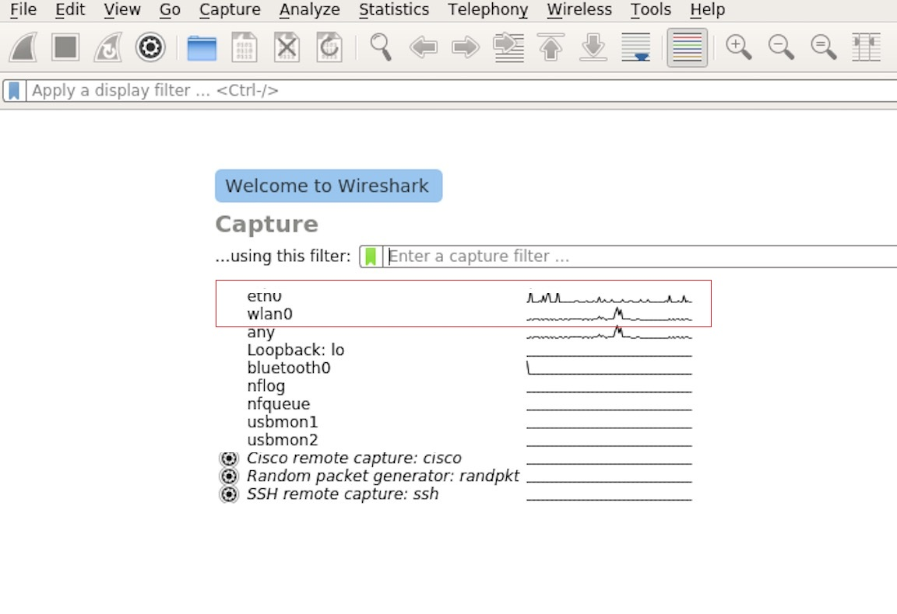
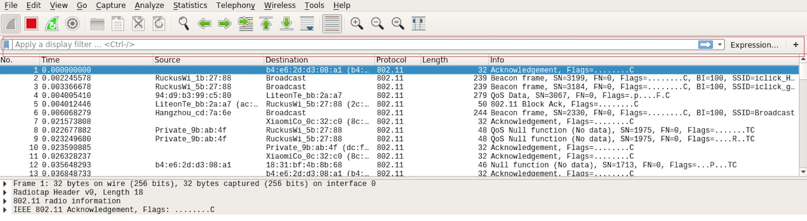
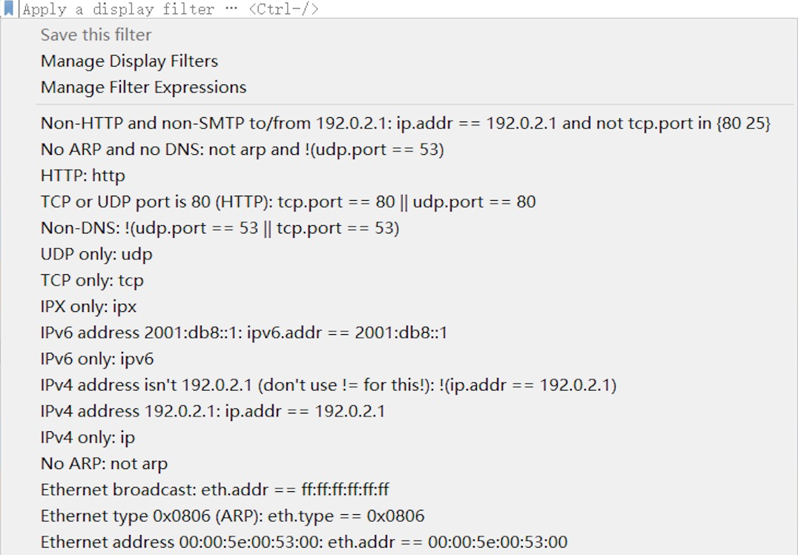
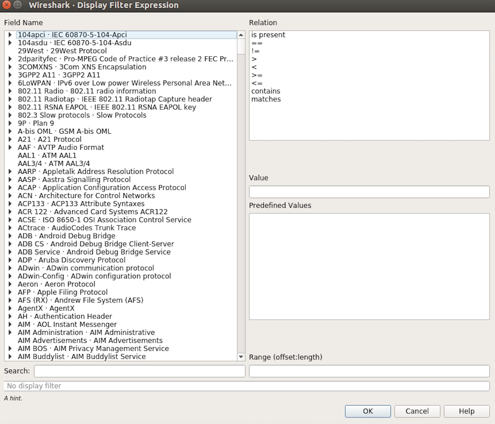
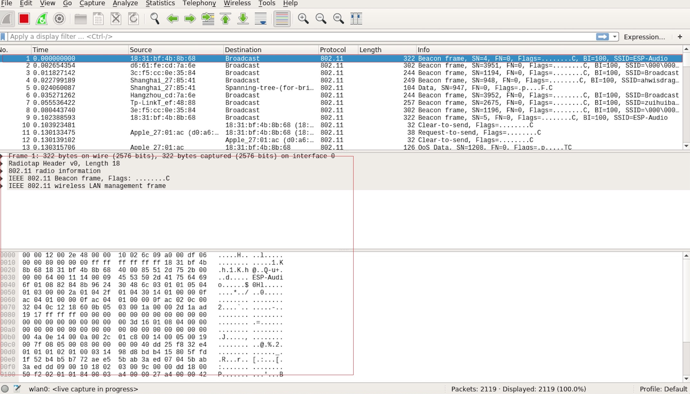
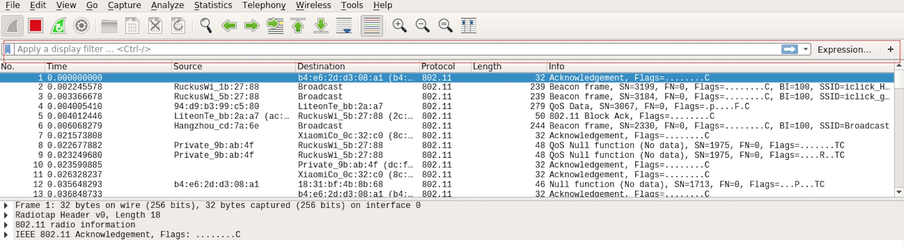
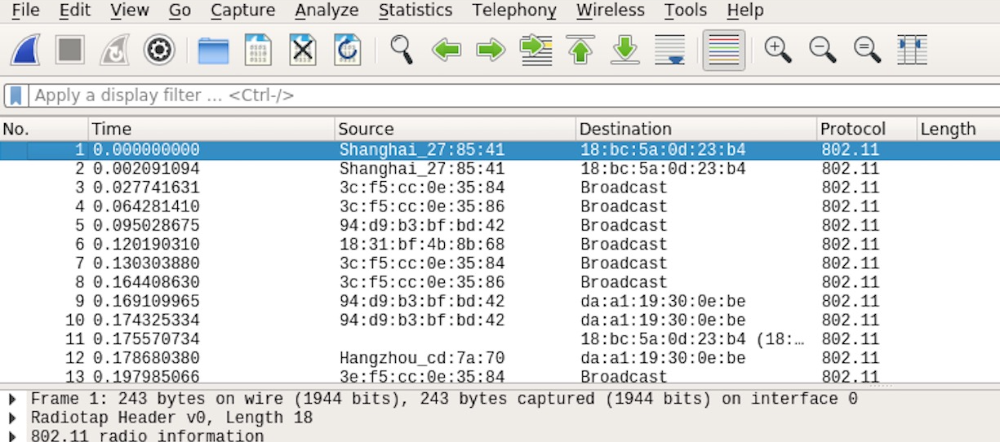
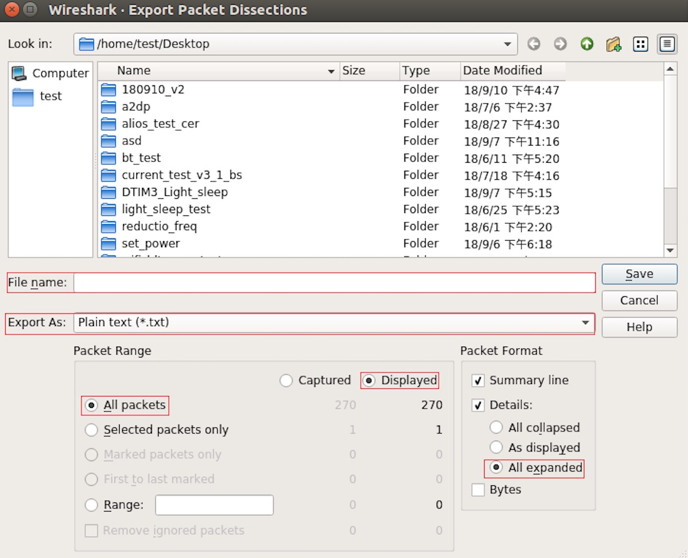

****************************
乐鑫 Wireshark 使用指南
****************************

:link_to_translation:`en:[English]`

===========
1. 概述
===========

1.1 什么是 Wireshark？
========================

Wireshark（原称 Ethereal）是一个网络封包分析软件。网络封包分析软件的功能是撷取网络封包，并尽可能显示出最为详细的网络封包资料。Wireshark 使用 WinPCAP 作为接口，直接与网卡进行数据报文交换。

网络封包分析软件的功能可想像成“电工技师使用电表来量测电流、电压、电阻” 的工作，只是将场景移植到网络上，并将电线替换成网线。

在过去，网络封包分析软件是非常昂贵，或是专门属于营利用的软件。Wireshark 的出现改变了这一切。

在 GNU GPL 通用许可证的保障范围下，使用者可以以免费的代价取得软件与其源代码，并拥有针对其源代码修改及客制化的权利。

Wireshark 是目前全世界最广泛的网络封包分析软件之一。

1.2 Wireshark 的主要应用
===========================

下面是 Wireshark 一些应用的举例：

* 网络管理员用来解决网络问题

* 网络安全工程师用来检测安全隐患

* 开发人员用来测试协议执行情况

* 用来学习网络协议

除了上面提到的，Wireshark 还可以用在其它许多场合。

1.3 Wireshark 的特性
========================

* 支持 UNIX 和 Windows 平台

* 在接口实时捕捉包

* 能详细显示包的详细协议信息

* 可以打开/保存捕捉的包

* 可以导入导出其他捕捉程序支持的包数据格式

* 可以通过多种方式过滤包

* 多种方式查找包

* 通过过滤以多种色彩显示包

* 创建多种统计分析

* 等等

1.4 Wireshark 的“能”与“不能”？
================================

* **捕捉多种网络接口**

  Wireshark 可以捕捉多种网络接口类型的包，哪怕是无线局域网接口。

* **支持多种其它程序捕捉的文件**

  Wireshark 可以打开多种网络分析软件捕捉的包。

* **支持多格式输出**

  Wireshark 可以将捕捉文件输出为多种其他捕捉软件支持的格式。

* **对多种协议解码提供支持**

  Wireshark 可以支持许多协议的解码。

* **Wireshark 不是入侵检测系统**

  如果你的网络中存在任何可疑活动，Wireshark 并不会主动发出警告。不过，当你希望对这些可疑活动一探究竟时，Wireshark 可以发挥作用。

* **Wireshark 不会处理网络事务，它仅仅是“测量”（监视）网络**

  Wireshark 不会发送网络包或做其它交互性的事情（名称解析除外，但你也可以禁止解析）。

========================
2. 如何获取 Wireshark
========================

官网链接：https://www.wireshark.org/download.html

Wireshark 支持多种操作系统，请在下载安装文件时，注意选择与你所用操作系统匹配的安装文件。

==============
3. 使用步骤
==============

**本文档仅以 Linux 系统下的 Wireshark（版本号：2.2.6）为例**。

**1) 启动 Wireshark**

Linux 下，可编写一个 Shell 脚本，运行该文件即可启动 Wireshark 配置抓包网卡和信道。Shell 脚本如下：

::

  ifconfig $1 down
  iwconfig $1 mode monitor
  iwconfig $1 channel $2
  ifconfig $1 up
  Wireshark&

脚本中有两个参数：``$1`` 和 ``$2``，分别表示网卡和信道，例如，``./xxx.sh wlan0 6`` （此处，``wlan0`` 即为抓包使用的网卡，后面的数字 ``6`` 即为 AP 或 soft-AP 所在的 channel）。

**2) 运行 Shell 脚本打开 Wireshark，会出现 Wireshark 抓包开始界面**

    Wireshark 抓包界面

**3) 选择接口，开始抓包**

从上图红色框中可以看到有多个接口，第一个为本地网卡，第二个为无线网络。

可根据自己的需求选取相应的网卡，本文是以利用无线网卡抓取空中包为例进行简单说明。

双击 *wlan0* 即可开始抓包。

**4) 设置过滤条件**

抓包过程中会抓取到同信道所有的空中包，但其实很多都是我们不需要的，因此很多时候我们会设置抓包的过滤条件从而得到我们想要的包。

下图中红色框内即为设置 filter 的位置。

    设置 Wireshark 过滤条件

点击 *Filter* 按钮（下图的左上角蓝色按钮）会弹出 *display filter* 对话框。

    *Display Filter* 对话框

点击 *Expression* 按钮，会出现 *Filter Expression* 对话框，在此你可以根据需求进行 filter 的设置。

    *Filter Expression* 对话框

**最直接的方法** ：直接在工具栏上输入过滤条件。

    过滤条件工具栏

点击在此区域输入或修改显示的过滤字符，在输入过程中会进行语法检查。如果输入的格式不正确，或者未输入完成，则背景显示为红色。直到输入合法的表达式，背景会变为绿色。你可以点击下拉列表选择先前键入的过滤字符。列表会一直保留，即使重新启动程序。

例如：下图所示，直接输入 2 个 MAC 作为过滤条件，点击 *Apply* （即图中的蓝色箭头），则表示只抓取 2 个此 MAC 地址之间的交互的包。

    在过滤条件工具栏中运用 MAC 地址过滤示例

**5) 封包列表**

若想查看包的具体的信息只需要选中要查看的包，在界面的下方会显示出包的具体的格式和包的内容。

    封包列表具体信息示例

如上图所示，我要查看第 1 个包，选中此包，图中红色框中即为包的具体内容。

**6) 停止/开始包的捕捉**

若要停止当前抓包，点击下图的红色按钮即可。

    停止包的捕捉

若要重新开始抓包，点击下图左上角的蓝色按钮即可。

    开始或继续包的捕捉

**7) 保存当前捕捉包**

Linux 下，可以通过依次点击 "File" -> "Export Packet Dissections" -> "As Plain Text File" 进行保存。

    保存捕捉包

上图中，需要注意的是，选择 *All packets*、*Displayed* 以及 *All expanded* 三项。

Wireshark 捕捉的包可以保存为其原生格式文件 (libpcap)，也可以保存为其他格式（如.txt 文件）供其他工具进行读取分析。

