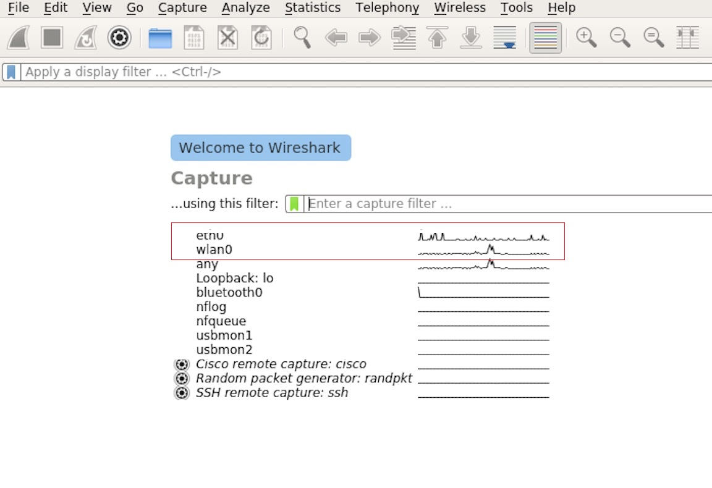
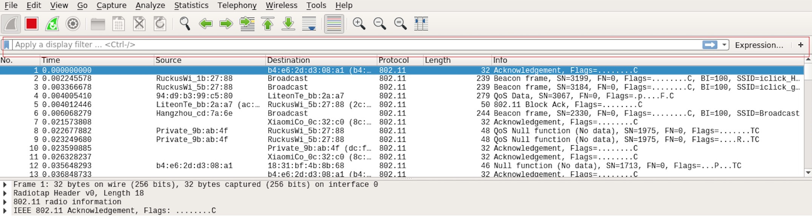
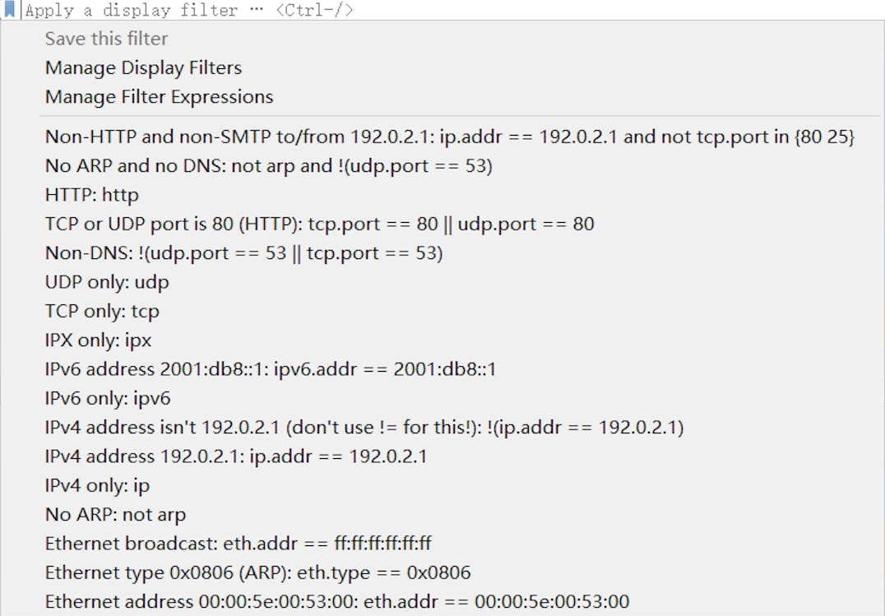
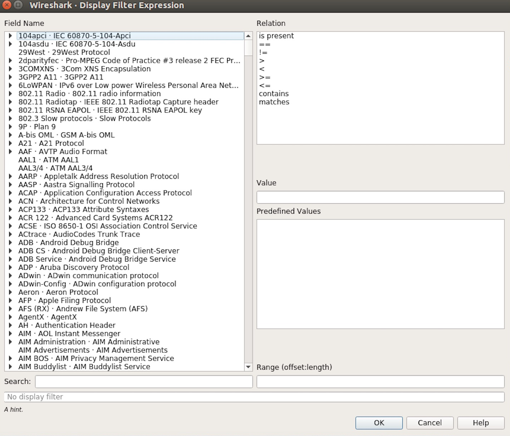
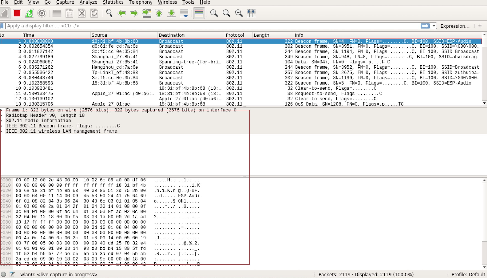
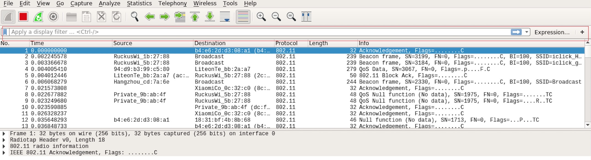
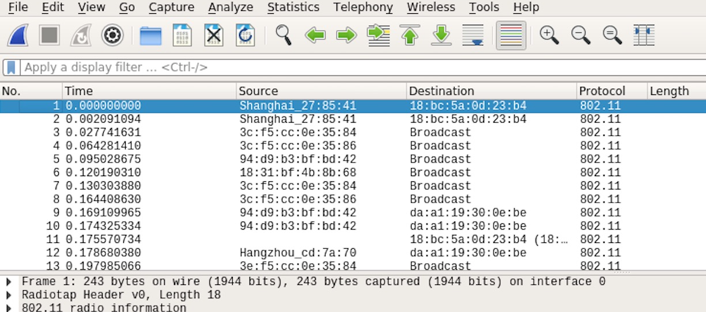
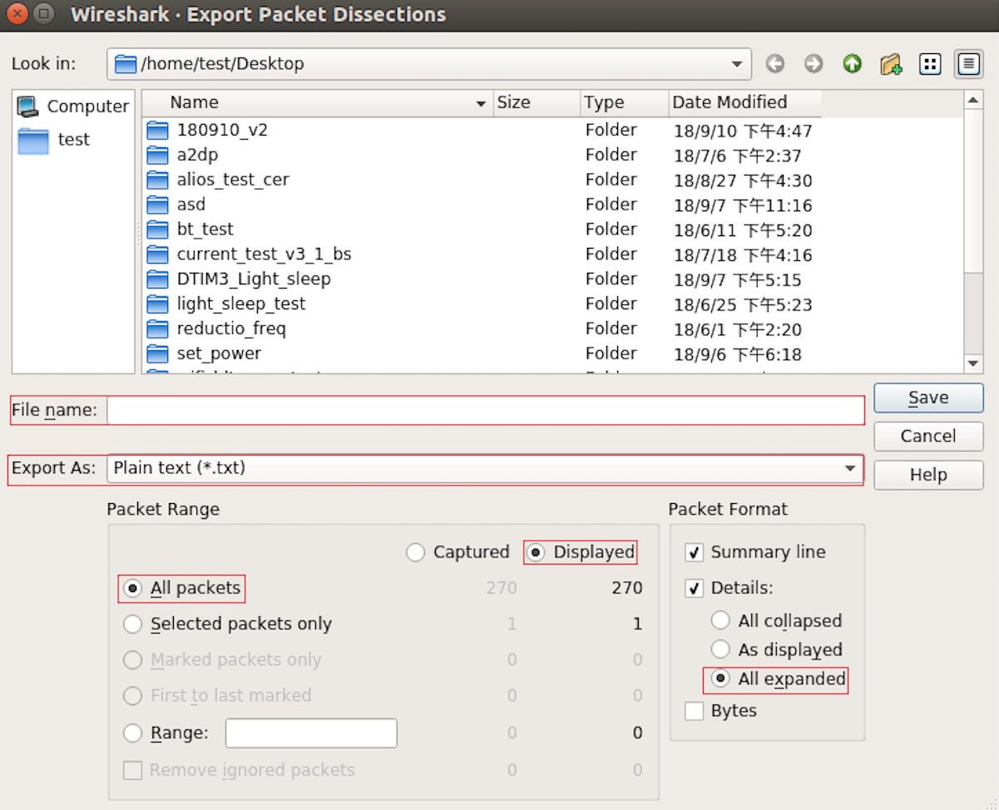

****************************
乐鑫 Wireshark 使用指南
****************************

:link_to_translation:`en:[English]`

===========
1. 概述
===========

1.1 什么是 Wireshark？
========================

`Wireshark <https://www.wireshark.org>`_ （原称 Ethereal）是一个网络封包分析软件。网络封包分析软件的功能是撷取网络封包，并尽可能显示出最为详细的网络封包资料。Wireshark 使用 libpcap（Linux 及其他类 Unix 系统）或 Npcap（Windows）作为接口，直接与网卡进行数据报文交换。

网络封包分析软件的功能可想像成“电工技师使用电表来量测电流、电压、电阻” 的工作，只是将场景移植到网络上，并将电线替换成网线。

在过去，网络封包分析软件是非常昂贵，或是专门属于营利用的软件。Wireshark 的出现改变了这一切。

在 GNU GPL 通用许可证的保障范围下，使用者可以以免费的代价取得软件与其源代码，并拥有针对其源代码修改及客制化的权利。

Wireshark 是目前全世界最广泛的网络封包分析软件之一。

1.2 Wireshark 的主要应用
===========================

下面是 Wireshark 一些应用的举例：

* 网络管理员用来解决网络问题

* 网络安全工程师用来检测安全隐患

* 开发人员用来测试协议执行情况

* 用来学习网络协议

除了上面提到的，Wireshark 还可以用在其它许多场合。

1.3 Wireshark 的特性
========================

Wireshark 的特性如下：

* 支持 Linux、macOS 和 Windows 平台

* 在接口实时捕捉包

* 能详细显示包的详细协议信息

* 可以打开/保存捕捉的包

* 可以导入导出其他捕捉程序支持的包数据格式

* 可以通过多种方式过滤包

* 多种方式查找包

* 通过过滤以多种色彩显示包

* 创建多种统计分析

* 等等

1.4 Wireshark 的“能”与“不能”？
================================

* **捕捉多种网络接口**

  Wireshark 可以捕捉多种网络接口类型的包，包括无线局域网（需要硬件支持监听模式）。

* **支持多种其它程序捕捉的文件**

  Wireshark 可以打开多种网络分析软件捕捉的包。

* **支持多格式输出**

  Wireshark 可以将捕捉文件输出为多种其他捕捉软件支持的格式。

* **对多种协议解码提供支持**

  Wireshark 可以支持许多协议的解码。

* **Wireshark 不是入侵检测系统**

  如果你的网络中存在任何可疑活动，Wireshark 并不会主动发出警告。不过，当你希望对这些可疑活动一探究竟时，Wireshark 可以发挥作用。

* **Wireshark 不会处理网络事务，它仅仅是“测量”（监视）网络**

  Wireshark 不会发送网络包或做其它交互性的事情（名称解析除外，但你也可以禁止解析）。

==========================
2. 如何获取 Wireshark
==========================

官网链接：https://www.wireshark.org/download.html

Wireshark 支持 Linux、macOS 和 Windows。请在下载安装文件时，注意选择与你所用操作系统匹配的安装文件。Windows 安装包已包含 Npcap（抓包库）；Linux 下请确保已安装 libpcap。

======================
3. 使用步骤
======================

**本文档以 Linux 系统下的 Wireshark 为例。** 不同版本的界面可能略有差异，最新文档请参阅 `Wireshark User's Guide <https://www.wireshark.org/docs/wsug_html/>`_。

**a) 启动 Wireshark**

查找无线网卡名称（如 ``wlan0``），可运行 ``ip link show`` 或 ``iw dev`` 列出可用接口。

Linux 下，可编写一个 Shell 脚本，运行该文件即可启动 Wireshark 并配置网卡为监听模式。以下命令需要 root 权限，请使用 ``sudo`` 或以 root 身份运行脚本：

::

  ip link set $1 down
  iw dev $1 set type monitor
  ip link set $1 up
  wireshark &

.. note::
  设置特定信道（如 ``iw dev $1 set channel 6``）会将抓包限制在该信道。脚本默认省略该命令，因此会抓取接口当前信道。若需抓取特定信道，请在 ``set type monitor`` 与 ``ip link set $1 up`` 之间添加 ``iw dev $1 set channel 6`` （或其他信道）。

脚本中参数 ``$1`` 表示网卡（如 ``wlan0``）。例如，``./xxx.sh wlan0`` 即在无线接口上开始抓包。

**b) 运行 Shell 脚本打开 Wireshark，会出现 Wireshark 抓包开始界面**

    Wireshark 抓包界面

**c) 选择接口，开始抓包**

从上图红色框中可以看到有多个接口，第一个为本地网卡，第二个为无线网络。

可根据自己的需求选取相应的网卡，本文是以利用无线网卡抓取空中包为例进行简单说明。

双击 *wlan0* 即可开始抓包。

**d) 设置过滤条件**

抓包过程中会抓取到同信道所有的空中包，但其实很多都是我们不需要的，因此很多时候我们会设置抓包的过滤条件从而得到我们想要的包。

常用无线抓包显示过滤器示例：

* ``wlan.ssid == "MyNetwork"`` — 按 SSID（网络名）过滤
* ``wlan.addr == aa:bb:cc:dd:ee:ff`` — 按 MAC 地址（源、目的或 BSSID）过滤
* ``wlan.bssid == aa:bb:cc:dd:ee:ff`` — 按接入点 BSSID 过滤
* ``wlan.fc.type_subtype == 0x08`` — 过滤信标帧
* ``eapol`` — 过滤 EAPOL 握手包（WPA 解密所需）

下图中红色框内即为设置 filter 的位置。

    设置 Wireshark 过滤条件

点击 *Filter* 按钮（下图的左上角蓝色按钮）会弹出 *display filter* 对话框。

    *Display Filter* 对话框

点击 *Expression* 按钮，会出现 *Filter Expression* 对话框，在此你可以根据需求进行 filter 的设置。

    *Filter Expression* 对话框

**最直接的方法**：直接在工具栏上输入过滤条件。

    过滤条件工具栏

点击在此区域输入或修改过滤条件。如果输入的格式不正确或未输入完成，内置语法检查会将背景显示为红色。输入合法表达式后，背景会变为绿色。

先前输入的过滤条件会自动保存，可随时通过下拉列表访问。

例如：下图所示，直接输入 2 个 MAC 作为过滤条件，点击 *Apply* （即图中的蓝色箭头），则表示只抓取这两个 MAC 地址之间的交互包。

    在过滤条件工具栏中运用 MAC 地址过滤示例

**加密 Wi-Fi 流量的解密密钥**

要查看成功连接 Wi-Fi 后（WPA/WPA2 个人版）的解密流量，需在 Wireshark 中配置解密密钥：

1. 依次点击 *Edit* → *Preferences* → *Protocols* → *IEEE 802.11*
2. 点击 *Decryption Keys* 旁的 *Edit*
3. 按下表格式添加密钥（确保勾选 *Enable decryption* ）

常用解密密钥格式：

============  ============================================
密钥类型      格式 / 示例
============  ============================================
wpa-pwd       ``password:ssid``
              例如 ``mypassword:MyNetwork``
wep           十六进制密钥，例如 ``a1:b2:c3:d4:e5``
============  ============================================

.. note::
  WPA/WPA2 个人版解密需要抓包中包含 4 次 EAPOL 握手（设备加入网络时）。可使用 ``eapol`` 显示过滤器验证握手包是否存在。详见 `Wireshark 802.11 文档 <https://www.wireshark.org/docs/wsug_html_chunked/Ch80211Keys.html>`_。

**e) 封包列表**

若想查看包的具体信息，只需点击封包列表中的任意包，其详细信息会显示在列表下方的框中。例如，若点击第一个包，其详细信息会显示在该框中。

    封包列表具体信息示例

**f) 停止/开始包的捕捉**

若要停止当前抓包，点击下图的红色按钮即可。

    停止包的捕捉

若要重新开始抓包，点击下图左上角的蓝色按钮即可。

    开始或继续包的捕捉

**g) 保存当前捕捉包**

Linux 下，依次点击 *File* → *Export Packet Dissections* → *as Plain Text* 进行保存。

    保存捕捉包

请注意，需选择 *All packets*、*Displayed* 和 *All expanded* 三项。

Wireshark 默认将捕捉的包保存为 libpcap 格式。也可保存为其他格式（如 txt）供其他工具分析。

