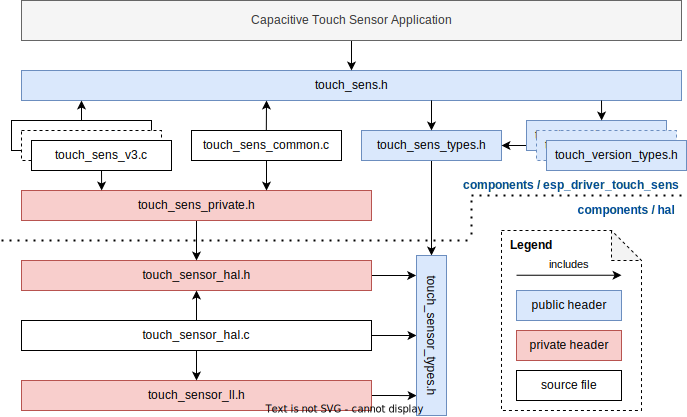
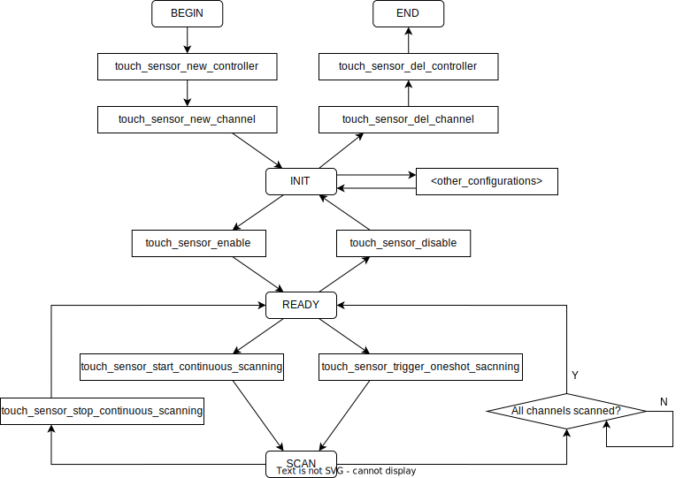

电容式触摸传感器
===================

:link_to_translation:`en:[English]`

{IDF_TARGET_TOUCH_SENSOR_VERSION:default="NOT_UPDATED", esp32="v1", esp32s2="v2", esp32s3="v2", esp32p4="v3"}

概述
------

触摸传感器系统由保护覆盖层、触摸电极、绝缘基板和走线组成，保护覆盖层位于最上层，绝缘基板上设有电极及走线。触摸覆盖层将引起电容变化，根据电容变化，可以判断此次触摸是否为有效触摸行为。

触摸传感器可以以矩阵或滑条等方式组合使用，从而覆盖更大触感区域及更多触感点。触摸传感由软件或专用硬件计时器发起，由有限状态机 (FSM) 硬件控制。

如需了解触摸传感器设计、操作及其控制寄存器等相关信息，请参考《`{IDF_TARGET_NAME} 技术参考手册 <{IDF_TARGET_TRM_CN_URL}>`_》(PDF) 中“片上传感器与模拟信号处理”章节。

请参考 `触摸传感器应用方案简介 <https://github.com/espressif/esp-iot-solution/blob/release/v1.0/documents/touch_pad_solution/touch_sensor_design_en.md>`_，查看触摸传感器设计详情和固件开发指南。

电容式触摸传感器版本概览
-------------------------

+-----------+--------------+------------------------------------------------------------------------+
|  硬件版本 |     芯片     |                        主要特征                                        |
+===========+==============+========================================================================+
|     V1    |  ESP32       | 第一代触摸传感器，触摸时读数变小                                       |
+-----------+--------------+------------------------------------------------------------------------+
|     V2    |  ESP32-S2    | 第二代触摸传感器，触摸时读数变大                                       |
|           |              | 新增硬件滤波器、基线、防水防潮、接近感应、睡眠唤醒功能                 |
|           +--------------+------------------------------------------------------------------------+
|           |  ESP32-S3    | 第二代触摸传感器，新增接近感应测量完成中断                             |
+-----------+--------------+------------------------------------------------------------------------+
|     V3    |  ESP32-P4    | 第三代触摸传感器，新增跳频扫描                                         |
+-----------+--------------+------------------------------------------------------------------------+

测量原理
-----------

触摸传感器通过硬件内部的电流或电压偏置对触摸通道进行充电和放电操作，由于触摸通道存在内部电容和电路中的寄生电容，充放电时在通道引脚上表现为锯齿波。当手指贴近或者触摸该通道时，通道、人体和大地之间形成充放电回路，使得触摸通道耦合的电容增大，充放电速度变慢，即锯齿波周期增大。

.. only:: esp32

    触摸传感器会在固定时间内对触摸通道进行充放电，并统计充放电次数，其计数结果即为原始数据。其中单次测量的充放电持续时间可由 :cpp:member:`touch_sensor_sample_config_t::charge_times` 指定，两次测量中间的间隔时间可由 :cpp:member:`touch_sensor_config_t::meas_interval_us` 指定。

    .. figure:: ../../../_static/touch_pad-measurement-parameters.jpg
        :align: center
        :alt: Touch Pad - relationship between measurement parameters
        :figclass: align-center

        触摸传感器工作原理示意图

.. only:: not esp32

    触摸传感器会统计固定充放电次数所需的时钟周期数，其计数结果即为原始数据。其中单次测量的充放电次数可由 :cpp:member:`touch_sensor_sample_config_t::charge_duration_ms` 指定，两次测量中间的间隔时间可由 :cpp:member:`touch_sensor_config_t::meas_interval_us` 指定。

    .. figure:: ../../../_static/touch_pad-measurement-parameters-version2.png
        :align: center
        :alt: Touch Pad - relationship between measurement parameters
        :figclass: align-center

        触摸传感器工作原理示意图

触摸通道概览
----------------------

.. include:: cap_touch_sens/{IDF_TARGET_PATH_NAME}.inc
    :start-after: touch-chan-mapping
    :end-before: ---

驱动中的术语介绍
-------------------------

- **触摸传感器控制器**：触摸传感器驱动的控制器，负责触摸传感器的配置和管理。
- **触摸传感器通道**：具体的一路触摸传感器采样通道。一个触摸传感器模块具有多个通道，一般连接到触摸板上，用于测量该触摸板电容的变化。驱动中把对 **一个** 通道的采样称为 ``测量``，而对 **所有** 注册通道的 ``测量`` 称为一次 ``扫描``。

.. only:: IDF_TARGET_TOUCH_SAMPLE_CFG_DESC

  - **触摸传感器采样配置**：触摸传感器采样配置是驱动中对采样有关的硬件配置的统称。采样配置负责触摸传感器通道的采样，其配置决定了触摸通道的充放电次数、充放电频率、测量间隔等。{IDF_TARGET_NAME} 支持多套采样配置，支持跳频采样。

.. only:: not IDF_TARGET_TOUCH_SAMPLE_CFG_DESC

  - **触摸传感器采样配置**：触摸传感器采样配置是驱动中对采样有关的硬件配置的统称。采样配置负责触摸传感器通道的采样，其配置决定了触摸通道的充放电次数、充放电频率、测量间隔等。{IDF_TARGET_NAME} 仅支持一套采样配置，不支持跳频采样。

文件结构
--------------------

    触摸传感器驱动文件结构图

驱动状态机
---------------------

下图为触摸传感器驱动的状态机，描述了调用不同函数后驱动的运行状态，以及状态变迁的约束。

    触摸传感器驱动状态机示意图

上图为触摸传感器驱动的状态机，描述了调用不同函数后状态的变换关系。其中 ``<other_configurations>`` 部分为可选的配置项，包括对触摸驱动控制器和触摸通道的重新配置、回调函数注册等。

.. note::

    :cpp:func:`touch_channel_read_data` 可在获取触摸通道句柄后（即 ``INIT`` 后）任意状态调用，但请注意读数值的有效性。

功能介绍
----------

{IDF_TARGET_NAME} 的电容式触摸传感器驱动提供的 API 按功能主要可分为：

.. list::

  - `触摸传感器控制器管理 <#touch-ctrl>`__
  - `触摸传感器通道管理 <#touch-chan>`__
  - `滤波器配置 <#touch-filter>`__
  - `回调函数 <#touch-callback>`__
  - `启用和禁用 <#touch-enable>`__
  - `连续扫描 <#touch-conti-scan>`__
  - `单次扫描 <#touch-oneshot-scan>`__
  - `测量值读数 <#touch-read>`__
  :SOC_TOUCH_SUPPORT_BENCHMARK: - `基线值配置 <#touch-benchmark>`__
  :SOC_TOUCH_SUPPORT_WATERPROOF: - `防水防潮配置 <#touch-waterproof>`__
  :SOC_TOUCH_SUPPORT_PROX_SENSING: - `接近感应配置 <#touch-prox-sensing>`__
  :SOC_TOUCH_SUPPORT_SLEEP_WAKEUP: - `睡眠唤醒配置 <#touch-sleep-wakeup>`__
  :SOC_TOUCH_SUPPORT_DENOISE_CHAN: - `去噪通道配置 <#touch-denoise-chan>`__

.. _touch-ctrl:

触摸传感器控制器管理
^^^^^^^^^^^^^^^^^^^^^

触摸传感器驱动通过触摸传感器控制器句柄 :cpp:type:`touch_sensor_handle_t` 控制。调用 :cpp:func:`touch_sensor_new_controller` 函数即可初始化触摸传感器控制器并得到控制器句柄。

.. code-block:: c

    // 有些芯片支持多套采样配置，这里以一套为例
    #define SAMPLE_NUM 1
    touch_sensor_handle_t sens_handle = NULL;
    // 采样配置
    touch_sensor_sample_config_t sample_cfg[SAMPLE_NUM] = {
        // 指定采样配置或通过 `TOUCH_SENSOR_Vn_DEFAULT_SAMPLE_CONFIG` 使用默认采样配置
        // ...
    };
    // 默认控制器配置
    touch_sensor_config_t touch_cfg = TOUCH_SENSOR_DEFAULT_BASIC_CONFIG(SAMPLE_NUM, sample_cfg);
    // 申请一个新的触摸传感器控制器句柄
    ESP_ERROR_CHECK(touch_sensor_new_controller(&touch_cfg, &sens_handle));

删除触摸传感器驱动控制器时需调用 :cpp:func:`touch_sensor_del_controller` 函数，从而释放该控制器所占用的软硬件资源。注意，需要将基于该控制器申请的其他资源销毁或释放后才能删除该控制器。如该控制器下仍有触摸通道未被删除，则无法直接删除。

.. code-block:: c

    ESP_ERROR_CHECK(touch_sensor_del_controller(sens_handle));

在触摸传感器驱动控制器初始化后，且未启用触摸传感器时，可调用 :cpp:func:`touch_sensor_reconfig_controller` 函数对该控制器进行重新配置。

.. code-block:: c

    touch_sensor_config_t touch_cfg = {
        // 控制器的新配置
        // ...
    };
    ESP_ERROR_CHECK(touch_sensor_reconfig_controller(sens_handle, &touch_cfg));

.. _touch-chan:

触摸传感器通道管理
^^^^^^^^^^^^^^^^^^^^^

一个触摸传感器具有多个测量通道，每个触摸传感器通道由句柄 :cpp:type:`touch_channel_handle_t` 控制。调用 :cpp:func:`touch_sensor_new_channel` 函数即可初始化触摸传感器通道并得到通道句柄。

.. code-block:: c

    // ...
    touch_channel_config_t chan_cfg = {
        // 触摸通道配置
        // ...
    };
    touch_channel_handle_t chan_handle = NULL;
    int chan_id = 0;
    // 申请一个新的触摸通道句柄
    ESP_ERROR_CHECK(touch_sensor_new_channel(sens_handle, chan_id, &chan_cfg, &chan_handle));

删除触摸传感器通道时需调用 :cpp:func:`touch_sensor_del_channel` 函数，从而释放该通道所占用的软硬件资源。

.. code-block:: c

    ESP_ERROR_CHECK(touch_sensor_del_channel(chan_handle));

在触摸传感器驱动通道初始化后，且未启用触摸传感器时，可调用 :cpp:func:`touch_sensor_reconfig_channel` 函数对该通道进行重新配置。

.. code-block:: c

    touch_channel_config_t chan_cfg = {
        // 触摸通道新配置
        // ...
    };
    ESP_ERROR_CHECK(touch_sensor_reconfig_channel(chan_handle, &chan_cfg));

.. _touch-filter:

滤波器配置
^^^^^^^^^^^^^^

触摸传感器可以通过配置滤波器来提升不同场景下的数据稳定性。调用 :cpp:func:`touch_sensor_config_filter` 并指定 :cpp:type:`touch_sensor_filter_config_t` 来配置基线值和读数值的滤波策略和更新方式，配置后对所有启用的触摸通道都生效。

若需要注销滤波器，可再次调用 :cpp:func:`touch_sensor_config_filter` 并将第二个参数（即 :cpp:type:`touch_sensor_filter_config_t` 的配置结构体指针）设为 ``NULL`` 来注销滤波器功能。

.. only:: esp32

    触摸传感器版本 {IDF_TARGET_TOUCH_SENSOR_VERSION} 本身不支持硬件滤波器，但是驱动中可以基于 ``esp_timer`` 设置周期性触发的软件滤波器。可以通过 :cpp:member:`touch_sensor_filter_config_t::interval_ms` 来制定软件滤波触发的间隔时间，另外 :cpp:member:`touch_sensor_filter_config_t::data_filter_fn` 接口支持指定自定义滤波函数，若无特殊滤波器要求，也可将该接口设为 ``NULL`` 来使用驱动中的默认滤波器。

.. only:: not esp32

    触摸传感器版本 {IDF_TARGET_TOUCH_SENSOR_VERSION} 支持硬件滤波器。基线的滤波与更新策略可通过 :cpp:member:`touch_sensor_filter_config_t::benchmark` 进行配置，而读数值的滤波可通过 :cpp:member:`touch_sensor_filter_config_t::data` 进行配置。

.. code-block:: c

    // ...
    touch_sensor_filter_config_t filter_config = {
        // 滤波器配置
        // ...
    };
    // 注册滤波器
    ESP_ERROR_CHECK(touch_sensor_config_filter(sens_handle, &filter_config));
    // ...
    // 注销滤波器
    ESP_ERROR_CHECK(touch_sensor_config_filter(sens_handle, NULL));

.. _touch-callback:

回调函数
^^^^^^^^^^^^^

通过调用 :cpp:func:`touch_sensor_register_callbacks` 注册各类触摸传感器事件回调函数，当触摸传感器通道触发如触摸 ``on_active``、释放 ``on_inactive`` 等事件时，就会调用对应的回调函数通知上层应用，以便对触摸事件进行处理。

例如，测量值超出当前的测量通道的 ``基线值`` + ``触发阈值``，则该通道将被触发，并调用 ``on_active`` 事件的回调函数，通知应用层该触摸通道被 ``触发``。同理，若处于 ``触发`` 状态的通道测量值小于 ``基线值`` + ``触发阈值``，则该通道将回到未触发状态，并调用 ``on_inactive`` 事件的回调函数，通知应用层该触摸通道被 ``释放``。

.. note::

    为保证触发和释放事件的稳定性，触摸传感器可配置 ``触发阈值`` 的迟滞比较裕量和 ``去抖动计数`` 来避免短时间内由噪声和读数抖动引起的反复触发和释放。

具体可注册的回调时间请参考 :cpp:type:`touch_event_callbacks_t`。

.. code-block:: c

    touch_event_callbacks_t callbacks = {
        .on_active = example_touch_on_active_cb,
        // 其他回调函数
        // ...
    };
    // 注册回调函数
    ESP_ERROR_CHECK(touch_sensor_register_callbacks(sens_handle, &callbacks, NULL));

    // 通过把相应回调设为 NULL 以注销回调函数
    callbacks.on_active = NULL;
    // 其他需要注销的回调函数
    // ...
    ESP_ERROR_CHECK(touch_sensor_register_callbacks(sens_handle, &callbacks, NULL));

.. _touch-enable:

启用和禁用
^^^^^^^^^^^^^^^^^^^^^^^^^^^^^^^^^^^^^^

配置完成触摸传感器控制器以及通道后，可调用 :cpp:func:`touch_sensor_enable` 函数启用该控制器，启用后控制器处于 ``就绪`` 状态，会对注册的通道上电，可以开始扫描并采集触摸数据。注意，控制器启用后无法更新配置，只能进行扫描采样和读数操作。若要更新配置，需先调用 :cpp:func:`touch_sensor_disable` 函数禁用控制器，方可重新配置控制器、通道等。

.. code-block:: c

    // 启用触摸传感器
    ESP_ERROR_CHECK(touch_sensor_enable(sens_handle));
    // ...
    // 禁用触摸传感器
    ESP_ERROR_CHECK(touch_sensor_disable(sens_handle));

.. _touch-conti-scan:

连续扫描
^^^^^^^^^^

在控制器启用后，调用 :cpp:func:`touch_sensor_start_continuous_scanning` 函数可开始对所有已注册的触摸通道进行连续扫描，每次扫描都会更新对应通道的测量值。调用 :cpp:func:`touch_sensor_stop_continuous_scanning` 函数后则停止扫描。

.. code-block:: c

    // 开始连续扫描
    ESP_ERROR_CHECK(touch_sensor_start_continuous_scanning(sens_handle));
    // ...
    // 停止连续扫描
    ESP_ERROR_CHECK(touch_sensor_stop_continuous_scanning(sens_handle));

.. _touch-oneshot-scan:

单次扫描
^^^^^^^^^^

在控制器启用后，调用 :cpp:func:`touch_sensor_trigger_oneshot_scanning` 函数可触发一次对所有已注册的触摸通道的扫描。注意，单次扫描为阻塞函数，调用后会保持阻塞直到扫描结束后返回。此外在开始连续扫描后，无法再触发单次扫描。

.. code-block:: c

    // 触发单次扫描，并设置超时时间为 1000 ms
    ESP_ERROR_CHECK(touch_sensor_trigger_oneshot_scanning(sens_handle, 1000));

.. _touch-read:

测量值读数
^^^^^^^^^^^^

调用 :cpp:func:`touch_channel_read_data` 可读取每个通道不同种类的数据，例如基线值、经过滤波后的平滑值等。支持的数据类型请参考 :cpp:type:`touch_chan_data_type_t`。

.. only:: SOC_TOUCH_SUPPORT_FREQ_HOP

    {IDF_TARGET_NAME} 支持通过配置多套采样配置来实现跳频采样，:cpp:func:`touch_channel_read_data` 可一次性读出一个通道所有采样配置的测量值。根据配置的 :cpp:member:`touch_sensor_config_t::sample_cfg_num` 采样配置数量，第三个参数 (``*data``) 数据指针传入数组长度大于等于采样配置数量的数组指针即可，该函数会将所指定通道的所有采样配置的测量值存入该数组中。

.. code-block:: c

    #define SAMPLE_NUM  1  // 以一套采样配置为例
    uint32_t smooth_data[SAMPLE_NUM] = {};
    // 读取滤波后的平滑数据
    ESP_ERROR_CHECK(touch_channel_read_data(chan_handle, TOUCH_CHAN_DATA_TYPE_SMOOTH, smooth_data));

.. _touch-benchmark:

.. only:: SOC_TOUCH_SUPPORT_BENCHMARK

    基线值配置
    ^^^^^^^^^^^^^

    一般情况下，不需要额外设置触摸传感器的基线值，若有必要强制复位基线值到当前平滑值，可调用 :cpp:func:`touch_channel_config_benchmark`。

    .. code-block:: c

        touch_chan_benchmark_config_t benchmark_cfg = {
            // 基线操作
            // ...
        };
        ESP_ERROR_CHECK(touch_channel_config_benchmark(chan_handle, &benchmark_cfg));

.. _touch-waterproof:

.. only:: SOC_TOUCH_SUPPORT_WATERPROOF

    防水防潮配置
    ^^^^^^^^^^^^^^

    {IDF_TARGET_NAME} 支持防水防潮功能。可通过调用 :cpp:func:`touch_sensor_config_waterproof` 并配置 :cpp:type:`touch_waterproof_config_t` 来注册防水防潮功能。防水防潮功能主要包含两部分：

    - 遇水（浸没）保护功能： :cpp:member:`touch_waterproof_config_t::guard_chan` 用于指定用于遇水保护功能的触摸通道，该通道在 PCB 上一般设计成环形，其他普通触摸通道布局在该环形保护圈内，当电路板大面积浸水时，该环形保护通道会被触发，并停止其他触摸通道的扫描，由此防止其他普通通道的误触发；
    - 防潮（水滴）屏蔽功能： :cpp:member:`touch_waterproof_config_t::shield_chan` 用于指定防潮屏蔽功能的触摸通道，该通道在 PCB 上一般设计成网格状铺铜。防潮屏蔽通道将与当前测量通道进行同步充放电，当有小水珠覆盖时，通过配置适当的 :cpp:member:`touch_waterproof_config_t::shield_drv` 来提高因水滴造成的电耦合强度，从而识别水滴造成的误触。在实际应用中识别到水滴造成的误触后可适当增加触摸通道触发的阈值来实现通道在水滴覆盖下的正常触发，从而实现防潮功能。

    若需要注销防水防潮功能，可再次调用 :cpp:func:`touch_sensor_config_waterproof` 并将第二个参数（即 :cpp:type:`touch_waterproof_config_t` 的配置结构体指针）设为 ``NULL`` 来注销防水防潮功能。

    .. code-block:: c

        touch_waterproof_config_t waterproof_cfg = {
            // 防水防潮配置
            // ...
        };
        // 注册防水防潮功能
        ESP_ERROR_CHECK(touch_sensor_config_waterproof(sens_handle, &waterproof_cfg));
        // ...
        // 注销防水防潮功能
        ESP_ERROR_CHECK(touch_sensor_config_waterproof(sens_handle, NULL));

.. _touch-prox-sensing:

.. only:: SOC_TOUCH_SUPPORT_PROX_SENSING

    接近感应配置
    ^^^^^^^^^^^^^^^^^^^^^^^^^^^^^^

    {IDF_TARGET_NAME} 支持接近感应功能。可通过调用 :cpp:func:`touch_sensor_config_proximity_sensing` 并配置 :cpp:type:`touch_proximity_config_t` 来注册接近感应功能。

    .. only:: esp32p4

        由于接近感应引起的电容变化远小于物理触摸，PCB 上常用较大面积的铺铜来增大触摸通道的感应面积，另外需要在硬件上对接近感应通道进行多轮扫描并在驱动中进行累加来提高测量灵敏度。接近感应的灵敏度由测量轮数 :cpp:member:`touch_proximity_config_t::scan_times` 以及单次测量的充放电次数 :cpp:member:`touch_proximity_config_t::charge_times` 决定。测量轮数以及充放电次数越高，灵敏度越高，但是过高的灵敏度容易导致误触发，请选择适当的灵敏度来保证触发的稳定性。

    .. only:: not esp32p4

        由于接近感应引起的电容变化远小于物理触摸，PCB 上常用较大面积的铺铜来增大触摸通道的感应面积，另外需要在硬件上对接近感应通道进行多轮扫描并在驱动中进行累加来提高测量灵敏度。接近感应的灵敏度由测量轮数 :cpp:member:`touch_proximity_config_t::scan_times` 决定。测量轮数以及充放电次数越高，灵敏度越高，但是过高的灵敏度容易导致误触发，请选择适当的灵敏度来保证触发的稳定性。

    接近感应通道多次测量的累加值也可通过 :cpp:func:`touch_channel_read_data` 获取，数据类型 :cpp:type:`touch_chan_data_type_t` 为 :cpp:enumerator:`TOUCH_CHAN_DATA_TYPE_PROXIMITY`。

    若需要注销接近感应功能，可再次调用 :cpp:func:`touch_sensor_config_proximity_sensing` 并将第二个参数（即 :cpp:type:`touch_proximity_config_t` 的配置结构体指针）设为 ``NULL`` 来注销接近感应功能。

    .. code-block:: c

        touch_proximity_config_t prox_cfg = {
            // 接近感应配置
            // ...
        };
        // 注册接近感应功能
        ESP_ERROR_CHECK(touch_sensor_config_proximity_sensing(sens_handle, &prox_cfg));
        // ...
        // 注销接近感应功能
        ESP_ERROR_CHECK(touch_sensor_config_proximity_sensing(sens_handle, NULL));

.. _touch-sleep-wakeup:

.. only:: SOC_TOUCH_SUPPORT_SLEEP_WAKEUP

    睡眠唤醒配置
    ^^^^^^^^^^^^^^

    {IDF_TARGET_NAME} 支持触摸传感器将芯片从 Light-sleep 或 Deep-sleep 状态中唤醒。可通过调用 :cpp:func:`touch_sensor_config_sleep_wakeup` 并配置 :cpp:type:`touch_sleep_config_t` 来注册接近感应功能。

    注册触摸传感器的睡眠唤醒功能后，处于睡眠状态下的芯片仍将继续保持对触摸传感器的采样，这将会导致芯片睡眠后的功耗增加，可通过减少充放电次数、增加采样间隔等方式来降低功耗。

    另外，请注意在主核睡眠期间的采样、唤醒等操作均由硬件完成，本驱动由于运行在主核上，无法提供读数、配置等功能。

    .. only:: SOC_RISCV_COPROC_SUPPORTED

        若需要在睡眠过程中进行读数、配置等操作，可通过运行在 :doc:`超低功耗协处理器 ULP <../system/ulp>` 上的触摸传感器驱动 ``components/ulp/ulp_riscv/ulp_core/include/ulp_riscv_touch_ulp_core.h`` 实现。

    .. list::

        - Light-sleep 状态唤醒：通过指定 :cpp:member:`slp_wakeup_lvl` 为 :cpp:enumerator:`TOUCH_LIGHT_SLEEP_WAKEUP` 即可启用触摸传感器 Light-sleep 唤醒功能。注意任何已注册的触摸传感器通道都会在 Light-sleep 状态下保持采样并支持唤醒 Light-sleep。
        :esp32: - Deep-sleep 状态唤醒：通过指定 :cpp:member:`slp_wakeup_lvl` 为 :cpp:enumerator:`TOUCH_DEEP_SLEEP_WAKEUP` 即可启用触摸传感器 Deep-sleep 唤醒功能。注意版本 {IDF_TARGET_TOUCH_SENSOR_VERSION} 启用 Deep-sleep 唤醒后，会在 Deep-sleep 中保持 RTC 电源域开启，以维持触摸传感器工作，此时任何已注册的触摸传感器通道都可以在 Deep-sleep 状态下保持采样并支持唤醒 Deep-sleep。
        :not esp32: - Deep-sleep 状态唤醒：启用触摸传感器 Deep-sleep 唤醒功能除了指定 :cpp:member:`slp_wakeup_lvl` 为 :cpp:enumerator:`TOUCH_DEEP_SLEEP_WAKEUP` 外，还需要指定 Deep-sleep 唤醒通道 :cpp:member:`deep_slp_chan`，注意只有该指定的通道才会在 Deep-sleep 状态下保持采样以及唤醒，以此降低在 Deep-sleep 状态下的功耗。此外，若需要在深度睡眠下使用另一套低功耗的配置来进一步降低功耗，可以通过 :cpp:member:`deep_slp_sens_cfg` 额外指定一套低功耗配置，在进入 Deep-sleep 前，驱动会应用这套配置，从 Deep-sleep 状态唤醒后，则会重新配置到之前的配置。请注意当 :cpp:member:`slp_wakeup_lvl` 配置为 :cpp:enumerator:`TOUCH_DEEP_SLEEP_WAKEUP` 后，触摸传感器不仅能唤醒 Deep-sleep 状态，还能唤醒 Light-sleep 状态。

    .. only:: not esp32

        Deep-sleep 状态唤醒可由 :cpp:member:`touch_sleep_config_t::deep_slp_allow_pd` 配置是否允许关闭 RTC_PERIPH 电源域。若允许关闭，则芯片进入 Deep-sleep 后触摸传感器所在的 RTC_PERIPH 电源域有可能被关闭，此时只有指定的 :cpp:member:`touch_sleep_config_t::deep_slp_chan` 可唤醒，若不允许关闭，则所有已使能的触摸通道都可以将芯片从 Deep-sleep 状态中唤醒。

    若需要注销睡眠唤醒功能，可再次调用 :cpp:func:`touch_sensor_config_sleep_wakeup` 并将第二个参数（即 :cpp:type:`touch_sleep_config_t` 的配置结构体指针）设为 ``NULL`` 来注销睡眠唤醒功能。

    .. code-block:: c

        touch_sleep_config_t light_slp_cfg = TOUCH_SENSOR_DEFAULT_LSLP_CONFIG();
        // 注册 Light-sleep 唤醒功能
        ESP_ERROR_CHECK(touch_sensor_config_sleep_wakeup(sens_handle, &light_slp_cfg));
        // ...
        // 注销睡眠唤醒功能
        ESP_ERROR_CHECK(touch_sensor_config_sleep_wakeup(sens_handle, NULL));
        // 默认 Deep-sleep 唤醒配置：RTC_PERIPH 电源域在 Deep-sleep 状态下保持上电，
        // 且所有使能 Touch 通道都能正常唤醒
        touch_sleep_config_t deep_slp_cfg = TOUCH_SENSOR_DEFAULT_DSLP_CONFIG();
        // 默认 Deep-sleep 掉电唤醒配置：RTC_PERIPH 电源域在 Deep-sleep 状态下掉电，
        // 仅有指定的 sleep pad 能正常唤醒
        // touch_sleep_config_t deep_slp_cfg = TOUCH_SENSOR_DEFAULT_DSLP_PD_CONFIG(sleep_channel, slp_chan_thresh1, ...);
        // 注册 Deep-sleep 唤醒功能
        ESP_ERROR_CHECK(touch_sensor_config_sleep_wakeup(sens_handle, &deep_slp_cfg));

.. _touch-denoise-chan:

.. only:: SOC_TOUCH_SUPPORT_DENOISE_CHAN

    去噪通道配置
    ^^^^^^^^^^^^

    {IDF_TARGET_NAME} 支持通过去噪通道抑制内部背景噪声。可通过调用 :cpp:func:`touch_sensor_config_denoise_channel` 并配置 :cpp:type:`touch_denoise_chan_config_t` 来注册去噪通道。

    去噪通道是一个没有引出的内部触摸通道。去噪通道使能之后，其他触摸通道的采样值会自动减去去噪通道的采样值，从而实现去噪。因此最终测量结果相比去噪前会有一定衰减。

    除了常规的触摸通道配置，去噪通道还可以配置 :cpp:member:`touch_denoise_chan_config_t::ref_cap` 来指定连接到该通道上的参考电容大小，以及 :cpp:member:`touch_denoise_chan_config_t::resolution` 来指定噪声抑制的分辨率。分辨率越高，去噪通道采样值越大越精确，抑制效果越好，但同时其他触摸通道在自动扣除去噪通道采样值后的测量值衰减也越大。

    例如，去噪通道分辨率为 :cpp:enumerator:`touch_denoise_chan_resolution_t::TOUCH_DENOISE_CHAN_RESOLUTION_BIT8`，即去噪通道采样值最大为 ``255``。假设此时一个常规通道实际采样值为 ``10000``，去噪通道采样值假设为 ``100``，则该常规通道扣除去噪通道采样值后的读数为 ``10000 - 100 = 9900``；若分辨率改为 :cpp:enumerator:`touch_denoise_chan_resolution_t::TOUCH_DENOISE_CHAN_RESOLUTION_BIT12`，即去噪通道采样值最大为 ``4095``，去噪通道分辨率提升 ``16`` 倍，去噪通道采样值大概为 ``100 * 16 = 1600``。此时该常规通道扣除去噪通道采样值后的读数为 ``10000 - 1600 = 8400``。

    若需要注销去噪通道功能，可再次调用 :cpp:func:`touch_sensor_config_denoise_channel` 并将第二个参数（即 :cpp:type:`touch_denoise_chan_config_t` 的配置结构体指针）设为 ``NULL`` 来注销去噪通道功能。

    .. code-block:: c

        touch_denoise_chan_config_t denoise_cfg = {
            // 去噪通道配置
            // ...
        }
        // 注册去噪通道
        ESP_ERROR_CHECK(touch_sensor_config_denoise_channel(sens_handle, &denoise_cfg));
        // ...
        // 注销去噪通道
        ESP_ERROR_CHECK(touch_sensor_config_denoise_channel(sens_handle, NULL));

应用示例
--------

    - :example:`peripherals/touch_sensor/touch_sens_basic` 演示了如何注册触摸通道并读取数据，并说明了硬件要求及项目配置。
    - :example:`peripherals/touch_sensor/touch_sens_sleep` 演示了如何通过触摸传感器将芯片从 Light Sleep 或 Deep Sleep 状态唤醒。

应用注意事项
------------

触摸传感器功耗问题
^^^^^^^^^^^^^^^^^^^^

由于触摸传感器的测量需要对电容进行充放电，所以它是一个比较耗能的外设。在一些对功耗要求比较高的应用中，可采用以下几个方法来降低触摸传感器功耗。

.. list::

    - 减少触摸通道数量：可在同一通道上复用多种功能（如单双击、长按等），从而减少触摸传感器的数量。
    - 增加测量间隔：通过增大 :cpp:member:`touch_sensor_config_t::meas_interval_us` 测量间隔，来降低测量频率，从而降低功耗。
    :esp32: - 降低单次测量时间：通过降低 :cpp:member:`touch_sensor_sample_config_t::charge_duration_ms` 单次测量时间，来减少充放电次数，从而降低功耗。
    :not esp32: - 减少单次测量充放电次数：通过减少 :cpp:member:`touch_sensor_sample_config_t::charge_times` 单次测量充放电次数，以降低功耗。
    :esp32s2 or esp32s3: - 电流偏置类型设为自偏置：通过设置 :cpp:member:`touch_sensor_sample_config_t::bias_type` 为 :cpp:enumerator:`touch_bias_type_t::TOUCH_BIAS_TYPE_SELF` 来使用功耗更低的自偏置。
    :esp32 or esp32s2 or esp32s3: - 降低充放电幅度：:cpp:member:`touch_sensor_sample_config_t::charge_volt_lim_l` 和 :cpp:member:`touch_sensor_sample_config_t::charge_volt_lim_h` 用于指定放电时的电压下限和充电时的电压上限，同时降低这两个电压值以及上下限之间的压差可降低功耗。
    :esp32 or esp32s2 or esp32s3: - 降低电流偏置强度：降低 :cpp:member:`touch_channel_config_t::charge_speed` 充放电速度（即电流偏置的电流大小）从而降低功耗。
    :esp32p4: - 降低 LDO 电压偏置强度：降低 :cpp:member:`touch_channel_config_t::bias_volt` 从而降低功耗。

API 参考
----------

.. include-build-file:: inc/touch_sens.inc
.. include-build-file:: inc/touch_sens_types.inc
.. include-build-file:: inc/touch_version_types.inc
