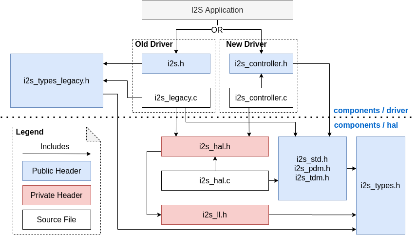
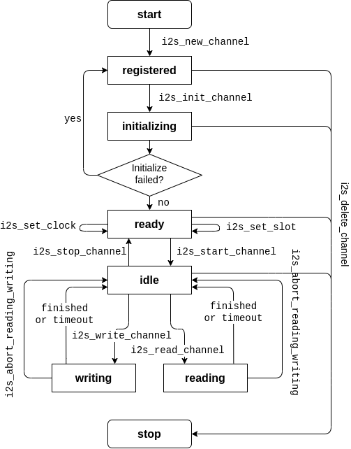

I2S
===

:link_to_translation:`en:[English]`

{IDF_TARGET_I2S_NUM:default="1", esp32="2", esp32s3="2"}

简介
----

I2S（Inter-IC Sound，集成电路内置音频总线）是一种同步串行通信协议，通常用于在两个数字音频设备之间传输音频数据。

{IDF_TARGET_NAME} 包含 {IDF_TARGET_I2S_NUM} 个 I2S 外设。通过配置这些外设，可以借助 I2S 驱动来输入和输出采样数据。

标准或 TDM 通信模式下的 I2S 总线包含以下几条线路：

- **MCLK**：主时钟线。该信号线可选，具体取决于从机，主要用于向 I2S 从机提供参考时钟。
- **BCLK**：位时钟线。用于数据线的位时钟。
- **WS**：字（声道）选择线。通常用于识别声道（除 PDM 模式外）。
- **DIN/DOUT**：串行数据输入/输出线。如果 DIN 和 DOUT 被配置到相同的 GPIO，数据将在内部回环。

.. only:: SOC_I2S_SUPPORTS_PDM_TX or SOC_I2S_SUPPORTS_PDM_RX

    PDM 通信模式下的 I2S 总线包含以下几条线路：

    - **CLK**：PDM 时钟线。
    - **DIN/DOUT**：串行数据输入/输出线。

每个 I2S 控制器都具备以下功能，可由 I2S 驱动进行配置：

- 可用作系统主机或从机
- 可用作发射器或接收器
- DMA 控制器支持流数据采样，CPU 无需单独复制每个采样数据

.. only:: SOC_I2S_HW_VERSION_1

    每个控制器都支持 RX 或 TX 单工通信。由于 RX 与 TX 通道共用一个时钟，因此只有在两者拥有相同配置时，才可以实现全双工通信。

.. only:: SOC_I2S_HW_VERSION_2

    每个控制器都有独立的 RX 和 TX 通道，连接到不同 GPIO 管脚，能够在不同的时钟和声道配置下工作。注意，尽管在一个控制器上 TX 通道和 RX 通道的内部 MCLK 相互独立，但输出的 MCLK 信号只能连接到一个通道。如果需要两个互相独立的 MCLK 输出，必须将其分配到不同的 I2S 控制器上。

I2S 文件结构
------------

    I2S 文件结构

**需要包含在 I2S 应用中的公共头文件如下所示：**

- ``i2s.h``：提供原有 I2S API（用于使用原有驱动的应用）。
- ``i2s_std.h``：提供标准通信模式的 API（用于使用标准模式的新驱动程序的应用）。
- ``i2s_pdm.h``：提供 PDM 通信模式的 API（用于使用 PDM 模式的新驱动程序的应用）。
- ``i2s_tdm.h``：提供 TDM 通信模式的 API（用于使用 TDM 模式的新驱动的应用）。

.. note::

    原有驱动与新驱动无法共存。包含 ``i2s.h`` 以使用原有驱动，或包含其他三个头文件以使用新驱动。原有驱动未来可能会被删除。

**已包含在上述头文件中的公共头文件如下所示：**

- ``i2s_types_legacy.h``：提供只在原有驱动中使用的原有公共类型。
- ``i2s_types.h``：提供公共类型。
- ``i2s_common.h``：提供所有通信模式通用的 API。

I2S 时钟
--------

时钟源
^^^^^^

- :cpp:enumerator:`i2s_clock_src_t::I2S_CLK_SRC_DEFAULT`：默认 PLL 时钟。

.. only:: not esp32h2

    - :cpp:enumerator:`i2s_clock_src_t::I2S_CLK_SRC_PLL_160M`：160 MHz PLL 时钟。

.. only:: esp32h2

    - :cpp:enumerator:`i2s_clock_src_t::I2S_CLK_SRC_PLL_96M`：96 MHz PLL 时钟。

.. only:: SOC_I2S_SUPPORTS_APLL

    - :cpp:enumerator:`i2s_clock_src_t::I2S_CLK_SRC_APLL`：音频 PLL 时钟，在高采样率应用中比 ``I2S_CLK_SRC_PLL_160M`` 更精确。其频率可根据采样率进行配置，但如果 APLL 已经被 EMAC 或其他通道占用，则无法更改 APLL 频率，驱动程序将尝试在原有 APLL 频率下工作。如果原有 APLL 频率无法满足 I2S 的需求，时钟配置将失败。

时钟术语
^^^^^^^^

- **采样率**：单声道每秒采样数据数量。
- **SCLK**：源时钟频率，即时钟源的频率。
- **MCLK**：主时钟频率，BCLK 由其产生。MCLK 信号通常作为参考时钟，用于同步 I2S 主机和从机之间的 BCLK 和 WS。
- **BCLK**：位时钟频率，一个 BCLK 时钟周期代表数据管脚上的一个数据位。通过 :cpp:member:`i2s_std_slot_config_t::slot_bit_width` 配置的通道位宽即为一个声道中的 BCLK 时钟周期数量，因此一个声道中可以有 8/16/24/32 个 BCLK 时钟周期。
- **LRCK** / **WS**：左/右时钟或字选择时钟。在非 PDM 模式下，其频率等于采样率。

.. note::

    通常，MCLK 应该同时是 ``采样率`` 和 BCLK 的倍数。字段 :cpp:member:`i2s_std_clk_config_t::mclk_multiple` 表示 MCLK 相对于 ``采样率`` 的倍数。在大多数情况下，将其设置为 ``I2S_MCLK_MULTIPLE_256`` 即可。但如果 ``slot_bit_width`` 被设置为 ``I2S_SLOT_BIT_WIDTH_24BIT``，为了保证 MCLK 是 BCLK 的整数倍，应该将 :cpp:member:`i2s_std_clk_config_t::mclk_multiple` 设置为能被 3 整除的倍数，如 ``I2S_MCLK_MULTIPLE_384``，否则 WS 会不精准。

.. _i2s-communication-mode:

I2S 通信模式
------------

模式概览
^^^^^^^^

=========  ========  ========  ========  ========  ========  ==========
芯片       I2S 标准   PDM TX    PDM RX     TDM      ADC/DAC   LCD/摄像头
=========  ========  ========  ========  ========  ========  ==========
ESP32      I2S 0/1    I2S 0     I2S 0      无       I2S 0      I2S 0
ESP32-S2    I2S 0     无        无         无       无         I2S 0
ESP32-C3    I2S 0     I2S 0     无        I2S 0     无         无
ESP32-C6    I2S 0     I2S 0     无        I2S 0     无         无
ESP32-S3   I2S 0/1    I2S 0     I2S 0    I2S 0/1    无         无
ESP32-H2    I2S 0     I2S 0     无        I2S 0     无         无
ESP32-P4   I2S 0~2    I2S 0     I2S 0    I2S 0~2    无         无
=========  ========  ========  ========  ========  ========  ==========

标准模式
^^^^^^^^

标准模式中有且仅有左右两个声道，驱动中将声道称为 slot。这些声道可以支持 8/16/24/32 位宽的采样数据，声道的通信格式主要包括以下几种：

- **Philips 格式**：数据信号与 WS 信号相比有一个位的位移。WS 信号的占空比为 50%。

.. wavedrom:: /../_static/diagrams/i2s/std_philips.json

- **MSB 格式**：与 Philips 格式基本相同，但其数据没有位移。

.. wavedrom:: /../_static/diagrams/i2s/std_msb.json

- **PCM 帧同步**：数据有一个位的位移，同时 WS 信号变成脉冲，持续一个 BCLK 周期。

.. wavedrom:: /../_static/diagrams/i2s/std_pcm.json

.. only:: SOC_I2S_SUPPORTS_PDM_TX

    PDM 模式 (TX)
    ^^^^^^^^^^^^^

    在 PDM（Pulse-density Modulation，脉冲密度调制）模式下，TX 通道可以将 PCM 数据转换为 PDM 格式，该格式始终有左右两个声道。PDM TX 只在 I2S0 中受支持，且只支持 16 位宽的采样数据。PDM TX 至少需要一个 CLK 管脚用于时钟信号，一个 DOUT 管脚用于数据信号（即下图中的 WS 和 SD 信号。BCK 信号为内部位采样时钟，在 PDM 设备之间不需要）。PDM 模式允许用户配置上采样参数 :cpp:member:`i2s_pdm_tx_clk_config_t::up_sample_fp` 和 :cpp:member:`i2s_pdm_tx_clk_config_t::up_sample_fs`，上采样率可以通过公式 ``up_sample_rate = i2s_pdm_tx_clk_config_t::up_sample_fp / i2s_pdm_tx_clk_config_t::up_sample_fs`` 来计算。在 PDM TX 中有以下两种上采样模式：

    - **固定时钟频率模式**：在这种模式下，上采样率将根据采样率的变化而变化。设置 ``fp = 960``、 ``fs = sample_rate / 100``，则 CLK 管脚上的时钟频率 (Fpdm) 将固定为 ``128 * 48 KHz = 6.144 MHz``。注意此频率不等于采样率 (Fpcm)。
    - **固定上采样率模式**：在这种模式下，上采样率固定为 2。设置 ``fp = 960``、 ``fs = 480``，则 CLK 管脚上的时钟频率 (Fpdm) 将为 ``128 * sample_rate``。

    .. wavedrom:: /../_static/diagrams/i2s/pdm.json

.. only:: SOC_I2S_SUPPORTS_PDM_RX

    PDM 模式 (RX)
    ^^^^^^^^^^^^^

    在 PDM（Pulse-density Modulation，脉冲密度调制）模式下，RX 通道可以接收 PDM 格式的数据并将数据转换成 PCM 格式。PDM RX 只在 I2S0 中受支持，且只支持 16 位宽的采样数据。PDM RX 至少需要一个 CLK 管脚用于时钟信号，一个 DIN 管脚用于数据信号。此模式允许用户配置下采样参数 :cpp:member:`i2s_pdm_rx_clk_config_t::dn_sample_mode`。在 PDM RX 中有以下两种下采样模式：

    - :cpp:enumerator:`i2s_pdm_dsr_t::I2S_PDM_DSR_8S`：在这种模式下，WS 管脚的时钟频率 (Fpdm) 将为 ``sample_rate (Fpcm) * 64``。
    - :cpp:enumerator:`i2s_pdm_dsr_t::I2S_PDM_DSR_16S`： 在这种模式下，WS 管脚的时钟频率 (Fpdm) 将为 ``sample_rate (Fpcm) * 128``。

.. only:: SOC_I2S_SUPPORTS_TDM

    TDM 模式
    ^^^^^^^^

    TDM（Time Division Multiplexing，时分多路复用）模式最多支持 16 个声道，可通过 :cpp:member:`i2s_tdm_slot_config_t::slot_mask` 启用通道。

    .. only:: SOC_I2S_TDM_FULL_DATA_WIDTH

        该模式下无论启用多少声道，都支持任意数据位宽，也即一个帧中最多可以有 ``32 位宽 * 16 个声道 = 512 位`` 的数据。

    .. only:: not SOC_I2S_TDM_FULL_DATA_WIDTH

        但由于硬件限制，声道设置为 32 位宽时最多只能支持 4 个声道，16 位宽时最多只能支持 8 个声道，8 位宽时最多只能支持 16 个声道。TDM 的声道通信格式与标准模式基本相同，但有一些细微差别。

    - **Philips 格式**：数据信号与 WS 信号相比有一个位的位移。无论一帧中包含多少个声道，WS 信号的占空比将始终保持为 50%。

    .. wavedrom:: /../_static/diagrams/i2s/tdm_philips.json

    - **MSB 格式**：与 Philips 格式基本相同，但数据没有位移。

    .. wavedrom:: /../_static/diagrams/i2s/tdm_msb.json

    - **PCM 短帧同步**：数据有一个位的位移，同时 WS 信号变为脉冲，每帧持续一个 BCLK 周期。

    .. wavedrom:: /../_static/diagrams/i2s/tdm_pcm_short.json

    - **PCM 长帧同步**：数据有一个位的位移，同时 WS 信号将在每一帧持续一个声道的宽度。例如，如果启用了四个声道，那么 WS 的占空比将是 25%，如果启用了五个声道，则为 20%。

    .. wavedrom:: /../_static/diagrams/i2s/tdm_pcm_long.json

.. only:: SOC_I2S_SUPPORTS_LCD_CAMERA

    LCD/摄像头模式
    ^^^^^^^^^^^^^^^

    LCD/摄像头模式只支持在 I2S0 上通过并行总线运行。在 LCD 模式下，I2S0 应当设置为主机 TX 模式；在摄像头模式下，I2S0 应当设置为从机 RX 模式。这两种模式不是由 I2S 驱动实现的，关于 LCD 模式的实现，请参阅 :doc:`/api-reference/peripherals/lcd/i80_lcd`。更多信息请参考 **{IDF_TARGET_NAME} 技术参考手册** > **I2S 控制器 (I2S)** > LCD 模式 [`PDF <{IDF_TARGET_TRM_EN_URL}#camlcdctrl>`__]。

.. only:: SOC_I2S_SUPPORTS_ADC_DAC

    ADC/DAC 模式
    ^^^^^^^^^^^^^

    仅 ESP32 支持在 I2S0 上运行 ADC 和 DAC 模式。实际上，ADC 和 DAC 模式是 LCD/摄像头模式的两个子模式。I2S0 可以直接路由到内部模数转换器 (ADC) 和数模转换器 (DAC)，也即 ADC 和 DAC 外设可以通过 I2S0 的 DMA 连续读取或写入数据。由于 ADC 和 DAC 并非通信模式，因此并没有在 I2S 驱动中实现。

功能概览
--------

I2S 驱动提供以下服务：

资源管理
^^^^^^^^

I2S 驱动中的资源可分为三个级别：

- ``平台级资源``：当前芯片中所有 I2S 控制器的资源。
- ``控制器级资源``：一个 I2S 控制器的资源。
- ``通道级资源``：一个 I2S 控制器 TX 或 RX 通道的资源。

公开的 API 都是通道级别的 API，通道句柄 :cpp:type:`i2s_chan_handle_t` 可以帮助用户管理特定通道下的资源，而无需考虑其他两个级别的资源。高级别资源为私有资源，由驱动自动管理。用户可以调用 :cpp:func:`i2s_new_channel` 来分配通道句柄，或调用 :cpp:func:`i2s_del_channel` 来删除该句柄。

电源管理
^^^^^^^^

电源管理启用（即开启 :ref:`CONFIG_PM_ENABLE`）时，系统将在进入 Light-sleep 前调整或停止 I2S 时钟源，这可能会影响 I2S 信号，从而导致传输或接收的数据无效。

I2S 驱动可以获取电源管理锁，从而防止系统设置更改或时钟源被禁用。时钟源为 APB 时，锁的类型将被设置为 :cpp:enumerator:`esp_pm_lock_type_t::ESP_PM_APB_FREQ_MAX`。时钟源为 APLL（若支持）时，锁的类型将被设置为 :cpp:enumerator:`esp_pm_lock_type_t::ESP_PM_NO_LIGHT_SLEEP`。用户通过 I2S 读写时（即调用 :cpp:func:`i2s_channel_read` 或 :cpp:func:`i2s_channel_write`），驱动程序将获取电源管理锁，并在读写完成后释放锁。

有限状态机
^^^^^^^^^^

I2S 通道有三种状态，分别为 ``registered（已注册）``、 ``ready（准备就绪）`` 和 ``running（运行中）``，它们的关系如下图所示：

    I2S 有限状态机

图中的 ``<mode>`` 可用相应的 I2S 通信模式来代替，如 ``std`` 代表标准的双声道模式。更多关于通信模式的信息，请参考 :ref:`i2s-communication-mode` 小节。

数据传输
^^^^^^^^

I2S 的数据传输（包括数据发送和接收）由 DMA 实现。在传输数据之前，请调用 :cpp:func:`i2s_channel_enable` 来启用特定的通道。发送或接收的数据达到 DMA 缓冲区的大小时，将触发 ``I2S_OUT_EOF`` 或 ``I2S_IN_SUC_EOF`` 中断。注意，DMA 缓冲区的大小不等于 :cpp:member:`i2s_chan_config_t::dma_frame_num`，这里的一帧是指一个 WS 周期内的所有采样数据。因此， ``dma_buffer_size = dma_frame_num * slot_num * slot_bit_width / 8``。传输数据时，可以调用 :cpp:func:`i2s_channel_write` 来输入数据，并把数据从源缓冲区复制到 DMA TX 缓冲区等待传输完成。此过程将重复进行，直到发送的字节数达到配置的大小。接收数据时，用户可以调用函数 :cpp:func:`i2s_channel_read` 来等待接收包含 DMA 缓冲区地址的消息队列，从而将数据从 DMA RX 缓冲区复制到目标缓冲区。

:cpp:func:`i2s_channel_write` 和 :cpp:func:`i2s_channel_read` 都是阻塞函数，在源缓冲区的数据发送完毕前，或是整个目标缓冲区都被加载数据占用时，它们会一直保持等待状态。在等待时间达到最大阻塞时间时，返回 ``ESP_ERR_TIMEOUT`` 错误。要实现异步发送或接收数据，可以通过 :cpp:func:`i2s_channel_register_event_callback` 注册回调，随即便可在回调函数中直接访问 DMA 缓冲区，无需通过这两个阻塞函数来发送或接收数据。但请注意，该回调是一个中断回调，不要在该回调中添加复杂的逻辑、进行浮点运算或调用不可重入函数。

配置
^^^^

用户可以通过调用相应函数（即 :func:`i2s_channel_init_std_mode`、 :func:`i2s_channel_init_pdm_rx_mode`、 :func:`i2s_channel_init_pdm_tx_mode` 或 :func:`i2s_channel_init_tdm_mode`）将通道初始化为特定模式。如果初始化后需要更新配置，必须先调用 :cpp:func:`i2s_channel_disable` 以确保通道已经停止运行，然后再调用相应的 'reconfig' 函数，例如 :cpp:func:`i2s_channel_reconfig_std_slot`、 :cpp:func:`i2s_channel_reconfig_std_clock` 和 :cpp:func:`i2s_channel_reconfig_std_gpio`。

IRAM 安全
^^^^^^^^^

默认情况下，由于写入或擦除 flash 等原因导致 cache 被禁用时，I2S 中断将产生延迟，无法及时执行 EOF 中断。

在实时应用中，可通过启用 Kconfig 选项 :ref:`CONFIG_I2S_ISR_IRAM_SAFE` 来避免此种情况发生，启用后：

1. 即使在 cache 被禁用的情况下，中断仍可继续运行。

2. 驱动程序将存放进 DRAM 中（以防其意外映射到 PSRAM 中）。

启用该选项可以保证 cache 禁用时的中断运行，但会相应增加 IRAM 占用。

线程安全
^^^^^^^^

驱动程序可保证所有公开的 I2S API 的线程安全，使用时，可以直接从不同的 RTOS 任务中调用此类 API，无需额外锁保护。注意，I2S 驱动使用 mutex 锁来保证线程安全，因此不允许在 ISR 中使用这些 API。

Kconfig 选项
^^^^^^^^^^^^

- :ref:`CONFIG_I2S_ISR_IRAM_SAFE` 控制默认 ISR 处理程序能否在禁用 cache 的情况下工作。更多信息可参考 `IRAM 安全 <#iram-safe>`__。
- :ref:`CONFIG_I2S_SUPPRESS_DEPRECATE_WARN` 控制是否在使用原有 I2S 驱动时关闭警告信息。
- :ref:`CONFIG_I2S_ENABLE_DEBUG_LOG` 用于启用调试日志输出。启用该选项将增加固件的二进制文件大小。

应用实例
--------

I2S 驱动例程请参考 :example:`peripherals/i2s` 目录。以下为每种模式的简单用法：

标准 TX/RX 模式的应用
^^^^^^^^^^^^^^^^^^^^^

不同声道的通信格式可通过以下标准模式的辅助宏来生成。如上所述，在标准模式下有三种格式，辅助宏分别为：

- :c:macro:`I2S_STD_PHILIPS_SLOT_DEFAULT_CONFIG`
- :c:macro:`I2S_STD_PCM_SLOT_DEFAULT_CONFIG`
- :c:macro:`I2S_STD_MSB_SLOT_DEFAULT_CONFIG`

时钟配置的辅助宏为：

- :c:macro:`I2S_STD_CLK_DEFAULT_CONFIG`。

请参考 :ref:`i2s-api-reference-i2s_std` 了解 STD API 的相关信息。更多细节请参考 :component_file:`esp_driver_i2s/include/driver/i2s_std.h`。

STD TX 模式
~~~~~~~~~~~~~

以 16 位数据位宽为例，如果 ``uint16_t`` 写缓冲区中的数据如下所示：

+--------+--------+--------+--------+--------+--------+--------+--------+--------+
| 数据 0 | 数据 1 | 数据 2 | 数据 3 | 数据 4 | 数据 5 | 数据 6 | 数据 7 |  ...   |
+========+========+========+========+========+========+========+========+========+
| 0x0001 | 0x0002 | 0x0003 | 0x0004 | 0x0005 | 0x0006 | 0x0007 | 0x0008 |  ...   |
+--------+--------+--------+--------+--------+--------+--------+--------+--------+

下表展示了在不同 :cpp:member:`i2s_std_slot_config_t::slot_mode` 和 :cpp:member:`i2s_std_slot_config_t::slot_mask` 设置下线路上的真实数据。

.. only:: esp32

    +----------------+-----------+-----------+----------+----------+----------+----------+----------+----------+----------+----------+
    | 数据位宽       | 声道模式  | 声道掩码  | WS 低电平| WS 高电平| WS 低电平| WS 高电平| WS 低电平| WS 高电平| WS 低电平| WS 高电平|
    +================+===========+===========+==========+==========+==========+==========+==========+==========+==========+==========+
    |                |  单声道   |   左      | 0x0002   | 0x0000   | 0x0001   | 0x0000   | 0x0004   | 0x0000   | 0x0003   | 0x0000   |
    |     16 位      |           +-----------+----------+----------+----------+----------+----------+----------+----------+----------+
    |                |           |   右      | 0x0000   | 0x0002   | 0x0000   | 0x0001   | 0x0000   | 0x0004   | 0x0000   | 0x0003   |
    |                |           +-----------+----------+----------+----------+----------+----------+----------+----------+----------+
    |                |           |   左右    | 0x0002   | 0x0002   | 0x0001   | 0x0001   | 0x0004   | 0x0004   | 0x0003   | 0x0003   |
    |                +-----------+-----------+----------+----------+----------+----------+----------+----------+----------+----------+
    |                |  立体声   |   左      | 0x0001   | 0x0001   | 0x0003   | 0x0003   | 0x0005   | 0x0005   | 0x0007   | 0x0007   |
    |                |           +-----------+----------+----------+----------+----------+----------+----------+----------+----------+
    |                |           |   右      | 0x0002   | 0x0002   | 0x0004   | 0x0004   | 0x0006   | 0x0006   | 0x0008   | 0x0008   |
    |                |           +-----------+----------+----------+----------+----------+----------+----------+----------+----------+
    |                |           |   左右    | 0x0001   | 0x0002   | 0x0003   | 0x0004   | 0x0005   | 0x0006   | 0x0007   | 0x0008   |
    +----------------+-----------+-----------+----------+----------+----------+----------+----------+----------+----------+----------+

    .. note::

        当数据位宽为 32 位时，情况与上表类似，但当位宽为 8 位和 24 位时需要额外注意。数据位宽为 8 时，写入的缓冲区仍应使用 ``uint16_t`` （即以 2 字节对齐），并且只有高 8 位有效，低 8 位将被丢弃；数据位宽为 24 时，缓冲区应该使用 ``uint32_t`` （ 即以 4 字节对齐），并且只有高 24 位有效，低 8 位将被丢弃。

        另外，在 8 位宽和 16 位宽单声道模式下，线路上的真实数据顺序会被调换。为了获取正确的数据顺序，写入缓冲区时，每两个字节需要调换一次数据顺序。

.. only:: esp32s2

    +----------------+-----------+-----------+----------+----------+----------+----------+----------+----------+----------+----------+
    | 数据位宽       | 声道模式  | 声道掩码  | WS 低电平| WS 高电平| WS 低电平| WS 高电平| WS 低电平| WS 高电平| WS 低电平| WS 高电平|
    +================+===========+===========+==========+==========+==========+==========+==========+==========+==========+==========+
    |                |  单声道   |   左      | 0x0001   | 0x0000   | 0x0002   | 0x0000   | 0x0003   | 0x0000   | 0x0004   | 0x0000   |
    |     16 位      |           +-----------+----------+----------+----------+----------+----------+----------+----------+----------+
    |                |           |   右      | 0x0000   | 0x0001   | 0x0000   | 0x0002   | 0x0000   | 0x0003   | 0x0000   | 0x0004   |
    |                |           +-----------+----------+----------+----------+----------+----------+----------+----------+----------+
    |                |           |   左右    | 0x0001   | 0x0001   | 0x0002   | 0x0002   | 0x0003   | 0x0003   | 0x0004   | 0x0004   |
    |                +-----------+-----------+----------+----------+----------+----------+----------+----------+----------+----------+
    |                |  立体声   |   左      | 0x0001   | 0x0001   | 0x0003   | 0x0003   | 0x0005   | 0x0005   | 0x0007   | 0x0007   |
    |                |           +-----------+----------+----------+----------+----------+----------+----------+----------+----------+
    |                |           |   右      | 0x0002   | 0x0002   | 0x0004   | 0x0004   | 0x0006   | 0x0006   | 0x0008   | 0x0008   |
    |                |           +-----------+----------+----------+----------+----------+----------+----------+----------+----------+
    |                |           |   左右    | 0x0001   | 0x0002   | 0x0003   | 0x0004   | 0x0005   | 0x0006   | 0x0007   | 0x0008   |
    +----------------+-----------+-----------+----------+----------+----------+----------+----------+----------+----------+----------+

    .. note::

        数据位宽为 8 位和 32 位时，缓冲区的类型最好为 ``uint8_t`` 和 ``uint32_t``。但需注意，数据位宽为 24 位时，数据缓冲区应该以 3 字节对齐，即每 3 个字节代表一个 24 位数据，另外，:cpp:member:`i2s_chan_config_t::dma_frame_num`、 :cpp:member:`i2s_std_clk_config_t::mclk_multiple` 和写缓冲区的大小应该为 ``3`` 的倍数，否则线路上的数据或采样率可能会不准确。

.. only:: not (esp32 or esp32s2)

    +----------------+-----------+-----------+----------+----------+----------+----------+----------+----------+----------+----------+
    | 数据位宽       | 声道模式  | 声道掩码  | WS 低电平| WS 高电平| WS 低电平| WS 高电平| WS 低电平| WS 高电平| WS 低电平| WS 高电平|
    +================+===========+===========+==========+==========+==========+==========+==========+==========+==========+==========+
    |                |  单声道   |   左      | 0x0001   | 0x0000   | 0x0002   | 0x0000   | 0x0003   | 0x0000   | 0x0004   | 0x0000   |
    |     16 位      |           +-----------+----------+----------+----------+----------+----------+----------+----------+----------+
    |                |           |   右      | 0x0000   | 0x0001   | 0x0000   | 0x0002   | 0x0000   | 0x0003   | 0x0000   | 0x0004   |
    |                |           +-----------+----------+----------+----------+----------+----------+----------+----------+----------+
    |                |           |   左右    | 0x0001   | 0x0001   | 0x0002   | 0x0002   | 0x0003   | 0x0003   | 0x0004   | 0x0004   |
    |                +-----------+-----------+----------+----------+----------+----------+----------+----------+----------+----------+
    |                |  立体声   |   左      | 0x0001   | 0x0000   | 0x0003   | 0x0000   | 0x0005   | 0x0000   | 0x0007   | 0x0000   |
    |                |           +-----------+----------+----------+----------+----------+----------+----------+----------+----------+
    |                |           |   右      | 0x0000   | 0x0002   | 0x0000   | 0x0004   | 0x0000   | 0x0006   | 0x0000   | 0x0008   |
    |                |           +-----------+----------+----------+----------+----------+----------+----------+----------+----------+
    |                |           |   左右    | 0x0001   | 0x0002   | 0x0003   | 0x0004   | 0x0005   | 0x0006   | 0x0007   | 0x0008   |
    +----------------+-----------+-----------+----------+----------+----------+----------+----------+----------+----------+----------+

    .. note::

        数据位宽为 8 位和 32 位时，缓冲区的类型最好为 ``uint8_t`` 和 ``uint32_t``。但需注意，数据位宽为 24 位时，数据缓冲区应该以 3 字节对齐，即每 3 个字节代表一个 24 位数据，另外，:cpp:member:`i2s_chan_config_t::dma_frame_num`、 :cpp:member:`i2s_std_clk_config_t::mclk_multiple` 和写缓冲区的大小应该为 ``3`` 的倍数，否则线路上的数据或采样率可能会不准确。

.. code-block:: c

    #include "driver/i2s_std.h"
    #include "driver/gpio.h"

    i2s_chan_handle_t tx_handle;
    /* 通过辅助宏获取默认的通道配置
     * 这个辅助宏在 'i2s_common.h' 中定义，由所有 I2S 通信模式共享
     * 它可以帮助指定 I2S 角色和端口 ID */
    i2s_chan_config_t chan_cfg = I2S_CHANNEL_DEFAULT_CONFIG(I2S_NUM_AUTO, I2S_ROLE_MASTER);
    /* 分配新的 TX 通道并获取该通道的句柄 */
    i2s_new_channel(&chan_cfg, &tx_handle, NULL);

    /* 进行配置，可以通过宏生成声道配置和时钟配置
     * 这两个辅助宏在 'i2s_std.h' 中定义，只能用于 STD 模式
     * 它们可以帮助初始化或更新声道和时钟配置 */
    i2s_std_config_t std_cfg = {
        .clk_cfg = I2S_STD_CLK_DEFAULT_CONFIG(48000),
        .slot_cfg = I2S_STD_MSB_SLOT_DEFAULT_CONFIG(I2S_DATA_BIT_WIDTH_32BIT, I2S_SLOT_MODE_STEREO),
        .gpio_cfg = {
            .mclk = I2S_GPIO_UNUSED,
            .bclk = GPIO_NUM_4,
            .ws = GPIO_NUM_5,
            .dout = GPIO_NUM_18,
            .din = I2S_GPIO_UNUSED,
            .invert_flags = {
                .mclk_inv = false,
                .bclk_inv = false,
                .ws_inv = false,
            },
        },
    };
    /* 初始化通道 */
    i2s_channel_init_std_mode(tx_handle, &std_cfg);

    /* 在写入数据之前，先启用 TX 通道 */
    i2s_channel_enable(tx_handle);
    i2s_channel_write(tx_handle, src_buf, bytes_to_write, bytes_written, ticks_to_wait);

    /* 如果需要更新声道或时钟配置
     * 需要在更新前先禁用通道 */
    // i2s_channel_disable(tx_handle);
    // std_cfg.slot_cfg.slot_mode = I2S_SLOT_MODE_MONO; // 默认为立体声
    // i2s_channel_reconfig_std_slot(tx_handle, &std_cfg.slot_cfg);
    // std_cfg.clk_cfg.sample_rate_hz = 96000;
    // i2s_channel_reconfig_std_clock(tx_handle, &std_cfg.clk_cfg);

    /* 删除通道之前必须先禁用通道 */
    i2s_channel_disable(tx_handle);
    /* 如果不再需要句柄，删除该句柄以释放通道资源 */
    i2s_del_channel(tx_handle);

STD RX 模式
~~~~~~~~~~~~

例如，当数据位宽为 16 时，如线路上的数据如下所示：

+----------+----------+----------+----------+----------+----------+----------+----------+----------+
| WS 低电平| WS 高电平| WS 低电平| WS 高电平| WS 低电平| WS 高电平| WS 低电平| WS 高电平|  ...     |
+==========+==========+==========+==========+==========+==========+==========+==========+==========+
| 0x0001   | 0x0002   | 0x0003   | 0x0004   | 0x0005   | 0x0006   | 0x0007   | 0x0008   |  ...     |
+----------+----------+----------+----------+----------+----------+----------+----------+----------+

不同 :cpp:member:`i2s_std_slot_config_t::slot_mode` 和 :cpp:member:`i2s_std_slot_config_t::slot_mask` 配置下缓冲区中收到的数据如下所示。

.. only:: esp32

    +----------------+-----------+-----------+----------+----------+----------+----------+----------+----------+----------+----------+
    |   数据位宽     | 声道模式  | 声道掩码  | 数据 0   | 数据 1   | 数据 2   | 数据 3   | 数据 4   | 数据 5   | 数据 6   | 数据 7   |
    +================+===========+===========+==========+==========+==========+==========+==========+==========+==========+==========+
    |                |  单声道   |   左      | 0x0001   | 0x0000   | 0x0005   | 0x0003   | 0x0009   | 0x0007   | 0x000d   | 0x000b   |
    |                |           +-----------+----------+----------+----------+----------+----------+----------+----------+----------+
    |     16 位      |           |   右      | 0x0002   | 0x0000   | 0x0006   | 0x0004   | 0x000a   | 0x0008   | 0x000e   | 0x000c   |
    |                +-----------+-----------+----------+----------+----------+----------+----------+----------+----------+----------+
    |                |  立体声   |   任意    | 0x0001   | 0x0002   | 0x0003   | 0x0004   | 0x0005   | 0x0006   | 0x0007   | 0x0008   |
    +----------------+-----------+-----------+----------+----------+----------+----------+----------+----------+----------+----------+

    .. note::

        ESP32 上的接收有些复杂。首先，当数据位宽为 8 位或 24 位时，接收的数据仍将以 2 个字节或 4 个字节对齐，这意味着有效数据被放在每两个字节的高 8 位和每四个字节的高 24 位。例如，当线路上的数据是 8 位宽度的 ``0x5A`` 时，接收的数据将是 ``0x5A00``；当数据是 ``0x00 005A`` 时，则收到 ``0x0000 5A00``。其次，在 8 位宽和 16 位宽单声道传输中，缓冲区内每两个数据会进行一次数据翻转，因此可能需要手动将顺序回转，以获取正确的数据顺序。

.. only:: esp32s2

    +----------------+-----------+-----------+----------+----------+----------+----------+----------+----------+----------+----------+
    |   数据位宽     | 声道模式  | 声道掩码  | 数据 0   | 数据 1   | 数据 2   | 数据 3   | 数据 4   | 数据 5   | 数据 6   | 数据 7   |
    +================+===========+===========+==========+==========+==========+==========+==========+==========+==========+==========+
    |                |  单声道   |   左      | 0x0001   | 0x0003   | 0x0005   | 0x0007   | 0x0009   | 0x000b   | 0x000d   | 0x000f   |
    |                |           +-----------+----------+----------+----------+----------+----------+----------+----------+----------+
    |     16 位      |           |   右      | 0x0002   | 0x0004   | 0x0006   | 0x0008   | 0x000a   | 0x000c   | 0x000e   | 0x0010   |
    |                +-----------+-----------+----------+----------+----------+----------+----------+----------+----------+----------+
    |                |  立体声   |   任意    | 0x0001   | 0x0002   | 0x0003   | 0x0004   | 0x0005   | 0x0006   | 0x0007   | 0x0008   |
    +----------------+-----------+-----------+----------+----------+----------+----------+----------+----------+----------+----------+

    .. note::

        8 位、24 位和 32 位与 16 位的情况类似，接收缓冲区的数据位宽与线路上的数据位宽相等。此外需注意，数据位宽为 24 位时， :cpp:member:`i2s_chan_config_t::dma_frame_num`、 :cpp:member:`i2s_std_clk_config_t::mclk_multiple` 和接收缓冲区的大小应该为 ``3`` 的倍数，否则线路上的数据或采样率可能会不准确。

.. only:: not (esp32 or esp32s2)

    +----------------+-----------+-----------+----------+----------+----------+----------+----------+----------+----------+----------+
    |   数据位宽     | 声道模式  | 声道掩码  | 数据 0   | 数据 1   | 数据 2   | 数据 3   | 数据 4   | 数据 5   | 数据 6   | 数据 7   |
    +================+===========+===========+==========+==========+==========+==========+==========+==========+==========+==========+
    |                |  单声道   |   左      | 0x0001   | 0x0003   | 0x0005   | 0x0007   | 0x0009   | 0x000b   | 0x000d   | 0x000f   |
    |                |           +-----------+----------+----------+----------+----------+----------+----------+----------+----------+
    |     16 位      |           |   右      | 0x0002   | 0x0004   | 0x0006   | 0x0008   | 0x000a   | 0x000c   | 0x000e   | 0x0010   |
    |                +-----------+-----------+----------+----------+----------+----------+----------+----------+----------+----------+
    |                |  立体声   |   任意    | 0x0001   | 0x0002   | 0x0003   | 0x0004   | 0x0005   | 0x0006   | 0x0007   | 0x0008   |
    +----------------+-----------+-----------+----------+----------+----------+----------+----------+----------+----------+----------+

    .. note::

        8 位、24 位和 32 位与 16 位的情况类似，接收缓冲区的数据位宽与线路上的数据位宽相等。此外需注意，数据位宽为 24 位时， :cpp:member:`i2s_chan_config_t::dma_frame_num`、 :cpp:member:`i2s_std_clk_config_t::mclk_multiple` 和接收缓冲区的大小应该为 ``3`` 的倍数，否则线路上的数据或采样率可能会不准确。

.. code-block:: c

    #include "driver/i2s_std.h"
    #include "driver/gpio.h"

    i2s_chan_handle_t rx_handle;
    /* 通过辅助宏获取默认的通道配置
     * 这个辅助宏在 'i2s_common.h' 中定义，由所有 I2S 通信模式共享
     * 它可以帮助指定 I2S 角色和端口 ID */
    i2s_chan_config_t chan_cfg = I2S_CHANNEL_DEFAULT_CONFIG(I2S_NUM_AUTO, I2S_ROLE_MASTER);
    /* 分配新的 TX 通道并获取该通道的句柄 */
    i2s_new_channel(&chan_cfg, NULL, &rx_handle);

    /* 进行配置，可以通过宏生成声道配置和时钟配置
     * 这两个辅助宏在 'i2s_std.h' 中定义，只能用于 STD 模式
     * 它们可以帮助初始化或更新声道和时钟配置 */
    i2s_std_config_t std_cfg = {
        .clk_cfg = I2S_STD_CLK_DEFAULT_CONFIG(48000),
        .slot_cfg = I2S_STD_MSB_SLOT_DEFAULT_CONFIG(I2S_DATA_BIT_WIDTH_32BIT, I2S_SLOT_MODE_STEREO),
        .gpio_cfg = {
            .mclk = I2S_GPIO_UNUSED,
            .bclk = GPIO_NUM_4,
            .ws = GPIO_NUM_5,
            .dout = I2S_GPIO_UNUSED,
            .din = GPIO_NUM_19,
            .invert_flags = {
                .mclk_inv = false,
                .bclk_inv = false,
                .ws_inv = false,
            },
        },
    };
    /* 初始化通道 */
    i2s_channel_init_std_mode(rx_handle, &std_cfg);

    /* 在读取数据之前，先启动 RX 通道 */
    i2s_channel_enable(rx_handle);
    i2s_channel_read(rx_handle, desc_buf, bytes_to_read, bytes_read, ticks_to_wait);

    /* 删除通道之前必须先禁用通道 */
    i2s_channel_disable(rx_handle);
    /* 如果不再需要句柄，删除该句柄以释放通道资源 */
    i2s_del_channel(rx_handle);

.. only:: SOC_I2S_SUPPORTS_PDM_TX

    PDM TX 模式的应用
    ^^^^^^^^^^^^^^^^^^^

    针对 TX 通道的 PDM 模式，声道配置的辅助宏为：

    - :c:macro:`I2S_PDM_TX_SLOT_DEFAULT_CONFIG`

    时钟配置的辅助宏为：

    - :c:macro:`I2S_PDM_TX_CLK_DEFAULT_CONFIG`

    PDM TX API 的相关信息，可参考 :ref:`i2s-api-reference-i2s_pdm`。更多细节请参阅 :component_file:`esp_driver_i2s/include/driver/i2s_pdm.h`。

    PDM 数据位宽固定为 16 位。如果 ``int16_t`` 写缓冲区中的数据如下：

    +--------+--------+--------+--------+--------+--------+--------+--------+--------+
    | 数据 0 | 数据 1 | 数据 2 | 数据 3 | 数据 4 | 数据 5 | 数据 6 | 数据 7 |  ...   |
    +========+========+========+========+========+========+========+========+========+
    | 0x0001 | 0x0002 | 0x0003 | 0x0004 | 0x0005 | 0x0006 | 0x0007 | 0x0008 |  ...   |
    +--------+--------+--------+--------+--------+--------+--------+--------+--------+

    .. only:: esp32

        下表展示了不同 :cpp:member:`i2s_pdm_tx_slot_config_t::slot_mode` 和 :cpp:member:`i2s_pdm_tx_slot_config_t::slot_mask` 设置下线路上的真实数据。为方便理解，已将线路上的数据格式由 PDM 转为 PCM。

        +-----------+-----------+----------+----------+----------+----------+----------+----------+----------+----------+
        | 声道模式  | 声道掩码  |  左      |  右      |  左      |  右      |  左      |  右      |  左      |  右      |
        +===========+===========+==========+==========+==========+==========+==========+==========+==========+==========+
        |  单声道   |   左      | 0x0001   | 0x0000   | 0x0002   | 0x0000   | 0x0003   | 0x0000   | 0x0004   | 0x0000   |
        |           +-----------+----------+----------+----------+----------+----------+----------+----------+----------+
        |           |   右      | 0x0000   | 0x0001   | 0x0000   | 0x0002   | 0x0000   | 0x0003   | 0x0000   | 0x0004   |
        |           +-----------+----------+----------+----------+----------+----------+----------+----------+----------+
        |           |   左右    | 0x0001   | 0x0001   | 0x0002   | 0x0002   | 0x0003   | 0x0003   | 0x0004   | 0x0004   |
        +-----------+-----------+----------+----------+----------+----------+----------+----------+----------+----------+
        |  立体声   |   左      | 0x0001   | 0x0001   | 0x0003   | 0x0003   | 0x0005   | 0x0005   | 0x0007   | 0x0007   |
        |           +-----------+----------+----------+----------+----------+----------+----------+----------+----------+
        |           |   右      | 0x0002   | 0x0002   | 0x0004   | 0x0004   | 0x0006   | 0x0006   | 0x0008   | 0x0008   |
        |           +-----------+----------+----------+----------+----------+----------+----------+----------+----------+
        |           |   左右    | 0x0001   | 0x0002   | 0x0003   | 0x0004   | 0x0005   | 0x0006   | 0x0007   | 0x0008   |
        +-----------+-----------+----------+----------+----------+----------+----------+----------+----------+----------+

    .. only:: not esp32

        下表展示了不同 :cpp:member:`i2s_pdm_tx_slot_config_t::slot_mode` 和 :cpp:member:`i2s_pdm_tx_slot_config_t::slot_mask` 设置下线路上的真实数据。为方便理解，已将线路上的数据格式由 PDM 转为 PCM。

        +----------------+-----------+------+--------+--------+--------+--------+--------+--------+--------+--------+
        |    线路模式    | 声道模式  | 线路 |     左 |     右 |     左 |     右 |     左 |     右 |     左 |     右 |
        +================+===========+======+========+========+========+========+========+========+========+========+
        |                |   单声道  | dout | 0x0001 | 0x0000 | 0x0002 | 0x0000 | 0x0003 | 0x0000 | 0x0004 | 0x0000 |
        | 单线 Codec     +-----------+------+--------+--------+--------+--------+--------+--------+--------+--------+
        |                |   立体声  | dout | 0x0001 | 0x0002 | 0x0003 | 0x0004 | 0x0005 | 0x0006 | 0x0007 | 0x0008 |
        +----------------+-----------+------+--------+--------+--------+--------+--------+--------+--------+--------+
        |  单线 DAC      |  单声道   | dout | 0x0001 | 0x0001 | 0x0002 | 0x0002 | 0x0003 | 0x0003 | 0x0004 | 0x0004 |
        +----------------+-----------+------+--------+--------+--------+--------+--------+--------+--------+--------+
        |                |   单声道  | dout | 0x0002 | 0x0002 | 0x0004 | 0x0004 | 0x0006 | 0x0006 | 0x0008 | 0x0008 |
        |                |           +------+--------+--------+--------+--------+--------+--------+--------+--------+
        |                |           | dout2| 0x0000 | 0x0000 | 0x0000 | 0x0000 | 0x0000 | 0x0000 | 0x0000 | 0x0000 |
        |  双线 DAC      +-----------+------+--------+--------+--------+--------+--------+--------+--------+--------+
        |                |   立体声  | dout | 0x0002 | 0x0002 | 0x0004 | 0x0004 | 0x0006 | 0x0006 | 0x0008 | 0x0008 |
        |                |           +------+--------+--------+--------+--------+--------+--------+--------+--------+
        |                |           | dout2| 0x0001 | 0x0001 | 0x0003 | 0x0003 | 0x0005 | 0x0005 | 0x0007 | 0x0007 |
        +----------------+-----------+------+--------+--------+--------+--------+--------+--------+--------+--------+

        .. note::

            PDM TX 模式有三种线路模式，分别为 ``I2S_PDM_TX_ONE_LINE_CODEC``、 ``I2S_PDM_TX_ONE_LINE_DAC`` 和 ``I2S_PDM_TX_TWO_LINE_DAC``。单线 Codec 用于需要时钟信号的 PDM 编解码器，PDM 编解码器可以通过时钟电平来区分左右声道。另外两种模式可通过低通滤波器直接驱动功率放大器，而无需时钟信号，所以有两条线路来区分左右声道。此外，对于单线 Codec 的单声道模式，可以通过在 GPIO 配置中设置时钟反转标志，强制将声道改变为右声道。

    .. code-block:: c

        #include "driver/i2s_pdm.h"
        #include "driver/gpio.h"

        /* 分配 I2S TX 通道 */
        i2s_chan_config_t chan_cfg = I2S_CHANNEL_DEFAULT_CONFIG(I2S_NUM_0, I2S_ROLE_MASTER);
        i2s_new_channel(&chan_cfg, &tx_handle, NULL);

        /* 初始化通道为 PDM TX 模式 */
        i2s_pdm_tx_config_t pdm_tx_cfg = {
            .clk_cfg = I2S_PDM_TX_CLK_DEFAULT_CONFIG(36000),
            .slot_cfg = I2S_PDM_TX_SLOT_DEFAULT_CONFIG(I2S_DATA_BIT_WIDTH_16BIT, I2S_SLOT_MODE_MONO),
            .gpio_cfg = {
                .clk = GPIO_NUM_5,
                .dout = GPIO_NUM_18,
                .invert_flags = {
                    .clk_inv = false,
                },
            },
        };
        i2s_channel_init_pdm_tx_mode(tx_handle, &pdm_tx_cfg);

        ...

.. only:: SOC_I2S_SUPPORTS_PDM_RX

    PDM RX 模式的应用
    ^^^^^^^^^^^^^^^^^^

    针对 RX 通道的 PDM 模式，声道配置的辅助宏为：

    - :c:macro:`I2S_PDM_RX_SLOT_DEFAULT_CONFIG`

    时钟配置的辅助宏为：

    - :c:macro:`I2S_PDM_RX_CLK_DEFAULT_CONFIG`

    PDM RX API 的相关信息，可参考 :ref:`i2s-api-reference-i2s_pdm`。更多细节请参阅 :component_file:`esp_driver_i2s/include/driver/i2s_pdm.h`。

    PDM 数据位宽固定为 16 位。如果线路上的数据如下所示。为方便理解，已将线路上的数据格式由 PDM 转为 PCM。

    +--------+--------+--------+--------+--------+--------+--------+--------+--------+
    |     左 |     右 |     左 |     右 |     左 |     右 |     左 |     右 |  ...   |
    +========+========+========+========+========+========+========+========+========+
    | 0x0001 | 0x0002 | 0x0003 | 0x0004 | 0x0005 | 0x0006 | 0x0007 | 0x0008 |  ...   |
    +--------+--------+--------+--------+--------+--------+--------+--------+--------+

    下表展示了不同 :cpp:member:`i2s_pdm_rx_slot_config_t::slot_mode` 和 :cpp:member:`i2s_pdm_rx_slot_config_t::slot_mask` 设置下 'int16_t' 缓冲区接收的数据。

    .. only:: esp32

        +-----------+-----------+----------+----------+----------+----------+----------+----------+----------+----------+
        | 声道模式  | 声道掩码  | 数据 0   | 数据 1   | 数据 2   | 数据 3   | 数据 4   | 数据 5   | 数据 6   | 数据 7   |
        +===========+===========+==========+==========+==========+==========+==========+==========+==========+==========+
        |  单声道   |   左      | 0x0001   | 0x0003   | 0x0005   | 0x0007   | 0x0009   | 0x000b   | 0x000d   | 0x000f   |
        |           +-----------+----------+----------+----------+----------+----------+----------+----------+----------+
        |           |   右      | 0x0002   | 0x0004   | 0x0006   | 0x0008   | 0x000a   | 0x000c   | 0x000e   | 0x0010   |
        +-----------+-----------+----------+----------+----------+----------+----------+----------+----------+----------+
        |  立体声   |   左右    | 0x0001   | 0x0002   | 0x0003   | 0x0004   | 0x0005   | 0x0006   | 0x0007   | 0x0008   |
        +-----------+-----------+----------+----------+----------+----------+----------+----------+----------+----------+

    .. only:: esp32s3

        +-----------+-----------+----------+----------+----------+----------+----------+----------+----------+----------+
        | 声道模式  | 声道掩码  | 数据 0   | 数据 1   | 数据 2   | 数据 3   | 数据 4   | 数据 5   | 数据 6   | 数据 7   |
        +===========+===========+==========+==========+==========+==========+==========+==========+==========+==========+
        |  单声道   |   左      | 0x0001   | 0x0003   | 0x0005   | 0x0007   | 0x0009   | 0x000b   | 0x000d   | 0x000f   |
        |           +-----------+----------+----------+----------+----------+----------+----------+----------+----------+
        |           |   右      | 0x0002   | 0x0004   | 0x0006   | 0x0008   | 0x000a   | 0x000c   | 0x000e   | 0x0010   |
        +-----------+-----------+----------+----------+----------+----------+----------+----------+----------+----------+
        |  立体声   |   左右    | 0x0002   | 0x0001   | 0x0004   | 0x0003   | 0x0006   | 0x0005   | 0x0008   | 0x0007   |
        +-----------+-----------+----------+----------+----------+----------+----------+----------+----------+----------+

        .. note::

            在立体声模式下，右声道先被接收。如需切换缓冲区中的左右声道，可设置 :cpp:member:`i2s_pdm_rx_gpio_config_t::invert_flags::clk_inv` 来强制反转时钟信号。

            ESP32-S3 在 PDM RX 模式下最多可以支持四条数据线，每条数据线可以连接到两个 PDM MIC 的左右两个声道，这意味着 ESP32-S3 的 PDM RX 模式最多可以支持八个 PDM MIC。如需启用多条数据线，可设置 :cpp:member:`i2s_pdm_rx_gpio_config_t::slot_mask` 中相应的位来启用相应声道，然后设置 :cpp:type:`i2s_pdm_rx_gpio_config_t` 中的数据 GPIO。

    .. code-block:: c

        #include "driver/i2s_pdm.h"
        #include "driver/gpio.h"

        i2s_chan_handle_t rx_handle;

        /* 分配 I2S RX 通道 */
        i2s_chan_config_t chan_cfg = I2S_CHANNEL_DEFAULT_CONFIG(I2S_NUM_0, I2S_ROLE_MASTER);
        i2s_new_channel(&chan_cfg, NULL, &rx_handle);

        /* 初始化通道为 PDM RX 模式 */
        i2s_pdm_rx_config_t pdm_rx_cfg = {
            .clk_cfg = I2S_PDM_RX_CLK_DEFAULT_CONFIG(36000),
            .slot_cfg = I2S_PDM_RX_SLOT_DEFAULT_CONFIG(I2S_DATA_BIT_WIDTH_16BIT, I2S_SLOT_MODE_MONO),
            .gpio_cfg = {
                .clk = GPIO_NUM_5,
                .din = GPIO_NUM_19,
                .invert_flags = {
                    .clk_inv = false,
                },
            },
        };
        i2s_channel_init_pdm_rx_mode(rx_handle, &pdm_rx_cfg);

        ...

.. only:: SOC_I2S_SUPPORTS_TDM

    TDM TX/RX 模式的应用
    ^^^^^^^^^^^^^^^^^^^^^

    可以通过以下 TDM 模式的辅助宏生成不同的声道通信格式。如上所述，TDM 模式有四种格式，它们的辅助宏分别为：

    - :c:macro:`I2S_TDM_PHILIPS_SLOT_DEFAULT_CONFIG`
    - :c:macro:`I2S_TDM_MSB_SLOT_DEFAULT_CONFIG`
    - :c:macro:`I2S_TDM_PCM_SHORT_SLOT_DEFAULT_CONFIG`
    - :c:macro:`I2S_TDM_PCM_LONG_SLOT_DEFAULT_CONFIG`

    时钟配置的辅助宏为：

    - :c:macro:`I2S_TDM_CLK_DEFAULT_CONFIG`

    有关 TDM API 的信息，请参阅 :ref:`i2s-api-reference-i2s_tdm`。更多细节请参阅 :component_file:`esp_driver_i2s/include/driver/i2s_tdm.h`。

    .. note::

        在为从机配置时钟时，由于硬件限制，请注意 :cpp:member:`i2s_tdm_clk_config_t::bclk_div` 不应小于 8，增加此字段的值可以减少从机发送数据的延迟。使用高采样率时，数据可能会延迟一个 BCLK 周期以上，这将导致数据错位。可以通过缓慢增加 :cpp:member:`i2s_tdm_clk_config_t::bclk_div` 的值来进行校正。

        由于 :cpp:member:`i2s_tdm_clk_config_t::bclk_div` 是 MCLK 基于 BCLK 的除数，增加该值也可以提高 MCLK 频率。因此，如果 MCLK 频率太高，将会无法从源时钟分频，此时时钟计算可能会失败，也就是说 :cpp:member:`i2s_tdm_clk_config_t::bclk_div` 不是越大越好。

    TDM TX 模式
    ~~~~~~~~~~~

    .. code-block:: c

        #include "driver/i2s_tdm.h"
        #include "driver/gpio.h"

        /* 分配 I2S TX 通道 */
        i2s_chan_config_t chan_cfg = I2S_CHANNEL_DEFAULT_CONFIG(I2S_NUM_AUTO, I2S_ROLE_MASTER);
        i2s_new_channel(&chan_cfg, &tx_handle, NULL);

        /* 初始化通道为 TDM 模式 */
        i2s_tdm_config_t tdm_cfg = {
            .clk_cfg = I2S_TDM_CLK_DEFAULT_CONFIG(44100),
            .slot_cfg = I2S_TDM_MSB_SLOT_DEFAULT_CONFIG(I2S_DATA_BIT_WIDTH_16BIT, I2S_SLOT_MODE_STEREO,
                        I2S_TDM_SLOT0 | I2S_TDM_SLOT1 | I2S_TDM_SLOT2 | I2S_TDM_SLOT3),
            .gpio_cfg = {
                .mclk = I2S_GPIO_UNUSED,
                .bclk = GPIO_NUM_4,
                .ws = GPIO_NUM_5,
                .dout = GPIO_NUM_18,
                .din = I2S_GPIO_UNUSED,
                .invert_flags = {
                    .mclk_inv = false,
                    .bclk_inv = false,
                    .ws_inv = false,
                },
            },
        };
        i2s_channel_init_tdm_mode(tx_handle, &tdm_cfg);

        ...

    TDM RX 模式
    ~~~~~~~~~~~

    .. code-block:: c

        #include "driver/i2s_tdm.h"
        #include "driver/gpio.h"

        /* 将通道模式设置为 TDM */
        i2s_chan_config_t chan_cfg = I2S_CHANNEL_CONFIG(I2S_ROLE_MASTER, I2S_COMM_MODE_TDM, &i2s_pin);
        i2s_new_channel(&chan_cfg, NULL, &rx_handle);

        /* 初始化通道为 TDM 模式 */
        i2s_tdm_config_t tdm_cfg = {
            .clk_cfg = I2S_TDM_CLK_DEFAULT_CONFIG(44100),
            .slot_cfg = I2S_TDM_MSB_SLOT_DEFAULT_CONFIG(I2S_DATA_BIT_WIDTH_16BIT, I2S_SLOT_MODE_STEREO,
                        I2S_TDM_SLOT0 | I2S_TDM_SLOT1 | I2S_TDM_SLOT2 | I2S_TDM_SLOT3),
            .gpio_cfg = {
                .mclk = I2S_GPIO_UNUSED,
                .bclk = GPIO_NUM_4,
                .ws = GPIO_NUM_5,
                .dout = I2S_GPIO_UNUSED,
                .din = GPIO_NUM_18,
                .invert_flags = {
                    .mclk_inv = false,
                    .bclk_inv = false,
                    .ws_inv = false,
                },
            },
        };
        i2s_channel_init_tdm_mode(rx_handle, &tdm_cfg);
        ...

全双工
^^^^^^

全双工模式可以在 I2S 端口中同时注册 TX 和 RX 通道，同时通道共享 BCLK 和 WS 信号。目前，STD 和 TDM 通信模式支持以下方式的全双工通信，但不支持 PDM 全双工模式，因为 PDM 模式下 TX 和 RX 通道的时钟不同。

请注意，一个句柄只能代表一个通道，因此仍然需要对 TX 和 RX 通道逐个进行声道和时钟配置。

以下示例展示了如何分配两个全双工通道：

.. code-block:: c

    #include "driver/i2s_std.h"
    #include "driver/gpio.h"

    i2s_chan_handle_t tx_handle;
    i2s_chan_handle_t rx_handle;

    /* 分配两个 I2S 通道 */
    i2s_chan_config_t chan_cfg = I2S_CHANNEL_DEFAULT_CONFIG(I2S_NUM_AUTO, I2S_ROLE_MASTER);
    /* 同时分配给 TX 和 RX 通道，使其进入全双工模式。 */
    i2s_new_channel(&chan_cfg, &tx_handle, &rx_handle);

    /* 配置两个通道，因为在全双工模式下，TX 和 RX 通道必须相同。 */
    i2s_std_config_t std_cfg = {
        .clk_cfg = I2S_STD_CLK_DEFAULT_CONFIG(32000),
        .slot_cfg = I2S_STD_PHILIPS_SLOT_DEFAULT_CONFIG(I2S_DATA_BIT_WIDTH_16BIT, I2S_SLOT_MODE_STEREO),
        .gpio_cfg = {
            .mclk = I2S_GPIO_UNUSED,
            .bclk = GPIO_NUM_4,
            .ws = GPIO_NUM_5,
            .dout = GPIO_NUM_18,
            .din = GPIO_NUM_19,
            .invert_flags = {
                .mclk_inv = false,
                .bclk_inv = false,
                .ws_inv = false,
            },
        },
    };
    i2s_channel_init_std_mode(tx_handle, &std_cfg);
    i2s_channel_init_std_mode(rx_handle, &std_cfg);

    i2s_channel_enable(tx_handle);
    i2s_channel_enable(rx_handle);

    ...

.. only:: SOC_I2S_HW_VERSION_1

    单工模式
    ^^^^^^^^

    在单工模式下分配通道句柄，应该为每个通道调用 :cpp:func:`i2s_new_channel`。在 {IDF_TARGET_NAME} 上，TX/RX 通道的时钟和 GPIO 管脚不是相互独立的，因此在单工模式下，TX 和 RX 通道不能共存于同一个 I2S 端口中。

    .. code-block:: c

        #include "driver/i2s_std.h"
        #include "driver/gpio.h"

        i2s_chan_handle_t tx_handle;
        i2s_chan_handle_t rx_handle;

        i2s_chan_config_t chan_cfg = I2S_CHANNEL_DEFAULT_CONFIG(I2S_NUM_AUTO, I2S_ROLE_MASTER);
        i2s_new_channel(&chan_cfg, &tx_handle, NULL);
        i2s_std_config_t std_tx_cfg = {
            .clk_cfg = I2S_STD_CLK_DEFAULT_CONFIG(48000),
            .slot_cfg = I2S_STD_PHILIPS_SLOT_DEFAULT_CONFIG(I2S_DATA_BIT_WIDTH_16BIT, I2S_SLOT_MODE_STEREO),
            .gpio_cfg = {
                .mclk = GPIO_NUM_0,
                .bclk = GPIO_NUM_4,
                .ws = GPIO_NUM_5,
                .dout = GPIO_NUM_18,
                .din = I2S_GPIO_UNUSED,
                .invert_flags = {
                    .mclk_inv = false,
                    .bclk_inv = false,
                    .ws_inv = false,
                },
            },
        };
        /* 初始化通道 */
        i2s_channel_init_std_mode(tx_handle, &std_tx_cfg);
        i2s_channel_enable(tx_handle);

        /* 如果没有找到其他可用的 I2S 设备，RX 通道将被注册在另一个 I2S 上
         * 并返回 ESP_ERR_NOT_FOUND */
        i2s_new_channel(&chan_cfg, NULL, &rx_handle);
        i2s_std_config_t std_rx_cfg = {
            .clk_cfg = I2S_STD_CLK_DEFAULT_CONFIG(16000),
            .slot_cfg = I2S_STD_MSB_SLOT_DEFAULT_CONFIG(I2S_DATA_BIT_WIDTH_32BIT, I2S_SLOT_MODE_STEREO),
            .gpio_cfg = {
                .mclk = I2S_GPIO_UNUSED,
                .bclk = GPIO_NUM_6,
                .ws = GPIO_NUM_7,
                .dout = I2S_GPIO_UNUSED,
                .din = GPIO_NUM_19,
                .invert_flags = {
                    .mclk_inv = false,
                    .bclk_inv = false,
                    .ws_inv = false,
                },
            },
        };
        i2s_channel_init_std_mode(rx_handle, &std_rx_cfg);
        i2s_channel_enable(rx_handle);

.. only:: SOC_I2S_HW_VERSION_2

    单工模式
    ^^^^^^^^

    在单工模式下分配通道，应该为每个通道调用 :cpp:func:`i2s_new_channel`。{IDF_TARGET_NAME} 上，TX/RX 通道的时钟和 GPIO 管脚相互独立，因此可以配置为不同的模式和时钟，并且能够在单工模式下共存于同一个 I2S 端口中。对于 PDM 模式，用户可以通过在同一个 I2S 端口上注册 PDM TX 单工和 PDM RX 单工来实现 PDM 双工。但在这种情况下，PDM TX/RX 可能会使用不同的时钟，因此在配置 GPIO 管脚和时钟时需多加注意。

    以下为单工模式的示例。请注意，如果 TX 和 RX 通道来自同一个控制器，则 TX 和 RX 通道的内部 MCLK 信号虽然是分开的，但输出的 MCLK 信号只能绑定到其中一个通道。如果两个通道都初始化了 MCLK，则该信号会绑定到后初始化的通道。

    .. code-block:: c

        #include "driver/i2s_std.h"
        #include "driver/gpio.h"

        i2s_chan_handle_t tx_handle;
        i2s_chan_handle_t rx_handle;
        i2s_chan_config_t chan_cfg = I2S_CHANNEL_DEFAULT_CONFIG(I2S_NUM_0, I2S_ROLE_MASTER);
        i2s_new_channel(&chan_cfg, &tx_handle, NULL);
        i2s_std_config_t std_tx_cfg = {
            .clk_cfg = I2S_STD_CLK_DEFAULT_CONFIG(48000),
            .slot_cfg = I2S_STD_PHILIPS_SLOT_DEFAULT_CONFIG(I2S_DATA_BIT_WIDTH_16BIT, I2S_SLOT_MODE_STEREO),
            .gpio_cfg = {
                .mclk = GPIO_NUM_0,
                .bclk = GPIO_NUM_4,
                .ws = GPIO_NUM_5,
                .dout = GPIO_NUM_18,
                .din = I2S_GPIO_UNUSED,
                .invert_flags = {
                    .mclk_inv = false,
                    .bclk_inv = false,
                    .ws_inv = false,
                },
            },
        };
        /* 初始化通道 */
        i2s_channel_init_std_mode(tx_handle, &std_tx_cfg);
        i2s_channel_enable(tx_handle);

        /* 如果没有找到其他可用的 I2S 设备，RX 通道将被注册在另一个 I2S 上
         * 并返回 ESP_ERR_NOT_FOUND */
        i2s_new_channel(&chan_cfg, NULL, &rx_handle); // RX 和 TX 通道都将注册在 I2S0 上，但配置可以不同
        i2s_std_config_t std_rx_cfg = {
            .clk_cfg = I2S_STD_CLK_DEFAULT_CONFIG(16000),
            .slot_cfg = I2S_STD_MSB_SLOT_DEFAULT_CONFIG(I2S_DATA_BIT_WIDTH_32BIT, I2S_SLOT_MODE_STEREO),
            .gpio_cfg = {
                .mclk = I2S_GPIO_UNUSED,
                .bclk = GPIO_NUM_6,
                .ws = GPIO_NUM_7,
                .dout = I2S_GPIO_UNUSED,
                .din = GPIO_NUM_19,
                .invert_flags = {
                    .mclk_inv = false,
                    .bclk_inv = false,
                    .ws_inv = false,
                },
            },
        };
        i2s_channel_init_std_mode(rx_handle, &std_rx_cfg);
        i2s_channel_enable(rx_handle);

应用注意事项
------------

防止数据丢失
^^^^^^^^^^^^

对于需要高频采样率的应用，数据的巨大吞吐量可能会导致数据丢失。用户可以通过注册 ISR 回调函数来接收事件队列中的数据丢失事件：

    .. code-block:: c

        static IRAM_ATTR bool i2s_rx_queue_overflow_callback(i2s_chan_handle_t handle, i2s_event_data_t *event, void *user_ctx)
        {
            // 处理 RX 队列溢出事件 ...
            return false;
        }

        i2s_event_callbacks_t cbs = {
            .on_recv = NULL,
            .on_recv_q_ovf = i2s_rx_queue_overflow_callback,
            .on_sent = NULL,
            .on_send_q_ovf = NULL,
        };
        TEST_ESP_OK(i2s_channel_register_event_callback(rx_handle, &cbs, NULL));

请按照以下步骤操作，以防止数据丢失：

1. 确定中断间隔。通常来说，当发生数据丢失时，为减少中断次数，中断间隔应该越久越好。因此，在保证 DMA 缓冲区大小不超过最大值 4092 的前提下，应使 ``dma_frame_num`` 尽可能大。具体转换关系如下::

    interrupt_interval(unit: sec) = dma_frame_num / sample_rate
    dma_buffer_size = dma_frame_num * slot_num * data_bit_width / 8 <= 4092

2. 确定 ``dma_desc_num`` 的值。``dma_desc_num`` 由 ``i2s_channel_read`` 轮询周期的最大时间决定，所有接收到的数据都应该存储在两个 ``i2s_channel_read`` 之间。这个周期可以通过计时器或输出 GPIO 信号来计算。具体转换关系如下::

    dma_desc_num > polling_cycle / interrupt_interval

3. 确定接收缓冲区大小。在 ``i2s_channel_read`` 中提供的接收缓冲区应当能够容纳所有 DMA 缓冲区中的数据，这意味着它应该大于所有 DMA 缓冲区的总大小::

    recv_buffer_size > dma_desc_num * dma_buffer_size

例如，如果某个 I2S 应用的已知值包括::

    sample_rate = 144000 Hz
    data_bit_width = 32 bits
    slot_num = 2
    polling_cycle = 10 ms

那么可以按照以下公式计算出参数 ``dma_frame_num``、 ``dma_desc_num`` 和 ``recv_buf_size``::

    dma_frame_num * slot_num * data_bit_width / 8 = dma_buffer_size <= 4092
    dma_frame_num <= 511
    interrupt_interval = dma_frame_num / sample_rate = 511 / 144000 = 0.003549 s = 3.549 ms
    dma_desc_num > polling_cycle / interrupt_interval = cell(10 / 3.549) = cell(2.818) = 3
    recv_buffer_size > dma_desc_num * dma_buffer_size = 3 * 4092 = 12276 bytes

API 参考
--------

.. _i2s-api-reference-i2s_std:

标准模式
^^^^^^^^

.. include-build-file:: inc/i2s_std.inc

.. only:: SOC_I2S_SUPPORTS_PDM

    .. _i2s-api-reference-i2s_pdm:

    PDM 模式
    ^^^^^^^^

    .. include-build-file:: inc/i2s_pdm.inc

.. only:: SOC_I2S_SUPPORTS_TDM

    .. _i2s-api-reference-i2s_tdm:

    TDM 模式
    ^^^^^^^^

    .. include-build-file:: inc/i2s_tdm.inc

.. _i2s-api-reference-i2s_driver:

I2S 驱动
^^^^^^^^

.. include-build-file:: inc/i2s_common.inc

.. _i2s-api-reference-i2s_types:

I2S 类型
^^^^^^^^

.. include-build-file:: inc/components/esp_driver_i2s/include/driver/i2s_types.inc
.. include-build-file:: inc/components/hal/include/hal/i2s_types.inc
