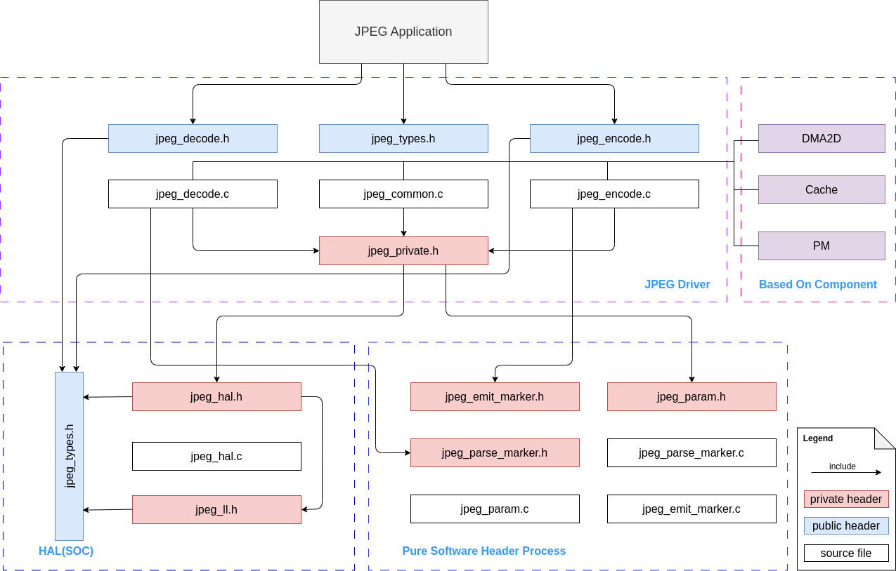

JPEG 图像编解码器
===================

:link_to_translation:`en:[English]`

简介
----

JPEG 常用于数字图像，尤其是数码摄影图像的有损压缩。压缩程度会随图片大小和压缩质量的变化而改变。JPEG 通常能保证图像质量损失肉眼不可见，并实现 10:1 的压缩。

{IDF_TARGET_NAME} 的 JPEG 编解码器是一种基于 JPEG 基线标准的图像编解码器，可以压缩和解压缩图像，从而降低传输图像所需的带宽或存储图像所需的空间，可以处理高分辨率的图像。但请注意，编解码器引擎不能同时作为编码器和解码器工作。

功能概述
--------

本文档包含以下几部分内容：

- `资源分配 <#resource-allocation>`__，包括如何正确地设置配置来分配 JPEG 资源、如何在完成工作时回收资源。
- `有限状态机 <#finite-state-machine>`__，涵盖了 JPEG 的工作流程，介绍了 JPEG 驱动程序的软件流程，以及是如何使用内部资源的。
- `JPEG 解码器引擎 <#jpeg_decoder_engine>`__，包括 JPEG 解码器引擎的行为。介绍了如何使用解码器引擎函数为图像解码（从 jpg 格式到 raw 格式）。
- `JPEG 编码器引擎 <#jpeg_encoder_engine>`__，包括 JPEG 编码器引擎的行为。介绍了如何使用编码器引擎函数为图像编码（从 raw 格式到 jpg 格式）。
- `性能概览 <#performance-overview>`__，介绍了编码器和解码器的性能。
- `不同颜色格式的像素存储布局 <#pixel-storage-layout-for-different-color-formats>`__，涵盖了 JPEG 解码器和编码器所需的颜色空间顺序。
- `线程安全性 <#thread-safety>`__， 列出了驱动程序能保证线程安全的 API。
- `电源管理 <#power-management>`__，描述了影响 JPEG 驱动程序功耗的因素。
- `Kconfig 选项 <#kconfig-options>`__，列出了支持的 Kconfig 选项，可以为驱动程序带来不同的效果。

资源分配
^^^^^^^^

安装 JPEG 解码器引擎
~~~~~~~~~~~~~~~~~~~~

JPEG 解码器引擎的配置需要由 :cpp:type:`jpeg_decode_engine_cfg_t` 指定：

如果在 :cpp:type:`jpeg_decode_engine_cfg_t` 中指定了配置，则可以调用 :cpp:func:`jpeg_new_decoder_engine` 来分配和初始化 JPEG 解码器引擎。如果该函数运行正确，则会返回一个 JPEG 解码器句柄。请参考以下代码：

.. code:: c

    jpeg_decoder_handle_t decoder_engine;

    jpeg_decode_engine_cfg_t decode_eng_cfg = {
        .intr_priority = 0,
        .timeout_ms = 40,
    };

    ESP_ERROR_CHECK(jpeg_new_decoder_engine(&decode_eng_cfg, &decoder_engine));

卸载 JPEG 解码器引擎
~~~~~~~~~~~~~~~~~~~~

如果不再需要先前安装的 JPEG 引擎，建议通过调用 :cpp:func:`jpeg_del_decoder_engine` 回收资源，从而释放底层硬件。

.. code:: c

    ESP_ERROR_CHECK(jpeg_del_decoder_engine(decoder_engine));

安装 JPEG 编码器引擎
~~~~~~~~~~~~~~~~~~~~

JPEG 编码器引擎的配置需要由 :cpp:type:`jpeg_encode_engine_cfg_t` 指定。

如果在 :cpp:type:`jpeg_encode_engine_cfg_t` 中指定了配置，则可以调用 :cpp:func:`jpeg_new_encoder_engine` 来分配和初始化 JPEG 编码器引擎。如果该函数运行正确，则会返回一个 JPEG 编码器句柄。请参考以下代码：

.. code:: c

    jpeg_encoder_handle_t encoder_engine;

    jpeg_encode_engine_cfg_t encode_eng_cfg = {
        .intr_priority = 0,
        .timeout_ms = 40,
    };

    ESP_ERROR_CHECK(jpeg_new_encoder_engine(&encode_eng_cfg, &encoder_engine));

卸载 JPEG 编码器引擎
~~~~~~~~~~~~~~~~~~~~

如果不再需要先前安装的 JPEG 引擎，建议通过调用 :cpp:func:`jpeg_del_encoder_engine` 回收资源，从而释放底层硬件。

.. code:: c

    ESP_ERROR_CHECK(jpeg_del_encoder_engine(encoder_engine));

有限状态机
^^^^^^^^^^

JPEG 驱动程序对硬件资源的使用情况及其处理流程如下图所示：

.. figure:: ../../../_static/diagrams/jpeg/jpeg_workflow.png
    :align: center
    :alt: JPEG 有限状态机

    JPEG 有限状态机

JPEG 解码器引擎
^^^^^^^^^^^^^^^

通过 :cpp:func:`jpeg_new_decoder_engine` 安装好 JPEG 解码器驱动程序后，{IDF_TARGET_NAME} 就可以用 :cpp:func:`jpeg_decoder_process` 解码 JPEG 图片。通过配置参数 :cpp:type:`jpeg_decode_cfg_t`， :cpp:func:`jpeg_decoder_process` 能灵活地解码不同类型的图片：

此外，我们的 JPEG 解码器 API 提供了 helper 函数，可以帮助获取给定图像的基本信息。调用 :cpp:func:`jpeg_decoder_get_info`，将返回名为 :cpp:func:`jpeg_decoder_get_info` 的图片信息结构。如果图片的基本信息已知，则不需要调用此函数。

该驱动程序支持的格式转换如下表所示：

.. list-table::
    :header-rows: 1
    :widths: 50 50
    :align: center

    * - 已压缩图像的格式
      - 解压后的格式
    * - YUV444
      - RGB565/RGB888
    * - YUV422
      - RGB565/RGB888
    * - YUV420
      - RGB565/RGB888
    * - GRAY
      - GRAY

可参考以下代码，为 1080*1920 大小的图片解码：

.. code:: c

    jpeg_decode_cfg_t decode_cfg_rgb = {
        .output_format = JPEG_DECODE_OUT_FORMAT_RGB888,
        .rgb_order = JPEG_DEC_RGB_ELEMENT_ORDER_BGR,
    };

    size_t tx_buffer_size;
    size_t rx_buffer_size;

    jpeg_decode_memory_alloc_cfg_t rx_mem_cfg = {
        .buffer_direction = JPEG_DEC_ALLOC_OUTPUT_BUFFER,
    };

    jpeg_decode_memory_alloc_cfg_t tx_mem_cfg = {
        .buffer_direction = JPEG_DEC_ALLOC_INPUT_BUFFER,
    };

    uint8_t *bit_stream = (uint8_t*)jpeg_alloc_decoder_mem(jpeg_size, &tx_mem_cfg, &tx_buffer_size);
    uint8_t *out_buf = (uint8_t*)jpeg_alloc_decoder_mem(1920 * 1088 * 3, &rx_mem_cfg, &rx_buffer_size);

    jpeg_decode_picture_info_t header_info;
    ESP_ERROR_CHECK(jpeg_decoder_get_info(bit_stream, bit_stream_size, &header_info));
    uint32_t out_size = 0;
    ESP_ERROR_CHECK(jpeg_decoder_process(decoder_engine, &decode_cfg_rgb, bit_stream, bit_stream_size, out_buf, &out_size));

参考以下提示，可以更准确地使用该驱动程序：

1. 在上述代码中，应确保 `bit_stream` 和 `out_buf` 按照一定的规则对齐。可以通过 :cpp:func:`jpeg_alloc_decoder_mem` 函数来分配一个在大小和地址上都对齐的缓冲区。

2. 在 :cpp:func:`jpeg_decoder_process` 返回前， `bit_stream` 缓冲区的内容不应有更改。

3. 如果原始图片以 YUV420 或 YUV422 格式压缩，则输出图片的宽度和高度将会以 16 字节对齐。例如，如果输入图片大小为 1080*1920，则输出图片大小为 1088*1920。这是 jpeg 协议的限制，所以请准备足够的输出缓冲区内存。

JPEG 编码器引擎
^^^^^^^^^^^^^^^

通过 :cpp:func:`jpeg_new_encoder_engine` 安装好 JPEG 编码器驱动程序后，{IDF_TARGET_NAME} 就可以用 :cpp:func:`jpeg_encoder_process` 编码 JPEG 图片。借由可配置参数 :cpp:type:`jpeg_encode_cfg_t`， :cpp:func:`jpeg_encoder_process` 能灵活地编码不同类型的图片：

该驱动程序支持的格式转换如下表所示：

.. list-table::
    :header-rows: 1
    :widths: 50 50
    :align: center

    * - 原图格式
      - 下采样法
    * - RGB565/RGB888
      - YUV444/YUV422/YUV420
    * - GRAY
      - GRAY

可参考以下代码，为 1080*1920 大小的图片编码：

.. code:: c

    int raw_size_1080p = 0;/* Your raw image size */
    jpeg_encode_cfg_t enc_config = {
        .src_type = JPEG_ENCODE_IN_FORMAT_RGB888,
        .sub_sample = JPEG_DOWN_SAMPLING_YUV422,
        .image_quality = 80,
        .width = 1920,
        .height = 1080,
    };

    uint8_t *raw_buf_1080p = (uint8_t*)jpeg_alloc_encoder_mem(raw_size_1080p);
    if (raw_buf_1080p == NULL) {
        ESP_LOGE(TAG, "alloc 1080p tx buffer error");
        return;
    }
    uint8_t *jpg_buf_1080p = (uint8_t*)jpeg_alloc_encoder_mem(raw_size_1080p / 10); // Assume that compression ratio of 10 to 1
    if (jpg_buf_1080p == NULL) {
        ESP_LOGE(TAG, "alloc jpg_buf_1080p error");
        return;
    }

    ESP_ERROR_CHECK(jpeg_encoder_process(jpeg_handle, &enc_config, raw_buf_1080p, raw_size_1080p, jpg_buf_1080p, &jpg_size_1080p););

参考以下提示，可以更准确地使用该驱动程序：

1. 在上述代码中，应调用 :cpp:func:`jpeg_alloc_encoder_mem` 函数，确保 `raw_buf_1080p` 和 `jpg_buf_1080p` 对齐。

2. 在 :cpp:func:`jpeg_encoder_process` 返回前， `raw_buf_1080p` 缓冲区的内容不应有更改。

3. 压缩比取决于所选择的 `image_quality` 和图像本身的内容。一般来说， `image_quality` 值越高，图像质量越好，相应的压缩比就越小。至于图像内容，则很难给出具体的指导方针，因此本文也就不再讨论。基准 JPEG 压缩比通常从 40:1 到 10:1 不等，请依实际情况而定。

性能概述
^^^^^^^^

本节提供了解码器和编码器性能的一些测量数据。下表中呈现的数据是对随机选择的图片片段进行 50 次解码或编码的平均值。所有测试都在 360 MHz 的 CPU 频率以及 200 MHz 的 SPI RAM 时钟频率下进行。在此测试中，仅运行与 JPEG 相关的代码，不涉及其他模块（例如 USB 摄像头等）。

解码器和编码器都不会占用过多的 CPU，仅头部解析会消耗一定 CPU。与 JPEG 压缩相关的计算，如 DCT、量化、哈夫曼编码/解码等，完全由硬件完成。

JPEG 解码器性能
~~~~~~~~~~~~~~~

.. list-table::
    :header-rows: 1
    :widths: 25 25 25 25 25
    :align: center

    * - JPEG 高度
      - JPEG 宽度
      - 像素输入格式 [#]_
      - 像素输出格式 [#]_
      - 性能 (fps)
    * - 1080
      - 1920
      - YUV422
      - RGB888/RGB565
      - 48
    * - 720
      - 1280
      - YUV422
      - RGB888/RGB565
      - 109
    * - 480
      - 800
      - YUV422
      - RGB888/RGB565
      - 253
    * - 480
      - 640
      - YUV422
      - RGB888/RGB565
      - 307
    * - 480
      - 320
      - YUV422
      - RGB888/RGB565
      - 571
    * - 720
      - 1280
      - GRAY
      - GRAY
      - 161

.. [#] 已压缩图像格式
.. [#] 解压后图像格式

JPEG 编码器性能
~~~~~~~~~~~~~~~

.. list-table::
    :header-rows: 1
    :widths: 25 25 25 25 25
    :align: center

    * - JPEG 高度
      - JPEG 宽度
      - 像素输入格式 [#]_
      - 像素输出格式 [#]_
      - 性能 (fps)
    * - 1080
      - 1920
      - RGB888
      - YUV422
      - 26
    * - 1080
      - 1920
      - RGB565
      - YUV422
      - 36
    * - 1080
      - 1920
      - RGB565
      - YUV420
      - 40
    * - 1080
      - 1920
      - RGB565
      - YUV444
      - 24
    * - 1080
      - 1920
      - RGB888
      - YUV422
      - 26
    * - 720
      - 1280
      - RGB565
      - YUV420
      - 88
    * - 720
      - 1280
      - RGB565
      - YUV444
      - 55
    * - 720
      - 1280
      - RGB565
      - YUV422
      - 81
    * - 480
      - 800
      - RGB888
      - YUV420
      - 142
    * - 640
      - 800
      - RGB888
      - YUV420
      - 174
    * - 480
      - 320
      - RGB888
      - YUV420
      - 315
    * - 720
      - 1280
      - GRAY
      - GRAY
      - 163

.. [#] 原图格式
.. [#] 下采样法

不同颜色格式的像素存储布局
^^^^^^^^^^^^^^^^^^^^^^^^^^^^

本指南中提到的编码器和解码器使用相同的未压缩原始图像格式 (RGB, YUV)。因此，本节中编码器和解码器不做单独讨论。以下格式的像素布局适用于编码器的输入方向和解码器的输出方向（如果支持）。具体的像素布局如图所示：

RGB888
~~~~~~

下图中的每个小块表示一位。

.. figure:: ../../../_static/diagrams/jpeg/rgb888.png
    :align: center
    :alt: RGB888 像素顺序

    RGB888 像素顺序

对于 RGB888，可以通过 :cpp:member:`jpeg_decode_cfg_t::rgb_order` 将像素设置为 `RGB` 顺序。

    RGB888 大端像素顺序

RGB565
~~~~~~

下图中的每个小块表示一位。

    RGB565 像素顺序

对于 RGB565，可以通过 :cpp:member:`jpeg_decode_cfg_t::rgb_order` 将像素设置为 `RGB` 顺序。

.. figure:: ../../../_static/diagrams/jpeg/rgb565_bigendian.png
    :align: center
    :alt: RGB565 大端像素顺序

    RGB565 大端像素顺序

YUV444
~~~~~~

下图中的每个小块表示一位。

    YUV444 像素顺序

YUV422
~~~~~~

下图中的每个小块表示一位。

    YUV422 像素顺序

YUV420
~~~~~~

下图中的每个小块表示一位。

    YUV420 像素顺序

线程安全性
^^^^^^^^^^

驱动程序能保证工厂函数 :cpp:func:`jpeg_new_decoder_engine`， :cpp:func:`jpeg_decoder_get_info`， :cpp:func:`jpeg_decoder_process`，以及 :cpp:func:`jpeg_del_decoder_engine` 是线程安全的，这意味着无需额外的锁保护，也可以从不同的 RTOS 任务中调用这些函数。

电源管理
^^^^^^^^

当启用电源管理（即设置了 :ref:`CONFIG_PM_ENABLE`）时，系统需要调整或停止 JPEG 的源时钟以进入 Light-sleep 模式，这可能会改变 JPEG 解码器/编码器的处理过程，也可能会导致硬件计算出现意外。为防止以上问题出现，当 JPEG 编码器/解码器工作时，无法进入 Light-sleep 模式。

每当用户通过 JPEG 进行解码或编码（即调用 :cpp:func:`jpeg_encoder_process` 或 :cpp:func:`jpeg_decoder_process`）时，驱动程序会将电源管理设定为 :cpp:enumerator:`esp_pm_lock_type_t::ESP_PM_CPU_FREQ_MAX`，确保获取电源管理锁。一旦编码或解码完成，驱动程序将释放锁，则系统可以进入 Light-sleep 模式。

Kconfig 选项
^^^^^^^^^^^^
- :ref:`CONFIG_JPEG_ENABLE_DEBUG_LOG` 可启用调试日志，但会增加固件二进制大小。

维护者须知
----------

驱动程序对硬件资源的使用情况及其依赖状况如下图所示：

    JPEG 驱动程序文件结构

应用程序示例
------------

- :example:`peripherals/jpeg/jpeg_decode` 演示了如何使用 JPEG 硬件解码器将不同大小的 JPEG 图片（1080p 和 720p）解码为 RGB 格式，展示了硬件解码的速度和灵活性。

- :example:`peripherals/jpeg/jpeg_encode` 演示了如何使用 JPEG 硬件编码器编码一张 1080p 的图像，即将 `*.rgb` 文件转换为 `*.jpg` 文件。

API 参考
--------

.. only:: SOC_JPEG_DECODE_SUPPORTED

    .. include-build-file:: inc/jpeg_decode.inc

.. only:: SOC_JPEG_ENCODE_SUPPORTED

    .. include-build-file:: inc/jpeg_encode.inc

.. include-build-file:: inc/components/esp_driver_jpeg/include/driver/jpeg_types.inc
.. include-build-file:: inc/components/hal/include/hal/jpeg_types.inc
