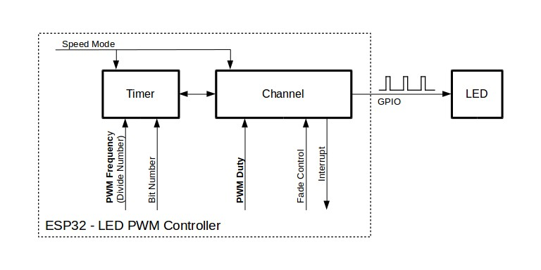

LED PWM 控制器
==============

{IDF_TARGET_LEDC_MAX_FADE_RANGE_NUM: default="1", esp32c6="16", esp32h2="16", esp32p4="16", esp32c5="16", esp32c61="16"}

:link_to_translation:`en:[English]`

概述
------------

LED 控制器 (LEDC) 主要用于控制 LED，也可产生 PWM 信号用于其他设备的控制。该控制器有 {IDF_TARGET_SOC_LEDC_CHANNEL_NUM} 路通道，可以产生独立的波形，驱动 RGB LED 等设备。

.. only:: esp32

    LEDC 通道共有两组，分别为 8 路高速通道和 8 路低速通道。高速通道模式在硬件中实现，可以自动且无干扰地改变 PWM 占空比。低速通道模式下，PWM 占空比需要由软件中的驱动器改变。每组通道都可以使用不同的时钟源。

LED PWM 控制器可在无需 CPU 干预的情况下自动改变占空比，实现亮度和颜色渐变。

功能概览
----------------------

.. only:: esp32

    设置 LEDC 通道在 :ref:`高速模式或低速模式 <ledc-api-high_low_speed_mode>` 下运行，需要进行如下配置：

.. only:: not esp32

    设置 LEDC 通道分三步完成。注意，与 ESP32 不同，{IDF_TARGET_NAME} 仅支持设置通道为低速模式。

1. :ref:`ledc-api-configure-timer` 指定 PWM 信号的频率和占空比分辨率。
2. :ref:`ledc-api-configure-channel` 绑定定时器和输出 PWM 信号的 GPIO。
3. :ref:`ledc-api-change-pwm-signal` 输出 PWM 信号来驱动 LED。可通过软件控制或使用硬件渐变功能来改变 LED 的亮度。

另一个可选步骤是可以在渐变终端设置一个中断。

    LED PWM 控制器 API 的关键配置

.. note::

    首次 LEDC 配置时，建议先配置定时器（调用函数 :cpp:func:`ledc_timer_config`），再配置通道（调用函数 :cpp:func:`ledc_channel_config`）。这样可以确保 IO 脚上的 PWM 信号自有输出开始其频率就是正确的。

.. _ledc-api-configure-timer:

定时器配置
^^^^^^^^^^^^^^^

要设置定时器，可调用函数 :cpp:func:`ledc_timer_config`，并将包括如下配置参数的数据结构 :cpp:type:`ledc_timer_config_t` 传递给该函数：

.. list::

    :esp32:     - 速度模式 :cpp:type:`ledc_mode_t`
    :not esp32: - 速度模式（值必须为 ``LEDC_LOW_SPEED_MODE``）
    - 定时器索引 :cpp:type:`ledc_timer_t`
    - PWM 信号频率（Hz）
    - PWM 占空比分辨率
    - 时钟源 :cpp:type:`ledc_clk_cfg_t`

频率和占空比分辨率相互关联。PWM 频率越高，占空比分辨率越低，反之亦然。如果 API 不是用来改变 LED 亮度，而是用于其它目的，这种相互关系可能会很重要。更多信息详见 :ref:`ledc-api-supported-range-frequency-duty-resolution` 一节。

时钟源同样可以限制 PWM 频率。选择的时钟源频率越高，可以配置的 PWM 频率上限就越高。

.. only:: esp32

    .. list-table:: {IDF_TARGET_NAME} LEDC 时钟源特性
       :widths: 5 5 8 20
       :header-rows: 1

       * - 时钟名称
         - 时钟频率
         - 速度模式
         - 时钟功能
       * - APB_CLK
         - 80 MHz
         - 高速 / 低速
         - /
       * - REF_TICK
         - 1 MHz
         - 高速 / 低速
         - 支持动态调频 (DFS) 功能
       * - RC_FAST_CLK
         - ~ 8 MHz
         - 低速
         - 支持动态调频 (DFS) 功能，支持 Light-sleep 模式

.. only:: esp32s2

    .. list-table:: {IDF_TARGET_NAME} LEDC 时钟源特性
       :widths: 10 10 30
       :header-rows: 1

       * - 时钟名称
         - 时钟频率
         - 时钟功能
       * - APB_CLK
         - 80 MHz
         - /
       * - REF_TICK
         - 1 MHz
         - 支持动态调频 (DFS) 功能
       * - RC_FAST_CLK
         - ~ 8 MHz
         - 支持动态调频 (DFS) 功能，支持 Light-sleep 模式
       * - XTAL_CLK
         - 40 MHz
         - 支持动态调频 (DFS) 功能

.. only:: esp32s3 or esp32c3

    .. list-table:: {IDF_TARGET_NAME} LEDC 时钟源特性
       :widths: 10 10 30
       :header-rows: 1

       * - 时钟名称
         - 时钟频率
         - 时钟功能
       * - APB_CLK
         - 80 MHz
         - /
       * - RC_FAST_CLK
         - ~ 20 MHz
         - 支持动态调频 (DFS) 功能，支持 Light-sleep 模式
       * - XTAL_CLK
         - 40 MHz
         - 支持动态调频 (DFS) 功能

.. only:: esp32c2

    .. list-table:: {IDF_TARGET_NAME} LEDC 时钟源特性
       :widths: 10 10 30
       :header-rows: 1

       * - 时钟名称
         - 时钟频率
         - 时钟功能
       * - PLL_60M_CLK
         - 60 MHz
         - /
       * - RC_FAST_CLK
         - ~ 20 MHz
         - 支持动态调频 (DFS) 功能，支持 Light-sleep 模式
       * - XTAL_CLK
         - 40/26 MHz
         - 支持动态调频 (DFS) 功能

.. only:: esp32c5

    .. list-table:: {IDF_TARGET_NAME} LEDC 时钟源特性
       :widths: 10 10 30
       :header-rows: 1

       * - 时钟名称
         - 时钟频率
         - 时钟功能
       * - PLL_80M_CLK
         - 80 MHz
         - /
       * - RC_FAST_CLK
         - ~ 17.5 MHz
         - 支持动态调频 (DFS) 功能，支持 Light-sleep 模式
       * - XTAL_CLK
         - 48 MHz
         - 支持动态调频 (DFS) 功能

.. only:: esp32c6 or esp32c61 or esp32p4

    .. list-table:: {IDF_TARGET_NAME} LEDC 时钟源特性
       :widths: 10 10 30
       :header-rows: 1

       * - 时钟名称
         - 时钟频率
         - 时钟功能
       * - PLL_80M_CLK
         - 80 MHz
         - /
       * - RC_FAST_CLK
         - ~ 17.5 MHz
         - 支持动态调频 (DFS) 功能，支持 Light-sleep 模式
       * - XTAL_CLK
         - 40 MHz
         - 支持动态调频 (DFS) 功能

.. only:: esp32h2

    .. list-table:: {IDF_TARGET_NAME} LEDC 时钟源特性
       :widths: 10 10 30
       :header-rows: 1

       * - 时钟名称
         - 时钟频率
         - 时钟功能
       * - PLL_96M_CLK
         - 96 MHz
         - /
       * - RC_FAST_CLK
         - ~ 8 MHz
         - 支持动态调频 (DFS) 功能，支持 Light-sleep 模式
       * - XTAL_CLK
         - 32 MHz
         - 支持动态调频 (DFS) 功能

.. note::

    .. only:: SOC_CLK_RC_FAST_SUPPORT_CALIBRATION

        1. 如果 {IDF_TARGET_NAME} 的定时器选用了 ``RC_FAST_CLK`` 作为其时钟源，驱动会通过内部校准来得知这个时钟源的实际频率。这样确保了输出 PWM 信号频率的精准性。

    .. only:: not SOC_CLK_RC_FAST_SUPPORT_CALIBRATION

        1. 如果 {IDF_TARGET_NAME} 的定时器选用了 ``RC_FAST_CLK`` 作为其时钟源，LEDC 的输出 PWM 信号频率可能会与设定值有一定偏差。由于 {IDF_TARGET_NAME} 的硬件限制，驱动无法通过内部校准得知这个时钟源的实际频率。因此驱动默认使用其理论频率进行计算。

    .. only:: not SOC_LEDC_HAS_TIMER_SPECIFIC_MUX

        2. {IDF_TARGET_NAME} 的所有定时器共用一个时钟源。因此 {IDF_TARGET_NAME} 不支持给不同的定时器配置不同的时钟源。

LEDC 驱动提供了一个辅助函数 :cpp:func:`ledc_find_suitable_duty_resolution`。传入时钟源频率及期望的 PWM 信号频率，这个函数可以直接找到最大可配的占空比分辨率值。

当一个定时器不再被任何通道所需要时，可以通过调用相同的函数 :cpp:func:`ledc_timer_config` 来重置这个定时器。此时，函数入参的配置结构体需要指定：

-  :cpp:member:`ledc_timer_config_t::speed_mode` 重置定时器的所属速度模式 （:cpp:type:`ledc_mode_t`）

-  :cpp:member:`ledc_timer_config_t::timer_num` 重置定时器的索引 （:cpp:type:`ledc_timer_t`）

-  :cpp:member:`ledc_timer_config_t::deconfigure` 将指定定时器重置必须配置此项为 true

.. _ledc-api-configure-channel:

通道配置
^^^^^^^^^^^^^^^^^

定时器设置好后，请配置所需的通道（:cpp:type:`ledc_channel_t` 之一）。配置通道需调用函数 :cpp:func:`ledc_channel_config`。

通道的配置与定时器设置类似，需向通道配置函数传递包括通道配置参数的结构体 :cpp:type:`ledc_channel_config_t` 。

此时，通道会按照 :cpp:type:`ledc_channel_config_t` 的配置开始运作，并在选定的 GPIO 上生成由定时器设置指定的频率和占空比的 PWM 信号。在通道运作过程中，可以随时通过调用函数 :cpp:func:`ledc_stop` 将其暂停。

.. _ledc-api-change-pwm-signal:

改变 PWM 信号
^^^^^^^^^^^^^^^^^

通道开始运行、生成具有恒定占空比和频率的 PWM 信号之后，有几种方式可以改变该信号。驱动 LED 时，主要通过改变占空比来变化光线亮度。

以下两节介绍了如何使用软件和硬件改变占空比。如有需要，PWM 信号的频率也可更改，详见 :ref:`ledc-api-change-pwm-frequency` 一节。

.. only:: not esp32

    .. note::

        在 {IDF_TARGET_NAME} 的 LED PWM 控制器中，所有的定时器和通道都只支持低速模式。对 PWM 设置的任何改变，都需要由软件显式地触发（见下文）。

使用软件改变 PWM 占空比
""""""""""""""""""""""""""""""""""""

调用函数 :cpp:func:`ledc_set_duty` 可以设置新的占空比。之后，调用函数 :cpp:func:`ledc_update_duty` 使新配置生效。要查看当前设置的占空比，可使用 ``_get_`` 函数 :cpp:func:`ledc_get_duty`。

另外一种设置占空比和其他通道参数的方式是调用 :ref:`ledc-api-configure-channel` 一节提到的函数 :cpp:func:`ledc_channel_config`。

传递给函数的占空比数值范围取决于选定的 ``duty_resolution``，应为 ``0`` 至 ``(2 ** duty_resolution)``。例如，如选定的占空比分辨率为 10，则占空比的数值范围为 0 至 1024。此时分辨率为 ~ 0.1%。

.. only:: esp32 or esp32s2 or esp32s3 or esp32c3 or esp32c2 or esp32c6 or esp32h2 or esp32p4

    .. warning::

        在 {IDF_TARGET_NAME} 上，当通道绑定的定时器配置了其最大 PWM 占空比分辨率（ ``MAX_DUTY_RES`` ），通道的占空比不能被设置到 ``(2 ** MAX_DUTY_RES)`` 。否则，硬件内部占空比计数器会溢出，并导致占空比计算错误。

使用硬件改变 PWM 占空比
""""""""""""""""""""""""""""""""""""

LED PWM 控制器硬件可逐渐改变占空比的数值。要使用此功能，需用函数 :cpp:func:`ledc_fade_func_install` 使能渐变，之后用下列可用渐变函数之一配置：

* :cpp:func:`ledc_set_fade_with_time`
* :cpp:func:`ledc_set_fade_with_step`
* :cpp:func:`ledc_set_fade`

.. only:: SOC_LEDC_GAMMA_CURVE_FADE_SUPPORTED

    {IDF_TARGET_NAME} 的硬件额外支持多达 {IDF_TARGET_LEDC_MAX_FADE_RANGE_NUM} 次，无需 CPU 介入的连续渐变。此功能可以更加有效便捷得实现一个带伽马校正的渐变。

    众所周知，人眼所感知的亮度与 PWM 占空比并非成线性关系。为了能使人感观上认为一盏灯明暗的变化是线性的，我们对其 PWM 信号的占空比控制必须为非线性的，俗称伽马校正。LED PWM 控制器可以通过多段线型拟合来模仿伽马曲线渐变。 你需要自己在应用程序中分配一段用以保存渐变参数的内存块，并提供开始和结束的占空比，伽马校正公式，以及期望的线性渐变段数信息，:cpp:func:`ledc_fill_multi_fade_param_list` 就能快速生成所有分段线性渐变的参数。或者你也可以自己直接构造一个 :cpp:type:`ledc_fade_param_config_t` 的数组。在获得所有渐变参数后，通过将 :cpp:type:`ledc_fade_param_config_t` 数组的指针和渐变区间数传入 :cpp:func:`ledc_set_multi_fade`，一次连续渐变的配置就完成了。

.. only:: esp32

    最后需要调用 :cpp:func:`ledc_fade_start` 开启渐变。渐变可以在阻塞或非阻塞模式下运行，具体区别请查看 :cpp:enum:`ledc_fade_mode_t`。需要特别注意的是，不管在哪种模式下，下一次渐变或单次占空比配置的指令生效都必须等到前一次渐变结束。由于 {IDF_TARGET_NAME} 的硬件限制，在渐变达到原先预期的占空比前想要中止本次渐变是不被支持的。

.. only:: not esp32

    最后需要调用 :cpp:func:`ledc_fade_start` 开启渐变。渐变可以在阻塞或非阻塞模式下运行，具体区别请查看 :cpp:enum:`ledc_fade_mode_t`。需要特别注意的是，不管在哪种模式下，下一次渐变或是单次占空比配置的指令生效都必须等到前一次渐变完成或被中止。中止一个正在运行中的渐变需要调用函数 :cpp:func:`ledc_fade_stop`。

此外，在使能渐变后，每个通道都可以额外通过调用 :cpp:func:`ledc_cb_register` 注册一个回调函数用以获得渐变完成的事件通知。回调函数的原型被定义在 :cpp:type:`ledc_cb_t`。每个回调函数都应当返回一个布尔值给驱动的中断处理函数，用以表示是否有高优先级任务被其唤醒。此外，值得注意的是，由于驱动的中断处理函数被放在了 IRAM 中， 回调函数和其调用的函数也需要被放在 IRAM 中。 :cpp:func:`ledc_cb_register` 会检查回调函数及函数上下文的指针地址是否在正确的存储区域。

如不需要渐变和渐变中断，可用函数 :cpp:func:`ledc_fade_func_uninstall` 关闭。

.. _ledc-api-change-pwm-frequency:

改变 PWM 频率
""""""""""""""""""""

LED PWM 控制器 API 有多种方式即时改变 PWM 频率：

    * 通过调用函数 :cpp:func:`ledc_set_freq` 设置频率。可用函数 :cpp:func:`ledc_get_freq` 查看当前频率。
    * 通过调用函数 :cpp:func:`ledc_bind_channel_timer` 将其他定时器绑定到该通道来改变频率和占空比分辨率。
    * 通过调用函数 :cpp:func:`ledc_channel_config` 改变通道的定时器。

控制 PWM 的更多方式
"""""""""""""""""""""

有一些较底层的定时器特定函数可用于更改 PWM 设置：

* :cpp:func:`ledc_timer_set`
* :cpp:func:`ledc_timer_rst`
* :cpp:func:`ledc_timer_pause`
* :cpp:func:`ledc_timer_resume`

前两个功能可通过函数 :cpp:func:`ledc_channel_config` 在后台运行，在定时器配置后启动。

使用中断
^^^^^^^^^^^^^^

配置 LED PWM 控制器通道时，可在 :cpp:type:`ledc_channel_config_t` 中选取参数 :cpp:type:`ledc_intr_type_t` ，在渐变完成时触发中断。

要注册处理程序来处理中断，可调用函数 :cpp:func:`ledc_isr_register`。

.. only:: esp32

    .. _ledc-api-high_low_speed_mode:

    LED PWM 控制器高速和低速模式
    ----------------------------------

    高速模式的优点是可平稳地改变定时器设置。也就是说，高速模式下如定时器设置改变，此变更会自动应用于定时器的下一次溢出中断。而更新低速定时器时，设置变更应由软件显式触发。LED PWM 驱动的设置将在硬件层面被修改，比如在调用函数 :cpp:func:`ledc_timer_config` 或 :cpp:func:`ledc_timer_set` 时。

    更多关于速度模式的详细信息请参阅 **{IDF_TARGET_NAME} 技术参考手册** > **LED PWM 控制器 (LEDC)** [`PDF <{IDF_TARGET_TRM_EN_URL}#ledpwm>`__]。

    .. _ledc-api-supported-range-frequency-duty-resolution:

.. only:: not esp32

    .. _ledc-api-supported-range-frequency-duty-resolution:

频率和占空比分辨率支持范围
-------------------------------------------------

LED PWM 控制器主要用于驱动 LED。该控制器 PWM 占空比设置的分辨率范围较广。比如，PWM 频率为 5 kHz 时，占空比分辨率最大可为 13 位。这意味着占空比可为 0 至 100% 之间的任意值，分辨率为 ~0.012%（2 ** 13 = 8192 LED 亮度的离散电平）。然而，这些参数取决于为 LED PWM 控制器定时器计时的时钟信号，LED PWM 控制器为通道提供时钟（具体可参考 :ref:`定时器配置 <ledc-api-configure-timer>` 和 **{IDF_TARGET_NAME} 技术参考手册** > **LED PWM 计时器 (LEDC)** [`PDF <{IDF_TARGET_TRM_EN_URL}#ledpwm>`__]）。

LED PWM 控制器可用于生成频率较高的信号，足以为数码相机模组等其他设备提供时钟。此时，最大频率可为 40 MHz，占空比分辨率为 1 位。也就是说，占空比固定为 50%，无法调整。

LED PWM 控制器 API 会在设定的频率和占空比分辨率超过 LED PWM 控制器硬件范围时报错。例如，试图将频率设置为 20 MHz、占空比分辨率设置为 3 位时，串行端口监视器上会报告如下错误：

.. highlight:: none

::

    E (196) ledc: requested frequency and duty resolution cannot be achieved, try reducing freq_hz or duty_resolution. div_param=128

此时，占空比分辨率或频率必须降低。比如，将占空比分辨率设置为 2 会解决这一问题，让占空比设置为 25% 的倍数，即 25%、50% 或 75%。

如设置的频率和占空比分辨率低于所支持的最低值，LED PWM 驱动器也会反映并报告，如：

::

    E (196) ledc: requested frequency and duty resolution cannot be achieved, try increasing freq_hz or duty_resolution. div_param=128000000

占空比分辨率通常用 :cpp:type:`ledc_timer_bit_t` 设置，范围是 10 至 15 位。如需较低的占空比分辨率（上至 10，下至 1），可直接输入相应数值。

应用示例
-------------------

.. list::

    * :example:`peripherals/ledc/ledc_basic` 演示了如何使用 LEDC 生成低速模式的 PWM 信号。
    * :example:`peripherals/ledc/ledc_fade` 演示了如何使用 LEDC 实现 LED 亮度的渐变控制。
    :SOC_LEDC_GAMMA_CURVE_FADE_SUPPORTED: * :example:`peripherals/ledc/ledc_gamma_curve_fade` 演示了如何使用 LEDC 对 RGB LED 实现带伽马校正的颜色控制。

API 参考
-------------

.. include-build-file:: inc/ledc.inc
.. include-build-file:: inc/ledc_types.inc
