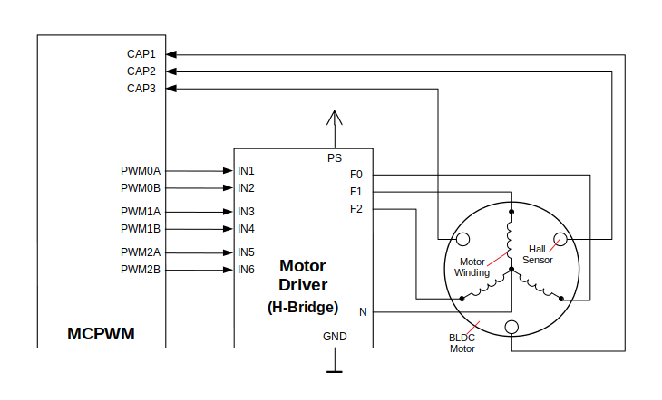

电机控制脉宽调制器 (MCPWM)
===========================================

:link_to_translation:`en:[English]`

MCPWM 外设是一个多功能 PWM 生成器，集成多个子模块，在电力电子应用（如电机控制、数字电源等）中至关重要。MCPWM 外设通常适用于以下场景：

- 数字电机控制，如有刷/无刷直流电机、RC 伺服电机
- 基于开关模式的数字电源转换
- 功率数模转换器 (Power DAC)，其中占空比等于 DAC 的模拟值
- 计算外部脉宽，并将其转换为其他模拟值，如速度、距离
- 为磁场定向控制 (FOC) 生成空间矢量调制 (SVPWM) 信号

外设的主要子模块如下图所示：

.. blockdiag:: /../_static/diagrams/mcpwm/mcpwm_overview.diag
    :caption: MCPWM 概述
    :align: center

- **MCPWM 定时器模块**：最终输出 PWM 信号的时间基准。它也决定了其他子模块的事件时序。
- **MCPWM 操作器模块**：生成 PWM 波形的关键模块。它由其他子模块组成，如比较器、PWM 生成器、死区生成器和载波调制器。
- **MCPWM 比较器模块**：输入时间基准值，并不断与配置的阈值进行比较。当定时器计数值等于任何一个阈值时，生成一个比较事件，MCPWM 生成器随即相应更新其电平。
- **MCPWM 生成器模块**：根据 MCPWM 定时器、MCPWM 比较器等子模块触发的各种事件，生成一对独立或互补的 PWM 波形。
- **MCPWM 故障检测模块**：通过 GPIO 交换矩阵检测外部的故障情况。检测到故障信号时，MCPWM 操作器将强制所有生成器进入预先定义的状态，从而保护系统。
- **MCPWM 同步模块**：同步 MCPWM 定时器，以确保由不同的 MCPWM 生成器最终生成的 PWM 信号具有固定的相位差。可以通过 GPIO 交换矩阵和 MCPWM 定时器事件生成同步信号。
- **死区生成器模块**：在此前生成的 PWM 边沿上插入额外的延迟。
- **载波模块**：可通过 PWM 波形生成器和死区生成器，将一个高频载波信号调制为 PWM 波形，这是控制功率开关器件的必需功能。
- **制动控制**：MCPWM 操作器支持配置检测到特定故障时生成器的制动控制方式。根据故障的严重程度，可以选择立即关闭或是逐周期调节 PWM 输出。
- **MCPWM 捕获模块**：独立子模块，不依赖于上述 MCPWM 操作器工作。捕获模块包括一个专用的定时器和几个独立的通道，每个通道都与 GPIO 相连。GPIO 上的脉冲触发捕获定时器以存储时间基准值，随后通过中断进行通知。此模块有助于更加精准地测量脉宽。此外，捕获定时器也可以通过 MCPWM 同步子模块进行同步。

功能概述
-------------------

下文将分节概述 MCPWM 的功能：

.. list::

    - :ref:`mcpwm-resource-allocation-and-initialization` - 介绍各类 MCPWM 模块的分配，如定时器、操作器、比较器、生成器等。随后介绍的 IO 设置和控制功能也将围绕这些模块进行。
    - :ref:`mcpwm-timer-operations-and-events` - 介绍 MCPWM 定时器支持的控制功能和事件回调。
    - :ref:`mcpwm-comparator-operations-and-events` - 介绍 MCPWM 比较器支持的控制功能和事件回调。
    - :ref:`mcpwm-generator-actions-on-events` - 介绍如何针对 MCPWM 定时器和比较器生成的特定事件，设置 MCPWM 生成器的相应执行操作。
    - :ref:`mcpwm-classical-pwm-waveforms-and-generator-configurations` - 介绍一些经典 PWM 波形的生成器配置。
    - :ref:`mcpwm-dead-time` - 介绍如何设置 MCPWM 生成器的死区时间。
    - :ref:`mcpwm-classical-pwm-waveforms-and-dead-time-configurations` - 介绍一些经典 PWM 波形的死区配置。
    - :ref:`mcpwm-carrier-modulation` - 介绍如何在最终输出的 PWM 波形上调制高频载波。
    - :ref:`mcpwm-faults-and-brake-actions` - 介绍如何为 MCPWM 操作器配置特定故障事件下的制动操作。
    - :ref:`mcpwm-generator-force-actions` - 介绍如何强制异步控制生成器的输出水平。
    - :ref:`mcpwm-synchronization` - 介绍如何同步 MCPWM 定时器，并确保生成的最终输出 PWM 信号具有固定的相位差。
    - :ref:`mcpwm-capture` - 介绍如何使用 MCPWM 捕获模块测量信号脉宽。
    :SOC_MCPWM_SUPPORT_ETM: - :ref:`mcpwm-etm-event-and-task` - MCPWM 提供了哪些事件和任务可以连接到 ETM 通道上。
    - :ref:`mcpwm-power-management` - 介绍不同的时钟源对功耗的影响。
    - :ref:`mcpwm-resolution-config` - 介绍 MCPWM 子模块的分辨率配置规则。
    - :ref:`mcpwm-iram-safe` - 介绍如何协调 RMT 中断与禁用缓存。
    - :ref:`mcpwm-thread-safety` - 列出了由驱动程序认证为线程安全的 API。
    - :ref:`mcpwm-kconfig-options` - 列出了针对驱动的数个 Kconfig 支持选项。

.. _mcpwm-resource-allocation-and-initialization:

资源配置及初始化
^^^^^^^^^^^^^^^^^^^^^^^^^^^^^^^^^^^^^^

如上图所示，MCPWM 外设由数个子模块组成。本节将介绍各个子模块的资源配置方式。

MCPWM 定时器
~~~~~~~~~~~~~~~

调用 :cpp:func:`mcpwm_new_timer` 函数，以配置结构体 :cpp:type:`mcpwm_timer_config_t` 为参数，分配一个 MCPWM 定时器为对象。结构体定义为：

- :cpp:member:`mcpwm_timer_config_t::group_id` 指定 MCPWM 组 ID，范围为 [0, :c:macro:`SOC_MCPWM_GROUPS` - 1]。需注意，位于不同组的定时器彼此独立。
- :cpp:member:`mcpwm_timer_config_t::intr_priority` 设置中断的优先级。如果设置为 ``0``，则会分配一个默认优先级的中断，否则会使用指定的优先级。
- :cpp:member:`mcpwm_timer_config_t::clk_src` 设置定时器的时钟源。
- :cpp:member:`mcpwm_timer_config_t::resolution_hz` 设置定时器的预期分辨率。内部驱动将根据时钟源和分辨率设置合适的分频器。
- :cpp:member:`mcpwm_timer_config_t::count_mode` 设置定时器的计数模式。
- :cpp:member:`mcpwm_timer_config_t::period_ticks` 设置定时器的周期，以 Tick 为单位（通过 :cpp:member:`mcpwm_timer_config_t::resolution_hz` 设置 Tick 分辨率）。
- :cpp:member:`mcpwm_timer_config_t::update_period_on_empty` 设置当定时器计数为零时是否更新周期值。
- :cpp:member:`mcpwm_timer_config_t::update_period_on_sync` 设置当定时器接收同步信号时是否更新周期值。

分配成功后，:cpp:func:`mcpwm_new_timer` 将返回一个指向已分配定时器的指针。否则，函数将返回错误代码。具体来说，当 MCPWM 组中没有空闲定时器时，将返回 :c:macro:`ESP_ERR_NOT_FOUND` 错误。[1]_

反之，调用 :cpp:func:`mcpwm_del_timer` 函数将释放已分配的定时器。

.. note::

    同时分配多个 MCPWM 定时器时，MCPWM 组的分频系数将以第一个定时器的分辨率来计算，驱动会从低到高寻找合适的分频系数。若分配多个定时器时出现分频系数冲突，请调整分配定时器的顺序，按照目标分辨率的大小按序申请定时器（从大到小或者从小到大）。更多相关内容请参阅 :ref:`mcpwm-resolution-config`。

MCPWM 操作器
~~~~~~~~~~~~~~~

调用 :cpp:func:`mcpwm_new_operator` 函数，以配置结构体 :cpp:type:`mcpwm_operator_config_t` 为参数，分配一个 MCPWM 操作器为对象。结构体定义为：

- :cpp:member:`mcpwm_operator_config_t::group_id` 指定 MCPWM 组 ID，范围为 [0, :c:macro:`SOC_MCPWM_GROUPS` - 1]。需注意，位于不同组的操作器彼此独立。
- :cpp:member:`mcpwm_operator_config_t::intr_priority` 设置中断的优先级。如果设置为 ``0``，则会分配一个默认优先级的中断，否则会使用指定的优先级。
- :cpp:member:`mcpwm_operator_config_t::update_gen_action_on_tez` 设置是否在定时器计数为零时更新生成器操作。此处及下文提到的定时器指通过 :cpp:func:`mcpwm_operator_connect_timer` 连接到操作器的定时器。
- :cpp:member:`mcpwm_operator_config_t::update_gen_action_on_tep` 设置当定时器计数达到峰值时是否更新生成器操作。
- :cpp:member:`mcpwm_operator_config_t::update_gen_action_on_sync` 设置当定时器接收同步信号时是否更新生成器操作。
- :cpp:member:`mcpwm_operator_config_t::update_dead_time_on_tez` 设置当定时器计数为零时是否更新死区时间。
- :cpp:member:`mcpwm_operator_config_t::update_dead_time_on_tep` 设置当定时器计数达到峰值时是否更新死区时间。
- :cpp:member:`mcpwm_operator_config_t::update_dead_time_on_sync` 设置当定时器接收同步信号时是否更新死区时间。

分配成功后，:cpp:func:`mcpwm_new_operator` 将返回一个指向已分配操作器的指针。否则，函数将返回错误代码。具体来说，当 MCPWM 组中没有空闲操作器时，将返回 :c:macro:`ESP_ERR_NOT_FOUND` 错误。[1]_

反之，调用 :cpp:func:`mcpwm_del_operator` 函数将释放已分配的操作器。

MCPWM 比较器
~~~~~~~~~~~~~~~~~

调用 :cpp:func:`mcpwm_new_comparator` 函数，以一个 MCPWM 操作器句柄和配置结构体 :cpp:type:`mcpwm_comparator_config_t` 为参数，分配一个 MCPWM 比较器为对象。操作器句柄由 :cpp:func:`mcpwm_new_operator` 生成，结构体定义为：

- :cpp:member:`mcpwm_comparator_config_t::intr_priority` 设置中断的优先级。如果设置为 ``0``，则会分配一个默认优先级的中断，否则会使用指定的优先级。
- :cpp:member:`mcpwm_comparator_config_t::update_cmp_on_tez` 设置当定时器计数为零时是否更新比较阈值。
- :cpp:member:`mcpwm_comparator_config_t::update_cmp_on_tep` 设置当定时器计数达到峰值时是否更新比较阈值。
- :cpp:member:`mcpwm_comparator_config_t::update_cmp_on_sync` 设置当定时器接收同步信号时是否更新比较阈值。

分配成功后，:cpp:func:`mcpwm_new_comparator` 将返回一个指向已分配比较器的指针。否则，函数将返回错误代码。具体来说，当 MCPWM 操作器中没有空闲比较器时，将返回 :c:macro:`ESP_ERR_NOT_FOUND` 错误。[1]_

反之，调用 :cpp:func:`mcpwm_del_comparator` 函数将释放已分配的比较器。

.. only:: SOC_MCPWM_SUPPORT_EVENT_COMPARATOR and SOC_MCPWM_SUPPORT_ETM

    MCPWM 中还有另外一种比较器 —— “事件比较器”，它不能直接控制 PWM 的输出，只能用来产生 EMT 子系统中使用到的事件。事件比较器能够设置的阈值也是可配的。调用 :cpp:func:`mcpwm_new_event_comparator` 函数可以申请一个事件比较器，该函数返回的句柄类型和 :cpp:func:`mcpwm_new_comparator` 函数一样，但是需要的配置结构体是不同的。事件比较器的配置位于 :cpp:type:`mcpwm_event_comparator_config_t`。更多相关内容请参阅 :ref:`mcpwm-etm-event-and-task`。

MCPWM 生成器
~~~~~~~~~~~~~~~~

调用 :cpp:func:`mcpwm_new_generator` 函数，以一个 MCPWM 操作器句柄和配置结构体 :cpp:type:`mcpwm_generator_config_t` 为参数，分配一个 MCPWM 生成器为对象。操作器句柄由 :cpp:func:`mcpwm_new_operator` 生成，结构体定义为：

- :cpp:member:`mcpwm_generator_config_t::gen_gpio_num` 设置生成器使用的 GPIO 编号。
- :cpp:member:`mcpwm_generator_config_t::invert_pwm` 设置是否反相 PWM 信号。
- :cpp:member:`mcpwm_generator_config_t::pull_up` 和 :cpp:member:`mcpwm_generator_config_t::pull_down` 用来设置是否启用内部上下拉电阻。

分配成功后，:cpp:func:`mcpwm_new_generator` 将返回一个指向已分配生成器的指针。否则，函数将返回错误代码。具体来说，当 MCPWM 操作器中没有空闲生成器时，将返回 :c:macro:`ESP_ERR_NOT_FOUND` 错误。[1]_

反之，调用 :cpp:func:`mcpwm_del_generator` 函数将释放已分配的生成器。

MCPWM 故障
~~~~~~~~~~~~

MCPWM 故障分为两种类型：来自 GPIO 的故障信号和软件故障。

调用 :cpp:func:`mcpwm_new_gpio_fault` 函数，以配置结构体 :cpp:type:`mcpwm_gpio_fault_config_t` 为参数，分配一个 GPIO 故障为对象。结构体定义为：

- :cpp:member:`mcpwm_gpio_fault_config_t::group_id` 设置 MCPWM 组 ID，范围为 [0, :c:macro:`SOC_MCPWM_GROUPS` - 1]。需注意，位于不同组的 GPIO 故障彼此独立，也就是说，1 组的操作器无法检测到 0 组的 GPIO 故障。
- :cpp:member:`mcpwm_gpio_fault_config_t::intr_priority` 设置中断的优先级。如果设置为 ``0``，则会分配一个默认优先级的中断，否则会使用指定的优先级。
- :cpp:member:`mcpwm_gpio_fault_config_t::gpio_num` 设置故障所使用的 GPIO 编号。
- :cpp:member:`mcpwm_gpio_fault_config_t::active_level` 设置故障信号的有效电平。
- :cpp:member:`mcpwm_gpio_fault_config_t::pull_up` 和 :cpp:member:`mcpwm_gpio_fault_config_t::pull_down` 设置是否在内部拉高和/或拉低 GPIO。

分配成功后，:cpp:func:`mcpwm_new_gpio_fault` 将返回一个指向已分配故障的指针。否则，函数将返回错误代码。具体来说，当指定 MCPWM 组中没有空闲 GPIO 故障时，将返回 :c:macro:`ESP_ERR_NOT_FOUND` 错误。[1]_

调用函数 :cpp:func:`mcpwm_soft_fault_activate` 使一个软件故障对象触发故障，无需等待来自 GPIO 的真实故障信号。调用 :cpp:func:`mcpwm_new_soft_fault` 函数，以配置结构体 :cpp:type:`mcpwm_soft_fault_config_t` 为参数，分配一个软件故障为对象。该结构体暂时保留，供后续使用。

分配成功后，:cpp:func:`mcpwm_new_soft_fault` 将返回一个指向已分配故障的指针。否则，函数将返回错误代码。具体来说，当内存不足以支持该故障对象时，将返回 :c:macro:`ESP_ERR_NO_MEM` 错误。虽然软件故障和 GPIO 故障是不同类型的故障，但返回的故障句柄为同一类型。

反之，调用 :cpp:func:`mcpwm_del_fault` 函数将释放已分配的故障。此函数同时适用于软件故障和 GPIO 故障。

MCPWM 同步源
~~~~~~~~~~~~~~~~~~

同步源用于同步 MCPWM 定时器和 MCPWM 捕获定时器，分为三种类型：来自 GPIO 的同步源、软件生成的同步源和 MCPWM 定时器事件生成的同步源。

调用 :cpp:func:`mcpwm_new_gpio_sync_src` 函数，以配置结构体 :cpp:type:`mcpwm_gpio_sync_src_config_t` 为参数，分配一个 GPIO 同步源。结构体定义为：

- :cpp:member:`mcpwm_gpio_sync_src_config_t::group_id` 指定 MCPWM 组 ID，范围为 [0, :c:macro:`SOC_MCPWM_GROUPS` - 1]。需注意，位于不同组的 GPIO 同步源彼此独立，也就是说，1 组的定时器无法检测到 0 组的 GPIO 同步源。
- :cpp:member:`mcpwm_gpio_sync_src_config_t::gpio_num` 设置同步源使用的 GPIO 编号。
- :cpp:member:`mcpwm_gpio_sync_src_config_t::active_neg` 设置同步信号在下降沿是否有效。
- :cpp:member:`mcpwm_gpio_sync_src_config_t::pull_up` 和 :cpp:member:`mcpwm_gpio_sync_src_config_t::pull_down` 设置是否在内部拉高和/或拉低 GPIO。

分配成功后，:cpp:func:`mcpwm_new_gpio_sync_src` 将返回一个指向已分配同步源的指针。否则，函数将返回错误代码。具体来说，当 MCPWM 组中没有空闲 GPIO 时钟源时，将返回 :c:macro:`ESP_ERR_NOT_FOUND` 错误。[1]_

调用 :cpp:func:`mcpwm_new_timer_sync_src` 函数，以配置结构体 :cpp:type:`mcpwm_timer_sync_src_config_t` 为参数，分配一个定时器事件同步源。结构体定义为：

- :cpp:member:`mcpwm_timer_sync_src_config_t::timer_event` 指定产生同步信号的定时器事件。
- :cpp:member:`mcpwm_timer_sync_src_config_t::propagate_input_sync` 是否广播输入同步信号（即将输入同步信号传输到其同步输出）。

分配成功后，:cpp:func:`mcpwm_new_timer_sync_src` 将返回一个指向已分配同步源的指针。否则，函数将返回错误代码。具体来说，若是分配的同步源此前已分配给了同一个定时器，将返回 :c:macro:`ESP_ERR_INVALID_STATE` 错误。

也可以调用 :cpp:func:`mcpwm_new_soft_sync_src` 函数，以配置结构体 :cpp:type:`mcpwm_soft_sync_config_t` 为参数，分配一个软件同步源。该结构体暂时保留，供后续使用。

分配成功后，:cpp:func:`mcpwm_new_soft_sync_src` 将返回一个指向已分配同步源的指针。否则，函数将返回错误代码。具体来说，当内存不足以支持分配的同步源时，将返回 :c:macro:`ESP_ERR_NO_MEM` 错误。需注意，为确保软件同步源能够正常工作，应预先调用 :cpp:func:`mcpwm_soft_sync_activate`。

相反，调用 :cpp:func:`mcpwm_del_sync_src` 函数将释放分配的同步源对象。此函数适用于所有类型的同步源。

MCPWM 捕获定时器和通道
~~~~~~~~~~~~~~~~~~~~~~~~~~~~~~~~

MCPWM 组有一个专用定时器，用于捕获特定事件发生时的时间戳。捕获定时器连接了数个独立通道，每个通道都分配了各自的 GPIO。

调用 :cpp:func:`mcpwm_new_capture_timer` 函数，以配置结构体 :cpp:type:`mcpwm_capture_timer_config_t` 为参数，分配一个捕获定时器。结构体定义为：

- :cpp:member:`mcpwm_capture_timer_config_t::group_id` 设置 MCPWM 组 ID，范围为 [0, :c:macro:`SOC_MCPWM_GROUPS` - 1]。
- :cpp:member:`mcpwm_capture_timer_config_t::clk_src` 设置捕获定时器的时钟源。
- :cpp:member:`mcpwm_capture_timer_config_t::resolution_hz` 设置捕获定时器的预期分辨率。内部驱动将根据时钟源和分辨率设置合适的分频器。设置为 ``0`` 时，驱动会自己选取一个适当的分辨率，后续你可以通过 :cpp:func:`mcpwm_capture_timer_get_resolution` 查看当前定时器的分辨率。

.. only:: not SOC_MCPWM_CAPTURE_CLK_FROM_GROUP

    .. note::

        在 {IDF_TARGET_NAME} 中，:cpp:member:`mcpwm_capture_timer_config_t::resolution_hz` 参数无效，捕获定时器的分辨率始终等于 :cpp:enumerator:`MCPWM_CAPTURE_CLK_SRC_APB`。

.. only:: SOC_MCPWM_CAPTURE_CLK_FROM_GROUP

    .. note::

        定时器和捕获定时器共享 MCPWM 组时钟源。MCPWM 组的分频系数将以第一个分配的(捕获)定时器的分辨率来计算，驱动会从低到高寻找合适的分频系数。若分配多个(捕获)定时器时出现分频系数冲突，请调整分配定时器的顺序，按照目标分辨率的大小按序申请(捕获)定时器（从大到小或者从小到大）。更多相关内容请参阅 :ref:`mcpwm-resolution-config`。

分配成功后，:cpp:func:`mcpwm_new_capture_timer` 将返回一个指向已分配捕获定时器的指针。否则，函数将返回错误代码。具体来说，当 MCPWM 组中没有空闲捕获定时器时，将返回 :c:macro:`ESP_ERR_NOT_FOUND` 错误。[1]_

接下来，可以调用 :cpp:func:`mcpwm_new_capture_channel` 函数，以一个捕获定时器句柄和配置结构体 :cpp:type:`mcpwm_capture_channel_config_t` 为参数，分配一个捕获通道。结构体定义为：

- :cpp:member:`mcpwm_capture_channel_config_t::intr_priority` 设置中断的优先级。如果设置为 ``0``，则会分配一个默认优先级的中断，否则会使用指定的优先级。
- :cpp:member:`mcpwm_capture_channel_config_t::gpio_num` 设置捕获通道使用的 GPIO 编号。
- :cpp:member:`mcpwm_capture_channel_config_t::prescale` 设置输入信号的预分频器。
- :cpp:member:`mcpwm_capture_channel_config_t::extra_capture_channel_flags::pos_edge` 和 :cpp:member:`mcpwm_capture_channel_config_t::extra_capture_channel_flags::neg_edge` 设置是否在输入信号的上升沿和/或下降沿捕获时间戳。
- :cpp:member:`mcpwm_capture_channel_config_t::extra_capture_channel_flags::pull_up` 和 :cpp:member:`mcpwm_capture_channel_config_t::extra_capture_channel_flags::pull_down` 设置是否在内部拉高和/或拉低 GPIO。
- :cpp:member:`mcpwm_capture_channel_config_t::extra_capture_channel_flags::invert_cap_signal` 设置是否取反捕获信号。

分配成功后，:cpp:func:`mcpwm_new_capture_channel` 将返回一个指向已分配捕获通道的指针。否则，函数将返回错误代码。具体来说，当捕获定时器中没有空闲捕获通道时，将返回 :c:macro:`ESP_ERR_NOT_FOUND` 错误。

反之，调用 :cpp:func:`mcpwm_del_capture_channel` 和 :cpp:func:`mcpwm_del_capture_timer` 将释放已分配的捕获通道和定时器。

MCPWM 中断优先级
~~~~~~~~~~~~~~~~~~~~~~~~

MCPWM 允许为 定时器、操作器、比较器、故障以及捕获事件分别配置中断，中断优先级由各自的 ``config_t::intr_priority`` 决定。且同一个 MCPWM 组中的事件共享同一个中断源。注册多个中断事件时，中断优先级需要保持一致。

.. note::

    MCPWM 组注册多个中断事件时，驱动将以第一个事件的中断优先级作为 MCPWM 组的中断优先级。

.. _mcpwm-timer-operations-and-events:

定时器操作和事件
^^^^^^^^^^^^^^^^^^^^^^^^^^^

更新定时器周期
~~~~~~~~~~~~~~

定时器周期在创建定时器时就已经通过 :cpp:member:`mcpwm_timer_config_t::period_ticks` 被初始化过了。你还可以在运行期间，调用 :cpp:func:`mcpwm_timer_set_period` 函数来更新定时周期。新周期的生效时机由 :cpp:member:`mcpwm_timer_config_t::update_period_on_empty` 和 :cpp:member:`mcpwm_timer_config_t::update_period_on_sync` 共同决定。如果他们两个参数都是 ``false``， 那么新的定时周期会立即生效。

注册定时器事件回调
~~~~~~~~~~~~~~~~~~~~~~~~

MCPWM 定时器运行时会生成不同的事件。若有函数需在特定事件发生时调用，则应预先调用 :cpp:func:`mcpwm_timer_register_event_callbacks`，将所需函数挂载至中断服务程序 (ISR) 中。驱动中定时器回调函数原型声明为 :cpp:type:`mcpwm_timer_event_cb_t`，其所支持的事件回调类型则列在 :cpp:type:`mcpwm_timer_event_callbacks_t` 中：

- :cpp:member:`mcpwm_timer_event_callbacks_t::on_full` 设置定时器计数达到峰值时的回调函数。
- :cpp:member:`mcpwm_timer_event_callbacks_t::on_empty` 设置定时器计数为零时的回调函数。
- :cpp:member:`mcpwm_timer_event_callbacks_t::on_stop` 设置定时器停止时的回调函数。

由于上述回调函数是在 ISR 中调用的，因此，这些函数 **不应** 涉及 block 操作。可以检查调用 API 的后缀，确保在函数中只调用了后缀为 ``ISR`` 的 FreeRTOS API。

函数 :cpp:func:`mcpwm_timer_register_event_callbacks` 中的 ``user_data`` 参数用于保存用户上下文，将直接传递至各个回调函数。

此函数会在不启用 MCPWM 定时器的情况下延迟安装其中断服务。因此，需在调用 :cpp:func:`mcpwm_timer_enable` 函数前调用该函数，否则将返回 :c:macro:`ESP_ERR_INVALID_STATE` 错误。更多信息请参见 `启用和禁用定时器`_。

启用和禁用定时器
~~~~~~~~~~~~~~~~~~~~~~~~

在对定时器进行 IO 控制前，需要预先调用 :cpp:func:`mcpwm_timer_enable` 函数启用定时器。这个函数将：

* 将定时器的状态从 **init** 切换到 **enable**。
* 若中断服务此前已通过 :cpp:func:`mcpwm_timer_register_event_callbacks` 函数延迟安装，则启用中断服务。
* 若选择了特定时钟源（例如 PLL_160M 时钟），则获取相应的电源管理锁。更多信息请参见 :ref:`mcpwm-power-management`。

反之，调用 :cpp:func:`mcpwm_timer_disable` 会将定时器切换回 **init** 状态、禁用中断服务并释放电源管理锁。

启动和停止定时器
~~~~~~~~~~~~~~~~~~~~

通过基本的 IO 控制，即可启动和停止定时器。使用不同的 :cpp:type:`mcpwm_timer_start_stop_cmd_t` 命令调用 :cpp:func:`mcpwm_timer_start_stop` 便可立即启动定时器，或在发生特定事件时停止定时器。此外，还可以通过配置，让定时器仅计数一轮。也就是说，在计数达到峰值或零后，定时器自行停止。

连接定时器和操作器
~~~~~~~~~~~~~~~~~~~~~~~~~~~

调用 :cpp:func:`mcpwm_operator_connect_timer` 函数，连接分配的 MCPWM 定时器和 MCPWM 操作器。连接后，操作器即可将定时器作为时基，生成所需的 PWM 波形。需注意，MCPWM 定时器和操作器必须位于同一个组中。否则，将返回 :c:macro:`ESP_ERR_INVALID_ARG` 错误。

.. _mcpwm-comparator-operations-and-events:

比较器操作和事件
^^^^^^^^^^^^^^^^^^^^^^^^^^^^^^^^

注册比较器事件回调
~~~~~~~~~~~~~~~~~~~~~~~~

MCPWM 比较器可以在定时器计数器等于比较值时发送通知。若有函数需在比较事件发生时调用，则应预先调用 :cpp:func:`mcpwm_comparator_register_event_callbacks`，将所需函数挂载至中断服务程序 (ISR) 中。驱动中比较器回调函数原型声明为 :cpp:type:`mcpwm_compare_event_cb_t`，其所支持的事件回调类型则列在 :cpp:type:`mcpwm_comparator_event_callbacks_t` 中：

- :cpp:member:`mcpwm_comparator_event_callbacks_t::on_reach` 设置当定时器计数器等于比较值时的比较器回调函数。

回调函数会提供类型为 :cpp:type:`mcpwm_compare_event_data_t` 的事件特定数据。由于上述回调函数是在 ISR 中调用的，因此，这些函数 **不应** 涉及 block 操作。可以检查调用 API 的后缀，确保在函数中只调用了后缀为 ``ISR`` 的 FreeRTOS API。

函数 :cpp:func:`mcpwm_comparator_register_event_callbacks` 中的 ``user_data`` 参数用于保存用户上下文，将直接传递至各个回调函数。

此函数会延迟安装 MCPWM 比较器的中断服务。中断服务只能通过 :cpp:type:`mcpwm_del_comparator` 移除。

.. only:: SOC_MCPWM_SUPPORT_EVENT_COMPARATOR

    .. note::

        对于事件比较器，你无法通过该函数来注册回调函数，因为事件比较器触发产生任何中断事件。

设置比较值
~~~~~~~~~~~~~~~~~

运行 MCPWM 比较器时，可以调用 :cpp:func:`mcpwm_comparator_set_compare_value` 设置比较值。需注意以下几点：

- 重新设置的比较值可能不会立即生效。比较值的更新时间通过 :cpp:member:`mcpwm_comparator_config_t::update_cmp_on_tez` 或 :cpp:member:`mcpwm_comparator_config_t::update_cmp_on_tep` 或 :cpp:member:`mcpwm_comparator_config_t::update_cmp_on_sync` 配置。
- 请确保已经预先调用 :cpp:func:`mcpwm_operator_connect_timer` 将操作器连接至 MCPWM 定时器。否则，将返回 :c:macro:`ESP_ERR_INVALID_STATE` 错误。
- 比较值不应超过定时器的计数峰值。否则，将无法触发比较事件。

.. _mcpwm-generator-actions-on-events:

生成器对事件执行的操作
^^^^^^^^^^^^^^^^^^^^^^^^^^^

设置生成器对定时器事件执行的操作
~~~~~~~~~~~~~~~~~~~~~~~~~~~~~~~~~~~

调用 :cpp:func:`mcpwm_generator_set_actions_on_timer_event` 并辅以若干操作配置，可以针对不同的定时器事件，为生成器设置不同的操作。操作配置定义在 :cpp:type:`mcpwm_gen_timer_event_action_t` 中：

- :cpp:member:`mcpwm_gen_timer_event_action_t::direction` 指定定时器计数方向，可以调用 :cpp:type:`mcpwm_timer_direction_t` 查看支持的方向。
- :cpp:member:`mcpwm_gen_timer_event_action_t::event` 指定定时器事件，可以调用 :cpp:type:`mcpwm_timer_event_t` 查看支持的定时器事件。
- :cpp:member:`mcpwm_gen_timer_event_action_t::action` 指定随即进行的生成器操作，可以调用 :cpp:type:`mcpwm_generator_action_t` 查看支持的操作。

可借助辅助宏 :c:macro:`MCPWM_GEN_TIMER_EVENT_ACTION` 构建定时器事件操作条目。

需注意，:cpp:func:`mcpwm_generator_set_actions_on_timer_event` 的参数列表 **必须** 以 :c:macro:`MCPWM_GEN_TIMER_EVENT_ACTION_END` 结束。

也可以调用 :cpp:func:`mcpwm_generator_set_action_on_timer_event` 逐一设置定时器操作，无需涉及变量参数。

设置生成器对比较器事件执行的操作
~~~~~~~~~~~~~~~~~~~~~~~~~~~~~~~~~~~~~

调用 :cpp:func:`mcpwm_generator_set_actions_on_compare_event` 并辅以若干操作配置，可以针对不同的比较器事件，为生成器设置不同的操作。操作配置定义在 :cpp:type:`mcpwm_gen_compare_event_action_t` 中：

- :cpp:member:`mcpwm_gen_compare_event_action_t::direction` 指定定时器计数方向，可以调用 :cpp:type:`mcpwm_timer_direction_t` 查看支持的方向。
- :cpp:member:`mcpwm_gen_compare_event_action_t::comparator` 指定比较器句柄。有关分配比较器的方法，请参见 `MCPWM 比较器`_。
- :cpp:member:`mcpwm_gen_compare_event_action_t::action` 指定随即进行的生成器操作，可以调用 :cpp:type:`mcpwm_generator_action_t` 查看支持的操作。

可借助辅助宏 :c:macro:`MCPWM_GEN_COMPARE_EVENT_ACTION` 构建比较事件操作条目。

需注意，:cpp:func:`mcpwm_generator_set_actions_on_compare_event` 的参数列表 **必须** 以 :c:macro:`MCPWM_GEN_COMPARE_EVENT_ACTION_END` 结束。

也可以调用 :cpp:func:`mcpwm_generator_set_action_on_compare_event` 逐一设置比较器操作，无需涉及变量参数。

设置生成器对故障事件执行的操作
~~~~~~~~~~~~~~~~~~~~~~~~~~~~~~~~~~~

调用 :cpp:func:`mcpwm_generator_set_action_on_fault_event` 并辅以操作配置，可以针对故障事件，为生成器设置操作。操作配置定义在 :cpp:type:`mcpwm_gen_fault_event_action_t` 中：

- :cpp:member:`mcpwm_gen_fault_event_action_t::direction` 指定定时器计数方向，可以调用 :cpp:type:`mcpwm_timer_direction_t` 查看支持的方向。
- :cpp:member:`mcpwm_gen_fault_event_action_t::fault` 指定用于触发器的故障。有关分配故障的方法，请参见 `MCPWM 故障`_。
- :cpp:member:`mcpwm_gen_fault_event_action_t::action` 指定随即进行的生成器操作，可以调用 :cpp:type:`mcpwm_generator_action_t` 查看支持的操作。

当生成器所属的操作器中没有空闲触发器时，将返回 :c:macro:`ESP_ERR_NOT_FOUND` 错误。[1]_

触发器支持的故障仅为 GPIO 故障，当传入故障不为 GPIO 故障时，将返回 :c:macro:`ESP_ERR_NOT_SUPPORTED` 错误。

可借助辅助宏 :c:macro:`MCPWM_GEN_FAULT_EVENT_ACTION` 构建触发事件操作条目。

需注意，故障事件没有类似 :cpp:func:`mcpwm_generator_set_actions_on_fault_event` 这样的可变参数函数。

设置生成器对同步事件执行的操作
~~~~~~~~~~~~~~~~~~~~~~~~~~~~~~~~~~

调用 :cpp:func:`mcpwm_generator_set_action_on_sync_event` 并辅以操作配置，可以针对同步事件，为生成器设置操作。操作配置定义在 :cpp:type:`mcpwm_gen_sync_event_action_t` 中：

- :cpp:member:`mcpwm_gen_sync_event_action_t::direction` 指定定时器计数方向，可以调用 :cpp:type:`mcpwm_timer_direction_t` 查看支持的方向。
- :cpp:member:`mcpwm_gen_sync_event_action_t::sync` 指定用于触发器的同步源。有关分配同步源的方法，请参见 `MCPWM 同步源`_。
- :cpp:member:`mcpwm_gen_sync_event_action_t::action` 指定随即进行的生成器操作，可以调用 :cpp:type:`mcpwm_generator_action_t` 查看支持的操作。

当生成器所属的操作器中没有空闲触发器时，将返回 :c:macro:`ESP_ERR_NOT_FOUND` 错误。[1]_

无论同步为何种类型，触发器仅支持一种同步操作，如果多次设置同步操作，将返回 :c:macro:`ESP_ERR_INVALID_STATE` 错误。

可借助辅助宏 :c:macro:`MCPWM_GEN_SYNC_EVENT_ACTION` 构建触发事件操作条目。

需注意，同步事件没有类似 :cpp:func:`mcpwm_generator_set_actions_on_sync_event` 这样的可变参数函数。

.. _mcpwm-classical-pwm-waveforms-and-generator-configurations:

经典 PWM 波形的生成器配置
^^^^^^^^^^^^^^^^^^^^^^^^^^^^^^^^^^^^^^^^^^^^^^^^^^^^

本节提供了一些生成器支持生成的经典 PWM 波形，同时提供用于生成这些波形的代码片段。总的来说：

- 生成波形为 **对称波形** 还是 **不对称波形** 取决于 MCPWM 定时器的计数模式。
- 波形对的 **激活电平** 取决于占空比较小的 PWM 波形的电平。
- PWM 波形的周期取决于定时器的周期和计数模式。
- PWM 波形的占空比取决于生成器的各种操作配置组合。

单边不对称波形 - 高电平
~~~~~~~~~~~~~~~~~~~~~~~~~~~~~~~~~~~~

.. wavedrom:: /../_static/diagrams/mcpwm/single_edge_asym_active_high.json

.. code:: c

    static void gen_action_config(mcpwm_gen_handle_t gena, mcpwm_gen_handle_t genb, mcpwm_cmpr_handle_t cmpa, mcpwm_cmpr_handle_t cmpb)
    {
        ESP_ERROR_CHECK(mcpwm_generator_set_action_on_timer_event(gena,
                        MCPWM_GEN_TIMER_EVENT_ACTION(MCPWM_TIMER_DIRECTION_UP, MCPWM_TIMER_EVENT_EMPTY, MCPWM_GEN_ACTION_HIGH)));
        ESP_ERROR_CHECK(mcpwm_generator_set_action_on_compare_event(gena,
                        MCPWM_GEN_COMPARE_EVENT_ACTION(MCPWM_TIMER_DIRECTION_UP, cmpa, MCPWM_GEN_ACTION_LOW)));
        ESP_ERROR_CHECK(mcpwm_generator_set_action_on_timer_event(genb,
                        MCPWM_GEN_TIMER_EVENT_ACTION(MCPWM_TIMER_DIRECTION_UP, MCPWM_TIMER_EVENT_EMPTY, MCPWM_GEN_ACTION_HIGH)));
        ESP_ERROR_CHECK(mcpwm_generator_set_action_on_compare_event(genb,
                        MCPWM_GEN_COMPARE_EVENT_ACTION(MCPWM_TIMER_DIRECTION_UP, cmpb, MCPWM_GEN_ACTION_LOW)));
    }

单边不对称波形 - 低电平
~~~~~~~~~~~~~~~~~~~~~~~~~~~~~~~~~

.. wavedrom:: /../_static/diagrams/mcpwm/single_edge_asym_active_low.json

.. code:: c

    static void gen_action_config(mcpwm_gen_handle_t gena, mcpwm_gen_handle_t genb, mcpwm_cmpr_handle_t cmpa, mcpwm_cmpr_handle_t cmpb)
    {
        ESP_ERROR_CHECK(mcpwm_generator_set_action_on_timer_event(gena,
                        MCPWM_GEN_TIMER_EVENT_ACTION(MCPWM_TIMER_DIRECTION_UP, MCPWM_TIMER_EVENT_FULL, MCPWM_GEN_ACTION_LOW)));
        ESP_ERROR_CHECK(mcpwm_generator_set_action_on_compare_event(gena,
                        MCPWM_GEN_COMPARE_EVENT_ACTION(MCPWM_TIMER_DIRECTION_UP, cmpa, MCPWM_GEN_ACTION_HIGH)));
        ESP_ERROR_CHECK(mcpwm_generator_set_action_on_timer_event(genb,
                        MCPWM_GEN_TIMER_EVENT_ACTION(MCPWM_TIMER_DIRECTION_UP, MCPWM_TIMER_EVENT_FULL, MCPWM_GEN_ACTION_LOW)));
        ESP_ERROR_CHECK(mcpwm_generator_set_action_on_compare_event(genb,
                        MCPWM_GEN_COMPARE_EVENT_ACTION(MCPWM_TIMER_DIRECTION_UP, cmpb, MCPWM_GEN_ACTION_HIGH)));
    }

脉冲位置不对称波形
~~~~~~~~~~~~~~~~~~~~~~~~~~

.. wavedrom:: /../_static/diagrams/mcpwm/pulse_placement_asym.json

.. code:: c

    static void gen_action_config(mcpwm_gen_handle_t gena, mcpwm_gen_handle_t genb, mcpwm_cmpr_handle_t cmpa, mcpwm_cmpr_handle_t cmpb)
    {
        ESP_ERROR_CHECK(mcpwm_generator_set_actions_on_compare_event(gena,
                        MCPWM_GEN_COMPARE_EVENT_ACTION(MCPWM_TIMER_DIRECTION_UP, cmpa, MCPWM_GEN_ACTION_HIGH),
                        MCPWM_GEN_COMPARE_EVENT_ACTION(MCPWM_TIMER_DIRECTION_UP, cmpb, MCPWM_GEN_ACTION_LOW),
                        MCPWM_GEN_COMPARE_EVENT_ACTION_END()));
        ESP_ERROR_CHECK(mcpwm_generator_set_actions_on_timer_event(genb,
                        MCPWM_GEN_TIMER_EVENT_ACTION(MCPWM_TIMER_DIRECTION_UP, MCPWM_TIMER_EVENT_EMPTY, MCPWM_GEN_ACTION_TOGGLE),
                        MCPWM_GEN_TIMER_EVENT_ACTION_END()));
    }

双沿不对称波形 - 低电平有效
~~~~~~~~~~~~~~~~~~~~~~~~~~~~~~~

.. wavedrom:: /../_static/diagrams/mcpwm/dual_edge_asym_active_low.json

.. code:: c

    static void gen_action_config(mcpwm_gen_handle_t gena, mcpwm_gen_handle_t genb, mcpwm_cmpr_handle_t cmpa, mcpwm_cmpr_handle_t cmpb)
    {
        ESP_ERROR_CHECK(mcpwm_generator_set_actions_on_compare_event(gena,
                        MCPWM_GEN_COMPARE_EVENT_ACTION(MCPWM_TIMER_DIRECTION_UP, cmpa, MCPWM_GEN_ACTION_HIGH),
                        MCPWM_GEN_COMPARE_EVENT_ACTION(MCPWM_TIMER_DIRECTION_DOWN, cmpb, MCPWM_GEN_ACTION_LOW),
                        MCPWM_GEN_COMPARE_EVENT_ACTION_END()));
        ESP_ERROR_CHECK(mcpwm_generator_set_actions_on_timer_event(genb,
                        MCPWM_GEN_TIMER_EVENT_ACTION(MCPWM_TIMER_DIRECTION_UP, MCPWM_TIMER_EVENT_EMPTY, MCPWM_GEN_ACTION_LOW),
                        MCPWM_GEN_TIMER_EVENT_ACTION(MCPWM_TIMER_DIRECTION_DOWN, MCPWM_TIMER_EVENT_FULL, MCPWM_GEN_ACTION_HIGH),
                        MCPWM_GEN_TIMER_EVENT_ACTION_END()));
    }

双沿对称波形 - 低电平有效
~~~~~~~~~~~~~~~~~~~~~~~~~~~~~~

.. wavedrom:: /../_static/diagrams/mcpwm/dual_edge_sym_active_low.json

.. code:: c

    static void gen_action_config(mcpwm_gen_handle_t gena, mcpwm_gen_handle_t genb, mcpwm_cmpr_handle_t cmpa, mcpwm_cmpr_handle_t cmpb)
    {
        ESP_ERROR_CHECK(mcpwm_generator_set_actions_on_compare_event(gena,
                        MCPWM_GEN_COMPARE_EVENT_ACTION(MCPWM_TIMER_DIRECTION_UP, cmpa, MCPWM_GEN_ACTION_HIGH),
                        MCPWM_GEN_COMPARE_EVENT_ACTION(MCPWM_TIMER_DIRECTION_DOWN, cmpa, MCPWM_GEN_ACTION_LOW),
                        MCPWM_GEN_COMPARE_EVENT_ACTION_END()));
        ESP_ERROR_CHECK(mcpwm_generator_set_actions_on_compare_event(genb,
                        MCPWM_GEN_COMPARE_EVENT_ACTION(MCPWM_TIMER_DIRECTION_UP, cmpb, MCPWM_GEN_ACTION_HIGH),
                        MCPWM_GEN_COMPARE_EVENT_ACTION(MCPWM_TIMER_DIRECTION_DOWN, cmpb, MCPWM_GEN_ACTION_LOW),
                        MCPWM_GEN_COMPARE_EVENT_ACTION_END()));
    }

双沿对称波形 - 互补
~~~~~~~~~~~~~~~~~~~~~~~~~~~~~~~~~

.. wavedrom:: /../_static/diagrams/mcpwm/dual_edge_sym_complementary.json

.. code:: c

    static void gen_action_config(mcpwm_gen_handle_t gena, mcpwm_gen_handle_t genb, mcpwm_cmpr_handle_t cmpa, mcpwm_cmpr_handle_t cmpb)
    {
        ESP_ERROR_CHECK(mcpwm_generator_set_actions_on_compare_event(gena,
                        MCPWM_GEN_COMPARE_EVENT_ACTION(MCPWM_TIMER_DIRECTION_UP, cmpa, MCPWM_GEN_ACTION_HIGH),
                        MCPWM_GEN_COMPARE_EVENT_ACTION(MCPWM_TIMER_DIRECTION_DOWN, cmpa, MCPWM_GEN_ACTION_LOW),
                        MCPWM_GEN_COMPARE_EVENT_ACTION_END()));
        ESP_ERROR_CHECK(mcpwm_generator_set_actions_on_compare_event(genb,
                        MCPWM_GEN_COMPARE_EVENT_ACTION(MCPWM_TIMER_DIRECTION_UP, cmpb, MCPWM_GEN_ACTION_LOW),
                        MCPWM_GEN_COMPARE_EVENT_ACTION(MCPWM_TIMER_DIRECTION_DOWN, cmpb, MCPWM_GEN_ACTION_HIGH),
                        MCPWM_GEN_COMPARE_EVENT_ACTION_END()));
    }

.. _mcpwm-dead-time:

死区
^^^^^^^^^

在电力电子学中，常常会用到整流器和逆变器，这就涉及到了整流桥和逆变桥的应用。每个桥臂配有两个功率电子器件，例如 MOSFET、IGBT 等。同一桥臂上的两个 MOSFET 不能同时导通，否则会造成短路。实际应用中，在 PWM 波形显示 MOSFET 开关已关闭后，仍需要一段时间窗口才能完全关闭 MOSFET。因此，需要设置 :ref:`mcpwm-generator-actions-on-events`，在已生成的 PWM 波形上添加额外延迟。

死区驱动器的工作方式与 **装饰器** 类似。在 :cpp:func:`mcpwm_generator_set_dead_time` 函数的参数中，驱动接收主要生成器句柄 (``in_generator``)，并在应用死区后返回一个新的生成器 (``out_generator``)。需注意，如果 ``out_generator`` 和 ``in_generator`` 相同，这表示 PWM 波形中的时间延迟是以“就地”的方式添加的。反之，如果 ``out_generator`` 和 ``in_generator`` 不同，则代表在原 ``in_generator`` 的基础上派生出了一个新的 PWM 波形。

结构体 :cpp:type:`mcpwm_dead_time_config_t` 中列出了死区相关的具体配置：

- :cpp:member:`mcpwm_dead_time_config_t::posedge_delay_ticks` 和 :cpp:member:`mcpwm_dead_time_config_t::negedge_delay_ticks` 设置 PWM 波形上升沿和下降沿上的延迟时间，以 Tick 为单位。若将这两个参数设置为 0，则代表绕过死区模块。死区的 Tick 分辨率与通过 :cpp:func:`mcpwm_operator_connect_timer` 连接操作器的定时器相同。
- :cpp:member:`mcpwm_dead_time_config_t::invert_output` 设置是否在应用死区后取反信号，以控制延迟边沿的极性。

.. warning::

    由于硬件限制，同一种 delay 模块（``posedge delay`` 或者 ``negedge delay``）不能同时被应用在不同的 MCPWM 生成器中。例如，以下配置是无效的：

    .. code:: c

        mcpwm_dead_time_config_t dt_config = {
            .posedge_delay_ticks = 10,
        };
        // 给 generator A 叠加上升沿 delay
        mcpwm_generator_set_dead_time(mcpwm_gen_a, mcpwm_gen_a, &dt_config);
        // NOTE: 下面的操作是无效的，不能将同一种 delay 应用于不同的 generator 上
        mcpwm_generator_set_dead_time(mcpwm_gen_b, mcpwm_gen_b, &dt_config);

    然而，你可以为生成器 A 设置 ``posedge delay``，为生成器 B 设置 ``negedge delay``。另外，也可以为生成器 B 同时设置 ``posedge delay`` 和 ``negedge delay``，而让生成器 A 绕过死区模块。注意，如果对生成器 A 同时设置 ``negedge delay`` 和 ``posedge delay``，生成器 B 将无法正常工作。其中，生成器 A 为通过操作器句柄申请的第一个生成器，生成器 B 为通过操作器句柄申请的第二个生成器。

.. note::

    也可以通过设置 :ref:`mcpwm-generator-actions-on-events` 来生成所需的死区，通过不同的比较器来控制边沿位置。但是，如果需要使用经典的基于边沿延迟并附带极性控制的死区，则应使用死区子模块。

.. _mcpwm-classical-pwm-waveforms-and-dead-time-configurations:

经典 PWM 波形的死区配置
^^^^^^^^^^^^^^^^^^^^^^^^^^^^^^^^^^^^^^^^^^^^^^^^^^^^

本节提供了一些死区子模块支持生成的经典 PWM 波形，同时在图片下方提供用于生成这些波形的代码片段。

高电平有效互补
~~~~~~~~~~~~~~~~~~~~~~~~~

.. wavedrom:: /../_static/diagrams/mcpwm/deadtime_active_high_complementary.json

.. code:: c

    static void gen_action_config(mcpwm_gen_handle_t gena, mcpwm_gen_handle_t genb, mcpwm_cmpr_handle_t cmpa, mcpwm_cmpr_handle_t cmpb)
    {
        ESP_ERROR_CHECK(mcpwm_generator_set_action_on_timer_event(gena,
                        MCPWM_GEN_TIMER_EVENT_ACTION(MCPWM_TIMER_DIRECTION_UP, MCPWM_TIMER_EVENT_EMPTY, MCPWM_GEN_ACTION_HIGH)));
        ESP_ERROR_CHECK(mcpwm_generator_set_action_on_compare_event(gena,
                        MCPWM_GEN_COMPARE_EVENT_ACTION(MCPWM_TIMER_DIRECTION_UP, cmpa, MCPWM_GEN_ACTION_LOW)));
    }

    static void dead_time_config(mcpwm_gen_handle_t gena, mcpwm_gen_handle_t genb)
    {
        mcpwm_dead_time_config_t dead_time_config = {
            .posedge_delay_ticks = 50,
            .negedge_delay_ticks = 0
        };
        ESP_ERROR_CHECK(mcpwm_generator_set_dead_time(gena, gena, &dead_time_config));
        dead_time_config.posedge_delay_ticks = 0;
        dead_time_config.negedge_delay_ticks = 100;
        dead_time_config.flags.invert_output = true;
        ESP_ERROR_CHECK(mcpwm_generator_set_dead_time(gena, genb, &dead_time_config));
    }

低电平有效互补
~~~~~~~~~~~~~~~~~~~~~~~~

.. wavedrom:: /../_static/diagrams/mcpwm/deadtime_active_low_complementary.json

.. code:: c

    static void gen_action_config(mcpwm_gen_handle_t gena, mcpwm_gen_handle_t genb, mcpwm_cmpr_handle_t cmpa, mcpwm_cmpr_handle_t cmpb)
    {
        ESP_ERROR_CHECK(mcpwm_generator_set_action_on_timer_event(gena,
                        MCPWM_GEN_TIMER_EVENT_ACTION(MCPWM_TIMER_DIRECTION_UP, MCPWM_TIMER_EVENT_EMPTY, MCPWM_GEN_ACTION_HIGH)));
        ESP_ERROR_CHECK(mcpwm_generator_set_action_on_compare_event(gena,
                        MCPWM_GEN_COMPARE_EVENT_ACTION(MCPWM_TIMER_DIRECTION_UP, cmpa, MCPWM_GEN_ACTION_LOW)));
    }

    static void dead_time_config(mcpwm_gen_handle_t gena, mcpwm_gen_handle_t genb)
    {
        mcpwm_dead_time_config_t dead_time_config = {
            .posedge_delay_ticks = 50,
            .negedge_delay_ticks = 0,
            .flags.invert_output = true
        };
        ESP_ERROR_CHECK(mcpwm_generator_set_dead_time(gena, gena, &dead_time_config));
        dead_time_config.posedge_delay_ticks = 0;
        dead_time_config.negedge_delay_ticks = 100;
        dead_time_config.flags.invert_output = false;
        ESP_ERROR_CHECK(mcpwm_generator_set_dead_time(gena, genb, &dead_time_config));
    }

高电平有效
~~~~~~~~~~~

.. wavedrom:: /../_static/diagrams/mcpwm/deadtime_active_high.json

.. code:: c

    static void gen_action_config(mcpwm_gen_handle_t gena, mcpwm_gen_handle_t genb, mcpwm_cmpr_handle_t cmpa, mcpwm_cmpr_handle_t cmpb)
    {
        ESP_ERROR_CHECK(mcpwm_generator_set_action_on_timer_event(gena,
                        MCPWM_GEN_TIMER_EVENT_ACTION(MCPWM_TIMER_DIRECTION_UP, MCPWM_TIMER_EVENT_EMPTY, MCPWM_GEN_ACTION_HIGH)));
        ESP_ERROR_CHECK(mcpwm_generator_set_action_on_compare_event(gena,
                        MCPWM_GEN_COMPARE_EVENT_ACTION(MCPWM_TIMER_DIRECTION_UP, cmpa, MCPWM_GEN_ACTION_LOW)));
    }

    static void dead_time_config(mcpwm_gen_handle_t gena, mcpwm_gen_handle_t genb)
    {
        mcpwm_dead_time_config_t dead_time_config = {
            .posedge_delay_ticks = 50,
            .negedge_delay_ticks = 0,
        };
        ESP_ERROR_CHECK(mcpwm_generator_set_dead_time(gena, gena, &dead_time_config));
        dead_time_config.posedge_delay_ticks = 0;
        dead_time_config.negedge_delay_ticks = 100;
        ESP_ERROR_CHECK(mcpwm_generator_set_dead_time(gena, genb, &dead_time_config));
    }

低电平有效
~~~~~~~~~~

.. wavedrom:: /../_static/diagrams/mcpwm/deadtime_active_low.json

.. code:: c

    static void gen_action_config(mcpwm_gen_handle_t gena, mcpwm_gen_handle_t genb, mcpwm_cmpr_handle_t cmpa, mcpwm_cmpr_handle_t cmpb)
    {
        ESP_ERROR_CHECK(mcpwm_generator_set_action_on_timer_event(gena,
                        MCPWM_GEN_TIMER_EVENT_ACTION(MCPWM_TIMER_DIRECTION_UP, MCPWM_TIMER_EVENT_EMPTY, MCPWM_GEN_ACTION_HIGH)));
        ESP_ERROR_CHECK(mcpwm_generator_set_action_on_compare_event(gena,
                        MCPWM_GEN_COMPARE_EVENT_ACTION(MCPWM_TIMER_DIRECTION_UP, cmpa, MCPWM_GEN_ACTION_LOW)));
    }

    static void dead_time_config(mcpwm_gen_handle_t gena, mcpwm_gen_handle_t genb)
    {
        mcpwm_dead_time_config_t dead_time_config = {
            .posedge_delay_ticks = 50,
            .negedge_delay_ticks = 0,
            .flags.invert_output = true
        };
        ESP_ERROR_CHECK(mcpwm_generator_set_dead_time(gena, gena, &dead_time_config));
        dead_time_config.posedge_delay_ticks = 0;
        dead_time_config.negedge_delay_ticks = 100;
        ESP_ERROR_CHECK(mcpwm_generator_set_dead_time(gena, genb, &dead_time_config));
    }

PWMA 上升沿延迟，绕过 PWMB 死区
~~~~~~~~~~~~~~~~~~~~~~~~~~~~~~~~~~~~~~~~~~~~~~

.. wavedrom:: /../_static/diagrams/mcpwm/deadtime_reda_bypassb.json

.. code:: c

    static void gen_action_config(mcpwm_gen_handle_t gena, mcpwm_gen_handle_t genb, mcpwm_cmpr_handle_t cmpa, mcpwm_cmpr_handle_t cmpb)
    {
        ESP_ERROR_CHECK(mcpwm_generator_set_action_on_timer_event(gena,
                        MCPWM_GEN_TIMER_EVENT_ACTION(MCPWM_TIMER_DIRECTION_UP, MCPWM_TIMER_EVENT_EMPTY, MCPWM_GEN_ACTION_HIGH)));
        ESP_ERROR_CHECK(mcpwm_generator_set_action_on_compare_event(gena,
                        MCPWM_GEN_COMPARE_EVENT_ACTION(MCPWM_TIMER_DIRECTION_UP, cmpa, MCPWM_GEN_ACTION_LOW)));
        ESP_ERROR_CHECK(mcpwm_generator_set_action_on_timer_event(genb,
                        MCPWM_GEN_TIMER_EVENT_ACTION(MCPWM_TIMER_DIRECTION_UP, MCPWM_TIMER_EVENT_EMPTY, MCPWM_GEN_ACTION_HIGH)));
        ESP_ERROR_CHECK(mcpwm_generator_set_action_on_compare_event(genb,
                        MCPWM_GEN_COMPARE_EVENT_ACTION(MCPWM_TIMER_DIRECTION_UP, cmpb, MCPWM_GEN_ACTION_LOW)));
    }

    static void dead_time_config(mcpwm_gen_handle_t gena, mcpwm_gen_handle_t genb)
    {
        mcpwm_dead_time_config_t dead_time_config = {
            .posedge_delay_ticks = 50,
            .negedge_delay_ticks = 0,
        };
        // apply deadtime to generator_a
        ESP_ERROR_CHECK(mcpwm_generator_set_dead_time(gena, gena, &dead_time_config));
        // bypass deadtime module for generator_b
        dead_time_config.posedge_delay_ticks = 0;
        ESP_ERROR_CHECK(mcpwm_generator_set_dead_time(genb, genb, &dead_time_config));
    }

PWMB 下降沿延迟，绕过 PWMA 死区
~~~~~~~~~~~~~~~~~~~~~~~~~~~~~~~~~~~~~~~~~~~~~~~~~~

.. wavedrom:: /../_static/diagrams/mcpwm/deadtime_fedb_bypassa.json

.. code:: c

    static void gen_action_config(mcpwm_gen_handle_t gena, mcpwm_gen_handle_t genb, mcpwm_cmpr_handle_t cmpa, mcpwm_cmpr_handle_t cmpb)
    {
        ESP_ERROR_CHECK(mcpwm_generator_set_action_on_timer_event(gena,
                        MCPWM_GEN_TIMER_EVENT_ACTION(MCPWM_TIMER_DIRECTION_UP, MCPWM_TIMER_EVENT_EMPTY, MCPWM_GEN_ACTION_HIGH)));
        ESP_ERROR_CHECK(mcpwm_generator_set_action_on_compare_event(gena,
                        MCPWM_GEN_COMPARE_EVENT_ACTION(MCPWM_TIMER_DIRECTION_UP, cmpa, MCPWM_GEN_ACTION_LOW)));
        ESP_ERROR_CHECK(mcpwm_generator_set_action_on_timer_event(genb,
                        MCPWM_GEN_TIMER_EVENT_ACTION(MCPWM_TIMER_DIRECTION_UP, MCPWM_TIMER_EVENT_EMPTY, MCPWM_GEN_ACTION_HIGH)));
        ESP_ERROR_CHECK(mcpwm_generator_set_action_on_compare_event(genb,
                        MCPWM_GEN_COMPARE_EVENT_ACTION(MCPWM_TIMER_DIRECTION_UP, cmpb, MCPWM_GEN_ACTION_LOW)));
    }

    static void dead_time_config(mcpwm_gen_handle_t gena, mcpwm_gen_handle_t genb)
    {
        mcpwm_dead_time_config_t dead_time_config = {
            .posedge_delay_ticks = 0,
            .negedge_delay_ticks = 0,
        };
        // generator_a bypass the deadtime module (no delay)
        ESP_ERROR_CHECK(mcpwm_generator_set_dead_time(gena, gena, &dead_time_config));
        // apply dead time to generator_b
        dead_time_config.negedge_delay_ticks = 50;
        ESP_ERROR_CHECK(mcpwm_generator_set_dead_time(genb, genb, &dead_time_config));

    }

PWMB 上升下降沿延迟，绕过 PWMA 死区
~~~~~~~~~~~~~~~~~~~~~~~~~~~~~~~~~~~~~~~~~~~~~~~~~~~~~~~

.. wavedrom:: /../_static/diagrams/mcpwm/deadtime_redb_fedb_bypassa.json

.. code:: c

    static void gen_action_config(mcpwm_gen_handle_t gena, mcpwm_gen_handle_t genb, mcpwm_cmpr_handle_t cmpa, mcpwm_cmpr_handle_t cmpb)
    {
        ESP_ERROR_CHECK(mcpwm_generator_set_action_on_timer_event(gena,
                        MCPWM_GEN_TIMER_EVENT_ACTION(MCPWM_TIMER_DIRECTION_UP, MCPWM_TIMER_EVENT_EMPTY, MCPWM_GEN_ACTION_HIGH)));
        ESP_ERROR_CHECK(mcpwm_generator_set_action_on_compare_event(gena,
                        MCPWM_GEN_COMPARE_EVENT_ACTION(MCPWM_TIMER_DIRECTION_UP, cmpa, MCPWM_GEN_ACTION_LOW)));
        ESP_ERROR_CHECK(mcpwm_generator_set_action_on_timer_event(genb,
                        MCPWM_GEN_TIMER_EVENT_ACTION(MCPWM_TIMER_DIRECTION_UP, MCPWM_TIMER_EVENT_EMPTY, MCPWM_GEN_ACTION_HIGH)));
        ESP_ERROR_CHECK(mcpwm_generator_set_action_on_compare_event(genb,
                        MCPWM_GEN_COMPARE_EVENT_ACTION(MCPWM_TIMER_DIRECTION_UP, cmpb, MCPWM_GEN_ACTION_LOW)));
    }

    static void dead_time_config(mcpwm_gen_handle_t gena, mcpwm_gen_handle_t genb)
    {
        mcpwm_dead_time_config_t dead_time_config = {
            .posedge_delay_ticks = 0,
            .negedge_delay_ticks = 0,
        };
        // generator_a bypass the deadtime module (no delay)
        ESP_ERROR_CHECK(mcpwm_generator_set_dead_time(gena, gena, &dead_time_config));
        // apply dead time on both edge for generator_b
        dead_time_config.negedge_delay_ticks = 50;
        dead_time_config.posedge_delay_ticks = 50;
        ESP_ERROR_CHECK(mcpwm_generator_set_dead_time(genb, genb, &dead_time_config));
    }

.. _mcpwm-carrier-modulation:

载波调制
^^^^^^^^^^^^^^^^^^

MCPWM 操作器具有载波子模块，可以根据需要（例如隔离式数字电源应用中）使用变压器传递 PWM 输出信号，实现电机驱动器的电气隔离。在电机需要在全负荷下稳定运行时，各个 PWM 输出信号都将占空比稳定保持在 100% 左右。由于变压器无法直接耦合非交替信号，需要使用载波子模块调制信号，生成交流电波形，从而实现耦合。

调用 :cpp:func:`mcpwm_operator_apply_carrier`，并提供配置结构体 :cpp:type:`mcpwm_carrier_config_t`，配置载波子模块：

- :cpp:member:`mcpwm_carrier_config_t::clk_src` 设置载波的时钟源。
- :cpp:member:`mcpwm_carrier_config_t::frequency_hz` 表示载波频率，单位为赫兹。内部驱动将根据时钟源和载波频率设置合适的分频器。有关频率限制的相关内容请参阅 :ref:`mcpwm-resolution-config`。
- :cpp:member:`mcpwm_carrier_config_t::duty_cycle` 表示载波的占空比。需注意，占空比仅支持的7种，分别为 0.125、0.25、0.375、0.5、0.625、0.75、0.875。
- :cpp:member:`mcpwm_carrier_config_t::first_pulse_duration_us` 表示第一个脉冲的脉宽，单位为微秒。该脉冲的分辨率由 :cpp:member:`mcpwm_carrier_config_t::frequency_hz` 中的配置决定。第一个脉冲的脉宽不能为零，且至少为一个载波周期。脉宽越长，电感传导越快。
- :cpp:member:`mcpwm_carrier_config_t::invert_before_modulate` 和 :cpp:member:`mcpwm_carrier_config_t::invert_after_modulate` 设置是否在调制前和调制后取反载波输出。

具体而言，可调用 :cpp:func:`mcpwm_operator_apply_carrier` 并将其配置为 ``NULL``，禁用载波子模块。

.. _mcpwm-faults-and-brake-actions:

故障检测和制动控制
^^^^^^^^^^^^^^^^^^^^^^^^

MCPWM 操作器能够感知外部信号，接收有关电机故障、功率驱动器及其他连接设备的信息。这些故障信号封装在 MCPWM 故障对象中。

电机需配置故障模式以及检测到特定故障时的对应操作，例如拉低有刷电机的所有输出，或是锁定步进电机的电流状态等。此操作应使电机重回安全状态，降低故障导致损坏的可能性。

设置故障时操作器的制动模式
~~~~~~~~~~~~~~~~~~~~~~~~~~~~~~~~

MCPWM 操作器对故障的响应方式为 **制动**。可以调用 :cpp:func:`mcpwm_operator_set_brake_on_fault`，为每个故障对象配置不同的制动模式。制动的相关配置包含在结构体 :cpp:type:`mcpwm_brake_config_t` 中：

- :cpp:member:`mcpwm_brake_config_t::fault` 设置操作器响应的故障类型。
- :cpp:member:`mcpwm_brake_config_t::brake_mode` 设置对应故障的制动模式，可以调用 :cpp:type:`mcpwm_operator_brake_mode_t` 查看支持的制动模式。在 :cpp:enumerator:`MCPWM_OPER_BRAKE_MODE_CBC` 模式下，操作器将在故障消失后自行恢复正常，可以通过  :cpp:member:`mcpwm_brake_config_t::cbc_recover_on_tez` 和  :cpp:member:`mcpwm_brake_config_t::cbc_recover_on_tep` 配置恢复时间。在 :cpp:enumerator:`MCPWM_OPER_BRAKE_MODE_OST` 模式下，即使故障消失，操作器也无法恢复正常。此时，需要调用 :cpp:func:`mcpwm_operator_recover_from_fault`，手动恢复操作器。

设置发生制动事件时的生成器操作
~~~~~~~~~~~~~~~~~~~~~~~~~~~~~~~~~~~

调用 :cpp:func:`mcpwm_generator_set_actions_on_brake_event` 并辅以若干操作配置，可以针对不同的制动事件，为生成器设置不同的对应操作。操作配置定义在 :cpp:type:`mcpwm_gen_brake_event_action_t` 中：

- :cpp:member:`mcpwm_gen_brake_event_action_t::direction` 指定定时器的方向，可以调用 :cpp:type:`mcpwm_timer_direction_t` 查看支持的方向。
- :cpp:member:`mcpwm_gen_brake_event_action_t::brake_mode` 指定制动模式，可以调用 :cpp:type:`mcpwm_operator_brake_mode_t` 查看支持的制动模式。
- :cpp:member:`mcpwm_gen_brake_event_action_t::action` 指定生成器操作，可以调用 :cpp:type:`mcpwm_generator_action_t` 查看支持的操作。

可借助辅助宏 :c:macro:`MCPWM_GEN_BRAKE_EVENT_ACTION` 构建制动事件操作条目。

需注意， :cpp:func:`mcpwm_generator_set_actions_on_brake_event` 的参数列表 **必须** 以 :c:macro:`MCPWM_GEN_BRAKE_EVENT_ACTION_END` 结束。

也可以调用 :cpp:func:`mcpwm_generator_set_action_on_brake_event` 逐一设置制动操作，无需涉及变量参数。

注册故障事件回调
~~~~~~~~~~~~~~~~~~~~~~~~~~~~~~

MCPWM 故障检测器支持在检测到实际故障或故障信号消失时发送通知。若有函数需在特定事件发生时调用，则应预先调用 :cpp:func:`mcpwm_fault_register_event_callbacks`，将所需函数挂载至中断服务程序 (ISR) 中。驱动中故障事件回调函数原型声明为 :cpp:type:`mcpwm_fault_event_cb_t`，其所支持的事件回调类型则列在 :cpp:type:`mcpwm_fault_event_callbacks_t` 中：

- :cpp:member:`mcpwm_fault_event_callbacks_t::on_fault_enter` 设置检测到故障时调用的回调函数。
- :cpp:member:`mcpwm_fault_event_callbacks_t::on_fault_exit` 设置故障消失后调用的回调函数。

由于上述回调函数在 ISR 中调用，因此，这些函数 **不应** 涉及 block 操作。可以检查调用 API 的后缀，确保在函数中只调用了后缀为 ``ISR`` 的 FreeRTOS API。

函数 :cpp:func:`mcpwm_fault_register_event_callbacks` 中的 ``user_data`` 参数用于保存用户上下文，将直接传递至各个回调函数。

此函数会延迟安装 MCPWM 故障的中断服务。中断服务只能通过 :cpp:type:`mcpwm_del_fault` 移除。

寄存器制动事件回调
~~~~~~~~~~~~~~~~~~~~~~~~~~~~~~

MCPWM 操作器支持在进行制动操作前发送通知。若有函数需在特定事件发生时调用，则应预先调用 :cpp:func:`mcpwm_operator_register_event_callbacks`，将所需函数挂载至中断服务程序 (ISR) 中。驱动中制动事件回调函数原型声明为 :cpp:type:`mcpwm_brake_event_cb_t`，其所支持的事件回调类型则列在 :cpp:type:`mcpwm_operator_event_callbacks_t` 中：

- :cpp:member:`mcpwm_operator_event_callbacks_t::on_brake_cbc` 设置操作器进行 **逐周期 (CBC)** 操作前调用的回调函数。
- :cpp:member:`mcpwm_operator_event_callbacks_t::on_brake_ost` 设置操作器进行 **一次性 (OST)** 操作前调用的回调函数。

由于上述回调函数在 ISR 中调用，因此，这些函数 **不应** 涉及 block 操作。可以检查调用 API 的后缀，确保在函数中只调用了后缀为 ``ISR`` 的 FreeRTOS API。

函数 :cpp:func:`mcpwm_operator_register_event_callbacks` 中的 ``user_data`` 参数用于保存用户上下文，将直接传递至各个回调函数。

此函数会延迟安装 MCPWM 故障的中断服务。中断服务只能通过 :cpp:type:`mcpwm_del_operator` 移除。

.. _mcpwm-generator-force-actions:

生成器强制操作
^^^^^^^^^^^^^^^^^^^^^^^

调用 :cpp:func:`mcpwm_generator_set_force_level`，使能软件强制决定运行时的生成器输出电平。相较于通过 :cpp:func:`mcpwm_generator_set_actions_on_timer_event` 配置的其他事件操作，软件强制事件优先级最高。

- 设置 ``level`` 为 -1，代表禁用强制操作，生成器的输出电平重新交由事件操作控制。
- 设置 ``hold_on`` 为 true，代表强制输出电平将保持不变，直到设置 ``level`` 为 -1 来移除该电平。
- 设置 ``hole_on`` 为 false，代表强制输出电平仅在短时间有效，随后发生的任何事件都可以改变该电平。

.. _mcpwm-synchronization:

同步模块
^^^^^^^^^^^^^^^

MCPWM 定时器接收到同步信号后，定时器将强制进入一个预定义的 **相位**，该相位由计数值和计数方向共同决定。调用 :cpp:func:`mcpwm_timer_set_phase_on_sync`，设置同步相位。同步相位配置定义在 :cpp:type:`mcpwm_timer_sync_phase_config_t` 结构体中：

- :cpp:member:`mcpwm_timer_sync_phase_config_t::sync_src` 设置同步信号源。创建同步源对象的相关操作，请参见 `MCPWM 同步源`_。具体来说，当此参数设置为 ``NULL`` 时，驱动器将禁用 MCPWM 定时器的同步功能。
- :cpp:member:`mcpwm_timer_sync_phase_config_t::count_value` 设置接收同步信号后加载至计数器的值。
- :cpp:member:`mcpwm_timer_sync_phase_config_t::direction` 设置接收同步信号后的计数方向。

.. note::

    当 MCPWM 定时器在 :cpp:enumerator:`MCPWM_TIMER_COUNT_MODE_UP_DOWN` 模式下工作时，需要特别注意。在该模式下，计数器范围 ``[0 -> peak-1]`` 属于 **递增** 阶段， ``[peak -> 1]`` 属于 **递减** 阶段。因此，如果你将 :cpp:member:`mcpwm_timer_sync_phase_config_t::count_value` 设置为零，则可能还需要将 :cpp:member:`mcpwm_timer_sync_phase_config_t::direction` 设置为 :cpp:enumerator:`MCPWM_TIMER_DIRECTION_UP`。否则，计时器将继续维持递减阶段，计数值会下溢至峰值。

同理， `MCPWM 捕获定时器和通道`_ 也支持同步。调用 :cpp:func:`mcpwm_capture_timer_set_phase_on_sync`，设置捕获定时器的同步相位。同步相位配置定义在 :cpp:type:`mcpwm_capture_timer_sync_phase_config_t` 结构体中：

- :cpp:member:`mcpwm_capture_timer_sync_phase_config_t::sync_src` 设置同步信号源。关于如何创建一个同步源对象，请参见 `MCPWM 同步源`_。具体来说，当此参数设置为 ``NULL`` 时，驱动器将禁用 MCPWM 捕获定时器的同步功能。
- :cpp:member:`mcpwm_capture_timer_sync_phase_config_t::count_value` 设置接收同步信号后加载至计数器的值。
- :cpp:member:`mcpwm_capture_timer_sync_phase_config_t::direction` 设置接收同步信号后的计数方向。需注意，不同于 MCPWM 定时器，捕获定时器只支持 :cpp:enumerator:`MCPWM_TIMER_DIRECTION_UP` 这一个计数方向。

使用 GPIO 同步定时器
~~~~~~~~~~~~~~~~~~~~~~~~~

.. blockdiag::
    :caption: GPIO Sync All MCPWM Timers
    :align: center

    blockdiag {
        GPIO -> Timer0, Timer1, Timer2;
    }

.. code-block:: c

    static void example_setup_sync_strategy(mcpwm_timer_handle_t timers[])
    {
        mcpwm_sync_handle_t gpio_sync_source = NULL;
        mcpwm_gpio_sync_src_config_t gpio_sync_config = {
            .group_id = 0,              // GPIO 故障应与以上定时器位于同一组中
            .gpio_num = EXAMPLE_SYNC_GPIO,
            .flags.active_neg = false,  // 默认情况下，一个上升沿脉冲可以触发一个同步事件
        };
        ESP_ERROR_CHECK(mcpwm_new_gpio_sync_src(&gpio_sync_config, &gpio_sync_source));

        mcpwm_timer_sync_phase_config_t sync_phase_config = {
            .count_value = 0,                      // 同步相位：目标计数值
            .direction = MCPWM_TIMER_DIRECTION_UP, // 同步相位：计数方向
            .sync_src = gpio_sync_source,          // 同步源
        };
        for (int i = 0; i < 3; i++) {
            ESP_ERROR_CHECK(mcpwm_timer_set_phase_on_sync(timers[i], &sync_phase_config));
        }
    }

.. _mcpwm-capture:

捕获模块
^^^^^^^^^^^^^

MCPWM 捕获的主要功能是记录捕获信号的脉冲边沿的有效时间。可以通过捕获得到脉宽，随后使用捕获回调函数将脉宽转换为其他物理量，如距离或速度。例如，在下图的无刷直流电机 (BLDC) 方案中，可以使用捕获子模块来确认来自霍尔传感器的转子位置。

    带霍尔传感器的 MCPWM 无刷直流电机

通常，捕获定时器连接了数个捕获通道。有关资源分配的相关信息，请参见 `MCPWM 捕获定时器和通道`_。

注册捕获事件回调
~~~~~~~~~~~~~~~~~~~~~~~~

MCPWM 捕获通道支持在信号上检测到有效边沿时发送通知。须调用 :cpp:func:`mcpwm_capture_channel_register_event_callbacks`，注册一个回调函数来获得捕获的定时器计数值。回调函数原型声明在 :cpp:type:`mcpwm_capture_event_cb_t` 中，可以调用 :cpp:type:`mcpwm_capture_event_callbacks_t` 查看支持的捕获回调：

- :cpp:member:`mcpwm_capture_event_callbacks_t::on_cap` 设置检测到有效边沿时捕获通道的回调函数。

回调函数会针对特定事件，提供 :cpp:type:`mcpwm_capture_event_data_t` 类型的数据，由此，可以通过 :cpp:member:`mcpwm_capture_event_data_t::cap_edge` 和 :cpp:member:`mcpwm_capture_event_data_t::cap_value` 分别得到捕获信号的边沿及该捕获的计数值。随后，调用 :cpp:func:`mcpwm_capture_timer_get_resolution`，获取捕获定时器的分辨率，以将捕获计数转换为时间戳。

由于上述回调函数在 ISR 中调用，因此，这些函数 **不应** 涉及 block 操作。可以检查调用 API 的后缀，确保在函数中只调用了后缀为 ``ISR`` 的 FreeRTOS API。

函数 :cpp:func:`mcpwm_capture_channel_register_event_callbacks` 中的 ``user_data`` 参数用于保存用户上下文，将直接传递至各个回调函数。

此函数会延迟安装 MCPWM 捕获的中断服务。中断服务只能通过 :cpp:type:`mcpwm_del_capture_channel` 移除。

启用或禁用捕获通道
~~~~~~~~~~~~~~~~~~~~~~~~~~~~~~~~~~

调用 :cpp:func:`mcpwm_new_capture_channel` 进行分配后，捕获通道不会自动启用。应调用 :cpp:func:`mcpwm_capture_channel_enable` 或 :cpp:func:`mcpwm_capture_channel_disable` 来启用或禁用该通道。如果在为通道注册事件回调时，由于调用了 :cpp:func:`mcpwm_capture_channel_register_event_callbacks`，致使延迟安装中断服务，则调用 :cpp:func:`mcpwm_capture_channel_enable` 启用通道时，也将启用中断服务。

启用或禁用捕获定时器
~~~~~~~~~~~~~~~~~~~~~~~~~~~~~~~~

在对捕获定时器进行 IO 控制之前，需要首先调用 :cpp:func:`mcpwm_capture_timer_enable`，启用定时器。此函数将进行如下内部操作：

* 将捕获定时器的状态从 **init** 切换到 **enable**。
* 如果选择了一个特定时钟源（例如 APB 时钟），则获取一个对应的电源管理锁。更多信息请参见 :ref:`mcpwm-power-management`。

反之，调用 :cpp:func:`mcpwm_capture_timer_disable` 将使定时器驱动程序切换回 **init** 状态，并释放电源管理锁。

启动或停止捕获定时器
~~~~~~~~~~~~~~~~~~~~~~~~~~~~

通过基本的 IO 控制，即可启动或停止捕获定时器。调用 :cpp:func:`mcpwm_capture_timer_start` 启动捕获定时器，或调用 :cpp:func:`mcpwm_capture_timer_stop` 立即停止捕获定时器。

触发软件捕获事件
~~~~~~~~~~~~~~~~~~~~~~~~~~~~~~~~

某些场景下，可能存在需要软件触发“虚假”捕获事件的需求。此时，可以调用 :cpp:func:`mcpwm_capture_channel_trigger_soft_catch` 实现。需注意，此类“虚假”捕获事件仍然会触发中断，并从而调用捕获事件回调函数。

.. only:: SOC_MCPWM_SUPPORT_ETM

    .. _mcpwm-etm-event-and-task:

    ETM 事件与任务
    ^^^^^^^^^^^^^^^^^^

    MCPWM 比较器可以产生事件，这些事件可以连接到 :doc:`ETM </api-reference/peripherals/etm>` 模块。:cpp:type:`mcpwm_comparator_etm_event_type_t` 中列出了 MCPWM 比较器能够产生的事件类型。用户可以通过调用 :cpp:func:`mcpwm_comparator_new_etm_event` 来获得相应事件的 ETM event 句柄。

    关于如何将 MCPWM 比较器事件连接到 ETM 通道中，请参阅 :doc:`ETM </api-reference/peripherals/etm>` 文档。

    .. _mcpwm-power-management:

.. only:: not SOC_MCPWM_SUPPORT_ETM

    .. _mcpwm-power-management:

电源管理
^^^^^^^^^^^^^^^^

启用电源管理（即开启 :ref:`CONFIG_PM_ENABLE`）时，系统会在进入 Light-sleep 前调整 PLL 和 APB 频率。该操作有可能会改变 MCPWM 定时器的计数步长，导致计时偏差。

不过，驱动程序可以获取 :cpp:enumerator:`ESP_PM_NO_LIGHT_SLEEP` 类型的电源管理锁，防止系统进入 Light-sleep。每当驱动创建以 PLL 作为时钟源的 MCPWM 定时器实例时，都会在通过 :cpp:func:`mcpwm_timer_enable` 启用定时器时获取电源管理锁。反之，调用 :cpp:func:`mcpwm_timer_disable` 时，驱动程序释放锁。

同理，每当驱动创建 MCPWM 捕获定时器实例时，都会在通过 :cpp:func:`mcpwm_capture_timer_enable` 启用定时器时获取电源管理锁，并在调用 :cpp:func:`mcpwm_capture_timer_disable` 时释放锁。

.. only:: SOC_MCPWM_SUPPORT_SLEEP_RETENTION

    {IDF_TARGET_NAME} 支持在进入 **Light-sleep** 之前保留 MCPWM 寄存器中的内容，并在唤醒后恢复。也就是说程序不需要在 **Light-sleep** 唤醒后重新配置 MCPWM。

    该特性可以通过置位配置中的 :cpp:member:`mcpwm_timer_config_t::allow_pd` 或 :cpp:member:`mcpwm_capture_timer_config_t::allow_pd` 标志位启用。启用后驱动允许系统在 Light-sleep 时对 MCPWM 掉电，同时保存 MCPWM 的寄存器内容。它可以帮助降低 Light-sleep 时的功耗，但需要花费一些额外的存储来保存寄存器的配置。

.. _mcpwm-resolution-config:

分辨率配置
^^^^^^^^^^^^^

MCPWM 组拥有时钟分频器，并且部分子模块会有自己的时钟分频器，子模块最终的时钟频率取决于组时钟分频器和自身的分频器（如果有）。而组时钟分频器会影响所有子模块。当配置 MCPWM 子模块的时钟频率（或者叫分辨率）时，驱动会按照以下规则设置分频器：

1. 如果子模块的时钟频率可以被时钟源整除，优先保证子模块的频率准确。
2. 如果无法被时钟源整除，则尽可能保证组时钟的频率最高，将子模块频率调整到最接近的能够被时钟源整除的频率。

当多个 MCPWM 子模块共存时，需要考虑是否存在时钟分频器冲突。当出现组时钟分频器冲突，可以尝试调整子模块分配顺序。组分频器和子模块分频器范围详情请参见 [`TRM <{IDF_TARGET_TRM_EN_URL}#mcpwm>`__]。

.. _mcpwm-iram-safe:

IRAM 安全
^^^^^^^^^^^^^

默认情况下，禁用 cache 时，写入/擦除 flash 等原因将导致 MCPWM 中断延迟，事件回调函数也将延迟执行。在实时应用程序中，应避免此类情况。

因此，可以启用 Kconfig 选项 :ref:`CONFIG_MCPWM_ISR_CACHE_SAFE`，该选项：

* 支持在禁用 cache 时启用所需中断
* 支持将 ISR 使用的所有函数存放在 IRAM 中 [2]_
* 支持将驱动程序存放在 DRAM 中（以防其意外映射到 PSRAM 中）

启用该选项可以保证 cache 禁用时的中断运行，但会相应增加 IRAM 占用。

另一个 Kconfig 选项 :ref:`CONFIG_MCPWM_CTRL_FUNC_IN_IRAM` 也支持将常用的 IO 控制函数存放在 IRAM 中，以保证在禁用 cache 时可以正常使用函数。IO 控制函数如下所示：

- :cpp:func:`mcpwm_comparator_set_compare_value`
- :cpp:func:`mcpwm_timer_set_period`

.. _mcpwm-thread-safety:

线程安全
^^^^^^^^^^^^^

驱动程序会确保工厂函数（如 :cpp:func:`mcpwm_new_timer`）的线程安全，使用时，可以直接从不同的 RTOS 任务中调用此类函数，无需额外锁保护。

驱动程序设置了临界区，以防函数同时在任务和 ISR 中调用。因此，以下函数支持在 ISR 上下文运行：

- :cpp:func:`mcpwm_comparator_set_compare_value`
- :cpp:func:`mcpwm_timer_set_period`

:ref:`mcpwm-resource-allocation-and-initialization` 中尚未提及的函数并非线程安全。在没有设置互斥锁保护的任务中，应避免调用这些函数。

.. _mcpwm-kconfig-options:

Kconfig 选项
^^^^^^^^^^^^^^^

- :ref:`CONFIG_MCPWM_ISR_CACHE_SAFE` 控制默认 ISR 处理程序能否在禁用 cache 的情况下工作。更多信息请参见 :ref:`mcpwm-iram-safe`。
- :ref:`CONFIG_MCPWM_CTRL_FUNC_IN_IRAM` 控制 MCPWM 控制函数的存放位置（IRAM 或 flash）。更多信息请参见 :ref:`mcpwm-iram-safe`。
- :ref:`CONFIG_MCPWM_ENABLE_DEBUG_LOG` 用于启用调试日志输出。启用此选项将增加固件的二进制文件大小。

应用示例
--------------------

* :example:`peripherals/mcpwm/mcpwm_bdc_speed_control` 演示了如何使用两个特定 PWM 信号驱动有刷直流电机，通过光电编码器测量电机速度，并通过 PID 算法保持稳定的电机速度。
* :example:`peripherals/mcpwm/mcpwm_bldc_hall_control` 演示了如何使用 MCPWM 外设，通过六步换向方案控制无刷直流电机，根据霍尔传感器的读数调整电机的旋转方向和速度。
* :example:`peripherals/mcpwm/mcpwm_capture_hc_sr04` 演示了如何使用 MCPWM 外设的捕获模块，解码超声波传感器 (HC-SR04) 的脉冲宽度信号。HC-SR04 传感器可根据脉冲的宽度测量距离。
* :example:`peripherals/mcpwm/mcpwm_foc_svpwm_open_loop` 演示了如何使用 MCPWM 外设生成三对 PWM 信号，用于磁场定向控制 (FOC)，从而驱动无刷直流电机或永磁同步电机，或驱动三相功率逆变器（使用开环 FOC 算法）。
* :example:`peripherals/mcpwm/mcpwm_servo_control` 演示了如何使用 MCPWM 驱动程序发送 PWM 信号来控制 RC 伺服电机，它可以在 -60° 到 60° 间来回旋转。
* :example:`peripherals/mcpwm/mcpwm_sync` 演示了如何使用 MCPWM 定时器生成三个 PWM 同步信号，可以通过 GPIO、Timer TEZ 或软件来同步定时器。

API 参考
-------------

.. include-build-file:: inc/mcpwm_timer.inc
.. include-build-file:: inc/mcpwm_oper.inc
.. include-build-file:: inc/mcpwm_cmpr.inc
.. include-build-file:: inc/mcpwm_gen.inc
.. include-build-file:: inc/mcpwm_fault.inc
.. include-build-file:: inc/mcpwm_sync.inc
.. include-build-file:: inc/mcpwm_cap.inc
.. include-build-file:: inc/mcpwm_etm.inc
.. include-build-file:: inc/components/esp_driver_mcpwm/include/driver/mcpwm_types.inc
.. include-build-file:: inc/components/hal/include/hal/mcpwm_types.inc

.. [1]
   不同的 ESP 芯片上的 MCPWM 资源数量可能存在差异（如组、定时器、比较器、操作器、生成器、触发器等）。详情请参见 [`TRM <{IDF_TARGET_TRM_EN_URL}#mcpwm>`__]。当分配了超出资源数量的 MCPWM 资源时，在检测到没有可用硬件资源后，驱动程序将返回错误。请在进行 :ref:`mcpwm-resource-allocation-and-initialization` 时务必检查返回值。

.. [2]
   回调函数及其调用的子函数需手动存放进 IRAM 中。
