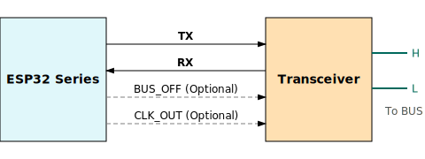
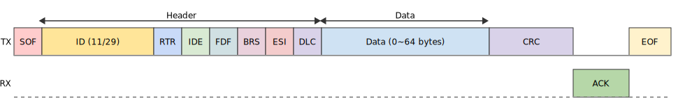
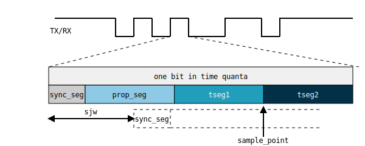

===================
双线汽车接口 (TWAI)
===================

:link_to_translation:`en:[English]`

本文介绍了 ESP-IDF 中的双线汽车接口（Two-Wire Automotive Interface）控制器驱动的功能，章节目录如下：

.. contents::
    :local:
    :depth: 2

概述
====

TWAI 是一种适用于汽车和工业应用的高可靠性的多主机实时串行异步通信协议。它兼容 ISO11898-1 标准定义的帧结构，可以支持 11 位 ID 的标准帧和 29 位 ID 的扩展帧。支持报文优先级和无损仲裁，支持自动重传和故障自动隔离机制。{IDF_TARGET_NAME} 包含 {IDF_TARGET_CONFIG_SOC_TWAI_CONTROLLER_NUM} 个 TWAI 控制器，可以创建 {IDF_TARGET_CONFIG_SOC_TWAI_CONTROLLER_NUM} 个驱动实例。

.. only:: SOC_TWAI_FD_SUPPORTED

    {IDF_TARGET_NAME} TWAI 控制器兼容 ISO11898-1 FD (a.k.a. CAN FD) 格式帧，可以发送和接收经典格式和 FD 格式帧。

.. only:: not SOC_TWAI_FD_SUPPORTED

    {IDF_TARGET_NAME} TWAI 控制器 **不兼容 ISO11898-1 FD 格式帧，并会将这些帧解析为错误。**

基于硬件的高容错、多主机特性，该驱动的主要应用场景包括：

- 作为复杂干扰环境的通信总线，为设备提供可靠通信
- 作为远距离多传感器/执行器总线，单节点故障不影响总线运行
- 搭建去中心化分布式局域网络，避免单一主节点机制的不确定性
- 配合其他通信协议作为桥接设备

快速入门
========

本节将带你快速了解如何使用 TWAI 驱动。通过简单的示例，展示如何创建一个 TWAI 节点实例，如何发送和接收总线上的报文，以及如何安全停止和删除驱动。一般的使用流程如下：

.. image:: ../../../_static/diagrams/twai/base_flow.drawio.svg
    :align: center

硬件连接
--------

{IDF_TARGET_NAME} 内部没有集成 TWAI 收发器。因此你需要外接一个收发器才能加入 TWAI 总线。外部收发器的型号取决于具体应用遵循的物理层规范。例如，使用 TJA105x 收发器以兼容 ISO 11898-2 标准。

其中：

- 在做单节点测试时，可以直接短接 TX 和 RX 引脚以省略收发器。
- BUS_OFF （可选），在 TWAI 控制器进入离线状态时为低逻辑电平 (0 V)。否则为高逻辑电平 (3.3 V)。
- CLK_OUT （可选），输出控制器时间量子时钟，即源时钟的分频时钟。

创建和启动 TWAI 节点
---------------------

首先，我们需要创建一个 TWAI 实例。以下代码展示了如何创建一个波特率为 200kHz 的 TWAI 节点：

.. code:: c

    #include "esp_twai.h"
    #include "esp_twai_onchip.h"

    twai_node_handle_t node_hdl = NULL;
    twai_onchip_node_config_t node_config = {
        .io_cfg.tx = 4,     // twai tx GPIO
        .io_cfg.rx = 5,     // twai rx GPIO
        .bit_timing.bitrate = 200000,   // 200k 波特率
        .tx_queue_depth = 5,// 发送队列深度为5
    };
    // 创建 TWAI 控制器驱动实例
    ESP_ERROR_CHECK(twai_new_node_onchip(&node_config, &node_hdl));
    // 启动 TWAI 控制器
    ESP_ERROR_CHECK(twai_node_enable(node_hdl));

当创建 TWAI 实例时，我们需要通过 :cpp:type:`twai_onchip_node_config_t` 配置 GPIO 引脚、波特率等参数。这些参数将决定 TWAI 的工作方式。然后调用 :cpp:func:`twai_new_node_onchip` 函数创建一个新的 TWAI 实例，该函数将返回一个指向新实例的句柄。 TWAI 的句柄实际上是一个指向 TWAI 内存对象的指针，类型为 :cpp:type:`twai_node_handle_t`。

以下是 :cpp:type:`twai_onchip_node_config_t` 结构体的其他配置参数及其解释：

- :cpp:member:`twai_onchip_node_config_t::clk_src` 指定控制器使用的时钟源，支持的时钟源列表见 :cpp:type:`twai_clock_source_t`
- :cpp:member:`twai_onchip_node_config_t::bit_timing::sp_permill` 指定采样点位置，ssp_permill 指定二次采样点位置，可用于低信噪比下的时序微调。
- :cpp:member:`twai_onchip_node_config_t::data_timing` 指定 FD 格式时数据段的波特率及采样点，如果控制器不兼容 FD 格式，此配置无效。
- :cpp:member:`twai_onchip_node_config_t::fail_retry_cnt` 失败重传次数，-1 表示无限重传直到成功或 BUS_OFF； 0 表示失败后重传 0 次，即单次模式； 1 ：重传 1 次，以此类推。
- :cpp:member:`twai_onchip_node_config_t::intr_priority` 中断优先级，范围 [0:3]，值越大优先级越高。
- :cpp:member:`twai_onchip_node_config_t::flags` 通常用来微调驱动的一些行为，包括以下选项：

    - :cpp:member:`twai_onchip_node_config_t::flags::enable_self_test` 使能自测模式，发送报文时不检查ACK接收，可用于单节点测试。
    - :cpp:member:`twai_onchip_node_config_t::flags::enable_loopback` 使能自收发模式，节点会收到自己发送的报文（如果配置了过滤器则还需要符合过滤规则），同时也会发送到总线。
    - :cpp:member:`twai_onchip_node_config_t::flags::enable_listen_only` 配置为监听模式，节点只接收，不发送任何显性位，包括 ACK 和错误帧。
    - :cpp:member:`twai_onchip_node_config_t::flags::no_receive_rtr` 使用过滤器时是否同时过滤掉符合 ID 规则的远程帧。

函数 :cpp:func:`twai_node_enable` 将启动 TWAI 控制器，此时 TWAI 控制器就连接到了总线，可以向总线发送报文。如果收到了总线上其他节点发送的报文，或者检测到了总线错误，也将产生相应事件。

与之对应的函数是 :cpp:func:`twai_node_disable`，该函数将立即停止节点工作并与总线断开，正在进行的传输将被中止。当下次重新启动时，如果发送队列中有未完成的任务，驱动将立即发起新的传输。

发送报文
--------

TWAI 报文有多种类型，由报头指定。一个典型的数据帧报文主要包括报头和数据，大概结构如下：

为减少拷贝带来的性能损失，TWAI 驱动使用指针进行传递。且驱动设计为异步模式，因此，在传输真正完成之前， :cpp:type:`twai_frame_t` 实体及其 :cpp:member:`twai_frame_t::buffer` 指向的内存必须保持有效。可通过以下方式得知传输完成：

- 调用 :cpp:func:`twai_node_transmit_wait_all_done` 函数等待所有传输完成。
- 注册 :cpp:member:`twai_event_callbacks_t::on_tx_done` 事件回调函数，在传输完成时接收通知。

以下代码展示了如何发送一条典型的数据帧报文：

.. code:: c

    uint8_t send_buff[8] = {0};
    twai_frame_t tx_msg = {
        .header.id = 0x1,       // 报文ID
        .header.ide = true,     // 29 位扩展ID格式
        .buffer = send_buff,    // 发送数据的地址
        .buffer_len = sizeof(send_buff),    // 发送数据的长度
    };
    ESP_ERROR_CHECK(twai_node_transmit(node_hdl, &tx_msg, 0));  // 超时为0，队列满则直接返回超时
    ESP_ERROR_CHECK(twai_node_transmit_wait_all_done(node_hdl, -1));  // 等待发送完成

其中 :cpp:member:`twai_frame_t::header::id` 指示了该文的 ID 为 0x01。报文的 ID 通常用于表示报文在应用中的类型，并在发送过程中起到总线竞争仲裁的作用，其数值越小，在总线上的优先级越高。:cpp:member:`twai_frame_t::buffer` 则指向要发送数据所在的内存地址，并由 :cpp:member:`twai_frame_t::buffer_len` 给出数据长度。:cpp:func:`twai_node_transmit` 函数是线程安全的，并且也可以在 ISR 中调用。当从 ISR 调用时，``timeout`` 参数将被忽略，函数不会阻塞。

需要注意的是 :cpp:member:`twai_frame_t::header::dlc` 同样可以指定一个数据帧中数据的长度，dlc(data length code) 与具体长度的对应兼容 ISO11898-1 规定。可使用 :cpp:func:`twaifd_dlc2len` / :cpp:func:`twaifd_len2dlc` 进行转换，选择其一即可，如果 dlc 和 buffer_len 都不为 0 ，那他们所代表的长度必须一致。

报文类型 :cpp:type:`twai_frame_t` 中还包括其他的配置参数，如下：

- :cpp:member:`twai_frame_t::dlc` 数据长度代码，经典帧 [0:8] 代表长度 [0:8]；FD 格式 [0:15] 代表长度 [0:64]。
- :cpp:member:`twai_frame_t::header::ide` 使用 29 位扩展ID格式。
- :cpp:member:`twai_frame_t::header::rtr` 报文为远程帧，不包含数据段。
- :cpp:member:`twai_frame_t::header::fdf` 报文为 FD 格式，支持最大数据长度 64 字节。
- :cpp:member:`twai_frame_t::header::brs` 发送报文时在数据段使用独立的波特率。
- :cpp:member:`twai_frame_t::header::esi` 对于收到的报文，指示发送节点的错误状态。

接收报文
--------

接收报文必须在接收事件回调中进行，因此，要接收报文需要在控制器启动前注册接收事件回调 :cpp:member:`twai_event_callbacks_t::on_rx_done` ，从而在事件发生时接收报文。以下代码分别展示了如何注册接收事件回调，以及如何在回调中接收报文：

注册接收事件回调（在控制器启动前）：

.. code:: c

    twai_event_callbacks_t user_cbs = {
        .on_rx_done = twai_rx_cb,
    };
    ESP_ERROR_CHECK(twai_node_register_event_callbacks(node_hdl, &user_cbs, NULL));

在事件中接收报文：

.. code:: c

    static bool twai_rx_cb(twai_node_handle_t handle, const twai_rx_done_event_data_t *edata, void *user_ctx)
    {
        uint8_t recv_buff[8];
        twai_frame_t rx_frame = {
            .buffer = recv_buff,
            .buffer_len = sizeof(recv_buff),
        };
        if (ESP_OK == twai_node_receive_from_isr(handle, &rx_frame)) {
            // receive ok, do something here
        }
        return false;
    }

同样，驱动使用指针进行传递，因此需要在接收前配置 :cpp:member:`twai_frame_t::buffer` 的指针及其内存长度 :cpp:member:`twai_frame_t::buffer_len`

报文时间戳
----------

TWAI 驱动支持为每个成功接收的报文创建一个 64 位的时间戳，在创建节点时配置 :cpp:member:`twai_onchip_node_config_t::timestamp_resolution_hz` 字段即可启用该功能，时间戳保存在接收报文的 :cpp:member:`twai_frame_t::header::timestamp` 字段中。

节点时间继承自系统时间，即时间起点同为芯片上电启动时开始计时，期间不受驱动停止/启动/BUS_OFF 状态的影响。

停止和删除节点
--------------

当不再需要使用 TWAI 时，应该调用 :cpp:func:`twai_node_delete` 函数来释放软硬件资源。删除前请确保 TWAI 已经处于停止状态。

进阶功能
========

在了解了基本用法后，我们可以进一步探索 TWAI 驱动的更多玩法。驱动支持更详细的控制器配置和错误反馈功能，完整的驱动功能图如下：

.. image:: ../../../_static/diagrams/twai/full_flow.drawio.svg
    :align: center

在 ISR 中发送
-------------

TWAI 驱动支持在中断服务程序 (ISR) 中发送报文。这对于需要低延迟响应或由硬件定时器触发的周期性传输的应用特别有用。例如，你可以在 ``on_tx_done`` 回调中触发一次新的传输，该回调在 ISR 上下文中执行。

.. code:: c

    static bool twai_tx_done_cb(twai_node_handle_t handle, const twai_tx_done_event_data_t *edata, void *user_ctx)
    {
        // 一帧已成功发送。排队另一帧。
        // 帧及其数据缓冲区必须在传输完成之前保持有效。
        static const uint8_t data_buffer[] = {1, 2, 3, 4};
        static const twai_frame_t tx_frame = {
            .header.id = 0x2,
            .buffer = (uint8_t *)data_buffer,
            .buffer_len = sizeof(data_buffer),
        };

        // `twai_node_transmit` 在 ISR 上下文中调用是安全的
        twai_node_transmit(handle, &tx_frame, 0);
        return false;
    }

.. note::
    在 ISR 中调用 :cpp:func:`twai_node_transmit` 时，``timeout`` 参数将被忽略，函数不会阻塞。如果发送队列已满，函数将立即返回错误。应用程序需要自行处理队列已满的情况。同样，``twai_frame_t`` 及其 ``buffer`` 指向的内存必须在 **该传输** 完成之前保持有效。通过 :cpp:member:`twai_tx_done_event_data_t::done_tx_frame` 指针可得知该次完成的报文。

位时序自定义
-------------

和其他异步通信不同的是，TWAI 控制器在一个位时间里实际上在进行以 **时间量子（Tq）** 为单位的计数 / 采样，一个位里的时间量子的数量决定了最终的波特率以及采样点位置。在信号质量较低时时，可以手动更加精准的配置这些时序段以满足要求。位时间里的时间量子分为不同的段，如图所示：

其中同步段 sync 固定为 1 ，采样点位于 tseg1 和 tseg2 中间，同步跳变宽度 sjw 确定单个位时间可以为了同步而延长/缩短的最大时间量子数，范围为 [1:tseg2]。时钟源除以预分频 BRP 即为时间量子，所有段的时间总和即为一个位时间。故有如下公式：

- 波特率：

.. math::

   \text{bitrate} = \frac{f_{\text{src}}}{\text{brp} \cdot (1 + \text{prop_seg} + \text{tseg}_1 + \text{tseg}_2)}

- 采样点：

.. math::

   \text{sample_point} = \frac{1 + \text{prop_seg} + \text{tseg}_1}{1 + \text{prop_seg} + \text{tseg}_1 + \text{tseg}_2}

以下代码展示了在时钟源 80M 时，配置波特率为 500Kbit/s ，采样点为 75% 的具体配置。

.. code:: c

    twai_timing_advanced_config_t timing_cfg = {
        .brp = 8,  // 预分频为 8，时间量子 80M/8=10M
        .prop_seg = 10,
        .tseg_1 = 4,
        .tseg_2 = 5,
        .sjw = 3,
    };
    ESP_ERROR_CHECK(twai_node_reconfig_timing(node_hdl, &timing_cfg, NULL)); // 配置仲裁段波特率，NULL 表示不配置 FD 数据段波特率

当手动配置这些段时，需要根据具体硬件留意每个段所支持的范围大小。时序配置函数 :cpp:func:`twai_node_reconfig_timing` 可以同时或单独对仲裁段和 FD 数据段时序进行配置，当控制器不支持 FD 格式时，对数据段的配置无效。时序参数 :cpp:type:`twai_timing_advanced_config_t` 中还有一些别的配置参数：

- :cpp:member:`twai_timing_advanced_config_t::clk_src` 时钟源。
- :cpp:member:`twai_timing_advanced_config_t::ssp_offset` 二次采样点相对同步段偏移的时间量子数。

.. note::

    ``brp``、``prop_seg``、``tseg_1``、``tseg_2`` 和 ``sjw`` 的不同组合可以实现相同波特率。用户应考虑 **传播延迟、节点信息处理时间和相位误差** 等因素，根据总线的物理特性进行调整。

过滤器配置
----------

掩码过滤器
^^^^^^^^^^

TWAI 控制器硬件可以根据 ID 对报文进行过滤，从而减少软硬件开销使节点更加高效。过滤掉报文的节点 **不会接收到该报文，但仍会应答**。

{IDF_TARGET_NAME} 包含 {IDF_TARGET_CONFIG_SOC_TWAI_MASK_FILTER_NUM} 个掩码过滤器，报文通过任意一个过滤器即能收到该报文。典型的 TWAI 掩码过滤器通过 ID 和 MASK 配置，其中：

- ID 表示期望接收的报文的标准11位或扩展29位ID。
- MASK 表示对ID的过滤规则：

    - '0' 表示该位忽略，任意值都通过。
    - '1' 表示该位需要相等才能通过。
    - ID 和 MASK 都为 0 时，即忽略所有位，过滤器接收所有的帧。
    - ID 和 MASK 都为最大值 0xFFFFFFFF 表示不接收任何帧。

下面代码展示了如何计算 MASK 和配置过滤器：

.. code:: c

    twai_mask_filter_config_t mfilter_cfg = {
        .id = 0x10,         // 0b 000 0001 0000
        .mask = 0x7f0,      // 0b 111 1111 0000 表示高7位严格匹配，低4位忽略，接收ID为
                            // 0b 000 0001 xxxx (16进制0x01x)
        .is_ext = false,    // 不接收扩展ID，只接收标准ID
    };
    ESP_ERROR_CHECK(twai_node_config_mask_filter(node_hdl, 0, &mfilter_cfg));   //配置过滤器0

.. only:: not SOC_TWAI_FD_SUPPORTED

    双过滤器模式
    ^^^^^^^^^^^^

    {IDF_TARGET_NAME} 支持双过滤器模式，可将硬件配置为并列的两个独立的 16 位掩码过滤器，支持接收更多 ID。但注意，使用双过滤器模式过滤 29 位扩展ID时，每个过滤器只能过滤其ID的高 16 位，剩余13位不做过滤。以下代码展示了如何借助 :cpp:func:`twai_make_dual_filter` 配置双过滤器模式。

    .. code:: c

        // filter 1 id/mask 0x020, 0x7f0, receive only std id 0x02x
        // filter 2 id/mask 0x013, 0x7f8, receive only std id 0x010~0x017
        twai_mask_filter_config_t dual_config = twai_make_dual_filter(0x020, 0x7f0, 0x013, 0x7f8, false); // id1, mask1, id2, mask2, 不接收扩展ID
        ESP_ERROR_CHECK(twai_node_config_mask_filter(node_hdl, 0, &dual_config));

.. only:: SOC_TWAI_FD_SUPPORTED

    范围过滤器
    ^^^^^^^^^^

    {IDF_TARGET_NAME} 还包含 1 个范围过滤器，与掩码过滤器属并列关系。可以通过 :cpp:func:`twai_node_config_range_filter` 函数直接配置希望接收的 ID 范围。其中：

    - 当配置 :cpp:member:`twai_range_filter_config_t::range_low` 为最小值 0， :cpp:member:`twai_range_filter_config_t::range_high` 为最大值 0xFFFFFFFF 表示接收所有报文。
    - 配置为无效区间则表示不接收任何报文。

总线错误和恢复
--------------

TWAI控制器能够检测由于总线干扰产生的/损坏的不符合帧格式的错误，并规定了一套由发送/接收错误计数器(TEC/REC)实现的故障隔离机制。计数器值决定节点的错误状态，即主动错误、错误警告、被动错误和离线，它可以使持续存在错误的节点最终自行断开与总线的连接。

- **主动错误:** 当 TEC 和 REC 都小于 96 时，节点处于主动错误状态，表示正常运行。可以参与总线通信，检测到错误时发送 **主动错误标志**，主动报告检测到的错误。
- **错误警告:** 当 TEC 或 REC 中的一个大于或等于 96 时，且两个都小于 128 ，节点处于错误警告状态，表示可能存在错误，但行为不变。
- **被动错误:** 当 TEC 或 REC 中的一个大于或等于 128 时，节点处于被动错误状态。仍可以参与总线通信，但在检测到错误时，只能发送一次 **被动错误标志**。
- **离线:** 当 **TEC** 大于或等于 256 时，节点进入离线状态。离线的节点相当于断开连接，不会对总线产生任何影响。节点将保持离线状态，直到软件触发恢复操作。

软件可随时在 task 中使用函数 :cpp:func:`twai_node_get_info` 获取节点状态。或当控制器检测到错误时，会产生 :cpp:member:`twai_event_callbacks_t::on_error` 回调，可通过传参中的错误数据查看错误原因。

当错误导致节点状态变化时，会进入 :cpp:member:`twai_event_callbacks_t::on_state_change` 回调，可在回调中查看节点的状态变化。若节点已经离线且需要恢复，需要在task中调用 :cpp:func:`twai_node_recover`。 **但注意，控制器不会立即恢复** ，需要在检测到 129 次连续 11 个隐性位后才会自动重新连接到总线。

节点恢复完成时同样进入 :cpp:member:`twai_event_callbacks_t::on_state_change` 回调，状态由 :cpp:enumerator:`TWAI_ERROR_BUS_OFF` 变为 :cpp:enumerator:`TWAI_ERROR_ACTIVE`。恢复完成的节点可以立即进行传输，如果发送队列中有未完成的任务，驱动将立即发起新的传输。

关于低功耗
----------

当启用电源管理 :ref:`CONFIG_PM_ENABLE` 时，系统在进入睡眠模式前可能会调整或关闭时钟源，从而导致 TWAI 出错。为了防止这种情况发生，驱动内部使用电源锁管理。当调用 :cpp:func:`twai_node_enable` 函数后，该锁将被激活，确保系统不会进入睡眠模式，从而保持 TWAI 功能正常。如果需要降低功耗，可以调用 :cpp:func:`twai_node_disable` 函数来释放电源管理锁，使系统能够进入睡眠模式，睡眠期间 TWAI 控制器也将停止工作。

关于 Cache 安全
---------------

在进行 Flash 写操作时，为了避免 Cache 从 Flash 加载指令和数据时出现错误，系统会暂时禁用 Cache 功能。这会导致存放在 Flash 上的中断处理程序在此期间无法响应。如果希望在 Cache 被禁用期间，中断处理程序仍能正常运行，可以启用 :ref:`CONFIG_TWAI_ISR_CACHE_SAFE` 选项。

.. note::

    请注意，在启用该选项后，所有的中断回调函数及其上下文数据 **必须存放在内部存储空间** 中。因为在 Cache 被禁用时，系统无法从 Flash 中加载数据和指令。

关于线程安全
-------------

驱动程序可保证所有公开的 TWAI API 的线程安全，使用时，可以直接从不同的 RTOS 任务中调用此类 API，无需额外锁保护。

关于性能
--------

为了提升中断处理的实时响应能力， 驱动提供了 :ref:`CONFIG_TWAI_ISR_IN_IRAM` 选项。启用该选项后，中断处理程序和接收操作将被放置在内部 RAM 中运行，从而减少了从 Flash 加载指令带来的延迟。

对于需要高性能发送操作的应用，驱动还提供了 :ref:`CONFIG_TWAI_IO_FUNC_IN_IRAM` 选项，用于将发送函数放置在 IRAM 中。这对于在用户任务中频繁调用 :cpp:func:`twai_node_transmit` 的时间关键应用特别有效。

.. note::

    但是，中断处理程序调用的用户回调函数和用户上下文数据仍然可能位于 Flash 中，延迟问题还是会存在，这需要用户自己将回调函数和数据放入内部 RAM 中，比如使用 :c:macro:`IRAM_ATTR` 和 :c:macro:`DRAM_ATTR`。

关于资源消耗
------------

使用 :doc:`/api-guides/tools/idf-size` 工具可以查看 TWAI 驱动的 Flash 和内存空间消耗。以下是测试条件（以 ESP32-C6 为例）：

- 编译器优化等级设置为 ``-Os``，以确保代码尺寸最小化。
- 默认日志等级设置为 ``ESP_LOG_INFO``，以平衡调试信息和性能。
- 关闭以下驱动优化选项：

    - :ref:`CONFIG_TWAI_ISR_IN_IRAM` - 中断处理程序不放入 IRAM。
    - :ref:`CONFIG_TWAI_ISR_CACHE_SAFE` - 不启用 Cache 安全选项。

**注意，以下数据仅供参考，不是精确值，在不同芯片上会有所出入。**

+-----------------+------------+-------+------+-------+-------+-------+---------+-------+
| Component Layer | Total Size | DIRAM | .bss | .data | .text | Flash | .rodata | .text |
+=================+============+=======+======+=======+=======+=======+=========+=======+
| driver          | 7262       | 12    | 12   | 0     | 0     | 7250  | 506     | 6744  |
+-----------------+------------+-------+------+-------+-------+-------+---------+-------+
| hal             | 1952       | 0     | 0    | 0     | 0     | 0     | 0       | 1952  |
+-----------------+------------+-------+------+-------+-------+-------+---------+-------+
| soc             | 64         | 0     | 0    | 0     | 0     | 64    | 64      | 0     |
+-----------------+------------+-------+------+-------+-------+-------+---------+-------+

打开 :ref:`CONFIG_TWAI_ISR_IN_IRAM` 优化选项的消耗情况：

+-----------------+------------+-------+------+-------+-------+-------+---------+-------+
| Component Layer | Total Size | DIRAM | .bss | .data | .text | Flash | .rodata | .text |
+=================+============+=======+======+=======+=======+=======+=========+=======+
| driver          | 7248       | 692   | 12   | 0     | 680   | 6556  | 506     | 6050  |
+-----------------+------------+-------+------+-------+-------+-------+---------+-------+
| hal             | 1952       | 1030  | 0    | 0     | 1030  | 922   | 0       | 922   |
+-----------------+------------+-------+------+-------+-------+-------+---------+-------+
| soc             | 64         | 0     | 0    | 0     | 0     | 0     | 64      | 0     |
+-----------------+------------+-------+------+-------+-------+-------+---------+-------+

此外，每一个 TWAI 句柄会从 heap 中动态申请约 ``168`` + 4 * :cpp:member:`twai_onchip_node_config_t::tx_queue_depth` 字节的内存。

其他 Kconfig 选项
-----------------

- :ref:`CONFIG_TWAI_ENABLE_DEBUG_LOG` 选项允许强制启用 TWAI 驱动的所有调试日志，无论全局日志级别设置如何。启用此选项可以帮助开发人员在调试过程中获取更详细的日志信息，从而更容易定位和解决问题。

应用示例
========

.. list::

    - :example:`peripherals/twai/twai_utils` 演示了如何使用 TWAI（Two-Wire Automotive Interface，双线汽车接口）API 创建一个命令行工具，用于 TWAI 总线通信，支持帧的发送/接收、过滤、监控，以及经典和 FD 格式，以便测试和调试 TWAI 网络。
    - :example:`peripherals/twai/twai_error_recovery` 演示了总线错误上报，节点状态变化等事件信息，以及如何从离线状态恢复节点并重新进行通信。
    - :example:`peripherals/twai/twai_network` 通过发送、监听， 2 个不同角色的节点，演示了如何使用驱动程序进行单次的和大量的数据发送，以及配置过滤器以接收这些数据。
    - :example:`peripherals/twai/cybergear` 演示了如何通过 TWAI 接口控制 XiaoMi CyberGear 电机。

API 参考
========

片上 TWAI API
-------------

.. include-build-file:: inc/esp_twai_onchip.inc

TWAI 驱动 API
-------------

.. include-build-file:: inc/esp_twai.inc

TWAI 驱动类型
-------------

.. include-build-file:: inc/esp_twai_types.inc

TWAI HAL 类型
--------------

.. include-build-file:: inc/twai_types.inc
