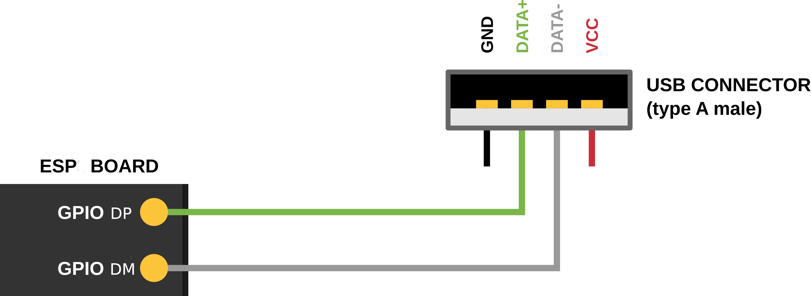
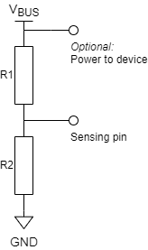

USB 设备栈
=================

:link_to_translation:`en:[English]`

{IDF_TARGET_USB_DP_GPIO_NUM:default="20"}
{IDF_TARGET_USB_DM_GPIO_NUM:default="19"}
{IDF_TARGET_USB_EP_NUM: default="6", esp32p4="15"}
{IDF_TARGET_USB_EP_NUM_INOUT:default="5", esp32p4="8"}
{IDF_TARGET_USB_EP_NUM_IN:default="1", esp32p4="7"}

概述
--------

USB 设备栈（以下简称设备栈）支持在 {IDF_TARGET_NAME} 上启用 USB 设备支持。通过使用设备栈，可以为 {IDF_TARGET_NAME} 烧录任意具有明确定义的 USB 设备功能（如键盘、鼠标、摄像头）、自定义功能（也称特定供应商类别）或上述功能的组合（也称复合设备）。

设备栈基于 TinyUSB 栈构建，但对 TinyUSB 进行了一些小的功能扩展和修改，使其更好地集成到 ESP-IDF。设备栈通过 `乐鑫组件注册表 <https://components.espressif.com/components/espressif/esp_tinyusb>`__ 作为托管组件分发。

功能列表
--------

- 支持多种设备类别 (CDC, HID, MIDI, MSC)
- 支持复合设备
- 支持特定供应商类别
- 最多支持 {IDF_TARGET_USB_EP_NUM} 个端点

    - {IDF_TARGET_USB_EP_NUM_INOUT} 个输入/输出端点
    - {IDF_TARGET_USB_EP_NUM_IN} 个输入端点

- 自供电设备的 VBUS 监测

.. Todo: Refactor USB hardware connect into a separate guide

硬件连接
--------

.. only:: esp32s2 or esp32s3

    {IDF_TARGET_NAME} 将 USB D+ 和 D- 信号分别路由到 GPIO {IDF_TARGET_USB_DP_GPIO_NUM} 和 {IDF_TARGET_USB_DM_GPIO_NUM}。为了实现 USB 设备功能，这些 GPIO 应通过某种方式连接到总线（例如，通过 Micro-B 端口、USB-C 端口或直接连接到标准-A 插头）。

.. only:: esp32p4

    {IDF_TARGET_NAME} 将 USB D+ 和 D- 信号路由到其专用引脚。为了实现 USB 设备功能，这些引脚应通过某种方式连接到总线（例如，通过 Micro-B 端口、USB-C 端口或直接连接到标准-A 插头）。

.. only:: esp32s2 or esp32s3

    .. note::

        如果你使用带有两个 USB 端口的 {IDF_TARGET_NAME} 开发板，标有 "USB" 的端口已经连接到 D+ 和 D- GPIO。

.. note::

    自供电设备还必须通过电压分压器或比较器连接 VBUS，详情请参阅 :ref:`self-powered-device`。

设备栈结构
----------

设备栈以 TinyUSB 栈为基础，在此基础上，该设备栈实现了以下功能：

- 自定义 USB 描述符
- 支持串行设备
- 通过串行设备重定向标准流
- 提供用于 USB 设备 MSC 类的存储介质（SPI-Flash 和 SD 卡）
- 封装设备栈中处理 TinyUSB 服务的任务

组件依赖项
-------------

设备栈通过 `乐鑫组件注册表 <https://components.espressif.com/components/espressif/esp_tinyusb>`__ 分发，使用前，请使用以下命令将设备栈组件添加为依赖项：

.. code:: bash

  idf.py add-dependency esp_tinyusb

配置选项
^^^^^^^^^

通过 menuconfig 选项，可以对设备栈进行以下多方面配置：

- TinyUSB 日志的详细程度
- 设备栈任务相关选项
- 默认设备/字符串描述符选项
- 特定类别的选项

.. _descriptors-configuration:

配置描述符
^^^^^^^^^^^^^^^^^^^^^^^^^

结构体 :cpp:type:`tinyusb_config_t` 提供了与 USB 描述符相关的字段，应进行初始化。

无论是全速 USB 设备还是高速 USB 设备，都应初始化以下描述符：

- :cpp:member:`device_descriptor`
- :cpp:member:`string_descriptor`

全速 USB 设备应初始化以下字段，以提供相应的配置描述符：

- :cpp:member:`configuration_descriptor`

.. only:: esp32p4

    高速 USB 设备应初始化以下字段，以提供不同速度下的配置描述符：

    - :cpp:member:`fs_configuration_descriptor`
    - :cpp:member:`hs_configuration_descriptor`
    - :cpp:member:`qualifier_descriptor`

    .. note::

        为符合 USB 2.0 协议规范，需同时初始化 :cpp:member:`fs_configuration_descriptor` 和 :cpp:member:`hs_configuration_descriptor`。

调用 :cpp:func:`tinyusb_driver_install` 时，设备栈将基于上述字段中提供的描述符实现 USB 设备。

设备栈还提供了默认描述符，将 :cpp:func:`tinyusb_driver_install` 中的相应字段设置为 ``NULL`` 即可安装。默认描述符包括：

- 默认设备描述符：如需启用，将 :cpp:member:`device_descriptor` 设置为 ``NULL``。默认设备描述符将使用相应的 menuconfig 选项设置的值（如 PID、VID、bcdDevice 等）。
- 默认字符串描述符：如需启用，将 :cpp:member:`string_descriptor` 设置为 ``NULL``。默认字符串描述符将使用相应的 menuconfig 选项设置的值（如制造商、产品和序列字符串描述符选项）。
- 默认配置描述符。某些很少需要自定义配置的类别（如 CDC 和 MSC）将提供默认配置描述符。如需启用，将相应的配置描述符字段设置为 ``NULL``。

    - :cpp:member:`configuration_descriptor`：全速描述符，仅适用于全速设备
    - :cpp:member:`fs_configuration_descriptor`：全速描述符，适用于高速设备
    - :cpp:member:`hs_configuration_descriptor`：高速描述符，适用于高速设备

.. note::

    为实现向后兼容性，若设备栈支持高速，可使用 :cpp:member:`configuration_descriptor` 代替 :cpp:member:`fs_configuration_descriptor` 来设置全速配置描述符。

安装设备栈
----------

请调用 :cpp:func:`tinyusb_driver_install` 安装设备栈。结构体 :cpp:type:`tinyusb_config_t` 指定了设备栈的配置，而 :cpp:type:`tinyusb_config_t` 作为参数传递给 :cpp:func:`tinyusb_driver_install`。

.. note::

    结构体 :cpp:type:`tinyusb_config_t` 可以实现零初始化（如 ``const tinyusb_config_t tusb_cfg = { 0 };``）或部分初始化（如下所示）。对于结构体中任何初始化为 ``0`` 或 ``NULL`` 的成员，设备栈将使用其默认配置，请参阅如下示例。

.. code-block:: c

    const tinyusb_config_t partial_init = {
        .device_descriptor = NULL,  // 使用在 menuconfig 中指定的默认设备描述符
        .string_descriptor = NULL,  // 使用在 menuconfig 中指定的默认字符串描述符
        .external_phy = false,      // 使用内部 USB PHY
    #if (TUD_OPT_HIGH_SPEED)
        .fs_configuration_descriptor = NULL, // 使用在 menuconfig 中根据设置指定的默认全速配置描述符
        .hs_configuration_descriptor = NULL, // 使用在 menuconfig 中根据设置指定的默认高速配置描述符
        .qualifier_descriptor = NULL,  // 使用默认限定描述符，值取自默认设备描述符
    #else
        .configuration_descriptor = NULL,   // 使用在 menuconfig 中根据设置指定的默认配置描述符
    #endif // TUD_OPT_HIGH_SPEED

    };

.. _self-powered-device:

自供电设备
-------------------

USB 规范要求自供电设备监测 USB 的 VBUS 信号的电压水平。与总线供电设备相反，即使没有 USB 连接，自供电设备也可以正常工作。通过监测 VBUS 电压水平，自供电设备可以检测连接和断开事件。当 VBUS 电压升高到 4.75 V 以上时视为有效；当 VBUS 电压下降到 4.35 V 以下时视为无效。

在 {IDF_TARGET_NAME} 上，需要使用一个 GPIO 作为电压感测管脚，检测 VBUS 处于在规定阈值之上/之下。然而，由于 {IDF_TARGET_NAME} 管脚具有 3.3 V 容差，即使 VBUS 上升/下降到高于/低于上述规定阈值，{IDF_TARGET_NAME} 仍会显示为逻辑高电平。因此，为了检测 VBUS 是否有效，可以采用以下方法：

- 将 VBUS 连接至电压比较器芯片/电路，该芯片/电路可检测上述阈值（即 4.35 V 和 4.75 V），并向 {IDF_TARGET_NAME} 输出 3.3 V 逻辑电平，指示 VBUS 是否有效。
- 如果 VBUS 为 4.4 V，则使用电阻分压器输出 (0.75 x Vdd)（见下图）。

.. note::

    在这两种情况下，设备从 USB 主机拔出后 3 毫秒内，传感引脚上的电压必须为逻辑低电平。

    用于 VBUS 监测的简易分压器

请在结构体 :cpp:type:`tinyusb_config_t` 中将 :cpp:member:`self_powered` 设置为 ``true``，并将 :cpp:member:`vbus_monitor_io` 设置为用于 VBUS 监测的 GPIO 管脚编号以使用此功能。

USB 串行设备 (CDC-ACM)
---------------------------

如果在 menuconfig 中启用了 CDC 选项，则可以根据 :cpp:type:`tinyusb_config_cdcacm_t` 的设置，使用 :cpp:func:`tusb_cdc_acm_init` 初始化 USB 串行设备，请参阅如下示例：

.. code-block:: c

    const tinyusb_config_cdcacm_t acm_cfg = {
        .usb_dev = TINYUSB_USBDEV_0,
        .cdc_port = TINYUSB_CDC_ACM_0,
        .rx_unread_buf_sz = 64,
        .callback_rx = NULL,
        .callback_rx_wanted_char = NULL,
        .callback_line_state_changed = NULL,
        .callback_line_coding_changed = NULL
    };
    tusb_cdc_acm_init(&acm_cfg);

可以在配置结构体中设置指向 :cpp:type:`tusb_cdcacm_callback_t` 函数的指针指定回调函数，或在初始化 USB 串行设备后，调用 :cpp:func:`tinyusb_cdcacm_register_callback` 指定回调函数。

USB 串行控制台
^^^^^^^^^^^^^^^^^^

USB 串行设备支持将所有标准输入/输出流 (stdin、stdout、stderr) 重定向到 USB。因此，调用如 ``printf()`` 等标准库输入/输出函数将导致通过 USB 而不是 UART 发送/接收数据。

建议调用 :cpp:func:`esp_tusb_init_console` 将标准输入/输出流切换到 USB，并调用 :cpp:func:`esp_tusb_deinit_console` 将其切换回 UART。

USB 大容量存储设备 (MSC)
-----------------------------

在 menuconfig 中启用 MSC ``CONFIG_TINYUSB_MSC_ENABLED`` 选项时，可以将 ESP 芯片作为 USB 大容量存储设备使用。按如下示例，可以初始化存储媒介（SPI-Flash 或 SD 卡）。

- SPI-Flash

.. code-block:: c

    static esp_err_t storage_init_spiflash(wl_handle_t *wl_handle)
    {
        ***
        esp_partition_t *data_partition = esp_partition_find_first(ESP_PARTITION_TYPE_DATA, ESP_PARTITION_SUBTYPE_DATA_FAT, NULL);
        ***
        wl_mount(data_partition, wl_handle);
        ***
    }
    storage_init_spiflash(&wl_handle);

    const tinyusb_msc_spiflash_config_t config_spi = {
        .wl_handle = wl_handle
    };
    tinyusb_msc_storage_init_spiflash(&config_spi);

- SD 卡

.. code-block:: c

    static esp_err_t storage_init_sdmmc(sdmmc_card_t **card)
    {
        ***
        sdmmc_host_t host = SDMMC_HOST_DEFAULT();
        sdmmc_slot_config_t slot_config = SDMMC_SLOT_CONFIG_DEFAULT();
        // 对于 SD 卡，设置要使用的总线宽度

        slot_config.width = 4;
        slot_config.clk = CONFIG_EXAMPLE_PIN_CLK;
        slot_config.cmd = CONFIG_EXAMPLE_PIN_CMD;
        slot_config.d0 = CONFIG_EXAMPLE_PIN_D0;
        slot_config.d1 = CONFIG_EXAMPLE_PIN_D1;
        slot_config.d2 = CONFIG_EXAMPLE_PIN_D2;
        slot_config.d3 = CONFIG_EXAMPLE_PIN_D3;
        slot_config.flags |= SDMMC_SLOT_FLAG_INTERNAL_PULLUP;

        sd_card = (sdmmc_card_t *)malloc(sizeof(sdmmc_card_t));
        (*host.init)();
        sdmmc_host_init_slot(host.slot, (const sdmmc_slot_config_t *) &slot_config);
        sdmmc_card_init(&host, sd_card);
        ***
    }
    storage_init_sdmmc(&card);

    const tinyusb_msc_sdmmc_config_t config_sdmmc = {
        .card = card
    };
    tinyusb_msc_storage_init_sdmmc(&config_sdmmc);

应用示例
--------------------

下表列出了 :example:`peripherals/usb/device` 目录下的代码示例：

.. list-table::
   :widths: 35 65
   :header-rows: 1

   * - 代码示例
     - 描述
   * - :example:`peripherals/usb/device/tusb_console`
     - 设置 {IDF_TARGET_NAME} 芯片，通过串行设备连接获取日志输出
   * - :example:`peripherals/usb/device/tusb_serial_device`
     - 设置 {IDF_TARGET_NAME} 芯片，将其作为 USB 串行设备使用
   * - :example:`peripherals/usb/device/tusb_midi`
     - 设置 {IDF_TARGET_NAME} 芯片，将其作为 USB MIDI 设备使用
   * - :example:`peripherals/usb/device/tusb_hid`
     - 设置 {IDF_TARGET_NAME} 芯片，将其作为 USB 人机界面设备使用
   * - :example:`peripherals/usb/device/tusb_msc`
     - 设置 {IDF_TARGET_NAME} 芯片，将其作为 USB 大容量存储设备使用
   * - :example:`peripherals/usb/device/tusb_composite_msc_serialdevice`
     - 设置 {IDF_TARGET_NAME} 芯片，将其作为复合 USB 设备使用 (MSC + CDC)
