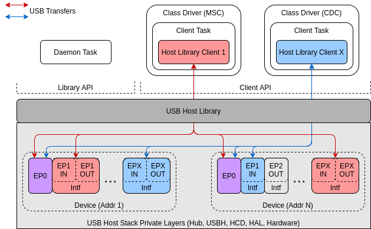
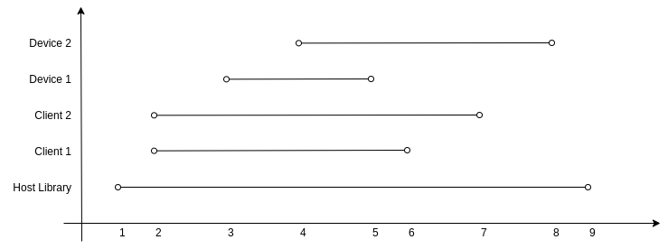
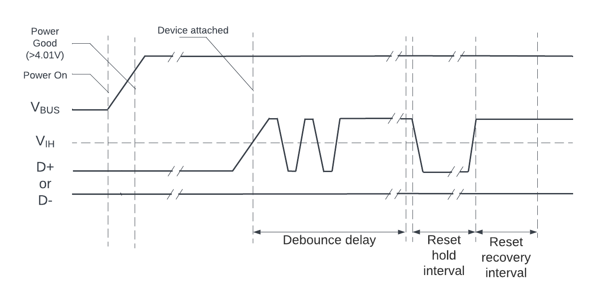

USB 主机
========

:link_to_translation:`en:[English]`

本文档提供了 USB 主机库的相关信息，按以下章节展开：

.. contents:: 章节
  :depth: 2

.. ---------------------------------------------------- Overview -------------------------------------------------------

概述
--------

USB 主机库（以下简称主机库）是 USB 主机栈的最底层，提供面向公众开放的 API。应用程序使用 USB 主机功能时，通常无需与主机库直接交互，而是使用某个主机 Class 驱动提供的 API，这些主机 Class 驱动构建在主机库之上。

然而，由于以下的某些原因（但不仅限于此），有时你可能需要直接使用主机库：

- 需要实现自定义主机 Class 驱动程序
- 需要更低级别的抽象

特性和限制
^^^^^^^^^^^^^^^^^^^^^^

主机库具有以下特性：

- 支持全速 (FS) 和低速 (LS) 设备。
- 支持四种传输类型，即控制传输、块传输、中断传输和同步传输。
- 支持多个 Class 驱动程序同时运行，即主机的多个客户端同时运行。
- 单个设备可以由多个客户端同时使用，如复合设备。
- 主机库及其底层主机栈不会在内部自动创建操作系统任务，任务数量完全由主机库接口的使用方式决定。一般来说，任务数量为 ``（运行中的主机 Class 驱动程序数量 + 1）``。

目前，主机库及其底层主机栈存在以下限制：

- 仅支持单个设备，而主机库的 API 支持多设备。
- 仅支持异步传输。
- 仅支持使用发现的首个配置，尚不支持变更为其他配置。
- 尚不支持传输超时。

.. -------------------------------------------------- Architecture -----------------------------------------------------

架构
------------

    USB 主机功能涉及的关键实体

上图展示了使用 USB 主机功能时涉及的关键实体，包括：

- **主机库**
- 主机库的 **客户端**
- **设备**
- 主机库的 **守护进程任务**

主机库
^^^^^^^^^^^^

主机库是 ESP-IDF USB 主机栈中面向公众开放的最底层的 API 层。任何其他 ESP-IDF 组件（如 Class 驱动程序或用户组件），如果需要与连接的 USB 设备通信，只能直接或间接使用主机库 API。

主机库 API 分为两类，即 **库 API** 和 **客户端 API**。

- 客户端 API 负责主机库的客户端与一或多个 USB 设备间的通信，该 API 只能由主机库的注册客户端调用。
- 库 API 负责主机库处理的通信中不特定于单个客户端的通信，如设备枚举。该 API 通常由主机库的守护进程任务调用。

客户端
^^^^^^^

主机库的客户端指使用主机库与 USB 设备通信的软件组件，如主机 Class 驱动程序或用户组件。每个客户端通常与任务间存在一对一关系，这表明，对特定客户端而言，其所有客户端 API 都应该在同一任务的上下文中调用。

通过将使用主机库的软件组件进行分类，划分为独立的客户端，主机库可以将所有客户端特定事件的处理委托给客户端对应的任务。换句话说，每个客户端任务负责管理与其对应的客户端之间的所有 USB 通信操作和事件处理，无需关心其他客户端的事件。

守护进程任务
^^^^^^^^^^^^

尽管主机库将客户端事件的处理委托给客户端本身，但仍然需要处理主机库事件，即不特定于客户端的事件。主机库事件处理可能涉及以下内容：

- 处理 USB 设备的连接、枚举和断连
- 将控制传输从/向客户端进行重定向
- 将事件转发给客户端

因此，除客户端任务外，主机库也需要一个任务来处理所有的库事件，这个任务通常是主机库守护进程任务。

设备
^^^^^^^

主机库隔离了客户端与设备处理的细节，包括连接、内存分配和枚举等，客户端只需提供已连接且已枚举的设备列表供选择。在枚举过程中，每个设备都会自动配置为使用找到的第一个配置，即通过获取配置描述符请求返回的第一个配置描述符。对于大多数标准设备，通常将第一个配置的 ``bConfigurationValue`` 设置为 ``1``。

只要不与相同接口通信，两个及以上的客户端可以同时与同一设备通信。然而，多个客户端同时与相同设备的默认端点（即 EP0）通信，将导致它们的控制传输序列化。

要与设备通信，客户端必须满足以下条件：

#. 使用设备地址打开设备，告知主机库，客户端正在使用该设备。
#. 获取将用于通信的接口，防止其他客户端获取相同的接口。
#. 通过已经获取了使用权的设备接口的端点通信通道发送数据传输。客户端的任务负责处理其与 USB 设备通信相关的操作和事件。

.. ------------------------------------------------------ Usage --------------------------------------------------------

用法
-----

主机库及底层主机栈不会创建任何任务，客户端任务和守护进程任务等均需由 Class 驱动程序或用户自行创建。然而，主机库提供了两个事件处理函数，可以处理所有必要的主机库操作，这些函数应从客户端任务和守护进程任务中重复调用。因此，客户端任务和守护进程任务的使用将主要集中于调用这些事件处理函数。

主机库与守护进程任务
^^^^^^^^^^^^^^^^^^^^^^^^^^

基本用法
"""""""""""

主机库 API 提供了 :cpp:func:`usb_host_lib_handle_events`，可以处理库事件。该函数需要反复调用，通常是从守护进程任务中调用。函数 :cpp:func:`usb_host_lib_handle_events` 有以下特点：

- 该函数会持续阻塞，直至需要处理库事件。
- 每次调用该函数都会返回事件标志，有助于了解卸载主机库的时机。

最基础的守护进程任务通常类似以下代码片段：

.. code-block:: c

    #include "usb/usb_host.h"

    void daemon_task(void *arg)
    {
        ...
        bool exit = false;
        while (!exit) {
            uint32_t event_flags;
            usb_host_lib_handle_events(portMAX_DELAY, &event_flags);
            if (event_flags & USB_HOST_LIB_EVENT_FLAGS_NO_CLIENTS) {
                ...
            }
            if (event_flags & USB_HOST_LIB_EVENT_FLAGS_ALL_FREE) {
                ...
            }
            ...
        }
        ...
    }

.. note::

    了解守护进程任务的完整示例，请前往 :example:`peripherals/usb/host/usb_host_lib`。

生命周期
"""""""""

    USB 主机库典型生命周期

上图展示了 USB 主机库的典型生命周期，其中涉及多个客户端和设备。具体而言，示例涉及以下内容：

- 两个已注册的客户端（客户端 1 和客户端 2）。
- 两个已连接的设备（设备 1 和设备 2），其中客户端 1 与设备 1 通信，客户端 2 与设备 2 通信。

参考上图可知，典型 USB 主机库生命周期包括以下关键阶段：

1. 调用 :cpp:func:`usb_host_install`，安装主机库。
    - 调用任意主机库 API 前，请确保已完成主机库安装。
    - 调用 :cpp:func:`usb_host_install` 的位置（如从守护进程任务或其他任务中调用）取决于守护系统任务、客户端任务和系统其余部分间的同步逻辑。
2. 安装完主机库后，调用 :cpp:func:`usb_host_client_register` 注册客户端。
    - 该注册函数通常从客户端任务调用，而客户端任务需等待来自守护进程任务的信号。
    - 调用过 :cpp:func:`usb_host_install` 后，如有需要，也可以在其他地方调用该注册函数。
3. 设备 1 连接，并进行枚举。
    - 每个已注册的客户端（本案例中为客户端 1 和客户端 2）都会通过 :cpp:enumerator:`USB_HOST_CLIENT_EVENT_NEW_DEV` 事件得到新设备的通知。
    - 客户端 1 开启设备 1，并与之通信。
4. 设备 2 连接，并进行枚举。
    - 客户端 1 和 2 通过 :cpp:enumerator:`USB_HOST_CLIENT_EVENT_NEW_DEV` 事件得到新设备的通知。
    - 客户端 2 开启设备 2，并与之通信。
5. 设备 1 突然断开连接。
    - 客户端 1 通过 :cpp:enumerator:`USB_HOST_CLIENT_EVENT_DEV_GONE` 得到通知，并开始清理，关闭和释放客户端 1 与设备 1 之间的关联资源。
    - 客户端 2 不会收到通知，因为它并未开启设备 1。
6. 客户端 1 完成清理，调用 :cpp:func:`usb_host_client_deregister` 注销客户端。
    - 该注销函数通常在任务退出前，从客户端任务中调用。
    - 如有需要，只要客户端 1 已完成清理，也可以在其他地方调用该注销函数。
7. 客户端 2 完成与设备 2 的通信，随后关闭设备 2，并自行注销。
    - 由于客户端 2 是最后一个注销的客户端，通过 :c:macro:`USB_HOST_LIB_EVENT_FLAGS_NO_CLIENTS` 事件标志，守护进程任务可以得知，所有客户端已注销。
    - 设备 2 未释放，仍会进行分配，因为虽然没有任何客户端打开设备 2，但它仍处于连接状态。
8. 所有客户端注销后，守护进程任务开始清理。
    - 守护进程任务需要先调用 :cpp:func:`usb_host_device_free_all`，释放设备 2。
    - 如果 :cpp:func:`usb_host_device_free_all` 能够成功释放所有设备，函数将返回 `ESP_OK`，表明已释放所有设备。
    - 如果 :cpp:func:`usb_host_device_free_all` 无法成功释放所有设备，例如因为设备仍由某个客户端开启，函数将返回 `ESP_ERR_NOT_FINISHED`。
    - 守护进程任务必须等待 :cpp:func:`usb_host_lib_handle_events` 返回事件标志 :c:macro:`USB_HOST_LIB_EVENT_FLAGS_ALL_FREE`，方知何时所有设备均已释放。
9. 一旦守护进程任务确认所有客户端均已注销，且所有设备均已释放，便可调用 :cpp:func:`usb_host_uninstall`，卸载主机库。

客户端与 Class 驱动程序
^^^^^^^^^^^^^^^^^^^^^^^^^^

基本用法
"""""""""""

主机库 API 提供函数 :cpp:func:`usb_host_client_handle_events`，可以处理特定客户端事件。该函数需要反复调用，通常是从客户端任务中调用。函数 :cpp:func:`usb_host_client_handle_events` 有以下特点：

- 该函数可以持续阻塞，直至需要处理客户端事件。
- 该函数的主要目的是发生客户端事件时，调用多个事件处理回调函数。

以下回调函数均从 :cpp:func:`usb_host_client_handle_events` 中调用，因此客户端任务能够获取事件通知。

- 类型为 :cpp:type:`usb_host_client_event_cb_t` 的客户端事件回调函数会将客户端事件消息传递给客户端，提示添加、移除设备等事件。
- 类型为 :cpp:type:`usb_transfer_cb_t` 的 USB 传输完成回调函数表明，先前由客户端提交的特定 USB 传输已完成。

.. note::

    考虑到上述回调函数从 :cpp:func:`usb_host_client_handle_events` 中调用，应避免在回调函数内部阻塞，否则将导致 :cpp:func:`usb_host_client_handle_events` 阻塞，阻止其他待处理的客户端事件得到处理。

以下代码片段展示了一个基础的主机 Class 驱动程序及其客户端任务，代码片段中包括：

- 一个简单的客户端任务函数 ``client_task``，它会在循环中调用 :cpp:func:`usb_host_client_handle_events`。
- 使用客户端事件回调函数和传输完成回调函数。
- 一个用于 Class 驱动程序的简单状态机。该 Class 驱动程序仅支持打开设备，发送 OUT 传输到 EP1，然后关闭设备。

.. code-block:: c

    #include <string.h>
    #include "usb/usb_host.h"

    #define CLASS_DRIVER_ACTION_OPEN_DEV    0x01
    #define CLASS_DRIVER_ACTION_TRANSFER    0x02
    #define CLASS_DRIVER_ACTION_CLOSE_DEV   0x03

    struct class_driver_control {
        uint32_t actions;
        uint8_t dev_addr;
        usb_host_client_handle_t client_hdl;
        usb_device_handle_t dev_hdl;
    };

    static void client_event_cb(const usb_host_client_event_msg_t *event_msg, void *arg)
    {
        //该函数从 usb_host_client_handle_events() 中调用，请勿在此阻塞，并尽量保持简洁
        struct class_driver_control *class_driver_obj = (struct class_driver_control *)arg;
        switch (event_msg->event) {
            case USB_HOST_CLIENT_EVENT_NEW_DEV:
                class_driver_obj->actions |= CLASS_DRIVER_ACTION_OPEN_DEV;
                class_driver_obj->dev_addr = event_msg->new_dev.address; //存储新设备的地址
                break;
            case USB_HOST_CLIENT_EVENT_DEV_GONE:
                class_driver_obj->actions |= CLASS_DRIVER_ACTION_CLOSE_DEV;
                break;
            default:
                break;
        }
    }

    static void transfer_cb(usb_transfer_t *transfer)
    {
        //该函数从 usb_host_client_handle_events() 中调用，请勿在此阻塞，并尽量保持简洁
        struct class_driver_control *class_driver_obj = (struct class_driver_control *)transfer->context;
        printf("Transfer status %d, actual number of bytes transferred %d\n", transfer->status, transfer->actual_num_bytes);
        class_driver_obj->actions |= CLASS_DRIVER_ACTION_CLOSE_DEV;
    }

    void client_task(void *arg)
    {
        ... //等待主机库安装
        //初始化 Class 驱动程序对象
        struct class_driver_control class_driver_obj = {0};
        //注册客户端
        usb_host_client_config_t client_config = {
            .is_synchronous = false,
            .max_num_event_msg = 5,
            .async = {
                .client_event_callback = client_event_cb,
                .callback_arg = &class_driver_obj,
            }
        };
        usb_host_client_register(&client_config, &class_driver_obj.client_hdl);
        //分配一个 USB 传输
        usb_transfer_t *transfer;
        usb_host_transfer_alloc(1024, 0, &transfer);

        //事件处理循环
        bool exit = false;
        while (!exit) {
            //调用客户端事件处理函数
            usb_host_client_handle_events(class_driver_obj.client_hdl, portMAX_DELAY);
            //执行待处理的 Class 驱动程序操作
            if (class_driver_obj.actions & CLASS_DRIVER_ACTION_OPEN_DEV) {
                //开启设备，声明接口 1
                usb_host_device_open(class_driver_obj.client_hdl, class_driver_obj.dev_addr, &class_driver_obj.dev_hdl);
                usb_host_interface_claim(class_driver_obj.client_hdl, class_driver_obj.dev_hdl, 1, 0);
            }
            if (class_driver_obj.actions & CLASS_DRIVER_ACTION_TRANSFER) {
                //发送一个 OUT 传输到 EP1
                memset(transfer->data_buffer, 0xAA, 1024);
                transfer->num_bytes = 1024;
                transfer->device_handle = class_driver_obj.dev_hdl;
                transfer->bEndpointAddress = 0x01;
                transfer->callback = transfer_cb;
                transfer->context = (void *)&class_driver_obj;
                usb_host_transfer_submit(transfer);
            }
            if (class_driver_obj.actions & CLASS_DRIVER_ACTION_CLOSE_DEV) {
                //释放接口，关闭设备
                usb_host_interface_release(class_driver_obj.client_hdl, class_driver_obj.dev_hdl, 1);
                usb_host_device_close(class_driver_obj.client_hdl, class_driver_obj.dev_hdl);
                exit = true;
            }
            ... //处理其他 Class 驱动程序要求的行为
        }

        //清理 Class 驱动程序
        usb_host_transfer_free(transfer);
        usb_host_client_deregister(class_driver_obj.client_hdl);
        ... //删除客户端任务。如有需要，向守护进程任务发送信号。
    }

.. note::

    在实际应用中，主机 Class 驱动程序还能支持更多功能，因此也存在更复杂的状态机。主机 Class 驱动程序可能需要：

    - 能够开启多个设备
    - 解析已开启设备的描述符，确定设备是否是目标 Class
    - 按特定顺序，与接口的多个端点通信
    - 声明设备的多个接口
    - 处理各种错误情况

生命周期
"""""""""

客户端任务与 Class 驱动程序的典型生命周期包括以下关键阶段：

#. 等待与主机库有关的信号完成安装。
#. 通过 :cpp:func:`usb_host_client_register` 注册客户端，并分配其他的 Class 驱动程序资源，如使用 :cpp:func:`usb_host_transfer_alloc` 分配传输。
#. 对于 Class 驱动程序需要与之通信的各个新设备：

    a. 调用 :cpp:func:`usb_host_device_addr_list_fill`，检查设备是否已连接。
    b. 如果设备尚未连接，则等待客户端事件回调函数的 :cpp:enumerator:`USB_HOST_CLIENT_EVENT_NEW_DEV` 事件。
    c. 调用 :cpp:func:`usb_host_device_open` 开启设备。
    d. 分别调用 :cpp:func:`usb_host_get_device_descriptor` 和 :cpp:func:`usb_host_get_active_config_descriptor`，解析设备和配置描述符。
    e. 调用 :cpp:func:`usb_host_interface_claim`，声明设备的必要接口。

#. 调用 :cpp:func:`usb_host_transfer_submit` 或 :cpp:func:`usb_host_transfer_submit_control`，向设备提交传输。
#. 一旦 :cpp:enumerator:`USB_HOST_CLIENT_EVENT_DEV_GONE` 事件表示，Class 驱动程序不再需要已打开的设备，或者设备断开连接：

    a. 在这些端点上调用 :cpp:func:`usb_host_endpoint_halt` 和 :cpp:func:`usb_host_endpoint_flush`，停止先前提交的传输。
    b. 调用 :cpp:func:`usb_host_interface_release`，释放先前声明的所有接口。
    c. 调用 :cpp:func:`usb_host_device_close`，关闭设备。

#. 调用 :cpp:func:`usb_host_client_deregister` 注销客户端，并释放其他 Class 驱动程序资源。
#. 删除客户端任务。如有需要，向守护进程任务发送信号。

.. ---------------------------------------------------- Examples -------------------------------------------------------

示例
--------

主机库示例
^^^^^^^^^^^^^^^^^^^^^

:example:`peripherals/usb/host/usb_host_lib` 展示了 USB 主机库 API 的基本用法，用于创建伪 Class 驱动程序。

Class 驱动程序示例
^^^^^^^^^^^^^^^^^^^^^^^^

USB 主机栈提供了大量示例，展示了如何通过使用主机库 API 创建主机 Class 驱动程序。

CDC-ACM
"""""""

* 通信设备 Class（抽象控制模型）的主机 Class 驱动程序通过 `ESP-IDF 组件注册器 <https://components.espressif.com/component/espressif/usb_host_cdc_acm>`__ 作为受管理的组件分发。
* 示例 :example:`peripherals/usb/host/cdc/cdc_acm_host` 使用 CDC-ACM 主机驱动程序组件，与 CDC-ACM 设备通信。
* 示例 :example:`peripherals/usb/host/cdc/cdc_acm_vcp` 展示了如何扩展 CDC-ACM 主机驱动程序，与虚拟串口设备交互。
* 示例 `esp_modem <https://github.com/espressif/esp-protocols/tree/master/components/esp_modem/examples>`__ 中也使用了 CDC-ACM 驱动程序，该程序在这些示例中与蜂窝模块通信。

MSC
"""

* 大容量存储 Class（仅支持批量传输）的主机 Class 驱动程序已部署到 `ESP-IDF 组件注册器 <https://components.espressif.com/component/espressif/usb_host_msc>`__。
* 示例 :example:`peripherals/usb/host/msc` 展示了如何使用 MSC 主机驱动程序读写 USB flash 驱动。

HID
"""

* HID（人机接口设备）的主机 class 驱动作为托管组件通过 `ESP-IDF 组件注册器 <https://components.espressif.com/components/espressif/usb_host_hid>`__ 分发。
* 示例 :example:`peripherals/usb/host/hid` 展示了从具有多个接口的 USB HID 设备接收报告的可能性。

UVC
"""

* USB 视频设备 Class 的主机 Class 驱动程序作为托管组件通过 `ESP-IDF 组件注册器 <https://components.espressif.com/component/espressif/usb_host_uvc>`__ 分发。
* 示例 :example:`peripherals/usb/host/uvc` 展示了如何使用 UVC 主机驱动程序接收来自 USB 摄像头的视频流，并可选择将该流通过 Wi-Fi 转发。

.. ---------------------------------------------- USB Host Menuconfig --------------------------------------------------

主机栈配置
----------

非兼容设备支持
^^^^^^^^^^^^^^

为了支持某些非兼容或具有特定行为的 USB 设备，可以对 USB 主机栈进行配置。

USB 设备可能是热插拔的，因此必须配置电源开关和设备连接之间的延迟，以及设备内部电源稳定后的延迟。

枚举配置
""""""""

在枚举已连接 USB 设备的过程中，需要给一些事件配置合适的间隔时间以确保设备正常运行。

    USB 根集线器上电和连接事件时序

上图展示了与连接设备时开启端口电源和热插拔设备相关的所有间隔时间。

* 端口复位或恢复运行后，USB 系统软件应提供 10 毫秒的恢复时间，此后连接到端口的设备才会响应数据传输。
* 恢复时间结束后，如果设备收到 ``SetAddress()`` 请求，设备必须能够完成对该请求的处理，并能在 50 毫秒内成功完成请求的状态 (Status) 阶段。
* 状态阶段结束后，设备允许有 2 毫秒的 ``SetAddress()`` 恢复时间。

.. note::

    有关连接事件时序的更多信息，请参阅 `通用串行总线 2.0 规范 <https://www.usb.org/document-library/usb-20-specification>`_ > 第 7.1.7.3 章 *连接和断开信令*。

可通过 Menuconfig 选项设置 USB 主机栈的可配置参数。

* :ref:`CONFIG_USB_HOST_DEBOUNCE_DELAY_MS` 用于配置防抖延迟。
* :ref:`CONFIG_USB_HOST_RESET_HOLD_MS` 用于配置重置保持时间。
* :ref:`CONFIG_USB_HOST_RESET_RECOVERY_MS` 用于配置重置恢复时间。
* :ref:`CONFIG_USB_HOST_SET_ADDR_RECOVERY_MS` 用于配置 ``SetAddress()`` 恢复时间。

多项配置支持
^^^^^^^^^^^^^^^^^^^^^^^^^^^^^^

对于具有多项配置的 USB 设备，可以在设备枚举过程中指定所需的配置编号。

枚举过滤器
""""""""""""""""""

枚举过滤器是类型为 :cpp:type:`usb_host_enum_filter_cb_t` 的回调函数。从新连接的 USB 设备上读取设备描述符后，USB 主机栈会在枚举过程开始时调用枚举过滤器，从而为用户提供读取的设备描述符。借助此回调，用户得以：

* 选择 USB 设备的配置。
* 过滤应该进行枚举的 USB 设备。

在 menuconfig 中启用 :ref:`CONFIG_USB_HOST_ENABLE_ENUM_FILTER_CALLBACK` 选项即可启用枚举过滤器。可以通过设置 :cpp:member:`usb_host_config_t::enum_filter_cb` 来指定回调函数，该函数会在调用 :cpp:func:`usb_host_install` 时传递至主机库。

.. -------------------------------------------------- API Reference ----------------------------------------------------

API 参考
-------------

USB 主机库的 API 包含以下头文件，但应用程序调用该 API 时只需 ``#include "usb/usb_host.h"``，该头文件包含了所有 USB 主机库的头文件。

- :component_file:`usb/include/usb/usb_host.h` 包含 USB 主机库的函数和类型。
- :component_file:`usb/include/usb/usb_helpers.h` 包含与 USB 协议相关的各种辅助函数，如描述符解析等。
- :component_file:`usb/include/usb/usb_types_stack.h` 包含在 USB 主机栈的多个层次中使用的类型。
- :component_file:`usb/include/usb/usb_types_ch9.h` 包含了与 USB 2.0 规范中第 9 章相关的类型和宏，即描述符和标准请求。

.. include-build-file:: inc/usb_host.inc

.. include-build-file:: inc/usb_helpers.inc

.. include-build-file:: inc/usb_types_stack.inc

.. include-build-file:: inc/usb_types_ch9.inc

.. ------------------------------------------------ Maintainers Notes --------------------------------------------------

维护注意事项
-----------------

.. note::

    有关 USB 主机栈内部实现的更多细节，请参阅 :doc:`/api-reference/peripherals/usb_host/usb_host_notes_index`。

.. toctree::
    :hidden:
    :maxdepth: 0

    usb_host/usb_host_notes_index
