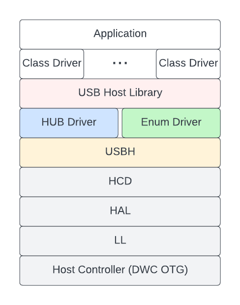

USB 主机维护者注意事项（简介）
==============================

:link_to_translation:`en:[English]`

本文档包含有关 USB 主机协议栈实现细节的信息，面向 USB 主机协议栈的维护者和第三方贡献者。USB 主机协议栈的用户请参考 :doc:`../usb_host`。

.. warning::

    USB 主机协议栈的实现细节属于私有 API，因此，除 USB 主机库外的所有层均不遵循 :ref:`ESP-IDF 版本简介 <versioning-scheme>`，即允许进行重大更改。

本文档分为以下几个部分：

.. toctree::
    :maxdepth: 1

    usb_host_notes_design
    usb_host_notes_arch
    usb_host_notes_dwc_otg
    usb_host_notes_usbh

待写章节：

- USB 主机维护者注意事项（HAL 和 LL）
- USB 主机维护者注意事项（HCD）
- USB 主机维护者注意事项（Hub）
- USB 主机维护者注意事项（USB Host Library）

.. -------------------------------------------------- Introduction -----------------------------------------------------

简介
----

ESP-IDF USB 主机协议栈允许 {IDF_TARGET_NAME} 作为 USB 主机运行，此时，{IDF_TARGET_NAME} 能够与各种 USB 设备通信。然而，大多数 USB 主机协议栈实现都不运行在嵌入式硬件上（即在电脑和手机端运行），因此，相对来说具有更多的资源（即，具有更高内存和 CPU 速度）。

ESP-IDF USB 主机协议栈（以下简称为主机协议栈）的实现考虑到了 {IDF_TARGET_NAME} 的嵌入式特性，这体现在主机协议栈设计的各个方面。

特性和局限性
^^^^^^^^^^^^

**主机协议栈目前支持以下显著特性：**

- 支持 FS（全速）和 LS（低速）设备
- 支持所有传输类型（控制传输、批量传输、同步传输和中断传输）
- 自动枚举已连接设备
- 允许多个类驱动程序（即 USB 主机库的客户端）同时运行并共享同一设备（即组合设备）

**主机协议栈目前存在以下显著局限：**

- 不支持 HS（高速）设备
- 不支持集线器（当前仅支持单个设备）
