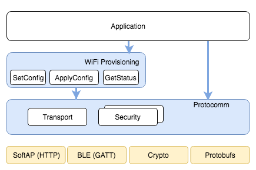

统一配网
^^^^^^^^^^^^^^^^^^^^

:link_to_translation:`en:[English]`

概述
>>>>>>>>

ESP-IDF 支持统一配网，提供可扩展的机制，支持开发者使用不同传输方式和安全方案配置设备的 Wi-Fi 凭证和其他自定义配置。ESP-IDF 为不同的使用场景提供完整可用的 Wi-Fi 配网解决方案，并附带 iOS 和 Android 示例应用程序。开发者可以扩展设备端和手机应用端实现，来满足发送额外自定义配置数据的需求。以下为该实现的重要功能：

1. **可扩展协议**

该协议高度灵活，支持开发者在配网过程中发送自定义配置，以及在应用程序中自定义数据格式。

2. **传输方式灵活**

该协议可以作为 Wi-Fi（SoftAP + HTTP 服务器）或低功耗蓝牙上的传输方式，并且可轻松应用于任何支持请求—响应行为的传输方式。

3. **安全方案灵活**

配网过程中，各使用场景可能需要不同安全方案来保护传输的数据。部分应用程序可能使用 WPA2 保护的 SoftAP 或具有“即插即用 (just-works)”安全方案的低功耗蓝牙。亦或者，应用程序可能认为传输不安全，需要应用层的安全方案。统一配网框架支持应用程序根据需要选择合适的安全方案。

4. **数据格式紧凑**

该协议使用 `Google Protobufs <https://developers.google.com/protocol-buffers/>`_ 作为会话设置和 Wi-Fi 配网的数据格式。该方案提供紧凑的数据格式，并可以使用不同编程语言进行数据解析。请注意，该配网的应用数据格式并不只局限于 Protobufs，开发者可以自行选择自己想用的数据格式。

配网过程示例
>>>>>>>>>>>>>>>>>>>>>>>>>>>>

.. seqdiag::
    :caption: 配网过程示例
    :align: center

    seqdiag typical-prov-process {
        activation = none;
        node_width = 80;
        node_height = 60;
        edge_length = 360;
        span_height = 5;
        default_shape = roundedbox;
        default_fontsize = 12;

        CLIENT  [label = "客户端"];
        DEVICE  [label = "设备"];

        === 1. 特定传输方式的发现和连接 ===
        DEVICE -> CLIENT [label="某种形式的信标广播"];
        CLIENT -> DEVICE [label="客户端连接"];
        === 2. 建立会话 ====
        CLIENT -> DEVICE [label="获取版本请求"];
        DEVICE -> CLIENT [label="获取版本响应"];
        CLIENT -> DEVICE [label="会话设置请求"];
        DEVICE -> CLIENT [label="会话设置响应"];
        CLIENT --> DEVICE;
        ... 不同协议包含的步骤可能不同 ...
        DEVICE --> CLIENT
        === 3. 配置 ===
        CLIENT --> DEVICE [label="特定应用程序的配置设置（可选）"];
        DEVICE --> CLIENT [label="配置设置响应（可选）"];
        CLIENT -> DEVICE [label="Wi-Fi 配置设置（SSID、密码等）"];
        DEVICE -> CLIENT [label="Wi-Fi 配置设置响应"];
        CLIENT -> DEVICE [label="Wi-Fi 配置应用命令"];
        DEVICE -> CLIENT [label="Wi-Fi 配置应用响应"];
        CLIENT -> DEVICE [label="Wi-Fi 获取状态命令（重复）"];
        DEVICE -> CLIENT [label="Wi-Fi 获取状态响应（重复）"];
        === 4. 关闭连接 ===
        DEVICE -> CLIENT [label="关闭连接"];
    }

选择传输方式
>>>>>>>>>>>>>>>>>>>>>

统一配网支持 Wi-Fi（SoftAP + HTTP 服务器）和低功耗蓝牙（基于 GATT）传输方式。要选择最佳传输方式，需要考虑以下几点：

1. 基于低功耗蓝牙的传输方式的优势在于，在配网过程中，设备和客户端之间的低功耗蓝牙通信通道稳定，可以提供可靠的配网反馈信息。
2. 基于低功耗蓝牙的配网实现可以提升手机应用的用户体验，因为在 Android 和 iOS 系统中，用户可以直接在手机应用内发现并连接设备。
3. 然而，低功耗蓝牙传输在运行时会占用约 110 KB 内存。如果产品在配网完成后不再使用低功耗蓝牙或经典蓝牙功能，几乎所有内存都可以回收并添加到堆中。
4. 基于 SoftAP 的传输方式兼容性很强，但以下两点需要关注：

    - 设备使用同一频段来托管  SoftAP 以及连接到配置的 AP。由于 AP 可能位于不同信道，可能导致手机无法可靠地接收到连接状态更新。

    - 手机（即客户端）必须先断开与当前 AP 的连接才能连接到 SoftAP。配网过程完成并且 SoftAP 关闭后，原始网络才会恢复。

5. 使用 SoftAP 传输方式时，不需要为 Wi-Fi 使用场景分配太多额外内存。
6. 在 iOS 系统中，如果使用基于 SoftAP 的配网，用户需要将手机切换到 ``系统设置`` 页面，手动连接 Wi-Fi 热点。由于 iOS 系统限制，iOS 应用程序中无法使用发现（即扫描）和连接 API。

选择安全方案
>>>>>>>>>>>>>>>>>>>>

应用程序开发者需要根据传输方式和其他限制选择相应安全方案。从配网安全角度，需要考虑以下因素：

1. 必须保护客户端发送的配置数据安全以及设备响应数据安全。
2. 客户端应该对连接的设备进行身份验证。
3. 设备制造商可以使用所有权证明 (proof-of-possession, PoP) 这一安全措施，即为每个设备配置一个独特的设备密钥。设备配网时需要输入该密钥，以确保只有设备的合法持有者可以对其进行配网。

有两种安全方案层级可供选择，开发者可以根据需求选择其中一种或结合使用。

1. **传输层安全**

对于 SoftAP 配网，可以使用 WPA2 保护的安全方案，则每个设备都会有唯一密码，且该密码也可以用作 PoP。对于低功耗蓝牙配网，在考量其支持的安全层级后，可以使用“即插即用”方案保护传输层的安全。

2. **应用程序层安全**

统一配网子系统支持应用层的安全方案（ `Security 1 方案`_），即通过 PoP 提供数据保护和身份验证。如果应用程序不使用传输层的安全方案，或者传输层的安全方案不满足使用场景的需求，可以使用该方案。

设备发现
>>>>>>>>>>>>>>>>

广播和设备发现由应用程序自行处理。根据所选协议，手机应用程序和设备固件应用程序可以选择适当的广播和发现方法。

对于 SoftAP + HTTP 传输方式，通常可以通过设备托管 AP 的 SSID（网络名称）发现。

对于低功耗蓝牙传输方式，可以使用设备名称或包含在广播中的主要服务 (Primary service) 进行发现，也可以将两者结合。

架构
>>>>>>>>>>>>

以下图表展示了统一配网的架构：

    统一配网架构

统一配网依赖名为 :doc:`protocomm` (protocomm) 的基础层，该层提供了安全方案和传输机制的框架。Wi-Fi 配网层使用 protocomm 提供简单的回调函数，供应用程序设置配置和获取 Wi-Fi 状态。应用程序可以控制这些回调的实现方式。此外，应用程序还可以直接使用 protocomm 来注册自定义处理程序。

应用程序会创建一个 protocomm 实例，该实例会映射到特定传输方式和安全方案。protocomm 中的每个传输方式都有“端点”概念，对应特定类型信息通信的逻辑通道。例如，进行安全握手的端点与 Wi-Fi 配置端点不同。每个端点都用字符串标识，具体取决于传输内部对端点变化的表示方式。对于 SoftAP + HTTP 传输方式，端点对应 URI；而对于低功耗蓝牙，端点对应具有特定 UUID 的 GATT 特征。开发者可以创建自定义端点，为同一端点接收或发送的数据实现处理程序。

.. _provisioning_security_schemes:

安全方案
>>>>>>>>>>>>>>>>

目前，统一配网支持以下安全方案：

1. Security 0

无安全功能（即无加密）。

2. Security 1

基于 Curve25519 的密钥交换、共享密钥派生和 AES256-CTR 模式的数据加密。该方案支持两种模式：

    a. 授权模式 - 使用 PoP 字符串授权会话以及派生共享密钥。

    b. 无授权模式（不启用 PoP）- 仅通过密钥交换派生共享密钥。

3. Security 2

基于 SRP6a 的共享密钥派生和 AES256-GCM 模式的数据加密。

.. note::

    要启用相应安全方案，需要设置项目配置菜单，更多详情请参考 :ref:`enabling-protocomm-security-version`。

Security 1 方案
>>>>>>>>>>>>>>>>>>>>

以下时序图展示了 Security 1 方案的详情：

.. seqdiag::
    :caption: Security 1
    :align: center

    seqdiag security1 {
        activation = none;
        node_width = 80;
        node_height = 60;
        edge_length = 480;
        span_height = 5;
        default_shape = roundedbox;
        default_fontsize = 12;

        CLIENT  [label = "客户端"];
        DEVICE  [label = "设备"];

        === Security 1 ===
        CLIENT -> CLIENT [label = "生成密钥对", rightnote = "{cli_privkey, cli_pubkey} = curve25519_keygen()"];
        CLIENT -> DEVICE [label = "SessionCmd0(cli_pubkey)"];
        DEVICE -> DEVICE [label = "生成密钥对", leftnote = "{dev_privkey, dev_pubkey} = curve25519_keygen()"];
        DEVICE -> DEVICE [label = "初始化向量", leftnote = "dev_rand = gen_16byte_random()"];
        DEVICE -> DEVICE [label = "共享密钥", leftnote = "shared_key(No PoP) = curve25519(dev_privkey, cli_pubkey) \nshared_key(with PoP) = curve25519(dev_privkey, cli_pubkey) ^ SHA256(pop)"];
        DEVICE -> CLIENT [label = "SessionResp0(dev_pubkey, dev_rand)"];
        CLIENT -> CLIENT [label = "共享密钥", rightnote = "shared_key(No PoP) = curve25519(cli_privkey, dev_pubkey)\nshared_key(with PoP) = curve25519(cli_privkey, dev_pubkey) ^ SHA256(pop)"];
        CLIENT -> CLIENT [label = "验证令牌", rightnote = "cli_verify = aes_ctr_enc(key=shared_key, data=dev_pubkey, nonce=dev_rand)"];
        CLIENT -> DEVICE [label = "SessionCmd1(cli_verify)"];
        DEVICE -> DEVICE [label = "验证客户端", leftnote = "check (dev_pubkey == aes_ctr_dec(cli_verify...)"];
        DEVICE -> DEVICE [label = "验证令牌", leftnote = "dev_verify = aes_ctr_enc(key=shared_key, data=cli_pubkey, nonce=(prev-context))"];
        DEVICE -> CLIENT [label = "SessionResp1(dev_verify)"];
        CLIENT -> CLIENT [label = "验证设备", rightnote = "check (cli_pubkey == aes_ctr_dec(dev_verify...)"];
    }

Security 2 方案
>>>>>>>>>>>>>>>>

Security 2 方案基于 Secure Remote Password (SRP6a) 协议，详情请参阅 `RFC 5054 <https://datatracker.ietf.org/doc/html/rfc5054>`_。

该协议要求预先使用标识用户名 ``I`` 和明文密码 ``p`` 生成盐值 (salt) 和验证器 (verifier)，然后将盐值和验证器存储在 {IDF_TARGET_NAME}。

- 应通过适当方式（例如二维码贴纸）将密码 ``p`` 和用户名 ``I`` 提供给手机应用程序（即配网实体）。

以下时序图展示了 Security 2 方案的详情：

.. seqdiag::
    :caption: Security 2
    :align: center

    seqdiag security2 {
        activation = none;
        node_width = 80;
        node_height = 60;
        edge_length = 550;
        span_height = 5;
        default_shape = roundedbox;
        default_fontsize = 12;

        CLIENT  [label = "客户端\n（手机应用）"];
        DEVICE  [label = "设备\n(ESP)"];

        === Security 2 ===
        CLIENT -> CLIENT [label = "生成密钥对", rightnote = "a (cli_privkey) = 256 位随机值,
        A (cli_pubkey) = g^a.
        g - 生成器，N - 大安全质数，
        所有计算操作都在模 N 的整数环中执行，
        因此所有类似 y^z 的数据应读为 y^z 对 N 取模的结果"];
                CLIENT -> DEVICE [label = "SessionCmd0(cli_pubkey A, username I)"];
                DEVICE -> DEVICE [label = "获取盐值和验证器", leftnote = "获取在 ESP 上存储的盐值和验证器
        盐值 s = 256 位随机值
        验证器 v = g^x，其中 x = H(s | I | p)"];
                DEVICE -> DEVICE [label = "生成密钥对", leftnote = "b (dev_privkey) = 256 位随机值
        B(dev_pubkey) = k*v + g^b，其中 k = H(N, g)"];
                DEVICE -> DEVICE [label = "共享密钥", leftnote = "共享密钥 K = H(S)，其中
        S = (A * v^u) ^ b
        u = H(A, B)"];
                DEVICE -> CLIENT [label = "SessionResp0(dev_pubkey B, dev_rand)"];
                CLIENT -> CLIENT [label = "共享密钥", rightnote = "shared_key(K) = H(S)，其中
        S = (B - k*v) ^ (a + ux),
        u = H(A, B),
        k = H(N, g),
        v = g^x,
        x = H(s | I | p).

        "];
                CLIENT -> CLIENT [label = "验证令牌", rightnote = "client_proof M =  H[H(N) XOR H(g) | H(I) | s | A | B | K]"];
                CLIENT -> DEVICE [label = "SessionCmd1(client_proof M1)"];
                DEVICE -> DEVICE [label = "验证客户端", leftnote = "设备生成 M1 =  H[H(N) XOR H(g) | H(I) | s | A | B | K]
        设备将该 M1 值与从客户端获得的 M1 进行验证"];
                DEVICE -> DEVICE [label = "验证令牌", leftnote = "
        设备生成 device_proof M2 = H(A, M, K)"];
                DEVICE -> DEVICE [label = "初始化向量", leftnote = "dev_rand = gen_16byte_random()
         该随机数通常用作 AES-GCM 操作，
        并使用共享密钥加密和解密数据"];
                DEVICE -> CLIENT [label = "SessionResp1(device_proof M2, dev_rand)"];
                CLIENT -> CLIENT [label = "验证设备", rightnote = "客户端计算设备证明 M2 = H(A, M, K)，
        客户端将该 M2 值与从设备获得的 M2 进行验证"];
    }

示例代码
>>>>>>>>>>>

关于 API 指南和示例用法的代码片段，请参阅 :doc:`protocomm` 和 :doc:`wifi_provisioning`。

关于应用程序的实现示例，请参阅 :example:`provisioning`。

配网工具
>>>>>>>>>>>>>>>>>>

以下为各平台的配网应用程序，包括源代码：

* Android:
    * `Play Store 上的低功耗蓝牙配网应用程序 <https://play.google.com/store/apps/details?id=com.espressif.provble>`_。
    * `Play Store 上的 SoftAP 配网应用程序 <https://play.google.com/store/apps/details?id=com.espressif.provsoftap>`_。
    * GitHub 上的源代码：`esp-idf-provisioning-android <https://github.com/espressif/esp-idf-provisioning-android>`_。
* iOS:
    * `App Store 上的低功耗蓝牙配网应用程序 <https://apps.apple.com/in/app/esp-ble-provisioning/id1473590141>`_。
    * `App Store 上的 SoftAP 配网应用程序 <https://apps.apple.com/in/app/esp-softap-provisioning/id1474040630>`_。
    * GitHub 上的源代码：`esp-idf-provisioning-ios <https://github.com/espressif/esp-idf-provisioning-ios>`_。
* Linux/macOS/Windows：基于 Python 的命令行工具 :idf:`tools/esp_prov`，可用于设备配网。

手机应用程序界面简洁，便于用户使用，而开发者可以使用命令行应用程序，便于调试。
