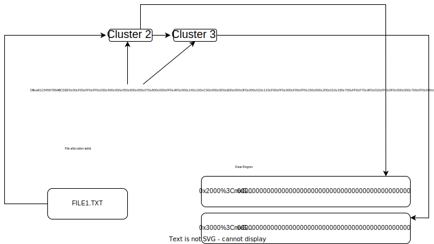
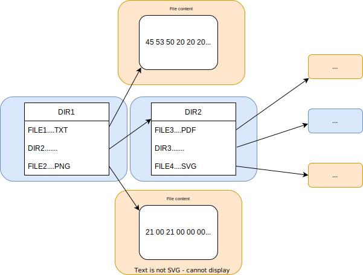

:orphan:

.. linked from fatfs.rst

在主机上生成和解析 FATFS
=====================================

:link_to_translation:`en:[English]`

本章主要面向 Python 工具 :component_file:`fatfsgen.py <fatfs/fatfsgen.py>` 和 :component_file:`fatfsparse.py <fatfs/fatfsparse.py>` 的开发人员、对这些工具感兴趣的用户、和对在 ESP-IDF 中实现 FAT 文件系统感兴趣的用户。如果你对这些工具感兴趣，请参考 :ref:`fatfs-partition-generator`。

FAT 文件系统由多个逻辑单元组成。这些单元用于存储有关文件系统、分配、文件内容、目录以及文件元数据的一般信息。 ``fatfsgen.py`` 和 ``fatfsparse.py`` 工具用于实现 FAT 文件系统，该工具会考虑上述所有逻辑单元，并且支持磨损均衡。

FAT 文件系统生成器及解析器的设计
----------------------------------------

本节介绍了 FAT 文件系统生成器和解析器设计的特定单元，设计这些单元是为了创建一个专注于宏操作的有效 FAT 结构模型，用于生成和解析整个分区，而无需在运行（挂载）过程中进行修改。

    FAT 文件系统生成器及解析器设计架构

FATFS 类
^^^^^^^^^^^^^

FATFS 类是建立 FAT 文件系统模型最常用的实体，由 **FATFSState** （保存元数据和引导扇区）、 **FAT** （保存文件分配表）和 **Directory** （表示 FAT12 和 FAT16 所需的根目录）组成。该类可以处理分区的所有要求，分析用于将其转换为二进制映像的本地文件夹，并生成本地文件夹的内部表示。然后，该类就能从内部 FAT 文件系统模型中生成二进制映像。

WLFATFS 类
^^^^^^^^^^^^^

WLFATFS 类扩展了 **FATFS** 类的功能，可在磨损均衡中添加虚拟扇区（用于平衡负载的冗余扇区，参见 :ref:`fafsgen-wear-levelling`）、配置扇区和状态扇区，从而对文件系统进行封装。WLFATFS 类还能生成带有初始化的磨损均衡层的二进制 FATFS 分区，并提供了完全删除磨损均衡的选项，用于进一步分析。该类可由 ``wl_fatfsgen.py`` 脚本进行实例化并调用。

BootSectorState 类
^^^^^^^^^^^^^^^^^^^^^

**BootSectorState** 实例包含了构建引导扇区和 BPB（BIOS 参数块）所需的元数据。构件引导扇区主要是为了实现跨平台兼容，即当 ESP 芯片组连接到其他平台时，会始终遵守所有的 FAT 文件系统标准。但是，在分区生成期间，芯片并不消耗此引导扇区的数据和其他所需数据，因为这些数据是不变的常量。换句话说，一般无需更改前缀为 "BS" 的字段，且更改通常没有作用。如需添加新功能，应关注前缀为 "BPB" 的字段。 **BootSectorState** 类还有一个重要作用，即在整个类系统中共享对元数据和二进制镜像的访问。因此，系统中的每个类都可以访问这一单例。

FATFSState 类
^^^^^^^^^^^^^^^^

**FATFSState** 类未来可能会被弃用，开发人员可以将其功能转移到 **BootSectorState** 中。该类包含对 **BootSectorState** 的引用，并且在创建引导扇区时，会用一些未知或不必要的信息（例如在文件系统支持长文件名时生成的信息）扩展引导扇区数据。

FAT 类
^^^^^^^^^

**FAT** (File Allocation Table) 代表文件分配表，是分布在一个或多个扇区上的字节序列。扇区数由簇数决定，并由 ``utils.py`` 中的函数 ``get_fat_sectors_count`` 计算得出，因为在引用文件系统中的物理簇时，每个 FAT 的扇区数应越少越好。FAT 的工作方式如下：对于每个位于 ``i * some_constant`` 地址的物理簇，FAT 在第 ``i`` 个位置有一个条目，表示文件链中下一个簇的地址。每个 FAT 文件系统版本使用的 FAT 条目大小不同。FAT12 每个条目大小为 12 位，因此每 2 个条目占据 3 个字节。FAT16 的每个条目为 16 位，因此每 1 个条目占据 2 个字节。FAT32 的 每个 FAT 条目为 32 位，因此每 1 个条目占据 4 个字节。所有条目都按小字节顺序排列。

第 ``i`` 个条目处的所有 0 表示相应的簇为空闲状态，第 ``i`` 个条目处的所有 1 表示相应簇已占用，并且是文件链中的最后一个簇。 第 ``i`` 个条目处的其他数字表示下一个簇在文件链中的地址。这些簇并不一定存储在内存中的相邻位置，而通常会分散在整个数据区域中。

在生成分区时，文件会被分为几个部分以适应簇的大小。注意，文件的结构分配是一个链表。文件分配链中的每个簇在 FAT 中都有一个条目指向下一个簇，或文件链中最后一个簇的信息。如前所述，FAT12 的每个 FAT 条目有 12 位，因此最多可以枚举 4096 个簇，因为在 12 位（一个半字节）条件下最多可以列出 4096 个簇。但实际上由于其他开销，FAT12 最多可以有 4085 个簇。同样，FAT16 最多可以有 65525 个簇，而 FAT32 最多可以有 268435445 个簇，因为实际上每个条目只用了 32 位中的 28 位。即便文档中声称可行，但实际上目前的实现方式不允许将簇数少于 4085 的 FAT 文件系统强制重新定义为 FAT16。反之亦然，将具有 4085 个以上簇的 FAT 文件系统强制重新定义为 FAT12 也是没有意义的，否则将无法访问某些地址超出范围的簇。

Cluster 类
^^^^^^^^^^^^^^^

**Cluster** 类用于访问 FAT 条目和相应的物理簇。 **FAT** 类是特定数量 **Cluster** 实例的集合。每个簇具有一个唯一 ID，用于确定其在 FAT 中的位置和在数据区中的相应扇区。分配簇时，分配链中的第一个簇会指向一个文件或目录。每个簇中包含该簇是否为空的信息，以及该簇是否为文件分配链中的最后一个簇。如果不是最后一个簇，则指向链表中下一个簇。在实际应用中，簇不需要访问其中的文件，而是反过来由 **文件** 或 **目录** 访问对应的簇，以检索链上可能的全部内容。

Directory 类
^^^^^^^^^^^^^^^

**Directory** 类表示文件系统目录。 **Directory** 的实例包含对相应 **Cluster** 实例的引用，该实例中有给定目录的分配链中的第一个簇。根目录较为特殊，其扇区数量不同，实例化过程也有所不同。不过，根目录仍然是此类的实例，也是分别与 **FATFS** 类和 **WLFATFS** 类相关联的唯一 **Directory** 实例。 **Directory** 类（除根目录外）与在父目录中定义其条目的 **Entry** 类一对一的关联。此外，由于每个目录都包含由实际目录内容组成（如别名、文件和目录）的多个条目，因此，它还有一个与 **Entry** 类关联的聚合。

File 类
^^^^^^^^^^

与 **Directory** 类似， **File** 代表文件系统中的单个文件。此类与其分配链中的第一个簇一对一关联。通过这个簇， **File** 类可以访问相应的物理地址，从而修改其内容。每个文件还与属于其父目录的 **Entry** 实例具有一对一关联。

Entry 类
^^^^^^^^^^^

**Entry** 类封装了在相应父目录数据区中的文件名或目录名信息。每个文件系统实体（文件/目录）都有一个条目。如果使用符号进行连接，可以让实体具有多个条目。目录使用条目来访问其后代文件和子目录，并实现对树状结构的遍历。此外， **Entry** 还保存了所用文件名（长文件名或 8.3 文件名）相关的名称、扩展名、大小等信息。

``fatfsgen.py``
---------------

组件 :component_file:`fatfsgen.py <fatfs/fatfsgen.py>` 在主机上生成 FAT 文件系统。

``fatfsgen.py`` 递归式地遍历给定文件夹的目录结构，将文件和（或）目录添加到二进制分区中。用户可以设置脚本生成的分区是否支持磨损均衡和长文件名，以及是否保留原始文件夹在主机上的修改日期和时间。

``./fatfsgen.py Espressif`` 命令默认生成一个简单的二进制分区。这里 ``Espressif`` 是生成二进制映像的本地文件夹（包含文件和/或子目录）。

:component_file:`fatfsgen.py <fatfs/fatfsgen.py>` 和 :component_file:`wl_fatfsgen.py <fatfs/wl_fatfsgen.py>` 脚本都可以用于此目的，二者的区别在于， ``wl_fatfsgen.py`` 首先用 ``fatfsgen.py`` 生成分区，然后再初始化磨损均衡。

脚本命令行参数如下::

    fatfsgen.py [-h] [--output_file OUTPUT_FILE] [--partition_size PARTITION_SIZE] [--sector_size {4096}] [--long_name_support] [--use_default_datetime] input_directory

    --output_file：生成的二进制分区的路径
    --partition_size：定义二进制分区大小（十进制、十六进制或二进制）
    --sector_size：扇区大小
    --long_name_support：flag，表示支持长文件名
    --use_default_datetime：flag，强制使用默认的日期和时间 (date == 0x2100, time == 0x0000)，不使用参数保留原始文件系统元数据
    input_directory：必填参数，编码到二进制分区 fat-compatibile 的目录名称

``fatfsparse.py``
-----------------

:component_file:`fatfsparse.py <fatfs/fatfsparse.py>` 将二进制映像转换成内部表示，并在主机上生成具有等效内容的文件夹。如果要求解析分区具有初始化磨损均衡， ``fatfsparse.py`` 会使用 ``wl_fatfsgen.py`` 提供的 ``remove_wl`` 函数删除磨损均衡扇区。删除扇区后，对分区的解析和没有初始磨损均衡的情况相同。

``./fatfsparse.py fatfs_image.img`` 命令会生成与二进制数据映像 ``fatfs_image.img`` 具有等效内容的目录。

脚本命令行参数如下::

    fatfsparse.py [-h] [--wl-layer {detect,enabled,disabled}] input_image

    --wl-layer：表示是否启用、禁用或应检测磨损均衡（模糊检测）
    input_image：二进制映像的路径

长文件名可以自动检测，但无法 100\% 检测出磨损均衡，因为根据用户的上下文，一个分区在有或没有磨损均衡的情况下都是有效的。脚本找到磨损均衡扇区（cfg 和 state）时，会假设磨损均衡已启用，但实际不一定启用。

支持功能
------------

FAT12/FAT16
^^^^^^^^^^^^

支持 FAT12 和 FAT16。对于较小的分区，使用 FAT12 即可。具体选择根据检测簇数决定，用户无法进行更改。如果分区簇数小于 4085，会选择 FAT12（FAT 的条目为 12 位）。如果分区簇数在 4085 到 65526 之间（不包括 4085 和 65526），会选择 FAT16。目前 ``fatfsgen.py`` 或 ``fatfsparse.py`` 不能处理簇数超过 65525 的文件系统。

.. _fafsgen-wear-levelling:

磨损均衡
^^^^^^^^^^^^^^
与磨损均衡层相关的操作有两个，即初始化磨损均衡记录，和在生成及解析 FAT 文件系统映像时删除磨损均衡记录。

1. 初始化磨损均衡

生成支持磨损均衡的新映像时，脚本会初始化磨损均衡功能所需的几个额外扇区。

    - 虚拟扇区：位于分区起始位置的空扇区，文件系统挂载时会被忽略。虚拟扇区复制下一个扇区的内容，在特定数量的擦除周期后，与下一个扇区交换位置（如果虚拟扇区已是最后一个扇区，则与第一个扇区交换位置）。这样，每个 FAT 文件系统扇区会遍历整个 flash 分区，而与此扇区对应的擦除周期也会分布在整个 flash 上。

    - 状态扇区：状态扇区存储了 64 字节的数据。
        - pos：虚拟扇区的位置
        - max_pos：分区中的扇区数（不包括配置扇区和状态扇区）
        - move_count：表示虚拟扇区遍历整个 flash 的次数
        - access_count：虚拟扇区交换位置前的扇区擦除周期数
        - max_count：等于 wl_config_t::updaterate
        - block_size：等于 wl_config_t::page_size
        - version：等于 wl_config_t::version
        - device_id：在状态扇区次初始化时随机生成
        - reserved：7 x 32 位，设置为 0
        - crc32：前面所有字段的 crc32，包括保留字段

      此外，状态扇区会对每个 ``pos`` 值增加 16 字节的 ``pos update record``。该记录会帮助确定虚拟扇区的位置。

      由于状态扇区的 ``erase + write`` 不是原子操作，在 “erase” 和 “write” 之间断电可能会导致数据丢失。不过状态扇区保留了两份副本，可以在断电后帮助复原。每次更新时两份副本都会更新，因此，断电后可以恢复原来的有效状态扇区。

    - 配置扇区：此扇区包含磨损均衡层使用的分区信息。
        - start_addr：分区的起始地址（始终为 0）
        - full_mem_size：分区大小，包括数据、虚拟、状态 x 2 和配置扇区，单位为字节
        - page_size：等于扇区大小（通常为 4096）
        - sector_size：对于 ESP-IDF 支持的 NOR flash 类型，始终为 4096
        - updaterate：ESP-IDF 始终将此值设置为 16。需要时可将其用作配置选项
        - wr_size：始终设置为 16
        - version：当前版本为 2
        - temp_buff_size：始终设置为 32（实际不应该存储在 flash 中）
        - crc：之前所有值的 crc32

2. 删除磨损均衡
删除磨损均衡记录时，须找到虚拟扇区的位置以及分区的原始有效顺序（因为遍历虚拟扇区会打乱分区）。脚本可以从分区中删除其他磨损均衡扇区。删除磨损均衡记录的步骤如下：

    - 找到虚拟扇区位置 ``pos``。该位置由状态扇区中 ``pos update records`` 的数量决定。
    - 删除虚拟扇区并合并虚拟扇区前后的剩余扇区，从而创建新映像。
    - 删除分区末尾的磨损均衡状态扇区和配置扇区。
    - 对新映像重新排序以获得其原始顺序。 ``move_count`` 可以找到分区的起点。分区会从 ``end_of_partition - move_count`` 位置开始，因此删除磨损均衡扇区后，分区的起始位置是 ``partition[end_of_partition - (move_count*page_size)]``。

文件名编码
^^^^^^^^^^^^^^^^^^^

FAT 协议支持两种类型的文件名。

短文件名 (SFN)
^^^^^^^^^^^^^^^^^^^^^^

文件名必须遵循 SFN 规范。SFN 指 8.3 文件名规范，即文件名为 8 个字符，扩展名为 3 个字符。这种模式不区分大小写，但在生成器的内部表示中，所有文件名都会改为大写。描述短文件名的条目长 32 字节，其结构如下::

    Offset:   00 01 02 03 04 05 06 07 08 09 0A 0B 0C 0D 0E 0F
    0x000000: 46 49 4C 45 4E 41 4D 45 45 58 54 20 18 00 00 00    FILENAMEEXT.....
    0x000010: 21 00 21 00 00 00 00 00 21 00 02 00 1E 00 00 00    !.!.....!.......

该条目表示当前文件名遵循 8.3 文件名规范 ("FILENAME.EXT") __(0x00/00-0A)__，文件名大小为 0x1E = 30 字节 __(0x10/0x0C)__，默认修改和创建时间为 (0x0021) __(0x10/00，02 和 08)__。文件相关的簇位于 __0x02 (0x10/0A)__。注意，每个字符用 1 个字节编码（例如，__0x46 == 'F'__）。

长文件名 (LFN)
^^^^^^^^^^^^^^^^^^^^^

长文件名 LFN 支持 255 个字符，不包括末尾的 ``NULL``。LFN 支持短文件名中的任何字符，以及句点 ``.`` 和特殊字符 ``+ , ; = [ ]``。LFN 使用 UNICODE，因此每个字符用 2 个字节编码。

使用 LFN 编码的文件名称结构如下::

    00003000: 42 65 00 2E 00 74 00 78 00 74 00 0F 00 43 FF FF    Be...t.x.t...C..
    00003010: FF FF FF FF FF FF FF FF FF FF 00 00 FF FF FF FF    ................
    00003020: 01 74 00 68 00 69 00 73 00 69 00 0F 00 43 73 00    .t.h.i.s.i...Cs.
    00003030: 6C 00 6F 00 6E 00 67 00 66 00 00 00 69 00 6C 00    l.o.n.g.f...i.l.
    00003040: 54 48 49 53 49 53 7E 31 54 58 54 20 00 00 D6 45    THISIS~1TXT...VE
    00003050: 26 55 26 55 00 00 D6 45 26 55 02 00 1C 00 00 00    &U&U..VE&U......

上述示例展示了文件名 ``thisislongfile.txt`` 的编码。该记录由多个条目组成，第一个条目包含元数据，相当于 SFN 条目。如果文件名符合 8.3 文件名规范，该条目可能就是最后的条目，使用 SFN 文件名编码结构。否则，生成器会在 SFN 条目上方添加具有上述 LFN 结构的多个条目，其中包含有关文件名及其一致性校验和的信息。每个 LFN 可以容纳 13 个字符（26 字节）。文件名首先会被切分成一定数量的 13 个字符的子串，这些子串会被添加到 SFN 条目上方。

LFN 条目以逆序添加，因此，目录中的第一个条目是文件名的最后一部分，即 SFN 条目。在上述示例中，第一个条目包含文本 ``e.txt``，而另外的条目包含文件名开头部分 ``thisislongfil``。LFN 条目的第一个字节表示顺序或序列号（从 1 开始编号）。要确定 LFN 的第一个条目，第一个字节会被掩码为 0x40 (``first_byte =| 0x40``)。最后一个条目的值会与 0x40 进行 OR 运算，作为最后一个条目的标记。例如，当记录是 LFN 条目中的第二条也是最后一条时，其第一个字节是 ``0x42``。

LFN 条目在 **DIR_Attr** 字段的值为 ``ATTR_READ_ONLY | ATTR_HIDDEN | ATTR_SYSTEM | ATTR_VOLUME_ID`` （参见文件 ``long_filename_utils.py`` ）。SFN 条目在此字段中包含 ``ATTR_DIRECTORY`` 或 ``ATTR_ARCHIVE`` （LFN 中可能也包含这两个值），分别表示目录或文件。

LFN 条目在 **DIR_NTRes** 字段上标记为 ``0x00``。这是 SFN 条目在 LFN 记录中的标志，如果条目是一个完整 SFN 记录，值为 ``0x18``。在第一个示例中，该字段中此值为 ``0x18``，因为名称 **"FILENAME.EXT"** 同样符合 SFN 规范。然而，上一个示例 **"thisislongfile.txt"** 在最后一个条目的 **DIR_NTRes** 字段中值为 ``0x00``，这是因为它仅符合 LFN 规范。SFN 须唯一。为此， ``fatfsgen.py`` 使用文件名的前 6 个字符，将其与 ``~`` 和一个 ID 相连接。这一 ID 表示该文件名在相同前缀的文件名中的顺序，范围 在 0 到 127 之间，127 是具有相同前缀的文件的最大数量。

校验和的计算在 ``utils.py`` 中由函数 ``lfn_checksum`` 描述并实现。 ``fatfsparse.py`` 假设 LFN 条目可能不会紧挨彼此，但保留了彼此的相对顺序。这一脚本首先用 **DIR_NTRes** 字段找到属于某个 LFN 记录的 SFN，然后开始在相应扇区自下而上进行搜索，直至找到 LFN 记录中的最后一个条目（前半字节等于 4 的条目）。脚本通过校验和来区分条目。这一过程结束后，即可组成文件名。

FAT 文件系统中的日期和时间
^^^^^^^^^^^^^^^^^^^^^^^^^^^^^^^^^^^

ESP-IDF 使用的 FAT 文件系统协议不保留芯片介质上的日期或时间，因此，从设备中提取的所有映像都具有相同的默认时间戳，这个时间戳会应用到所有 FAT 相关的日期和时间字段上，包括创建、最后修改时间戳，以及创建、最后修改和最后访问日期。

SFN 条目中有几个描述时间的字段，如 **DIR_CrtTime** 和 **DIR_WrtTime**。ESP-IDF 的 FAT 实现过程会忽略一些字段（参见文件 ``entry.py``），然而 **DIR_WrtTime** 和 **DIR_WrtDate** 字段的更改会保留在芯片中。时间和数据条目都是 16 位的，其中时间粒度为 2 秒。
