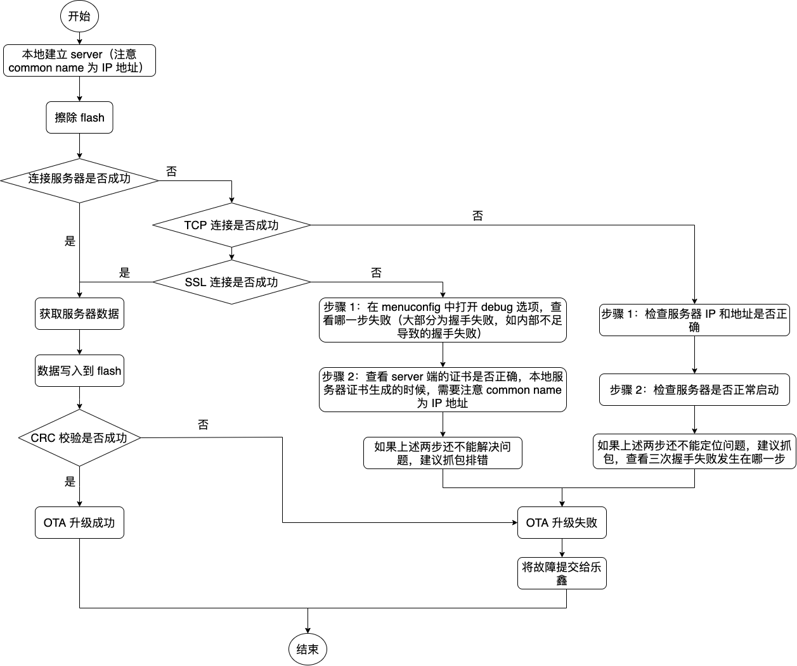

空中升级 (OTA)
==============

:link_to_translation:`en:[English]`

OTA 流程概览
------------

OTA 升级机制可以让设备在固件正常运行时根据接收数据（如通过 Wi-Fi、蓝牙或以太网）进行自我更新。

要运行 OTA 机制，需配置设备的 :doc:`../../api-guides/partition-tables`，该分区表至少包括两个 OTA 应用程序分区（即 ``ota_0`` 和 ``ota_1``）和一个 OTA 数据分区。

OTA 功能启动后，向当前未用于启动的 OTA 应用分区写入新的应用固件镜像。镜像验证后，OTA 数据分区更新，指定在下一次启动时使用该镜像。

.. _ota_data_partition:

OTA 数据分区
------------

所有使用 OTA 功能项目，其 :doc:`../../api-guides/partition-tables` 必须包含一个 OTA 数据分区（类型为 ``data``，子类型为 ``ota``）。

工厂启动设置下，OTA 数据分区中应没有数据（所有字节擦写成 0xFF）。如果分区表中有工厂应用程序，ESP-IDF 软件引导加载程序会启动工厂应用程序。如果分区表中没有工厂应用程序，则启动第一个可用的 OTA 分区（通常是 ``ota_0``）。

第一次 OTA 升级后，OTA 数据分区更新，指定下一次启动哪个 OTA 应用程序分区。

OTA 数据分区的容量是 2 个 flash 扇区的大小（0x2000 字节），防止写入时电源故障引发问题。两个扇区单独擦除、写入匹配数据，若存在不一致，则用计数器字段判定哪个扇区为最新数据。

.. _app_rollback:

应用程序回滚
------------

应用程序回滚的主要目的是确保设备在更新后正常工作。如果新版应用程序出现严重错误，该功能可使设备回滚到之前正常运行的应用版本。在使能回滚并且 OTA 升级应用程序至新版本后，可能出现的结果如下：

* 应用程序运行正常，:cpp:func:`esp_ota_mark_app_valid_cancel_rollback` 将正在运行的应用程序状态标记为 ``ESP_OTA_IMG_VALID``，启动此应用程序无限制。
* 应用程序出现严重错误，无法继续工作，必须回滚到此前的版本，:cpp:func:`esp_ota_mark_app_invalid_rollback_and_reboot` 将正在运行的版本标记为 ``ESP_OTA_IMG_INVALID`` 然后复位。引导加载程序不会选取此版本，而是启动此前正常运行的版本。
* 如果 :ref:`CONFIG_BOOTLOADER_APP_ROLLBACK_ENABLE` 使能，则无需调用函数便可复位，回滚至之前的应用版本。

可使用以下代码检测 OTA 更新后应用程序的首次启动。首次启动时，应用程序会检查其状态并执行检测。如果检测成功，应用程序调用 :cpp:func:`esp_ota_mark_app_valid_cancel_rollback` 函数，确认应用运行成功。如果检测失败，应用程序调用 :cpp:func:`esp_ota_mark_app_invalid_rollback_and_reboot` 函数，回滚至之前的应用版本。

如果应用程序由于中止、重启或掉电无法启动或运行上述代码，引导加载程序在下一次启动尝试中会将该应用程序的状态标记为 ``ESP_OTA_IMG_INVALID``，并回滚至之前的应用版本。

.. code:: c

    const esp_partition_t *running = esp_ota_get_running_partition();
    esp_ota_img_states_t ota_state;
    if (esp_ota_get_state_partition(running, &ota_state) == ESP_OK) {
        if (ota_state == ESP_OTA_IMG_PENDING_VERIFY) {
            // run diagnostic function ...
            bool diagnostic_is_ok = diagnostic();
            if (diagnostic_is_ok) {
                ESP_LOGI(TAG, "Diagnostics completed successfully! Continuing execution ...");
                esp_ota_mark_app_valid_cancel_rollback();
            } else {
                ESP_LOGE(TAG, "Diagnostics failed! Start rollback to the previous version ...");
                esp_ota_mark_app_invalid_rollback_and_reboot();
            }
        }
    }

请查看 :example:`system/ota/native_ota_example` 获取包含上述代码片段的完整示例。

.. note::

  应用程序的状态不是写到程序的二进制镜像，而是写到 ``otadata`` 分区。该分区有一个 ``ota_seq`` 计数器，该计数器是 OTA 应用分区的指针，指向下次启动时选取应用所在的分区 (ota_0, ota_1, ...)。

应用程序 OTA 状态
^^^^^^^^^^^^^^^^^

状态控制了选取启动应用程序的过程：

=============================  ========================================================
状态                            引导加载程序选取启动应用程序的限制
=============================  ========================================================
 ESP_OTA_IMG_VALID             没有限制，可以选取。
 ESP_OTA_IMG_UNDEFINED         没有限制，可以选取。
 ESP_OTA_IMG_INVALID           不会选取。
 ESP_OTA_IMG_ABORTED           不会选取。
 ESP_OTA_IMG_NEW               如使能 :ref:`CONFIG_BOOTLOADER_APP_ROLLBACK_ENABLE`，
                               则仅会选取一次。在引导加载程序中，状态立即变为
                               ``ESP_OTA_IMG_PENDING_VERIFY``。
 ESP_OTA_IMG_PENDING_VERIFY    如使能 :ref:`CONFIG_BOOTLOADER_APP_ROLLBACK_ENABLE`，
                               则不会选取，状态变为 ``ESP_OTA_IMG_ABORTED``。
=============================  ========================================================

如果 :ref:`CONFIG_BOOTLOADER_APP_ROLLBACK_ENABLE` 没有使能（默认情况），则 :cpp:func:`esp_ota_mark_app_valid_cancel_rollback` 和 :cpp:func:`esp_ota_mark_app_invalid_rollback_and_reboot` 为可选功能，``ESP_OTA_IMG_NEW`` 和 ``ESP_OTA_IMG_PENDING_VERIFY`` 不会使用。

Kconfig 中的 :ref:`CONFIG_BOOTLOADER_APP_ROLLBACK_ENABLE` 可以帮助用户追踪新版应用程序的第一次启动。应用程序需调用 :cpp:func:`esp_ota_mark_app_valid_cancel_rollback` 函数确认可以运行，否则将会在重启时回滚至旧版本。该功能可让用户在启动阶段控制应用程序的可操作性。新版应用程序仅有一次机会尝试是否能成功启动。

.. _ota_rollback:

回滚过程
^^^^^^^^

:ref:`CONFIG_BOOTLOADER_APP_ROLLBACK_ENABLE` 使能时，回滚过程如下：

* 新版应用程序下载成功，:cpp:func:`esp_ota_set_boot_partition` 函数将分区设为可启动，状态设为 ``ESP_OTA_IMG_NEW``。该状态表示应用程序为新版本，第一次启动需要监测。
* 重新启动 :cpp:func:`esp_restart`。
* 引导加载程序检查 ``ESP_OTA_IMG_PENDING_VERIFY`` 状态，如有设置，则将其写入 ``ESP_OTA_IMG_ABORTED``。
* 引导加载程序选取一个新版应用程序来引导，这样应用程序状态就不会设置为 ``ESP_OTA_IMG_INVALID`` 或 ``ESP_OTA_IMG_ABORTED``。
* 引导加载程序检查所选取的新版应用程序，若状态设置为 ``ESP_OTA_IMG_NEW``，则写入 ``ESP_OTA_IMG_PENDING_VERIFY``。该状态表示，需确认应用程序的可操作性，如不确认，发生重启，则状态会重写为 ``ESP_OTA_IMG_ABORTED`` （见上文），该应用程序不可再启动，将回滚至上一版本。
* 新版应用程序启动，应进行自测。
* 若通过自测，则必须调用函数 :cpp:func:`esp_ota_mark_app_valid_cancel_rollback`，因为新版应用程序在等待确认其可操作性（ ``ESP_OTA_IMG_PENDING_VERIFY`` 状态）。
* 若未通过自测，则调用函数 :cpp:func:`esp_ota_mark_app_invalid_rollback_and_reboot`，回滚至之前能正常工作的应用程序版本，同时将无效的新版本应用程序设置为 ``ESP_OTA_IMG_INVALID``。
* 如果新版应用程序可操作性没有确认，则状态一直为 ``ESP_OTA_IMG_PENDING_VERIFY``。下一次启动时，状态变更为 ``ESP_OTA_IMG_ABORTED``，阻止其再次启动，之后回滚到之前的版本。

意外复位
^^^^^^^^

如果在新版应用第一次启动时发生断电或意外崩溃，则会回滚至之前正常运行的版本。

建议：尽快完成自测，防止因断电回滚。

只有 ``OTA`` 分区可以回滚。工厂分区不会回滚。

启动无效/中止的应用程序
^^^^^^^^^^^^^^^^^^^^^^^

用户可以启动此前设置为 ``ESP_OTA_IMG_INVALID`` 或 ``ESP_OTA_IMG_ABORTED`` 的应用程序：

* 获取最后一个无效应用分区 :cpp:func:`esp_ota_get_last_invalid_partition`。
* 将获取的分区传递给 :cpp:func:`esp_ota_set_boot_partition`，更新 ``otadata``。
* 重启 :cpp:func:`esp_restart`。引导加载程序会启动指定应用程序。

要确定是否在应用程序启动时进行自测，可以调用 :cpp:func:`esp_ota_get_state_partition` 函数。如果结果为 ``ESP_OTA_IMG_PENDING_VERIFY``，则需要自测，后续确认应用程序的可操作性。

如何设置状态
^^^^^^^^^^^^

下文简单描述了如何设置应用程序状态：

* ``ESP_OTA_IMG_VALID`` 由函数 :cpp:func:`esp_ota_mark_app_valid_cancel_rollback` 设置。
* 如果 :ref:`CONFIG_BOOTLOADER_APP_ROLLBACK_ENABLE` 没有使能，``ESP_OTA_IMG_UNDEFINED`` 由函数 :cpp:func:`esp_ota_set_boot_partition` 设置。
* 如果 :ref:`CONFIG_BOOTLOADER_APP_ROLLBACK_ENABLE` 使能，``ESP_OTA_IMG_NEW`` 由函数 :cpp:func:`esp_ota_set_boot_partition` 设置。
* ``ESP_OTA_IMG_INVALID`` 由函数 :cpp:func:`esp_ota_mark_app_invalid_rollback_and_reboot` 设置。
* 如果应用程序的可操作性无法确认，发生重启（:ref:`CONFIG_BOOTLOADER_APP_ROLLBACK_ENABLE` 使能），则设置 ``ESP_OTA_IMG_ABORTED``。
* 如果 :ref:`CONFIG_BOOTLOADER_APP_ROLLBACK_ENABLE` 使能，选取的应用程序状态为 ``ESP_OTA_IMG_NEW``，则在引导加载程序中设置 ``ESP_OTA_IMG_PENDING_VERIFY``。

.. _anti-rollback:

防回滚
------

防回滚机制可以防止回滚到安全版本号低于芯片 eFuse 中烧录程序的应用程序版本。

设置 :ref:`CONFIG_BOOTLOADER_APP_ANTI_ROLLBACK`，启动防回滚机制。在引导加载程序中选取可启动的应用程序，会额外检查芯片和应用程序镜像的安全版本号。可启动固件中的应用安全版本号必须等于或高于芯片中的应用安全版本号。

:ref:`CONFIG_BOOTLOADER_APP_ANTI_ROLLBACK` 和 :ref:`CONFIG_BOOTLOADER_APP_ROLLBACK_ENABLE` 一起使用。此时，只有安全版本号等于或高于芯片中的应用安全版本号时才会回滚。

典型的防回滚机制
^^^^^^^^^^^^^^^^^^^^^^^^^^^^^^^^^

- 新发布的固件解决了此前版本的安全问题。
- 开发者在确保固件可以运行之后，增加安全版本号，发布固件。
- 下载新版应用程序。
- 运行函数 :cpp:func:`esp_ota_set_boot_partition`，将新版应用程序设为可启动。如果新版应用程序的安全版本号低于芯片中的应用安全版本号，新版应用程序会被擦除，无法更新到新固件。
- 重新启动。
- 在引导加载程序中选取安全版本号等于或高于芯片中应用安全版本号的应用程序。如果 otadata 处于初始阶段，通过串行通道加载了安全版本号高于芯片中应用安全版本号的固件，则引导加载程序中 eFuse 的安全版本号会立即更新。
- 新版应用程序启动，之后进行可操作性检测，如果通过检测，则调用函数 :cpp:func:`esp_ota_mark_app_valid_cancel_rollback`，将应用程序标记为 ``ESP_OTA_IMG_VALID``，更新芯片中应用程序的安全版本号。注意，如果调用函数 :cpp:func:`esp_ota_mark_app_invalid_rollback_and_reboot`，可能会因为设备中没有可启动的应用程序而回滚失败，返回 ``ESP_ERR_OTA_ROLLBACK_FAILED`` 错误，应用程序状态一直为 ``ESP_OTA_IMG_PENDING_VERIFY``。
- 如果运行的应用程序处于 ``ESP_OTA_IMG_VALID`` 状态，则可再次更新。

建议：

如果想避免因服务器应用程序的安全版本号低于运行的应用程序，造成不必要的下载和擦除，必须从镜像的第一个包中获取 ``new_app_info.secure_version``，和 eFuse 的安全版本号比较。如果 ``esp_efuse_check_secure_version(new_app_info.secure_version)`` 函数为真，则下载继续，反之则中断。

.. code-block:: c

    ....
    bool image_header_was_checked = false;
    while (1) {
        int data_read = esp_http_client_read(client, ota_write_data, BUFFSIZE);
        ...
        if (data_read > 0) {
            if (image_header_was_checked == false) {
                esp_app_desc_t new_app_info;
                if (data_read > sizeof(esp_image_header_t) + sizeof(esp_image_segment_header_t) + sizeof(esp_app_desc_t)) {
                    // check current version with downloading
                    if (esp_efuse_check_secure_version(new_app_info.secure_version) == false) {
                      ESP_LOGE(TAG, "This a new app can not be downloaded due to a secure version is lower than stored in efuse.");
                      http_cleanup(client);
                      task_fatal_error();
                    }

                    image_header_was_checked = true;

                    esp_ota_begin(update_partition, OTA_SIZE_UNKNOWN, &update_handle);
                }
            }
            esp_ota_write( update_handle, (const void *)ota_write_data, data_read);
        }
    }
    ...

限制：

.. list::

    :esp32: - ``secure_version`` 字段最多有 32 位。也就是说，防回滚最多可以做 32 次。用户可以使用 :ref:`CONFIG_BOOTLOADER_APP_SEC_VER_SIZE_EFUSE_FIELD` 减少该 eFuse 字段的长度。
    :not esp32: - ``secure_version`` 字段最多有 16 位。也就是说，防回滚最多可以做 16 次。用户可以使用 :ref:`CONFIG_BOOTLOADER_APP_SEC_VER_SIZE_EFUSE_FIELD` 减少该 eFuse 字段的长度。
    :esp32: - 防回滚仅在 eFuse 编码机制设置为 ``NONE`` 时生效。
    - 防回滚不支持工厂和测试分区，因此分区表中不应有设置为 ``工厂`` 或 ``测试`` 的分区。

``security_version``:

- 存储在应用程序镜像中的 ``esp_app_desc`` 里。版本号用 :ref:`CONFIG_BOOTLOADER_APP_SECURE_VERSION` 设置。

.. only:: esp32

  - ESP32 中版本号存储在 eFuse 的 ``EFUSE_BLK3_RDATA4_REG`` 里（若 eFuse 的位烧写为 1，则永远无法恢复为 0）。寄存器设置了多少位，应用程序的安全版本号就为多少。

.. _secure-ota-updates:

没有安全启动的安全 OTA 升级
---------------------------

即便硬件安全启动没有使能，也可验证已签名的 OTA 升级。可通过设置 :ref:`CONFIG_SECURE_SIGNED_APPS_NO_SECURE_BOOT` 和 :ref:`CONFIG_SECURE_SIGNED_ON_UPDATE_NO_SECURE_BOOT` 实现。

.. only:: esp32

  具体可参考 :ref:`signed-app-verify`。

OTA 工具 ``otatool.py``
----------------------------

``app_update`` 组件中有 :component_file:`app_update/otatool.py` 工具，用于在目标设备上完成下列 OTA 分区相关操作：

  - 读取 otadata 分区 (read_otadata)
  - 擦除 otadata 分区，将设备复位至工厂应用程序 (erase_otadata)
  - 切换 OTA 分区 (switch_ota_partition)
  - 擦除 OTA 分区 (erase_ota_partition)
  - 写入 OTA 分区 (write_ota_partition)
  - 读取 OTA 分区 (read_ota_partition)

用户若想通过编程方式完成相关操作，可从另一个 Python 脚本导入并使用该 OTA 工具，或者从 Shell 脚本调用该 OTA 工具。前者可使用工具的 Python API，后者可使用命令行界面。

Python API
^^^^^^^^^^

首先，确保已导入 ``otatool`` 模块。

.. code-block:: python

  import sys
  import os

  idf_path = os.environ["IDF_PATH"]  # 从环境中获取 IDF_PATH 的值
  otatool_dir = os.path.join(idf_path, "components", "app_update")  # otatool.py 位于 $IDF_PATH/components/app_update 下

  sys.path.append(otatool_dir)  # 使能 Python 寻找 otatool 模块
  from otatool import *  # 导入 otatool 模块内的所有名称

要使用 OTA 工具的 Python API，第一步是创建 `OtatoolTarget` 对象：

.. code-block:: python

  # 创建 parttool.py 的目标设备，并将目标设备连接到串行端口 /dev/ttyUSB1
  target = OtatoolTarget("/dev/ttyUSB1")

现在，可使用创建的 `OtatoolTarget` 在目标设备上完成操作：

.. code-block:: python

  # 擦除 otadata，将设备复位至工厂应用程序
  target.erase_otadata()

  # 擦除 OTA 应用程序分区 0
  target.erase_ota_partition(0)

  # 将启动分区切换至 OTA 应用程序分区 1
  target.switch_ota_partition(1)

  # 读取 OTA 分区 'ota_3'，将内容保存至文件 'ota_3.bin'
  target.read_ota_partition("ota_3", "ota_3.bin")

要操作的 OTA 分区通过应用程序分区序号或分区名称指定。

更多关于 Python API 的信息，请查看 OTA 工具的代码注释。

命令行界面
^^^^^^^^^^

``otatool.py`` 的命令行界面具有如下结构：

.. code-block:: bash

  otatool.py [command-args] [subcommand] [subcommand-args]

  - command-args - 执行主命令 (otatool.py) 所需的实际参数，多与目标设备有关
  - subcommand - 要执行的操作
  - subcommand-args - 所选操作的实际参数

.. code-block:: bash

  # 擦除 otadata，将设备复位至工厂应用程序
  otatool.py --port "/dev/ttyUSB1" erase_otadata

  # 擦除 OTA 应用程序分区 0
  otatool.py --port "/dev/ttyUSB1" erase_ota_partition --slot 0

  # 将启动分区切换至 OTA 应用程序分区 1
  otatool.py --port "/dev/ttyUSB1" switch_ota_partition --slot 1

  # 读取 OTA 分区 'ota_3'，将内容保存至文件 'ota_3.bin'
  otatool.py --port "/dev/ttyUSB1" read_ota_partition --name=ota_3 --output=ota_3.bin

更多信息可用 ``--help`` 指令查看：

.. code-block:: bash

  # 显示可用的子命令和主命令描述
  otatool.py --help

  # 显示子命令的描述
  otatool.py [subcommand] --help

相关文档
--------

* :doc:`../../api-guides/partition-tables`
* :doc:`../storage/partition`
* :doc:`../peripherals/spi_flash/index`
* :doc:`esp_https_ota`

应用程序示例
------------

端对端的 OTA 固件升级示例请参考 :example:`system/ota`。

API 参考
--------

.. include-build-file:: inc/esp_ota_ops.inc

OTA 升级失败排查
------------------

    OTA 升级失败时如何排查（点击放大）
