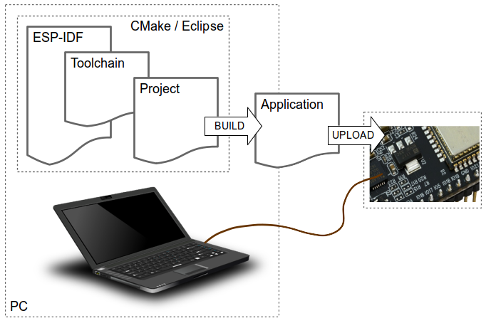

********************************
快速入门 (CMake)
********************************

:link_to_translation:`en:[英文]`

.. include:: ../cmake-warning.rst

.. include:: ../cmake-pending-features.rst

本文档旨在指导用户创建 ESP32 的软件环境。本文将通过一个简单的例子，说明 ESP-IDF (Espressif IoT Development Framework) 的使用方法，包括配置、编译、下载固件到开发板等步骤。

.. include:: /_build/inc/version-note.inc

概述
============

ESP32 是一套 Wi-Fi (2.4 GHz) 和蓝牙 (4.2) 双模解决方案，集成了高性能的 CPU 内核、超低功耗协处理器和丰富的外设。ESP32 采用 40 nm 工艺制成，具有最佳的功耗性能、射频性能、稳定性、通用性和可靠性，适用于各种应用和不同功耗需求。

乐鑫为用户提供完整的软、硬件资源，支持 ESP32 设备的开发。我们的软件开发环境 ESP-IDF 能够帮助用户快速开发物联网 (IoT) 应用，满足用户对于 Wi-Fi、蓝牙、低功耗等性能的需求。

准备工作
====================

开发 ESP32 应用程序需要准备：

* **电脑**：安装 Windows、Linux 或者 Mac 操作系统
* **工具链**：用于编译 ESP32 代码
* **编译工具**：用于编译 ESP32 完整**应用程序**的 CMake 和 Ninja
* **ESP-IDF**：包含 ESP32 API 和用于操作 **工具链** 的脚本
* **文本编辑器**：编写 C 语言程序，例如 `Eclipse <https://www.eclipse.org/>`_
* **ESP32 开发板** 和将其连接到 **电脑** 的 **USB 线**

    开发应用程序

开发环境的准备工作包括以下两部分：

1. 设置 **工具链**
2. 从 GitHub 上获取 **ESP-IDF** 

开发环境设置完成后，遵循以下步骤创建 ESP-IDF 应用程序：

1. 配置**工程** 并编写代码
2. 编译**工程** 并链接成一个**应用程序**
3. 通过 USB/串口连接，烧录（上传）预编译的**应用程序**到 **ESP32**
4. 通过 USB/串口，监视/调试**应用程序**输出 

.. The label below is placeholder to link a new section "Installation Step by Step"

.. _get-started-step-by-step-cmake:

开发板指南
========================

如果你有下列任一 ESP32 开发板，请点击对应的链接进行硬件设置：

.. toctree::
    :maxdepth: 1

    ESP32 DevKitC <get-started-devkitc>
    ESP-WROVER-KIT <get-started-wrover-kit>
    ESP32-PICO-KIT <get-started-pico-kit>

如果你使用其它开发板，请查看下面的内容。

.. _get-started-setup-toolchain-cmake:

设置工具链
======================

用 ESP32 进行开发最快的方法是安装预编译的工具链。请根据你的操作系，点击对应的链接，并按照链接中的指导进行安装。

.. toctree::
    :hidden:

    Windows <windows-setup>
    Linux <linux-setup> 
    MacOS <macos-setup> 

+-------------------+-------------------+-------------------+
| |windows-logo|    | |linux-logo|      | |macos-logo|      |
+-------------------+-------------------+-------------------+
| `Windows`_        | `Linux`_          | `Mac OS`_         |
+-------------------+-------------------+-------------------+

.. |windows-logo| image:: ../../_static/windows-logo.png
    :target: ../get-started-cmake/windows-setup.html

.. |linux-logo| image:: ../../_static/linux-logo.png
    :target: ../get-started-cmake/linux-setup.html

.. |macos-logo| image:: ../../_static/macos-logo.png
    :target: ../get-started-cmake/macos-setup.html

.. _Windows: ../get-started-cmake/windows-setup.html
.. _Linux: ../get-started-cmake/linux-setup.html
.. _Mac OS: ../get-started-cmake/macos-setup.html

.. note::

    我们使用用户名主目录下的 ``esp`` 子目录（Linux 和 MacOS 为 ``~/esp``，Windows 为 ``%userprofile%\esp``）来进行一切有关 ESP-IDF 的安装操作。你也可以使用其他目录，但是需要注意调整相应的指令。

你可以安装预编译的工具链或者自定义你的环境，这完全取决于个人经验和偏好。如果你要自定义环境，请参考 :ref:`get-started-customized-setup-cmake`。

工具链设置完成后，继续阅读 :ref:`get-started-get-esp-idf-cmake` 一节。

.. _get-started-get-esp-idf-cmake:

获取 ESP-IDF
==================

工具链（包括用于编译和构建应用程序的程序）安装完成后，你还需要 ESP32 相关的 API/库。你可在乐鑫提供的 `ESP-IDF 仓库 <https://github.com/espressif/esp-idf>`_ 中获取 API/库本地副本。打开终端，切换到你要存放 ESP-IDF 的目录，然后使用 ``git clone`` 命令克隆远程仓库。

Linux 和 MacOS
~~~~~~~~~~~~~~~~~~~~~~~~~~~

获取本地副本：打开终端，切换到你要存放 ESP-IDF 的工作目录，使用 ``git clone`` 命令克隆远程仓库:

.. include:: /_build/inc/git-clone-bash.inc

ESP-IDF 将会被下载到 ``~/esp/esp-idf`` 目录下。

有关在给定情况下使用哪个 ESP-IDF 版本的信息，请参阅 :doc:`/versions` 。

Windows Command Prompt
~~~~~~~~~~~~~~~~~~~~~~~~~~~~~~~~~~

.. include:: /_build/inc/git-clone-windows.inc

ESP-IDF 将会被下载到用户的 ``esp\esp-idf`` 目录下。

有关在给定情况下使用哪个 ESP-IDF 版本的信息，请参阅 :doc:`/versions` 。

.. include:: /_build/inc/git-clone-notes.inc

.. highlight:: bash
.. note::

    注意这里有个 ``--recursive`` 选项。如果你克隆 ESP-IDF 时没有带这个选项，你还需要运行额外的命令来获取子模块::

        cd esp-idf
        git submodule update --init

.. _get-started-setup-path-cmake:

设置环境变量
===========================

ESP-IDF 的正常运行需要设置两个环境变量：

- ``IDF_PATH`` 应设置为 ESP-IDF 根目录的路径。
- ``PATH`` 应包括同一 ``IDF_PATH`` 目录下的 ``tools`` 目录路径。 

你需在你的电脑中设置这两个变量，否则工程将不能编译。

你可以在每次 PC 重启时手动设置，你也可以在用户配置中进行永久设置，具体请参照 :doc:`add-idf_path-to-profile` 小节中的 :ref:`Windows <add-paths-to-profile-windows-cmake>`，:ref:`Linux 和 MacOS <add-idf_path-to-profile-linux-macos-cmake>` 相关指导进行操作。

.. _get-started-start-project-cmake:

创建一个工程
======================

现在可以开始创建 ESP32 应用程序了。为了快速开始，我们这里以 IDF 的 :idf:`examples` 目录下的 :example:`get-started/hello_world` 工程为例进行说明。

将 :example:`get-started/hello_world` 拷贝到 ``~/esp`` 目录：

Linux 和 MacOS
~~~~~~~~~~~~~~~~~~~~~~~~~~~

.. code-block:: bash

    cd ~/esp
    cp -r $IDF_PATH/examples/get-started/hello_world .

Windows Command Prompt
~~~~~~~~~~~~~~~~~~~~~~~~~~~~

.. code-block:: batch

    cd %userprofile%\esp
    xcopy /e /i %IDF_PATH%\examples\get-started\hello_world hello_world

ESP-IDF 的 :idf:`examples` 目录下有一系列示例工程，都可以按照上面的方法进行创建。

你也可以在原有位置创建示例，无需事先拷贝这些示例。

.. important::

    esp-idf 构建系统不支持在路径中存在空格。

.. _get-started-connect-cmake:

连接
=======

还有几个步骤就完成了。在继续后续操作前，先将 ESP32 开发板连接到 PC，然后检查串口号，看看它能否正常通信。如果你不知道如何操作，请查看 :doc:`establish-serial-connection` 中的相关指导。请注意一下端口号，我们在下一步中会用到。

.. _get-started-configure-cmake:

配置
=========

进入 ``hello_world`` 应用程序副本目录，运行 ``menuconfig`` 工程配置工具：

Linux 和 MacOS
~~~~~~~~~~~~~~~~~~~~~

.. code-block:: bash

    cd ~/esp/hello_world
    idf.py menuconfig

Windows Command Prompt
~~~~~~~~~~~~~~~~~~~~~~~~~~~~

.. code-block:: batch

    cd %userprofile%\esp\hello_world
    idf.py menuconfig

.. note:: 如果你收到未发现 ``idf.py`` 的报错信息，查看是否如上 :ref:`get-started-setup-path-cmake` 所述将 ``tools`` 目录添加到你的路径中。如果 ``tools`` 目录中没有 ``idf.py``，查看 :ref:`get-started-get-esp-idf-cmake` 中 CMake 预览所处的分支是否正确。 

.. note:: 对于 Windows 用户而言，Python 2.7 安装器会尝试配置 Windows，关联扩展名为 ``.py`` 的 Python 2 文件。如果单独安装的程序（如 Visual Studio Python 工具）关联到其他 Python 版本，``idf.py`` 可能无法运行（而仅是在 Visual Studio 中打开此文件）。你可以每次运行 ``C:\Python27\python idf.py`` 或更改 Windows 中有关``.py`` 文件的关联设置。

.. note:: 对于 Linux 用户而言，如果默认为 Python 3.x 版本，你需要运行 ``python2 idf.py``。

如果之前的步骤都正确，则会显示下面的菜单：

.. figure:: ../../_static/project-configuration.png
    :align: center
    :alt: Project configuration - Home window
    :figclass: align-center

    工程配置 - 主窗口

下面是一些使用 ``menuconfig`` 的小技巧：

* 使用 up & down 组合键在菜单中上下移动
* 使用 Enter 键进入一个子菜单，Escape 键进入上一层菜单或退出整个菜单
* 输入 ``?`` 查看帮助信息，Enter 键退出帮助屏幕
* 使用空格键或 ``Y`` 和 ``N`` 键来使能 (Yes) 和禁止 (No) 带有复选框 "``[*]``" 的配置项
* 当光标在某个配置项上面高亮时，输入 ``?`` 可以直接查看该项的帮助信息
* 输入 ``/`` 搜索配置项

.. attention::

    如果 ESP32-DevKitC 板载的是 ESP32-SOLO-1 模组，请务必在烧写示例程序之前在 menuconfig 中使能单核模式（:ref:`CONFIG_FREERTOS_UNICORE`）。

.. _get-started-build-cmake:

创建一个工程
==========================

.. highlight:: bash

现在可以编译工程了，执行指令::

    idf.py build

这条命令会编译应用程序和所有的 ESP-IDF 组件，生成 bootloader、区分表和应用程序 bin 文件。

.. code-block:: none

   $ idf.py build
   Running cmake in directory /path/to/hello_world/build
   Executing "cmake -G Ninja --warn-uninitialized /path/to/hello_world"...
   Warn about uninitialized values.
   -- Found Git: /usr/bin/git (found version "2.17.0")
   -- Building empty aws_iot component due to configuration
   -- Component names: ...
   -- Component paths: ...
   
   ... (more lines of build system output)
   
   [527/527] Generating hello-world.bin
   esptool.py v2.3.1
   
   Project build complete. To flash, run this command:
   ../../../components/esptool_py/esptool/esptool.py -p (PORT) -b 921600 write_flash --flash_mode dio --flash_size detect --flash_freq 40m 0x10000 build/hello-world.bin  build 0x1000 build/bootloader/bootloader.bin 0x8000 build/partition_table/partition-table.bin
   or run 'idf.py -p PORT flash'

如果没有任何报错，将会生成 bin 文件，至此编译完成。

.. _get-started-flash-cmake:

烧录到设备
==========================

现在可以将应用程序烧录到 ESP32 板子上，执行指令::

    idf.py -p PORT flash

将端口改为 ESP32 板子的串口名称。Windows 平台的端口名称类似 ``COM1``，而 MacOS 则以 ``/dev/cu.`` 开头，Linux 则是 ``/dev/tty``。详情请参照 :doc:`establish-serial-connection`。

该步骤旨在将此前编译的 bin 文件烧录到 ESP32 板子上。

.. note:: 无需在 ``idf.py flash`` 之前运行 ``idf.py build``，烧录这一步会按照烧录前编写的要求（如有）自动编写工程。

.. code-block:: none

    Running esptool.py in directory [...]/esp/hello_world
    Executing "python [...]/esp-idf/components/esptool_py/esptool/esptool.py -b 460800 write_flash @flash_project_args"...
    esptool.py -b 460800 write_flash --flash_mode dio --flash_size detect --flash_freq 40m 0x1000 bootloader/bootloader.bin 0x8000 partition_table/partition-table.bin 0x10000 hello-world.bin
    esptool.py v2.3.1
    Connecting....
    Detecting chip type... ESP32
    Chip is ESP32D0WDQ6 (revision 1)
    Features: WiFi, BT, Dual Core
    Uploading stub...
    Running stub...
    Stub running...
    Changing baud rate to 460800
    Changed.
    Configuring flash size...
    Auto-detected Flash size: 4MB
    Flash params set to 0x0220
    Compressed 22992 bytes to 13019...
    Wrote 22992 bytes (13019 compressed) at 0x00001000 in 0.3 seconds (effective 558.9 kbit/s)...
    Hash of data verified.
    Compressed 3072 bytes to 82...
    Wrote 3072 bytes (82 compressed) at 0x00008000 in 0.0 seconds (effective 5789.3 kbit/s)...
    Hash of data verified.
    Compressed 136672 bytes to 67544...
    Wrote 136672 bytes (67544 compressed) at 0x00010000 in 1.9 seconds (effective 567.5 kbit/s)...
    Hash of data verified.
    
    Leaving...
    Hard resetting via RTS pin...

如果没有任何问题，在烧录的最后阶段，板子将会复位，应用程序 "hello_world" 开始运行。

.. （目前暂不支持）如果你想使用 Eclipse IDE 而不是运行 ``idf.py``，请参考 :doc:`Eclipse guide <eclipse-setup>`。

.. _get-started-build-monitor-cmake:

监视器
================

如果要查看 "hello_world" 程序是否真的在运行，输入命令 ``idf.py -p PORT monitor``。这个命令会启动 :doc:`IDF Monitor <idf-monitor>` 程序::

    $ idf.py -p /dev/ttyUSB0 monitor
    Running idf_monitor in directory [...]/esp/hello_world/build
    Executing "python [...]/esp-idf/tools/idf_monitor.py -b 115200 [...]/esp/hello_world/build/hello-world.elf"...
    --- idf_monitor on /dev/ttyUSB0 115200 ---
    --- Quit: Ctrl+] | Menu: Ctrl+T | Help: Ctrl+T followed by Ctrl+H ---
    ets Jun  8 2016 00:22:57

    rst:0x1 (POWERON_RESET),boot:0x13 (SPI_FAST_FLASH_BOOT)
    ets Jun  8 2016 00:22:57
    ...

在启动消息和诊断消息后，你就能看到 "Hello world!" 程序所打印的消息：

.. code-block:: none

    ...
    Hello world!
    Restarting in 10 seconds...
    I (211) cpu_start: Starting scheduler on APP CPU.
    Restarting in 9 seconds...
    Restarting in 8 seconds...
    Restarting in 7 seconds...

要退出监视器，请使用快捷键 ``Ctrl+]``。

.. note::

    如果串口打印的不是上面显示的消息而是类似下面的乱码::

        e���)(Xn@�y.!��(�PW+)��Hn9a؅/9�!�t5��P�~�k��e�ea�5�jA
        ~zY��Y(1�,1�� e���)(Xn@�y.!Dr�zY(�jpi�|�+z5Ymvp

    或者监视器程序启动失败，那么可能你的开发板用的是 26 MHz 晶振，而大多数开发板用的是 40 MHz 晶振，并且 ESP-IDF 默认的也是这一数值。请退出监视器，回到 :ref:`menuconfig <get-started-configure-cmake>`，将 :ref:`CONFIG_ESP32_XTAL_FREQ_SEL` 改为 26 MHz，然后再次 :ref:`编写和烧录 <get-started-flash-cmake>` 程序。请在 ``idf.py menuconfig`` 的 Component config --> ESP32-specific --> Main XTAL frequency 中配置。

.. note::

   你可以将编写、烧录和监视整合到一步当中，如下所示::

       idf.py -p PORT flash monitor

有关监视器使用的快捷键和其他详情，请参阅 :doc:`IDF Monitor <idf-monitor>`。

有关 ``idf.py`` 的全部命令和选项，请参阅 :ref:`idf.py`。

你已完成 ESP32 的入门！

现在你可以尝试其他的示例工程 :idf:`examples`，或者直接开发自己的应用程序。

更新 ESP-IDF
=============

使用 ESP-IDF 一段时间后，您可能想通过升级来获取新的功能或者修复 bug，最简单的升级方式就是删除已有的 ``esp-idf`` 文件夹然后重新克隆一个，即重复 :ref:`get-started-get-esp-idf` 里的操作。

然后 :doc:`添加 IDF 到工作路径 <add-idf_path-to-profile>`，这样工具链脚本就能够知道这一版本的 ESP-IDF 的具体位置。

另外一种方法是只更新有改动的部分。:ref:`更新步骤取决于现在用的ESP-IDF版本 <updating>`。

相关文档
=================

.. toctree::
    :maxdepth: 1

    add-idf_path-to-profile
    establish-serial-connection
    eclipse-setup
    idf-monitor
    toolchain-setup-scratch

.. _Stable version: https://docs.espressif.com/projects/esp-idf/en/stable/
.. _Releases page: https://github.com/espressif/esp-idf/releases
