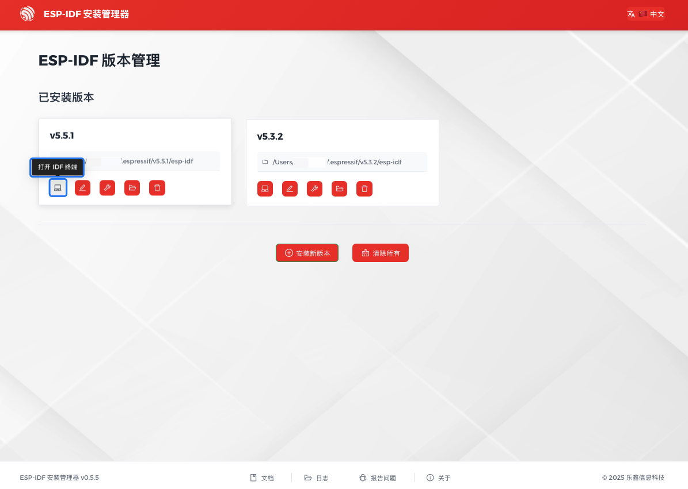

打开 ESP-IDF 安装管理器应用程序 `eim`。

在 ``管理安装`` 下，点击 ``打开仪表板``。

.. figure:: ../../_static/get-started-eim-gui-zh.png
    :align: center
    :alt: EIM 管理安装

    EIM 管理安装

在仪表板中，会看到所有已安装的 ESP-IDF 版本。选择要使用的版本，然后点击 ``打开 IDF 终端``，启动已激活 ESP-IDF 环境的终端。

    EIM 打开 IDF 终端
