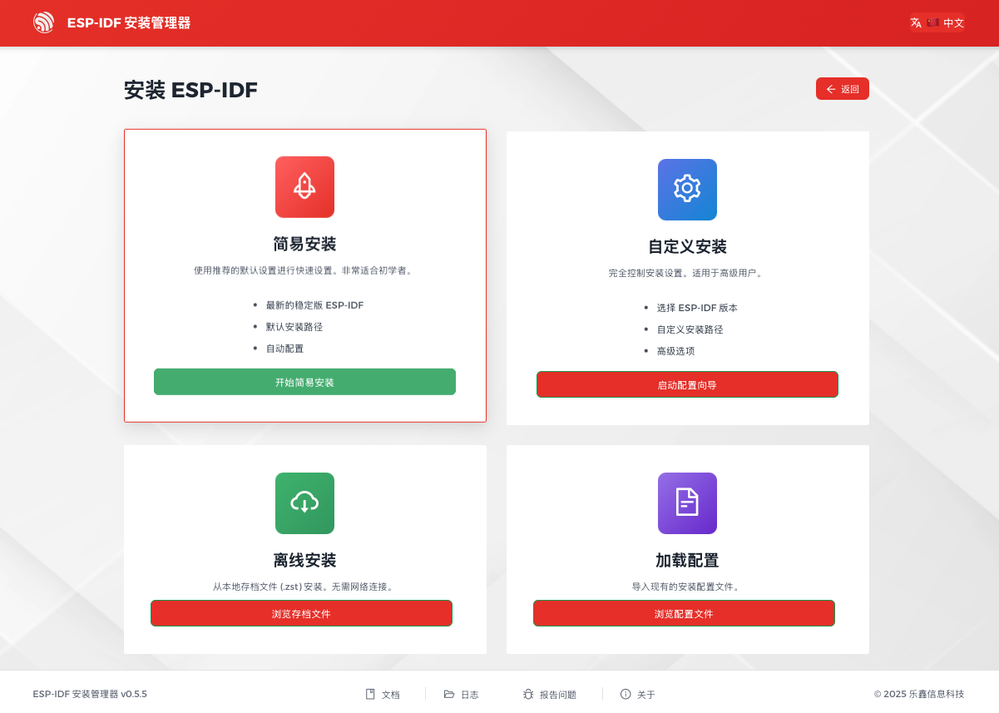
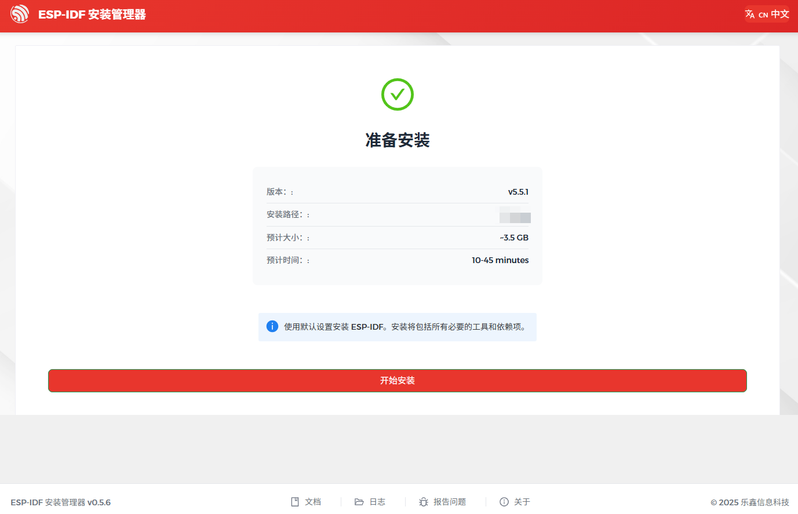
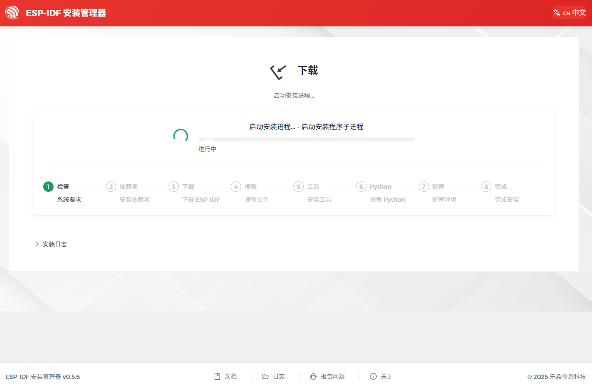
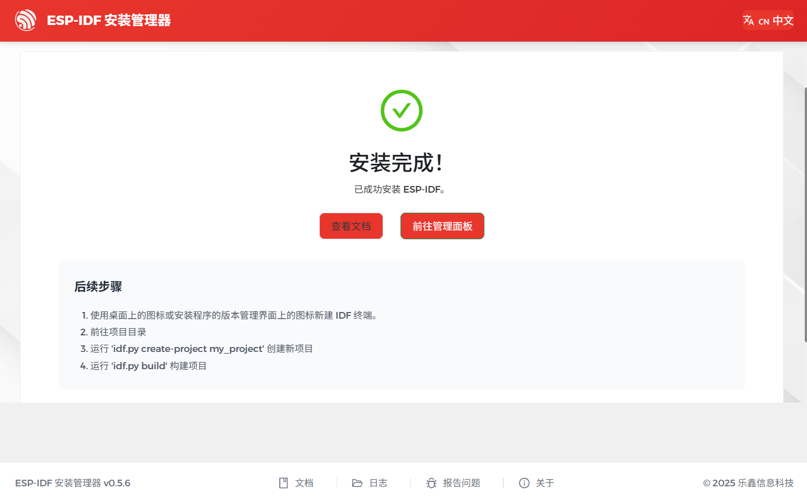

您可以使用以下任一方法安装 ESP-IDF 及其所需工具，具体取决于您的需求：

- `使用 EIM GUI 在线安装`_

  适合大多数用户。通过图形用户界面安装 ESP-IDF 及其所需工具，需要网络连接。
- `使用 EIM CLI 在线安装`_

  通过命令行安装 ESP-IDF 及其所需工具，需要网络连接。
- `使用已有配置文件在线安装`_

  使用从其他电脑复制的配置文件安装 ESP-IDF 及其所需工具，适用于 GUI 和 CLI，但需要网络连接。
- `离线安装`_

  从本地包安装 ESP-IDF 及其所需工具，无需网络连接。

使用 EIM GUI 在线安装
~~~~~~~~~~~~~~~~~~~~~~~~~

打开 ESP-IDF 安装管理器应用程序 `eim`。

之后，在 ``新安装`` 下点击 ``开始安装``。

.. figure:: ../../_static/get-started-eim-gui-zh.png
    :align: center
    :alt: EIM 开始安装

    EIM 开始安装

.. note::

    如果之前未安装过 ESP-IDF，GUI 中不会显示 ``管理安装``，仅显示 ``新安装`` 选项。

在 ``简易安装`` 下，点击 ``开始简易安装``，使用默认设置安装最新稳定版本的 ESP-IDF。

    EIM 简易安装

如果所有先决条件和路径检查都通过，将看到 ``准备安装`` 页面。点击 ``开始安装`` 以开始安装。

    EIM 准备安装

安装过程中，可以直接在界面中查看安装进度。

    EIM 安装中

安装完成后，会出现 ``安装完成`` 页面。

    EIM 安装完成

如果安装失败，可以：

- 点击界面底部的 ``日志`` 查看错误详情。解决问题后，点击 ``重试`` 重新开始安装。
- 或者，使用 `自定义安装 <https://docs.espressif.com/projects/idf-im-ui/en/latest/expert_installation.html>`_。

.. note::

    - 如需选择 ESP-IDF 版本或自定义安装路径，请使用 ``自定义安装``。更多说明请参阅 `EIM 文档 > Expert Installations <https://docs.espressif.com/projects/idf-im-ui/en/latest/expert_installation.html>`__。
    - 如需管理现有安装，请参阅 `EIM 文档 > Version Management <https://docs.espressif.com/projects/idf-im-ui/en/latest/version_management.html>`__。

使用 EIM CLI 在线安装
~~~~~~~~~~~~~~~~~~~~~~~~~

运行以下命令，在非交互模式下使用默认设置安装最新稳定版本的 ESP-IDF：

.. code-block:: bash

    eim install

如果运行上述命令时遇到问题，或者需要自定义安装路径、选择 ESP-IDF 版本或修改其他设置项，请启动交互式安装向导，并按照屏幕上的提示操作：

.. code-block:: bash

    eim wizard

如果安装向导中没有想要安装的 ESP-IDF 版本，请运行以下命令来安装任意可选 `版本 <https://docs.espressif.com/projects/esp-idf/zh_CN/stable/esp32/versions.html#releases>`__。例如，要安装 ESP-IDF v5.4.2，请运行：

.. code-block:: bash

    eim install -i v5.4.2

安装完成后，会在终端中看到以下消息：

.. code-block:: bash

    2025-11-03T15:54:12.537993300+08:00 - INFO - Wizard result: %{r}
    2025-11-03T15:54:12.544174+08:00 - INFO - Successfully installed IDF
    2025-11-03T15:54:12.545913900+08:00 - INFO - Now you can start using IDF tools

.. note::

    - 要查看所有可用选项，请运行：
        .. code-block:: bash

            eim --help
    - 有关 CLI 使用的更多信息，请参阅：

      * `EIM 文档 > CLI Configuration <https://docs.espressif.com/projects/idf-im-ui/en/latest/cli_configuration.html>`__
      * `EIM 文档 > CLI Commands <https://docs.espressif.com/projects/idf-im-ui/en/latest/cli_commands.html>`__

使用已有配置文件在线安装
~~~~~~~~~~~~~~~~~~~~~~~~~

安装 ESP-IDF 时，安装程序会自动将设置保存到安装目录下的 ``eim_config.toml`` 配置文件中。此配置文件可在其他电脑上重复使用，快速复现相同的安装环境。

如需使用现有 ``eim_config.toml`` 文件安装 ESP-IDF，请参阅 `EIM 文档 > Configuration Files <https://docs.espressif.com/projects/idf-im-ui/en/latest/gui_configuration.html#configuration-files>`__。

离线安装
~~~~~~~~

EIM 的图形用户界面和命令行界面均支持离线安装。具体操作请参阅 `EIM 文档 > Offline Installation <https://docs.espressif.com/projects/idf-im-ui/en/latest/offline_installation.html>`__。

后续步骤
==========

至此，您已准备就绪，可以使用 ESP-IDF 开发 ESP-IDF 应用程序了。接下来，请继续阅读 :ref:`get-started-build` 章节，学习如何构建和运行您的第一个应用程序。
