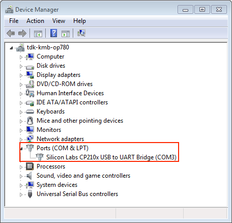
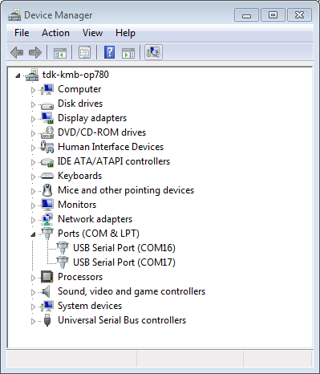
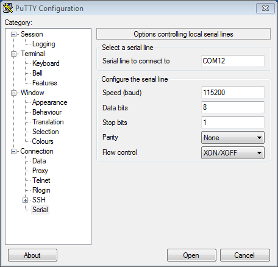
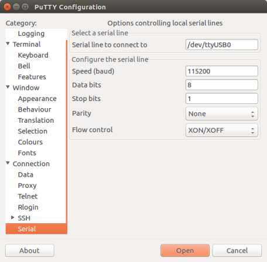

与 {IDF_TARGET_NAME} 创建串口连接
==============================================

:link_to_translation:`en:[English]`

.. only:: not SOC_USB_OTG_SUPPORTED and not SOC_USB_SERIAL_JTAG_SUPPORTED

    可以使用 USB 至 UART 桥，与 {IDF_TARGET_NAME} 创建串口连接。

.. only:: SOC_USB_OTG_SUPPORTED or SOC_USB_SERIAL_JTAG_SUPPORTED

    可以使用 USB 至 UART 桥或 {IDF_TARGET_NAME} 支持的 USB 外设，与 {IDF_TARGET_NAME} 创建串口连接。

部分开发板中已经安装有 USB 至 UART 桥。如未安装，可使用外部桥。

.. only:: SOC_USB_OTG_SUPPORTED or SOC_USB_SERIAL_JTAG_SUPPORTED

    支持的 USB 外设
    ------------------------

    {IDF_TARGET_NAME} 支持 USB 外设。无需 USB 至 UART 桥，便可直接烧录设备。

    .. blockdiag::
        :scale: 70%
        :caption: 支持 USB 的 SoC
        :align: center

        blockdiag usb_capable_esp {

            node_height = 80;
            span_width = 160;
            span_height = 140;
            default_fontsize = 16

            # labels of diagram nodes
            PC [label="Personal\n Computer"];
            CHIP [label="{IDF_TARGET_NAME}", width=120];
            DUMMY [shape=none, width=1]

                # node connections
                PC  <- DUMMY [label = "USB", fontsize=14];
                DUMMY -> CHIP [fontsize=14];

                group {
                    shape = line;
                    style = dotted;
                    color = "#FF0000";
                    label = "Development Board\n\n\n";
                    CHIP; DUMMY;
                }

        }

    部分支持 USB 外设的开发板同时也包含 USB 至 UART 桥。

安装有 USB 至 UART 桥的开发板
---------------------------------------

在安装有 USB 至 UART 桥的开发板中，PC 和桥之间通过 USB 连接，桥和 {IDF_TARGET_NAME} 之间通过 UART 连接。

.. blockdiag::
    :caption: 安装有 USB 至 UART 桥的开发板
    :align: center

    blockdiag esp_dev_board_with_usb_to_uart_bridge {

        node_height = 80;
        span_width = 160;
        span_height = 140;
        default_fontsize = 16

        # labels of diagram nodes
        PC [label="Personal\nComputer"];
        BRIDGE [label="USB-to-UART\n Bridge"];
        CHIP [label="{IDF_TARGET_NAME}", width=120];

            # node connections
            PC <-> BRIDGE [label = "USB", fontsize=14];
            BRIDGE <-> CHIP [label = "UART", fontsize=14];

            group {
                shape = line;
                style = dotted;
                color = "#FF0000";
                label = "Developmment Board\n\n\n";
                BRIDGE; CHIP;
            }
    }

外部 USB 至 UART 桥
---------------------------

部分开发板使用外部 USB 至 UART 桥。这种情况通常出现在需要控制空间和成本的产品中，例如一些小型开发板或成品。

.. blockdiag::
    :caption: 外部 USB 至 UART 桥
    :align: center

    blockdiag external_usb_to_uart_bridge_to_esp {

        node_height = 80;
        span_width = 160;
        span_height = 140;
        default_fontsize = 16

        # labels of diagram nodes
        PC [label="Personal\n Computer"];
        BRIDGE [label="USB-to-UART\n Bridge", width=180];
        CHIP [label="{IDF_TARGET_NAME}", width=120];
        DUMMY [shape=none, width=1]

            # node connections
            PC <-> BRIDGE [label = "USB", fontsize=14];
            BRIDGE <- DUMMY [label = "UART", fontsize=14];
            DUMMY -> CHIP [fontsize=14];

            group {
                shape = line;
                style = dotted;
                color = "#FF0000";
                label = "Programmmer Board\n\n\n";
                BRIDGE
            }
            group {
                shape = line;
                style = dotted;
                color = "#FF0000";
                label = "Development Board\n\n\n";
                CHIP; DUMMY;
            }
    }

.. only:: SOC_USB_OTG_SUPPORTED or SOC_USB_SERIAL_JTAG_SUPPORTED

    使用 USB 进行烧录
    ------------------

    {IDF_TARGET_NAME} 支持 USB 外设，无需外部 USB 至 UART 桥，即可烧录二进制文件。

    {IDF_TARGET_USB_PIN_DM:default="尚未更新！", esp32c3="GPIO18", esp32s3="GPIO19", esp32s2="GPIO19", esp32c6="GPIO12", esp32h2="GPIO26", esp32p4="GPIO24/26", esp32c5="GPIO13", esp32c61="GPIO28"}
    {IDF_TARGET_USB_PIN_DP:default="尚未更新！", esp32c3="GPIO19", esp32s3="GPIO20", esp32s2="GPIO20", esp32c6="GPIO13", esp32h2="GPIO27", esp32p4="GPIO25/27", esp32c5="GPIO14", esp32c61="GPIO29"}

    {IDF_TARGET_NAME} 上的 USB 使用 **{IDF_TARGET_USB_PIN_DP}** 作为 **D+**， **{IDF_TARGET_USB_PIN_DM}** 作为 **D-**。

    .. only:: SOC_USB_SERIAL_JTAG_SUPPORTED and not esp32s3 and not esp32p4

        .. note:: {IDF_TARGET_NAME} 仅支持 *USB CDC and JTAG*。

        首次烧录需要手动设置 {IDF_TARGET_NAME} 进入下载模式。请按住 ``BOOT`` 按钮，同时按一下 ``RESET`` 按钮。之后，松开 ``BOOT`` 按钮。

    .. only:: esp32s3

        首次烧录需要手动设置 {IDF_TARGET_NAME} 进入下载模式。请按住 ``BOOT`` 按钮，同时按一下 ``RESET`` 按钮。之后，松开 ``BOOT`` 按钮。

    .. only:: esp32s2

        二进制文件烧录完成后，需要手动进行复位。

使用 UART 进行烧录
---------------------

本节描述如何使用 USB 至 UART 桥在 {IDF_TARGET_NAME} 和 PC 之间建立串行连接。板上桥与外部桥均适用。

连接 {IDF_TARGET_NAME} 和 PC
^^^^^^^^^^^^^^^^^^^^^^^^^^^^^^^

用 USB 线将 {IDF_TARGET_NAME} 开发板连接到 PC。如果设备驱动程序没有自动安装，请先确认 {IDF_TARGET_NAME} 开发板上的 USB 至 UART 桥（或外部转 UART 适配器）型号，然后在网上搜索驱动程序，并进行手动安装。

以下是乐鑫 {IDF_TARGET_NAME} 开发板驱动程序的链接：

* CP210x: `CP210x USB 至 UART 桥 VCP 驱动程序 <https://www.silabs.com/developers/usb-to-uart-bridge-vcp-drivers>`_
* FTDI: `FTDI 虚拟 COM 端口驱动程序 <https://ftdichip.com/drivers/vcp-drivers/>`_

以上驱动仅供参考，请查看开发板用户指南，了解开发板具体使用的 USB 至 UART 桥芯片。一般情况下，当 {IDF_TARGET_NAME} 开发板与 PC 连接时，对应驱动程序应该已经被打包在操作系统中，并已经自动安装。

对于使用 USB 至 UART 桥下载的设备，可以运行以下命令，包括定义波特率的可选参数。

.. code-block:: bash

    idf.py -p PORT [-b BAUD] flash

将 ``PORT`` 替换为 {IDF_TARGET_NAME} 开发板的串口名称。``-b`` 为可选参数，默认的波特率为 ``460800``。如需改变烧录器的波特率，请用需要的波特率代替 ``BAUD``。

要查看串口名称，Windows 用户请参考 `check-port-on-windows`_，Linux 与 macOS 用户请参考 `check-port-on-linux-and-macos`_。

例如，Windows 平台上串口名称为 ``COM3``，所需波特率为 ``115200``，可使用如下命令烧录开发板：

.. code-block:: bash

    idf.py -p COM3 -b 115200 flash

Linux 平台上串口名称为 ``/dev/ttyUSB0``，所需波特率为 ``115200``，可使用如下命令烧录开发板：

.. code-block:: bash

    idf.py -p /dev/ttyUSB0 -b 115200 flash

macOS 平台上串口名称为 ``/dev/cu.usbserial-1401``，所需波特率为 ``115200``，可使用如下命令烧录开发板：

.. code-block:: bash

    idf.py -p /dev/cu.usbserial-1401 -b 115200 flash

.. note::

    如果设备不支持自动下载模式，则需要手动进入下载模式。请按住 ``BOOT`` 按钮，同时按一下 ``RESET`` 按钮。之后，松开 ``BOOT`` 按钮。

.. _check-port-on-windows:

在 Windows 上查看端口
---------------------

检查 Windows 设备管理器中的 COM 端口列表。断开 {IDF_TARGET_NAME} 与 PC 的连接，然后重新连接，查看哪个端口从列表中消失后又再次出现。

以下为 ESP32 DevKitC 和 ESP32 WROVER KIT 串口：

    设备管理器中 ESP32-DevKitC 的 USB 至 UART 桥

    Windows 设备管理器中 ESP-WROVER-KIT 的两个 USB 串行端口

.. _check-port-on-linux-and-macos:

在 Linux 和 macOS 上查看端口
-----------------------------

查看 {IDF_TARGET_NAME} 开发板（或外部转串口适配器）的串口设备名称，请将以下命令运行两次。首先，断开开发板或适配器，首次运行以下命令；然后，连接开发板或适配器，再次运行以下命令。其中，第二次运行命令后出现的端口即是 {IDF_TARGET_NAME} 对应的串口：

Linux::

    ls /dev/tty*

macOS::

    ls /dev/cu.*

.. 注解::

    对于 macOS 用户：若没有看到串口，请检查是否安装 USB/串口驱动程序。具体应使用的驱动程序，见章节 `连接 {IDF_TARGET_NAME} 和 PC`_。对于 macOS High Sierra (10.13) 的用户，你可能还需要手动允许驱动程序的加载，具体可打开 ``系统偏好设置`` -> ``安全和隐私`` -> ``通用``，检查是否有信息显示：“来自开发人员的系统软件...”，其中开发人员的名称为 Silicon Labs 或 FTDI。

.. _linux-dialout-group:

在 Linux 中添加用户到 ``dialout`` 或 ``uucp`` 组
--------------------------------------------------

当前登录用户应当可以通过 USB 对串口进行读写操作。在多数 Linux 版本中，都可以通过以下命令，将用户添加到 ``dialout`` 组，从而获许读写权限::

    sudo usermod -a -G dialout $USER

在 Arch Linux 中，需要通过以下命令将用户添加到 ``uucp`` 组中::

    sudo usermod -a -G uucp $USER

.. note::

    请重新登录，确保串口读写权限生效。

确认串口连接
------------------------

现在，请使用串口终端程序，查看重置 {IDF_TARGET_NAME} 后终端上是否有输出，从而验证串口连接是否可用。

.. only:: esp32c2

    使用 40 MHz 的 XTAL 时，ESP32-C2 的控制台波特率默认为 115200；使用 26 MHz 的 XTAL 时，其波特率默认为 74880。

.. only:: not esp32c2

    {IDF_TARGET_NAME} 的控制台波特率默认为 115200。

Windows 和 Linux 操作系统
^^^^^^^^^^^^^^^^^^^^^^^^^^^^

在本示例中，我们使用 `PuTTY SSH Client <https://putty.software/>`_，该工具可在 Windows 和 Linux 上使用。你也可以使用其他串口程序，并按照下方所示设置通信参数。

运行终端，配置在上述步骤中确认的串口：波特率 = 115200（如有需要，请更改为使用芯片的默认波特率），数据位 = 8，停止位 = 1，奇偶校验 = N。以下截屏分别展示了如何在 Windows 和 Linux 中配置串口和上述通信参数（如 115200-8-1-N）。注意，这里一定要选择在上述步骤中确认的串口进行配置。

    在 Windows 操作系统中使用 PuTTY 设置串口通信参数

    在 Linux 操作系统中使用 PuTTY 设置串口通信参数

然后，请检查 {IDF_TARGET_NAME} 是否有打印日志。如有，请在终端打开串口进行查看。这里的日志内容取决于加载到 {IDF_TARGET_NAME} 的应用程序，请参考 `输出示例`_。如果没有看到输出日志，请参考 `故障排除`_。

.. 注解::

   请在验证完串口通信正常后，关闭串口终端。如果终端一直保持打开的状态，之后上传固件时将无法访问串口。

macOS 操作系统
^^^^^^^^^^^^^^^^^

macOS 提供了 **屏幕** 命令，因此无需安装串口终端程序。

- 参考 `在 Linux 和 macOS 上查看端口`_，运行以下命令::

    ls /dev/cu.*

- 会看到类似如下输出::

    /dev/cu.Bluetooth-Incoming-Port /dev/cu.SLAB_USBtoUART      /dev/cu.SLAB_USBtoUART7

- 根据连接到电脑上的开发板类型和数量，输出结果会有所不同。请选择开发板的设备名称，并运行以下命令（如有需要，请将“115200”更改为使用芯片的默认波特率）::

    screen /dev/cu.device_name 115200

将 ``device_name`` 替换为运行 ``ls /dev/cu.*`` 后出现的设备串口号。

- **屏幕** 显示的日志即为所需内容。日志内容取决于加载到 {IDF_TARGET_NAME} 的应用程序，请参考 `输出示例`_。如果没有看到输出日志，请参考 `故障排除`_。请使用 ``Ctrl-A + K`` 键退出当前 **屏幕** 会话。

.. 注解::

   请在验证完串口通信正常后，关闭 **当前屏幕会话**。如果直接关闭终端窗口而没有关闭 **屏幕**，之后上传固件时将无法访问串口。

故障排除
^^^^^^^^^^^^^^^

如果没有日志输出，请检查以下原因：

- {IDF_TARGET_NAME} 的供电是否正常
- 启动终端程序后，是否重置开发板
- 使用 `在 Windows 上查看端口`_ 与 `在 Linux 和 macOS 上查看端口`_ 中描述的方法，检查所选串口是否正确
- 其他程序是否正在使用该串口
- 串口终端程序中的串口设置是否适用于该应用程序
- 应用程序是否会输出日志。具体来说，如果在 ``Component config`` > ``Log`` > ``Log Level`` > ``Default log verbosity (Info)`` 中设置为 ``No output``，则不会打印出任何日志。你可以在 ``menuconfig`` 中更改该设置。
- 是否禁用了日志输出（使用 :example:`hello world 示例 <get-started/hello_world>` 进行测试）

输出示例
^^^^^^^^^^^

{IDF_TARGET_STRAP_GPIO:default="[NEEDS TO BE UPDATED]", esp32="GPIO0", esp32s2="GPIO0", esp32s3="GPIO0", esp32c2="GPIO9", esp32c3="GPIO9", esp32c6="GPIO9", esp32h2="GPIO9", esp32p4="GPIO35", esp32c5="GPIO28", esp32c61="GPIO9"}

以下是一个日志示例。如果没看到任何输出，请尝试重置开发板。

.. highlight:: none

::

    ets Jun  8 2016 00:22:57

    rst:0x5 (DEEPSLEEP_RESET),boot:0x13 (SPI_FAST_FLASH_BOOT)
    ets Jun  8 2016 00:22:57

    rst:0x7 (TG0WDT_SYS_RESET),boot:0x13 (SPI_FAST_FLASH_BOOT)
    configsip: 0, SPIWP:0x00
    clk_drv:0x00,q_drv:0x00,d_drv:0x00,cs0_drv:0x00,hd_drv:0x00,wp_drv:0x00
    mode:DIO, clock div:2
    load:0x3fff0008,len:8
    load:0x3fff0010,len:3464
    load:0x40078000,len:7828
    load:0x40080000,len:252
    entry 0x40080034
    I (44) boot: ESP-IDF v2.0-rc1-401-gf9fba35 2nd stage bootloader
    I (45) boot: compile time 18:48:10
    ...

如果打印出的日志是可读的（而不是乱码），则表示串口连接正常。此时，可以继续进行安装，并最终将应用程序上载到 {IDF_TARGET_NAME}。

.. 注解::

   在某些串口接线方式下，在 {IDF_TARGET_NAME} 启动并开始打印串口日志前，需要在终端程序中禁用串口 RTS ＆ DTR 管脚。该问题仅存在于将 RTS ＆ DTR 管脚直接连接到 EN ＆ {IDF_TARGET_STRAP_GPIO} 管脚上的情况，绝大多数开发板（包括乐鑫所有的开发板）都没有这个问题。更多详细信息，请参考 `esptool 文档`_。

如在安装 {IDF_TARGET_NAME} 硬件开发的软件环境时，从 :ref:`Windows <get-started-connect>`、:ref:`Linux 或 macOS 连接设备 <get-started-connect-linux-macos>` 跳转到了这里，请从 :ref:`Windows <get-started-configure>`、:ref:`Linux 或 macOS 配置项目 <get-started-configure-linux-macos>` 继续阅读。

.. _esptool 文档: https://docs.espressif.com/projects/esptool/en/latest/advanced-topics/boot-mode-selection.html#automatic-bootloader
